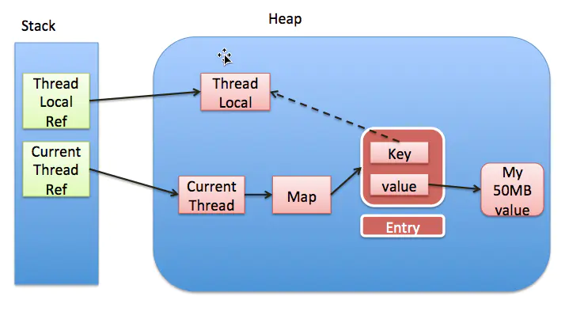

#  ThreadLocal内存泄漏

**实线代表强引用,虚线代表弱引用**

每一个Thread维护一个ThreadLocalMap, key为使用**弱引用**的ThreadLocal实例，value为线程变量的副本。

**强引用**，使用最普遍的引用，一个对象具有强引用，不会被垃圾回收器回收。当内存空间不足，Java虚拟机宁愿抛出OutOfMemoryError错误，使程序异常终止，也不回收这种对象。

**如果想取消强引用和某个对象之间的关联，可以显式地将引用赋值为null，这样可以使JVM在合适的时间就会回收该对象。**

**弱引用**，JVM进行垃圾回收时，无论内存是否充足，都会回收被弱引用关联的对象。在java中，用java.lang.ref.WeakReference类来表示。

