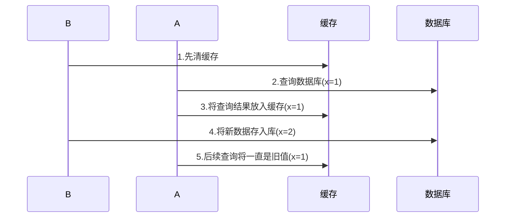
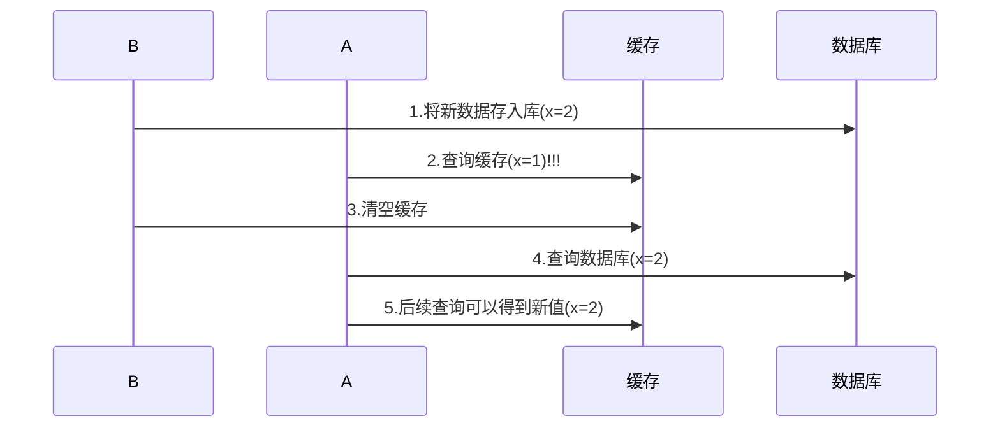
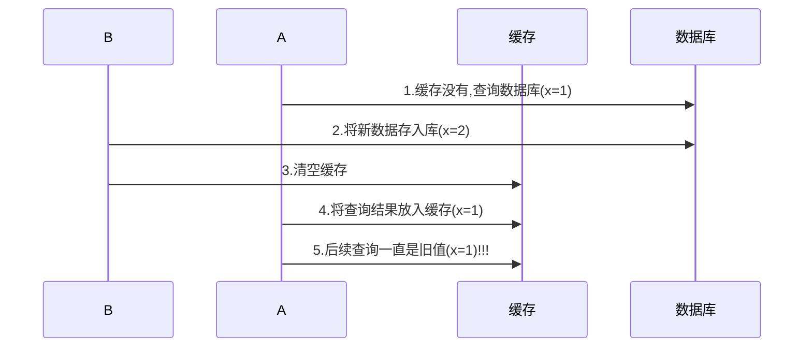

# 应用

<hr>

[TOC]


<hr>


# 限制


## 使用多线程充分利用 CPU


### 1.1 限制对 CPU 的使用


#### sleep实现

在没有利用 cpu 来计算时，不要让 while(true) 空转浪费 cpu，这时可以使用 yield 或 sleep 来让出 cpu 的使用权给其他程序

```java
while(true){
    try {
        Thread.sleep(100L);
    } catch (InterruptedException e) {
        throw new RuntimeException(e);
    }
}
```

* 可以用 wait 或 条件变量达到类似的效果
* 不同的是，后两种都需要加锁，并且需要相应的唤醒操作，一般适用于要进行同步的场景
* sleep 适用于无需锁同步的场景


# 统筹

## 案例-烧水泡茶


### 解法1-join

```java
public static void main(String[] args) {
    Thread t1 = new Thread(() -> {
        log.info("洗水壶...");
        sleep(1);
        log.info("烧开水...");
        sleep(5);
    }, "t1");
    t1.start();

    Thread t2 = new Thread(() -> {
        log.info("洗茶壶");
        sleep(1);
        log.info("洗茶杯");
        sleep(2);
        log.info("拿茶叶");
        sleep(1);
        try {
            t1.join();
        } catch (InterruptedException e) {
            throw new RuntimeException(e);
        }
        log.info("泡茶");
    }, "t2");
    t2.start();
}
```

输出

```
18:01:11 [t2] com.wjl.juc.j2.u10.Tea - 洗茶壶
18:01:11 [t1] com.wjl.juc.j2.u10.Tea - 洗水壶...
18:01:12 [t1] com.wjl.juc.j2.u10.Tea - 烧开水...
18:01:12 [t2] com.wjl.juc.j2.u10.Tea - 洗茶杯
18:01:14 [t2] com.wjl.juc.j2.u10.Tea - 拿茶叶
18:01:17 [t2] com.wjl.juc.j2.u10.Tea - 泡茶
```

解法1的缺陷

* 上面模拟的是小王(t2)等老王(t1)的水烧开了，小王泡茶，如果反过来要实现老王等小王的茶叶拿来了，老王泡茶呢？代码最好能适应两种情况
* 上面的两个线程其实是各执行各的，如果要模拟老王把水壶交给小王泡茶，或模拟小王把茶叶交给老王泡茶呢

# 缓存

## 1. 准备

#### Emp

```java
@Data
public class Emp{
    private int empno;
    private String ename;
    private String job;
    private BigDecimal sal;
}
```

#### Sql

```sql
create table emp (
    empno int primary key auto_increment,
    ename varchar(50) not null,
    job varchar(50),
    sal DECIMAL(10,2)
);

insert into emp value(null,'张三','经理','10000.00');
insert into emp value(null,'李四','经副理','90000.00');
```

#### Dao

```java
public class GenericDao {
    public static String URL = "jdbc:mysql://localhost:3306/wjl";
    public static String USERNAME = "root";
    public static String PASSWORD = "123456";

    public <T> List<T> queryList(Class<T> beanClass, String sql, Object... args) {
        System.out.println("sql: [" + sql + "] params:" + Arrays.toString(args));
        BeanRowMapper<T> mapper = new BeanRowMapper<>(beanClass);
        return queryList(sql, mapper, args);
    }

    public <T> T queryOne(Class<T> beanClass, String sql, Object... args) {
        System.out.println("sql: [" + sql + "] params:" + Arrays.toString(args));
        BeanRowMapper<T> mapper = new BeanRowMapper<>(beanClass);
        return queryOne(sql, mapper, args);
    }

    private <T> List<T> queryList(String sql, RowMapper<T> mapper, Object... args) {
        try (Connection conn = DriverManager.getConnection(URL, USERNAME, PASSWORD)) {
            try (PreparedStatement psmt = conn.prepareStatement(sql)) {
                if (args != null) {
                    for (int i = 0; i < args.length; i++) {
                        psmt.setObject(i + 1, args[i]);
                    }
                }
                List<T> list = new ArrayList<>();
                try (ResultSet rs = psmt.executeQuery()) {
                    while (rs.next()) {
                        T obj = mapper.map(rs);
                        list.add(obj);
                    }
                }
                return list;
            }
        } catch (SQLException e) {
            throw new RuntimeException(e);
        }
    }

    private <T> T queryOne(String sql, RowMapper<T> mapper, Object... args) {
        List<T> list = queryList(sql, mapper, args);
        return list.size() == 0 ? null : list.get(0);
    }

    public int update(String sql, Object... args) {
        System.out.println("sql: [" + sql + "] params:" + Arrays.toString(args));
        try (Connection conn = DriverManager.getConnection(URL, USERNAME, PASSWORD)) {
            try (PreparedStatement psmt = conn.prepareStatement(sql)) {
                if (args != null) {
                    for (int i = 0; i < args.length; i++) {
                        psmt.setObject(i + 1, args[i]);
                    }
                }
                return psmt.executeUpdate();
            }
        } catch (SQLException e) {
            throw new RuntimeException(e);
        }
    }

    interface RowMapper<T> {
        T map(ResultSet rs);
    }

    static class BeanRowMapper<T> implements RowMapper<T> {

        private Class<T> beanClass;
        private Map<String, PropertyDescriptor> propertyMap = new HashMap<>();

        public BeanRowMapper(Class<T> beanClass) {
            this.beanClass = beanClass;
            try {
                BeanInfo beanInfo = Introspector.getBeanInfo(beanClass);
                PropertyDescriptor[] propertyDescriptors = beanInfo.getPropertyDescriptors();
                for (PropertyDescriptor pd : propertyDescriptors) {
                    propertyMap.put(pd.getName().toLowerCase(), pd);
                }
            } catch (IntrospectionException e) {
                throw new RuntimeException(e);
            }
        }

        @Override
        public T map(ResultSet rs) {
            try {
                ResultSetMetaData metaData = rs.getMetaData();
                int columnCount = metaData.getColumnCount();
                T t = beanClass.newInstance();
                for (int i = 1; i <= columnCount; i++) {
                    String columnLabel = metaData.getColumnLabel(i);
                    PropertyDescriptor pd = propertyMap.get(columnLabel.toLowerCase());
                    if (pd != null) {
                        pd.getWriteMethod().invoke(t, rs.getObject(i));
                    }
                }
                return t;
            } catch (SQLException | InstantiationException | IllegalAccessException | InvocationTargetException e) {
                throw new RuntimeException(e);
            }
        }
    }
}
```

#### Test

```java
GenericDao dao = new GenericDao();
System.out.println("============> 查询");
String sql = "select * from emp where empno = ?";
int empno = 1;
Emp emp = dao.queryOne(Emp.class, sql, empno);
System.out.println(emp);
emp = dao.queryOne(Emp.class, sql, empno);
System.out.println(emp);
emp = dao.queryOne(Emp.class, sql, empno);
System.out.println(emp);

System.out.println("============> 更新");
dao.update("update emp set sal = ? where empno = ?", 800, empno);
emp = dao.queryOne(Emp.class, sql, empno);
System.out.println(emp);
```


## 2. 编写Cache


### 2.1 缓存更新策略

#### 先清缓存



#### 先更新数据库



补充一种情况，假设查询线程 A 查询数据时恰好缓存数据由于时间到期失效，或是第一次查询

这种情况的出现几率非常小，见 facebook 论文




### 2.2 代码实现

```java
@Slf4j
class GenericDaoCached extends GenericDao {

    private ReentrantReadWriteLock rw = new ReentrantReadWriteLock();

    private GenericDao dao = new GenericDao();

    private Map<SqlPair, Object> cache = new HashMap<>();

    @Override
    public <T> T queryOne(Class<T> beanClass, String sql, Object... args) {
        T t;
        rw.readLock().lock();
        SqlPair pair;
        try {
            // 首先从缓存获取 没有查询数据库
            pair = new SqlPair(sql, args);
            t = (T) cache.get(pair);
            if (t != null) {
                log.debug("cache...{}", t);
                return t;
            }
        } finally {
            rw.readLock().unlock();
        }

        rw.writeLock().lock();
        try {
            // 双重检查 防止下一个抢占锁的线程 错误/多余执行
            t = (T) cache.get(pair);
            if (t != null) {
                log.debug("cache...{}", t);
                return t;
            }
            t = dao.queryOne(beanClass, sql, args);
            cache.put(pair, t);
            return t;
        } finally {
            rw.writeLock().unlock();        }

    }

    @Override
    public int update(String sql, Object... args) {
        rw.writeLock().lock();
        try {
            // 先更新库再更新缓存比较合理
            int update = dao.update(sql, args);
            cache.clear();
            return update;
        } finally {
            rw.writeLock().unlock();
        }
    }
}

// 作为 key 保证其是不可变的
@AllArgsConstructor
class SqlPair {
    private String sqlStr;
    private Object[] args;

    @Override
    public boolean equals(Object o) {
        if (this == o) return true;
        if (o == null || getClass() != o.getClass()) return false;
        SqlPair sqlPair = (SqlPair) o;
        return Objects.equals(sqlStr, sqlPair.sqlStr) && Arrays.equals(args, sqlPair.args);
    }

    @Override
    public int hashCode() {
        int result = Objects.hash(sqlStr);
        result = 31 * result + Arrays.hashCode(args);
        return result;
    }
}
```


> **注意**
>
> * 以上实现体现的是读写锁的应用，保证缓存和数据库的一致性，但有下面的问题没有考虑
>   * 适合读多写少，如果写操作比较频繁，以上实现性能低
>   * 没有考虑缓存容量
>   * 没有考虑缓存过期
>   * 只适合单机
>   * 并发性还是低，目前只会用一把锁
>   * 更新方法太过简单粗暴，清空了所有 key（考虑按类型分区或重新设计 key）
> * 乐观锁实现：用 CAS 去更新