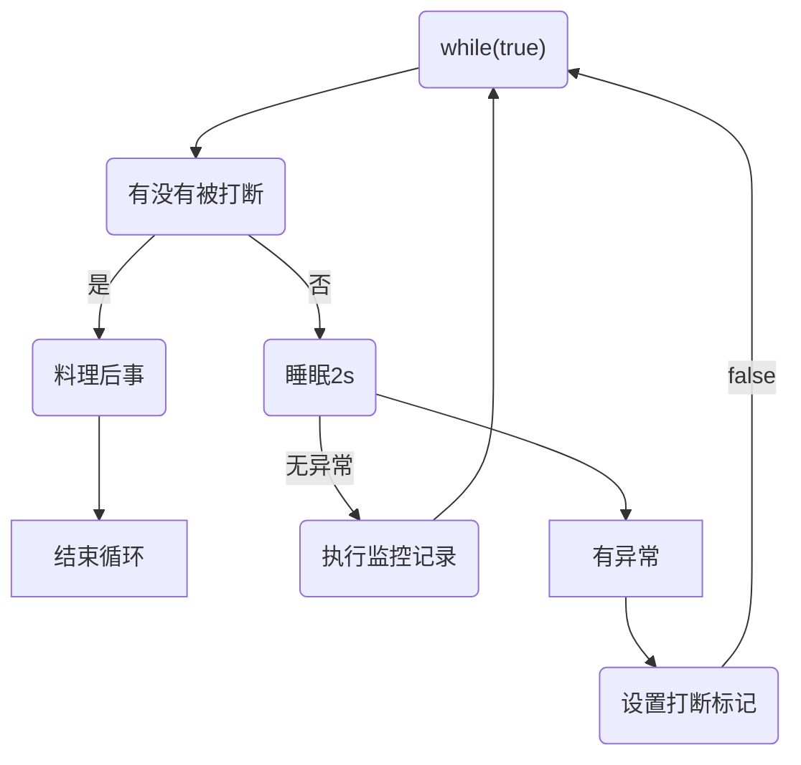
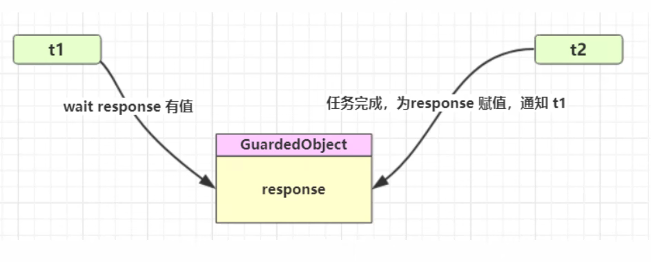
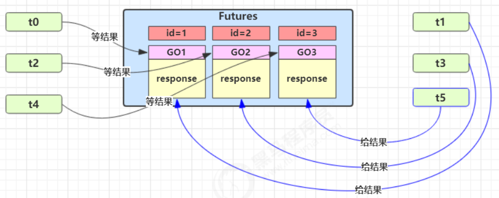
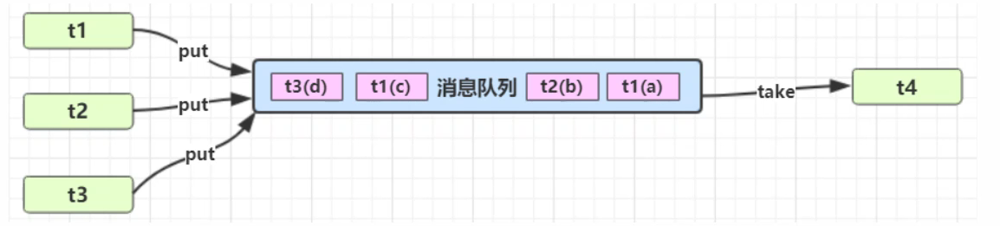

# JUC设计模式


## 终止模式之两阶段终止

Two Phase Termination

在一个线程 T1 中如何“优雅”终止线程 T2？这里的【优雅】指的是给 T2 一个料理后事的机会。

### 1. 错误思路

* 使用线程对象的 stop() 方法停止线程

  * stop 方法会真正杀死线程，如果这时线程锁住了共享资源，那么当它被杀死后就再也没有机会释放锁，其它线程将永远无法获取锁

* 使用 System.exit(int) 方法停止线程

  * 目的仅是停止一个线程，但这种做法会让整个程序都停止

  

  

  ### 2. 两阶段终止模式
  
  




```java
@Slf4j
public class TPTInterrupt {

    private Thread thread;

    public void start(String name,Runnable task){
        thread = new Thread(()->{
            while(true){
                // 判断当前线程是否被打断
                Thread c = Thread.currentThread();
                if(c.isInterrupted()){
                    log.info("料理后事...");
                    break;
                }
                try {
                    Thread.sleep(1000);
                    task.run();
                } catch (InterruptedException e) {
                    e.printStackTrace();
                    // 睡眠线程打断标记无效但是会抛异常
                    // 所以在这里再次设置打断标记
                    c.interrupt();
                }
            }
        },name);
        thread.start();
    }
    
    public void stop(){
        if(thread != null){
            thread.interrupt();
        }
    }

    public static void main(String[] args) {
        TPTInterrupt tptInterrupt = new TPTInterrupt();
        tptInterrupt.start("监控线程",()->{
           log.info("执行监控...");
        });

        sleep(5000);
        tptInterrupt.stop();
    }
}
```

输出

```sh
23:30:00 [监控线程] com.wjl.juc.j2.u5.TPTInterrupt - 执行监控...
23:30:01 [监控线程] com.wjl.juc.j2.u5.TPTInterrupt - 执行监控...
23:30:02 [监控线程] com.wjl.juc.j2.u5.TPTInterrupt - 执行监控...
23:30:03 [监控线程] com.wjl.juc.j2.u5.TPTInterrupt - 执行监控...
23:30:04 [监控线程] com.wjl.juc.j2.u5.TPTInterrupt - 料理后事...
```


### 3.利用停止标记(volatile)

```java
@Slf4j(topic = "c.TPTInterruptVolatile")
public class TPTInterruptVolatile {
    // 停止标记用 volatile 是为了保证该变量在多个线程之间的可见性
    // 我们的例子中，即主线程把它修改为 true 对 t1 线程可见
    private Thread thread;
    private volatile boolean stop = false;

    public void start(String name,Runnable task){
        thread = new Thread(()->{
            while(true){
                // 判断当前线程是否被打断
                if(stop){
                    log.info("料理后事...");
                    break;
                }
                try {
                    Thread.sleep(1000);
                    task.run();
                } catch (InterruptedException e) {
                    e.printStackTrace();
                }
            }
        },name);
        thread.start();
    }
    
    public void stop(){
        stop = true;
        // 防止在睡眠导致延迟
        if(thread != null){
            thread.interrupt();
        }
    }

    public static void main(String[] args) {
        TPTInterruptVolatile aVolatile = new TPTInterruptVolatile();
        aVolatile.start("t1",()->{
            log.debug("执行监控...");
        });
        sleep(3);
        aVolatile.stop();
    }
}
```

输出

```
11:14:07 [t1] c.TPTInterruptVolatile - 执行监控...
11:14:08 [t1] c.TPTInterruptVolatile - 执行监控...
11:14:09 [t1] c.TPTInterruptVolatile - 执行监控...
11:14:09 [t1] c.TPTInterruptVolatile - 料理后事...
```


## 同步模式之保护性暂停


### 1. 定义

即 Guarded Suspension，用在一个线程等待另一个线程的执行结果

要点

* 有一个结果需要从一个线程传递到另一个线程，让他们关联同一个 GuardedObject
* 如果有结果不断从一个线程到另一个线程那么可以使用消息队列（见生产者/消费者）
* JDK 中，join 的实现、Future 的实现，采用的就是此模式
* 因为要等待另一方的结果，因此归类到同步模式



### 2.实现

```java
public class GuardedSuspension<T> {

    private T response;

    public T get() throws InterruptedException {
        synchronized (this) {
            while (response == null) {
                this.wait();
            }
            return response;
        }
    }

    public void set(T response) {
        synchronized (this) {
            if (response != null) {
                this.response = response;
                this.notifyAll();
            }
        }
    }
	
    public T get(long timeout) { // 15.00.00
        synchronized (this) {
            long begin = System.currentTimeMillis();
            // 经历的时间
            long passedTimeout = 0;
            // 超出最大等待时间 退出循环
            while (response == null) { // 设置结果了就退出节省时间
                try {
                    // 防止虚假唤醒 ，比如设定等两秒，结果别人1秒就唤醒了也没设置结果 
                    // 这样会导致等待不够时间或者多等待时间
                    // 总时长 - 已等待时长
                    long waitTime = timeout - passedTimeout;
                    if(waitTime<=0){
                        break;
                    }
                    this.wait(waitTime); // 1s 就虚假唤醒  15.00.01
                } catch (InterruptedException e) {
                    throw new RuntimeException(e);
                }
                passedTimeout = System.currentTimeMillis() - begin; // 15.00.02
            }
            return response;
        }
    }
    
    public static void main(String[] args) throws InterruptedException {
        GuardedSuspension<String> suspension = new GuardedSuspension<>();
        new Thread(()->{
            sleep(5);
            log.debug("设置结果..");
            suspension.set("a");
        },"t1").start();

        log.info("开始获取...");
        String x = suspension.get(5000);
        log.info("获取结果 {}",x);
    }

   
}
```

测试 

* t1提前设置结果

* t1超时设置结果
* t1正好设置结果
* t1提前设置但结果为null （也是为什么不是直接wait(timeout)）


### 3.join原理

```java
/*
等待此线程死亡的时间最多为毫秒。超时值为0表示永远等待。 此实现使用此循环。等待呼叫以此为条件。isAlive。作为线程终止此。notifyAll方法被调用。
建议应用程序不要对Thread实例使用wait、notify或notifyAll。 参数： 毫秒–等待时间（毫秒） 投掷次数： IllegalArgumentException–如果millis的值为负值 InterruptedException–如果有任何线程中断了当前线程。抛出此异常时，将清除当前线程的中断状态
*/
public final synchronized void join(long millis)
    throws InterruptedException {
    long base = System.currentTimeMillis();
    long now = 0;

    if (millis < 0) {
        throw new IllegalArgumentException("timeout value is negative");
    }
	// 调用者线程进入 t1 的 waitSet 等待, 直到 t1 运行结束
    if (millis == 0) {
        while (isAlive()) {
            wait(0);
        }
    } else {
        while (isAlive()) {
            long delay = millis - now;
            if (delay <= 0) {
                break;
            }
            wait(delay);
            now = System.currentTimeMillis() - base;
        }
    }
}
```

* 注意：这里的isAlive是子线程调用，而这里的wait方法是主线程在调用！synchronized在方法上，表示主线程获取到了子线程这个实例的锁对象，然后调用这个锁对象的wait

```java
Thread t1 = new Thread(() -> {
}, "t1");
t1.start();

// == t1.wait()  t1 is Sync
t1.join();// public final synchronized void join(long millis)
// so
/* 
	所以等于调用t1.join() 的线程wait
    synchronized(t1){
        t1.wait(long millis);
    }
 */
```


### 4. 多任务版 GuardedObject

图中 Futures 就好比居民楼一层的信箱（每个信箱有房间编号），左侧的 t0，t2，t4 就好比等待邮件的居民，右侧的 t1，t3，t5 就好比邮递员

如果需要在多个类之间使用 GuardedObject 对象，作为参数传递不是很方便，因此设计一个用来解耦的中间类，这样不仅能够解耦【结果等待者】和【结果生产者】，还能够同时支持多个任务的管理



#### GuardedObject

```java
public class GuardedObject<T> {
    private final int id;
    private T response;

    public GuardedObject(int id) {
        this.id = id;
    }

    public int getId() {
        return id;
    }

    public T get() throws InterruptedException {
        synchronized (this) {
            while (response == null) {
                this.wait();
            }
            return response;
        }
    }

    public void set(T response) {
        synchronized (this) {
            if (response != null) {
                this.response = response;
                this.notifyAll();
            }
        }
    }

    public T get(long timeout) { // 15.00.00
        synchronized (this) {
            long begin = System.currentTimeMillis();
            // 经历的时间
            long passedTimeout = 0;
            // 超出最大等待时间 退出循环
            while (response == null) {
                try {
                    // 防止虚假唤醒 ，比如设定等两秒，结果别人1秒就唤醒了也没设置结果
                    // 等待不够时间或者多出时间
                    // 总时长 - 已等待时长
                    long waitTime = timeout - passedTimeout;
                    if (waitTime <= 0) {
                        break;
                    }
                    this.wait(waitTime); // 1s 就虚假唤醒
                } catch (InterruptedException e) {
                    throw new RuntimeException(e);
                }
                passedTimeout = System.currentTimeMillis() - begin; // 15.00.02
            }
            return response;
        }
    }
}
```

#### 解耦类

```java
class Boxes{
    // 线程安全的map
    private static Map<Integer,GuardedObject<Object>> boxes = new Hashtable<>();
    public static int id = 0;
    // 产生一个唯一的id
    private static synchronized int generateId(){
        return id++;
    }

    // Hashtable是线程安全的

    public static GuardedObject<Object> createGuardedObject(){
        GuardedObject<Object> object = new GuardedObject<>(generateId());
        boxes.put(object.getId(),object);
        return object;
    }

    public static Set<Integer> getIds(){
        return boxes.keySet();
    }

    // 不在需要了
    public static GuardedObject<Object> getGuardedObject(int id){
        return boxes.remove(id);
    }

}
```

#### 相关业务类

```java
@Slf4j
class People extends Thread{
    @Override
    public void run() {
        GuardedObject<Object> guardedObject = Boxes.createGuardedObject();
        log.debug("开始收信 id {}",guardedObject.getId());
        Object response = guardedObject.get(5000);
        log.debug("收信 id {}     内容 {}",guardedObject.getId(),response);
    }
}

@Slf4j
class Postman extends Thread{
    private int mailId;
    private String mail;
    public Postman(int mailId,String mail){
        this.mailId = mailId;
        this.mail = mail;
    }
    @Override
    public void run() {
        GuardedObject<Object> guardedObject = Boxes.getGuardedObject(mailId);
        log.debug("开始送信 id {}  mail {}",mailId,mail);
        guardedObject.set(mail);
    }
}
```

#### 测试

```java
class TestFutures{
    public static void main(String[] args) {
        for (int i = 0; i < 3; i++) {
            new People().start();
        }
        Sleeper.sleep(1);
        for (Integer id : Boxes.getIds()) {
            new Postman(id,"内容: "+id).start();
        }
    }
}
```

输出

```java
21:58:16 [Thread-0] com.wjl.juc.j3.u11.People - 开始收信 id 0
21:58:16 [Thread-1] com.wjl.juc.j3.u11.People - 开始收信 id 2
21:58:16 [Thread-2] com.wjl.juc.j3.u11.People - 开始收信 id 1
21:58:17 [Thread-3] com.wjl.juc.j3.u11.Postman - 开始送信 id 2  mail 内容: 2
21:58:17 [Thread-4] com.wjl.juc.j3.u11.Postman - 开始送信 id 1  mail 内容: 1
21:58:17 [Thread-5] com.wjl.juc.j3.u11.Postman - 开始送信 id 0  mail 内容: 0
21:58:17 [Thread-2] com.wjl.juc.j3.u11.People - 收信 id 1     内容 内容: 1
21:58:17 [Thread-1] com.wjl.juc.j3.u11.People - 收信 id 2     内容 内容: 2
21:58:17 [Thread-0] com.wjl.juc.j3.u11.People - 收信 id 0     内容 内容: 0
```


## 异步模式之生产者/消费者


### 1. 定义

要点

* 与前面的保护性暂停中的 GuardObject 不同，不需要产生结果和消费结果的线程一一对应
* 消费队列可以用来平衡生产和消费的线程资源
* 生产者仅负责产生结果数据，不关心数据该如何处理，而消费者专心处理结果数据
* 消息队列是有容量限制的，满时不会再加入数据，空时不会再消耗数据
* JDK 中各种阻塞队列，采用的就是这种模式




### 2. 实现

```java
@Slf4j(topic = "c.queue")
public class MessageQueue {

    private LinkedList<Message> list = new LinkedList<>();

    private int capacity;

    public MessageQueue(int capacity) {
        this.capacity = capacity;
    }

    public Message task(){
        synchronized(list){
            while (list.isEmpty()){
                try {
                    log.debug("队列为空，消费者线程等待...");
                    list.wait();
                } catch (InterruptedException e) {
                    throw new RuntimeException(e);
                }
            }
            Message message = list.removeFirst();
            log.debug("已消费消息 {}",message);
            list.notifyAll();
            return message;
        }
    }

    public void put(Message message){
        synchronized (list){
            while(list.size() == capacity){
                try {
                    log.debug("队列已满，生产者者线程等待...");
                    list.wait();
                } catch (InterruptedException e) {
                    throw new RuntimeException(e);
                }
            }
            log.debug("已生产消息 {}",message);
            list.addLast(message);
            list.notifyAll();
        }
    }

}
@AllArgsConstructor
@ToString
@Getter
final class  Message{
    private int id;
    private Object value;
}
```

测试

```java
public static void main(String[] args) {
    MessageQueue queue = new MessageQueue(2);
    for (int i = 0; i < 3; i++) {
        final int j = i;
        new Thread(()->{
            queue.put(new Message(j,"值:"+j));
        },"生产者"+i).start();
    }

    new Thread(()->{
        while(true){
            sleep(1);
            queue.task();
        }
    },"消费者").start();
}
```

输出

```java
23:18:19 [生产者2] c.queue - 已生产消息 Message(id=2, value=值:2)
23:18:19 [生产者0] c.queue - 已生产消息 Message(id=0, value=值:0)
23:18:19 [生产者1] c.queue - 队列已满，生产者者线程等待...
23:18:20 [消费者] c.queue - 已消费消息 Message(id=2, value=值:2)
23:18:20 [生产者1] c.queue - 已生产消息 Message(id=1, value=值:1)
23:18:21 [消费者] c.queue - 已消费消息 Message(id=0, value=值:0)
23:18:22 [消费者] c.queue - 已消费消息 Message(id=1, value=值:1)
23:18:23 [消费者] c.queue - 队列为空，消费者线程等待...
```


## 同步模式之顺序控制


### 1. 固定顺序控制


比如先打印2，再打印1

#### wait notify

```java
@Slf4j(topic = "c.ControlSequence")
public class WatiNotify{
    // 用来同步的对象
    static Object obj = new Object();
    // t2 运行标记， 代表 t2 是否执行过
    volatile static boolean t2runed = false;

    public static void main(String[] args) {
        new Thread(()->{
            synchronized(obj){
                // 如果 t2 没有执行过
                while(!t2runed){ // 防止虚假唤醒
                    try {
                        // t1 先等一会
                        obj.wait();
                    } catch (InterruptedException e) {
                        throw new RuntimeException(e);
                    }
                }
                log.debug("{}",1);
            }
        },"t1").start();

        new Thread(()->{
            synchronized(obj){
                log.debug("{}",2);
                // 修改运行标记
                t2runed = true;
                // 通知 obj 上等待的线程（可能有多个，因此需要用 notifyAll）
                obj.notifyAll();
            }
        },"t2").start();
    }
}
```

输出

```
22:00:12 [t2] c.ControlSequence - 2
22:00:12 [t1] c.ControlSequence - 1
```

#### Park Unpark 版

可以看到，实现上很麻烦：

* 首先，需要保证先 wait 再 notify，否则 wait 线程永远得不到唤醒。因此使用了『运行标记』来判断该不该
  wait
* 第二，如果有些干扰线程错误地 notify 了 wait 线程，条件不满足时还要重新等待，使用了 while 循环来解决此问题
* 最后，唤醒对象上的 wait 线程需要使用 notifyAll，因为『同步对象』上的等待线程可能不止一个

可以使用 LockSupport 类的 park 和 unpark 来简化上面的题目：

```java
@Slf4j(topic = "c.ControlSequence")
class ParkOrder{

    public static void main(String[] args) {
        Thread t1 = new Thread(() -> {
            // 当没有『许可』时，当前线程暂停运行;有『许可』时，用掉这个『许可』，当前线程恢复运行
            LockSupport.park();
            log.debug("{}", 1);
        }, "t1");
        t1.start();

        new Thread(()->{
            // 给线程 t1 发放『许可』（多次连续调用 unpark 只会发放一个『许可』）
            log.debug("{}",2); // 就算先运行 也是先加入了 【备份干粮】
            LockSupport.unpark(t1);
        },"t2").start();
    }
    
}
```

输出

```java
22:24:57 [t2] c.ControlSequence - 2
22:24:57 [t1] c.ControlSequence - 1
```

park 和 unpark 方法比较灵活，他俩谁先调用，谁后调用无所谓。并且是以线程为单位进行『暂停』和『恢复』，不需要『同步对象』和『运行标记』


#### ReentrantLock

```java
@Slf4j(topic = "c.ControlSequence")
class RLockControlSequence{
    final static ReentrantLock lock = new ReentrantLock();
    final static Condition t1wait = lock.newCondition();
    volatile static boolean t2runed = false;

    public static void main(String[] args) {
        new Thread(()->{
            lock.lock();
            try {
                while (!t2runed){
                    try {
                        t1wait.await();
                    } catch (InterruptedException e) {
                        throw new RuntimeException(e);
                    }
                }
                log.debug("{}",1);
            }finally{
                lock.unlock();
            }
        },"t1").start();

        new Thread(()->{
            lock.lock();
            try {
                log.debug("{}",2);
                t2runed = true;
                t1wait.signalAll();
            }finally{
                lock.unlock();
            }
        },"t2").start();
    }
}
```

输出

```java
22:11:59 [t2] c.ControlSequence - 2
22:11:59 [t1] c.ControlSequence - 1
```


### 2. 交替输出

线程 1 输出 a 5 次，线程 2 输出 b 5 次，线程 3 输出 c 5 次。现在要求输出 abcabcabcabcabc 怎么实现

#### wait notify

```java
@AllArgsConstructor
class WaitNotify{
    // 起始等待标记
    private volatile int flag;
    // 循环次数
    private int loopNumber;

    // 打印方法
    public void print(Object value,int waitFlag,int nextFlag){
        for (int i = 0; i < loopNumber; i++) {
            synchronized(this){
                while (flag != waitFlag){
                    try {
                        this.wait();
                    } catch (InterruptedException e) {
                        throw new RuntimeException(e);
                    }
                }
                System.out.println(Thread.currentThread().getName()+": "+value+"  "+i);
                flag = nextFlag; // 更新打印标记
                // 叫醒其他等待打印的线程
                this.notifyAll();
            }
        }
    }
}
```

测试

```java
@Slf4j(topic = "c.AlternatingOutput")
class WaitNotifyAlternatingOutput{

    public static void main(String[] args) {
        WaitNotify waitNotify = new WaitNotify(1, 5);
        new Thread(()->{
            waitNotify.print("a",1,2);
        },"t1").start();
        new Thread(()->{
            waitNotify.print("b",2,3);
        },"t2").start();
        new Thread(()->{
            waitNotify.print("c",3,1);
        },"t3").start();
    }
}
```

输出

```java
t1: a  0
t2: b  0
t3: c  0
t1: a  1
t2: b  1
t3: c  1
t1: a  2
t2: b  2
t3: c  2
t1: a  3
t2: b  3
t3: c  3
t1: a  4
t2: b  4
t3: c  4
```


#### Lock条件变量

```java
@Slf4j
public class AwaitSignal extends ReentrantLock {
    // 循环次数
    private int loopNumber;

    public AwaitSignal(int lookNumber) {
        this.loopNumber = lookNumber;
    }

    /**
     * @param value 打印内容
     * @param current 要进那一间休息室
     * @param  next 下一间休息室
     */
    public void print(Object value, Condition current,Condition next){
        for (int i = 0; i < loopNumber; i++) {
            this.lock();
            try {
                try {
                    current.await();
              System.out.println(Thread.currentThread().getName()+": "+value+"  count:"+i);
                    next.signal();
                } catch (InterruptedException e) {
                    throw new RuntimeException(e);
                }
            }finally {
                this.unlock();
            }
        }
    }

    public static void main(String[] args) {
        AwaitSignal awaitSignal = new AwaitSignal(5);
        Condition a = awaitSignal.newCondition();
        Condition b = awaitSignal.newCondition();
        Condition c = awaitSignal.newCondition();
        
        new Thread(()->{
            awaitSignal.print("a",a,b);
        },"t1").start();
        
        new Thread(()->{
            awaitSignal.print("b",b,c);
        },"t2").start();
        
        new Thread(()->{
            awaitSignal.print("c",c,a);
        },"t3").start();

        // 发起者
        awaitSignal.lock();
        a.signal();
        awaitSignal.unlock();
    }
}
```

输出

```java
t1: a  count:0
t2: b  count:0
t3: c  count:0
t1: a  count:1
t2: b  count:1
t3: c  count:1
t1: a  count:2
t2: b  count:2
t3: c  count:2
t1: a  count:3
t2: b  count:3
t3: c  count:3
t1: a  count:4
t2: b  count:4
t3: c  count:4
```


#### Park Unpark

```java
@AllArgsConstructor
public class ParkUnparkPrint {
    private int loopNumber;

    public void print(Object value, Thread nextThread) {
        for (int i = 0; i < loopNumber; i++) {
            LockSupport.park();
            System.out.println(Thread.currentThread().getName() + ": " + value + "  count:" + i);
            LockSupport.unpark(nextThread);
        }
    }

    public static void main(String[] args) {
        ParkUnparkPrint print = new ParkUnparkPrint(5);

        Thread currentThread = Thread.currentThread();
        currentThread.setName("t0");
        
        Thread t1 = new Thread(() -> {
            print.print("a", currentThread);
        }, "t1");
        t1.start();

        Thread t2 = new Thread(() -> {
            print.print("c", t1);
        }, "t2");
        t2.start();

        LockSupport.unpark(t1); //发起者
        print.print("b", t2);

    }
}
```

输出

```java
t1: a  count:0
t0: b  count:0
t2: c  count:0
t1: a  count:1
t0: b  count:1
t2: c  count:1
t1: a  count:2
t0: b  count:2
t2: c  count:2
t1: a  count:3
t0: b  count:3
t2: c  count:3
t1: a  count:4
t0: b  count:4
t2: c  count:4
```


## 同步模式之Balking


### 1. 定义

Balking （犹豫）模式用在一个线程发现另一个线程或本线程已经做了某一件相同的事，那么本线程就无需再做了，直接结束返回


### 2. 实现

例如：

```java
public class MonitorService {
    // 用来表示是否已经有线程已经在执行启动了
    private volatile boolean starting;
    
    // 既使用了读，也使用了写， 所以要用synchronized保证原子性
    // 不是用lock更好.是Volatile在这里没用.一写多读场景才使用.这里有多写要保证原子性
    public void start() {
        log.info("尝试启动监控线程...");
        synchronized (this) {
            if (starting) { // 不加锁只使用v的话，第一个线程发现没有创建，更改为true,
           		return; // 但是第二个线程进来的时候线程1对starting的变量还没有写回去，所以保证可见性适用于此，要保证原子性
       		}
            starting = true;
         }
         // 这里的读写原子性是针对于starting变量的，所以启动代码可以在代码块之外 节省性能
         // 真正启动监控线程...
    }
}
```

应用到保护性暂停

```java
@Slf4j(topic = "c.TPTInterruptVolatile")
public class TPTInterruptVolatile {
    // 停止标记用 volatile 是为了保证该变量在多个线程之间的可见性
    // 我们的例子中，即主线程把它修改为 true 对 t1 线程可见
    private Thread thread;
    private volatile boolean stop = false;
    private boolean starting = false;

    public void start(String name, Runnable task) {
        // 既使用了读，也使用了写， 所以要用synchronized保证原子性
        // 不是用lock更好.是Volatile在这里没用.一写多读场景才使用.这里有多写要保证原子性
        synchronized (this) {
            // 不加锁只使用v的话，第一个线程发现没有创建，更改为true,
            // 但是第二个线程进来的时候线程1对starting的变量还没有写回去，所以保证可见性适用于此，要保证原子性
            if (starting) {
                return;
            }
            starting = true;
        }
        // 这里的读写原子性是针对于starting变量的，所以启动代码可以在代码块之外 节省性能
        thread = new Thread(() -> {
            while (true) {
                // 判断当前线程是否被打断
                if (stop) {
                    log.info("料理后事...");
                    starting = false; //[这块代码]只能被启动的线程修改，要对其他线程可见 volatile修饰保证可见性 不需要原子性
                    stop = false;
                    break;
                }
                try {
                    Thread.sleep(1000);
                    task.run();
                } catch (InterruptedException e) {
                }
            }
        }, name);
        thread.start();
    }

    public void stop() {
        if (starting) {// 防止空指针 并且是读操作，不需要保证原子性
            synchronized(this){
                if (thread != null) {
                    stop = true;
                    thread.interrupt(); // 防止睡眠延迟停止
                    log.debug("停止监控线程...");
            	}
            }
        }
    }

    public static void main(String[] args) {
        TPTInterruptVolatile aVolatile = new TPTInterruptVolatile();
        new Thread(aVolatile::stop,"t2").start();
        sleep(0.5);
        aVolatile.start("t1", () -> {
            log.debug("执行监控...");
        });
        sleep(3);
        aVolatile.stop();
    }
}
```

它还经常用来实现线程安全的单例

```java
public final class Singleton {
    private Singleton() {
    }
    private static Singleton INSTANCE = null;
    
    public static synchronized Singleton getInstance() {
        if (INSTANCE != null) {
        	return INSTANCE;
        }
        INSTANCE = new Singleton();
        return INSTANCE;
    }
}
```

对比一下保护性暂停模式：保护性暂停模式用在一个线程等待另一个线程的执行结果，当条件不满足时线程等待


## 享元模式


### 1. 简介

**定义** 英文名称：Flyweight pattern. 当需要重用数量有限的同一类对象时

> wikipedia： A flyweight is an object that minimizes memory usage by sharing as much data as possible with other similar objects

出自 "Gang of Four" design patterns [设计模式之一]

归类 Structual patterns [结构模式]

### 2. 体现

#### 2.1 包装类

在JDK中 Boolean，Byte，Short，Integer，Long，Character 等包装类提供了 valueOf 方法，例如 Long 的valueOf 会缓存 -128~127 之间的 Long 对象，在这个范围之间会重用对象，大于这个范围，才会新建 Long 对象：

```java
public static Long valueOf(long l) {
    final int offset = 128;
    if (l >= -128 && l <= 127) { // will cache
    	return LongCache.cache[(int)l + offset];
    }
    return new Long(l);
}

// Long$LongCache
private static class LongCache {
    private LongCache(){}

    static final Long cache[] = new Long[-(-128) + 127 + 1];

    static {
        for(int i = 0; i < cache.length; i++)
            cache[i] = new Long(i - 128);
    }
}
```

> **注意**
>
> * Byte, Short, Long 缓存的范围都是 -128~127
> * Character 缓存的范围是 0~127
> * Integer的默认范围是 -128~127
>   * 最小值不能变
>   * 但最大值可以通过调整虚拟机参数 `
>     -Djava.lang.Integer.IntegerCache.high` 来改变
> * Boolean 缓存了 TRUE 和 FALSE


#### 2.2 String串池

#### 2.3 BigDecimal BigInteger

* 注意 BigDecimal也是使用拷贝的方式，但是，线程安全类的单个方法是线程安全的，多个方法的组合不一定是线程安全的，所以之前的例子中使用AtomicReference保护线程安全


### 3. DIY MySQL Connection Pool

例如：一个线上商城应用，QPS 达到数千，如果每次都重新创建和关闭数据库连接，性能会受到极大影响。这时预先创建好一批连接，放入连接池。一次请求到达后，从连接池获取连接，使用完毕后再还回连接池，这样既节约了连接的创建和关闭时间，也实现了连接的重用，不至于让庞大的连接数压垮数据库。

mock代码

```java
public class Pool {
    /**
     *  空闲
     */
    public static final int FREE = 0;
    /*
     * 繁忙
     */
    public static final int BUSY = 1;
    // 连接池大小
    private final int poolSize;
    // 连接对象数组
    private Connection[] connections;
    // 连接状态数组
    private AtomicIntegerArray states;


    public Pool(String username, String password, String url, int poolSize) {
        if (poolSize <= 0) {
            throw new ArrayIndexOutOfBoundsException("连接数不能小于1!!!");
        }
        this.poolSize = poolSize;
        this.connections = new Connection[this.poolSize];
        this.states = new AtomicIntegerArray(new int[this.poolSize]);
        for (int i = 0; i < this.connections.length; i++) {
            try {
                connections[i] = DriverManager.getConnection(url, username, password);
            } catch (SQLException e) {
                throw new RuntimeException(e);
            }
        }
    }

    /**
     *  借出连接
     * @return
     */
    public Connection getConnection() {
        while (true) {
            for (int i = 0; i < poolSize; i++) {
                if (states.get(i) == 0) {
                    if (states.compareAndSet(i, FREE, BUSY)) {
                        log.debug("getConnection: {}", connections[i]);
                        return connections[i];
                    }
                }
            }
            // 如果没有空闲连接
            synchronized (this) {
                try {
                    log.debug("wait...");
                    this.wait();
                } catch (InterruptedException e) {
                    e.printStackTrace();
                }
            }
        }
    }

    /**
     *  归还连接
     * @param connection
     */
    public void free(Connection connection) {
        for (int i = 0; i < poolSize; i++) {
            if (connections[i].equals(connection)) {
                states.set(i, FREE);// 只有借出者可以归还，没有竞争
                log.debug("free: {}", connection);
                synchronized (this) {
                    this.notifyAll();
                }
                break;
            }
        }
    }

}
```

使用连接池

```java
@Slf4j
class TestPool {
    public static void main(String[] args) throws SQLException {
        Pool pool = new Pool("root", "123456", "jdbc:mysql://localhost:3306/wjl", 2);
        List<Thread> ts = new ArrayList<>();
        for (int i = 0; i < 5; i++) {
            ts.add(new Thread(() -> {
                try {
                    Connection connection = pool.getConnection();
                    PreparedStatement statement = connection
                        .prepareStatement("select * from `user` where id = ?");
                    statement.setString(1, "1");
                    ResultSet resultSet = statement.executeQuery();
                    while (resultSet.next()) {
                        log.debug(resultSet.getString("id") + "  " + resultSet.getString("name"));
                    }
                    resultSet.close();
                    statement.close();
                    pool.free(connection);
                } catch (SQLException e) {
                    throw new RuntimeException(e);
                }
            }, "t" + i));
        }

        ts.forEach(Thread::start);
    }
}
```

以上实现没有考虑：

* 连接的动态增长与收缩
* 连接保活（可用性检测）
* 等待超时处理
* 分布式 hash
* 对于关系型数据库，有比较成熟的连接池实现，例如c3p0, druid等 对于更通用的对象池，可以考虑使用apache commons pool，例如redis连接池可以参考jedis中关于连接池的实现


## 异步模式之工作线程


### 1. 定义

让有限的工作线程（Worker Thread）来轮流异步处理无限多的任务。也可以将其归类为分工模式，它的典型实现就是线程池，也体现了经典设计模式中的享元模式。

例如，海底捞的服务员（线程），轮流处理每位客人的点餐（任务），如果为每位客人都配一名专属的服务员，那么成本就太高了（对比另一种多线程设计模式：Thread-Per-Message）

注意，**不同任务类型应该使用不同的线程池，这样能够避免饥饿，并能提升效率**

例如，如果一个餐馆的工人既要招呼客人（任务类型A），又要到后厨做菜（任务类型B）显然效率不咋地，分成服务员（线程池A）与厨师（线程池B）更为合理，当然你能想到更细致的分工


### 2. 饥饿

固定大小线程池会有饥饿现象

* 两个工人是同一个线程池中的两个线程
* 他们要做的事情是：为客人点餐和到后厨做菜，这是两个阶段的工作
  * 客人点餐：必须先点完餐，等菜做好，上菜，在此期间处理点餐的工人必须等待
  * 后厨做菜：没啥说的，做就是了
* 比如工人A 处理了点餐任务，接下来它要等着 工人B 把菜做好，然后上菜，他俩也配合的蛮好
* 但现在同时来了两个客人，这个时候工人A 和工人B 都去处理点餐了，这时没人做饭了，饥饿
* 也就是说相同线程池中的任务不能有相互依赖逻辑，不然容易导致饥饿

#### 代码

```java
@Slf4j
public class TestHunger {
    static final List<String> MENU = Arrays.asList("地三鲜", "宫保鸡丁", "辣子鸡丁", "烤鸡翅");
    static Random RANDOM = new Random();
    static String cooking() {
        return MENU.get(RANDOM.nextInt(MENU.size()));
    }

    static ExecutorService service = Executors.newFixedThreadPool(2);
    public static void main(String[] args) {
        // 第一位客人
        service.execute(()->{
            log.debug("处理点餐...");
            Future<String> cooking = service.submit(() -> {
                log.debug("做菜...");
                return cooking();
            });

            try {
                log.debug("上菜 {}",cooking.get());
            } catch (InterruptedException | ExecutionException e) {
                throw new RuntimeException(e);
            }

        });
        
        // 第二位客人 线程不够 造成饥饿现象--两个线程都腾不开身（不属于死锁）
        service.execute(()->{
            log.debug("处理点餐...");
            Future<String> cooking = service.submit(() -> {
                log.debug("做菜...");
                return cooking();
            });

            try {
                log.debug("上菜 {}",cooking.get());
            } catch (InterruptedException | ExecutionException e) {
                throw new RuntimeException(e);
            }

        });

    }
}
```

输出

```java
20:56:40 [pool-1-thread-1] com.wjl.juc.j7.u2.TestHunger - 处理点餐...
20:56:40 [pool-1-thread-2] com.wjl.juc.j7.u2.TestHunger - 处理点餐...
// 没有线程做菜 一直未运行完毕
```

#### 解决

解决方法可以增加线程池的大小，不过不是根本解决方案，还是前面提到的，**不同的任务类型，采用不同的线程池**，例如：

```java
@Slf4j(topic = "c.TestHunger")
public class TestHunger {
    static final List<String> MENU = Arrays.asList("地三鲜", "宫保鸡丁", "辣子鸡丁", "烤鸡翅");
    static Random RANDOM = new Random();

    static String cooking() {
        return MENU.get(RANDOM.nextInt(MENU.size()));
    }

    static ExecutorService waiterService = Executors.newFixedThreadPool(1, r -> new Thread(r, "waiter_1"));
    static ExecutorService cookService = Executors.newFixedThreadPool(1, r -> new Thread(r, "cook_1"));

    public static void main(String[] args) {
        // 第一位客人
        waiterService.execute(() -> {
            log.debug("处理点餐...");
            Future<String> cooking = cookService.submit(() -> {
                log.debug("做菜...");
                return cooking();
            });

            try {
                log.debug("上菜 {}", cooking.get());
            } catch (InterruptedException | ExecutionException e) {
                throw new RuntimeException(e);
            }

        });

        waiterService.execute(() -> {
            log.debug("处理点餐...");
            Future<String> cooking = cookService.submit(() -> {
                log.debug("做菜...");
                return cooking();
            });

            try {
                log.debug("上菜 {}", cooking.get());
            } catch (InterruptedException | ExecutionException e) {
                throw new RuntimeException(e);
            }

        });

    }
}
```

输出

```java
21:10:35 [waiter_1] c.TestHunger - 处理点餐...
21:10:35 [cook_1] c.TestHunger - 做菜...
21:10:35 [waiter_1] c.TestHunger - 上菜 辣子鸡丁
21:10:35 [waiter_1] c.TestHunger - 处理点餐...
21:10:35 [cook_1] c.TestHunger - 做菜...
21:10:35 [waiter_1] c.TestHunger - 上菜 烤鸡翅
```


### 3. 创建多少线程池合适

* 过小会导致程序不能充分地利用系统资源、容易导致饥饿
* 过大会导致更多的线程上下文切换，占用更多内存


#### CPU 密集型运算

通常采用·`cpu 核数 + 1 `能够实现最优的 CPU 利用率，+1 是保证当线程由于页缺失故障（操作系统）或其它原因导致暂停时，额外的这个线程就能顶上去，保证 CPU 时钟周期不被浪费

> 数据分析之类

####  I/O 密集型运算

CPU 不总是处于繁忙状态，例如，当你执行业务计算时，这时候会使用 CPU 资源，但当你执行 I/O 操作时、远程RPC 调用时，包括进行数据库操作时，这时候 CPU 就闲下来了，你可以利用多线程提高它的利用率。

经验公式如下

`线程数 = 核数 * 期望 CPU 利用率 * 总时间(CPU计算时间+等待时间) / CPU 计算时间`

例如 4 核 CPU 计算时间是 50% ，其它等待时间是 50%，期望 cpu 被 100% 利用，套用公式

`4 * 100% * 100% / 50% = 8`

例如 4 核 CPU 计算时间是 10% ，其它等待时间是 90%，期望 cpu 被 100% 利用，套用公式

`4 * 100% * 100% / 10% = 40`

> Web, 流读写，NIO, 数据库等
