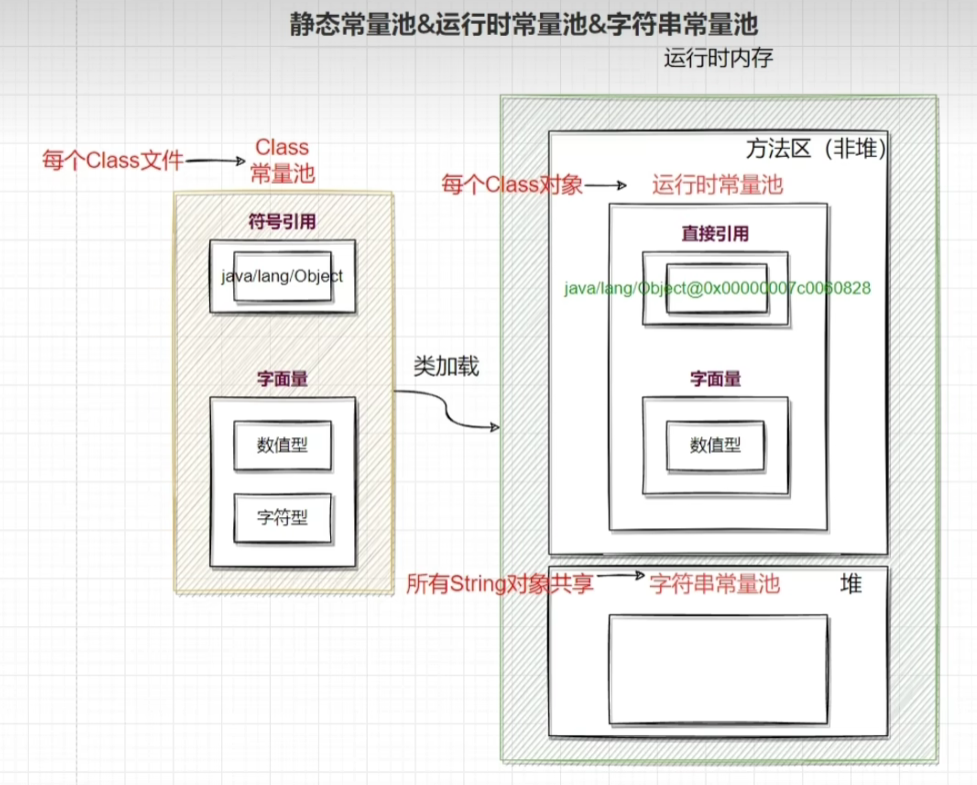

# 内存结构

<hr/>

[TOC]

相关文档: 

* [jvm官方文档](https://docs.oracle.com/javase/specs/index.html)
* [Oracle官网文档](https://docs.oracle.com/en/java/index.html) 
* [JDK 19 Documentation - Guides (oracle.com)](https://docs.oracle.com/en/java/javase/19/books.html)
* https://docs.oracle.com/javase/9/tools/JSWOR.pdf
* [ JVM调优总结 -Xms -Xmx -Xmn -Xss_江南云朵的博客-CSDN博客_xmn xms xmx](https://blog.csdn.net/fcclzydouble/article/details/123095908)

<hr/>


## 1. 程序计数器


### 1.1 定义

Program Counter Register 程序计数器（寄存器）

* 作用： 是记住下一条JVM指令的执行地址

> java File -- java Class -- 解释器 -- CPU

* 特点
  * 是线程私有的
  * 不会存在内存溢出 (Java虚拟机规范)

### 1.2 作用

```java
0: getstatic #20 			// PrintStream out = System.out;
3: astore_1 			    // --
4: aload_1 					// out.println(1);
5: iconst_1 				// --
6: invokevirtual #26 		 // --
9: aload_1 					// out.println(2);
10: iconst_2 				// --
11: invokevirtual #26 		 // --
14: aload_1 				// out.println(3);
15: iconst_3 				// --
16: invokevirtual #26 		 // --
19: aload_1 				// out.println(4);
20: iconst_4 				// --
21: invokevirtual #26 		 // --
24: aload_1 				// out.println(5);
25: iconst_5 				// --
26: invokevirtual #26 		 // --
29: return
```


## 2. 虚拟机栈


### 2.1 定义

Java Virtual Machine Stacks （Java 虚拟机栈）

* 每个线程运行时所需要的内存，称为虚拟机栈
* 每个栈由多个栈帧（Frame）组成，对应着每次方法调用时所占用的内存
* 每个线程只能有一个活动栈帧，对应着当前正在执行的那个方法


问题辨析

1. 垃圾回收是否涉及栈内存？
   * 不涉及。在每一次调用方法之后弹出栈，自动被回收掉
2. 栈内存分配越大越好吗？`-Xss size` 指定栈内存大小，默认**1024KB**
   * 不。反而会使（可使用）线程数变少
3. 方法内的局部变量是否线程安全？
   * 如果方法内局部变量没有逃离方法的作用访问，它是线程安全的
   * 如果是局部变量引用了**对象**，并**逃离方法的作用范围**，需要考虑线程安全

```java
// 不会有线程安全问题
static void m1(){
    int x = 0;
}
// 会有 可能有多个线程访问到o,等同于
main:
s = new SB; s.append(...);
new Thread(()->{m2(s);});

static void m2(StringBulider s){
   s.append(...);
   out.print(s);
}
// 返回代表其他线程也会拿到这个引用去修改它
static StringBulider m3(){
    s = new SB;
    s.append(...);
    return s;
}
// 总结：是线程私有的就没有，是线程共享的有-->是否逃离了方法的作用范围
```


### 2.2 栈内存溢出

* 栈帧过多导致栈内存溢出(递归，转换Json等...)   `java.lang.StackOverflowError`
* 栈帧过大导致栈内存溢出


### 2.3  线程运行诊断

案例1： cpu 占用过多

定位

* 用`top`定位哪个进程对cpu的占用过高

* `ps H -eo pid,tid,%cpu | grep 进程id` （用ps命令进一步定位是哪个线程引起的cpu占用过高）

* `jstack 进程id` （输出的线程编号是16进制的）

  * 可以根据线程id 找到有问题的线程，进一步定位到问题代码的源码行号

  

案例2：程序运行很长时间没有结果

```java
static Object o1 = new Object();
static Object o2 = new Object();
public static void main(String[] args) {
    new Thread(()->{
        try {
            TimeUnit.SECONDS.sleep(1l);
            synchronized(o1){
                synchronized(o2){
                    System.out.println("T1");
                }
            }
        } catch (InterruptedException e) {
            throw new RuntimeException(e);
        }
    },"T1").start();

    new Thread(()->{
        try {
            TimeUnit.SECONDS.sleep(1l);
            synchronized(o2){
                synchronized(o1){
                    System.out.println("T2");
                }
            }
        } catch (InterruptedException e) {
            throw new RuntimeException(e);
        }
    },"T2").start();
}
```


## 3. 本地方法栈


Object对象的`clone, notify, notifyAll, wait, finalize, hashCode, registerNatives`

- Java[虚拟机](https://so.csdn.net/so/search?q=虚拟机&spm=1001.2101.3001.7020)栈用于管理Java方法的调用，而本地方法栈用于管理本地方法的调用。
- 本地方法栈，也是线程私有的。
- 允许被实现成固定或者是可动态扩展的[内存](https://so.csdn.net/so/search?q=内存&spm=1001.2101.3001.7020)大小。(在内存溢出方面是相同的)

> 如果线程请求分配的栈容量超过本地方法栈允许的最大容量，Java 虚拟机将会抛出一个`StackoverflowError `异常。

> 如果本地方法栈可以动态扩展，并且在尝试扩展的时候无法申请到足够的内存，或者在创建新的线程时没有足够的内存去创建对应的本地方法栈，那么Java虚拟机将会抛出一个`OutofMemoryError `异常。

* 本地方法是使用C语言实现的。

* 它的具体做法是Native Method Stack中 登记native方法，在Execution Engine 执行时加载本地方法库。

* 当某个线程调用一一个本地方法时，它就进入了一一个全新的并且不再受虛拟机限制的世界。它和虚拟机拥有同样的权限。

> 本地方法可以通过本地方法接口来访问虚拟机内部的运行时数据区。

> 它甚至可以直接使用本地处理器中的寄存器

>  直接从本地内存的堆中分配任意数量的内存。

* 并不是所有的JVM都支持本地方法。因为Java虚拟机规范并没有明确要求本地方法栈的使用语言、具体实现方式、数据结构等。如果JVM产品不打算支持native方法，也可以无需实现本地方法栈。

* 在Hotspot JVM中，直接将本地方法栈和虚拟机栈合二为一。

相关链接：

* [06 本地方法栈 - flypiggg - 博客园 (cnblogs.com)](https://www.cnblogs.com/flypigggg/p/16525918.html)
* [(124条消息) 1. 本地方法栈_缘起->猿灭的博客-CSDN博客_本地方法栈](https://blog.csdn.net/u013559614/article/details/123430569)


## 4. 堆


### 4.1 定义

Heap 堆

* 通过`new`关键字，创建对象都会使用堆内存

特点

* 它是线程共享的，堆里对象都需要考虑线程安全的问题
* 有垃圾回收机制

### 4.2 堆内存溢出

**`java.lang.OutOfMemoryError: Java heap space`**

`-Xmx8m`: 控制堆空间最大值


### 4.3 堆内存诊断

1. jps 工具
   * 查看当前系统中有哪些 java 进程
2. jmap 工具
   * 查看堆内存占用情况 `jmap - heap 进程id`
3. jconsole 工具
   * 图形界面的，多功能的监测工具，可以连续监测

4. jvisualvm

## 5. 方法区


### 5.1 定义

[JVM规范-方法区定义](https://docs.oracle.com/javase/specs/jvms/se8/html/jvms-2.html)

2.5.4

<hr/>

> The Java Virtual Machine has a *method area* that is shared among all Java Virtual Machine threads. The method area is analogous to the storage area for compiled code of a conventional language or analogous to the "text" segment in an operating system process. It stores per-class structures such as the run-time constant pool, field and method data, and the code for methods and constructors, including the special methods ([§2.9](https://docs.oracle.com/javase/specs/jvms/se8/html/jvms-2.html#jvms-2.9)) used in class and instance initialization and interface initialization.
>
> The method area is created on virtual machine start-up. Although the method area is logically part of the heap, simple implementations may choose not to either garbage collect or compact it. This specification does not mandate the location of the method area or the policies used to manage compiled code. The method area may be of a fixed size or may be expanded as required by the computation and may be contracted if a larger method area becomes unnecessary. The memory for the method area does not need to be contiguous.
>
> A Java Virtual Machine implementation may provide the programmer or the user control over the initial size of the method area, as well as, in the case of a varying-size method area, control over the maximum and minimum method area size.
>
> The following exceptional condition is associated with the method area:
>
> - If memory in the method area cannot be made available to satisfy an allocation request, the Java Virtual Machine throws an `OutOfMemoryError`.


Java 虚拟机有一个在**所有 Java 虚拟机线程之间共享**的*方法区。*方法区类似于传统语言的编译代码的存储区，或者类似于操作系统进程中的“文本”段。它**存储每个类的结构**，例如`运行时常量池`、**字段和方法数据，以及方法和构造函数的代码**，**包括类和实例初始化和接口初始化中使用 的特殊方法**

方法区是在**虚拟机启动时创建**的。尽管方法区在**逻辑上是堆的一部分**，但简单的实现可能会选择不进行垃圾收集或压缩它。[*1]**本规范不要求方法区域的位置**或用于管理已编译代码的策略。方法区域可以是固定大小，也可以根据计算需要扩大，如果不需要更大的方法区域，可以缩小。方法区的内存不需要是连续的。

Java 虚拟机实现可以为程序员或用户提供对方法区域初始大小的控制，以及在方法区域大小可变的情况下，对最大和最小方法区域大小的控制。

以下异常情况与方法区相关：

- 如果方法区域中的内存无法满足分配请求(内存溢出)，Java 虚拟机将抛出一个`OutOfMemoryError`.

<hr/>

1. 不强制的意思。Oracle的HotSpot 虚拟机在8之前的实现是`永久代`，就是使用了堆内存的一部分，1.8之后被`元空间替代`，使用的不再是堆内存，转而使用本地内存，也就是操作系统内存


相关链接：[一文搞懂JVM之 方法区、永久代、元空间三者的区别 - 知乎 (zhihu.com)](https://zhuanlan.zhihu.com/p/505516868)

### 5.2 组成


### 5.3 方法区内存溢出

#### 1. 演示

* 1.8之前会导致永久代内存溢出

> \*  演示永久代内存溢出 java.lang.OutOfMemoryError: PermGen space
> \*  -XX:MaxPermSize=8m

* 1.8之后会导致元空间内存溢出

> \*  演示元空间内存溢出 java.lang.OutOfMemoryError: Metaspace
> \*  -XX:MaxMetaspaceSize=8m

```java
/**
 * 演示元空间内存溢出 java.lang.OutOfMemoryError: Metaspace
 * -XX:MaxMetaspaceSize=8m
 * 注：1.8 之后元空间使用的是系统内存，默认没有设置上限
 */
public class Demo1_8 extends ClassLoader { // 可以用来加载类的二进制字节码
    public static void main(String[] args) {
        int j = 0;
        try {
            // 类似于ASM
            Demo1_8 test = new Demo1_8();
            for (int i = 0; i < 100000; i++, j++) {
                // ClassWriter 作用是生成类的二进制字节码
                ClassWriter cw = new ClassWriter(0);
                // 版本号， public， 类名, 包名, 父类， 接口
                cw.visit(Opcodes.V1_8, Opcodes.ACC_PUBLIC, "Class" + i, null, "java/lang/Object", null);
                // 返回 byte[]
                byte[] code = cw.toByteArray();
                // 执行了类的加载
                test.defineClass("Class" + i, code, 0, code.length); // Class 对象
            }
        } finally {
            System.out.println(j);
        }
    }
}
```

> 运行代码输出：
>
> Error occurred during initialization of VM
> MaxMetaspaceSize is too small.
>
> <hr/>
>
> VM 初始化时出错 MaxMetaspaceSize 太小。


#### 2. 场景

* spring AOP的核心CGLIB
* mybatis Mapper接口的实现类CGLIB


### 5.4 运行时常量池

* 常量池(Constant Pool)，就是一张表(不是StringTable)，虚拟机指令根据这张常量表找到要执行的类名、方法名、参数类型、字面量等信息
* 运行时常量池，常量池是 *.class 文件中的，当该**类被加载**，它的常量池信息就会放入运行时常量
  池，并把里面的**符号地址变为真实地址**

​	

```shell
javap -v class文件可以看到常量池

Constant pool:
   #1 = Methodref          #6.#20         // java/lang/Object."<init>":()V
   #2 = Fieldref           #21.#22        // java/lang/System.out:Ljava/io/PrintStream;
   #3 = String             #23            // hello world
   #4 = Methodref          #24.#25        // java/io/PrintStream.println:(Ljava/lang/String;)V
   #5 = Class              #26            // cn/itcast/jvm/t5/HelloWorld
   #6 = Class              #27            // java/lang/Object
   #7 = Utf8               <init>
......
```




> 1.[全局常量池](https://www.zhihu.com/search?q=全局常量池&search_source=Entity&hybrid_search_source=Entity&hybrid_search_extra={"sourceType"%3A"answer"%2C"sourceId"%3A"1807483967"})在每个VM中只有⼀份，存放的是字符串常量的引⽤值。 
>
> 2.class常量池是在编译的时候每个class都有的，在编译阶段，存放的是常量的符号引⽤。 
>
> 3.运⾏时常量池是在类加载完成之后，将每个class常量池中的符号引⽤值转存到运⾏时常量池中，也就是说，每个class 
>
> 都有⼀个运⾏时常量池，类在解析之后，将符号引⽤替换成直接引⽤，与全局常量池中的引⽤值保持⼀致。
>
> 
>
> 作者：PerfMa
> 链接：https://www.zhihu.com/question/451498490/answer/1807483967
> 来源：知乎


[oracle](https://docs.oracle.com/javase/specs/jvms/se18/html/jvms-5.html)


### 5.5 StringTable

先看几道面试题

```java
String s1 = "a";
String s2 = "b";
String s3 = "a" + "b";
String s4 = s1 + s2;
String s5 = "ab";
String s6 = s4.intern();
// 问
System.out.println(s3 == s4); // false
System.out.println(s3 == s5); // true
System.out.println(s3 == s6); // true
String x2 = new String("c") + new String("d");
String x1 = "cd";
x2.intern();
// 问，如果调换了【最后两行代码】的位置呢，如果是jdk1.6呢 true
System.out.println(x1 == x2); // false
```

### 5.5 StringTable特性

* 常量池中的字符串仅是符号，第一次用到时才变为对象
* 利用串池的机制，来避免重复创建字符串对象
* 字符串**变量**拼接的原理是 StringBuilder （1.8）
* 字符串**常量**拼接的原理是编译期优化
* 可以使用 intern 方法，主动将串池中还没有的**字符串对象**放入串池
  * 1.8 将这个字符串对象尝试放入串池，如果有则并不会放入，如果没有则放入串池， 会把串
    池中的对象返回
  * 1.6 将这个字符串对象尝试放入串池，如果有则并不会放入，如果没有会把此对象复制一份，
    放入串池， 会把串池中的对象返回

```java
// 直接的String = "" 字符串对象会来串池寻找 如果有直接引用，没有将新的放进去
// StringTable [ "a", "b" ,"ab" ]  hashtable 结构，不能扩容
public class Demo1_22 {
    // 常量池中的信息，都会被加载到运行时常量池中， 这时 a b ab 都是常量池中的符号，还没有变为 java 字符串对象
    // ldc #2 会把 a 符号变为 "a" 字符串对象
    // ldc #3 会把 b 符号变为 "b" 字符串对象
    // ldc #4 会把 ab 符号变为 "ab" 字符串对象

    public static void main(String[] args) {
        String s1 = "a"; // 懒惰的
        String s2 = "b";
        String s3 = "ab"; // 6: ldc      #4     // String ab
        String s4 = s1 + s2; // new StringBuilder().append("a").append("b").toString()  new String("ab")
        // 也就是说 s3是在串池中 s4是在堆中的 s3 != s4
        // 变量有可能被修改所以StringBuilder  无法在编译优化

        // 29: ldc           #4                  // String ab
        String s5 = "a" + "b";  // javac 在编译期间的优化，结果已经在编译期确定为ab,直接在串池中寻找的ab发现已经有了
        System.out.println(s3 == s5); // true
    }
}
```

intern1

```java
// new String("a") 只是在堆中
// 底层是StringBuilder的toString方法，里面的newString()方法用的是内存拷贝，所以不会放在串池，只有堆中有
String s1 = new String("a") + new String("b");
// 将这个`字符串对象s1`尝试放入串池，如果有则并不会放入，如果没有则放入串池； 会把串池中的对象返回
s1.intern(); // 不加这一行代码是 false

String s2 = "a" + "b"; // 发现串池已经有了
System.out.println(s1 == s2); // true   1.6为false:"如果没有会把此对象复制一份放入串池"
```

intern2

```java
// new String("a") 只是在堆中
String s1 = new String("a") + new String("b");
String s2 = "a" + "b";
// 将这个`字符串对象`尝试放入串池，如果有则并不会放入，如果没有则放入串池； 会把串池中的对象返回
// 在这里并没有放入s1（已经有了） 只是返回
String intern = s1.intern();// 和s2 调换一下位置

System.out.println(s1 == s2); // false
System.out.println(s1 == intern); // false
System.out.println(s2 == intern); // true
```


### 5.6 StringTable位置


* 在HotSpot中，1.6版本中，StringTable在常量池中，存储在永久代中
  * 永久代的的内存效率很低，需要`Full GC`的时候才会触发永久代的垃圾回收，而Full GC是要等到整个老年代的空间不足才会触发，触发时间晚间接导致了StringTable的回收效率不高。
  * 而一个应用程序必定有大量的字符串常量，回收效率不高占用大量内存，会导致永久代的内存不足
* 1.7开始，将StringTable转移到堆中
  * 堆里只需要` GC`就会触发垃圾回收

代码证明

```java
/**
 * 演示 StringTable 位置
 * 在jdk8下设置 -Xmx10m -XX:-UseGCOverheadLimit
 * 在jdk6下设置 -XX:MaxPermSize=10m
 */
public static void main(String[] args) throws InterruptedException {
    List<String> list = new ArrayList<String>();
    int i = 0;
    try {
        for (int j = 0; j < 260000; j++) {
            list.add(String.valueOf(j).intern());
            i++;
        }
    } catch (Throwable e) {
        e.printStackTrace();
    } finally {
        System.out.println(i);
    }
}
```

> 1.8:	java.lang.OutOfMemoryError: Java heap space

<hr/>

> -XX:+UseGCOverheadLimit
> Enables the use of a policy that limits the proportion of time spent by the JVM on GC before an OutOfMemoryError exception is thrown. This option is enabled, by default, and the parallel GC will throw an OutOfMemoryError if more than 98% of the total time is spent on garbage collection and less than 2% of the heap is recovered. When the heap is small, this feature can be used to prevent applications from running for long periods of time with little or no progress. To disable this option, specify the option -XX:-UseGCOverheadLimit

翻译:

-XX:+UseGCOverheadLimit
允许使用限制 JVM 在抛出 OutOfMemoryError 异常之前花费在 GC 上的时间比例的策略。 默认情况下启用此选项，**如果超过 98% 的总时间用于垃圾收集并且回收的堆少于 2%，则并行 GC 将抛出 OutOfMemoryError。** 当堆较小时，此功能可用于防止应用程序长时间运行而几乎没有进度。 要禁用此选项，请指定选项 -XX:-UseGCOverheadLimit


### 5.7 StringTable垃圾回收

```java
/**
 * 演示 StringTable 垃圾回收
 * -XX:MaxPermSize=10m -XX:+PrintStringTableStatistics -XX:+PrintGCDetails -verbose:gc
 * 1. 设置对内存大小 2. 打印字符串统计新歘 3. 大于GC的一些详细信息
 */

int i = 0;
try {
    // 测试数据100 10000  50000 500000 1000000
    for (int j = 0; j < 500000; j++) { // j=10, j=1000000
        String.valueOf(j).intern();
        i++;
    }
} catch (Throwable e) {
    e.printStackTrace();
} finally {
    System.out.println(i);
}
```


```java
[GC (Allocation Failure) [PSYoungGen: 57344K->872K(66560K)] 57344K->880K(218112K), 0.0242236 secs] [Times: user=0.01 sys=0.00, real=0.02 secs] 
1000000

......

StringTable statistics:
// 桶的个数
Number of buckets       :     60013 =    480104 bytes, avg   8.000
// 条目 键值对的个数
Number of entries       :    501716 =  12041184 bytes, avg  24.000
// 字符串常量
Number of literals      :    501716 =  28076680 bytes, avg  55.961
// 总占用空间
Total footprint         :           =  40597968 bytes
Average bucket size     :     8.360
Variance of bucket size :     4.884
Std. dev. of bucket size:     2.210
Maximum bucket size     :        17
```


### 5.8 StringTable内存调优

* 调整 -XX:StringTableSize=桶个数

```java
/**
 * 演示串池大小对性能的影响
 * -Xms500m -Xmx500m -XX:+PrintStringTableStatistics -XX:StringTableSize=1009
 */
public static void main(String[] args) throws IOException {
try (BufferedReader reader = new BufferedReader(new InputStreamReader(new FileInputStream("linux.words"), "utf-8"))) {
        String line = null;
        long start = System.nanoTime();
        while (true) {
            line = reader.readLine();
            if (line == null) {
                break;
            }
            line.intern();
        }
        System.out.println("cost:" + (System.nanoTime() - start) / 1000000);
    }
```


* 考虑将字符串对象是否入池

```java
List<String> address = new ArrayList<>();
System.in.read();
for (int i = 0; i < 10; i++) {
    try (BufferedReader reader = new BufferedReader(new InputStreamReader(new FileInputStream("linux.words"), "utf-8"))) {
        String line = null;
        long start = System.nanoTime();
        while (true) {
            line = reader.readLine();
            if(line == null) {
                break;
            }
            // address.add(line);
            address.add(line.intern());
        }
        System.out.println("cost:" +(System.nanoTime()-start)/1000000);
    }
}
System.in.read();
```


入池前


入池后


## 6.  直接内存


### 6.1 定义

Direct Memory

* 常见于 NIO 操作时，用于数据缓冲区
* 分配回收成本较高，但读写性能高
* **不受 JVM 内存回收管理**

传统


nio的`DirectbByteBuffer`


演示内存溢出

```java
 static int _100Mb = 1024 * 1024 * 100;

public static void main(String[] args) {
    List<ByteBuffer> list = new ArrayList<>();
    int i = 0;
    try {
        while (true) {
            ByteBuffer byteBuffer = ByteBuffer.allocateDirect(_100Mb);
            list.add(byteBuffer);
            i++;
        }
    } finally {
        System.out.println(i);
    }
    // 方法区是jvm规范， jdk6 中对方法区的实现称为永久代
    //                  jdk8 对方法区的实现称为元空间
    // Exception in thread "main" java.lang.OutOfMemoryError: Direct buffer memory
}
```


### 6.2 分配和回收原理

* 使用了 Unsafe 对象完成直接内存的分配回收，并且回收需要主动调用 freeMemory 方法
* ByteBuffer 的实现类内部，使用了 Cleaner （虚引用）来监测 ByteBuffer 对象，一旦ByteBuffer 对象被垃圾回收，那么就会由 ReferenceHandler 线程通过 Cleaner 的 clean 方法调用 freeMemory 来释放直接内存


```java
/*
 * -XX:+DisableExplicitGC 显式的
 */
ByteBuffer byteBuffer = ByteBuffer.allocateDirect(_1Gb);
System.out.println("分配完毕...");
System.in.read();
System.out.println("开始释放...");
byteBuffer = null;
System.gc(); // 显式的垃圾回收，Full GC
System.in.read(); // 这段演示代码运行的直接内存被回收了
//==============================================================
Unsafe unsafe = getUnsafe();
// 分配内存
long base = unsafe.allocateMemory(_1Gb);
unsafe.setMemory(base, _1Gb, (byte) 0);
System.in.read();

// 释放内存
unsafe.freeMemory(base);
System.in.read();
```

DirectByteBuffer 源代码

```java
DirectByteBuffer(int cap) {                   // package-private
    super(-1, 0, cap, cap);
    boolean pa = VM.isDirectMemoryPageAligned();
    int ps = Bits.pageSize();
    long size = Math.max(1L, (long)cap + (pa ? ps : 0));
    Bits.reserveMemory(size, cap);

    long base = 0;
    try {
        // 分配内存
        base = unsafe.allocateMemory(size);
    } catch (OutOfMemoryError x) {
        Bits.unreserveMemory(size, cap);
        throw x;
    }
    // 分配内存
    unsafe.setMemory(base, size, (byte) 0);
    if (pa && (base % ps != 0)) {
        // Round up to page boundary
        address = base + ps - (base & (ps - 1));
    } else {
        address = base;
    }
    cleaner = Cleaner.create(this, new Deallocator(base, size, cap));
    att = null;
}
```

 Deallocator 源代码

```java
implements Runable

public void run() {
    if (address == 0) {
        // Paranoia
        return;
    }
    // 释放内存
    unsafe.freeMemory(address);
    address = 0;
    Bits.unreserveMemory(size, capacity);
}
```

Cleaner 源代码

```java
public void clean() {
    if (remove(this)) {
        try {
            this.thunk.run();
```


### 6.3  回收直接内存

 -XX:+DisableExplicitGC 显式的

* 禁用掉代码中的`System.gc()` （显式的垃圾回收，Full GC） `性能调优常用`
* 这个参数可能会对直接内存的回收造成影响
* 建议用**Unsafe**手动管理直接内存


Gerry Redis

