# 垃圾回收


<hr/>

[TOC]

<hr/>


##  1. 如何判断对象可以回收


### 1.1 引用计数法

* 引用计数算法很简单，它实际上是通过在对象头中分配一个空间来保存该对象被引用的次数。如果该对象被其它对象引用，则它的引用计数加一，如果删除对该对象的引用，那么它的引用计数就减一，当该对象的引用计数为0时，那么该对象就会被回收。
* 弊端： 对象的循环引用

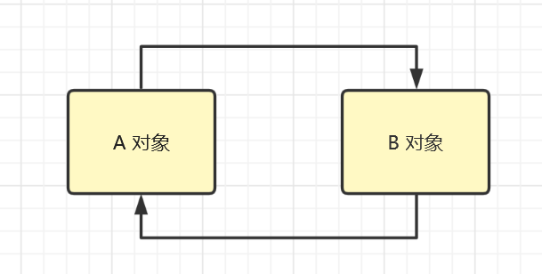


### 1.2 可达性分析算法

* Java 虚拟机中的垃圾回收器采用可达性分析来探索所有存活的对象
* 扫描堆中的对象，看是否能够沿着 `GC Root对象` 为起点的引用链找到该对象，找不到，表示可以
  回收
* 哪些对象可以作为 `GC Root` ?
* [(125条消息) JAVA垃圾回收-可达性分析算法_这瓜保熟么的博客-CSDN博客_可达性分析算法](https://blog.csdn.net/luzhensmart/article/details/81431212)
* [(125条消息) 大白话理解可达性分析算法_程序员小潘的博客-CSDN博客_可达性分析算法](https://javap.blog.csdn.net/article/details/109253339?spm=1001.2101.3001.6650.1&utm_medium=distribute.pc_relevant.none-task-blog-2~default~CTRLIST~Rate-1-109253339-blog-81431212.pc_relevant_multi_platform_whitelistv3&depth_1-utm_source=distribute.pc_relevant.none-task-blog-2~default~CTRLIST~Rate-1-109253339-blog-81431212.pc_relevant_multi_platform_whitelistv3&utm_relevant_index=2)

[堆内存分析器](http://www.eclipse.org/mat/)		[mat打开报错](https://blog.csdn.net/health7788/article/details/123893540)

> jmap -dump:format=b,live,file=1.bin `进程号`
>
> -dump:format=b, 转储为2进制文件 live只保留没有被回收的，会主动触发垃圾回收


### 1.3 四种引用

1. 强引用
   - 只有所有 GC Roots 对象都不通过【强引用】引用该对象，该对象才能被垃圾回收
2. 软引用（SoftReference）
   * 仅有软引用引用该对象时，在垃圾回收后，内存仍不足时会再次出发垃圾回收，回收软引用
     对象
   * 可以配合引用队列来释放软引用自身
3. 弱引用（WeakReference）
   * 仅有弱引用引用该对象时，在垃圾回收时，无论内存是否充足，都会回收弱引用对象
   * 可以配合引用队列来释放弱引用自身
4. 虚引用（PhantomReference）
   * 必须配合引用队列使用，主要配合 ByteBuffer 使用，被引用对象回收时，会将虚引用入队，
     由 Reference Handler 线程调用虚引用相关方法释放直接内存
5. 终结器引用（FinalReference）
   * 无需手动编码，但其内部配合引用队列使用，在垃圾回收时，终结器引用入队（被引用对象
     暂时没有被回收），再由 Finalizer 线程通过终结器引用找到被引用对象并调用它的 finalize
     方法，第二次 GC 时才能回收被引用对象

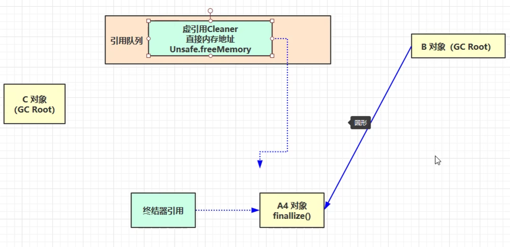

#### 1. 软

```java
/**
 * 演示软引用
 * -Xmx20m -XX:+PrintGCDetails -verbose:gc
 * 结果：并没有引起内存溢出
 */
public static void soft() {
    // list --> SoftReference --> byte[]
    List<SoftReference<byte[]>> list = new ArrayList<>();
    for (int i = 0; i < 5; i++) {
        SoftReference<byte[]> ref = new SoftReference<>(new byte[_4MB]);
        System.out.println(ref.get());
        list.add(ref);
        System.out.println(list.size());

    }
    System.out.println("循环结束：" + list.size());
    for (SoftReference<byte[]> ref : list) {
        System.out.println(ref.get());
    }
}
// 配合引用队列
List<SoftReference<byte[]>> list = new ArrayList<>();
// 引用队列
ReferenceQueue<byte[]> queue = new ReferenceQueue<>();

for (int i = 0; i < 5; i++) {
    // 关联引用队列 当软引用所关联的 byte[]被回收时，软引用自己会加入到 queue 中去
    SoftReference<byte[]> ref = new SoftReference<>(new byte[_4MB],queue);
    System.out.println(ref.get());
    list.add(ref);
    System.out.println(list.size());
}
System.out.println("循环结束：" + list.size());

Reference<? extends byte[]> poll = queue.poll();
for (;poll!=null;poll = queue.poll()) {
    list.remove(poll); // 移除无用的软引用
}

for (SoftReference<byte[]> ref : list) {
    System.out.println(ref.get());
}
```

#### 2. 弱

```java
/**
 * 演示弱引用
 * -Xmx20m -XX:+PrintGCDetails -verbose:gc
 */
//  list --> WeakReference --> byte[]
List<WeakReference<byte[]>> list = new ArrayList<>();
ReferenceQueue<byte[]> queue = new ReferenceQueue<>();
for (int i = 0; i < 10; i++) {
    WeakReference<byte[]> ref = new WeakReference<>(new byte[_4MB],queue);
    list.add(ref);
    for (WeakReference<byte[]> w : list) {
        System.out.print(w.get()+" ");
    }
    System.out.println();
}

for ( Reference<? extends byte[]> poll = queue.poll();poll!= null;poll = queue.poll()) {
    list.remove(poll);
}
System.out.println("循环结束：" + list.size());
```


## 2. 垃圾回收算法


### 2.1 标记清除

定义： Mark Sweep

* 速度较快
* **会造成内存碎片**，空间不连续，一个大的数组之类的需要空间时，总体有空余，但是每个记录的起始结束放不下
* 要清除的时候记录下被清除的对象所占用的内存的起始结束地址，放在空闲地址列表里，下次再分配内存的时候查看是否有足够的内存空间进行分配
* 新版本JDK已经弃用

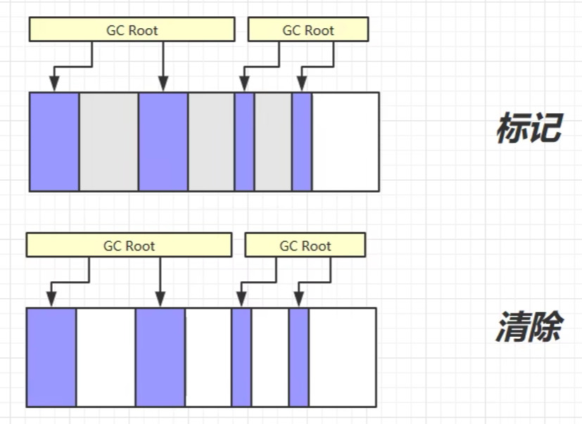

### 2.2 标记整理

定义：Mark Compact

* 速度慢
* 没有内存碎片
* 感觉叫标记压缩比较合适

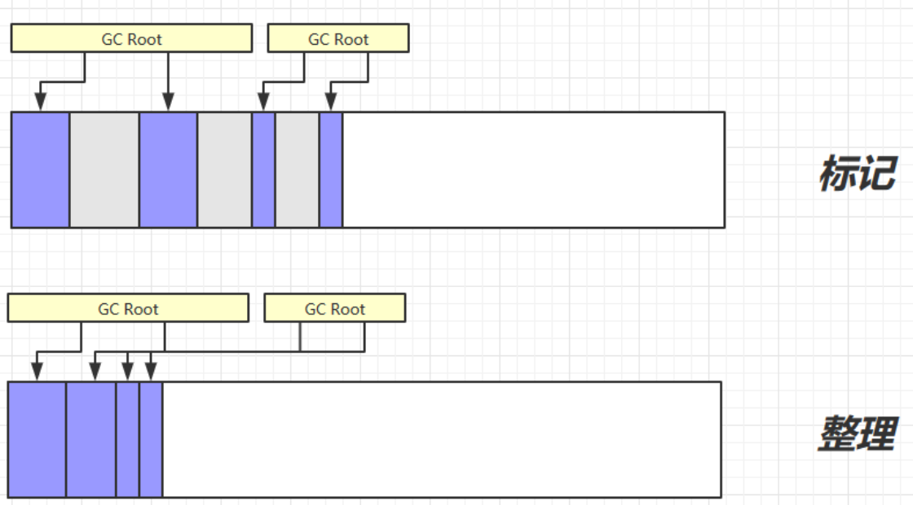

### 2.3 复制

定义：Copy

* 不会有内存碎片
* 需要占用双倍内存空间

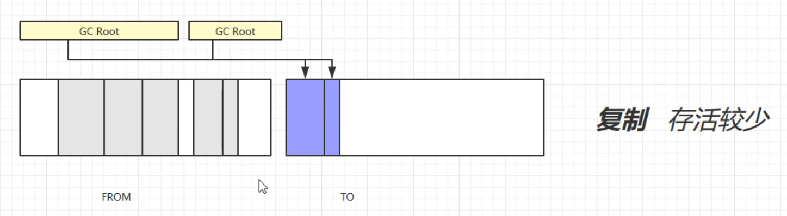

交换to和from

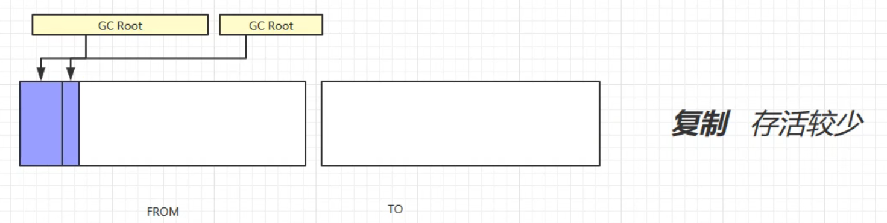


## 3. 分代垃圾回收


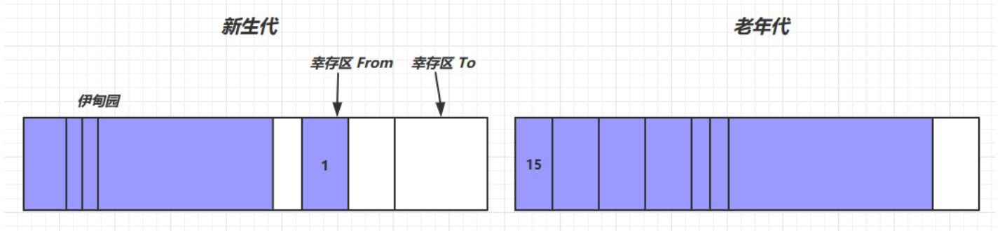

* 对象首先分配在`伊甸园`区域
* 新生代空间不足时，就会触发`Minor GC`垃圾回收，伊甸园和 from 存活的对象使用 copy 复制到 to 中，存活的对象年龄加 1并且**交换** `from  to`
* `Minor gc `会引发 `stop the world`，暂停其它用户的线程，等垃圾回收结束，用户线程才恢复运行
* 当对象寿命超过阈值时，会晋升至老年代，最大寿命是15（4bit）
* 当老年代空间不足，会先尝试触发 `Minor gc`，如果之后空间仍不足，那么触发 `Full GC`，`STW`的时间更长


### 3.1 相关VM参数


|含义 |参数|
|----|:---|
|堆初始大小| `-Xms` |
|堆最大大小| `-Xmx 或 -XX:MaxHeapSize=size` |
|新生代大小| `-Xmn 或 (-XX:NewSize=size + -XX:MaxNewSize=size )` |
|幸存区比例（动态）| `-XX:InitialSurvivorRatio=ratio 和 -XX:+UseAdaptiveSizePolicy` |
|幸存区比例| `-XX:SurvivorRatio=ratio` |
|晋升阈值| `-XX:MaxTenuringThreshold=threshold` |
|晋升详情| `-XX:+PrintTenuringDistribution` |
|GC详情| `-XX:+PrintGCDetails -verbose:gc` |
|FullGC 前 MinorGC| `-XX:+ScavengeBeforeFullGC` |


### 3.2 相关案例

```java
// -Xms20M -Xmx20M -Xmn10M -XX:+UseSerialGC -XX:+PrintGCDetails -verbose:gc -XX:-ScavengeBeforeFullGC
List<byte[]> list = new ArrayList(); // 默认28%新生代占用
// 1. 触发垃圾回收，内存紧张，不会管阈值，直接安排进老年代
list.add(new bytep[_7MB]);
list.add(new bytep[_512KB]);
list.add(new bytep[_512KB]);

// 2. OOM对象
// 策略：如果老年代空间足够，直接晋升到老年代，不会在触发垃圾回收器
list.add(new bytep[_8MB]);

// 3.内存溢出，由于设置 首先会触发一次Minor GC 然后Full GC 对老年代处理垃圾回收，但是仍然不够，抛出异常
list.add(new bytep[_8MB]);list.add(new bytep[_8MB]);
// Exception in thread "main" java.lang.OutOfMemoryError: Java heap space

// 4. 在另一个线程内存溢出会不会影响到主线程？
new Thread(() -> {
    ArrayList<byte[]> list = new ArrayList<>();
    list.add(new byte[_8MB]);
    list.add(new byte[_8MB]);
}).start();

System.out.println("sleep....");
Thread.sleep(1000L); // 不会
```

输出信息记录

```bash
[GC (Allocation Failure) [DefNew: 2067K->664K(9216K), 0.0013706 secs][Tenured: 8192K->8855K(10240K), 0.0016999 secs] 10259K->8855K(19456K), [Metaspace: 3362K->3362K(1056768K)], 0.0031249 secs] [Times: user=0.01 sys=0.00, real=0.00 secs] 
[Full GC (Allocation Failure) [Tenured: 8855K->8837K(10240K), 0.0010621 secs] 8855K->8837K(19456K), [Metaspace: 3362K->3362K(1056768K)], 0.0010738 secs] [Times: user=0.00 sys=0.00, real=0.00 secs] 
Heap
 def new generation   total 9216K, used 246K [0x00000000fec00000, 0x00000000ff600000, 0x00000000ff600000)
  eden space 8192K,   3% used [0x00000000fec00000, 0x00000000fec3d890, 0x00000000ff400000)
  from space 1024K,   0% used [0x00000000ff500000, 0x00000000ff500000, 0x00000000ff600000)
  to   space 1024K,   0% used [0x00000000ff400000, 0x00000000ff400000, 0x00000000ff500000)
 # 老年代
 tenured generation   total 10240K, used 8837K [0x00000000ff600000, 0x0000000100000000, 0x0000000100000000)
   the space 10240K,  86% used [0x00000000ff600000, 0x00000000ffea17e8, 0x00000000ffea1800, 0x0000000100000000)
 Metaspace       used 3397K, capacity 4496K, committed 4864K, reserved 1056768K
  class space    used 372K, capacity 388K, committed 512K, reserved 1048576K
Exception in thread "main" java.lang.OutOfMemoryError: Java heap space
	at cn.itcast.jvm.t2.Demo2_1.main(Demo2_1.java:20)
```


## 4. 垃圾回收器

1. 串行
   * 单线程
   * 堆内存较小，适合个人电脑
2. 吞吐量优先
   * 多线程
   * 堆内存较大的场景，多核CPU
   * 让单位时间内，STW 的时间最短 0.2 0.2 = 0.4，垃圾回收时间占比最低，这样就称吞吐量高
3. 响应时间优先
   * 多线程
   * 堆内存较大的场景，多核CPU
   * 尽可能让单次 STW 的时间最短 0.1 0.1 0.1 0.1 0.1 = 0.5


### 4.1  串行

-XX:+UseSerialGC = `Serial + SerialOld`

* Serial 工作在新生代，算法复制
* SerialOld 工作在老年代，算法标记整理
* 阻塞 防止多线程运行，垃圾回收线程找到错误的地址

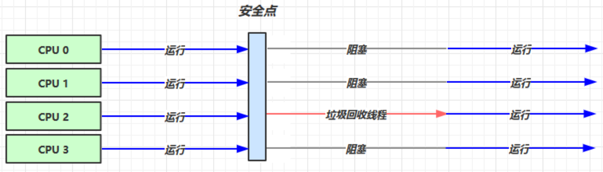


### 4.2 吞吐量优先

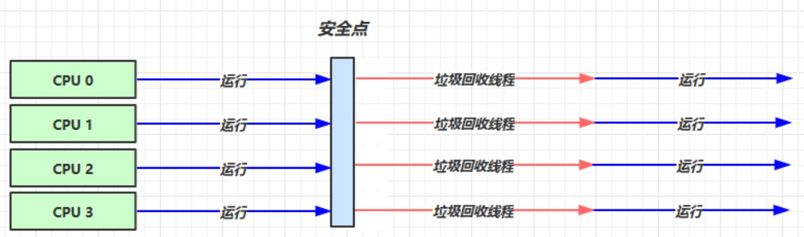

* `-XX:+UseParallelGC (默认开启)~ -XX:+UseParallelOldGC`

  * 只用开启一个 
  * 并行的

  * 默认线程是操作系统CPU核数
  * 会在垃圾回收期让系统CPU占用高

* `-XX:+UseAdaptiveSizePolicy`
  * 采用一个自适应的调整策略，动态调整伊甸园，两代，整个堆的大小，晋升阈值等	

* `-XX:GCTimeRatio=ratio`
  * 调整GC的的时间和总时间的占比
  * 公式 `1/(1+ratio)`
  * 例如 默认99 换算也就是 0.01，如果达不到这个目标 它会调整堆的大小来达到这个目标
  * 建议取值19
* `-XX:MaxGCPauseMillis=ms`
  * 最大暂停(SWT)的毫秒数，与上面的冲突
  * 如果暂停时间变短，那么堆要变小
* `-XX:ParallelGCThreads=n`
  * 控制ParallelGC的线程数


### 4.3 响应时间优先

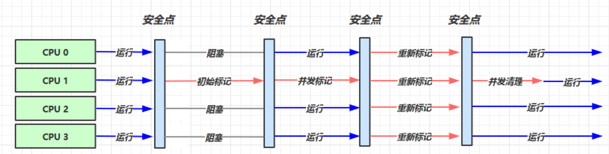

初始标记得时候是SWT的 只会标记根节点 非常快，之后用户线程就可以继续执行了，垃圾回收线程就可以并发执行 给垃圾找出来， 然后重新标记**扫描整个堆内存**（SWT） 因为用户线程运行的时候会产生一些新的对象，引用，然后用户线程继续执行，回收线程并发清理

* `-XX:+UseConcMarkSweepGC ~ -XX:+UseParNewGC ~ SerialOld`

  * 基于**标记清除**的垃圾回收器，并且他是并发的 （用户线程也能同时进行）
  * 对CPU占用不高，用户线程的改变会使吞吐量减少
  * 造成碎片过多，老年代内存不足，造成并发失败，会退化之后做一个单线程，串行的垃圾回收，**时间会很长**
  * 有时会发生一个并发失败的问题，会让`UseConcMarkSweepGC `退化到 `SerialOld`

* `-XX:ParallelGCThreads=n ~ -XX:ConcGCThreads=threads`

  * XX:ParallelGCThreads 并行的垃圾回收线程数

  * XX:ConcGCThreads 并发的线程  建议为并行线程数的`1/4 ` 1个线程执行垃圾回收，剩下的线程留给用户线程

  *  弹幕：

    > 1. 我的理解是：CMS收集器的收集过程是并行和并发过程的交替，所以这里n是并行时的GC线程数，threads是并发时的GC线程数
    >
    > 2. 我也是前面那么理解的 因为用户线程一起执行 可能会导致并行核数不够用 这个时候就会有并发
    >
    > 3. CMS相比parallel GC吞吐量低，我估计是因为parallel GC虽然把用户进程阻塞了，但是就阻塞了一小会而已，等阻塞结束后，实际上CPU就只剩用户线程在用，因此会很快，相比之下吞吐量也就高
    > 4. 书中是这样说的，初始标记是根据roots标记直接关联的对象，不是间接引用哦，看作一颗树的话，就是第二层的所有结点。所以初始标记速度很快
    > 5. 不是的，GC Root实际上就是那些引用，在初始标记阶段，是找到这些引用指向的那些对象，也就是root对象。而并发标记就是通过这些root对象找到所有幸存对象。重新标记阶段是防止漏标，再遍历部分结点
    >
    > 

* `X:CMSInitiatingOccupancyFraction=percent`

  * 控制何时进行垃圾回收 percent(80)内存占比 老年代的内存占用到设定的80% 就执行一次垃圾回收，能预留一些空间给浮动垃圾使用

* `XX:+CMSScavengeBeforeRemark`

  * 在新生代产生的众多新对象(本身也要作为垃圾)，从新生代找到老年代（做可达性分析），就算找到了，然而这些新生代马上也需要被回收掉，相当于在回收之前做了一些无用的查找工作
  * 这个参数是在重新标记之前，对新生代做一次垃圾回收，减轻从新标记时的压力


> - 并发（concurrency）：把任务在不同的时间点交给处理器进行处理。在同一时间点，任务并不会同时运行。
> - 并行（parallelism）：把每一个任务分配给每一个处理器独立完成。在同一时间点，任务一定是同时运行。


### 4.4 G1

定义：Garbage First

* 2004 论文发布
* 2009 JDK 6u14 体验
* 2012 JDK 7u4 官方支持
* 2017 **JDK 9 默认** (废弃了CMS)

适用场景

* 同时注重吞吐量（Throughput）和低延迟（Low latency），默认的暂停目标是 200 ms
* 超大堆内存，会将堆划分为多个大小相等的 `Region`
* 整体上是 标记+整理 算法，两个区域之间是 复制 算法

相关 JVM 参数

<div style="background-color:white;color:#33A1C9;">
-XX:+UseG1GC<br>
-XX:G1HeapRegionSize=size  2^n<br>
-XX:MaxGCPauseMillis=time<br>
</div>

相关链接

* [(125条消息) G1垃圾收集器详解_fyygree的博客-CSDN博客_g1垃圾回收器详解](https://blog.csdn.net/fengyuyeguirenenen/article/details/123483286)
* [(125条消息) G1垃圾收集器详解_黑帽子技术的博客-CSDN博客](https://blog.csdn.net/weixin_45839894/article/details/120433487)
* [(125条消息) G1 垃圾收集器原理详解_张维鹏的博客-CSDN博客_g1回收器原理](https://blog.csdn.net/a745233700/article/details/121724998?ops_request_misc=%7B%22request%5Fid%22%3A%22166416711916781432953619%22%2C%22scm%22%3A%2220140713.130102334.pc%5Fall%5Fv2.%22%7D&request_id=166416711916781432953619&biz_id=0&utm_medium=distribute.pc_search_result.none-task-blog-2~all_v2~first_rank_ecpm_v1~hot_rank-4-121724998-null-null.142^v50^control_1,201^v3^control_1&utm_term=g1垃圾回收器详解&spm=1018.2226.3001.4187) （优）
* [(125条消息) G1垃圾回收器详解_fedorafrog的博客-CSDN博客_g1垃圾回收器](https://blog.csdn.net/fedorafrog/article/details/104503829?ops_request_misc=%7B%22request%5Fid%22%3A%22166416711916781432953619%22%2C%22scm%22%3A%2220140713.130102334.pc%5Fall%5Fv2.%22%7D&request_id=166416711916781432953619&biz_id=0&utm_medium=distribute.pc_search_result.none-task-blog-2~all_v2~first_rank_ecpm_v1~hot_rank-1-104503829-null-null.142^v50^control_1,201^v3^control_1&utm_term=g1垃圾回收器详解&spm=1018.2226.3001.4187) （优）


#### 1)  G1 垃圾回收阶段

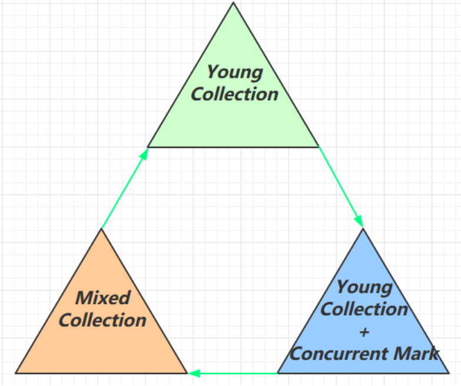

* Young 对于新生代的垃圾回收器
* YCM  等老年代的内存超过一个阈值了，会在新生代垃圾回收的同时执行并发标记
* Mixed 会对新生代，幸存区和老年代进行一个规模较大的垃圾收集
  * 等待内存释放掉会再次循环


#### 2)  Young Conllection

* 会STW

1. 内存分为若干个Eden区

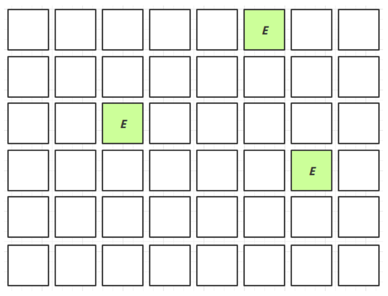

2. 未回收对象移动至幸存区

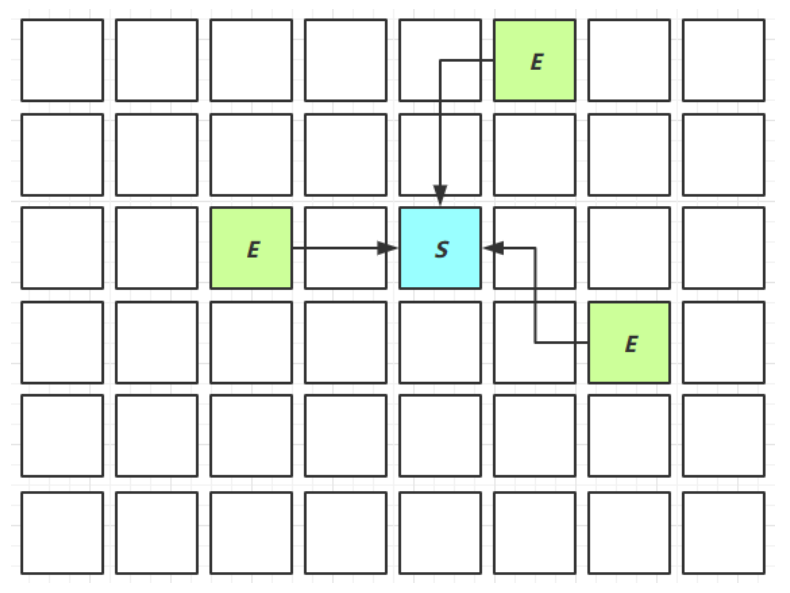

3. 超过阈值晋升至老年代

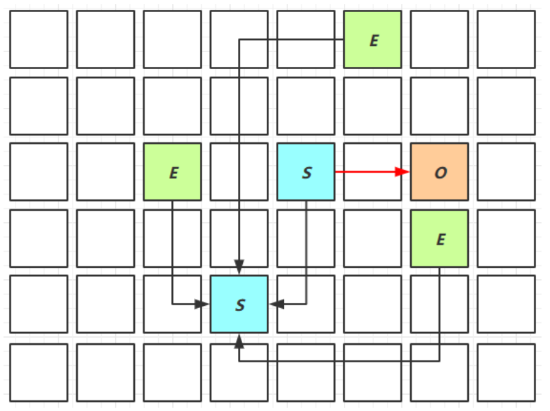


#### 3) Young Collection + CM

* 在 Young GC 时会进行 GC Root 的初始标记
* 老年代占用堆空间比例达到阈值时，进行并发标记（不会 STW），由下面的 JVM 参数决定
* `-XX:InitiatingHeapOccupancyPercent=percent` （默认45%）

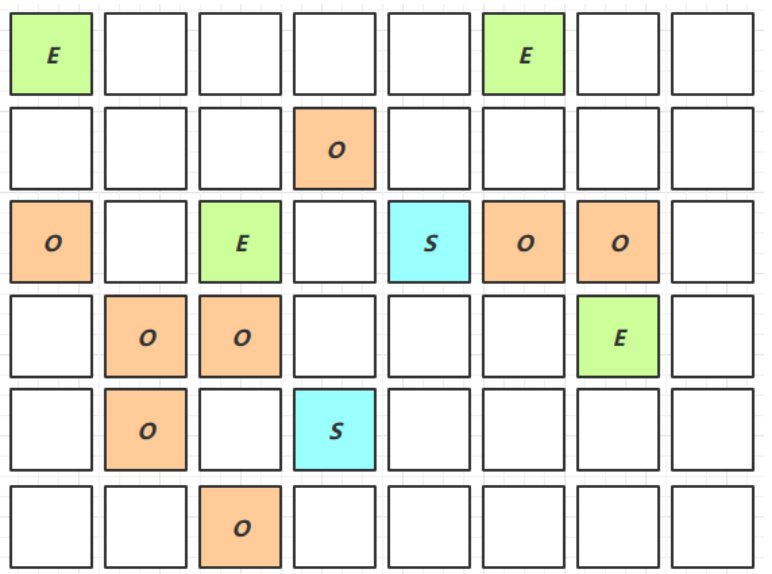


#### 4) Mixed Collection

会对 E、S、O 进行全面垃圾回收

> 整体上是 标记+整理 算法，**两个区域之间是 复制 算法**

 * 最终标记（Remark）会 STW
   * 处理并发标记漏掉的，重新产生或改变引用的对象
 * 拷贝存活（Evacuation）会 STW

`-XX:MaxGCPauseMillis=ms`

G1 会根据暂停时间有选择的进行一个垃圾回收，有时老年区的回收时间可能很长（复制算法），为了达到暂停时间这个目标，G1 会从这些老年代中挑出**价值最高**的区域（能释放较多空间的区域），

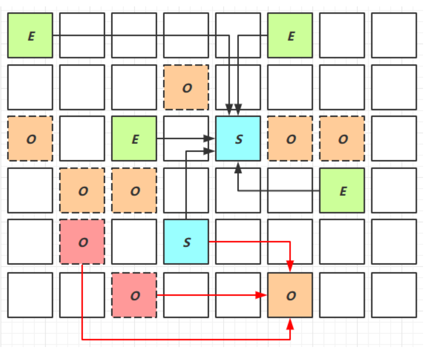


#### 5) Full GC

1. SerialGC

   * 新生代内存不足发生的垃圾收集 - minor gc

   * 老年代内存不足发生的垃圾收集 - full gc

2. ParallelGC

   * 新生代内存不足发生的垃圾收集 - minor gc

   * 老年代内存不足发生的垃圾收集 - full gc

3. CMS

   * 新生代内存不足发生的垃圾收集 - minor gc

   * 老年代内存不足

4. G1

   * 新生代内存不足发生的垃圾收集 - minor gc

   * 老年代内存不足
     * 老年代占用堆空间比例达到阈值时，进行并发标记
     * Mixed Collection
     * 当垃圾回收的速度跟不上垃圾产生的速度并发收集失败，会同样退化为串行Full


#### 6) Young Collection跨代引用

* 新生代回收的跨代引用（老年代引用新生代）问题

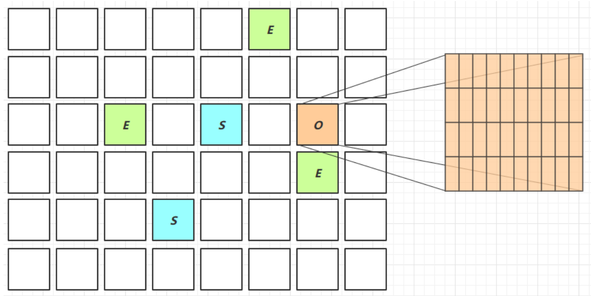

* 卡表与 Remembered Set

  * > 在串行和并行收集器中，GC时是通过整堆扫描来确定对象是否处于可达路径中。然而G1为了避免STW式的整堆扫描，**为每个分区各自分配了一个 RSet**（Remembered Set），它内部类似于一个反向指针，记录了其它 Region 对当前 Region 的引用情况，这样就带来一个极大的好处：回收某个Region时，不需要执行全堆扫描，**只需扫描它的 RSet 就可以找到外部引用**，来确定引用本分区内的对象是否存活，进而确定本分区内的对象存活情况，而这些引用就是 initial mark 的根之一。
    >
    > 事实上，并非所有的引用都需要记录在RSet中，**如果引用源是本分区的对象，那么就不需要记录在 RSet** 中；同时 G1 每次 GC 时，所有的新生代都会被扫描，因此**引用源是年轻代的对象，也不需要在RSet中记录；所以最终只需要记录老年代到新生代之间的引用即可**。

  * Card Table

  * > 如果一个线程修改了Region内部的引用，就必须要去通知RSet，更改其中的记录。需要注意的是，如果引用的对象很多，赋值器需要对每个引用做处理，赋值器开销会很大，因此 G1 回收器引入了 Card Table 解决这个问题。
    >
    > 
    >
    > 一个 Card Table 将一个 Region 在逻辑上划分为若干个固定大小（介于128到512字节之间）的连续区域，每个区域称之为卡片 Card，因此 Card 是堆内存中的最小可用粒度，分配的对象会占用物理上连续的若干个卡片，当查找对分区内对象的引用时便可通过卡片 Card 来查找(见RSet)，每次对内存的回收，也都是对指定分区的卡片进行处理。每个 Card 都用一个 Byte 来记录是否修改过，Card Table 就是这些 Byte 的集合，是一个字节数组，由 Card 的数组下标来标识每个分区的空间地址。默认情况下，每个 Card 都未被引用，当一个地址空间被引用时，这个地址空间对应的数组索引的值被标记为”0″，即标记为脏被引用，此外 RSet 也将这个数组下标记录下来。
    >
    > 
    >
    > 一个Region可能有多个线程在并发修改，因此也可能会并发修改 RSet。为避免冲突，G1垃圾回收器进一步把 RSet 划分成了多个 HashTable，每个线程都在各自的 HashTable 里修改。最终，从逻辑上来说，RSet 就是这些 HashTable 的集合。哈希表是实现 RSet 的一种常见方式，它的好处就是能够去除重复，这意味着，RS的大小将和修改的指针数量相当，而在不去重的情况下，RS的数量和写操作的数量相当。
    >
    > > HashTable 的 Key 是别的 Region 的起始地址，Value是一个集合，里面的元素是Card Table的Index。
    >
    > 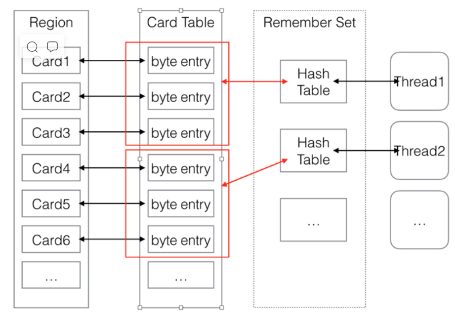
    >
    > 图中RS的虚线表明的是，RSet 并不是一个和 Card Table独立的、不同的数据结构，而是指RS是一个概念模型。实际上，Card Table 是 RS 的一种实现方式。
    >
    > G1对内存的使用以分区(Region)为单位，而对对象的分配则以卡片(Card)为单位。

* 在引用变更时通过 post-write barrier + dirty card queue

* concurrent refinement threads 更新 Remembered Set

  * 写屏障是指，每次 Reference 引用类型在执行写操作时，都会产生 Write Barrier 写屏障暂时中断操作并额外执行一些动作。

  * 对写屏障来说，过滤掉不必要的写操作是十分有必要的，因为写栅栏的指令开销是十分昂贵的，这样既能加快赋值器的速度，也能减轻回收器的负担。G1 收集器的写屏障是跟 RSet 相辅相成的，产生写屏障时会检查要写入的引用指向的对象是否和该 Reference 类型数据在不同的 Region，如果不同，才通过 CardTable 把相关引用信息记录到引用指向对象的所在 Region 对应的 RSet 中，通过过滤就能使 RSet 大大减少。

  * > （1）写前栅栏：即将执行一段赋值语句时，等式左侧对象将修改引用到另一个对象，那么等式左侧对象原先引用的对象所在分区将因此丧失一个引用，那么JVM就需要在赋值语句生效之前，记录丧失引用的对象。但JVM并不会立即维护RSet，而是通过批量处理，在将来RSet更新
    >
    > （2）写后栅栏：当执行一段赋值语句后，等式右侧对象获取了左侧对象的引用，那么等式右侧对象所在分区的RSet也应该得到更新。同样为了降低开销，写后栅栏发生后，RSet也不会立即更新，同样只是记录此次更新日志，在将来批量处理
    >
    > G1垃圾回收器进行垃圾回收时，在GC根节点枚举范围加入RSet，就可以保证不进行全局扫描，也不会有遗漏。另外JVM使用的其余的分代的垃圾回收器也都有写屏障，举例来说，每次将一个老年代对象的引用修改为指向年轻代对象，都会被写屏障捕获并记录下来，因此在年轻代回收的时候，就可以避免扫描整个老年代来查找根。
    >
    > G1的垃圾回收器的写屏障使用一种两级的log buffer结构：
    >
    > global set of filled buffer：所有线程共享的一个全局的，存放填满了的log buffer的集合
    > thread log buffer：每个线程自己的log buffer。所有的线程都会把写屏障的记录先放进去自己的log buffer中，装满了之后，就会把log buffer放到 global set of filled buffer中，而后再申请一个log buffer；

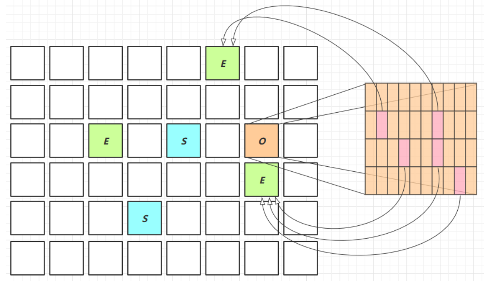


#### 7)  Remark

`pre-write barrier + satb_mark_queue`

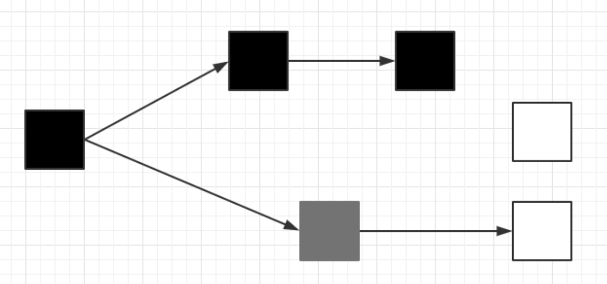

* 黑：在结束时保留
* 灰：正在处理当中
  * 如果有黑色引用，最终会变成黑色
  * 如果没有就是垃圾
* 白：尚未处理
  * 同上


1. 正常情况 并发标记时,标记为垃圾

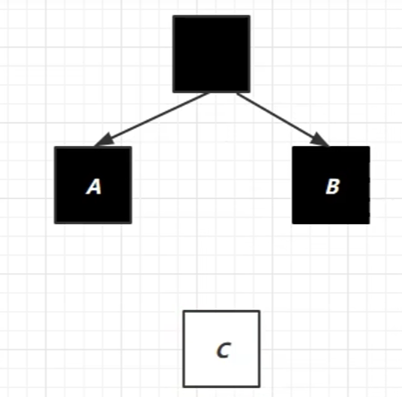

2. 另外一种情况 并发标记尚未结束，用户线程改变引用  写屏障(pre-write barrier)代码执行 将C加入队列(satb_mark_queue)表示还没处理完，等待进入重新标记阶段（STW）时再做检查，发现还有对象引用，变为黑色保留

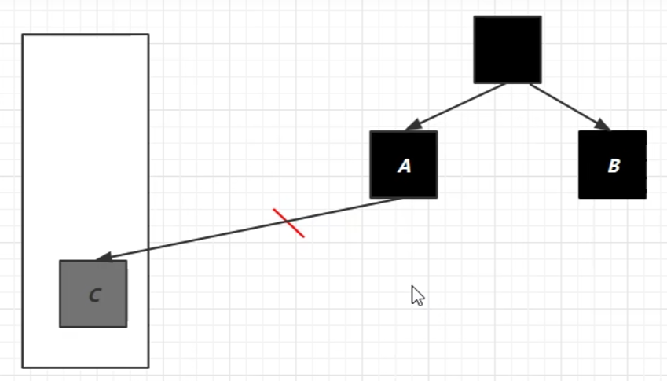


#### 8) JDK 8u20 字符串去重

* 优点：节省大量内存
* 缺点：略微多占用了 cpu 时间，新生代回收时间略微增加

`-XX:+UseStringDeduplication`

```java
String s1 = new String("hello"); // char[]{'h','e','l','l','o'}
String s2 = new String("hello"); // char[]{'h','e','l','l','o'}
```

* 将所有新分配的字符串放入一个队列

* 当新生代回收时，G1并发检查是否有字符串重复

* 如果它们值一样，让它们引用同一个 char[]

* 注意，与 String.intern() 不一样

  * **String.intern() 关注的是字符串对象**
  * 而字符串去重关注的是 char[]
  * 在 JVM 内部，使用了不同的字符串表

  

  #### 9) JDK 8u40 并发标记类卸载

  所有对象都经过并发标记后，就能知道哪些类不再被使用，当一个类加载器的所有类都不再使用，则卸
  载它所加载的所有类

  > 对于自定义类加载器，如果这个加载器下面的所有类以及它们的实例不被使用，那么这个类加载器下面的所有类就会被卸载。

  `-XX:+ClassUnloadingWithConcurrentMark` 默认启用

  

  #### 10) JDK 8u60 回收巨型对象

  * 一个对象大于 region 的一半时，称之为巨型对象
  * G1 不会对巨型对象进行拷贝
  * 回收时被优先考虑
  * G1 会跟踪老年代所有 incoming 引用，这样老年代 incoming 引用为0 的巨型对象就可以在新生代垃圾回收时处理掉

  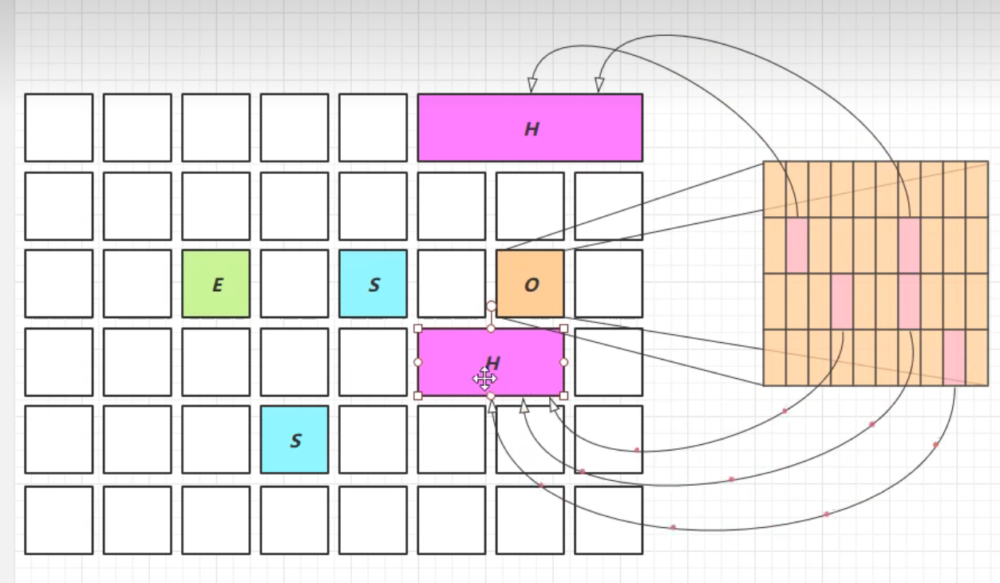

  

  #### 11) JDK 9 并发标记起始时间的调整

  * 并发标记必须在堆空间占满前完成，否则退化为 FullGC(多线程的)
  * JDK 9 之前需要使用 `-XX:InitiatingHeapOccupancyPercent = 45`
  * JDK 9 可以动态调整
    * `-XX:InitiatingHeapOccupancyPercent`用来设置初始值
    * 进行数据采样并动态调整
    * 总会添加一个安全的空档空间

  

  #### 12) JDK 9 更高效的回收

  * 250+增强
  * 180+bug修复
  * https://docs.oracle.com/en/java/javase/12/gctuning

  

## 5. 垃圾回收器调优

预备知识

* 掌握 GC 相关的 VM 参数，会基本的空间调整

  * ```bash
    查看虚拟机运行参数
    "安装路径\bin\java" -XX:+PrintFlagsFinal -version | findstr "GC"
    ```

* 掌握相关工具

* 明白一点：调优跟应用、环境有关，没有放之四海而皆准的法则

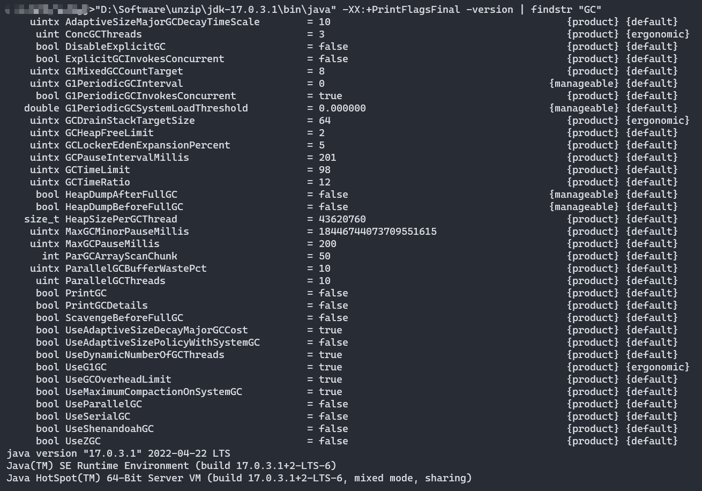


### 5.1 调优领域

* 内存
* 锁竞争
* cpu 占用
* io


### 5.2  确认目标

* 【低延迟】还是【高吞吐量】，选择合适的回收器
* CMS，G1，ZGC
* ParallelGC
* Zing


### 5.3 最快的 GC

答案是不发生 GC

* 查看 FullGC 前后的内存占用，考虑下面几个问题
  * 数据是不是太多？
    * resultSet = statement.executeQuery("select * from 大表 limit n")
  * 数据表示是否太臃肿？
    * 对象图
    * 对象大小 16 Integer 24 int 4
  * 是否存在内存泄漏？
    * static Map map =
    * 软
    * 弱
    * 第三方缓存实现


### 5.4 新生代调优

* 新生代的特点
  * 所有的 new 操作的内存分配非常廉价
    * TLAB thread-local allocation buffer
    * 每个线程都会在伊甸园中分配一块私有的内存空间
  * 死亡对象的回收代价是零
  * 大部分对象用过即死
  * Minor GC 的时间远远低于 Full GC
  * 越大越好吗？
* 越大越好吗？

> -Xmn
> Sets the initial and maximum size (in bytes) of the heap for the young generation (nursery). GC is
> performed in this region more often than in other regions. If the size for the young generation is
> too small, then a lot of minor garbage collections are performed. If the size is too large, then only
> full garbage collections are performed, which can take a long time to complete. Oracle
> recommends that you keep the size for the young generation greater than 25% and less than
> 50% of the overall heap size.

* 新生代能容纳所有【并发量 * (请求-响应)】的数据
* 幸存区大到能保留【当前活跃对象+需要晋升对象】
* 晋升阈值配置得当，让长时间存活对象尽快晋升 防止在from 和 to 复制来去
* Oracle 建议您将新生代的大小保持在总堆大小的 25% 以上且小于 50%。

`-XX:MaxTenuringThreshold=threshold`
`-XX:+PrintTenuringDistribution`

```java
Desired survivor size 48286924 bytes, new threshold 10 (max 10)
- age 1: 28992024 bytes, 28992024 total
- age 2: 1366864 bytes, 30358888 total
- age 3: 1425912 bytes, 31784800 total
...
```


### 5.5 老年代调优

以 CMS 为例

* CMS 的老年代内存越大越好
* 先尝试不做调优，如果没有 Full GC 那么已经...，否则先尝试调优新生代
* 观察发生 Full GC 时老年代内存占用，将老年代内存预设调大 1/4 ~ 1/3
  * `-XX:CMSInitiatingOccupancyFraction=percent`


### 5.6 案例

* 1 Full GC和Minor GC 频繁

  * 先试着增大新生代的内存，幸存区的空间，晋升的阈值

* 2 请求高峰期发生Full GC，单次暂停时间特别长（CMS）

  * > 初始标记：仅仅标记GC ROOTS的直接关联对象，并且世界暂停
    >
    > 并发标记：使用GC ROOTS TRACING算法，进行跟踪标记，世界不暂停
    >
    > ​					并发标记过程中产生变动的对象会放入一个队列中供重新标记过程遍历
    >
    > 重新标记，因为之前并发标记，其他用户线程不暂停，可能产生了新垃圾，所以重新标记，世界暂停

  * 分析在重新标记阶段耗时，`XX:+CMSScavengeBeforeRemark` 在重新标记之前做一次新生代垃圾回收

* 3 老年代充裕的情况下，发生Full GC（CMS 1.7）

  * 1.7永久代的空间不足也会导致Full GC，调大永久代内存
  * 1.8元空间的垃圾回收就不是Java控制的了 直接绑定操作系统，很难发生空间不足问题
