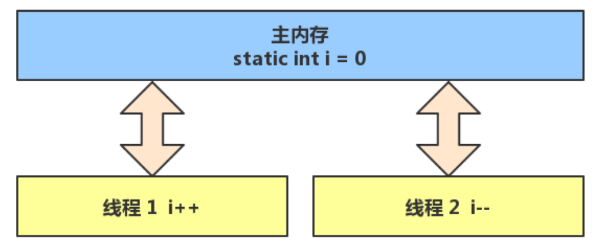
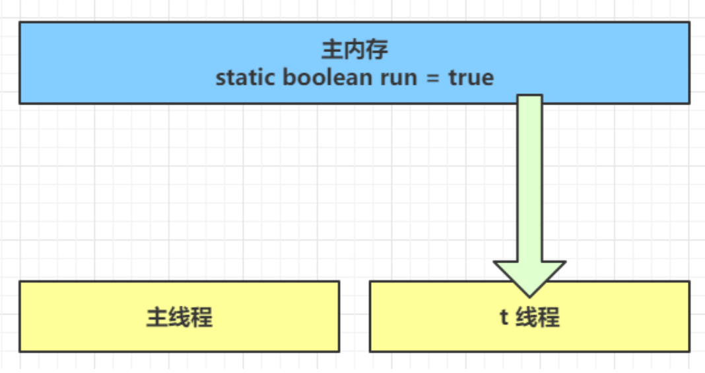
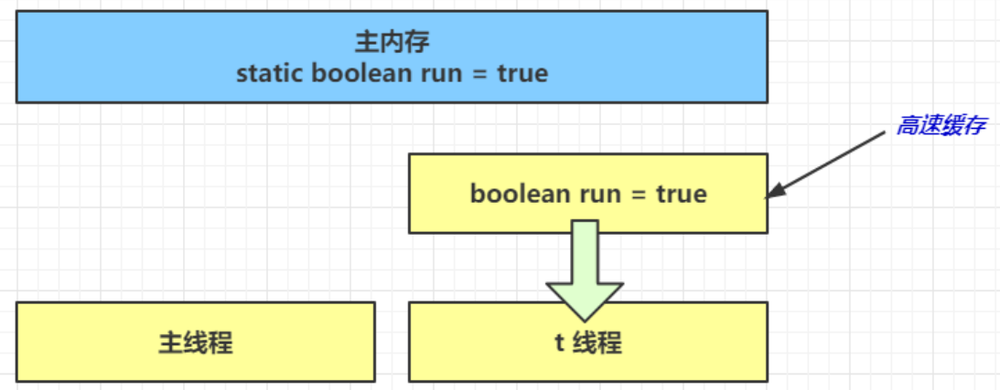
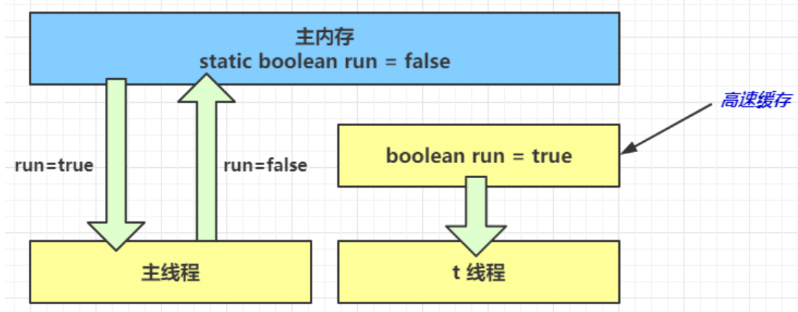

# 内存模型


<hr>

[TOC]

<hr>


## 1. Java内存模型

很多人将【java 内存结构】与【java 内存模型】傻傻分不清，【java 内存模型】是 Java Memory Model（JMM）的意思。

关于它的权威解释，请参考 https://download.oracle.com/otn-pub/jcp/memory_model-1.0-pfd-spec-oth-JSpec/memory_model-1_0-pfd-spec.pdf?AuthParam=1562811549_4d4994cbd5b59d964cd2907ea22ca08b

简单的说，JMM 定义了一套在多线程读写共享数据时（成员变量、数组）时，对数据的可见性、有序性、和原子性的规则和保障


### 1.1 原子性

原子性在学习线程时讲过，下面来个例子简单回顾一下：

问题提出，两个线程对初始值为 0 的静态变量一个做自增，一个做自减，各做 5000 次，结果是 0 吗？


### 1.2  问题分析

以上的结果可能是正数、负数、零。为什么呢？因为 Java 中对静态变量的自增，自减并不是原子操作。

例如对于 `i++` 而言（i 为静态变量），实际会产生如下的 JVM 字节码指令：

```java
getstatic  i 	// 获取静态变量i的值
iconst_1 		// 准备常量1
iadd 			// 加法
putstatic  i 	// 将修改后的值存入静态变量i
```

而对应 `i-- `也是类似：

```java
getstatic  i 	// 获取静态变量i的值
iconst_1 		// 准备常量1
isub 			// 减法
putstatic  i 	// 将修改后的值存入静态变量i
```

而 Java 的内存模型如下，完成静态变量的自增，自减需要在主存和线程内存中进行数据交换：



而 Java 的内存模型如下，完成静态变量的自增，自减需要在主存和线程内存中进行数据交换：如果是单线程以上 8 行代码是顺序执行（不会交错）没有问题：

```java
// 假设i的初始值为0
getstatic  i 		// 线程1-获取静态变量i的值 线程内i=0
iconst_1 			// 线程1-准备常量1
iadd 				// 线程1-自增 线程内i=1
putstatic  i 		 // 线程1-将修改后的值存入静态变量i 静态变量i=1
getstatic  i 		 // 线程1-获取静态变量i的值 线程内i=1
iconst_1 			// 线程1-准备常量1
isub 				// 线程1-自减 线程内i=0
putstatic  i 		// 线程1-将修改后的值存入静态变量i 静态变量i=0
```

但多线程下这 8 行代码可能交错运行（为什么会交错？思考一下）：

出现负数的情况：

```java
// 假设i的初始值为0
getstatic  i 		// 线程1-获取静态变量i的值 线程内i=0
getstatic  i 		// 线程2-获取静态变量i的值 线程内i=0
iconst_1 			// 线程1-准备常量1
iadd 				// 线程1-自增 线程内i=1
putstatic  i 		// 线程1-将修改后的值存入静态变量i 静态变量i=1
iconst_1 			// 线程2-准备常量1
isub 				// 线程2-自减 线程内i=-1
putstatic  i 		// 线程2-将修改后的值存入静态变量i 静态变量i=-1
```

出现正数的情况：

```java
// 假设i的初始值为0
getstatic  i 	// 线程1-获取静态变量i的值 线程内i=0
getstatic  i 	// 线程2-获取静态变量i的值 线程内i=0
iconst_1 		// 线程1-准备常量1
iadd 			// 线程1-自增 线程内i=1
iconst_1 		// 线程2-准备常量1
isub 			// 线程2-自减 线程内i=-1
putstatic  i 	// 线程2-将修改后的值存入静态变量i 静态变量i=-1
putstatic  i 	// 线程1-将修改后的值存入静态变量i 静态变量i=1
```

> 两个线程都是读到自己的操作数栈上进行加减得出结果再将结果赋值给静态变量

### 1.3 解决方法

`synchronized`

语法

```java
synchronized( 对象 ) {
	要作为原子操作代码
}
```

用 `synchronized `解决并发问题：

```java
static int i = 0;
static Object obj = new Object();
public static void main(String[] args) throws InterruptedException {
    Thread t1 = new Thread(() -> {
        synchronized (obj) {
            for (int j = 0; j < 50000; j++) {
                synchronized(obj){
                   i++; 
                }
            }
        }
    });

    Thread t2 = new Thread(() -> {
        synchronized (obj) {
            for (int j = 0; j < 50000; j++) {
                 synchronized(obj){
                   i--; 
                }
            }
        }
    });
    t1.start();
    t2.start();

    t1.join();
    t2.join();
    System.out.println(i);
}
```

如何理解呢：你可以把 obj 想象成一个房间，线程 t1，t2 想象成两个人。

当线程 t1 执行到 synchronized(obj) 时就好比 t1 进入了这个房间，并反手锁住了门，在门内执行count++ 代码。

这时候如果 t2 也运行到了 synchronized(obj) 时，它发现门被锁住了，只能在门外等待。

当 t1 执行完 synchronized{} 块内的代码，这时候才会解开门上的锁，从 obj 房间出来。t2 线程这时才可以进入 obj 房间，反锁住门，执行它的 count-- 代码。

> 注意：上例中 t1 和 t2 线程必须用 synchronized 锁住同一个 obj 对象，如果 t1 锁住的是 m1 对象，t2 锁住的是 m2 对象，就好比两个人分别进入了两个不同的房间，没法起到同步的效果。


## 2. 可见性


#### 2.1 退不出的循环

```java
static boolean run = true;

public static void main(String[] args) throws InterruptedException {
    Thread t = new Thread(()->{
        while(run){
            // ....
            System.out.println(1);
        }
    });
    t.start();

    Thread.sleep(1000);
    run = false; // 线程t不会如预想的停下来
}
```


为什么呢？分析一下：

1.  初始状态， t 线程刚开始从主内存读取了 run 的值到工作内存。



2. 因为 t 线程要频繁从主内存中读取 run 的值，JIT 编译器会将 run 的值缓存至自己工作内存中的高速缓存中，减少对主存中 run 的访问，提高效率



3.  1 秒之后，main 线程修改了 run 的值，并同步至主存，而 t 是从自己工作内存中的高速缓存中读取这个变量的值，结果永远是旧值

   

   


#### 2.2 解决方法

volatile（易变关键字）

它可以用来修饰成员变量和静态成员变量，他可以避免线程从自己的工作缓存中查找变量的值，必须到主存中获取它的值，线程操作 volatile 变量都是直接操作主存


#### 2.3 可见性

前面例子体现的实际就是可见性，它保证的是在多个线程之间，一个线程对 volatile 变量的修改对另一个线程可见， 不能保证原子性，仅用在一个写线程，多个读线程的情况：

上例从字节码理解是这样的

```java
getstatic run 	// 线程 	t 获取 run true
getstatic run 	// 线程 	t 获取 run true
getstatic run 	// 线程 	t 获取 run true
getstatic run 	// 线程 	t 获取 run true
putstatic run 	// 线程 	main 修改 run 为 false， 仅此一次
getstatic run 	// 线程 	t 获取 run false
```

比较一下之前我们将线程安全时举的例子：两个线程一个 i++ 一个 i-- ，只能保证看到最新值，不能解决指令交错

```java
// 假设i的初始值为0
getstatic  i 	// 线程1-获取静态变量i的值 线程内i=0
getstatic  i 	// 线程2-获取静态变量i的值 线程内i=0
iconst_ 1 		// 线程1-准备常量1
iadd 			// 线程1-自增 线程内i=1
putstatic  i 	// 线程1-将修改后的值存入静态变量i 静态变量i=1
iconst_1 		// 线程2-准备常量1
isub 			// 线程2-自减 线程内i=-1
putstatic  i 	// 线程2-将修改后的值存入静态变量i 静态变量i=-1
```


> **注意**
> synchronized 语句块既可以保证代码块的原子性，也同时保证代码块内变量的可见性。但缺点是synchronized是属于重量级操作，性能相对更低
>
> 如果在前面示例的死循环中加入 System.out.println() 会发现即使不加 volatile 修饰符，线程 t 也能正确看到对 run 变量的修改了，想一想为什么？


## 3. 有序性


#### 3.1 诡异的结果

```java
int num = 0;
boolean ready = false;
// 线程1 执行此方法
public void actor1(I_Result r) {
    if(ready) {
    	r.r1 = num + num;
    } else {
        r.r1 = 1;
	}
}
// 线程2 执行此方法
public void actor2(I_Result r) {
    num = 2;
    ready = true;
}
```

I_Result 是一个对象，有一个属性 r1 用来保存结果，问，可能的结果有几种？

有同学这么分析

情况1：线程1 先执行，这时 ready = false，所以进入 else 分支结果为 1

情况2：线程2 先执行 num = 2，但没来得及执行 ready = true，线程1 执行，还是进入 else 分支，结果为1

情况3：线程2 执行到 ready = true，线程1 执行，这回进入 if 分支，结果为 4（因为 num 已经执行过了）


但我告诉你，结果还有可能是 0 😁😁😁，信不信吧！

这种情况下是：线程2 执行 ready = true，切换到线程1，进入 if 分支，相加为 0，再切回线程2 执行num = 2

相信很多人已经晕了 😵😵😵


这种现象叫做指令重排，是 JIT 编译器在运行时的一些优化，这个现象需要通过大量测试才能复现：

借助 java 并发压测工具 jcstress https://wiki.openjdk.java.net/display/CodeTools/jcstress

```
mvn archetype:generate -DinteractiveMode=false -
DarchetypeGroupId=org.openjdk.jcstress -DarchetypeArtifactId=jcstress-java-test-
archetype -DgroupId=org.sample -DartifactId=test -Dversion=1.0
```

创建 maven 项目，提供如下测试类

```java
@JCStressTest
@Outcome(id = {"1", "4"}, expect = Expect.ACCEPTABLE, desc = "ok")
@Outcome(id = "0", expect = Expect.ACCEPTABLE_INTERESTING, desc = "!!!!")
@State
public class ConcurrencyTest {
    int num = 0;
    boolean ready = false;
    
    @Actor
    public void actor1(I_Result r) {
        if(ready) {
        	r.r1 = num + num;
        } else {
            r.r1 = 1;
        }
    }
    
    @Actor
    public void actor2(I_Result r) {
        num = 2;
        ready = true;
    }
}
```

执行

```
mvn clean install
java -jar target/jcstress.jar
```

会输出我们感兴趣的结果，摘录其中一次结果：

```
*** INTERESTING tests
	Some interesting behaviors observed. This is for the plain curiosity.
	
	2 matching test results.
		[OK] test.ConcurrencyTest
	  (JVM args: [-XX:-TieredCompilation])
	Observed state 		Occurrences 	Expectation 			Interpretation
		0 				1,729 	  	  ACCEPTABLE_INTERESTING 	!!!!
		1 				42,617,915 	  ACCEPTABLE 			  	 ok
		4 				5,146,627 	  ACCEPTABLE 				 ok
		[OK] test.ConcurrencyTest
	(JVM args: [])
	Observed state 		Occurrences 	Expectation 			Interpretation
		0 				1,652 		   ACCEPTABLE_INTERESTING 	!!!!
         1 				 46,460,657 	ACCEPTABLE 				ok
         4 				 4,571,072 		ACCEPTABLE 				ok
```

可以看到，出现结果为 0 的情况有 638 次，虽然次数相对很少，但毕竟是出现了。


#### 3.2 解决方法

volatile 修饰的变量，可以禁用指令重排

```java
@JCStressTest
@Outcome(id = {"1", "4"}, expect = Expect.ACCEPTABLE, desc = "ok")
@Outcome(id = "0", expect = Expect.ACCEPTABLE_INTERESTING, desc = "!!!!")
@State
public class ConcurrencyTest {
    int num = 0;
    volatile boolean ready = false;
    
    @Actor
    public void actor1(I_Result r) {
        if(ready) {
        	r.r1 = num + num;
        } else {
            r.r1 = 1;
        }
    }
    
    @Actor
    public void actor2(I_Result r) {
        num = 2;
        ready = true;
    }
}
```

结果为：

```java
*** INTERESTING tests
Some interesting behaviors observed. This is for the plain curiosity.
0 matching test results.
```


## 剩下部分详见PDF

