# 并发编程


logback.xml

```xml
<?xml version="1.0" encoding="UTF-8"?>
<configuration
        xmlns="http://ch.qos.logback/xml/ns/logback"
        xmlns:xsi="http://www.w3.org/2001/XMLSchema-instance"
        xsi:schemaLocation="http://ch.qos.logback/xml/ns/logback logback.xsd">
    <appender name="STDOUT" class="ch.qos.logback.core.ConsoleAppender">
        <encoder>
            <pattern>%date{HH:mm:ss} [%t] %logger - %m%n</pattern>
        </encoder>
    </appender>
    <logger name="c" level="debug" additivity="false">
        <appender-ref ref="STDOUT"/>
    </logger>
    <root level="DEBUG">
        <appender-ref ref="STDOUT"/>
    </root>
</configuration>
```


<hr>

[TOC]


<hr>


# 1. 进程和线程


## 1.1 概述

#### 进程

* 程序由指令和数据组成，但这些指令要运行，数据要读写，就必须将指令加载至 CPU，数据加载至内存。在指令运行过程中还需要用到磁盘、网络等设备。进程就是用来加载指令、管理内存、管理 IO 的
* 当一个程序被运行，从磁盘加载这个程序的代码至内存，这时就开启了一个进程。
* 进程就可以视为程序的一个实例。大部分程序可以同时运行多个实例进程（例如记事本、画图、浏览器等），也有的程序只能启动一个实例进程（例如网易云音乐、360 安全卫士等）


#### 线程

* 一个进程之内可以分为一到多个线程。
* 一个线程就是一个指令流，将指令流中的一条条指令以一定的顺序交给 CPU 执行
* Java 中，线程作为最小调度单位，进程作为资源分配的最小单位。 在 windows 中进程是不活动的，只是作为线程的容器


#### 二者对比

* 进程基本上相互独立的，而线程存在于进程内，是进程的一个子集
* 进程拥有共享的资源，如内存空间等，供其内部的线程共享
* 进程间通信较为复杂
  * 同一台计算机的进程通信称为 IPC（Inter-process communication）
  * 不同计算机之间的进程通信，需要通过网络，并遵守共同的协议，例如 HTTP
* 线程通信相对简单，因为它们共享进程内的内存，一个例子是多个线程可以访问同一个共享变量
* 线程更轻量，线程上下文切换成本一般上要比进程上下文切换低


## 1.2 并发与并行


### 概念

#### 并发

单核 cpu 下，线程实际还是 `串行执行` 的。操作系统中有一个组件叫做任务调度器，将 cpu 的时间片（windows下时间片最小约为 15 毫秒）分给不同的程序使用，只是由于 cpu 在线程间（时间片很短）的切换非常快，人类感觉是 同时运行的 。总结为一句话就是：` 微观串行，宏观并行 `，一般会将这种`线程轮流使用CPU` 的做法称为并发， `concurrent`

|CPU |时间片 1 |时间片 2 |时间片 3 |时间片 4|
|--|--|--|--|--|
|core 1 |线程 1| 线程 2 |线程 3 |线程 3|

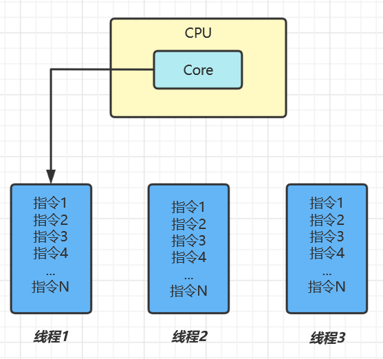

#### 并行

多核 cpu下，每个`核（core）`都可以调度运行线程，这时候线程可以是并行的。

| CPU    | 时间片 1 | 时间片 2 | 时间片 3 | 时间片 4 |
| ------ | -------- | -------- | -------- | -------- |
| core 1 | 线程 1   | 线程 2   | 线程 3   | 线程 3   |
| core 2 | 线程 2   | 线程 4   | 线程 2   | 线程 4   |

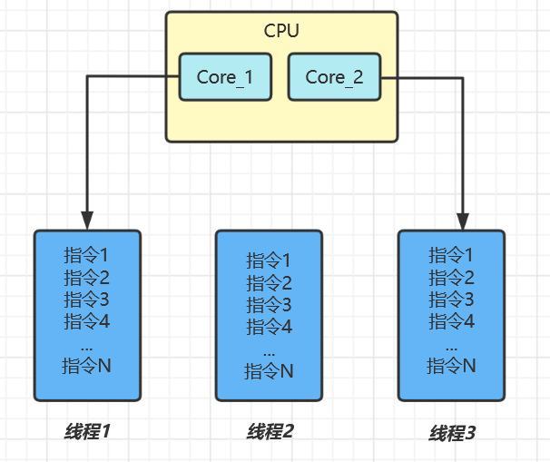


#### 并行下的并发

线程比CPU核心(Core)多

| CPU    | 时间片 1 | 时间片 2 | 时间片 3 | 时间片 4 |
| ------ | -------- | -------- | -------- | -------- |
| core 1 | 线程 1   | 线程 2   | 线程 3   | 线程 3   |
| core 2 | 线程 2   | 线程 4   | 线程 2   | 线程 4   |

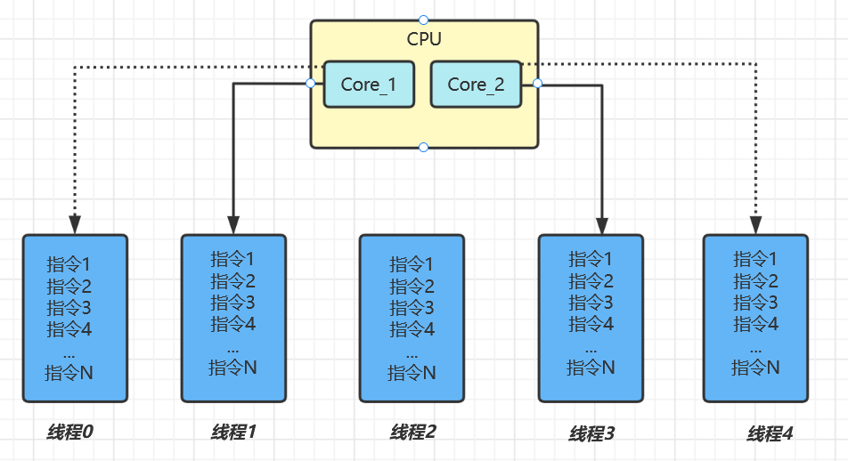


引用 Rob Pike 的一段描述：

* 并发（concurrent）是同一时间应对（dealing with）多件事情的能力
* 并行（parallel）是同一时间动手做（doing）多件事情的能力

例子

* 家庭主妇做饭、打扫卫生、给孩子喂奶，她一个人轮流交替做这多件事，这时就是并发
* 家庭主妇雇了个保姆，她们一起这些事，这时既有并发，也有并行（这时会产生竞争，例如锅只有一口，一个人用锅时，另一个人就得等待）
* 雇了3个保姆，一个专做饭、一个专打扫卫生、一个专喂奶，互不干扰，这时是并行


> **Rob Pike 资料**
>
> * golang 语言的创造者
> * [Rob Pike - 百度百科](https://baike.baidu.com/item/%E7%BD%97%E5%B8%83%C2%B7%E6%B4%BE%E5%85%8B/10983505?fromtitle=Rob%20Pike&fromid=58101861&fr=aladdin)


## 1.3 应用

#### 异步调用

以调用方角度来讲，如果

* 需要等待结果返回，才能继续运行就是同步
* 不需要等待结果返回，就能继续运行就是异步

##### 1) 设计

多线程可以让方法执行变为异步的（即不要巴巴干等着）比如说读取磁盘文件时，假设读取操作花费了 5 秒钟，如果没有线程调度机制，这 5 秒 cpu 什么都做不了，其它代码都得暂停...

```java
public static void main(String[] args) {
    new Thread(()->{
        FileReader.read(Constants.MV);
    },"T1").start();
    log.info("main......");
}
19:36:39 [main] com.wjl.juc.j1.u3.ASync - main......
19:36:39 [T1] c.FileReader - read [D:/NormalFile/video/MV.mkv] start ...
19:36:40 [T1] c.FileReader - read [D:/NormalFile/video/MV.mkv] end ... cost: 996 ms
```


##### 2) 结论

* 比如在项目中，视频文件需要转换格式等操作比较费时，这时开一个新线程处理视频转换，避免阻塞主线程
* tomcat 的异步 servlet 也是类似的目的，让用户线程处理耗时较长的操作，避免阻塞 tomcat 的工作线程
* ui 程序中，开线程进行其他操作，避免阻塞 ui 线程


#### 提高效率

充分利用多核 cpu 的优势，提高运行效率。想象下面的场景，执行 3 个计算，最后将计算结果汇总。

```
计算 	1 	花费 10 ms
计算 	2 	花费 11 ms
计算 	3 	花费 9 ms
汇总需要 1 ms
```

* 如果是串行执行，那么总共花费的时间是 `10 + 11 + 9 + 1 = 31ms`
* 但如果是四核 cpu，各个核心分别使用线程 1 执行计算 1，线程 2 执行计算 2，线程 3 执行计算 3，那么 3个线程是并行的，花费时间只取决于最长的那个线程运行的时间，即` 11ms `最后加上汇总时间只会花费`12ms`

> **注意**
>
> 需要在多核 cpu 才能提高效率，单核仍然时是轮流执行


##### 1) 设计

###### 多核环境

```java
Benchmark 			Mode 		Samples Score 		Score error 	Units
o.s.MyBenchmark.c 	 avgt 					5 		0.020 0.001 	s/op
o.s.MyBenchmark.d 	 avgt 					5 		0.043 0.003 	s/op
```

可以看到多核下，效率提升还是很明显的，快了一倍左右

###### 单核环境

```java
Benchmark 			Mode 		Samples Score 		Score error 	Units
o.s.MyBenchmark.c 	 avgt 					5 		0.061 0.060 	s/op
o.s.MyBenchmark.d 	 avgt 					5 		0.064 0.071 	s/op
```

性能几乎是一样的

##### 2) 结论

1. 单核 cpu 下，多线程不能实际提高程序运行效率，只是为了能够在不同的任务之间切换，不同线程轮流使用cpu ，不至于一个线程总占用 cpu，别的线程没法干活
2. 多核 cpu 可以并行跑多个线程，但能否提高程序运行效率还是要分情况的
   * 有些任务，经过精心设计，将任务拆分，并行执行，当然可以提高程序的运行效率。但不是所有计算任务都能拆分（参考后文的【阿姆达尔定律】）
   * 也不是所有任务都需要拆分，任务的目的如果不同，谈拆分和效率没啥意义
3. IO 操作不占用 cpu，只是我们一般拷贝文件使用的是【阻塞 IO】，这时相当于线程虽然不用 cpu，但需要一直等待 IO 结束，没能充分利用线程。所以才有后面的【非阻塞 IO】和【异步 IO】优化


# 2. Java 线程


## 2.1 创建和运行线程

#### 1. 直接使用Thread

```java
// 构造方法的参数是给线程指定名字，推荐
Thread t1 = new Thread("t1") {
    @Override
    // run 方法内实现了要执行的任务
    public void run() {
    	log.debug("hello");
    }
};
t1.start();
```

输出

```
19:19:00 [t1] c.ThreadStarter - hello
```

#### 2. 使用 Runnable 配合 Thread

把【线程】和【任务】（要执行的代码）分开

* Thread 代表线程
* Runnable 可运行的任务（线程要执行的代码）

```java
// 创建任务对象
Runnable task2 = new Runnable() {
    @Override
    public void run() {
        log.debug("hello");
    }
};
// 参数1 是任务对象; 参数2 是线程名字，推荐
Thread t2 = new Thread(task2, "t2");
t2.start();
```

输出

```
19:19:00 [t2] c.ThreadStarter - hello
```

##### 分析Thread和Runable关系

```java
// Thread.run();
// target ==> Runable
@Override
public void run() {
    if (target != null) {
        target.run();
    }
}
```

##### 小结

* 方法1 是把线程和任务合并在了一起，方法2 是把线程和任务分开了
* 用 Runnable 更容易与线程池等高级 API 配合
* 用 Runnable 让任务类脱离了 Thread 继承体系，更灵活


#### 3. FutureTask 配合 Thread

FutureTask 能够接收 Callable 类型的参数，用来处理有返回结果的情况

```java
// 创建任务对象
FutureTask<Integer> task3 = new FutureTask<>(() -> {
    log.debug("hello");
    return 100;
});

// 参数1 是任务对象; 参数2 是线程名字，推荐
new Thread(task3, "t3").start();

// 主线程阻塞，同步等待 task 执行完毕的结果
Integer result = task3.get();
log.debug("结果是:{}", result);
```

输出

```
19:22:27 [t3] c.ThreadStarter - hello
19:22:27 [main] c.ThreadStarter - 结果是:100
```


## 2.2 观察多个线程同时运行

主要是理解

* 交替执行
* 谁先谁后，不由我们控制


## 2.3 查看进程线程的方法

#### 1. windows

* 任务管理器可以查看进程和线程数，也可以用来杀死进程
* tasklist 查看进程
* taskkill 杀死进程


#### 2. Linux

* `ps -fe `查看所有进程
* `ps -fT -p <PID> `查看某个进程（PID）的所有线程
* `kill 杀死进程`
* `top` 按大写 H 切换是否显示线程
* `top -H -p <PID>` 查看某个进程（PID）的所有线程


#### 3. java

* `jps` 命令查看所有 Java 进程
* `jstack <PID>`查看某个 Java 进程（PID）的所有线程状态
* `jconsole` 来查看某个 Java 进程中线程的运行情况（图形界面）


jconsole 远程监控配置

需要以如下方式运行你的 java 类

```
ava -Djava.rmi.server.hostname=`ip地址` -Dcom.sun.management.jmxremote -Dcom.sun.management.jmxremote.port=`连接端口` -Dcom.sun.management.jmxremote.ssl=是否安全连接 -
Dcom.sun.management.jmxremote.authenticate=是否认证 java类
```

* 修改 /etc/hosts 文件将 127.0.0.1 映射至主机名
* 如果要认证访问，还需要做如下步骤
* 复制 jmxremote.password 文件
* 修改 jmxremote.password 和 jmxremote.access 文件的权限为 600 即文件所有者可读写
* 连接时填入 controlRole（用户名），R&D（密码）


## 2.4 线程运行原理


### 栈与栈帧

Java Virtual Machine Stacks （Java 虚拟机栈）

我们都知道 JVM 中由堆、栈、方法区所组成，其中栈内存是给谁用的呢？其实就是线程，每个线程启动后，虚拟机就会为其分配一块栈内存。

* 每个栈由多个栈帧（Frame）组成，对应着每次方法调用时所占用的内存
* 每个线程只能有一个活动栈帧，对应着当前正在执行的那个方法


#### 单线程栈帧

1. 调用方法

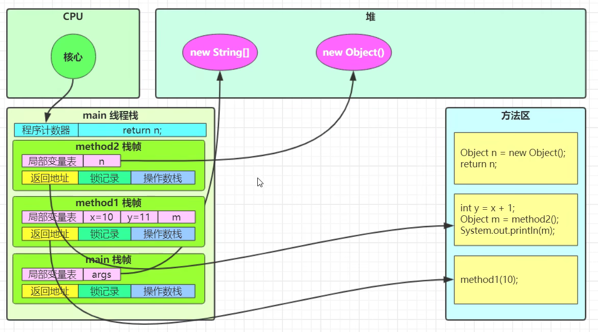

2. 弹出栈帧，依次返回

弹出n 执行m方法

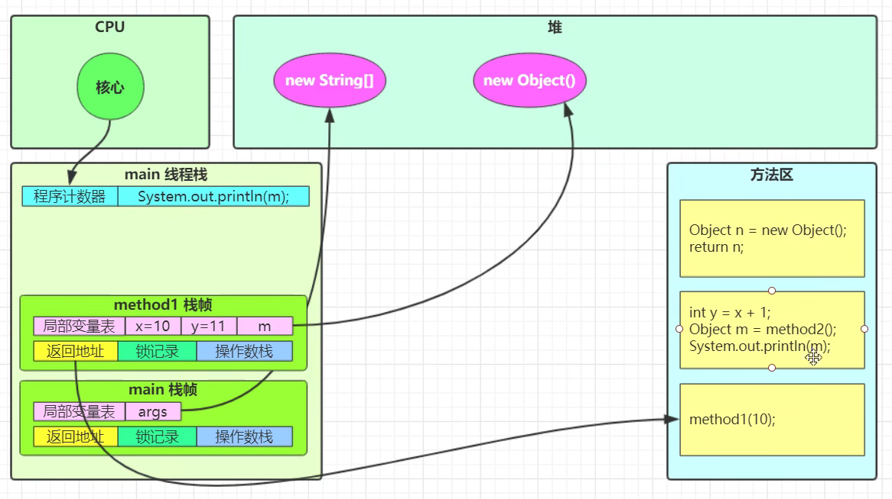

弹出m执行结束

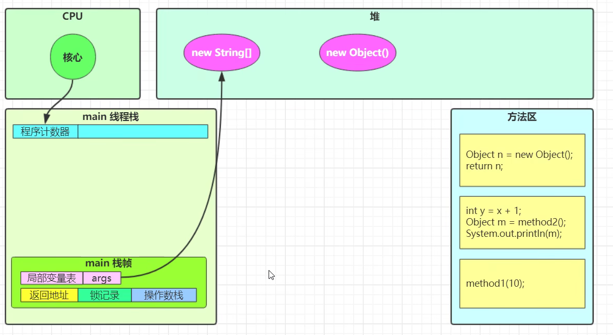


### 线程上下文切换（Thread Context Switch）

因为以下一些原因导致 cpu 不再执行当前的线程，转而执行另一个线程的代码

* 线程的 cpu 时间片用完
* 垃圾回收（SWT这样的）
* 有更高优先级的线程需要运行
* 线程自己调用了 sleep（睡眠）、yield、wait、join、park、synchronized、lock 等方法

当 Context Switch 发生时，需要由操作系统保存当前线程的状态，并恢复另一个线程的状态，Java 中对应的概念，就是程序计数器（Program Counter Register），它的作用是记住下一条 jvm 指令的执行地址，是线程私有的

* 状态包括程序计数器、虚拟机栈中每个栈帧的信息，如局部变量、操作数栈、返回地址等
* Context Switch 频繁发生会影响性能（线程数真的越多越好吗？）


线程切换记录当前状态

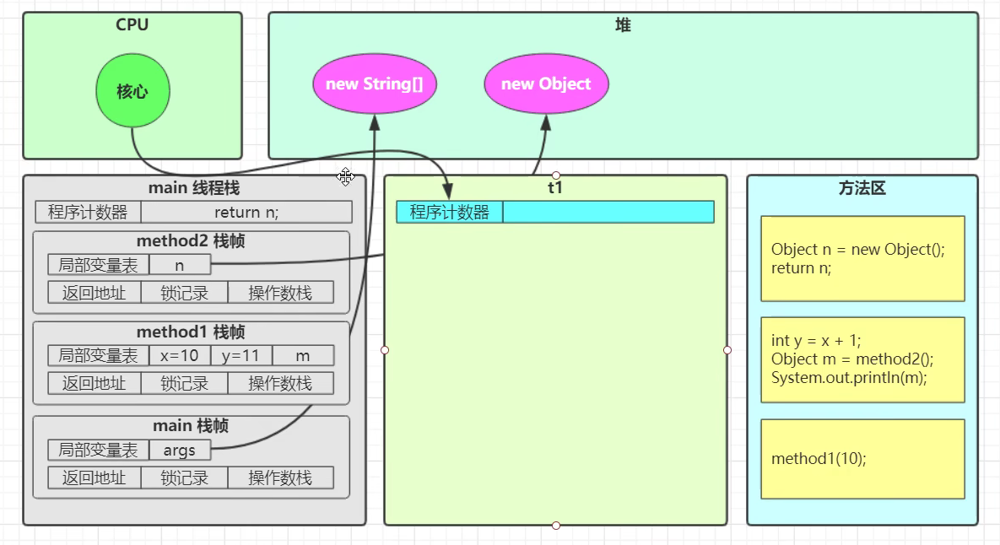


## 2.5 线程常见方法

| 方法名           | static | 功能说明                                                    | 注意                                                         |
| ---------------- | ------ | ----------------------------------------------------------- | :----------------------------------------------------------- |
| start()          |        | 启动一个新线程，在新的线程运行 run 方法中的代码             | start 方法只是让线程进入就绪，里面代码不一定立刻运行（CPU 的时间片还没分给它）。每个线程对象的start方法只能调用一次，如果调用了多次会出现`IllegalThreadStateException` |
| run()            |        | 新线程启动后会调用的方法                                    | 如果在构造 Thread 对象时传递了 Runnable 参数，则线程启动后会调用 Runnable 中的 run 方法，否则默认不执行任何操作。但可以创建 Thread 的子类对象，来覆盖默认行为 |
| join()           |        | 等待线程运行结束                                            |                                                              |
| join(long n)     |        | 等待线程运行结束,最多等待 n毫秒                             |                                                              |
| getId()          |        | 获取线程长整型的 id id 唯一                                 |                                                              |
| getName()        |        | 获取线程名                                                  |                                                              |
| setName(String)  |        | 修改线程名                                                  |                                                              |
| getPriority()    |        | 获取线程优先级                                              |                                                              |
| setPriority(int) |        | 修改线程优先级 java中规定线程优先级是1~10 的整数            | 较大的优先级能提高该线程被 CPU 调度的机率                    |
| getState()       |        | 获取线程状态                                                | Java 中线程状态是用 6 个 enum 表示，分别为：NEW, RUNNABLE, BLOCKED, WAITING,TIMED_WAITING, TERMINATED |
| isInterrupted()  |        | 判断是否被打断                                              | 不会清除 `打断标记`                                          |
| isAlive()        |        | 线程是否存活（还没有运行完毕）                              |                                                              |
| interrupt()      |        | 打断线程                                                    | 如果被打断线程正在 sleep，wait，join 会导致被打断的线程抛出 `terruptedException`，并清除 `打断标记`；如果打断的正在运行的线程，则会设置 `打断标记` ；park 的线程被打断，也会设置 `打断标记` |
| interrupted()    | static | 判断当前线程是否被打断                                      | 会清除 `打断标记`                                            |
| currentThread()  | static | 获取当前正在执行的线程                                      |                                                              |
| sleep(long n)    | static | 让当前执行的线程休眠n毫秒，休眠时让出 cpu的时间片给其它线程 |                                                              |
| yield()          | static | 提示线程调度器让出当前线程对CPU的使用                       | 主要是为了测试和调试                                         |


###  run start

* 直接调用 run 是在主线程中执行了 run，没有启动新的线程
* 使用 start 是启动新的线程，通过新的线程间接执行 run 中的代码


### **sleep**

1. 调用 sleep 会让当前线程从 Running 进入 **`Timed Waiting `**状态（阻塞）

   ```java
   public static void main(String[] args) {
       Thread t1 = new Thread(() -> {
           sleep(1000L);
           log.info("t1.....");
       }, "t1");
       t1.start();
   
       sleep(200L);
       log.info("t1 state {}",t1.getState());
       // ...... - t1 state TIMED_WAITING
   }
   ```

2. 其它线程可以使用 interrupt 方法打断正在睡眠的线程，这时 sleep 方法会抛出` InterruptedException`

   ```java
   Thread t1 = new Thread(() -> {
       try {log.info("t1.....");Thread.sleep(2000L);
           } catch (InterruptedException e)
       {e.printStackTrace();log.info("wake up...");}
   }, "t1");
   t1.start();
   
   sleep(200L);
   log.info("t1 state {}", t1.getState());
   t1.interrupt();
   // 如果被打断线程正在 sleep，wait，join 会导致被打断的线程抛出 `terruptedException`，
   // 并清除 `打断标记`；
   // 如果打断的正在运行的线程，则会设置 `打断标记`
   sleep(100L);
   log.info("t1 state {}",t1.getState());
   log.info("t1 interrupt {}",t1.isInterrupted());
       
   
   21:30:49 [t1] com.wjl.juc.j2.u5.TestSleep - t1.....
   21:30:49 [main] com.wjl.juc.j2.u5.TestSleep - t1 state TIMED_WAITING
   21:30:49 [t1] com.wjl.juc.j2.u5.TestSleep - wake up...
   java.lang.InterruptedException: sleep interrupted
   	at java.lang.Thread.sleep(Native Method)
   	at com.wjl.juc.j2.u5.TestSleep.lambda$main$0(TestSleep.java:16)
   	at java.lang.Thread.run(Thread.java:750)
   21:30:49 [main] com.wjl.juc.j2.u5.TestSleep - t1 state TERMINATED
   21:30:49 [main] com.wjl.juc.j2.u5.TestSleep - t1 interrupt false
   ```

3. **睡眠结束后的线程未必会立刻得到执行**

4. 建议用 TimeUnit 的 sleep 代替 Thread 的 sleep 来获得更好的可读性

   ```java
   TimeUnit.SECONDS.sleep(time);
   ```

   

### **yield**

1. 调用 yield 会让当前线程从 Running 进入 Runnable **就绪状态**，然后调度执行其它线程
2. 具体的实现依赖于操作系统的任务调度器


### **线程优先级**

* 线程优先级会提示（hint）调度器优先调度该线程，但它仅仅是一个提示，调度器可以忽略它
* 如果 cpu 比较忙，那么优先级高的线程会获得更多的时间片，但 cpu 闲时，优先级几乎没作用

Code:

```java
Runnable task = () -> {
    int count = 0;
    for (; ; ) {
        log.info(Thread.currentThread().getName() + ":" + count++);
    }
};
Thread t1 = new Thread(task, "t1");
Thread t2 = new Thread(task, "t2");

t2.setPriority(Thread.MAX_PRIORITY);

t1.start();
t2.start();

sleep(1000L);
```


### join

#### 为什么需要 join?

下面的代码执行，打印 r 是什么？

```java
static int r = 0;
public static void main(String[] args) throws InterruptedException {
	test1();
}
private static void test1() throws InterruptedException {
    log.debug("开始");
    Thread t1 = new Thread(() -> {
        log.debug("开始");
        sleep(1);
        log.debug("结束");
        r = 10;
    });
    t1.start();
    log.debug("结果为:{}", r);
    log.debug("结束");
}
```

分析

* 因为主线程和线程 t1 是并行执行的，t1 线程需要 1 秒之后才能算出 `r=10`
* 而主线程一开始就要打印 r 的结果，所以只能打印出 `r=0`

解决方法

* 用 `sleep `行不行？为什么？
* 用 `join`，加在` t1.start()` 之后即可


#### 同步

以调用方角度来讲，如果

* 需要等待结果返回，才能继续运行就是同步
* 不需要等待结果返回，就能继续运行就是异步


```mermaid
graph TD
main-->t1.join
main-->t1.start
t1.start--1s后-->r=10
r=10--t1终止-->t1.join

```

#### 等待多个结果

问，下面代码 cost 大约多少秒？

```java
static int r1 = 0;
static int r2 = 0;
public static void main(String[] args) throws InterruptedException {
	test2();
}
private static void test2() throws InterruptedException {
    Thread t1 = new Thread(() -> {
        sleep(1);
        r1 = 10;
    });
    Thread t2 = new Thread(() -> {
        sleep(2);
        r2 = 20;
     });
    long start = System.currentTimeMillis();
    t1.start();
    t2.start();
    t1.join();
    t2.join();
    long end = System.currentTimeMillis();
    log.debug("r1: {} r2: {} cost: {}", r1, r2, end - start);
}
```

分析如下

* 第一个 join：等待 t1 时, t2 并没有停止, 而在运行
* 第二个 join：1s 后, 执行到此, t2 也运行了 1s, 因此也只需再等待 1s

如果颠倒两个 join 呢？

最终都是输出

```java
20:45:43.239 [main] c.TestJoin - r1: 10 r2: 20 cost: 2005
```


```mermaid
graph TD 
subgraph 1
main--> t1.join
main--> t1.start
main--> t2.start
t1.start--1s后-->r=10
r=10--t1终止-->t1.join
t1.join--> t2.join-仅需等1s
t2.start--2s后-->r=20
r=20--t2终止-->t2.join-仅需等1s
end

```

#### 有时效的join

* 如果设置的等待时间小于线程执行的时间，会按照设置的时间结束
* 如果线程执行的时间小于join设定的等待时间，那么按照线程结束的时间而结束等待，不会执行“多余的”等待（以线程结束为准）


#### join原理

```java
/*
等待此线程死亡的时间最多为毫秒。超时值为0表示永远等待。 此实现使用此循环。等待呼叫以此为条件。isAlive。作为线程终止此。notifyAll方法被调用。
建议应用程序不要对Thread实例使用wait、notify或notifyAll。 参数： 毫秒–等待时间（毫秒） 投掷次数： IllegalArgumentException–如果millis的值为负值 InterruptedException–如果有任何线程中断了当前线程。抛出此异常时，将清除当前线程的中断状态
*/
public final synchronized void join(long millis)
    throws InterruptedException {
    long base = System.currentTimeMillis();
    long now = 0;

    if (millis < 0) {
        throw new IllegalArgumentException("timeout value is negative");
    }
	// 调用者线程进入 t1 的 waitSet 等待, 直到 t1 运行结束
    if (millis == 0) {
        while (isAlive()) {
            wait(0);
        }
    } else {
        while (isAlive()) {
            long delay = millis - now;
            if (delay <= 0) {
                break;
            }
            wait(delay);
            now = System.currentTimeMillis() - base;
        }
    }
}
```

* 注意：这里的isAlive是子线程调用，而这里的wait方法是主线程在调用！synchronized在方法上，表示主线程获取到了子线程这个实例的锁对象，然后调用这个锁对象的wait

```java
Thread t1 = new Thread(() -> {
}, "t1");
t1.start();

// == t1.wait()  t1 is Sync
t1.join();// public final synchronized void join(long millis)
// so
/*
	所以等于调用t1.join() 的线程wait
    synchronized(t1){
        t1.wait(long millis);
    }
 */
```


### interrupt

#### 1. 打断 sleep，wait，join 的线程

这几个方法都会让线程进入阻塞状态

打断 sleep 的线程, 会清空打断状态，以 sleep 为例

```java
public static void main(String[] args) {
    Thread t1 = new Thread(()->{
        try {
            Thread.sleep(1000L);
        } catch (InterruptedException e) {
            e.printStackTrace();
        }
    },"t1");

    t1.start();
    sleep(0.5);
    t1.interrupt();
    log.info("打断状态 {}",t1.isInterrupted());
}

java.lang.InterruptedException: sleep interrupted
	at java.lang.Thread.sleep(Native Method)
	at com.wjl.juc.j2.u5.TestInterrupted.lambda$main$0(TestInterrupted.java:17)
	at java.lang.Thread.run(Thread.java:750)
22:48:44 [main] com.wjl.juc.j2.u5.TestInterrupted - 打断状态 false
```


#### 2.打断正常运行的线程

打断正常运行的线程, 不会清空打断状态

```java
public static void main(String[] args) {
    Thread t1 = new Thread(() -> {
        while(true){
            boolean interrupted = Thread.interrupted();
            if(interrupted){
                log.info("interrupted {}",interrupted);
                break;
            }
        }
    }, "t1");
    t1.start();
    sleep(1);
    log.info("interrupt...");
    // 注意： 打断线程并不会停止运行，被打断线程只是知道了自己被打断了（打断标记）
    t1.interrupt();
}
```


#### 打断park线程

打断 park 线程, 不会清空打断状态 (true)

```java
public static void main(String[] args) {
    Thread t1 = new Thread(() -> {
        log.info("park...");
        LockSupport.park();// 让当前线程停下来
        log.info("unpark...");
        log.info("打断状态 {}",Thread.currentThread().isInterrupted());
    }, "T1");
    t1.start();

    sleep(1);
    t1.interrupt();
}
```

输出

```
09:22:19 [T1] com.wjl.juc.j2.u5.TestInterruptedPark - park...
09:22:20 [T1] com.wjl.juc.j2.u5.TestInterruptedPark - unpark...
09:22:20 [T1] com.wjl.juc.j2.u5.TestInterruptedPark - 打断状态 true
```

**注意**：如果打断标记已经是 true, 则 park 会失效

~~~java
public static void main(String[] args) {
    Thread t1 = new Thread(() -> {
        log.info("park...");
        LockSupport.park();// 让当前线程停下来
        log.info("unpark...");
        log.info("打断状态 {}",Thread.currentThread().isInterrupted());
        LockSupport.park();
        log.info("unpark...");
    }, "T1");
    t1.start();

    sleep(1);
    t1.interrupt();
}
~~~

输出

```java
09:25:11 [T1] com.wjl.juc.j2.u5.TestInterruptedPark - park...
09:25:12 [T1] com.wjl.juc.j2.u5.TestInterruptedPark - unpark...
09:25:12 [T1] com.wjl.juc.j2.u5.TestInterruptedPark - 打断状态 true
09:25:12 [T1] com.wjl.juc.j2.u5.TestInterruptedPark - unpark...
```


> 提示
>
> 可以使用 `Thread.interrupted() `清除打断状态


## 2.6 不推荐的方法

还有一些不推荐使用的方法，这些方法已过时，容易**破坏同步代码块，造成线程死锁**

| 方法名    | static | 功能说明             |
| --------- | ------ | -------------------- |
| stop()    |        | 停止线程运行         |
| suspend() |        | 挂起（暂停）线程运行 |
| resume()  |        | 恢复线程运行         |


## 2.7 主线程和守护线程

默认情况下，Java 进程需要等待所有线程都运行结束，才会结束。有一种特殊的线程叫做**守护线程**，只要**其它非守护线程**运行结束了，即使守护线程的代码没有执行完，也会强制结束。

~~~java
Thread t1 = new Thread(() -> {
    for (;;){
        if(Thread.interrupted()){
            break;
        }
    }
    log.info("break...");
}, "t1");
t1.setDaemon(true);// 设置为守护线程
t1.start();

Thread.sleep(1000l);
log.info("结束");
~~~

输出

```
09:35:16 [main] com.wjl.juc.j2.u7.TestDaemon - 结束
```


> **注意**
>
> * 垃圾回收器线程就是一种守护线程
> * Tomcat 中的 Acceptor 和 Poller 线程都是守护线程，所以 Tomcat 接收到 shutdown 命令后，不会等
>   待它们处理完当前请求


## 2.8 五种状态

这是从 **操作系统** 层面来描述的

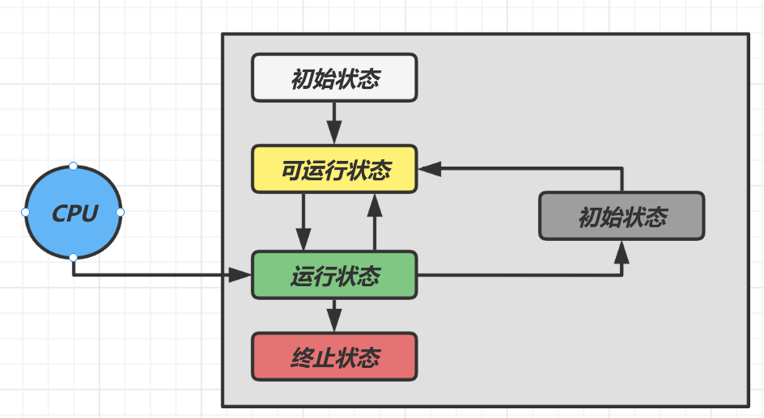

* 【初始状态】仅是在语言层面创建了线程对象，还未与操作系统线程关联
* 【可运行状态】（就绪状态）指该线程已经被创建（与操作系统线程关联），可以由 CPU 调度执行
* 【运行状态】指获取了 CPU 时间片运行中的状态
  * 当 CPU 时间片用完，会从【运行状态】转换至【可运行状态】，会导致线程的上下文切换
* 【阻塞状态】
  * 如果调用了阻塞 API，如 BIO 读写文件，这时该线程实际不会用到 CPU，会导致线程上下文切换，进入【阻塞状态】
  * 等 BIO 操作完毕，会由操作系统唤醒阻塞的线程，转换至【可运行状态】
  * 与【可运行状态】的区别是，对【阻塞状态】的线程来说只要它们一直不唤醒，调度器就一直不会考虑调度它们
* 【终止状态】表示线程已经执行完毕，生命周期已经结束，不会再转换为其它状态


## 2.9 六种状态

这是从 **Java API** 层面来描述的

根据 Thread.State 枚举，分为六种状态

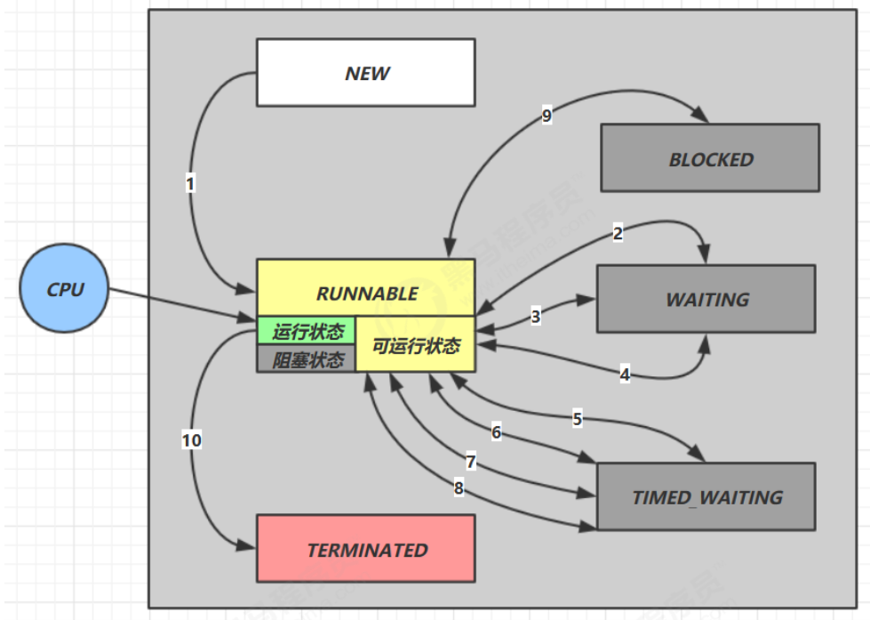

* `NEW `线程刚被创建，但是还没有调用 `start() `方法
* `RUNNABLE` 当调用了 `start()` 方法之后，注意，Java API 层面的 `RUNNABLE `状态涵盖了 操作系统 层面的【可运行状态】、【运行状态】和【阻塞状态】（由于 BIO 导致的线程阻塞，在 Java 里无法区分，仍然认为是可运行)
* `BLOCKED ， WAITING ， TIMED_WAITING `都是 Java API 层面对【阻塞状态】的细分，后面会在状态转换一节详述
* `TERMINATED `当线程代码运行结束


#### 代码演示

```java
@Slf4j
public class TestState {
    public static void main(String[] args) {
        Thread t1 = new Thread(() -> {
            log.info("no start");
        }, "t1");// new

        Thread t2 = new Thread(()->{
            while(true){}// runnable
        },"t2");
        t2.start();

        Thread t3 = new Thread(() -> {
            try {
                t2.join(); // waiting
            } catch (InterruptedException e) {
                throw new RuntimeException(e);
            }
        }, "t3");
        t3.start();

        Thread t4 = new Thread(() -> {
            synchronized (TestState.class) {
                try {
                    Thread.sleep(1000000); // timed_waiting
                } catch (InterruptedException e) {
                    throw new RuntimeException(e);
                }
            }
        }, "t4");
        t4.start();

        Thread t5 = new Thread(()->{
            log.info("running"); //
        },"t5");
        t5.start();

        Thread t6 = new Thread(() -> {
            synchronized (TestState.class) {
                try {
                    Thread.sleep(1000000); // blocked
                } catch (InterruptedException e) {
                    throw new RuntimeException(e);
                }
            }
        }, "t6");
        t6.start();

        sleep(1000);
        log.info("t1 state {}",t1.getState());
        log.info("t2 state {}",t2.getState());
        log.info("t3 state {}",t3.getState());
        log.info("t4 state {}",t4.getState());
        log.info("t5 state {}",t5.getState());
        log.info("t6 state {}",t6.getState());

    }
}
```

输出

```
17:42:13 [main] com.wjl.juc.j2.u9.TestState - t1 state NEW
17:42:13 [main] com.wjl.juc.j2.u9.TestState - t2 state RUNNABLE
17:42:13 [main] com.wjl.juc.j2.u9.TestState - t3 state WAITING
17:42:13 [main] com.wjl.juc.j2.u9.TestState - t4 state TIMED_WAITING
17:42:13 [main] com.wjl.juc.j2.u9.TestState - t5 state TERMINATED
17:42:13 [main] com.wjl.juc.j2.u9.TestState - t6 state BLOCKED
```


## 2.10  习题

#### 问题

阅读华罗庚《统筹方法》，给出烧水泡茶的多线程解决方案，提示

* 参考图二，用两个线程（两个人协作）模拟烧水泡茶过程
  * 文中办法乙、丙都相当于任务串行
  * 而图一相当于启动了 4 个线程，有点浪费
* 用 sleep(n) 模拟洗茶壶、洗水壶等耗费的时间


附：华罗庚《统筹方法》

> 统筹方法，是一种安排工作进程的数学方法。它的实用范围极广泛，在企业管理和基本建设中，以及关系复杂的科研项目的组织与管理中，都可以应用。
>
> 怎样应用呢？主要是把工序安排好。
>
> 比如，想泡壶茶喝。当时的情况是：开水没有；水壶要洗，茶壶、茶杯要洗；火已生了，茶叶也有了。怎么办？
>
> * 办法甲：洗好水壶，灌上凉水，放在火上；在等待水开的时间里，洗茶壶、洗茶杯、拿茶叶；等水开
>   了，泡茶喝。
> * 办法乙：先做好一些准备工作，洗水壶，洗茶壶茶杯，拿茶叶；一切就绪，灌水烧水；坐待水开了，泡茶喝。
> * 办法丙：洗净水壶，灌上凉水，放在火上，坐待水开；水开了之后，急急忙忙找茶叶，洗茶壶茶杯，泡茶喝。
>
> 哪一种办法省时间？我们能一眼看出，第一种办法好，后两种办法都窝了工。
>
> 这是小事，但这是引子，可以引出生产管理等方面有用的方法来。
>
> 水壶不洗，不能烧开水，因而洗水壶是烧开水的前提。没开水、没茶叶、不洗茶壶茶杯，就不能泡茶，因而这些又是泡茶的前提。它们的相互关系，可以用下边的箭头图来表示：
>
> ```mermaid
> graph LR
> 洗水壶1分钟-->a("烧开水 15分钟")
> a--> b("泡茶")
> 洗茶壶1分钟 -->b
> 洗茶杯2分钟-->b
> 拿茶叶1分钟-->b
> ```
>
> 从这个图上可以一眼看出，办法甲总共要16分钟（而办法乙、丙需要20分钟）。如果要缩短工时、提高工作效率，应当主要抓烧开水这个环节，而不是抓拿茶叶等环节。同时，洗茶壶茶杯、拿茶叶总共不过4分钟，大可利用“等水开”的时间来做。
>
> 是的，这好像是废话，卑之无甚高论。有如走路要用两条腿走，吃饭要一口一口吃，这些道理谁都懂得。但稍有变化，临事而迷的情况，常常是存在的。在近代工业的错综复杂的工艺过程中，往往就不是像泡茶喝这么简单了。任务多了，几百几千，甚至有好几万个任务。关系多了，错综复杂，千头万绪，往往出现“万事俱备，只欠东风”的情况。由于一两个零件没完成，耽误了一台复杂机器的出厂时间。或往往因为抓的不是关键，连夜三班，急急忙忙，完成这一环节之后，还得等待旁的环节才能装配。
>
> 洗茶壶，洗茶杯，拿茶叶，或先或后，关系不大，而且同是一个人的活儿，因而可以合并成为：
>
> ```mermaid
> graph LR
> 洗水壶1分钟--> a("烧开水15分钟")
> a-->c("泡茶")
> b("洗茶壶，洗茶杯,拿茶叶4分钟")-->c
> ```
>
> 
>
> 
>
> 


## 2.11 本章小结

本章的重点在于掌握

* 线程创建
* 线程重要 api，如 start，run，sleep，join，interrupt 等
* 线程状态
* 应用方面
  * 异步调用：主线程执行期间，其它线程异步执行耗时操作
  * 提高效率：并行计算，缩短运算时间
  * 同步等待：join
  * 统筹规划：合理使用线程，得到最优效果
* 原理方面
  * 线程运行流程：栈、栈帧、上下文切换、程序计数器
  * Thread 两种创建方式 的源码
* 模式方面
  * 终止模式之两阶段终止


# 3. 共享模型之管程

* 共享问题
* synchronized
* 线程安全分析
* Monitor
* wait/notify
* 线程状态转换
* 活跃性
* Lock


## 3.1 共享带来的问题


### 小故事

* 老王（操作系统）有一个功能强大的算盘（CPU），现在想把它租出去，赚一点外快
* 
* 小南、小女（线程）来使用这个算盘来进行一些计算，并按照时间给老王支付费用
* 但小南不能一天24小时使用算盘，他经常要小憩一会（sleep），又或是去吃饭上厕所（阻塞 io 操作）,有
  时还需要一根烟，没烟时思路全无（wait）这些情况统称为（阻塞）

* 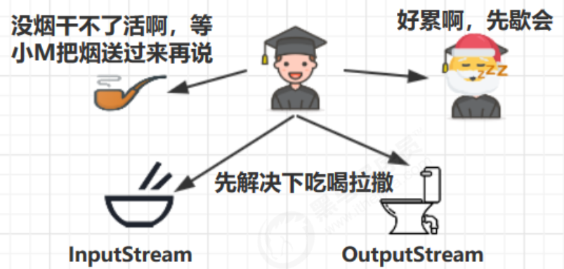
* 在这些时候，算盘没利用起来（不能收钱了），老王觉得有点不划算
* 另外，小女也想用用算盘，如果总是小南占着算盘，让小女觉得不公平
* 于是，老王灵机一动，想了个办法 [ 让他们每人用一会，轮流使用算盘 ]
* 这样，当小南阻塞的时候，算盘可以分给小女使用，不会浪费，反之亦然
* 最近执行的计算比较复杂，需要存储一些中间结果，而学生们的脑容量（工作内存）不够，所以老王申请了一个笔记本（主存），把一些中间结果先记在本上
* 计算流程是这样的
* 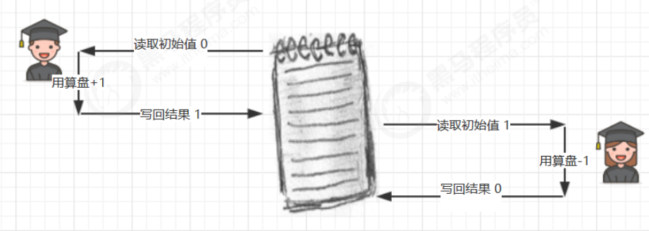

* 但是由于分时系统，有一天还是发生了事故
* 小南刚读取了初始值 0 做了个 +1 运算，还没来得及写回结果
* 老王说 [ 小南，你的时间到了，该别人了，记住结果走吧 ]，于是小南念叨着 [ 结果是1，结果是1...] 不甘心地到一边待着去了（上下文切换）
* 老王说 [ 小女，该你了 ]，小女看到了笔记本上还写着 0 做了一个 -1 运算，将结果 -1 写入笔记本
* 这时小女的时间也用完了，老王又叫醒了小南：[小南，把你上次的题目算完吧]，小南将他脑海中的结果1 写入了笔记本
* 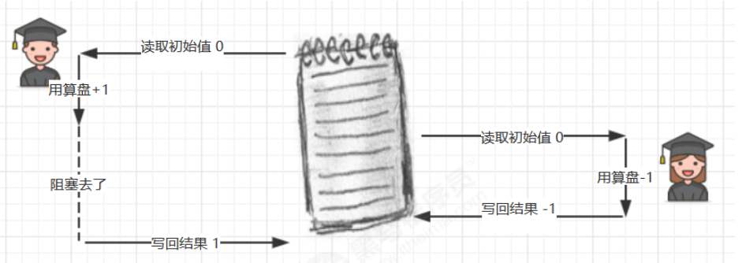
* 小南和小女都觉得自己没做错，但笔记本里的结果是 1 而不是 0


### java的体现

两个线程对初始值为 0 的静态变量一个做自增，一个做自减，各做 5000 次，结果是 0 吗？

```java
static int count = 0;
public static void main(String[] args) throws InterruptedException {
    Thread t1 = new Thread(() -> {
        for (int i = 0; i < 5000; i++) {
            count++;
        }
    }, "t1");
    Thread t2 = new Thread(() -> {
        for (int i = 0; i < 5000; i++) {
            count--;
        }
    }, "t2");

    t1.start();
    t2.start();
    t1.join();
    t2.join();
    log.info("count {}",count);
}
```

输出

```
18:23:10 [main] com.wjl.juc.j3.u1.Count0 - count -1562 //随机的
```


### 问题分析

以上的结果可能是正数、负数、零。为什么呢？因为 Java 中对静态变量的自增，自减并不是原子操作，要彻底理解，必须从字节码来进行分析

例如对于` i++` 而言（i 为静态变量），实际会产生如下的 JVM 字节码指令：

```java
getstatic  i 	// 获取静态变量i的值
iconst_1 		// 准备常量1
iadd 			// 自增
putstatic  i 	// 将修改后的值存入静态变量i
```

而对应` i-- `也是类似：

```java
getstatic  i 	// 获取静态变量i的值
iconst_1 		// 准备常量1
isub 			// 自减
putstatic  i 	// 将修改后的值存入静态变量i
```

而 Java 的内存模型如下，完成静态变量的自增，自减需要在主存和工作内存中进行数据交换：

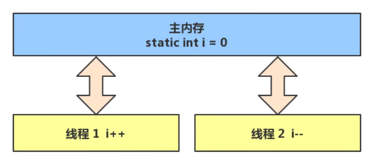

如果是单线程以上 8 行代码是顺序执行（不会交错）没有问题：

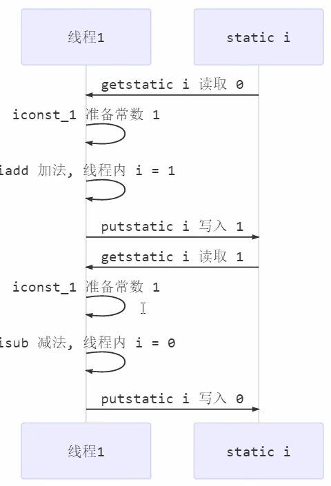

但多线程下这 8 行代码可能交错运行：

出现负数的情况：

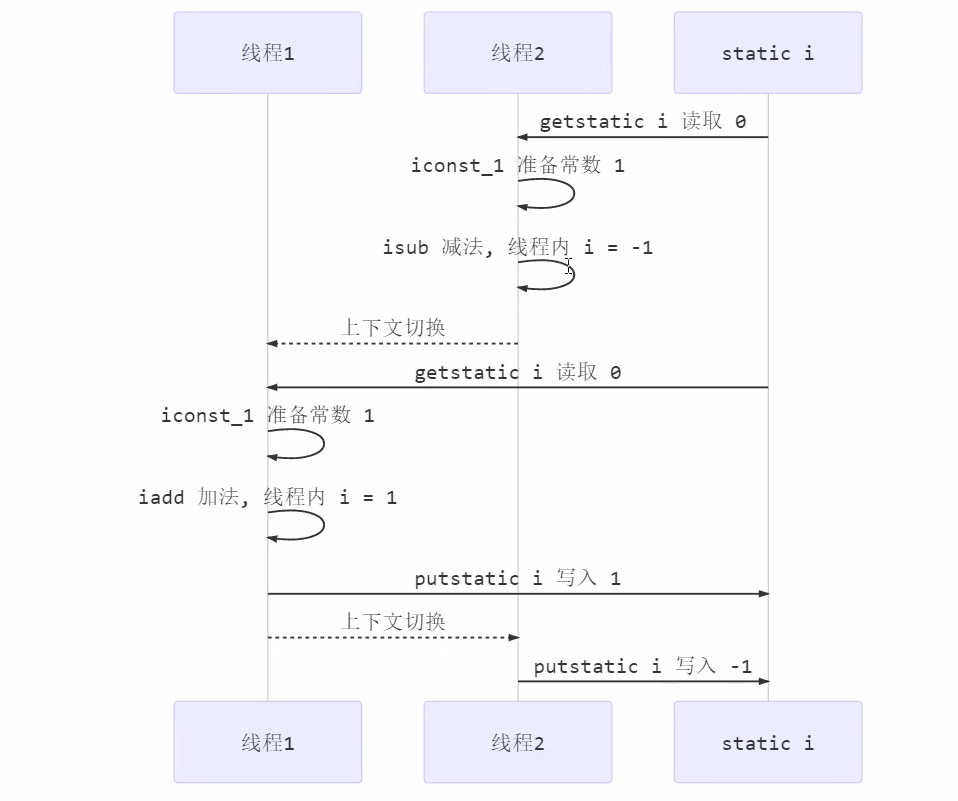

出现正数的情况：

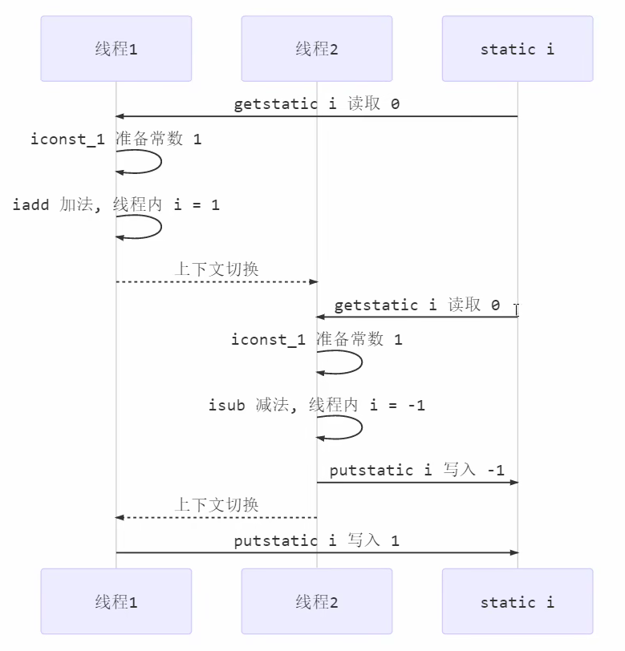


### 临界区 Critical Section

* 一个程序运行多个线程本身是没有问题的
* 问题出在多个线程访问**共享资源**
  * 多个线程读**共享资源**其实也没有问题
  * 在多个线程对**共享资源**读写操作时发生指令交错，就会出现问题
* 一段代码块内如果存在对**共享资源**的多线程读写操作，称这段代码块为**临界区**

例如，下面代码中的临界区

```java
static counter = 0;

// 临界区
static void increment{
    counter++;
}

// 临界区
static void decrement{
    counter--;
}
```


### 竞态条件 Race Condition

多个线程在临界区内执行，由于**代码的执行序列不同**而导致结果无法预测，称之为发生了**竞态条件**


## 3.2 synchronized解决方案


### 互斥

为了避免临界区的竞态条件发生，有多种手段可以达到目的。

* 阻塞式的解决方案：synchronized，Lock
* 非阻塞式的解决方案：原子变量

本次课使用阻塞式的解决方案：synchronized，来解决上述问题，即俗称的【对象锁】，它采用互斥的方式让同一时刻至多只有一个线程能持有【对象锁】，其它线程再想获取这个【对象锁】时就会阻塞住。这样就能保证拥有锁的线程可以安全的执行临界区内的代码，不用担心线程上下文切换

>**注意**
>虽然 java 中互斥和同步都可以采用 synchronized 关键字来完成，但它们还是有区别的：
>
>* 互斥是保证临界区的竞态条件发生，同一时刻只能有一个线程执行临界区代码
>* 同步是由于线程执行的先后、顺序不同、需要一个线程等待其它线程运行到某个点


### synchronized

**语法**

```java
synchronized(对象) // 线程1， 线程2(blocked)
{
	临界区
}
```

**解决**

```java
static int count = 0;
static Object room = new Object();
public static void main(String[] args) throws InterruptedException {
    Thread t1 = new Thread(() -> {
        synchronized(room){
            for (int i = 0; i < 5000; i++) {
                count++;
            }
        }
    }, "t1");
    Thread t2 = new Thread(() -> {
        synchronized(room){
            for (int i = 0; i < 5000; i++) {
                count--;
            }
        }
    }, "t2");

    t1.start();
    t2.start();
    t1.join();
    t2.join();
    log.info("count {}",count);
}
```

输出

```
18:42:32 [main] com.wjl.juc.j3.u1.Count0 - count 0
```


#### 分析

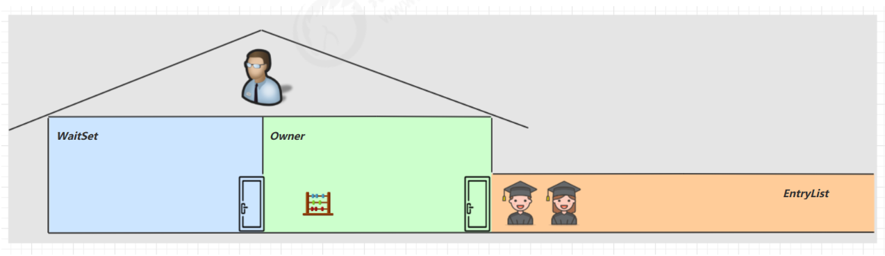

你可以做这样的类比：

* `synchronized(对象)` 中的对象，可以想象为一个房间（room），有唯一入口（门）房间只能一次进入一人
  进行计算，线程 t1，t2 想象成两个人
* 当线程 t1 执行到 `synchronized(room)` 时就好比 t1 进入了这个房间，并锁住了门拿走了钥匙，在门内执行`count++` 代码
* 这时候如果 t2 也运行到了 `synchronized(room)` 时，它发现门被锁住了，只能在门外等待，发生了上下文切换，阻塞住了
* 这中间即使 t1 的 cpu 时间片不幸用完，被踢出了门外（不要错误理解为锁住了对象就能一直执行下去哦），这时门还是锁住的，t1 仍拿着钥匙，t2 线程还在阻塞状态进不来，只有下次轮到 t1 自己再次获得时间片时才能开门进入
* 当 t1 执行完` synchronized{}` 块内的代码，这时候才会从 obj 房间出来并解开门上的锁，唤醒 t2 线程把钥
  匙给他。t2 线程这时才可以进入 obj 房间，锁住了门拿上钥匙，执行它的`count--`代码


用图来表示

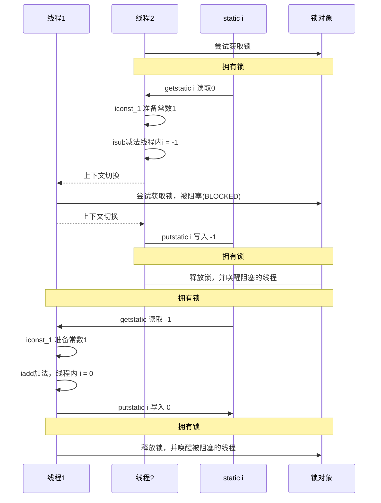
```mermaid
sequenceDiagram 
participant t1 as 线程1
participant t2 as 线程2
participant s as static i
participant y as 锁对象

t2->>y: 尝试获取锁
note over t2,y: 拥有锁
s->>t2: getstatic i 读取0
t2->>t2: iconst_1 准备常数1
t2->>t2: isub减法线程内i = -1
t2 -->> t1:上下文切换
t1->>y: 尝试获取锁，被阻塞(BLOCKED)
t1 -->> t2:上下文切换
t2->s:putstatic i 写入 -1
note over t2,y: 拥有锁
t2->y:释放锁，并唤醒阻塞的线程
note over t1,y:拥有锁
s->> t1: getstatic 读取 -1
t1->>t1:iconst_1 准备常数1
t1->>t1:iadd加法，线程内 i = 0
t1->>s:putstatic i 写入 0
note over t1,y:拥有锁
t1->>y:释放锁，并唤醒被阻塞的线程
```


### 思考

synchronized 实际是用**对象锁**保证了**临界区内代码的原子性**，临界区内的代码对外是不可分割的，不会被线程切换所打断。

为了加深理解，请思考下面的问题

* 如果把 `synchronized(obj) `放在 for 循环的外面，如何理解？-- 原子性
* 如果` t1 synchronized(obj1)` 而` t2 synchronized(obj2) `会怎样运作？-- 锁对象
* 如果 `t1 synchronized(obj)` 而 t2 没有加会怎么样？如何理解？-- 锁对象


### 面向对象改进

```java
@Slf4j
public class Room {
    int value = 0;

    public void increment() {
        synchronized (this) {
            value++;
        }
    }

    public void decrement() {
        synchronized (this) {
            value--;
        }
    }

    public int get() {
        synchronized (this) {
            return value;
        }
    }

    public static void main(String[] args) throws InterruptedException {
        final Room room = new Room();
        Thread t1 = new Thread(() -> {
            for (int i = 0; i < 5000; i++) {
                room.increment();
            }
        }, "t1");
        Thread t2 = new Thread(() -> {
            for (int i = 0; i < 5000; i++) {
                room.decrement();
            }
        }, "t2");

        t1.start();
        t2.start();
        t1.join();
        t2.join();
        log.info("count {}", room.get());
    }
}
```

`synchronized (this)` // 锁住本身， 用的同一个对象的话就是原子性的


## 3.3 方法上的synchronized

```java
int value = 0;

public synchronized void increment() {
    value++;
}

public synchronized void decrement() {
    value--;
}

public  synchronized int get() {
    return value;
}
```

* 不加 synchronzied 的方法就好比不遵守规则的人(Thread)，不去老实排队（好比翻窗户进去的）
* `synchronized` 加在方法上默认是锁住`this`

* 静态方法上面的等同于锁住 方法所在的类对象(.class)


#### 3.4 所谓的'线程8锁'

其实就是考察 synchronized 锁住的是哪个对象

##### 1.1,2 或 2,1

```java
public class Lock1 {
    public static void main(String[] args) {
        Number n1 = new Number();
        new Thread(()->{ n1.a(); }).start();
        new Thread(()->{ n1.b(); }).start();
    }
}
@Slf4j(topic = "c.Number")
class Number{

    public synchronized void a() {
        log.debug("1");
    }
    public synchronized void b() {
        log.debug("2");
    }
}
```

##### 2. 1s后12，或 2 1s后 1


```java
public class Lock2 {
    public static void main(String[] args) {
        Number2 n1 = new Number2();
        new Thread(()->{ n1.a(); }).start();
        new Thread(()->{ n1.b(); }).start();
    }
}
@Slf4j(topic = "c.Number")
class Number2{
    public synchronized void a() {
        sleep(1);
        log.debug("1");
    }
    public synchronized void b() {
        log.debug("2");
    }
}
```

##### 3. 3 1s 12 或 23 1s 1 或 32 1s 1

```java
public class Lock3 {
    public static void main(String[] args) {
        Number3 n1 = new Number3();
        new Thread(()->{ n1.a(); }).start();
        new Thread(()->{ n1.b(); }).start();
        new Thread(()->{ n1.c(); }).start();
    }
}
@Slf4j
class Number3{
    public synchronized void a() {
        sleep(1);
        log.debug("1");
    }
    public synchronized void b() {
        log.debug("2");
    }
    public void c() {
        log.debug("3");
    }
}
```

##### 4. 2 1s 后 1

```java
@Slf4j(topic = "c.Number")
class Number{
    public synchronized void a() {
        sleep(1);
        log.debug("1");
    }
    public synchronized void b() {
    	log.debug("2");
    }
}
public static void main(String[] args) {
    Number n1 = new Number();
    Number n2 = new Number();
    new Thread(()->{ n1.a(); }).start();
    new Thread(()->{ n2.b(); }).start();
}
```

##### 5. 2 1s 后 1

```java
@Slf4j(topic = "c.Number")
class Number{
    public static synchronized void a() {
        sleep(1);
        log.debug("1");
    }
    public synchronized void b() {
        log.debug("2");
    }
}
public static void main(String[] args) {
    Number n1 = new Number();
    new Thread(()->{ n1.a(); }).start();
    new Thread(()->{ n1.b(); }).start();
}
```

##### 6. 1s 后12， 或 2 1s后 1

```java
@Slf4j(topic = "c.Number")
class Number{
    public static synchronized void a() {
        sleep(1);
        log.debug("1");
    }
    public static synchronized void b() {
        log.debug("2");
    }
}
public static void main(String[] args) {
    Number n1 = new Number();
    new Thread(()->{ n1.a(); }).start();
    new Thread(()->{ n1.b(); }).start();
}
```

##### 7. 2 1s 后 1

```java
@Slf4j(topic = "c.Number")
class Number{
    public static synchronized void a() {
        sleep(1);
        log.debug("1");
    }
    public synchronized void b() {
        log.debug("2");
    }
}
public static void main(String[] args) {
    Number n1 = new Number();
    Number n2 = new Number();
    new Thread(()->{ n1.a(); }).start();
    new Thread(()->{ n2.b(); }).start();
}
```

##### 8. 1s 后12， 或 2 1s后 1

```java
@Slf4j(topic = "c.Number")
class Number{
    public static synchronized void a() {
        sleep(1);
        log.debug("1");
    }
    public static synchronized void b() {
        log.debug("2");
    }
}
public static void main(String[] args) {
    Number n1 = new Number();
    Number n2 = new Number();
    new Thread(()->{ n1.a(); }).start();
    new Thread(()->{ n2.b(); }).start();
}
```


## 3.4 变量的线程安全分析


### 1.成员变量和静态变量是否线程安全

* 如果它们没有共享，则线程安全
* 如果它们被共享了，根据它们的状态是否能够改变，又分两种情况
  * 如果只有读操作，则线程安全
  * 如果有读写操作，则这段代码是临界区，需要考虑线程安全


### 2. 局部变量是否线程安全？

* 局部变量是线程安全的
* 但局部变量引用的对象则未必
  * 如果该对象没有逃离方法的作用访问，它是线程安全的
  * 如果该对象逃离方法的作用范围，需要考虑线程安全

### 3. 局部变量线程安全分析


#### 方法内局部变量

```java
public static void test1() {
    int i = 10;
    i++;
}
```

每个线程调用 test1() 方法时局部变量 i，会在每个线程的栈帧内存中被创建多份，因此不存在共享

```java
public static void test1();
	descriptor: ()V
        flags: ACC_PUBLIC, ACC_STATIC
    Code:
        stack=1, locals=1, args_size=0
            0: 	bipush 		10
            2: 	istore_0
            3: 	iinc 		0, 1
            6: return
            LineNumberTable:
            line 10: 0
            line 11: 3
            line 12: 6
            LocalVariableTable:
            Start Length Slot Name Signature
            	3    4 	   0    i     I
```

如图

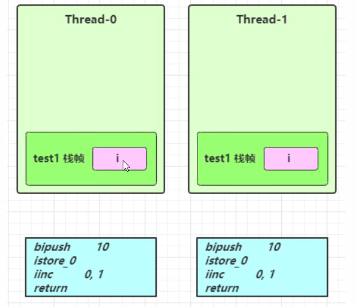


#### 局部变量的引用稍有不同

先看一个成员变量的例子

其中一种情况是，如果线程2 还未 add，线程1 remove 就会报错

```java
new Thread(() -> {
    list.add("1");  // 时间1. 会让内部 size ++
    list.remove(0); // 时间3. 再次 remove size-- 出现角标越界
}, "t1").start();

new Thread(() -> {
    list.add("2");  // 时间1（并发发生）. 会让内部 size ++，但由于size的操作非原子性,  size 本该是2，但结果可能出现1
    list.remove(0); // 时间2. 第一次 remove 能成功, 这时 size 已经是0
}, "t2").start();
```

```java
Exception in thread "Thread1" java.lang.IndexOutOfBoundsException: Index: 0, Size: 0
    at java.util.ArrayList.rangeCheck(ArrayList.java:657)
    at java.util.ArrayList.remove(ArrayList.java:496)
    at cn.itcast.n6.ThreadUnsafe.method3(TestThreadSafe.java:35)
    at cn.itcast.n6.ThreadUnsafe.method1(TestThreadSafe.java:26)
    at cn.itcast.n6.TestThreadSafe.lambda$main$0(TestThreadSafe.java:14)
    at java.lang.Thread.run(Thread.java:748)
```

分析：

* 无论哪个线程中的 引用的都是同一个对象中的 list 成员变量


## 3.5 常见线程安全类

* String
* Integer
* StringBuffer
* Random
* Vector
* Hashtable
* java.util.concurrent 包下的类

这里说它们是线程安全的是指，多个线程调用它们同一个实例的某个方法时，是线程安全的。也可以理解为

```java
Hashtable table = new Hashtable();

new Thread(()->{
	table.put("key", "value1");
}).start();

new Thread(()->{
	table.put("key", "value2");
}).start();
```

* 它们的每个方法是**原子**的
* 但注意它们**多个方法的组合不是原子的**，见后面分析


### 1. 线程安全类方法的组合

分析下面代码是否线程安全？

```java
Hashtable table = new Hashtable();
// 线程1，线程2
if( table.get("key") == null) {
	table.put("key", value);
}
```

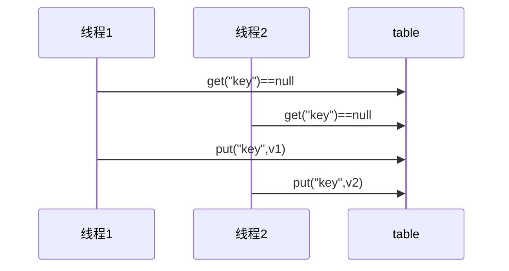
```mermaid
sequenceDiagram 
participant t1 as 线程1
participant t2 as 线程2
participant table
t1->>table: get("key")==null
t2->>table: get("key")==null
t1->>table: put("key",v1)
t2->>table: put("key",v2)
```

### 2. 不可变类线程安全性

String、Integer 等都是不可变类，因为其内部的状态不可以改变，因此它们的方法都是线程安全的

有同学或许有疑问，String 有 replace，substring 等方法【可以】改变值啊，那么这些方法又是如何保证线程安全的呢?

```java
public String substring(int beginIndex) {
    if (beginIndex < 0) {
        throw new StringIndexOutOfBoundsException(beginIndex);
    }
    int subLen = value.length - beginIndex;
    if (subLen < 0) {
        throw new StringIndexOutOfBoundsException(subLen);
    }
    return (beginIndex == 0) ? this : new String(value, beginIndex, subLen);
}
```

### 3. 实例分析

> **注意**
>
> 里面的`线程共享`是指能被多个线程**覆盖**，写入

例1

```java
public class MyServlet extends HttpServlet {
    // 是否安全？ 不是
    Map<String,Object> map = new HashMap<>();
    // 是否安全？ 是
    String S1 = "...";
    // 是否安全？ 是
    final String S2 = "...";
    // 是否安全？ 不是
    Date D1 = new Date();
    // 是否安全？不是
    final Date D2 = new Date();
    
    public void doGet(HttpServletRequest request, HttpServletResponse response) {
        // 使用上述变量
    }
}
```


例2

```java
public class MyServlet extends HttpServlet {
    // 是否安全？ 不是		count也是共享资源 
    private UserService userService = new UserServiceImpl();
    
    public void doGet(HttpServletRequest request, HttpServletResponse response) {
   		 userService.update(...);
    }
}    
public class UserServiceImpl implements UserService {
    // 记录调用次数
    private int count = 0;
    
    public void update() {
        // ...
        count++;
    }
}
```


例3

```java
@Aspect
@Component
public class MyAspect {
    // 是否安全？ 不是 start多个切点可修改 建议用环绕
    private long start = 0L;
    
    @Before("execution(* *(..))")
    public void before() {
    	start = System.nanoTime();
    }
    
    @After("execution(* *(..))")
    public void after() {
        long end = System.nanoTime();
        System.out.println("cost time:" + (end-start));
    }
}
```


例4

```java
public class MyServlet extends HttpServlet {
    // 是否安全	是 内部没有可更改的属性
    private UserService userService = new UserServiceImpl();
    public void doGet(HttpServletRequest request, HttpServletResponse response) {
        userService.update(...);
    }
}

public class UserServiceImpl implements UserService {
    // 是否安全	是	内部没有可更改的属性
    private UserDao userDao = new UserDaoImpl();
    public void update() {
        userDao.update();
    }
}

public class UserDaoImpl implements UserDao {
    public void update() {
        String sql = "update user set password = ? where username = ?";
        // 是否安全		 是 局部变量每次调用都是新对象
        try (Connection conn = DriverManager.getConnection("","","")){
        	// ...
        } catch (Exception e) {
        	// ...
        }
    }
}
```


例5 

```java
public class MyServlet extends HttpServlet {
    // 是否安全 不是
    private UserService userService = new UserServiceImpl();
        public void doGet(HttpServletRequest request, HttpServletResponse response) {
        userService.update(...);
    }
}
public class UserServiceImpl implements UserService {
    // 是否安全 不是
    private UserDao userDao = new UserDaoImpl();
    public void update() {
    	userDao.update();
    }
}
public class UserDaoImpl implements UserDao {
    // 是否安全 不是 多个线程共享的 conn容易被多线程创建多个对象覆盖
    private Connection conn = null;
    public void update() throws SQLException {
        String sql = "update user set password = ? where username = ?";
        conn = DriverManager.getConnection("","","");
        // ...
        conn.close();
    }
}
```


例6

```java
public class MyServlet extends HttpServlet {
    // 是否安全
    private UserService userService = new UserServiceImpl();
    public void doGet(HttpServletRequest request, HttpServletResponse response) {
    	userService.update(...);
    }
}
public class UserServiceImpl implements UserService {
    // 没有线程安全问题 每个conn都是新的 
    public void update() {
        UserDao userDao = new UserDaoImpl();
        userDao.update();
    }
}
public class UserDaoImpl implements UserDao {
    // 是否安全 不推荐
    private Connection = null;
    public void update() throws SQLException {
        String sql = "update user set password = ? where username = ?";
        conn = DriverManager.getConnection("","","");
        // ...
        conn.close();
    }
}
```


例7

```java
public abstract class Test {
    public void bar() {
        // 是否安全
        SimpleDateFormat sdf = new SimpleDateFormat("yyyy-MM-dd HH:mm:ss");
        foo(sdf);
	}
    
    public abstract foo(SimpleDateFormat sdf);
    
    public static void main(String[] args) {
        new Test().bar();
	}
}
```

其中 foo 的行为是不确定的，可能导致不安全的发生，被称之为**外星方法**

```java
public void foo(SimpleDateFormat sdf) {
    String dateStr = "1999-10-11 00:00:00";
    for (int i = 0; i < 20; i++) {
        new Thread(() -> {
            try {
                sdf.parse(dateStr);
            } catch (ParseException e) {
                e.printStackTrace();
            }
        }).start();
    }
}
```

请比较 JDK 中 String 类的实现 （设置为final类 无法子类覆盖造成线程安全问题）


例8

```java
private static Integer i = 0;
public static void main(String[] args) throws InterruptedException {
    List<Thread> list = new ArrayList<>();
    for (int j = 0; j < 2; j++) {
        Thread thread = new Thread(() -> {
            for (int k = 0; k < 5000; k++) {
                synchronized (i) {
                    i++;
                }
            }
        }, "" + j);
        list.add(thread);
 	}
    list.stream().forEach(t -> t.start());
    list.stream().forEach(t -> {
        try {
        	t.join();
        } catch (InterruptedException e) {
        	e.printStackTrace();
        }
    });
    log.debug("{}", i);
}
```


## 3.6 习题


### 买票练习

测试下面代码是否存在线程安全问题，并尝试改正

> 可能会存在**多卖**

```java
@Slf4j
public class ExerciseSell {
    public static void main(String[] args) {
        List<Integer> list = new ArrayList<>();
        for (int i = 0; i < 20;i++){
            list.add(exerciseSell());
        }
        list = list.stream().filter(p->p!=2000).collect(Collectors.toList());
        System.out.println(list);
    }

    private static int exerciseSell() {
        TicketWindow ticketWindow = new TicketWindow(2000);
        List<Thread> list = new ArrayList<>();// 没有安全问题 只在main工作
        // 用来存储买出去多少张票
        // 由于多个线程使用 所以Vector
        List<Integer> sellCount = new Vector<>();
        for (int i = 0; i < 4000; i++) {
            Thread t = new Thread(() -> {
                // 买票
                int count = ticketWindow.sell(randomAmount());
                try {
                    Thread.sleep(randomAmount());
                } catch (InterruptedException e) {
                    throw new RuntimeException(e);
                }
                sellCount.add(count);
            });
            list.add(t);
            t.start();
        }
        list.forEach((t) -> {
            try {
                t.join();
            } catch (InterruptedException e) {
                e.printStackTrace();
            }
        });
        // 买出去的票求和
        //log.debug("卖出的票数:{}", sellCount.stream().mapToInt(c -> c).sum());
        // 剩余票数
        //log.debug("余票:{}", ticketWindow.getCount());
        return sellCount.stream().mapToInt(c -> c).sum();
    }

    // Random 为线程安全
    static Random random = new Random();

    // 随机 1~5
    public static int randomAmount() {
        return random.nextInt(5) + 1;
    }
}

class TicketWindow {
    private int count;

    public TicketWindow(int count) {
        this.count = count;
    }

    public int getCount() {
        return count;
    }

    // 由于 sell方法是临界区方法 所以加锁保护
    public synchronized int sell(int amount) {
        if (this.count >= amount) {
            this.count -= amount;
            return amount;
        } else {
            return 0;
        }
    }
}
```


### 转账练习

测试下面代码是否存在线程安全问题，并尝试改正

```java
@Slf4j
public class ExerciseTransfer {
    public static void main(String[] args) throws InterruptedException {
        Account a = new Account(1000);
        Account b = new Account(1000);
        Thread t1 = new Thread(() -> {
            for (int i = 0; i < 1000; i++) {
                a.transfer(b, randomAmount());
            }
        }, "t1");
        Thread t2 = new Thread(() -> {
            for (int i = 0; i < 1000; i++) {
                b.transfer(a, randomAmount());
            }
        }, "t2");
        t1.start();
        t2.start();
        t1.join();
        t2.join();// 查看转账2000次后的总金额
        log.debug("total:{}", (a.getMoney() + b.getMoney()));
    }

    // Random 为线程安全
    static Random random = new Random();

    // 随机 1~100
    public static int randomAmount() {
        return random.nextInt(100) + 1;
    }
}

class Account {
    private int money;

    public Account(int money) {
        this.money = money;
    }

    public int getMoney() {
        return money;
    }

    public void setMoney(int money) {
        this.money = money;
    }

    public void transfer(Account target, int amount) {
        if (this.money > amount) {
            this.setMoney(this.getMoney() - amount);
            target.setMoney(target.getMoney() + amount);
        }
    }
}
```

这样改正行不行，为什么？

```java
public synchronized void transfer(Account target, int amount) {
    if (this.money > amount) {
        this.setMoney(this.getMoney() - amount);
        target.setMoney(target.getMoney() + amount);
    }
}
```

不行

> * 等同于this为锁 不会影响到另一个对象(target)的 ,等同于进了两个不一样的房间
>
> * 本案例是由两个Account对象的，且两个对象分别被一个线程管理，两个对象可以拥有自己的this锁，锁住的不是同一个对象
>
>   * > 成员方法假的锁默认为synchronized(this)，而两个线程调用转账方法，显然this一个是a，一个是b，因此两个线程获得的不是同一个锁，因此无法做到对临界区的锁获取锁等待访问
>
> * 所以要锁住**两个对象所共有的**
>
> * ```java
>    public void transfer(Account target, int amount) {
>           // 类对象 
>           synchronized(Account.class){
>               if (this.money > amount) {
>                   this.setMoney(this.getMoney() - amount);
>                   target.setMoney(target.getMoney() + amount);
>               }
>           }
>       }
>   ```


## 3.7 Monitor 概念


### 1. Java对象头

以 32 位虚拟机为例

Klass Word 指向了对象所在的Class

```java
|--------------------------------------------------------------|
|  					 Object Header (64 bits)			    |
|------------------------------------|-------------------------|
| Mark Word (32 bits)                | Klass Word (32 bits)    |	
|------------------------------------|-------------------------|
```

数组对象

```java
|---------------------------------------------------------------------------------|
| Object Header (96 bits)                                                         |
|--------------------------------|-----------------------|------------------------|
| Mark Word(32bits)              | Klass Word(32bits)    | array length(32bits)   |
|--------------------------------|-----------------------|------------------------|
```

其中 Mark Word 结构为

Normal

* hashcode 哈希码
* age  分代年龄 是否晋升老年代
* biased_lock 偏向锁
* 01 加锁状态

```java
|-------------------------------------------------------|--------------------|
|              Mark Word (32 bits)                      |       State        |
|-------------------------------------------------------|--------------------|
| hashcode:25         | age:4 | biased_lock:0 |   01    |       Normal       |
|-------------------------------------------------------|--------------------|
| thread:23 | epoch:2 | age:4 | biased_lock:1 |   01    |       Biased       |
|-------------------------------------------------------|--------------------|
|           ptr_to_lock_record:30             |   00    | Lightweight Locked |
|-------------------------------------------------------|--------------------|
|          ptr_to_heavyweight_monitor:30      |   10    | Heavyweight Locked |
|-------------------------------------------------------|--------------------|
|                                             |   11    | Marked for GC      |
|-------------------------------------------------------|--------------------|
```


64 位虚拟机 Mark Word

```java
|-----------------------------------------------------------------|--------------------|
|                  Mark Word (64 bits)                            |       State        |
|-----------------------------------------------------------------|--------------------|
| unused:25 | hashcode:31 | unused:1 | age:4 | biased_lock:0 | 01 |       Normal       |
|-----------------------------------------------------------------|--------------------|
| thread:54 | epoch:2     | unused:1 | age:4 | biased_lock:1 | 01 |       Biased       |
|-----------------------------------------------------------------|--------------------|
| ptr_to_lock_record:62                                      | 00 | Lightweight Locked |
|-----------------------------------------------------------------|--------------------|
| ptr_to_heavyweight_monitor:62                              | 10 | Heavyweight Locked |
|-----------------------------------------------------------------|--------------------|
|                                                            | 11 |   Marked for GC    |
|-----------------------------------------------------------------|--------------------|
```


> **参考资料**
>
> https://stackoverflow.com/questions/26357186/what-is-in-java-object-header


### 2. Monitor

Monitor 被翻译为**监视器**或**管程**

每个 Java 对象都可以关联一个 Monitor 对象，如果使用 synchronized 给对象上锁（重量级）之后，该对象头的Mark Word 中就被设置指向 Monitor 对象的指针

Monitor 结构如下

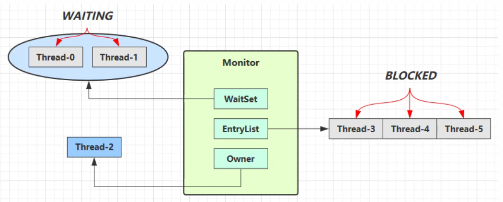

* 刚开始 Monitor 中 Owner 为 null
* 当 Thread-2 执行 synchronized(obj) 就会将 Monitor 的所有者 Owner 置为 Thread-2，Monitor中只能有一个 Owner
* 在 Thread-2 上锁的过程中，如果 Thread-3，Thread-4，Thread-5 也来执行 synchronized(obj)，就会进入EntryList BLOCKED
* Thread-2 执行完同步代码块的内容，然后唤醒 EntryList 中等待的线程来竞争锁，竞争的时是非公平的
* 图中 WaitSet 中的 Thread-0，Thread-1 是之前获得过锁，但条件不满足进入 WAITING 状态的线程，后面讲wait-notify 时会分析


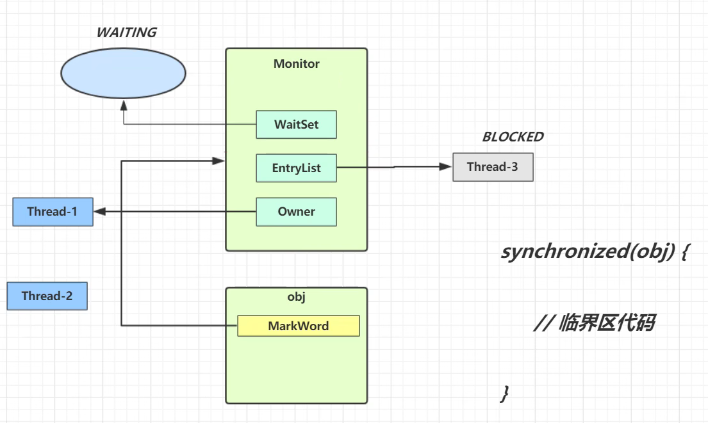


> 1. Thread-2遇到synchronized(obj)的代码时 
>
>    1. 尝试将obj与操作系统提供的一个monitor对象相关联
>
>    2. obj(markword-->monitor)  01-->10 占用2位
>
>    3. ```java
>       | ptr_to_heavyweight_monitor:30      |   10    | Heavyweight Locked |
>       ```
>
>    4. monitor.owner = Thread-2
>
> 2. 此时Thread-3要执行临界区代码，查看obj是否关联monitor 有就检查owner是否有值
>
> 3. 有，就关联该monitor的EntryList装换为BLOCKED


> **注意**：
>
> * synchronized 必须是进入同一个对象的 monitor 才有上述的效果
> * 不加 synchronized 的对象不会关联监视器，不遵从以上规则


## 3.8 synchronized 原理

```java
static final Object lock = new Object();
static int counter = 0;
public static void main(String[] args) {
    synchronized (lock) {
        counter++;
    }
}
```

对应的字节码为

```java
public static void main(java.lang.String[]);
	descriptor: ([Ljava/lang/String;)V
	flags: ACC_PUBLIC, ACC_STATIC
		Code:
			stack=2, locals=3, args_size=1
                 0: getstatic #2 	// <- lock引用 （synchronized开始）
                 3: dup
                 4: astore_1 		// lock引用 -> slot 1
                 5: monitorenter 	// 将 lock对象 MarkWord 置为 Monitor 指针
                 6: getstatic #3 	// <- i
                 9: iconst_1 		// 准备常数 1
                10: iadd 			// +1
                11: putstatic #3 	 // -> i
                14: aload_1 		// <- lock引用
                15: monitorexit 	// 将 lock对象 MarkWord 重置, 唤醒 EntryList
                16: goto 24
                19: astore_2 		// e -> slot 2
                20: aload_1 		// <- lock引用
                21: monitorexit 	// 将 lock对象 MarkWord 重置, 唤醒 EntryList
                22: aload_2 		// <- slot 2 (e)
                23: athrow 			// throw e
                24: return
            Exception table:
            	from 	to 		target 	type
            	6 		16 		19 		any
            	19 		22 		19 		any
            LineNumberTable:
            	line  8: 0
            	line  9: 6
            	line 10: 14
            	line 11: 24
            LocalVariableTable:
            	Start 	Length 		Slot 	Name  	 Signature
            	0 		  	25   	0  		args 	[Ljava/lang/String;
            StackMapTable: number_of_entries = 2
            	frame_type = 255 /* full_frame */
            		offset_delta = 19
            		locals = [ class "[Ljava/lang/String;", class java/lang/Object ]
            		stack = [ class java/lang/Throwable ]
            frame_type = 250 /* chop */
            	offset_delta = 4
```

> **注意**
>
> 方法级别的 synchronized 不会在字节码指令中有所体现


## 3.9 synchronized原理进阶


### 小故事

故事角色

* 老王 - JVM
* 小南 - 线程
* 小女 - 线程
* 房间 - 对象
* 房间门上 - 防盗锁 - Monitor
* 房间门上 - 小南书包 - 轻量级锁
* 房间门上 - 刻上小南大名 - 偏向锁
* 批量重刻名 - 一个类的偏向锁撤销到达 20 阈值
* 不能刻名字 - 批量撤销该类对象的偏向锁，设置该类不可偏向


小南要使用房间保证计算不被其它人干扰（原子性），最初，他用的是防盗锁，当上下文切换时，锁住门。这样，即使他离开了，别人也进不了门，他的工作就是安全的。

但是，很多情况下没人跟他来竞争房间的使用权。小女是要用房间，但使用的时间上是错开的，小南白天用，小女晚上用。每次上锁太麻烦了，有没有更简单的办法呢？

小南和小女商量了一下，约定不锁门了，而是谁用房间，谁把自己的书包挂在门口，但他们的书包样式都一样，因此每次进门前得翻翻书包，看课本是谁的，如果是自己的，那么就可以进门，这样省的上锁解锁了。万一书包不是自己的，那么就在门外等，并通知对方下次用锁门的方式。

后来，小女回老家了，很长一段时间都不会用这个房间。小南每次还是挂书包，翻书包，虽然比锁门省事了，但仍然觉得麻烦。

于是，小南干脆在门上刻上了自己的名字：【小南专属房间，其它人勿用】，下次来用房间时，只要名字还在，那么说明没人打扰，还是可以安全地使用房间。如果这期间有其它人要用这个房间，那么由使用者将小南刻的名字擦掉，升级为挂书包的方式。

同学们都放假回老家了，小南就膨胀了，在 20 个房间刻上了自己的名字，想进哪个进哪个。后来他自己放假回老家了，这时小女回来了（她也要用这些房间），结果就是得一个个地擦掉小南刻的名字，升级为挂书包的方式。老王觉得这成本有点高，提出了一种批量重刻名的方法，他让小女不用挂书包了，可以直接在门上刻上自己的名字

后来，刻名的现象越来越频繁，老王受不了了：算了，这些房间都不能刻名了，只能挂书包


### 1. 轻量级锁

轻量级锁的使用场景：如果一个对象虽然有多线程要加锁，但加锁的时间是错开的（也就是没有竞争），那么可以使用轻量级锁来优化。

轻量级锁对使用者是透明的，即语法仍然是` synchronized`

假设有两个方法同步块，利用同一个对象加锁

```java
static final Object obj = new Object();
public static void method1() {
    synchronized( obj ) {
        // 同步块 A
        method2();
    }
}
public static void method2() {
    synchronized( obj ) {
    	// 同步块 B
    }
}
```

* 创建锁记录（Lock Record）对象，每个线程都的栈帧都会包含一个锁记录的结构，内部可以存储锁定对象的Mark Word

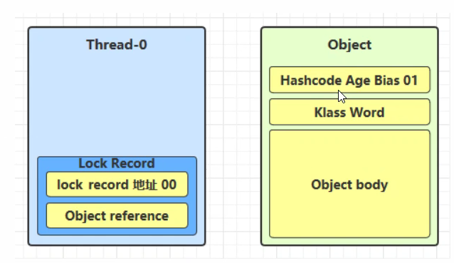

* 让锁记录中 Object reference 指向锁对象，并尝试用 cas 替换 Object 的 Mark Word，将 Mark Word 的值存入锁记录 （00代表轻量级锁）

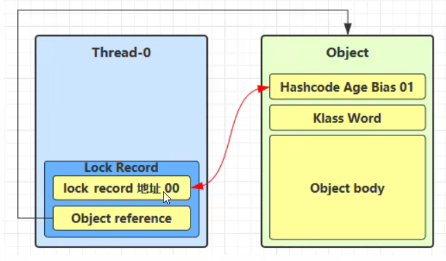

* 如果 cas 替换成功，对象头中存储了 `锁记录地址和状态 00` ，表示由该线程给对象加锁，这时图示如下

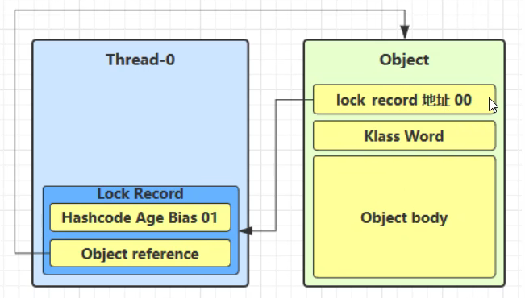

* 如果 cas 失败，有两种情况
  * 如果是其它线程已经持有了该 Object 的轻量级锁(00)，这时表明有竞争，进入锁膨胀过程
  * 如果是自己执行了 synchronized 锁重入，那么再添加一条 Lock Record 作为重入的计数

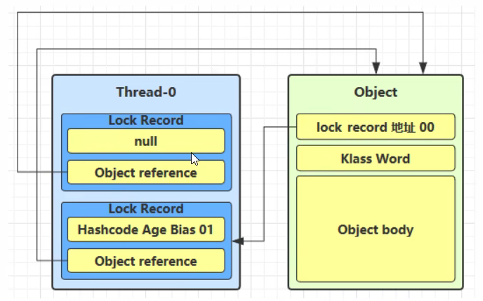

* 当退出 synchronized 代码块（解锁时）如果有取值为 null 的锁记录，表示有重入，这时重置锁记录，表示重入计数减一

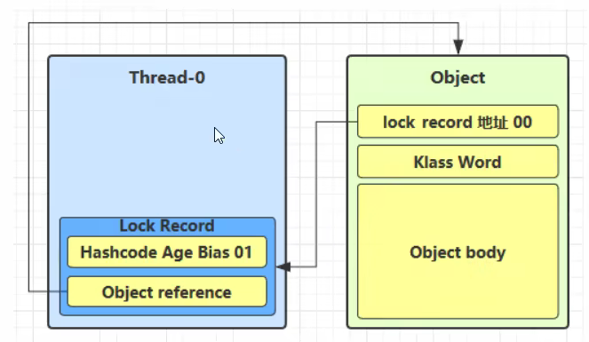

* 当退出 synchronized 代码块（解锁时）锁记录的值不为 null，这时使用 cas 将 Mark Word 的值恢复给对象
  头
  * 成功，则解锁成功
  * 失败，说明轻量级锁进行了锁膨胀或已经升级为重量级锁，进入重量级锁解锁流程


### 2. 锁膨胀

如果在尝试加轻量级锁的过程中，CAS 操作无法成功，这时一种情况就是有其它线程为此对象加上了轻量级锁（有竞争），这时需要进行**锁膨胀**，将轻量级锁变为**重量级锁**。

```java
static Object obj = new Object();
public static void method1() {
    synchronized( obj ) {
    // 同步块
    }
}
```

* 当 Thread-1 进行轻量级加锁时，Thread-0 已经对该对象加了轻量级锁

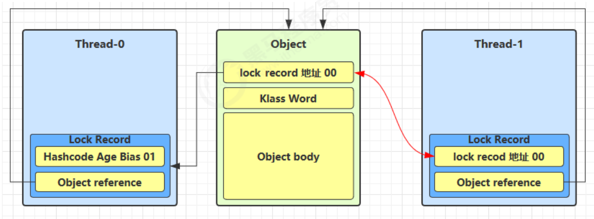

* 这时 Thread-1 加轻量级锁失败，进入锁膨胀流程
  * 即为 Object 对象申请 Monitor 锁，让 Object 指向重量级锁地址 (10 重量级加锁状态)
  * 然后自己进入 Monitor 的 EntryList BLOCKED

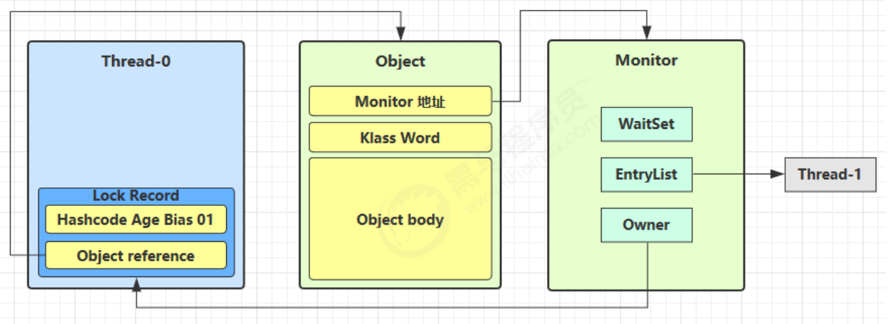

* 当 Thread-0 退出同步块解锁时，使用 cas 将 Mark Word 的值恢复给对象头，失败。这时会进入重量级解锁流程，即按照 Monitor 地址找到 Monitor 对象，设置 Owner 为 null，唤醒 EntryList 中 BLOCKED 线程


### 3. 自旋优化

重量级锁竞争的时候，还可以使用自旋来进行优化，如果当前线程自旋成功（即这时候持锁线程已经退出了同步块，释放了锁），这时当前线程就可以避免阻塞。

自旋重试成功的情况

| 线程 1 （core 1 上）     | 对象 Mark              | 线程 2 （core 2 上）     |
| ------------------------ | ---------------------- | ------------------------ |
| -                        | 10（重量锁）           | -                        |
| 访问同步块，获取 monitor | 10（重量锁）重量锁指针 | -                        |
| 成功（加锁）             | 10（重量锁）重量锁指针 | -                        |
| 执行同步块               | 10（重量锁）重量锁指针 | -                        |
| 执行同步块               | 10（重量锁）重量锁指针 | 访问同步块，获取 monitor |
| 执行同步块               | 10（重量锁）重量锁指针 | 自旋重试                 |
| 执行完毕                 | 10（重量锁）重量锁指针 | 自旋重试                 |
| 成功（解锁）             | 01（无锁）             | 自旋重试                 |
| -                        | 10（重量锁）重量锁指针 | 成功（加锁）             |
| -                        | 10（重量锁）重量锁指针 | 执行同步块               |
| -                        | ...                    | ...                      |

自旋重试失败的情况

| 线程 1（core 1 上）      | 对象 Mark              | 线程 2（core 2 上）      |
| ------------------------ | ---------------------- | ------------------------ |
| -                        | 10（重量锁）           | -                        |
| 访问同步块，获取 monitor | 10（重量锁）重量锁指针 | -                        |
| 成功（加锁）             | 10（重量锁）重量锁指针 | -                        |
| 执行同步块               | 10（重量锁）重量锁指针 | -                        |
| 执行同步块               | 10（重量锁）重量锁指针 | 访问同步块，获取 monitor |
| 执行同步块               | 10（重量锁）重量锁指针 | 自旋重试                 |
| 执行同步块               | 10（重量锁）重量锁指针 | 自旋重试                 |
| 执行同步块               | 10（重量锁）重量锁指针 | 自旋重试                 |
| 执行同步块               | 10（重量锁）重量锁指针 | 阻塞                     |
| -                        | ...                    | ...                      |

* 自旋会占用 CPU 时间，单核 CPU 自旋就是浪费，多核 CPU 自旋才能发挥优势。
* 在 Java 6 之后自旋锁是自适应的，比如对象刚刚的一次自旋操作成功过，那么认为这次自旋成功的可能性会高，就多自旋几次；反之，就少自旋甚至不自旋，总之，比较智能。
* Java 7 之后不能控制是否开启自旋功能


### 4. 偏向锁

轻量级锁在没有竞争时（就自己这个线程），每次重入仍然需要执行 CAS 操作。(替换所记录，第二次重入之后失败为null,作为计数)

Java 6 中引入了偏向锁来做进一步优化：只有第一次使用 CAS 将线程 ID 设置到对象的 Mark Word 头，之后发现这个线程 ID 是自己的就表示没有竞争，不用重新 CAS。以后只要不发生竞争，这个对象就归该线程所有


例如：

```java
static final Object obj = new Object();
public static void m1() {
    synchronized( obj ) {
        // 同步块 A
        m2();
	}
}
public static void m2() {
    synchronized( obj ) {
        // 同步块 B
        m3();
    }
}
public static void m3() {
    synchronized( obj ) {
        // 同步块 C
    }
}
```


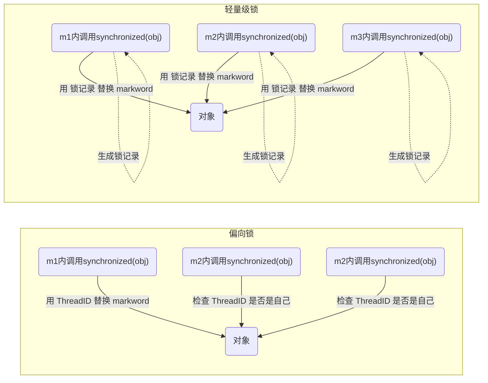
```mermaid
graph LR

subgraph 偏向锁
q("m1内调用synchronized(obj)")--用 ThreadID 替换 markword-->o("对象")
e("m2内调用synchronized(obj)")--检查 ThreadID 是否是自己-->o("对象")
r("m2内调用synchronized(obj)")--检查 ThreadID 是否是自己-->o("对象")
end

subgraph 轻量级锁
a("m1内调用synchronized(obj)")--用 锁记录 替换 markword-->b("对象")
a-.生成锁记录.->a

c("m2内调用synchronized(obj)")--用 锁记录 替换 markword-->b
c-.生成锁记录.->c

d("m3内调用synchronized(obj)")--用 锁记录 替换 markword-->b
d-.生成锁记录.->d
end
```

#### 偏向状态

```java
|-----------------------------------------------------------------|--------------------|
|                  Mark Word (64 bits)                            |       State        |
|-----------------------------------------------------------------|--------------------|
| unused:25 | hashcode:31 | unused:1 | age:4 | biased_lock:0 | 01 |       Normal       |
|-----------------------------------------------------------------|--------------------|
| thread:54 | epoch:2     | unused:1 | age:4 | biased_lock:1 | 01 |       Biased       |
|-----------------------------------------------------------------|--------------------|
|               ptr_to_lock_record:62                        | 00 | Lightweight Locked |
|-----------------------------------------------------------------|--------------------|
|               ptr_to_heavyweight_monitor:62                | 10 | Heavyweight Locked |
|-----------------------------------------------------------------|--------------------|
|                                                            | 11 |   Marked for GC    |
|-----------------------------------------------------------------|--------------------|
```

00 轻 10 重  101偏向(Biased)  没锁是001 通过倒数第三位区分

一个对象创建时：

* 如果开启了偏向锁（biased_lock默认开启），那么对象创建后，markword 值为 0x05 即最后 3 位为 101，这时它的thread、epoch、age 都为 0
* 偏向锁是默认是延迟的，不会在程序启动时立即生效，如果想避免延迟，可以加 VM 参数 -XX:BiasedLockingStartupDelay=0 来禁用延迟
* 如果没有开启偏向锁，那么对象创建后，markword 值为 0x01 即最后 3 位为 001，这时它的 hashcode、age 都为 0，第一次用到 hashcode 时才会赋值


#### 测试偏向锁

##### 测试启用 （默认延迟启用）

```java
// 自己添加了-XX:BiasedLockingStartupDelay=0
public static void main(String[] args) {
    Dog dog = new Dog();
	//  00000000 00000000 00000000 00000000 00000000 00000000 00000000 00000101
    log.info(ClassLayout.parseInstance(dog).toPrintable());
    synchronized(dog){
        // mark word 64 bit  前54位是操作系统提供的线程id 不是getId
        // 00000000 00000000 00000010 10110010 00011000 10101011 01000000 00000101
        System.out.println(ClassLayout.parseInstance(dog).toPrintable());
        //
        System.out.println(Thread.currentThread().getId());
    }
    // 处于偏向锁的对象解锁后，其对象ID仍处于对象头中
        // 00000000 00000000 00000010 01011001 10010010 00011111 01000000 00000101
    log.info(ClassLayout.parseInstance(dog).toPrintable());
}
```

##### 测试禁用

```java
// 禁用 -XX:-UseBiasedLocking
    public static void main(String[] args) {
        Dog dog = new Dog();
        // 00000000 00000000 00000000 00000000 00000000 00000000 00000000 00000001
        log.info(ClassLayout.parseInstance(dog).toPrintable());
        synchronized(dog){
            // mark word 64 bit  前54位是操作系统提供的线程id 不是getId
            // 禁用偏向锁之后 直接轻量级锁
            // 00000000 00000000 00000000 11000100 01010110 10111111 11110101 11101000
            System.out.println(ClassLayout.parseInstance(dog).toPrintable());
            //
            System.out.println(Thread.currentThread().getId());
        }
        // 00000000 00000000 00000000 00000000 00000000 00000000 00000000 00000001
        log.info(ClassLayout.parseInstance(dog).toPrintable());
    }
```

#### 测试HashCode

```java
public static void main(String[] args) {
    Dog dog = new Dog();
    dog.hashCode();
    // 无锁
    // 00000000 00000000 00000000 0100111 00010000 01010011 11100001 00000001
    log.info(ClassLayout.parseInstance(dog).toPrintable());
    synchronized(dog){
        // mark word 64 bit  前54位是操作系统提供的线程id 不是getId  轻量级
        // 00000000 00000000 00000000 10001000 11000010 10111111 11110101 10111000
        System.out.println(ClassLayout.parseInstance(dog).toPrintable());
        //
        System.out.println(Thread.currentThread().getId());
    }
    // 无锁
    //00000000 00000000 00000000 00100111 00010000 01010011 11100001 00000001
    log.info(ClassLayout.parseInstance(dog).toPrintable());
}
```

#### 撤销 - 调用对象 hashCode

当有其它线程使用偏向锁对象（无竞争状态）时，会将偏向锁升级为轻量级锁

* 正常状态对象一开始是没有 hashCode 的，第一次调用才生成
* `hashcode:31` MarkWord头同时存不下 31 和 56的ThreadId  此对象就不可偏向
* 轻量级锁hashCode存在栈帧锁记录中
* 重量级锁hashCode存在Monitor对象中


#### 撤销 - 其它线程使用对象

当有其它线程使用偏向锁对象时，会将偏向锁升级为轻量级锁

```java
private static void test2() throws InterruptedException {
    Dog d = new Dog();
    Thread t1 = new Thread(() -> {
        synchronized (d) {
        	log.debug(ClassLayout.parseInstance(d).toPrintableSimple(true));
        }
        synchronized (TestBiased.class) {
        	TestBiased.class.notify();
        }
        // 如果不用 wait/notify 使用 join 必须打开下面的注释
        // 因为：t1 线程不能结束，否则底层线程可能被 jvm 重用作为 t2 线程，底层线程 id 是一样的
        /*try {
        	System.in.read();
        } catch (IOException e) {
        	e.printStackTrace();
        }*/
    }, "t1");
    t1.start();
    
    Thread t2 = new Thread(() -> {
        synchronized (TestBiased.class) {
            try {
            	TestBiased.class.wait();
            } catch (InterruptedException e) {
                e.printStackTrace();
            }
    	}
    	log.debug(ClassLayout.parseInstance(d).toPrintableSimple(true));
        
    	synchronized (d) {
    		log.debug(ClassLayout.parseInstance(d).toPrintableSimple(true));
    	}
    	log.debug(ClassLayout.parseInstance(d).toPrintableSimple(true));
    }, "t2");
    t2.start();
}
```

输出

```java
// t1 偏向锁
[t1] - 00000000 00000000 00000000 00000000 00011111 01000001 00010000 00000101
// t2 加锁之前还是偏向于t1
[t2] - 00000000 00000000 00000000 00000000 00011111 01000001 00010000 00000101
// 转而为轻量级锁
[t2] - 00000000 00000000 00000000 00000000 00011111 10110101 11110000 01000000
// t2无锁状态 不可偏向
[t2] - 00000000 00000000 00000000 00000000 00000000 00000000 00000000 00000001
```


#### 撤销-调用wait/notify

* wait/notify重量级锁 monitor使用

```java
public static void main(String[] args) throws InterruptedException {
    Dog d = new Dog();
    Thread t1 = new Thread(() -> {
    	log.debug(ClassLayout.parseInstance(d).toPrintableSimple(true));
        synchronized (d) {
            log.debug(ClassLayout.parseInstance(d).toPrintableSimple(true));
            try {
            	d.wait();
            } catch (InterruptedException e) {
            	e.printStackTrace();
            }
            log.debug(ClassLayout.parseInstance(d).toPrintableSimple(true));
        }
    }, "t1");
    t1.start();
    new Thread(() -> {
        try {
        	Thread.sleep(6000);
        } catch (InterruptedException e) {
        	e.printStackTrace();
        }
        synchronized (d) {
            log.debug("notify");
            d.notify();
        }
    }, "t2").start();
}
```

输出

```java
[t1] - 00000000 00000000 00000000 00000000 00000000 00000000 00000000 00000101
[t1] - 00000000 00000000 00000000 00000000 00011111 10110011 11111000 00000101
[t2] - notify
[t1] - 00000000 00000000 00000000 00000000 00011100 11010100 00001101 11001010
```


#### 批量重偏向

如果对象虽然被多个线程访问，但**没有竞争**，这时偏向了线程 T1 的对象仍有机会重新偏向 T2，重偏向会重置对象的 Thread ID

当撤销偏向锁(T1-->T2)阈值超过 20 次后，jvm 会这样觉得，我是不是偏向错了呢，于是会在给这些对象加锁时重新偏向至加锁线程

```java
private static void test3() throws InterruptedException {
    Vector<Dog> list = new Vector<>();
    Thread t1 = new Thread(() -> {
        for (int i = 0; i < 30; i++) {
            Dog d = new Dog();
            list.add(d);
            synchronized (d) {
              log.debug(i + "\t" + ClassLayout.parseInstance(d).toPrintableSimple(true));
            }
        }
        synchronized (list) {
        	list.notify();
        }
    }, "t1");
    t1.start();
    Thread t2 = new Thread(() -> {
        synchronized (list) {
            try {
            	list.wait();
            } catch (InterruptedException e) {
            	e.printStackTrace();
            }
        }
        log.debug("===============> ");
        for (int i = 0; i < 30; i++) {
            Dog d = list.get(i);
            log.debug(i + "\t" + ClassLayout.parseInstance(d).toPrintableSimple(true));
            synchronized (d) {
              log.debug(i + "\t" + ClassLayout.parseInstance(d).toPrintableSimple(true));
            }
            log.debug(i + "\t" + ClassLayout.parseInstance(d).toPrintableSimple(true));
        }
    }, "t2");
    t2.start();
}
```

输出

##### start

```
[t1] - 0 00000000 00000000 00000000 00000000 00011111 11110011 11100000 00000101
[t1] - 1 00000000 00000000 00000000 00000000 00011111 11110011 11100000 00000101
[t1] - 2 00000000 00000000 00000000 00000000 00011111 11110011 11100000 00000101
[t1] - 3 00000000 00000000 00000000 00000000 00011111 11110011 11100000 00000101
[t1] - 4 00000000 00000000 00000000 00000000 00011111 11110011 11100000 00000101
[t1] - 5 00000000 00000000 00000000 00000000 00011111 11110011 11100000 00000101
[t1] - 6 00000000 00000000 00000000 00000000 00011111 11110011 11100000 00000101
[t1] - 7 00000000 00000000 00000000 00000000 00011111 11110011 11100000 00000101
[t1] - 8 00000000 00000000 00000000 00000000 00011111 11110011 11100000 00000101
[t1] - 9 00000000 00000000 00000000 00000000 00011111 11110011 11100000 00000101
[t1] - 10 00000000 00000000 00000000 00000000 00011111 11110011 11100000 00000101
[t1] - 11 00000000 00000000 00000000 00000000 00011111 11110011 11100000 00000101
[t1] - 12 00000000 00000000 00000000 00000000 00011111 11110011 11100000 00000101
[t1] - 13 00000000 00000000 00000000 00000000 00011111 11110011 11100000 00000101
[t1] - 14 00000000 00000000 00000000 00000000 00011111 11110011 11100000 00000101
[t1] - 15 00000000 00000000 00000000 00000000 00011111 11110011 11100000 00000101
[t1] - 16 00000000 00000000 00000000 00000000 00011111 11110011 11100000 00000101
[t1] - 17 00000000 00000000 00000000 00000000 00011111 11110011 11100000 00000101
[t1] - 18 00000000 00000000 00000000 00000000 00011111 11110011 11100000 00000101
[t1] - 19 00000000 00000000 00000000 00000000 00011111 11110011 11100000 00000101
[t1] - 20 00000000 00000000 00000000 00000000 00011111 11110011 11100000 00000101
[t1] - 21 00000000 00000000 00000000 00000000 00011111 11110011 11100000 00000101
[t1] - 22 00000000 00000000 00000000 00000000 00011111 11110011 11100000 00000101
[t1] - 23 00000000 00000000 00000000 00000000 00011111 11110011 11100000 00000101
[t1] - 24 00000000 00000000 00000000 00000000 00011111 11110011 11100000 00000101
[t1] - 25 00000000 00000000 00000000 00000000 00011111 11110011 11100000 00000101
[t1] - 26 00000000 00000000 00000000 00000000 00011111 11110011 11100000 00000101
[t1] - 27 00000000 00000000 00000000 00000000 00011111 11110011 11100000 00000101
[t1] - 28 00000000 00000000 00000000 00000000 00011111 11110011 11100000 00000101
[t1] - 29 00000000 00000000 00000000 00000000 00011111 11110011 11100000 00000101
[t2] - ===============>
[t2] - 0 00000000 00000000 00000000 00000000 00011111 11110011 11100000 00000101
[t2] - 0 00000000 00000000 00000000 00000000 00100000 01011000 11110111 00000000
[t2] - 0 00000000 00000000 00000000 00000000 00000000 00000000 00000000 00000001
[t2] - 1 00000000 00000000 00000000 00000000 00011111 11110011 11100000 00000101
[t2] - 1 00000000 00000000 00000000 00000000 00100000 01011000 11110111 00000000
[t2] - 1 00000000 00000000 00000000 00000000 00000000 00000000 00000000 00000001
[t2] - 2 00000000 00000000 00000000 00000000 00011111 11110011 11100000 00000101
[t2] - 2 00000000 00000000 00000000 00000000 00100000 01011000 11110111 00000000
[t2] - 2 00000000 00000000 00000000 00000000 00000000 00000000 00000000 00000001
[t2] - 3 00000000 00000000 00000000 00000000 00011111 11110011 11100000 00000101
[t2] - 3 00000000 00000000 00000000 00000000 00100000 01011000 11110111 00000000
[t2] - 3 00000000 00000000 00000000 00000000 00000000 00000000 00000000 00000001
[t2] - 4 00000000 00000000 00000000 00000000 00011111 11110011 11100000 00000101
[t2] - 4 00000000 00000000 00000000 00000000 00100000 01011000 11110111 00000000
[t2] - 4 00000000 00000000 00000000 00000000 00000000 00000000 00000000 00000001
[t2] - 5 00000000 00000000 00000000 00000000 00011111 11110011 11100000 00000101
[t2] - 5 00000000 00000000 00000000 00000000 00100000 01011000 11110111 00000000
[t2] - 5 00000000 00000000 00000000 00000000 00000000 00000000 00000000 00000001
[t2] - 6 00000000 00000000 00000000 00000000 00011111 11110011 11100000 00000101
[t2] - 6 00000000 00000000 00000000 00000000 00100000 01011000 11110111 00000000
[t2] - 6 00000000 00000000 00000000 00000000 00000000 00000000 00000000 00000001
[t2] - 7 00000000 00000000 00000000 00000000 00011111 11110011 11100000 00000101
[t2] - 7 00000000 00000000 00000000 00000000 00100000 01011000 11110111 00000000
[t2] - 7 00000000 00000000 00000000 00000000 00000000 00000000 00000000 00000001
[t2] - 8 00000000 00000000 00000000 00000000 00011111 11110011 11100000 00000101
[t2] - 8 00000000 00000000 00000000 00000000 00100000 01011000 11110111 00000000
[t2] - 8 00000000 00000000 00000000 00000000 00000000 00000000 00000000 00000001
[t2] - 9 00000000 00000000 00000000 00000000 00011111 11110011 11100000 00000101
[t2] - 9 00000000 00000000 00000000 00000000 00100000 01011000 11110111 00000000
[t2] - 9 00000000 00000000 00000000 00000000 00000000 00000000 00000000 00000001
[t2] - 10 00000000 00000000 00000000 00000000 00011111 11110011 11100000 00000101
[t2] - 10 00000000 00000000 00000000 00000000 00100000 01011000 11110111 00000000
[t2] - 10 00000000 00000000 00000000 00000000 00000000 00000000 00000000 00000001
[t2] - 11 00000000 00000000 00000000 00000000 00011111 11110011 11100000 00000101
[t2] - 11 00000000 00000000 00000000 00000000 00100000 01011000 11110111 00000000
[t2] - 11 00000000 00000000 00000000 00000000 00000000 00000000 00000000 00000001
[t2] - 12 00000000 00000000 00000000 00000000 00011111 11110011 11100000 00000101
[t2] - 12 00000000 00000000 00000000 00000000 00100000 01011000 11110111 00000000
[t2] - 12 00000000 00000000 00000000 00000000 00000000 00000000 00000000 00000001
[t2] - 13 00000000 00000000 00000000 00000000 00011111 11110011 11100000 00000101
[t2] - 13 00000000 00000000 00000000 00000000 00100000 01011000 11110111 00000000
[t2] - 13 00000000 00000000 00000000 00000000 00000000 00000000 00000000 00000001
[t2] - 14 00000000 00000000 00000000 00000000 00011111 11110011 11100000 00000101
[t2] - 14 00000000 00000000 00000000 00000000 00100000 01011000 11110111 00000000
[t2] - 14 00000000 00000000 00000000 00000000 00000000 00000000 00000000 00000001
[t2] - 15 00000000 00000000 00000000 00000000 00011111 11110011 11100000 00000101
[t2] - 15 00000000 00000000 00000000 00000000 00100000 01011000 11110111 00000000
[t2] - 15 00000000 00000000 00000000 00000000 00000000 00000000 00000000 00000001
[t2] - 16 00000000 00000000 00000000 00000000 00011111 11110011 11100000 00000101
[t2] - 16 00000000 00000000 00000000 00000000 00100000 01011000 11110111 00000000
[t2] - 16 00000000 00000000 00000000 00000000 00000000 00000000 00000000 00000001
[t2] - 17 00000000 00000000 00000000 00000000 00011111 11110011 11100000 00000101
[t2] - 17 00000000 00000000 00000000 00000000 00100000 01011000 11110111 00000000
[t2] - 17 00000000 00000000 00000000 00000000 00000000 00000000 00000000 00000001
[t2] - 18 00000000 00000000 00000000 00000000 00011111 11110011 11100000 00000101
[t2] - 18 00000000 00000000 00000000 00000000 00100000 01011000 11110111 00000000
[t2] - 18 00000000 00000000 00000000 00000000 00000000 00000000 00000000 00000001
[t2] - 19 00000000 00000000 00000000 00000000 00011111 11110011 11100000 00000101
[t2] - 19 00000000 00000000 00000000 00000000 00011111 11110011 11110001 00000101
[t2] - 19 00000000 00000000 00000000 00000000 00011111 11110011 11110001 00000101
[t2] - 20 00000000 00000000 00000000 00000000 00011111 11110011 11100000 00000101
[t2] - 20 00000000 00000000 00000000 00000000 00011111 11110011 11110001 00000101
[t2] - 20 00000000 00000000 00000000 00000000 00011111 11110011 11110001 00000101
[t2] - 21 00000000 00000000 00000000 00000000 00011111 11110011 11100000 00000101
[t2] - 21 00000000 00000000 00000000 00000000 00011111 11110011 11110001 00000101
[t2] - 21 00000000 00000000 00000000 00000000 00011111 11110011 11110001 00000101
[t2] - 22 00000000 00000000 00000000 00000000 00011111 11110011 11100000 00000101
[t2] - 22 00000000 00000000 00000000 00000000 00011111 11110011 11110001 00000101
[t2] - 22 00000000 00000000 00000000 00000000 00011111 11110011 11110001 00000101
[t2] - 23 00000000 00000000 00000000 00000000 00011111 11110011 11100000 00000101
[t2] - 23 00000000 00000000 00000000 00000000 00011111 11110011 11110001 00000101
[t2] - 23 00000000 00000000 00000000 00000000 00011111 11110011 11110001 00000101
[t2] - 24 00000000 00000000 00000000 00000000 00011111 11110011 11100000 00000101
[t2] - 24 00000000 00000000 00000000 00000000 00011111 11110011 11110001 00000101
[t2] - 24 00000000 00000000 00000000 00000000 00011111 11110011 11110001 00000101
[t2] - 25 00000000 00000000 00000000 00000000 00011111 11110011 11100000 00000101
[t2] - 25 00000000 00000000 00000000 00000000 00011111 11110011 11110001 00000101
[t2] - 25 00000000 00000000 00000000 00000000 00011111 11110011 11110001 00000101
[t2] - 26 00000000 00000000 00000000 00000000 00011111 11110011 11100000 00000101
[t2] - 26 00000000 00000000 00000000 00000000 00011111 11110011 11110001 00000101
[t2] - 26 00000000 00000000 00000000 00000000 00011111 11110011 11110001 00000101
[t2] - 27 00000000 00000000 00000000 00000000 00011111 11110011 11100000 00000101
[t2] - 27 00000000 00000000 00000000 00000000 00011111 11110011 11110001 00000101
[t2] - 27 00000000 00000000 00000000 00000000 00011111 11110011 11110001 00000101
[t2] - 28 00000000 00000000 00000000 00000000 00011111 11110011 11100000 00000101
[t2] - 28 00000000 00000000 00000000 00000000 00011111 11110011 11110001 00000101
[t2] - 28 00000000 00000000 00000000 00000000 00011111 11110011 11110001 00000101
[t2] - 29 00000000 00000000 00000000 00000000 00011111 11110011 11100000 00000101
[t2] - 29 00000000 00000000 00000000 00000000 00011111 11110011 11110001 00000101
[t2] - 29 00000000 00000000 00000000 00000000 00011111 11110011 11110001 00000101
```

##### end


#### 批量撤销

当撤销偏向锁阈值超过 40 次后，jvm 会这样觉得，自己确实偏向错了，根本就不该偏向。于是整个类的所有对象都会变为不可偏向的，新建的对象也是不可偏向的

```java
static Thread t1, t2, t3;

    private static void test4() throws InterruptedException {
        Vector<Dog> list = new Vector<>();
        int loopNumber = 39;
        t1 = new Thread(() -> {
            for (int i = 0; i < loopNumber; i++) {
                Dog d = new Dog();
                list.add(d);
                synchronized (d) {
                    log.debug(i + "\t" + ClassLayout.parseInstance(d).toPrintableSimple(true));
                }
            }
            LockSupport.unpark(t2);
        }, "t1");
        t1.start();
        t2 = new Thread(() -> {
            LockSupport.park();
            log.debug("===============> ");
            for (int i = 0; i < loopNumber; i++) {
                Dog d = list.get(i);
                log.debug(i + "\t" + ClassLayout.parseInstance(d).toPrintableSimple(true));
                synchronized (d) {
                    log.debug(i + "\t" + ClassLayout.parseInstance(d).toPrintableSimple(true));
                }
                log.debug(i + "\t" + ClassLayout.parseInstance(d).toPrintableSimple(true));
            }
            LockSupport.unpark(t3);
        }, "t2");
        t2.start();
        t3 = new Thread(() -> {
            LockSupport.park();
            log.debug("===============> ");
            for (int i = 0; i < loopNumber; i++) {
                Dog d = list.get(i);
                log.debug(i + "\t" + ClassLayout.parseInstance(d).toPrintableSimple(true));
                synchronized (d) {
                    log.debug(i + "\t" + ClassLayout.parseInstance(d).toPrintableSimple(true));
                }
                log.debug(i + "\t" + ClassLayout.parseInstance(d).toPrintableSimple(true));
            }
        }, "t3");
        t3.start();
        t3.join();
        log.debug(ClassLayout.parseInstance(new Dog()).toPrintableSimple(true));
    }
```

* 注意这里开始t1线程把40个加入到list，而t2只重偏向了前面20个，所以t3一开始要重偏向list剩余的20个
* 当撤销偏向锁阈值超过 40 次后 再`new Dog()`，已经是不可偏向的锁对象


#### 参考资料

> 参考资料
>
> https://github.com/farmerjohngit/myblog/issues/12
>
> https://www.cnblogs.com/LemonFive/p/11246086.html
>
> https://www.cnblogs.com/LemonFive/p/11248248.html
>
> [偏向锁论文](https://www.oracle.com/technetwork/java/biasedlocking-oopsla2006-wp-149958.pdf)


### 5. 锁消除

```java
@Fork(1)
@BenchmarkMode(Mode.AverageTime)
@Warmup(iterations=3)
@Measurement(iterations=5)
@OutputTimeUnit(TimeUnit.NANOSECONDS)
public class MyBenchmark {
    static int x = 0;
    
    @Benchmark
    public void a() throws Exception {
    	x++;
    }
    
    @Benchmark
    public void b() throws Exception {
        Object o = new Object();
        synchronized (o) {
        	x++;
        }
    }
}
```

`java -jar benchmarks.jar`

* JIT 优化 逃逸分析将synchronized优化掉

```java
Benchmark 			Mode 		Samples 		Score Score 		error Units
c.i.MyBenchmark.a 	avgt 			5 			1.542 				0.056 	ns/op
c.i.MyBenchmark.b 	avgt 			5 			1.518 				0.091 	ns/op
```

`java -XX:-EliminateLocks -jar benchmarks.jar` 

* 禁用锁消除

```java
Benchmark 			Mode		 Samples 		Score Score 		error Units
c.i.MyBenchmark.a    avgt 			5 			1.507 				0.108 ns/op
c.i.MyBenchmark.b    avgt 			5 			16.976 				1.572 ns/op
```

锁粗化

对相同对象多次加锁，导致线程发生多次重入，可以使用锁粗化方式来优化，这不同于之前讲的细分锁的粒度。


## 3.10 wait notify


### 小故事

* 由于条件不满足，小南不能继续进行计算
* 但小南如果一直占用着锁，其它人就得一直阻塞，效率太低
* 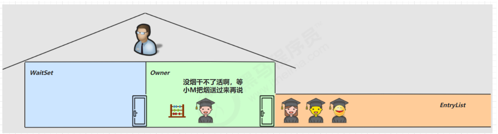
* 于是老王单开了一间休息室（调用 wait 方法），让小南到休息室（WaitSet）等着去了，但这时锁释放开，其它人可以由老王随机安排进屋
* 直到小M将烟送来，大叫一声 [ 你的烟到了 ] （调用 notify 方法）
* 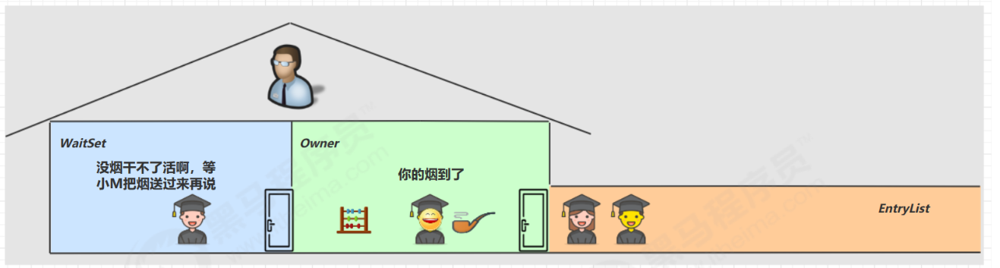
* 小南于是可以离开休息室，重新进入竞争锁的队列
* 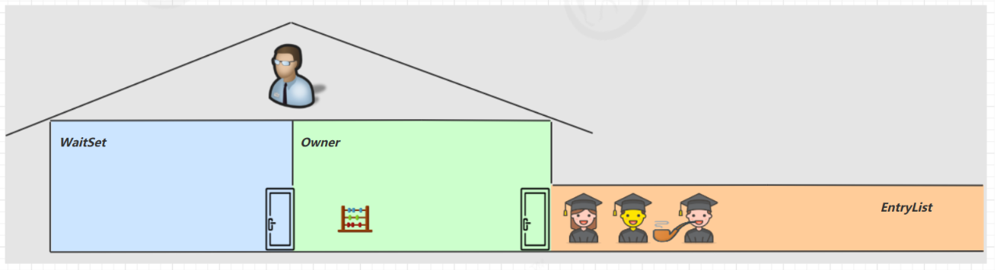


### wait notify原理

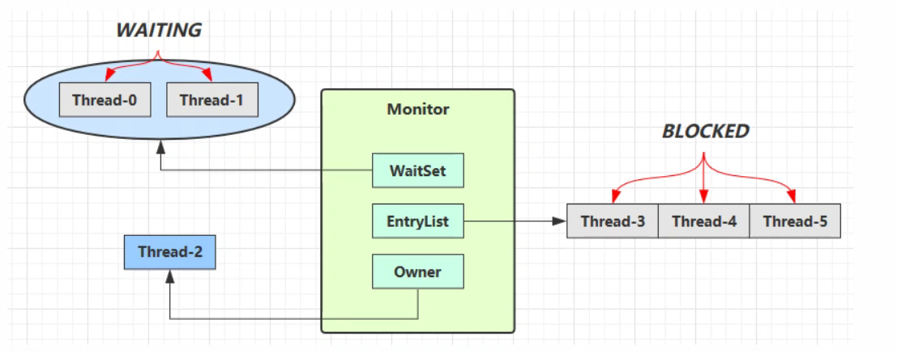

* Owner 线程发现条件不满足，调用 wait 方法，即可进入 WaitSet 变为 WAITING 状态
* BLOCKED 和 WAITING 的线程都处于阻塞状态，不占用 CPU 时间片
* BLOCKED 线程会在 Owner 线程释放锁时唤醒
* WAITING 线程会在 Owner 线程调用 notify 或 notifyAll 时唤醒，但唤醒后并不意味者立刻获得锁，仍需进入EntryList 重新竞争


### API

* `obj.wait()` 让进入 object 监视器的线程到 waitSet 等待
* `obj.notify()` 在 object 上正在 waitSet 等待的线程中挑一个唤醒
* `obj.notifyAll()` 让 object 上正在 waitSet 等待的线程全部唤醒

它们都是线程之间进行协作的手段，都属于 Object 对象的方法。必须获得此对象的锁，才能调用这几个方法

```java
final static Object LOCK = new Object();
public static void main(String[] args) {
    new Thread(() -> {
        synchronized (LOCK) {
            log.debug("执行....");
            try {
                LOCK.wait(); // 让线程在obj上一直等待下去
            } catch (InterruptedException e) {
                e.printStackTrace();
            }
            log.debug("其它代码....");
        }
    }).start();
    new Thread(() -> {
        synchronized (LOCK) {
            log.debug("执行....");
            try {
                LOCK.wait(); // 让线程在obj上一直等待下去
            } catch (InterruptedException e) {
                e.printStackTrace();
            }
            log.debug("其它代码....");
        }
    }).start();
    // 主线程两秒后执行
    sleep(2);
    log.debug("唤醒 LOCK 上其它线程");
    synchronized (LOCK) {
        LOCK.notify(); // 唤醒obj上一个线程
        // LOCK.notifyAll(); // 唤醒obj上所有等待线程
    }
}
```

`wait() `方法会释放对象的锁，进入 WaitSet 等待区，从而让其他线程就机会获取对象的锁。无限制等待，直到`notify `为止
`wait(long n)` 有时限的等待, 到 n 毫秒后结束等待，或是被 notify

* 时限的等待, 到 n 毫秒后结束等待之后进入BLOCKED队列

```java
new Thread(()->{
    log.debug("t1.start...wait...");
    synchronized(LOCK){
        try {
            LOCK.wait(1000L);
            log.debug("wake up...");
        } catch (InterruptedException e) {
            e.printStackTrace();
        }
    }
},"t1").start();
```


## 3.11 wait notify的正确姿势

开始之前先看看

### `sleep(long n) `和 `wait(long n) `的区别

1) sleep 是 Thread 方法，而 wait 是 Object 的方法 
2) sleep 不需要强制和 synchronized 配合使用，但 wait 需要和 synchronized 一起用 
3) sleep 在睡眠的同时，不会释放对象锁的，但 wait 在等待的时候会释放对象锁 
4) 它们状态 TIMED_WAITING 


### 正确姿势

```java
synchronized(lock){
    while(条件不成立){
        lock.wait();
    }
    // 干活代码
}

// 另一个线程
synchronized(lock){
    lock.notifyAll();
}
```


## 3.12 Park & Unpark


### 1.基本使用

它们是 LockSupport 类中的方法

```java
// 暂停当前线程
LockSupport.park();

// 恢复某个线程的运行
LockSupport.unpark(暂停线程对象)
```

先 park 再 unpark

```java
Thread t1 = new Thread(() -> {
    log.debug("start...");
    sleep(1);
    log.debug("park...");
    LockSupport.park();
    log.debug("resume...");
}, "t1");
t1.start();
sleep(2);
log.debug("unpark...");
LockSupport.unpark(t1);
```

输出

```
10:47:29 [t1] c.park - start...
10:47:30 [t1] c.park - park...
10:47:31 [main] c.park - unpark...
10:47:31 [t1] c.park - resume...
```

先unpark再park(RUNNABLE状态下)

```java
Thread t1 = new Thread(() -> {
    log.debug("start...");
    sleep(2);
    log.debug("park...");
    LockSupport.park();
    log.debug("resume...");
}, "t1");
t1.start();


sleep(1);
log.debug("unpark...");
LockSupport.unpark(t1);

```

输出

```
10:51:45 [t1] c.park - start...
10:51:46 [main] c.park - unpark...
10:51:47 [t1] c.park - park...
10:51:47 [t1] c.park - resume...
```


### 2.特点

与 Object 的 wait & notify 相比

* wait，notify 和 notifyAll 必须配合 Object Monitor (synchronized(Object)) 一起使用，而 park，unpark 不必
* park & unpark 是以线程为单位来【阻塞】和【唤醒】线程，而 notify 只能随机唤醒一个等待线程，notifyAll是唤醒所有等待线程，就不那么【精确】
* park & unpark 可以先 unpark，而 wait & notify 不能先 notify (park的线程在RUNNABLE)


### 3. 原理

每个线程都有自己的一个 Parker 对象，由三部分组成 `_counter ， _cond `和 `_mutex `打个比喻

* 线程就像一个旅人，Parker 就像他随身携带的背包，条件变量就好比背包中的帐篷。`_counter `就好比背包中的备用干粮（0 为耗尽，1 为充足）
* 调用 park 就是要看需不需要停下来歇息
  * 如果备用干粮耗尽，那么钻进帐篷歇息
  * 如果备用干粮充足，那么不需停留，继续前进
* 调用 unpark，就好比令干粮充足
  * 如果这时线程还在帐篷，就唤醒让他继续前进
  * 如果这时线程还在运行，那么下次他调用 park 时，仅是消耗掉备用干粮，不需停留继续前进
    * 因为背包空间有限，多次调用 unpark 仅会补充一份备用干粮

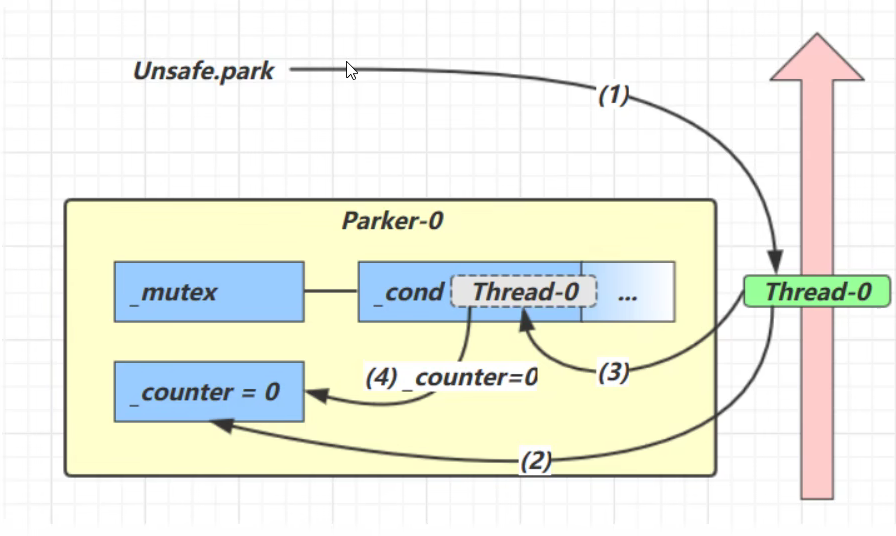

1. 当前线程调用 Unsafe.park() 方法
2. 检查 _counter ，本情况为 0，这时，获得 _mutex 互斥锁
3. 线程进入 _cond 条件变量阻塞
4. 设置 _counter = 0

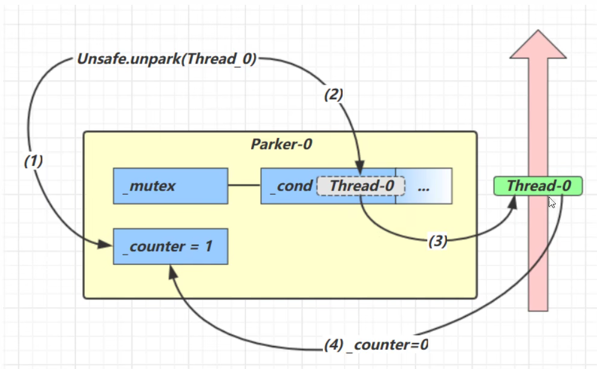

1. 调用 Unsafe.unpark(Thread_0) 方法，设置 _counter 为 1
2. 唤醒 _cond 条件变量中的 Thread_0
3. Thread_0 恢复运行
4. 设置 _counter 为 0

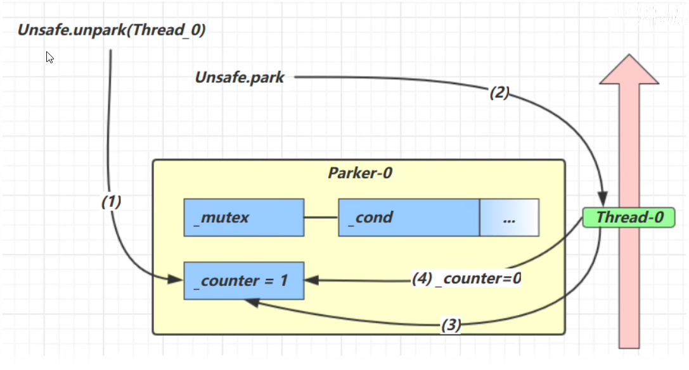

1. 调用 Unsafe.unpark(Thread_0) 方法，设置 _counter 为 1
2. 当前线程调用 Unsafe.park() 方法
3. 检查 _counter ，本情况为 1，这时线程无需阻塞，继续运行
4. 设置 _counter 为 0


## 3.13 重新理解线程状态转换

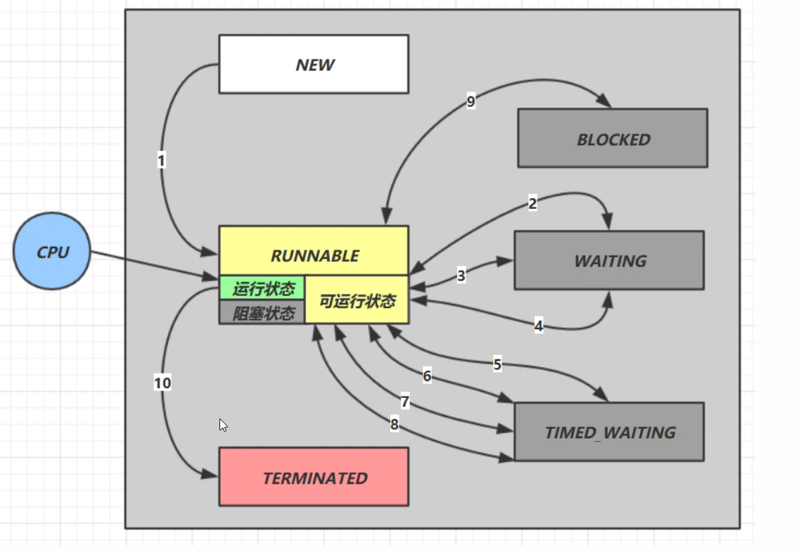


假设有线程 Thread t

#### 1. `NEW --> RUNNABLE`

* 当调用 `t.start()` 方法时，由 `NEW --> RUNNABLE`


#### 2.`RUNNABLE <--> WAITING `

t 线程用 `synchronized(obj) `获取了对象锁后

* 调用 `obj.wait()` 方法时，**t 线程**从 `RUNNABLE --> WAITING`
* 调用 `obj.notify() ， obj.notifyAll() ， t.interrupt()` 时
  * 竞争锁成功，**t 线程**从 `WAITING --> RUNNABLE`
  * 竞争锁失败，**t 线程**从 `WAITING --> BLOCKED`

```java
final static Object LOCK = new Object();
public static void main(String[] args) {
    new Thread(()->{
        synchronized(LOCK){
            // 断点
            log.debug("start...");
            try {
                LOCK.wait();
            } catch (InterruptedException e) {
                throw new RuntimeException(e);
            }
            log.debug("其他...");
        }

    },"t1").start();

    new Thread(()->{
        synchronized(LOCK){
            // 断点
            log.debug("start...");
            try {
                LOCK.wait();
            } catch (InterruptedException e) {
                throw new RuntimeException(e);
            }
            log.debug("其他...");
        }
    },"t2").start();

    sleep(0.5);
    // 断点
    log.debug("唤醒其他线程...");
    synchronized (LOCK){
        LOCK.notifyAll();// 唤醒所有线程
    }
}
```


#### 3. `RUNNABLE <--> WAITING`

* **当前线程**调用 t.join() 方法时，**当前线程**从 `RUNNABLE --> WAITING`
  * 注意是**当前线程**在**t 线程**对象的监视器上等待
* **t 线程**运行结束，或调用了**当前线程**的` interrupt()` 时，**当前线程**从 `WAITING --> RUNNABLE`


#### 4. `RUNNABLE <--> WAITING`

* 当前线程调用` LockSupport.park()` 方法会让当前线程从` RUNNABLE --> WAITING`
* 调用 `LockSupport.unpark(目标线程)` 或调用了线程 的 `interrupt()` ，会让目标线程从 `WAITING -->RUNNABLE`


#### 5. `RUNNABLE <--> TIMED_WAITING`

**t 线程**用 `synchronized(obj)` 获取了对象锁后

* 调用 `obj.wait(long n)` 方法时，**t 线程**从 `RUNNABLE --> TIMED_WAITING`
* **t 线程**等待时间超过了 n 毫秒，或调用 `obj.notify() ， obj.notifyAll() ， t.interrupt()` 时
  * 竞争锁成功，**t 线程**从` TIMED_WAITING --> RUNNABLE`
  * 竞争锁失败，**t 线程**从` TIMED_WAITING --> BLOCKED`

```java
```


#### 6. `RUNNABLE <--> TIMED_WAITING`

* **当前线程**调用 `t.join(long n)` 方法时，**当前线程**从`RUNNABLE --> TIMED_WAITING`
  * 注意是**当前线程**在**t 线程**对象的监视器上等待
* **当前线程**等待时间超过了 n 毫秒，或**t 线程**运行结束，或调用了**当前线程**的 interrupt() 时，**当前线程**从`TIMED_WAITING --> RUNNABLE`


#### 7. `RUNNABLE <--> TIMED_WAITING`

* 当前线程调用 `Thread.sleep(long n)` ，当前线程从` RUNNABLE --> TIMED_WAITING`
* **当前线程**等待时间超过了 n 毫秒，**当前线程**从`TIMED_WAITING --> RUNNABLE`


#### 8. `RUNNABLE <--> TIMED_WAITING`

* 当前线程调用 `LockSupport.parkNanos(long nanos)` 或 `LockSupport.parkUntil(long millis)` 时，**当前线程**从 `RUNNABLE --> TIMED_WAITING`
* 调用 `LockSupport.unpark(目标线程)` 或调用了线程 的 `interrupt() `，或是等待超时，会让目标线程从
  `TIMED_WAITING--> RUNNABLE`


#### 9. `RUNNABLE <--> BLOCKED`

* **t 线程**用 synchronized(obj) 获取了对象锁时如果竞争失败，从 `RUNNABLE --> BLOCKED`
* 持 obj 锁线程的同步代码块执行完毕，会唤醒该对象上所有` BLOCKED` 的线程重新竞争，如果其中 **t 线程**竞争成功，从 `BLOCKED --> RUNNABLE` ，其它失败的线程仍然 `BLOCKED`


#### 10. `RUNNABLE <--> TERMINATED`

* 当前线程所有代码运行完毕，进入`TERMINATED`


> 注：
>
> idea调试界面
>
> * RUNNING == RUNNABLE
> * MONITOR == BLOCKED
> * WAIT == WAITTING


## 3.14 多把锁

多把不相干的锁

一间大屋子有两个功能：睡觉、学习，互不相干。

现在小南要学习，小女要睡觉，但如果只用一间屋子（一个对象锁）的话，那么并发度很低

解决方法是准备多个房间（多个对象锁）

例如

```java
@Slf4j(topic = "c.BigRoom")
public class BigRoom {
    private final Object studyRoom = new Object();
    private final Object bedRoom = new Object();

    public void sleep() {
        synchronized (bedRoom) {
            log.debug("sleeping 2 小时");
            Sleeper.sleep(2);
        }
    }

    public void study() {
        synchronized (studyRoom) {
            log.debug("study 1 小时");
            Sleeper.sleep(1);
        }
    }

    public static void main(String[] args) {
        BigRoom room = new BigRoom();
        new Thread(()->{
            room.study();
        },"小南").start();
        new Thread(()->{
            room.sleep();
        },"小女").start();
    }
}
```

某次执行结果

```
13:06:29 [小南] c.BigRoom - study 1 小时
13:06:29 [小女] c.BigRoom - sleeping 2 小时
```

将锁的粒度细分

* 好处，是可以增强并发度
* 坏处，如果一个线程需要同时获得多把锁，就容易发生死锁


## 3.15 锁的活跃性


### 1. 死锁

有这样的情况：一个线程需要同时获取多把锁，这时就容易发生死锁

* t1 线程 获得 A对象 锁，接下来想获取 B对象 的锁 
* t2 线程 获得 B对象 锁，接下来想获取 A对象 的锁 

例：

```java
final static Object A = new Object();
final static Object B = new Object();
public static void main(String[] args) {

    new Thread(()->{
        synchronized(A){
            Sleeper.sleep(1);
            synchronized (B){
                log.debug("...");
            }
        }
    },"A").start();

    new Thread(()->{
        synchronized(B){
            Sleeper.sleep(1);
            synchronized (A){
                log.debug("...");
            }
        }
    },"B").start();

}
```

执行一直会卡在获取锁


### 2.定位死锁

* 检测死锁可以使用 jconsole工具，或者使用 jps 定位进程 id，再用 jstack 定位死锁：

```java
C:\...>jps
118064 DieLock
116564 Jps
84568 Launcher
109436 RemoteMavenServer36
97132
```

```java
C:\Users\wangj>jstack 118064
2022-10-02 13:18:07
Full thread dump Java HotSpot(TM) 64-Bit Server VM (25.341-b10 mixed mode):

"DestroyJavaVM" #14 prio=5 os_prio=0 tid=0x000001ff34775000 nid=0x10e6c waiting on condition [0x0000000000000000]
   java.lang.Thread.State: RUNNABLE

"B" #13 prio=5 os_prio=0 tid=0x000001ff50e0b800 nid=0x15f94 waiting for monitor entry [0x0000001e8b4ff000]
   java.lang.Thread.State: BLOCKED (on object monitor)
        at com.wjl.juc.j3.u15.DieLock.lambda$main$1(DieLock.java:30)
        - waiting to lock <0x00000007777fc8e8> (a java.lang.Object)
        - locked <0x00000007777fc8f8> (a java.lang.Object)
        at com.wjl.juc.j3.u15.DieLock$$Lambda$71/1694556038.run(Unknown Source)
        at java.lang.Thread.run(Thread.java:750)

"A" #12 prio=5 os_prio=0 tid=0x000001ff50e0b000 nid=0x19380 waiting for monitor entry [0x0000001e8b3fe000]
   java.lang.Thread.State: BLOCKED (on object monitor)
        at com.wjl.juc.j3.u15.DieLock.lambda$main$0(DieLock.java:21)
        - waiting to lock <0x00000007777fc8f8> (a java.lang.Object)
        - locked <0x00000007777fc8e8> (a java.lang.Object)
        at com.wjl.juc.j3.u15.DieLock$$Lambda$70/1121647253.run(Unknown Source)
        at java.lang.Thread.run(Thread.java:750)

// 略去部分输出
Found one Java-level deadlock:
=============================
"B":
  waiting to lock monitor 0x000001ff4e2098f8 (object 0x00000007777fc8e8, a java.lang.Object),
  which is held by "A"
"A":
  waiting to lock monitor 0x000001ff4e2071c8 (object 0x00000007777fc8f8, a java.lang.Object),
  which is held by "B"

Java stack information for the threads listed above:
===================================================
"B":
        at com.wjl.juc.j3.u15.DieLock.lambda$main$1(DieLock.java:30)
        - waiting to lock <0x00000007777fc8e8> (a java.lang.Object)
        - locked <0x00000007777fc8f8> (a java.lang.Object)
        at com.wjl.juc.j3.u15.DieLock$$Lambda$71/1694556038.run(Unknown Source)
        at java.lang.Thread.run(Thread.java:750)
"A":
        at com.wjl.juc.j3.u15.DieLock.lambda$main$0(DieLock.java:21)
        - waiting to lock <0x00000007777fc8f8> (a java.lang.Object)
        - locked <0x00000007777fc8e8> (a java.lang.Object)
        at com.wjl.juc.j3.u15.DieLock$$Lambda$70/1121647253.run(Unknown Source)
        at java.lang.Thread.run(Thread.java:750)

Found 1 deadlock.
```

* 避免死锁要注意加锁顺序
* 另外如果由于某个线程进入了死循环，导致其它线程一直等待，对于这种情况 linux 下可以通过 top 先定位到CPU 占用高的 Java 进程，再利用 top -Hp 进程id 来定位是哪个线程，最后再用 jstack 排查


### 3. 哲学家就餐问题

有五位哲学家，围坐在圆桌旁。

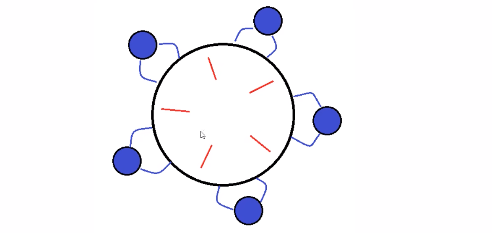

* 他们只做两件事，思考和吃饭，思考一会吃口饭，吃完饭后接着思考。
* 吃饭时要用两根筷子吃，桌上共有 5 根筷子，每位哲学家左右手边各有一根筷子。
* 如果筷子被身边的人拿着，自己就得等待


筷子类

```java
class Chopstick {
    String name;
    public Chopstick(String name) {
        this.name = name;
    }
    @Override
    public String toString() {
        return "筷子{" + name + '}';
    }
}
```

哲学家类

```java
class Philosopher extends Thread {
    Chopstick left;
    Chopstick right;

    public Philosopher(String name, Chopstick left, Chopstick right) {
        super(name);
        this.left = left;
        this.right = right;
    }

    private void eat() {
        log.debug("eating...");
        Sleeper.sleep(1);
    }

    @Override
    public void run() {
        while (true) {
            // 获得左手筷子
            synchronized (left) {
                // 获得右手筷子
                synchronized (right) {
                    // 吃饭
                    eat();
                }// 放下右手筷子
            }// 放下左手筷子
        }
    }
}
```

就餐

```java
Chopstick c1 = new Chopstick("1");
Chopstick c2 = new Chopstick("2");
Chopstick c3 = new Chopstick("3");
Chopstick c4 = new Chopstick("4");
Chopstick c5 = new Chopstick("5");
new Philosopher("苏格拉底", c1, c2).start();
new Philosopher("柏拉图", c2, c3).start();
new Philosopher("亚里士多德", c3, c4).start();
new Philosopher("赫拉克利特", c4, c5).start();
new Philosopher("阿基米德", c5, c1).start();
```

执行不多会，就执行不下去了

```
13:24:49 [亚里士多德] com.wjl.juc.j3.u15.Philosopher - eating...
13:24:49 [苏格拉底] com.wjl.juc.j3.u15.Philosopher - eating...
13:24:50 [柏拉图] com.wjl.juc.j3.u15.Philosopher - eating...
// 卡在这里, 不向下运行
```

使用 jconsole 检测死锁，发现

```java
-------------------------------------------------------------------------
名称: 阿基米德
状态: cn.itcast.Chopstick@1540e19d (筷子1) 上的BLOCKED, 拥有者: 苏格拉底
总阻止数: 2, 总等待数: 1
堆栈跟踪:
cn.itcast.Philosopher.run(TestDinner.java:48)
- 已锁定 cn.itcast.Chopstick@6d6f6e28 (筷子5)
-------------------------------------------------------------------------
名称: 苏格拉底
状态: cn.itcast.Chopstick@677327b6 (筷子2) 上的BLOCKED, 拥有者: 柏拉图
总阻止数: 2, 总等待数: 1
堆栈跟踪:
cn.itcast.Philosopher.run(TestDinner.java:48)
- 已锁定 cn.itcast.Chopstick@1540e19d (筷子1)
-------------------------------------------------------------------------
名称: 柏拉图
状态: cn.itcast.Chopstick@14ae5a5 (筷子3) 上的BLOCKED, 拥有者: 亚里士多德
总阻止数: 2, 总等待数: 0
堆栈跟踪:
cn.itcast.Philosopher.run(TestDinner.java:48)
- 已锁定 cn.itcast.Chopstick@677327b6 (筷子2)
-------------------------------------------------------------------------
名称: 亚里士多德
状态: cn.itcast.Chopstick@7f31245a (筷子4) 上的BLOCKED, 拥有者: 赫拉克利特
总阻止数: 1, 总等待数: 1
堆栈跟踪:
cn.itcast.Philosopher.run(TestDinner.java:48)
- 已锁定 cn.itcast.Chopstick@14ae5a5 (筷子3)
-------------------------------------------------------------------------
名称: 赫拉克利特
状态: cn.itcast.Chopstick@6d6f6e28 (筷子5) 上的BLOCKED, 拥有者: 阿基米德
总阻止数: 2, 总等待数: 0
堆栈跟踪:
cn.itcast.Philosopher.run(TestDinner.java:48)
- 已锁定 cn.itcast.Chopstick@7f31245a (筷子4)
```

这种线程没有按预期结束，执行不下去的情况，归类为【活跃性】问题，除了死锁以外

还有**活锁**和**饥饿者**两种情况


### 4. 活锁

活锁(广义锁 不止sync)出现在两个线程互相改变对方的结束条件，最后谁也无法结束，例如

```java
public class TestLiveLock {
    static volatile int count = 10;
    static final Object lock = new Object();
    public static void main(String[] args) {
        new Thread(() -> {
            // 期望减到 0 退出循环
            while (count > 0) {
                sleep(0.2);
                count--;
                log.debug("count: {}", count);
            }
        }, "t1").start();
        new Thread(() -> {
            // 期望超过 20 退出循环
            while (count < 20) {
                sleep(0.2);
                count++;
                log.debug("count: {}", count);
            }
        }, "t2").start();
    }
}
```


### 5. 饥饿

很多教程中把饥饿定义为，一个线程由于优先级太低，始终得不到 CPU 调度执行，也不能够结束，饥饿的情况不易演示，讲读写锁时会涉及饥饿问题

下面我讲一下我遇到的一个线程饥饿的例子，先来看看使用顺序加锁的方式解决之前的死锁问题

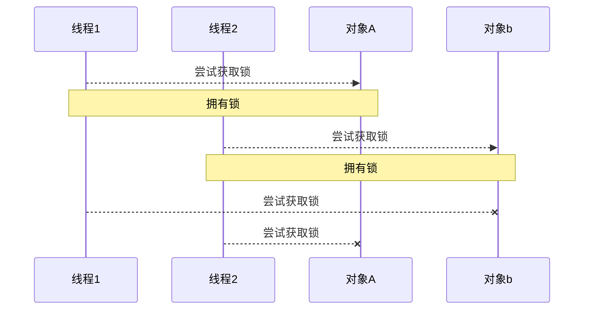
```mermaid
sequenceDiagram 
participant t1 as 线程1
participant t2 as 线程2
participant a as 对象A
participant b as 对象b
t1 -->> a: 尝试获取锁
note over t1,a: 拥有锁
t2 -->> b: 尝试获取锁
note over t2,b: 拥有锁
t1 --x b:尝试获取锁
t2 --x a:尝试获取锁
```


顺序加锁的解决方案

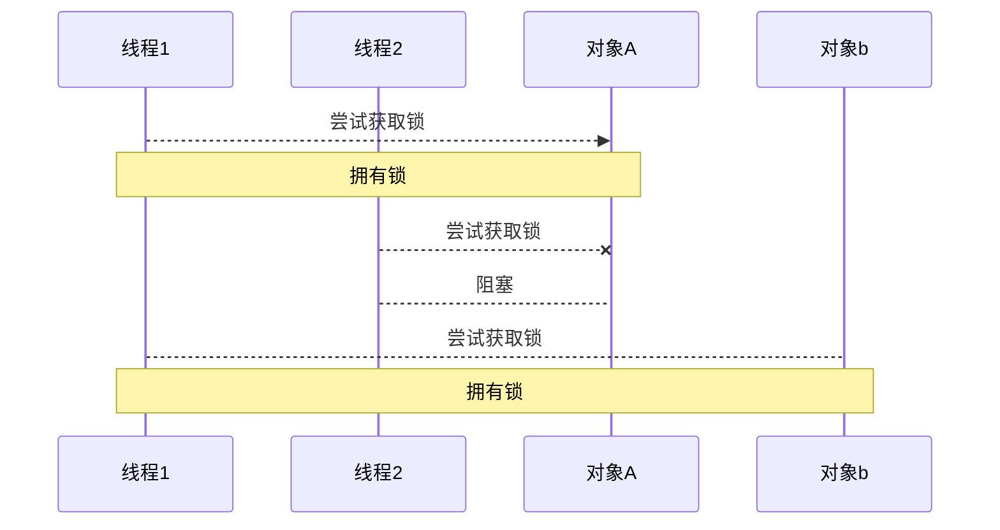
```mermaid
sequenceDiagram 
participant t1 as 线程1
participant t2 as 线程2
participant a as 对象A
participant b as 对象b

t1-->>a:尝试获取锁
note over t1,a:拥有锁
t2--x a:尝试获取锁
t2 --> a:阻塞
t1-->b: 尝试获取锁
note over t1,b:拥有锁
```

哲学家问题 调整

```java
Chopstick c1 = new Chopstick("1");
Chopstick c2 = new Chopstick("2");
Chopstick c3 = new Chopstick("3");
Chopstick c4 = new Chopstick("4");
Chopstick c5 = new Chopstick("5");
new Philosopher("苏格拉底", c1, c2).start();
new Philosopher("柏拉图", c2, c3).start();
new Philosopher("亚里士多德", c3, c4).start();
new Philosopher("赫拉克利特", c4, c5).start();
// 这样就不可能出现五个线程第一步(第一层synchronized)拿到5个不同的锁
// 很简单，第一轮争抢中，苏格或阿基由于抢不到筷子直接出局一个，剩下4个人抢5只筷子，所以不会锁死
// new Philosopher("阿基米德", c5, c1).start();
new Philosopher("阿基米德", c1, c5).start();
```


## 3.16 ReentrantLock


### 1. 概述

相对于 synchronized 它具备如下特点

* 可中断
* 可以设置超时时间
* 可以设置为公平锁
* 支持多个条件变量

与 synchronized 一样，都支持可重入


基本语法

```java
// 获取锁
reentrantLock.lock();
try {
	// 临界区
} finally {
    // 释放锁
	reentrantLock.unlock();
}
```

### 2. 可重入

可重入是指同一个线程如果首次获得了这把锁，那么因为它是这把锁的拥有者，因此有权利再次获取这把锁

如果是不可重入锁，那么第二次获得锁时，自己也会被锁挡住

```java
static final ReentrantLock LOCK = new ReentrantLock();

public static void main(String[] args) {
    m1();
}

static void m1() {
    LOCK.lock();
    try {
        log.debug("m1...");
        m2();
    } finally {
        LOCK.unlock();
    }
}

static void m2() {
    LOCK.lock();
    try {
        log.debug("running...");
    } finally {
        LOCK.unlock();
    }
}
```

输出

```
14:26:29 [main] com.wjl.juc.j3.u16.ReentrantLockTest - m1...
14:26:29 [main] com.wjl.juc.j3.u16.ReentrantLockTest - running...
```


### 3. 可打断

```java
final static ReentrantLock LOCK = new ReentrantLock();
public static void main(String[] args) throws InterruptedException {
    Thread t1 = new Thread(() -> {
        try {
            // 如果没有竞争那么此方法就会获取lock对象锁
            // 有的话就会进入阻塞队列 可以被其他线程使用 interruput 打断
            // "打断获取锁的过程" 获取锁，除非当前线程被中断
            log.debug("尝试获取锁...");
            LOCK.lockInterruptibly(); // 可打断的锁

        } catch (InterruptedException e) {
            e.printStackTrace();
            log.debug("没有获取到锁...");
            return;
        }
        try {
            log.debug("获取到锁...");
        } finally {
            LOCK.unlock();
        }
    }, "t1");
    LOCK.lock();
    t1.start();

    sleep(1);
    t1.interrupt();

    LOCK.unlock();
}
```

```java
14:52:14 [t1] com.wjl.juc.j3.u16.Test2 - 尝试获取锁...
java.lang.InterruptedException
	at java.util.concurrent.locks.AbstractQueuedSynchronizer.doAcquireInterruptibly(AbstractQueuedSynchronizer.java:898)
	at java.util.concurrent.locks.AbstractQueuedSynchronizer.acquireInterruptibly(AbstractQueuedSynchronizer.java:1222)
	at java.util.concurrent.locks.ReentrantLock.lockInterruptibly(ReentrantLock.java:335)
	at com.wjl.juc.j3.u16.Test2.lambda$main$0(Test2.java:25)
	at java.lang.Thread.run(Thread.java:750)
14:52:15 [t1] com.wjl.juc.j3.u16.Test2 - 没有获取到锁...
```

注意如果是不可中断模式(LOCK.lock())，那么即使使用了 interrupt 也不会让等待中断


### 4. 锁超时


立刻失败

```java
Thread t1 = new Thread(() -> {
    log.debug("启动");
    if (!lock.tryLock()) {
        log.debug("获取锁失败");
        return;
    }
    try {
        log.debug("获得了锁");
    } finally {
        lock.unlock();
    }
}, "t1");

lock.lock();
log.debug("获得了锁");
t1.start();
try {
    sleep(1);
} finally {
    lock.unlock();
}
```

输出

```
15:06:18 [main] com.wjl.juc.j3.u16.Test3 - 获得了锁
15:06:18 [t1] com.wjl.juc.j3.u16.Test3 - 启动
15:06:18 [t1] com.wjl.juc.j3.u16.Test3 - 获取锁失败
```


超时失败

```java
Thread t1 = new Thread(() -> {
    log.debug("启动");
    try {
        if (!lock.tryLock(1L, TimeUnit.SECONDS)) {
            log.debug("获取等待 1s后失败");
            return;
        }
    } catch (InterruptedException e) {
       e.printStackTrace();

    }
    try {
        log.debug("获得了锁");
    } finally {
        lock.unlock();
    }
}, "t1");

lock.lock();
log.debug("获得了锁");
t1.start();
try {
    sleep(2);
} finally {
    lock.unlock();
}
```

输出

```
15:08:51 [main] com.wjl.juc.j3.u16.Test3 - 获得了锁
15:08:51 [t1] com.wjl.juc.j3.u16.Test3 - 启动
15:08:52 [t1] com.wjl.juc.j3.u16.Test3 - 获取等待 1s后失败 
```

使用`tryLock()`解决哲学家问题

```java
@Slf4j
public class TestPhilosopher {
    public static void main(String[] args) {
        Chopstick c1 = new Chopstick("1");
        Chopstick c2 = new Chopstick("2");
        Chopstick c3 = new Chopstick("3");
        Chopstick c4 = new Chopstick("4");
        Chopstick c5 = new Chopstick("5");
        new Philosopher("苏格拉底", c1, c2).start();
        new Philosopher("柏拉图", c2, c3).start();
        new Philosopher("亚里士多德", c3, c4).start();
        new Philosopher("赫拉克利特", c4, c5).start();
        new Philosopher("阿基米德", c1, c5).start();
    }
}

@Slf4j
class Chopstick extends ReentrantLock {
    String name;
    public Chopstick(String name) {
        this.name = name;
    }
    @Override
    public String toString() {
        return "筷子{" + name + '}';
    }
}
@Slf4j
class Philosopher extends Thread {
   Chopstick left;
    Chopstick right;

    public Philosopher(String name, Chopstick left, Chopstick right) {
        super(name);
        this.left = left;
        this.right = right;
    }

    private void eat() {
        log.debug("eating...");
        Sleeper.sleep(1);
    }

    @Override
    public void run() {
        while (true) { // 这样写代码 会使拿不到第一个锁或者第二个锁就 放弃eat
            // 而synchronized拿到一个对象锁拿不到第二个 无法放弃
            // 获得左手筷子
            if (left.tryLock()) {
                try{
                    // 获得右手筷子
                    if (right.tryLock()) {
                        try {
                            eat();
                        }finally {
                            // 放下右手筷子
                            right.unlock();
                        }
                    }
                }finally {
                    // 放下左手筷子
                    left.unlock();
                }
            }
        }
    }
}
```


### 5. 公平锁

ReentrantLock 默认是不公平的

```java
final static ReentrantLock lock = new ReentrantLock(false);

public static void main(String[] args) throws InterruptedException {
    lock.lock();
    for (int i = 0; i < 500; i++) {
        new Thread(() -> {
            lock.lock();
            try {
                log.debug(Thread.currentThread().getName() + " running...");
            } finally {
                lock.unlock();
            }
        }, "t" + i).start();
    }
    // 1s 之后去争抢锁
    Thread.sleep(1000);
    new Thread(() -> {
        log.debug(Thread.currentThread().getName() + " start...");
        lock.lock();
        try {
            log.debug(Thread.currentThread().getName() + " running...");
        } finally {
            lock.unlock();
        }
    }, "强行插入").start();
    lock.unlock();
}
```

强行插入，有机会在中间输出

> **注意**：该实验不一定总能复现

```
t39 running...
t40 running...
t41 running...
t42 running...
t43 running...
强行插入 start...
强行插入 running...
t44 running...
t45 running...
t46 running...
t47 running...
t49 running...
```

改为公平锁后

```java
ReentrantLock lock = new ReentrantLock(true);
```

```
t465 running...
t464 running...
t477 running...
t442 running...
t468 running...
t493 running...
t482 running...
t485 running...
t481 running...
强行插入 running...
```

公平锁**一般没有必要，会降低并发度**，后面分析原理时会讲解


### 6. 条件变量

synchronized 中也有条件变量，就是我们讲原理时那个 waitSet 休息室，当条件不满足时进入 waitSet 等待

ReentrantLock 的条件变量比 synchronized 强大之处在于，它是支持多个条件变量的，这就好比

* synchronized 是那些不满足条件的线程都在一间休息室等消息
* 而 ReentrantLock 支持多间休息室，有专门等烟的休息室、专门等早餐的休息室、唤醒时也是按休息室来唤醒


使用要点：

* await 前需要获得锁
* await 执行后，会释放锁，进入 conditionObject 等待
* await 的线程被唤醒（或打断、或超时）取重新竞争 lock 锁
* 竞争 lock 锁成功后，从 await 后继续执行

例子

```java
@Slf4j(topic = "c.TestLockCondition")
public class TestLockCondition {
    final static ReentrantLock lock = new ReentrantLock();
    final static Condition waitCigaretteQueue = lock.newCondition();
    final static Condition waitBreakfastQueue = lock.newCondition();
    
    static volatile boolean hasCigrette = false;
    static volatile boolean hasBreakfast = false;

    public static void main(String[] args){
        Thread.currentThread().setName("外卖员");
        new Thread(() -> {
            try {
                lock.lock();
                while (!hasCigrette) {
                    try {
                        waitCigaretteQueue.await();
                    } catch (InterruptedException e) {
                        e.printStackTrace();
                    }
                }
                log.debug("等到了它的烟");
            } finally {
                lock.unlock();
            }
        },"小南").start();
        new Thread(() -> {
            try {
                lock.lock();
                while (!hasBreakfast) {
                    try {
                        waitBreakfastQueue.await();
                    } catch (InterruptedException e) {
                        e.printStackTrace();
                    }
                }
                log.debug("等到了它的早餐");
            } finally {
                lock.unlock();
            }
        },"小女").start();
        sleep(1);
        sendBreakfast();
        sleep(1);
        sendCigarette();
    }

    private static void sendCigarette() {
        lock.lock();
        try {
            log.debug("送烟来了");
            hasCigrette = true;
            waitCigaretteQueue.signal();
        } finally {
            lock.unlock();
        }
    }

    private static void sendBreakfast() {
        lock.lock();
        try {
            log.debug("送早餐来了");
            hasBreakfast = true;
            waitBreakfastQueue.signal();
        } finally {
            lock.unlock();
        }
    }
}
```

输出

```java
21:33:41 [外卖员] c.TestLockCondition - 送早餐来了
21:33:41 [小女] c.TestLockCondition - 等到了它的早餐
21:33:42 [外卖员] c.TestLockCondition - 送烟来了
21:33:42 [小南] c.TestLockCondition - 等到了它的烟
```


## 3.17 本章小结

章我们需要重点掌握的是

* 分析多线程访问共享资源时，哪些代码片段属于临界区
* 使用 synchronized 互斥解决临界区的线程安全问题
  * 掌握 synchronized 锁对象语法
  * 掌握 synchronzied 加载成员方法和静态方法语法
  * 掌握 wait/notify 同步方法
* 使用 lock 互斥解决临界区的线程安全问题
  * 掌握 lock 的使用细节：可打断、锁超时、公平锁、条件变量
* 学会分析变量的线程安全性、掌握常见线程安全类的使用
* 了解线程活跃性问题：死锁、活锁、饥饿
* 应用方面
  * 互斥：使用 synchronized 或 Lock 达到共享资源互斥效果
  * 同步：使用 wait/notify 或 Lock 的条件变量来达到线程间通信效果
* 原理方面
  * monitor、synchronized 、wait/notify 原理
  * synchronized 进阶原理
  * park & unpark 原理
* 模式方面
  * 同步模式之保护性暂停
  * 异步模式之生产者消费者
  * 同步模式之顺序控制


# 4. 共享模型之内存-JMM

 Monitor 主要关注的是访问共享变量时，保证临界区代码的原子性

这一章我们进一步深入学习共享变量在多线程间的【可见性】问题与多条指令执行时的【有序性】问题


## 4.1 Java内存模型

JMM 即 **Java Memory Model**，它定义了主存（线程共享的）、工作内存（线程私有的  ）抽象概念，底层对应着 CPU 寄存器、缓存、硬件内存、CPU 指令优化等。

JMM 体现在以下几个方面

* 原子性 - 保证指令不会受到线程上下文切换的影响
* 可见性 - 保证指令不会受 cpu 缓存的影响
* 有序性 - 保证指令不会受 cpu 指令并行优化的影响


## 4.2 可见性


### 1. 退不出的循环

#### 代码

先来看一个现象，main 线程对 run 变量的修改对于 t 线程不可见，导致了 t 线程无法停止：

```java
static boolean run = true;

public static void main(String[] args) {
    new Thread(() -> {
        while (true) {
            if (!run) {
                log.debug("退出循环...{}", run);
                break;
            }
        }
    }, "t1").start();

    sleep(2);
    run = false; // 线程t不会如预想的停下来
}
```


#### 分析

为什么呢？分析一下：

1.  初始状态， t 线程刚开始从主内存读取了 run 的值到工作内存。

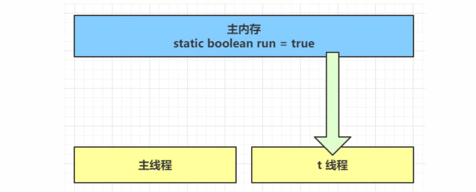

2. 因为 t 线程要频繁从主内存中读取 run 的值，**JIT 编译器**会将 run 的值缓存至自己工作内存中的高速缓存中，减少对主存中 run 的访问，提高效率
   1. 在修改为true的时间前`while`已经运行几十万次，期间也频繁的访问物理内存，jit为了提高效率就将代码固化，不再去访问内存

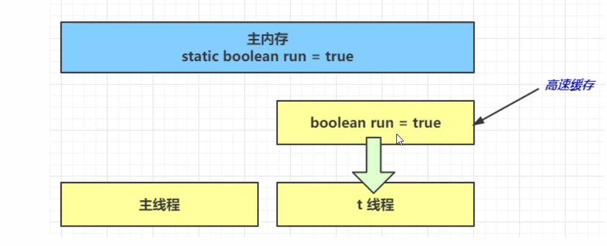

3. `1 秒`之后，main 线程修改了 run 的值，并同步至主存，而 t 是从自己工作内存中的高速缓存中读取这个变量的值，结果永远是旧值

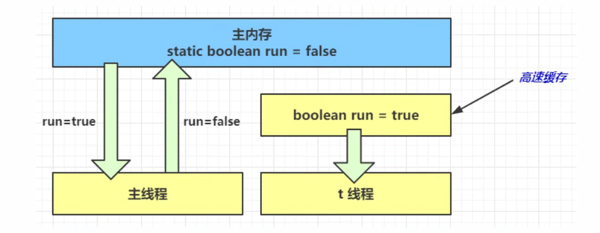


#### 证明JIT

```java
-Xint // JVM 参数 禁用JIT优化
```

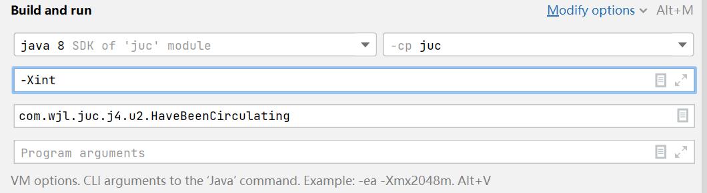

添加这个参数之后正常退出循环结束


### 2. 解决

volatile（易变关键字）

它可以用来修饰成员变量和静态成员变量，他可以避免线程从自己的工作缓存中查找变量的值，必须到主存中获取它的值，线程操作 volatile 变量都是直接操作主存

```java
volatile static boolean run = true;
```

或者

```java
static Object lock = new Object();
// ...
while (true) {
    synchronized(lock){
        if (!run) {
            log.debug("退出循环...{}", run);
            break;
        }
    }
}
```

### 3. 可见性VS原子性

前面例子体现的实际就是可见性，它保证的是在多个线程之间，**一个线程对 volatile 变量的修改对另一个线程可见， 不能保证原子性，仅用在一个写线程，多个读线程的情况**： 

上例从字节码理解是这样的：

```
getstatic     run   // 线程 t 获取 run true
getstatic     run   // 线程 t 获取 run true
getstatic     run   // 线程 t 获取 run true
getstatic     run   // 线程 t 获取 run true
putstatic     run   // 线程 main 修改 run 为 false， 仅此一次
getstatic     run   // 线程 t 获取 run false
```

比较一下之前我们将线程安全时举的例子：两个线程一个 i++ 一个 i-- ，只能保证看到最新值，不能解决指令交错

```java
// 假设i的初始值为0
getstatic 	i 	// 线程2-获取静态变量i的值 线程内i=0
    
getstatic 	i 	// 线程1-获取静态变量i的值 线程内i=0
iconst_1 		// 线程1-准备常量1
iadd 			// 线程1-自增 线程内i=1
putstatic 	i 	// 线程1-将修改后的值存入静态变量i 静态变量i=1
    
iconst_1 		// 线程2-准备常量1
isub 			// 线程2-自减 线程内i=-1
putstatic 	i 	// 线程2-将修改后的值存入静态变量i 静态变量i=-1
```


> **注意** 
>
> **`synchronized `语句块既可以保证代码块的原子性，也同时保证代码块内变量的可见性**。但缺点是**`synchronized` 是属于重量级操作，性能相对更低**
>
> 如果在前面示例的死循环中加入 `System.out.println()` 会发现即使不加 volatile 修饰符，线程 t 也能正确看到对 run 变量的修改了，想一想为什么？
>
> ```java
> public void println(String x) {
>     synchronized (this) {
>         print(x);
>         newLine();
>     }
> }
> 
> synchronized(this){-->monitorenter
>     //load内存屏障
>     int a = b;//读，通过load内存屏障，强制执行refresh，保证读到最新的
>     c=1;//写，释放锁时会通过Store，强制flush到高速缓存或主内存
> }-->monitorexit
> // Store内存屏障
> ```
>
> * println中的synchronized起作用了。破坏了JIT优化，防止从高速缓存中获取值，强制读取主存中的值
>
> * 被synchornized修饰的代码每次执行前都会从主内存重新获取最新的值，释放锁的时候也会把本地修改了的变量刷回主内存
>
> * volatile是**通过内存屏障来保证可见性的**，**Load屏障**保证volatile变量每次读取数据的时候**都强制从主内存读取**；**Store屏障**每次volatile**修改之后强制将数据刷新会主内存**。
>
> * sychronized底层是**通过monitorenter的指令来进行加锁的、通过monitorexit指令来释放锁的**。
>
> * > monitorenter指令其实还具有Load屏障的作用。
>   >
>   > 也就是通过monitorenter指令之后，synchronized内部的共享变量，每次读取数据的时候被强制从主内存读取最新的数据。
>   >
>   > 同样的道理monitorexit指令也具有Store屏障的作用，也就是让synchronized代码块内的共享变量，如果数据有变更的，强制刷新回主内存。
>   >
>   > 这样通过这种方式，数据修改之后立即刷新回主内存，其他线程进入synchronized代码块后，使用共享变量的时候强制读取主内存的数据，上一个线程对共享变量的变更操作，它就能立即看到了。
>   >
>   > ————————————————
>   > 版权声明：本文为CSDN博主「码农小陈的学习笔记」的原创文章，遵循CC 4.0 BY-SA版权协议，转载请附上原文出处链接及本声明。
>   > 原文链接：https://blog.csdn.net/chenzengnian123/article/details/122686371


### 4 volatile可见性应用例子

```java
@Slf4j(topic = "c.MonitorService")
public class MonitorService {
    // 停止标记用 volatile 是为了保证该变量在多个线程之间的可见性
    // 我们的例子中，即主线程把它修改为 true 对 t1 线程可见
    private Thread thread;
    private volatile boolean stop = false;
    private volatile boolean starting = false;

    public void start(String name, Runnable task) {
        // 既使用了读，也使用了写， 所以要用synchronized保证原子性
        // 不是用lock更好.是Volatile在这里没用.一写多读场景才使用.这里有多写要保证原子性
        synchronized (this) {
            // 不加锁只使用v的话，第一个线程发现没有创建，更改为true,
            // 但是第二个线程进来的时候线程1对starting的变量还没有写回去，所以保证可见性适用于此，要保证原子性
            if (starting) {
                return;
            }
            starting = true;
        }
        // 这里的读写原子性是针对于starting变量的，所以启动代码可以在代码块之外 节省性能
        thread = new Thread(() -> {
            while (true) {
                // 判断当前线程是否被打断
                if (stop) {
                    log.info("料理后事...");
                    starting = false; //[这块代码]只能被启动的线程修改，要对其他线程可见 volatile修饰保证可见性 不需要原子性
                    stop = false;
                    break;
                }
                try {
                    Thread.sleep(1000);
                    task.run();
                } catch (InterruptedException e) {
                }
            }
        }, name);
        thread.start();
    }

    public void stop() {
        if (starting) {// 防止空指针 并且是读操作，不需要保证原子性
            synchronized(this){
                if (thread != null) {
                    stop = true;
                    thread.interrupt(); // 防止睡眠延迟停止
                    log.debug("停止监控线程...");
            	}
            }
        }
    }

    public static void main(String[] args) {
        TPTInterruptVolatile aVolatile = new TPTInterruptVolatile();
        new Thread(aVolatile::stop,"t2").start();
        sleep(0.5);
        aVolatile.start("t1", () -> {
            log.debug("执行监控...");
        });
        sleep(3);
        aVolatile.stop();
    }
}
```


## 4.3 有序性


### 1. 思考

JVM 会在不影响正确性的前提下，可以调整语句的执行顺序，思考下面一段代码

```java
static int i;
static int j;

// 在某个线程内执行如下赋值操作
i = ...;
j = ...;
```

可以看到，至于是先执行 i 还是 先执行 j ，对最终的结果不会产生影响。所以，上面代码真正执行时，既可以是

```java
i = ...;
j = ...;
```

也可以是

```java
j = ...;
i = ...;
```

这种特性称之为『指令重排』，多线程下『指令重排』会影响正确性。为什么要有重排指令这项优化呢？从 CPU执行指令的原理来理解一下吧 --> ·指令级并行原理·


### 2. 诡异的结果

```java
int num = 0;
boolean ready = false;

// 线程1 执行此方法
public void actor1(I_Result r) {
    if(ready) {
        r.r1 = num + num;
    } else {
    	r.r1 = 1;
	}
}

// 线程2 执行此方法
public void actor2(I_Result r) {
    num = 2;
    ready = true;
}
```

I_Result 是一个对象，有一个属性 r1 用来保存结果，问，可能的结果有几种？

有同学这么分析

* 情况1：线程1 先执行，这时 ready = false，所以进入 else 分支结果为 1
* 情况2：线程2 先执行 num = 2，但没来得及执行 ready = true，线程1 执行，还是进入 else 分支，结果为1
* 情况3：线程2 执行到 ready = true，线程1 执行，这回进入 if 分支，结果为 4（因为 num 已经执行过了）

但我告诉你，结果还有可能是 0 😁😁😁，信不信吧！

这种情况下是：线程2 执行 ready = true，切换到线程1，进入 if 分支，相加为 0，再切回线程2 执行 num = 2

相信很多人已经晕了 😵😵😵

```java
num = 2;
ready = true;
```

被重新排序

```java
ready = true;
num = 2;
```

这种现象叫做指令重排，是 JIT 编译器在运行时的一些优化，这个现象需要通过大量测试才能复现：

借助 java 并发压测工具 jcstress https://wiki.openjdk.java.net/display/CodeTools/jcstress

```java
mvn archetype:generate -DinteractiveMode=false -DarchetypeGroupId=org.openjdk.jcstress -DarchetypeArtifactId=jcstress-java-test-archetype -DarchetypeVersion=0.5 -DgroupId=com.wjl -DartifactId=wjl_jcstress -Dversion=1.0
```

创建 maven 项目，提供如下测试类

```java
@JCStressTest
@Outcome(id = {"1", "4"}, expect = Expect.ACCEPTABLE, desc = "ok")
@Outcome(id = "0", expect = Expect.ACCEPTABLE_INTERESTING, desc = "!!!!")
@State
public class ConcurrencyTest {
    int num = 0;
    boolean ready = false;
    
    @Actor
    public void actor1(I_Result r) {
        if(ready) {
        	r.r1 = num + num;
        } else {
        	r.r1 = 1;
        }
    }
    
    @Actor
    public void actor2(I_Result r) {
        num = 2;
        ready = true;
    }
}
```

执行

```sh
mvn clean install
java -jar target/jcstress.jar
```

会输出我们感兴趣的结果，摘录其中一次结果：

```
*** INTERESTING tests
  Some interesting behaviors observed. This is for the plain curiosity.

  2 matching test results.
      [OK] com.wjl.ConcurrencyTest
    (JVM args: [-XX:-TieredCompilation])
  Observed state   Occurrences              Expectation  Interpretation
               0        22,621   ACCEPTABLE_INTERESTING  !!!!
               1   222,277,534               ACCEPTABLE  ok
               4    71,219,146               ACCEPTABLE  ok

      [OK] com.wjl.ConcurrencyTest
    (JVM args: [])
  Observed state   Occurrences              Expectation  Interpretation
               0        36,834   ACCEPTABLE_INTERESTING  !!!!
               1   172,131,128               ACCEPTABLE  ok
               4    93,143,449               ACCEPTABLE  ok
```

可以看到，出现结果为 0 的情况有 36,834次，虽然次数相对很少，但毕竟是出现了。


### 3. 解决的方法

`volatile` 修饰的变量，可以禁用指令重排

```java
@JCStressTest
@Outcome(id = {"1", "4"}, expect = Expect.ACCEPTABLE, desc = "ok")
@Outcome(id = "0", expect = Expect.ACCEPTABLE_INTERESTING, desc = "!!!!")
@State
public class ConcurrencyTest {
    int num = 0;
    volatile  boolean ready = false;
    
    @Actor
    public void actor1(I_Result r) {
        if(ready) {
        	r.r1 = num + num;
        } else {
        	r.r1 = 1;
        }
    }
    
    @Actor
    public void actor2(I_Result r) {
        num = 2;
        ready = true;
    }
}
```


结果为：

```
*** INTERESTING tests
  Some interesting behaviors observed. This is for the plain curiosity.

  0 matching test results.
```


## <font color="blue">4.4 * volatile 原理</font>

volatile 的底层实现原理是内存屏障，Memory Barrier（Memory Fence）

* 对 volatile 变量的写指令后会加入写屏障
* 对 volatile 变量的读指令前会加入读屏障


* 起因：由于**编译器优化、或缓存优化、或 CPU 指令重排序优化**导致指令的实际执行顺序与编写顺序不一致
* 解决：用 volatile 修饰共享变量会在读、写共享变量时加入不同的屏障，阻止其他读写操作越过屏障，从而达到阻止重排序的效果
* 注意：
  * **volatile 变量写**加的屏障是阻止上方其它**写操作**越过屏障排到 **volatile 变量写**之下
  * **volatile 变量读**加的屏障是阻止下方其它**读操作**越过屏障排到 **volatile 变量读**之上
  * 要写你先写，要读我先读
  * **volatile 读写加入的屏障只能防止同一线程内的指令重排**

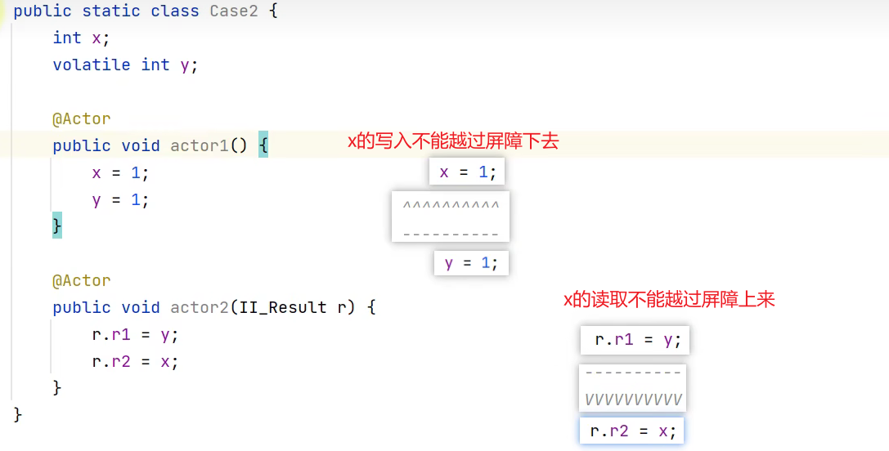


### 1. 如何保证可见性

* 写屏障（sfence）保证在该**屏障之前的，对共享变量的改动，都同步到主存当中**

* ```java
  public void actor2(I_Result r) {
      num = 2;
      ready = true; // ready 是 volatile 赋值带写屏障
      // 写屏障
  }
  ```

* 而读屏障（lfence）保证在该**屏障之后，对共享变量的读取，加载的是主存中最新数据**

* ```java
  public void actor1(I_Result r) {
      // 读屏障
      // ready 是 volatile 读取值带读屏障
      if(ready) {
      	r.r1 = num + num;
      } else {
      	r.r1 = 1;
      }
  }
  ```

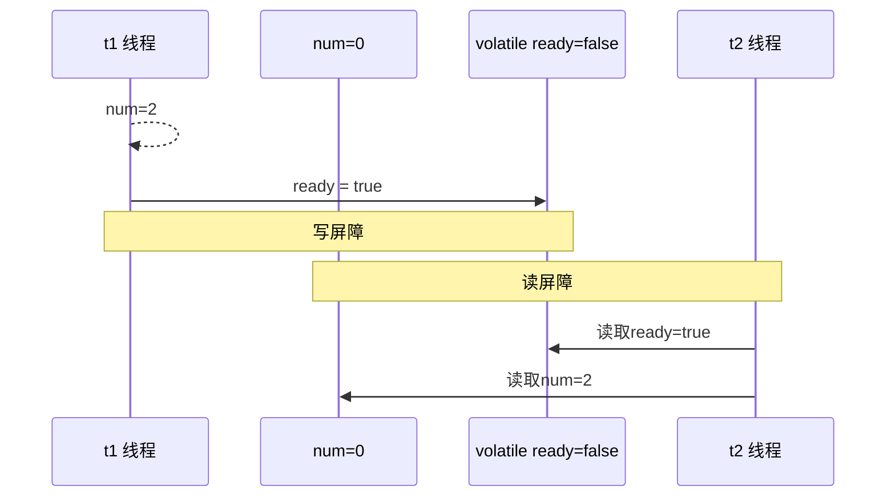
```mermaid
sequenceDiagram 
participant t1 as t1 线程
participant n as num=0
participant v as volatile ready=false
participant t2 as t2 线程

t1-->>t1: num=2
t1->>v: ready = true
note over t1,v:写屏障
note over n,t2:读屏障
t2->>v:读取ready=true
t2->>n:读取num=2

```


### 2. 如何保证有序性

* 写屏障会确保指令重排序时，**不会将写屏障之前的(写操作)代码排在写屏障之后**

* ```java
  public void actor2(I_Result r) {
      num = 2;
      ready = true; // ready 是 volatile 赋值带写屏障
      // 写屏障
  }
  ```

* 读屏障会确保指令重排序时，**不会将读屏障之后的(读操作)代码排在读屏障之前**

* ```java
  public void actor1(I_Result r) {
      // 读屏障
      // ready 是 volatile 读取值带读屏障
      if(ready) {
      	r.r1 = num + num;
      } else {
      	r.r1 = 1;
      }
  }
  ```


```mermaid
sequenceDiagram 
participant t1 as t1 线程
participant n as num=0
participant v as volatile ready=false
participant t2 as t2 线程

t1-->>t1: num=2
t1->>v: ready = true
note over t1,v:写屏障
note over n,t2:读屏障
t2->>v:读取ready=true
t2->>n:读取num=2
```


还是那句话，不能解决指令交错：

* 写屏障仅仅是保证之后的读能够读到最新的结果，但不能保证读跑到它前面去
* 而**有序性的保证也只是保证了本线程内相关代码不被重排序**

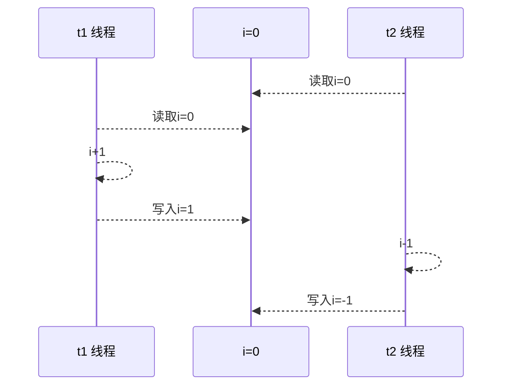
```mermaid
sequenceDiagram 
participant t1 as t1 线程
participant i as i=0
participant t2 as t2 线程
t2-->>i:读取i=0
t1-->>i:读取i=0
t1-->>t1:i+1
t1-->>i:写入i=1
t2-->>t2:i-1
t2-->>i:写入i=-1

```


### 3. double-checked locking 问题

以著名的 double-checked locking 单例模式为例

```java
public final class Singleton {
    private Singleton() {}
    private static Singleton INSTANCE = null;
    public static Singleton getInstance() {
        if(INSTANCE == null) { // t2
		   // 首次访问会同步，而之后的使用没有 synchronized
            synchronized(Singleton.class) {
                if (INSTANCE == null) { // t1
                    INSTANCE = new Singleton();
                }
            }
        }
        return INSTANCE;
    }
}
```

以上的实现特点是：

* 懒惰实例化

* 首次使用 getInstance() 才使用 synchronized 加锁，后续使用时无需加锁

* 有隐含的，但很关键的一点：**第一个 if 使用了 INSTANCE 变量，是在同步块之外**

  * **synchronized代码块内的指令仍然是可以被重排序的**，如果共享变量[完全]被synchronized保护，是不会有，原子，可见，有序性问题的

  * > 重排序只会在多线程出错，同步块内是强制单线程执行，所以不会有影响
    >
    > 有序性是指满足单线程as-if-series语义

  * 此例子中`if(INSTANCE == null) {`并不是在sync块内的，并不能阻止其他线程运行这一段

  * > synchronized和volatile都具有有序性，Java允许编译器和处理器对指令进行重排，但是**指令重排并不会影响单线程的顺序**，它影响的是多线程并发执行的顺序性。**synchronized保证了每个时刻都只有一个线程访问同步代码块，也就确定了线程执行同步代码块是分先后顺序的，保证了有序性**。

  * 也就是说，**`synchronized`可以保证有序性，但是无法阻止重排序**

  * ```java
    synchronized(this){-->monitorenter
        // load内存屏障
        // Acquire屏障，禁止代码块内部的读，和外面的读写发生指令重排
        
        int a = b;//读，通过load内存屏障，强制执行refresh，保证读到最新的
        c=1;//写，释放锁时会通过Store，强制flush到高速缓存或主内存
        
        // Release屏障，禁止写，和外面的读写发生指令重排
    }-->monitorexit
    // Store内存屏障
    ```

    

但在多线程环境下，上面的代码是有问题的，getInstance 方法对应的字节码为：

```
 0: getstatic     #2                  // Field INSTANCE:Lcom/wjl/juc/j4/u4/Singleton;
 3: ifnonnull     37
 6: ldc           #3                  // class com/wjl/juc/j4/u4/Singleton
 8: dup
 9: astore_0
10: monitorenter
11: getstatic     #2                  // Field INSTANCE:Lcom/wjl/juc/j4/u4/Singleton;
14: ifnonnull     27
17: new           #3                  // class com/wjl/juc/j4/u4/Singleton
20: dup
21: invokespecial #4                  // Method "<init>":()V
24: putstatic     #2                  // Field INSTANCE:Lcom/wjl/juc/j4/u4/Singleton;
27: aload_0
28: monitorexit
29: goto          37
32: astore_1
33: aload_0
34: monitorexit
35: aload_1
36: athrow
37: getstatic     #2                  // Field INSTANCE:Lcom/wjl/juc/j4/u4/Singleton;
40: areturn
```

其中

* 17 表示创建对象，将对象引用入栈 // new Singleton
* 20 表示复制一份对象引用 // 引用地址
* 21 表示利用一个对象引用，调用构造方法
* 24 表示利用一个对象引用，赋值给 static INSTANCE
* 也就是说正常先构造再赋值，可能会出现先赋值再构造，因为字节码这个操作不是原子的

也许 jvm 会优化为：先执行 24，再执行 21。如果两个线程 t1，t2 按如下时间序列执行：

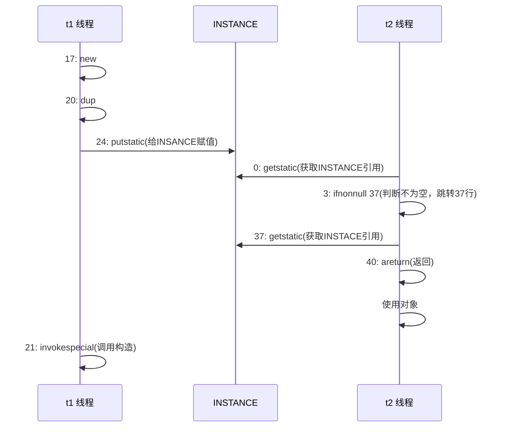
```mermaid
sequenceDiagram 
participant t1 as t1 线程
participant i as INSTANCE
participant t2 as t2 线程

t1->>t1:17: new
t1->>t1:20: dup
t1->>i:24: putstatic(给INSANCE赋值)
t2->>i:0: getstatic(获取INSTANCE引用)
t2->>t2:3: ifnonnull 37(判断不为空，跳转37行)
t2->>i:37: getstatic(获取INSTACE引用)
t2->>t2:40: areturn(返回)
t2->>t2:使用对象
t1->>t1:21: invokespecial(调用构造)
```


**关键在于 0: getstatic 这行代码在 monitor 控制之外( if(INSTANT!=null ))**，它就像之前举例中不守规则的人，可以越过 monitor 读取INSTANCE 变量的值

这时 t1 还未完全将构造方法执行完毕，如果在构造方法中要执行很多初始化操作，那么 t2 拿到的是将是一个未初始化完毕的单例

对 INSTANCE 使用 volatile 修饰即可，可以禁用指令重排，但要注意在 JDK 5 以上的版本的 volatile 才会真正有效

### 4.double-checked locking 解决

```java
public final class Singleton {
    private Singleton() { }
    
    private static volatile Singleton INSTANCE = null;
    
    public static Singleton getInstance() {
        // 实例没创建，才会进入内部的 synchronized代码块
        if (INSTANCE == null) {
            synchronized (Singleton.class) { // t2
                // 也许有其它线程已经创建实例，所以再判断一次
                if (INSTANCE == null) { // t1
                	INSTANCE = new Singleton();
                }
            }
        }
        return INSTANCE;
    }
}
```

字节码上看不出来 volatile 指令的效果 要读我先读，要写你先写

```
// -------------------------------------> 加入对 INSTANCE 变量的读屏障 
 0: getstatic     #2                  // Field INSTANCE:Lcom/wjl/juc/j4/u4/Singleton;
 3: ifnonnull     37
 6: ldc           #3                  // class com/wjl/juc/j4/u4/Singleton
 8: dup
 9: astore_0
10: monitorenter -----------------------> 保证原子性、可见性
11: getstatic     #2                  // Field INSTANCE:Lcom/wjl/juc/j4/u4/Singleton;
14: ifnonnull     27
17: new           #3                  // class com/wjl/juc/j4/u4/Singleton
20: dup
21: invokespecial #4                  // Method "<init>":()V
24: putstatic     #2                  // Field INSTANCE:Lcom/wjl/juc/j4/u4/Singleton;
// -------------------------------------> 加入对 INSTANCE 变量的写屏障
27: aload_0
28: monitorexit ------------------------> 保证原子性、可见性
29: goto          37
32: astore_1
33: aload_0
34: monitorexit
35: aload_1
36: athrow
37: getstatic     #2                  // Field INSTANCE:Lcom/wjl/juc/j4/u4/Singleton;
40: areturn
```

如上面的注释内容所示，读写 volatile 变量时会加入内存屏障（Memory Barrier（Memory Fence）），保证下面两点：

* 可见性
  * 写屏障（sfence）保证在该屏障之前的 t1 对共享变量的改动，都同步到主存当中
  * 而读屏障（lfence）保证在该屏障之后 t2 对共享变量的读取，加载的是主存中最新数据
* 有序性
  * 写屏障会确保指令重排序时，不会将写屏障之前的代码排在写屏障之后
  * 读屏障会确保指令重排序时，不会将读屏障之后的代码排在读屏障之前
* 更底层是读写变量时使用 lock 指令来多核 CPU 之间的可见性与有序性

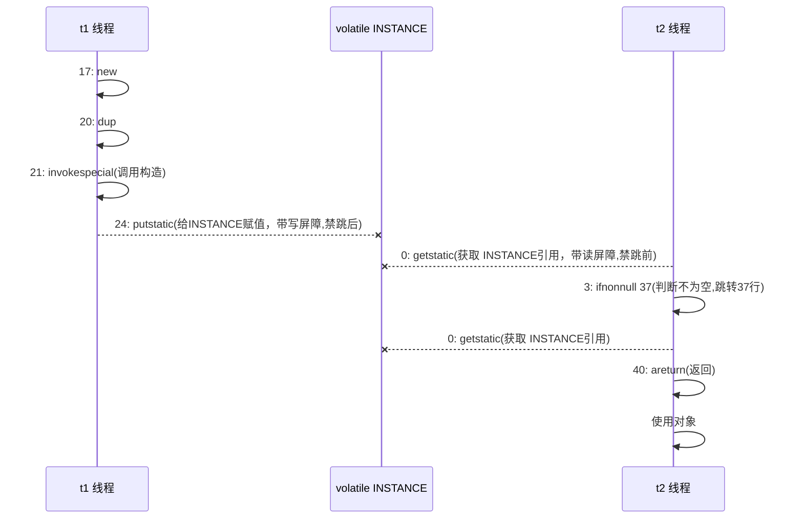
```mermaid
sequenceDiagram 
participant t1 as t1 线程
participant i as volatile INSTANCE
participant t2 as t2 线程

t1->>t1:17: new
t1->>t1:20: dup
t1->>t1:21: invokespecial(调用构造)
t1--x i: 24: putstatic(给INSTANCE赋值，带写屏障,禁跳后)
t2--x i: 0: getstatic(获取 INSTANCE引用，带读屏障,禁跳前)
t2->>t2: 3: ifnonnull 37(判断不为空,跳转37行)
t2--x i: 0: getstatic(获取 INSTANCE引用)
t2->>t2: 40: areturn(返回)
t2->>t2: 使用对象
```


### 5. happens-before

happens-before 规定了对共享变量的写操作对其它线程的读操作可见，它是可见性与有序性的一套规则总结，抛开以下 happens-before 规则，JMM 并不能保证一个线程对共享变量的写，对于其它线程对该共享变量的读可见

* 线程解锁 m 之前对变量的写，对于接下来对 m 加锁的其它线程对该变量的读可见

```java
static int x;
static Object m = new Object();

new Thread(()->{
     synchronized(m) { // synchronized保证原子性，可见性
        x = 10;
	}
},"t1").start();

new Thread(()->{
    synchronized(m) {
    	System.out.println(x);
    }
},"t2").start();
```

* 线程对 volatile 变量的写，对接下来其它线程对该变量的读可见

```java
volatile static int x;

new Thread(()->{
	x = 10;
},"t1").start();

new Thread(()->{
	System.out.println(x);
},"t2").start();
```

* 线程 start 前对变量的写，对该线程开始后对该变量的读可见

```java
static int x;

x = 10;

new Thread(()->{
	System.out.println(x);
},"t2").start();
```

* 线程结束前对变量的写，对其它线程得知它结束后的读可见（比如其它线程调用 t1.isAlive() 或 t1.join()等待它结束）

```java
static int x;

Thread t1 = new Thread(()->{
	x = 10;
},"t1");// 线程结束后会将修改的共享变量的值同步到主存中

t1.start();
t1.join();

System.out.println(x);
```

* 线程 t1 打断 t2（interrupt）前对变量的写，对于其他线程得知 t2 被打断后对变量的读可见（通过t2.interrupted 或 t2.isInterrupted）

```java
static int x;

public static void main(String[] args) {
    Thread t2 = new Thread(()->{
        while(true) {
            if(Thread.currentThread().isInterrupted()) {
                System.out.println(x);
                break;
            }
        }
    },"t2");
    t2.start();
    
    new Thread(()->{
        sleep(1);
        x = 10;
        t2.interrupt();
    },"t1").start();
    
    while(!t2.isInterrupted()) {
    	Thread.yield();
    }
    
    System.out.println(x);
}
```

* 对变量默认值（0，false，null）的写，对其它线程对该变量的读可见

* 具有传递性，如果 x hb-> y 并且 y hb-> z 那么有 x hb-> z ，配合 volatile 的防指令重排，有下面的例子

```java
volatile static int x;
static int y;

new Thread(()->{
    y = 10;
    x = 20;// ^^^^^^^写屏障会确保指令重排序时,不会将写屏障之前的(写操作)代码排在写屏障之后
    	   // 写屏障（sfence）保证在该屏障之前的，对共享变量的改动，都同步到主存当中
},"t1").start();

new Thread(()->{
    // x=20 对 t2 可见, 同时 y=10 也对 t2 可见
    System.out.println(x);
},"t2").start();
```


> 变量都是指成员变量或静态成员变量


## 4.5 指令级并行原理


### 1. 名词

##### **Clock Cycle Time**

主频的概念大家接触的比较多，而 CPU 的 Clock Cycle Time（时钟周期时间），等于主频的倒数，意思是 CPU 能够识别的最小时间单位，比如说 4G 主频的 CPU 的 Clock Cycle Time 就是 0.25 ns，作为对比，我们墙上挂钟的Cycle Time 是 1s

例如，运行一条加法指令一般需要一个时钟周期时间

##### CPI

有的指令需要更多的时钟周期时间，所以引出了 CPI （Cycles Per Instruction）指令平均时钟周期数

##### IPC

IPC（Instruction Per Clock Cycle） 即 CPI 的倒数，表示每个时钟周期能够运行的指令

##### CPU 执行时间

程序的 CPU 执行时间，即我们前面提到的 user + system 时间，可以用下面的公式来表示

```
程序 CPU 执行时间 = 指令数 * CPI * Clock Cycle Time
```


### 2. 鱼罐头的故事

加工一条鱼需要 50 分钟，只能一条鱼、一条鱼顺序加工...

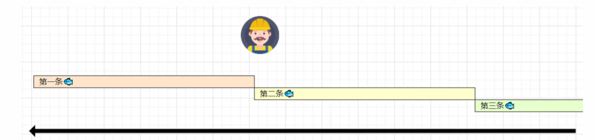

可以将每个鱼罐头的加工流程细分为 5 个步骤：

* 去鳞清洗 10分钟
* 蒸煮沥水 10分钟
* 加注汤料 10分钟
* 杀菌出锅 10分钟
* 真空封罐 10分钟

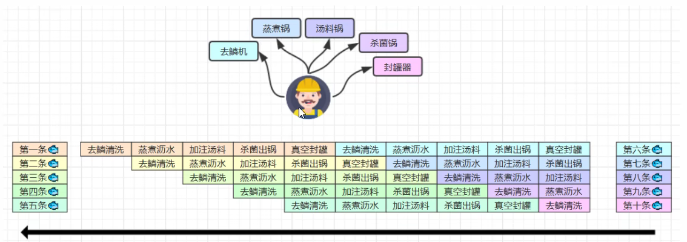

即使只有一个工人，最理想的情况是：他能够在 10 分钟内同时做好这 5 件事，因为对第一条鱼的真空装罐，不会影响对第二条鱼的杀菌出锅...


### 3. 指令重排序优化


事实上，现代处理器会设计为一个时钟周期完成一条执行时间最长的 CPU 指令。为什么这么做呢？可以想到指令还可以再划分成一个个更小的阶段，例如，每条指令都可以分为： `取指令 - 指令译码 - 执行指令 - 内存访问 - 数据写回` 这 5 个阶段

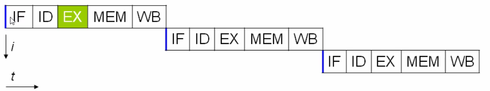

>**术语参考：**
>
>* instruction fetch (IF)
>* instruction decode (ID)
>* execute (EX)
>* memory access (MEM)
>* register write back (WB


在不改变程序结果的前提下，这些指令的各个阶段可以通过**重排序**和**组合**来实现**指令级并行**，这一技术在80's 中叶到 90's 中叶占据了计算架构的重要地位。

>**提示**：
>
>分阶段，分工是提升效率的关键！


指令重排的前提是，重排指令不能影响结果，例如

```java
// 可以重排的例子
int a = 10; // 指令1
int b = 20; // 指令2
System.out.println( a + b );

// 不能重排的例子
int a = 10; // 指令1
int b = a - 5; // 指令2
```

> **参考**：[Scoreboarding](https://en.wikipedia.org/wiki/Scoreboarding) and the [Tomasulo algorithm](https://en.wikipedia.org/wiki/Tomasulo_algorithm) (which is similar to scoreboarding but makes use of [register renaming](https://en.wikipedia.org/wiki/Register_renaming)) are two of the most common techniques for implementing out-of-order execution and instruction-level parallelism.


### 4. 支持流水线的处理器

现代 CPU 支持**多级指令流水线**，例如支持同时执行 `取指令 - 指令译码 - 执行指令 - 内存访问 - 数据写回 `的处理器，就可以称之为**五级指令流水线**。这时 CPU 可以在一个时钟周期内，同时运行五条指令的不同阶段（相当于一条执行时间最长的复杂指令），IPC = 1，本质上，流水线技术并不能缩短单条指令的执行时间，但它变相地提高了指令地吞吐率。

> **提示**：
>
> 奔腾四（Pentium 4）支持高达 35 级流水线，但由于功耗太高被废弃

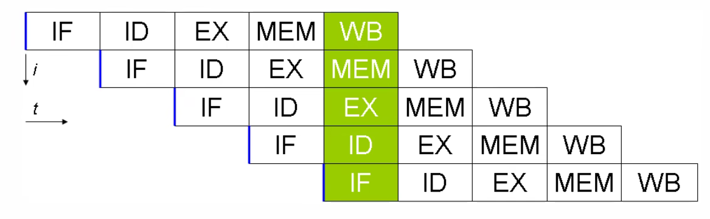


### 5. SuperScalar 处理器

大多数处理器包含多个执行单元，并不是所有计算功能都集中在一起，可以再细分为整数运算单元、浮点数运算单元等，这样可以把多条指令也可以做到并行获取、译码等，CPU 可以在一个时钟周期内，执行多于一条指令，IPC\> 1


## 4.6 习题

#### 1. balking 模式习题

希望 doInit() 方法仅被调用一次，下面的实现是否有问题，为什么？

```java
public class TestVolatile {
    volatile boolean initialized = false;
    
    void init() {
        if (initialized) { // 1. t1 false    3. t2发现还是false
        	return;
        }
        doInit();
        initialized = true; // 2. t1将要写回true
    }
    
    private void doInit() {}
}
```

* `volatile`保证可见性，适用于一个线程写，多个线程读，并不能保证多行代码的原子性

* ```java
  synchronized(this){
      if (initialized) { 
          return;
      }
      doInit();
      initialized = true; 
  }
  ```


#### 2. 线程安全单例习题

单例模式有很多实现方法，饿汉、懒汉、静态内部类、枚举类，试分析每种实现下获取单例对象（即调用
getInstance）时的线程安全，并思考注释中的问题

> 饿汉式：类加载就会导致该单实例对象被创建
>
> 懒汉式：类加载不会导致该单实例对象被创建，而是首次使用该对象时才会创建


实现1

```java
// 问题1：为什么加 final
// 问题2：如果实现了序列化接口, 还要做什么来防止反序列化破坏单例
public final class Singleton implements Serializable {
    // 问题3：为什么设置为私有? 是否能防止反射创建新的实例?
    private Singleton() {}
    // 问题4：这样初始化是否能保证单例对象创建时的线程安全?
    private static final Singleton INSTANCE = new Singleton();
    // 问题5：为什么提供静态方法而不是直接将 INSTANCE 设置为 public, 说出你知道的理由
    public static Singleton getInstance() {
    	return INSTANCE;
    }
    public Object readResolve() {
    	return INSTANCE;
    }
}
```

* 防止子类不适当覆盖方法破坏单例
* `readResolve() Object`方法返回单例
* 防止新new，不能防止反射
* 可以，静态变量初始化操作在类加载阶段完成，由JVM保证线程安全
* 提供更好的封装性，创建单例有更多的控制，提供泛型支持等

实现2

```java
// 问题1：枚举单例是如何限制实例个数的
// 问题2：枚举单例在创建时是否有并发问题
// 问题3：枚举单例能否被反射破坏单例
// 问题4：枚举单例能否被反序列化破坏单例
// 问题5：枚举单例属于懒汉式还是饿汉式
// 问题6：枚举单例如果希望加入一些单例创建时的初始化逻辑该如何做
enum Singleton {
	INSTANCE;
}
```

* 编译后就是当前类的静态成员变量
* 没有；静态变量初始化操作在类加载阶段完成，由JVM保证线程安全
* 不能
* 默认实现序列化接口，可以避免
* 饿汉式
* 构造方法

实现3

```java
public final class Singleton {
    private Singleton() { }
    private static Singleton INSTANCE = null;
    // 分析这里的线程安全, 并说明有什么缺点
    public static synchronized Singleton getInstance() {
        if( INSTANCE != null ){
        	return INSTANCE;
        }
        INSTANCE = new Singleton();
        return INSTANCE;
    }
}
```

* 是线程安全的，锁范围太大，性能低，每次调用都要加锁

实现4 DCL

```java
public final class Singleton {
    private Singleton() { }
    // 问题1：解释为什么要加 volatile ?
    private static volatile Singleton INSTANCE = null;
    // 问题2：对比实现3, 说出这样做的意义
    public static Singleton getInstance() {
        if (INSTANCE != null) {
        	return INSTANCE;
        }
        synchronized (Singleton.class) {
            // 问题3：为什么还要在这里加为空判断, 之前不是判断过了吗
            if (INSTANCE != null) { // t2
            	return INSTANCE;
            }
            INSTANCE = new Singleton();
            return INSTANCE;
        }
    }
}
```

* 在多线程下，INSTANCE未由synchronized完全保护，不能保证有序性，t1线程创建INSTANCE可能会发生指令重排序（字节码层面），导致INSTANCE先赋值后构造，于此同时，t2执行了`getInstance()`,在`synchronized`之外的判空，由于有值，此时t1构造还未完成，那么t2拿到的是一个未完成初始化的`INSTANCE`对象；所以要加`volatile`保证有序性，防止指令重排
* 性能好，第一次正常创建之后的读取就不需要加锁了
* 防止多线程下的安全问题，不同线程创建不同的实例
  * t1获得锁，创建了INSTANCE，t2在已经判断此为空，正在sync外面阻塞，等t1释放锁之后，t2获取锁之后会**直接执行代码创建对象**覆盖t1创建的实例，加了判空之后（由于synchronized）会加载主存中最新的INSTANCE防止创建多余的对象

实现5

```java
public final class Singleton {
    private Singleton() { }
    // 问题1：属于懒汉式还是饿汉式
    private static class LazyHolder {
    	static final Singleton INSTANCE = new Singleton();
    }
    // 问题2：在创建时是否有并发问题
    public static Singleton getInstance() {
    	return LazyHolder.INSTANCE;
    }
}
```

* 懒汉式
* 没有，`getInsatnce`时会首次访问内部类，导致初始化，类加载阶段时静态变量的赋值操作由JVM保护线程安全


## 4.7 本章小结

本章重点讲解了 JMM 中的

* 可见性 - 由 JVM 缓存优化引起
* 有序性 - 由 JVM 指令重排序优化引起
* happens-before 规则
* 原理方面
  * CPU 指令并行
  * volatile
* 模式方面
  * 两阶段终止模式的 volatile 改进
  * 同步模式之 balking


# 5. 共享模型之无锁

* CAS 与 volatile
* 原子整数
* 原子引用
* 原子累加器
* Unsafe


## 5.1 问题提出

有如下需求，保证`account.withdraw`取款方法的线程安全

```java
interface Account {
    // 获取余额
    Integer getBalance();

    // 取款
    void withdraw(Integer amount);

    /**
     * 方法内会启动 1000 个线程，每个线程做 -10 元 的操作
     * 如果初始余额为 10000 那么正确的结果应当是 0
     */
    static void demo(Account account) {
        List<Thread> ts = new ArrayList<>();
        long start = System.nanoTime();
        for (int i = 0; i < 1000; i++) {
            ts.add(new Thread(() -> {
                account.withdraw(10);
            }));
        }
        ts.forEach(Thread::start);
        ts.forEach(t -> {
            try {
                t.join();
            } catch (InterruptedException e) {
                e.printStackTrace();
            }
        });
        long end = System.nanoTime();
        System.out.println(account.getBalance()
                + " cost: " + (end - start) / 1000_000 + " ms");
    }
}
```

原有实现并不是线程安全的

```java
class AccountUnsafe implements Account {
    private Integer balance;

    public AccountUnsafe(Integer balance) {
        this.balance = balance;
    }

    @Override
    public Integer getBalance() {
        return balance;
    }

    @Override
    public void withdraw(Integer amount) {
        balance -= amount;
    }
}
```

执行测试代码

```java
public static void main(String[] args) {
    Account.demo(new AccountUnsafe(10000));
}
```

某次的执行结果

```
240 cost: 129 ms
```

### 1. 为什么不安全


`withdraw` 方法

```java
public void withdraw(Integer amount) {
	balance -= amount;
}
```

对应的字节码

```java
ALOAD 0 												  	// <- this
ALOAD 0
GETFIELD cn/itcast/AccountUnsafe.balance : Ljava/lang/Integer; 	// <- this.balance
INVOKEVIRTUAL java/lang/Integer.intValue ()I 				   // 拆箱
ALOAD 1 													// <- amount
INVOKEVIRTUAL java/lang/Integer.intValue ()I 				   // 拆箱
ISUB 													    // 减法
INVOKESTATIC java/lang/Integer.valueOf (I)Ljava/lang/Integer; 	 // 结果装箱
PUTFIELD cn/itcast/AccountUnsafe.balance : Ljava/lang/Integer; 	 // -> this.balance
```

多线程执行流程

```java
ALOAD 0 							  				// thread-0 <- this
ALOAD 0
GETFIELD cn/itcast/AccountUnsafe.balance 			   // thread-0 <- this.balance
INVOKEVIRTUAL java/lang/Integer.intValue 			   // thread-0 拆箱
ALOAD 1 										    // thread-0 <- amount
INVOKEVIRTUAL java/lang/Integer.intValue 			   // thread-0 拆箱
ISUB 								  			    // thread-0 减法
INVOKESTATIC java/lang/Integer.valueOf                  // thread-0 结果装箱
PUTFIELD cn/itcast/AccountUnsafe.balance                // thread-0 -> this.balance
    
    
ALOAD 0 							                 // thread-1 <- this
ALOAD 0
GETFIELD cn/itcast/AccountUnsafe.balance                // thread-1 <- this.balance
INVOKEVIRTUAL java/lang/Integer.intValue                // thread-1 拆箱
ALOAD 1 							  				// thread-1 <- amount
INVOKEVIRTUAL java/lang/Integer.intValue 			   // thread-1 拆箱
ISUB 								  			    // thread-1 减法
INVOKESTATIC java/lang/Integer.valueOf   			   // thread-1 结果装箱
PUTFIELD cn/itcast/AccountUnsafe.balance 			   // thread-1 -> this.balance
```

* 单核的指令交错
* 多核的指令交错


### 2. 解决思路-锁

首先想到的是给 AccountUnsafe 对象加锁

```java
@Override
public synchronized Integer getBalance() {
	return balance;
}

@Override
public synchronized void withdraw(Integer amount) {
	balance -= amount;
}
```

结果为

```
0 cost: 112 ms
```


### 3. 解决思路-无锁

```java
class AccountCas implements Account {
    private AtomicInteger balance;

    public AccountCas(int balance) {
        this.balance = new AtomicInteger(balance);
    }

    @Override
    public Integer getBalance() {
        return balance.get();
    }

    @Override
    public void withdraw(Integer amount) {
        while (true){
            // 注意： 以下变量都是局部变量
            // 获取余额最新值
            int prev = balance.get();
            // 要修改的余额
            int next = prev - amount;
            // 真正修改主存数据
            if (balance.compareAndSet(prev,next)) {
                break;
            }
        }
        
        // 以上代码可以简化为
        // balance.addAndGet(-1 * amount);
    }

}
```

测试

```java
Account.demo(new AccountCas(10000));
```

某次的执行结果

```
0 cost: 89 ms
```


## 5.2 CAS 与 volatile


前面看到的` AtomicInteger` 的解决方法，内部并没有用锁来保护共享变量的线程安全。那么它是如何实现的呢？

```java
@Override
public void withdraw(Integer amount) {
    while (true){
        // 注意： 以下变量都是局部变量
        // 获取余额最新值
        int prev = balance.get();
        // 要修改的余额
        int next = prev - amount;
        // 真正修改主存数据
        
        // 比较并设置值
        if (balance.compareAndSet(prev,next)) {
            /*
            compareAndSet 正是做这个检查，在 set 前，先比较 prev 与当前值
            - 不一致了，next 作废，返回 false 表示失败
            比如，别的线程已经做了减法，当前值已经被减成了 990
            那么本线程的这次 990 就作废了，进入 while 下次循环重试
            - 一致，以 next 设置为新值，返回 true 表示成功
            */
            break;
        }
    }
    // 可以简化为下面的方法
    // balance.addAndGet(-1 * amount);
}
```

其中的关键是 compareAndSet，它的简称就是 CAS （也有 Compare And Swap 的说法），它必须是**原子操作**。

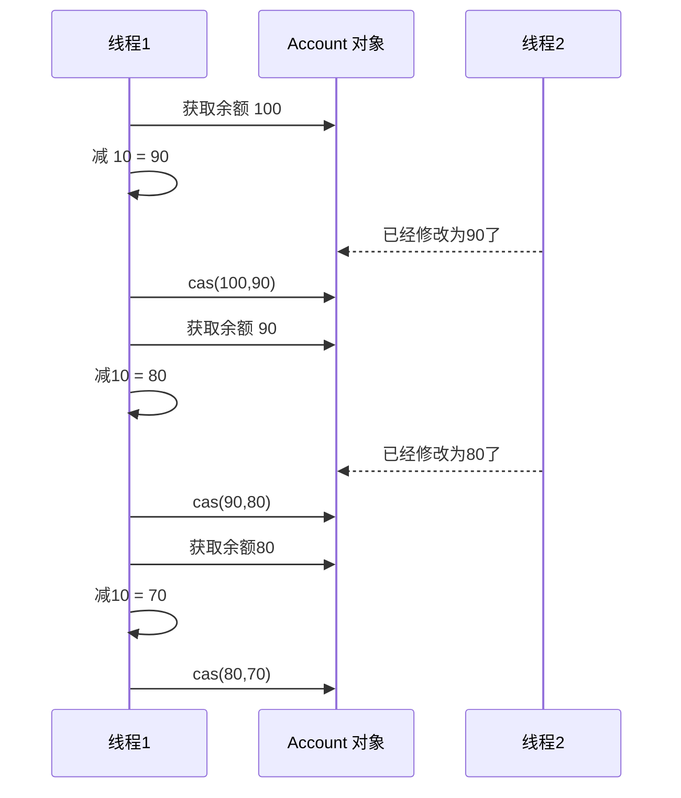
```mermaid
sequenceDiagram 
participant t1 as 线程1
participant a as Account 对象
participant t2 as 线程2
t1->>a:获取余额 100
t1->>t1:减 10 = 90
t2-->>a: 已经修改为90了
t1->>a:cas(100,90)
t1->>a:获取余额 90
t1->>t1:减10 = 80
t2-->>a:已经修改为80了
t1->>a:cas(90,80)
t1->>a:获取余额80
t1->>t1:减10 = 70
t1->>a: cas(80,70)

```

> **注意：**
>
> 其实 CAS 的底层是 `lock cmpxchg `指令（X86 架构），在单核 CPU 和多核 CPU 下都能够保证【比较-交换】的原子性。
>
> * 在多核状态下，某个核执行到带 lock 的指令时，CPU 会让总线锁住，当这个核把此指令执行完毕，再开启总线。这个过程中不会被线程的调度机制所打断，保证了多个线程对内存操作的准确性，是原子的。


### 1. 慢动作分析

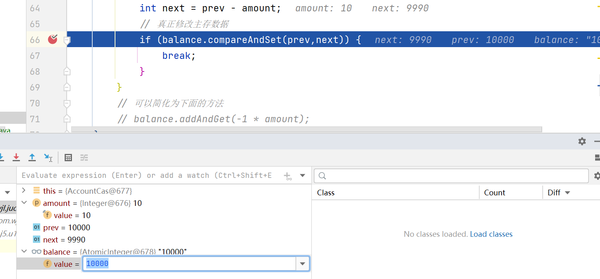

### 2. volatile

获取共享变量时，为了保证该变量的可见性，需要使用 volatile 修饰。

它可以用来修饰成员变量和静态成员变量，他可以避免线程从自己的工作缓存中查找变量的值，必须到主存中获取它的值，**线程操作 volatile 变量都是直接操作主存**。即一个线程对 volatile 变量的修改，对另一个线程可见。

>**注意**
>volatile 仅仅保证了共享变量的可见性，让其它线程能够看到最新值，但不能解决指令交错问题（不能保证原子性）

CAS 必须借助 volatile 才能读取到共享变量的最新值来实现【比较并交换】的效果

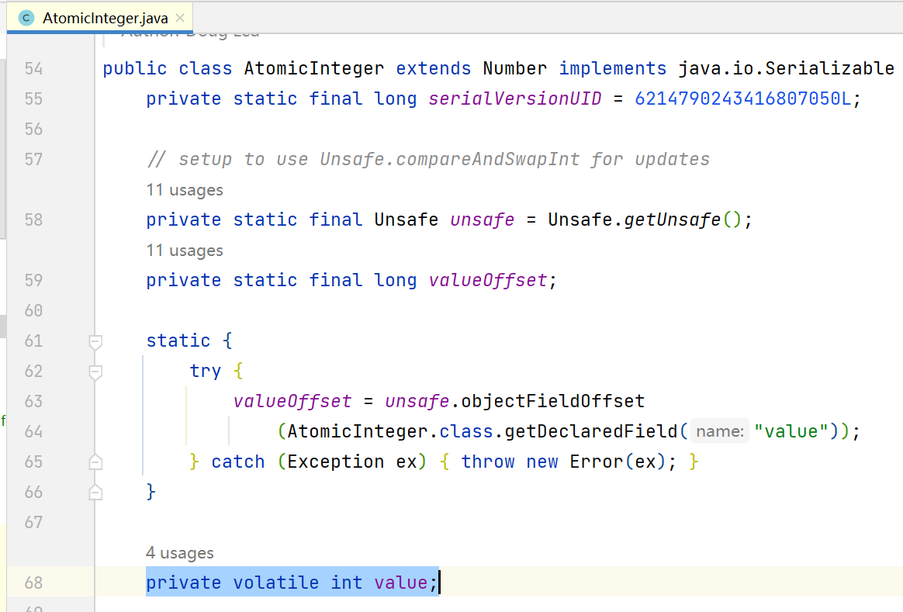


### 3. 为什么无锁效率高

* 无锁情况下，即使重试失败，线程始终在高速运行，没有停歇，而 synchronized 会让线程在没有获得锁的时候，发生上下文切换(同时保存线程信息)，进入阻塞。打个比喻
  * 线程切换要记录执行情况，和加载新线程数据，所以会有上下文切换
  * 因为没有分到时间片，或者时间片用完，就会切换到别的线程工作，这时就会发生线程上下文切换
* 线程就好像高速跑道上的赛车，高速运行时，速度超快，一旦发生上下文切换，就好比赛车要减速、熄火，等被唤醒又得重新打火、启动、加速... 恢复到高速运行，代价比较大
* 但无锁情况下，因为线程要保持运行，需要额外 CPU 的支持，CPU 在这里就好比高速跑道，没有额外的跑道，线程想高速运行也无从谈起，虽然不会进入阻塞，但由于没有分到时间片，仍然会进入可运行状态，还是会导致上下文切换。
* 只是减少了上下文切换的频率，并不是避免了上下文切换；同时线程数最好不要超过CPU核数


### 4. CAS的特点


结合 CAS 和 volatile 可以实现无锁并发，适用于线程数少、多核 CPU 的场景下。

* CAS 是基于乐观锁的思想：最乐观的估计，不怕别的线程来修改共享变量，就算改了也没关系，我吃亏点再重试呗。
* synchronized 是基于悲观锁的思想：最悲观的估计，得防着其它线程来修改共享变量，我上了锁你们都别想改，我改完了解开锁，你们才有机会。
* CAS 体现的是无锁并发、无阻塞并发，请仔细体会这两句话的意思 [修改的正确性？]
  * 因为没有使用 synchronized，所以线程不会陷入阻塞，这是效率提升的因素之一
  * 但如果竞争激烈，可以想到重试必然频繁发生，反而效率会受影响


## 5.3 原子整数

J.U.C 并发包提供了：

* AtomicBoolean
* AtomicInteger
* AtomicLong

以 AtomicInteger 为例

```java
AtomicInteger i = new AtomicInteger(0);

// 获取并自增（i = 0, 结果 i = 1, 返回 0），类似于 i++
System.out.println(i.getAndIncrement());

// 自增并获取（i = 1, 结果 i = 2, 返回 2），类似于 ++i
System.out.println(i.incrementAndGet());

// 自减并获取（i = 2, 结果 i = 1, 返回 1），类似于 --i
System.out.println(i.decrementAndGet());

// 获取并自减（i = 1, 结果 i = 0, 返回 1），类似于 i--
System.out.println(i.getAndDecrement());

// 获取并加值（i = 0, 结果 i = 5, 返回 0）
System.out.println(i.getAndAdd(5));

// 加值并获取（i = 5, 结果 i = 0, 返回 0）
System.out.println(i.addAndGet(-5));

// 获取并更新（i = 0, p 为 i 的当前值, 结果 i = -2, 返回 0）
// 其中函数中的操作能保证原子，但函数需要无副作用
System.out.println(i.getAndUpdate(p -> p - 2));

// 更新并获取（i = -2, p 为 i 的当前值, 结果 i = 0, 返回 0）
// 其中函数中的操作能保证原子，但函数需要无副作用
System.out.println(i.updateAndGet(p -> p + 2));

// 获取并计算（i = 0, p 为 i 的当前值, x 为参数1, 结果 i = 10, 返回 0）
// 其中函数中的操作能保证原子，但函数需要无副作用
// getAndUpdate 如果在 lambda 中引用了外部的局部变量，要保证该局部变量是 final 的
// getAndAccumulate 可以通过 参数1 来引用外部的局部变量，但因为其不在 lambda 中因此不必是 final
System.out.println(i.getAndAccumulate(10, (p, x) -> p + x));

// 计算并获取（i = 10, p 为 i 的当前值, x 为参数1, 结果 i = 0, 返回 0）
// 其中函数中的操作能保证原子，但函数需要无副作用
System.out.println(i.accumulateAndGet(-10, (p, x) -> p + x));
```

## 5.4 原子引用

为什么需要原子引用类型？

* AtomicReference
* AtomicMarkableReference
* AtomicStampedReference

有如下方法

```java
public interface DecimalAccount {
    // 获取余额
    BigDecimal getBalance();

    // 取款
    void withdraw(BigDecimal amount);

    /**
     * 方法内会启动 1000 个线程，每个线程做 -10 元 的操作
     * 如果初始余额为 10000 那么正确的结果应当是 0
     */
    static void demo(DecimalAccount account) {
        List<Thread> ts = new ArrayList<>();
        for (int i = 0; i < 1000; i++) {
            ts.add(new Thread(() -> {
                account.withdraw(BigDecimal.TEN);
            }));
        }
        ts.forEach(Thread::start);
        ts.forEach(t -> {
            try {
                t.join();
            } catch (InterruptedException e) {
                e.printStackTrace();
            }
        });
        System.out.println(account.getBalance());
    }
}
```

试着提供不同的 DecimalAccount 实现，实现安全的取款操作

### 不安全实现

```java
class DecimalAccountUnsafe implements DecimalAccount {
    BigDecimal balance;

    public DecimalAccountUnsafe(BigDecimal balance) {
        this.balance = balance;
    }

    @Override
    public BigDecimal getBalance() {
        return balance;
    }

    @Override
    public void withdraw(BigDecimal amount) {
        BigDecimal balance = this.getBalance();
        this.balance = balance.subtract(amount);
    }
}
```

测试

```java
DecimalAccount.demo(new DecimalAccountUnsafe(new BigDecimal(10000))); 
```

某次输出

```java
830
```


### 安全的实现

```java
class DecimalAccountCas implements DecimalAccount {
    private AtomicReference<BigDecimal> balance;

    public DecimalAccountCas(BigDecimal balance) {
        this.balance = new AtomicReference<>(balance);
    }

    @Override
    public BigDecimal getBalance() {
        return balance.get();
    }

    @Override
    public void withdraw(BigDecimal amount) {
        BigDecimal prev, next;
        do {
            prev = balance.get();
            next = prev.subtract(amount);
        } while (!balance.compareAndSet(prev, next));
    }

    public static void main(String[] args) {
        DecimalAccount.demo(new DecimalAccountCas(new BigDecimal("10000")));
    }
}
```

测试输出

```java
0
```

> 注意：compareAndSet比较的是**引用地址**

### ABA 问题及解决

就是说一个线程把数据A变为了B，然后又重新变成了A。此时另外一个线程读取的时候，发现A没有变化，就误以为是原来的那个A。这就是有名的ABA问题。

#### ABA问题

```java
static AtomicReference<String> ref = new AtomicReference<>("A");

public static void main(String[] args) throws InterruptedException {
    log.debug("main start...");
    // 获取值 A
    // 这个共享变量被它线程修改过？
    String prev = ref.get();
    other();
    sleep(1);
    // 尝试改为 C
    log.debug("change A->C {}", ref.compareAndSet(prev, "C"));
}

private static void other() {
    new Thread(() -> {
        log.debug("change A->B {}", ref.compareAndSet(ref.get(), "B"));
    }, "t1").start();
    
    sleep(0.5);
    
    new Thread(() -> {
        log.debug("change B->A {}", ref.compareAndSet(ref.get(), "A"));
    }, "t2").start();
}
```

输出

```java
14:12:08 [main] c.AbaTest - main start...
14:12:08 [t1] c.AbaTest - change A->B true
14:12:09 [t2] c.AbaTest - change B->A true
14:12:10 [main] c.AbaTest - change A->C true
```

主线程仅能判断出共享变量的值与最初值 A 是否相同，不能感知到这种从 A 改为 B 又 改回 A 的情况，如果主线程希望：

只要有其它线程【动过了】共享变量，那么自己的 cas 就算失败，这时，仅比较值是不够的，需要再加一个版本号

#### AtomicStampedReference

```java
static AtomicStampedReference<String> ref = new AtomicStampedReference<>("A", 0);

public static void main(String[] args) throws InterruptedException {
    log.debug("main start...");
    // 获取值 A
    String prev = ref.getReference();
    // 获取版本号
    int stamp = ref.getStamp();
    log.debug("版本 {}", stamp);
    // 如果中间有其它线程干扰，发生了 ABA 现象
    other();
    sleep(1);
    // 尝试改为 C
    log.debug("change A->C {}", ref.compareAndSet(prev, "C", stamp, stamp + 1));
}

private static void other() {
    new Thread(() -> {
        log.debug("change A->B {}", ref.compareAndSet(ref.getReference(), "B",
                                                      ref.getStamp(), ref.getStamp() + 1));
        log.debug("更新版本为 {}", ref.getStamp());
    }, "t1").start();
    sleep(0.5);
    new Thread(() -> {
        log.debug("change B->A {}", ref.compareAndSet(ref.getReference(), "A",
                                                      ref.getStamp(), ref.getStamp() + 1));
        log.debug("更新版本为 {}", ref.getStamp());
    }, "t2").start();
}
```

输出

```
14:40:36 [main] c.AbaTest - main start...
14:40:36 [main] c.AbaTest - 版本 0
14:40:36 [t1] c.AbaTest - change A->B true
14:40:36 [t1] c.AbaTest - 更新版本为 1
14:40:36 [t2] c.AbaTest - change B->A true
14:40:36 [t2] c.AbaTest - 更新版本为 2
14:40:37 [main] c.AbaTest - change A->C false
```

`AtomicStampedReference `可以给原子引用加上版本号，追踪原子引用整个的变化过程，如： `A->B->A->C `，通过`AtomicStampedReference`，我们可以知道，引用变量中途被更改了几次。

但是有时候，并不关心引用变量更改过了几次，只是单纯的关心**是否更改过**，所以就有了

`AtomicMarkableReference`


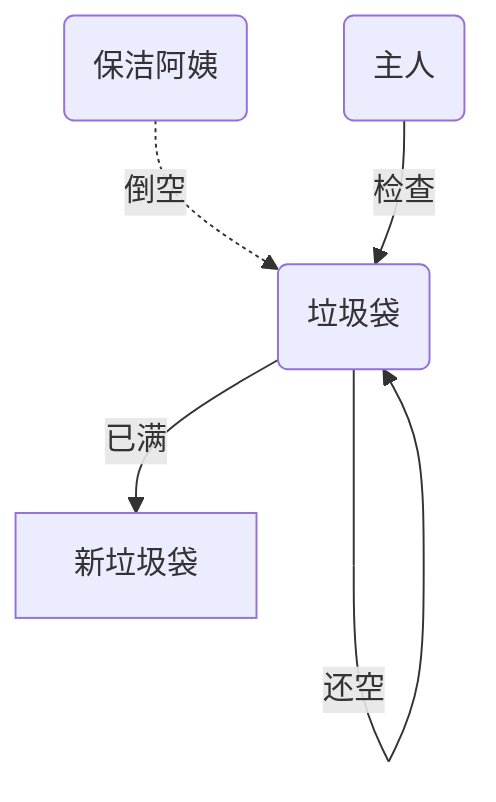
```mermaid
graph TD
a("保洁阿姨")-.倒空.->b("垃圾袋")
c("主人")--检查-->b
b--还空-->b
b--已满-->新垃圾袋
```


#### AtomicMarkableReference

```java
class GarbageBag {
    String desc;
    public GarbageBag(String desc) {
        this.desc = desc;
    }
    public void setDesc(String desc) {
        this.desc = desc;
    }
    @Override
    public String toString() {
        return super.toString() + " " + desc;
    }
}
```

```java
public static void main(String[] args) throws InterruptedException {
    GarbageBag bag = new GarbageBag("装满了垃圾");
    // 参数2 mark 可以看作一个标记，表示垃圾袋满了
    AtomicMarkableReference<GarbageBag> ref = new AtomicMarkableReference<>(bag, true);
    log.debug("主线程 start...");
    GarbageBag prev = ref.getReference();
    log.debug(prev.toString());
    
    new Thread(() -> {
        log.debug("打扫卫生的线程 start...");
        bag.setDesc("空垃圾袋");
        while (!ref.compareAndSet(bag, bag, true, false)) {
        }
        log.debug(bag.toString());
    }).start();
    
    Thread.sleep(1000);
    log.debug("主线程想换一只新垃圾袋？");
    boolean success = ref.compareAndSet(prev, new GarbageBag("空垃圾袋"), true, false);
    log.debug("换了么？" + success);
    log.debug(ref.getReference().toString());
}
```

输出

```java
15:05:25 [main] c.GarbageBag - com.wjl.juc.j5.u1.GarbageBag@73ad2d6 装满了垃圾
15:05:25 [Thread-0] c.GarbageBag - 打扫卫生的线程 start...
15:05:25 [Thread-0] c.GarbageBag - com.wjl.juc.j5.u1.GarbageBag@73ad2d6 空垃圾袋
15:05:26 [main] c.GarbageBag - 主线程想换一只新垃圾袋？
15:05:26 [main] c.GarbageBag - 换了么？false
15:05:26 [main] c.GarbageBag - com.wjl.juc.j5.u1.GarbageBag@73ad2d6 空垃圾袋
```

> 很适用于两种状态的场景，不适用于ABA


## 5.5 原子数组

* AtomicIntegerArray
* AtomicLongArray
* AtomicReferenceArray

有如下方法

```java
/**
 参数1，提供数组、可以是线程不安全数组或线程安全数组
 参数2，获取数组长度的方法
 参数3，自增方法，回传 array, index
 参数4，打印数组的方法
 */
// supplier 提供者 无中生有 ()->结果
// function 函数 一个参数一个结果 (参数)->结果 , BiFunction (参数1,参数2)->结果
// consumer 消费者 一个参数没结果 (参数)->void, BiConsumer (参数1,参数2)->
private static <T> void demo(
        Supplier<T> arraySupplier,
        Function<T, Integer> lengthFun,
        BiConsumer<T, Integer> putConsumer,
        Consumer<T> printConsumer) {
    List<Thread> ts = new ArrayList<>();
    T array = arraySupplier.get();
    int length = lengthFun.apply(array);
    for (int i = 0; i < length; i++) {
        // 每个线程对数组作 10000 次操作
        ts.add(new Thread(() -> {
            for (int j = 0; j < 10000; j++) {
                putConsumer.accept(array, j % length);
            }
        }));
    }
    ts.forEach(t -> t.start()); // 启动所有线程
    ts.forEach(t -> {
        try {
            t.join();
        } catch (InterruptedException e) {
            e.printStackTrace();
        }
    }); // 等所有线程结束
    printConsumer.accept(array);
}
```

### 1.不安全的数组

```java
demo(
        ()->new int[10],
        (array)->array.length,
        (array, index) -> array[index]++,
        array-> System.out.println(Arrays.toString(array))
);
```

某次输出

```java
[7592, 7435, 8153, 7921, 7928, 7973, 7974, 7959, 7942, 7902]
```

### 2. 安全的数组

```java
demo(
                ()->new AtomicIntegerArray(10),
                (array)->array.length(),
                (array, index) -> array.getAndIncrement(index),
                array-> System.out.println(array.toString())
        );
```

输出

```java
[10000, 10000, 10000, 10000, 10000, 10000, 10000, 10000, 10000, 10000]
```


## 5.6 字段更新器

* AtomicReferenceFieldUpdater // 域 字段
* AtomicIntegerFieldUpdater
* AtomicLongFieldUpdater

利用字段更新器，可以针对对象的某个域（Field）进行原子操作，只能配合 volatile 修饰的字段使用，否则会出现异常

```java
Exception in thread "main" java.lang.IllegalArgumentException: Must be volatile type
```

```java
public class TestField {
    public static void main(String[] args) {
        AtomicReferenceFieldUpdater<User, Integer> fieldUpdater = AtomicReferenceFieldUpdater.newUpdater(User.class, Integer.class, "id");
        User user = new User(1,"张三");
        Integer idV = fieldUpdater.get(user);
        System.out.println(idV);
        // 修改成功
        fieldUpdater.compareAndSet(user,1,128);
        idV = fieldUpdater.get(user);
        System.out.println(idV);
        // 修改失败
        fieldUpdater.compareAndSet(user,0,128);
        idV = fieldUpdater.get(user);
        System.out.println(idV);
    }
}
@Data
@AllArgsConstructor
class  User{
    volatile Integer id;
    String name;
}
```

输出

```java
1
128
128
```


## 5.7 原子累加器


### 1. 累加器性能比较

```java
 private static <T> void demo(Supplier<T> adderSupplier, Consumer<T> action) {
     T adder = adderSupplier.get();
     long start = System.nanoTime();
     List<Thread> ts = new ArrayList<Thread>();

     // 40个线程，每个累加500000
     for (int i = 0; i < 40; i++) {
         ts.add(new Thread(() -> {
             for (int j = 0; j < 500000; j++) {
                 action.accept(adder);
             }
         }));
     }

     ts.forEach(Thread::start);
     for (Thread t : ts) {
         try {
             t.join();
         } catch (InterruptedException e) {
             e.printStackTrace();
         }
     }

     long end = System.nanoTime();
     System.out.println(adder + " cost:" + (end - start) / 1000_000);
 }
```

比较 `AtomicLong` 与 `LongAdder`

```java
for (int i = 0; i < 5; i++) {
    demo(()->new LongAdder(),LongAdder::increment);
}
System.out.println("===================");
for (int i = 0; i < 5; i++) {
    demo(()->new AtomicLong(),AtomicLong::getAndIncrement);
}
```

输出

```java
20000000 cost:63
20000000 cost:9
20000000 cost:8
20000000 cost:11
20000000 cost:8
===================
20000000 cost:373
20000000 cost:367
20000000 cost:353
20000000 cost:360
20000000 cost:360
```

性能提升的原因很简单，就是在有竞争时，设置多个累加单元，Therad-0 累加 `Cell[0]`，而 Thread-1 累加`Cell[1]...` 最后将结果汇总。这样它们在累加时操作的不同的` Cell` 变量，因此减少了 CAS 重试失败，从而提高性能。


### <font color="blue">2.* LongAdder 原理</font>

#### 关键域

LongAdder 是并发大师 `@author Doug Lea` （大哥李）的作品，设计的非常精巧

LongAdder 类有几个关键域

```java
// 累加单元数组, 懒惰初始化
transient volatile Cell[] cells;

// 基础值, 如果没有竞争(没必要用cells), 则用 cas 累加这个域
transient volatile long base;

// 在 cells 创建或扩容时, 置为 1, 表示加锁
transient volatile int cellsBusy;
```

源码

```java
@sun.misc.Contended static final class Cell {
    volatile long value;
        Cell(long x) { value = x; }
        final boolean cas(long cmp, long val) {
            return UNSAFE.compareAndSwapLong(this, valueOffset, cmp, val);
        }

        // Unsafe mechanics
        private static final sun.misc.Unsafe UNSAFE;
        private static final long valueOffset;
        static {
            try {
                UNSAFE = sun.misc.Unsafe.getUnsafe();
                Class<?> ak = Cell.class;
                valueOffset = UNSAFE.objectFieldOffset
                    (ak.getDeclaredField("value"));
            } catch (Exception e) {
                throw new Error(e);
            }
        }
    }

    /** Number of CPUS, to place bound on table size */
	// CPU数量，要根据表大小进行绑定
    static final int NCPU = Runtime.getRuntime().availableProcessors();

    /**
     * Table of cells. When non-null, size is a power of 2.
     */
	// 单元格表。当非空时，大小是2的幂
    transient volatile Cell[] cells;

    /**
     * Base value, used mainly when there is no contention, but also as
     * a fallback during table initialization races. Updated via CAS.
     */
	// 基本值，主要在没有争用时使用，但在表初始化争用期间也用作回退。通过CAS更新。
    transient volatile long base;

    /**
     * Spinlock (locked via CAS) used when resizing and/or creating Cells.
     */
	// 调整大小和/或创建单元格时使用的自旋锁（通过CAS锁定）。
    transient volatile int cellsBusy;
```

#### cas锁

```java
// 不是Doug Lea不要瞎写锁
@Slf4j(topic = "c.LockCas")
public class LockCas {
    private AtomicInteger state = new AtomicInteger(0);

    public void lock() {
        log.debug("lock...");
        do{
        }while (!state.compareAndSet(0,1));
    }

    public void unlock(){
        log.debug("unlock...");
        state.set(0);
    }
}
```

#### <font color="blue" style="font-weight:bold">* 原理之伪共享</font>

其中 Cell 即为累加单元

```java
// 防止缓存行伪共享
@sun.misc.Contended
static final class Cell {
    volatile long value;
    Cell(long x) { value = x; }
    
    // 最重要的方法, 用来 cas 方式进行累加, prev 表示旧值, next 表示新值
    final boolean cas(long prev, long next) {
    	return UNSAFE.compareAndSwapLong(this, valueOffset, prev, next);
    }
    // 省略不重要代码
}
```

得从缓存说起

缓存与内存的速度比较

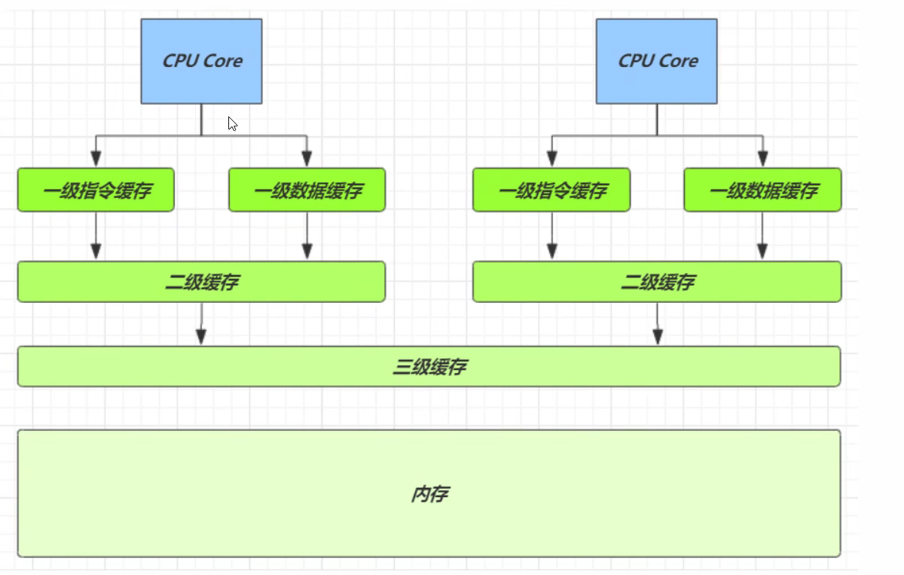

| 从 cpu 到 | 大约需要的时钟周期               |
| --------- | :------------------------------- |
| 寄存器    | 1 cycle (4GHz 的 CPU 约为0.25ns) |
| L1        | 3~4 cycle                        |
| L2        | 10~20 cycle                      |
| L3        | 40~45 cycle                      |
| 内存      | 120~240 cycle                    |

因为 CPU 与 内存的速度差异很大，需要靠预读数据至缓存来提升效率。

而缓存以缓存行(Cache Line)为单位，每个缓存行对应着一块内存，一般是 64 byte（8 个 long）

缓存的加入会造成数据副本的产生，即同一份数据会缓存在不同核心的缓存行中

CPU 要保证数据的一致性，如果某个 CPU 核心更改了数据，其它 CPU 核心对应的整个缓存行必须失效

[简化图：不区分1、2、3级]

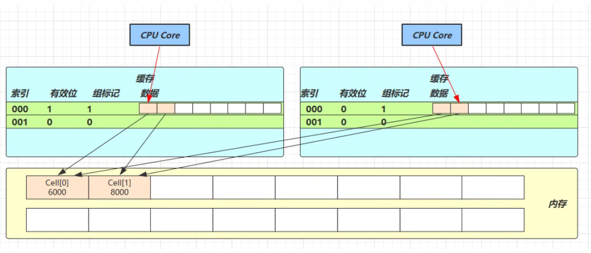

因为 Cell 是数组形式，在内存中是连续存储的，一个 `Cell `为` 24 `字节（16 字节的对象头和 8 字节的value），(还有指针压缩的情况)因此缓存行可以存下 2 个的 Cell 对象。这样问题来了：

* `Core-0` 要修改`Cell[0]`
* `Core-1` 要修改 `Cell[1]`

无论谁修改成功，都会导致对方 Core 的缓存行失效，比如 `Core-0 中 Cell[0]=6000, Cell[1]=8000` 要累加`Cell[0]=6001, Cell[1]=8000` ，这时会让 Core-1 的缓存行失效

<font color="#9e880d">`@sun.misc.Contended` </font>用来解决这个问题，它的原理是在使用此注解的对象或字段的前后各增加 128 字节大小的`padding`，从而让 CPU 将对象预读至缓存时占用不同的缓存行，这样，不会造成对方缓存行的失效

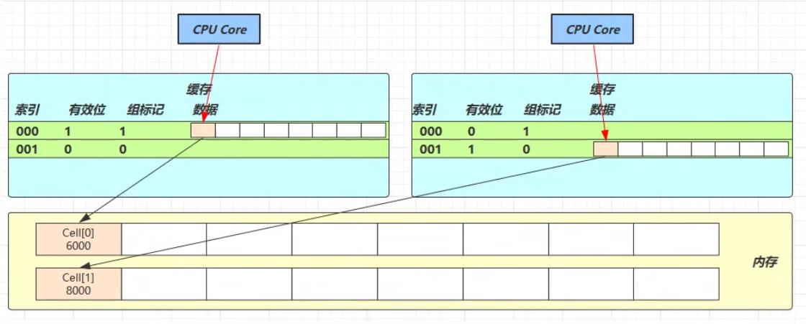

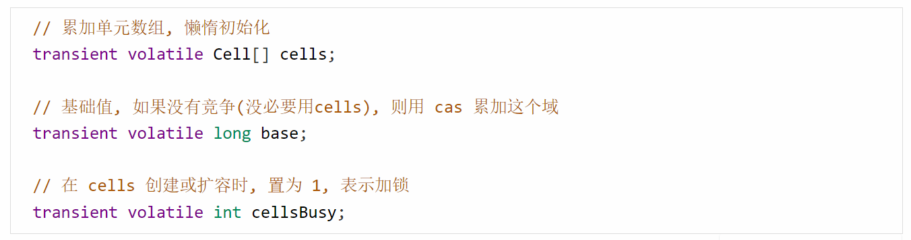

累加主要调用下面的方法

```java
public void add(long x) {
    // as 为累加单元数组
    // b 为基础值
    // x 为累加值
    Cell[] as; long b, v; int m; Cell a;
    // 进入 if 的两个条件
    
    // 1. as 有值, 表示已经发生过竞争, 进入 if
    // 2. cas 给 base 累加时失败了, 表示 base 发生了竞争, 进入 if
    if ((as = cells) != null || !casBase(b = base, b + x)) {
        // uncontended 表示 cell 没有竞争
        boolean uncontended = true;
        if (
            // as 还没有创建
            as == null || (m = as.length - 1) < 0 ||
            // 当前线程对应的 cell 还没有
            (a = as[getProbe() & m]) == null ||
            // cas 给当前线程的 cell 累加失败 uncontended=false ( a 为当前线程的 cell )
            !(uncontended = a.cas(v = a.value, v + x))
        ) {
            // 进入 cell 数组创建、cell 创建的流程
            longAccumulate(x, null, uncontended);
        }
    }
}
```


add流程图

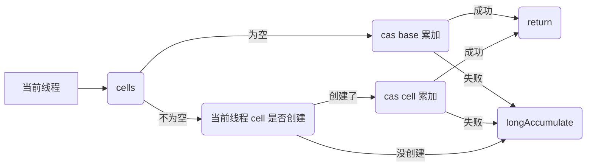
```mermaid
graph LR
当前线程-->a("cells")
a--为空-->b("cas base 累加")
b--成功-->r("return")
b--失败-->l("longAccumulate")
a--不为空-->d("当前线程 cell 是否创建")
d--创建了-->e("cas cell 累加")
e--成功-->r
e--失败-->l
d--没创建-->l
```

```java
final void longAccumulate(long x, LongBinaryOperator fn,boolean wasUncontended) {
    int h;
    // 当前线程还没有对应的 cell, 需要随机生成一个 h 值用来将当前线程绑定到 cell
    if ((h = getProbe()) == 0) {
        // 初始化 probe
        ThreadLocalRandom.current();
        // h 对应新的 probe 值, 用来对应 cell
        h = getProbe();
        wasUncontended = true;
    }
    // collide 为 true 表示需要扩容
    boolean collide = false;
    for (;;) {
        Cell[] as; Cell a; int n; long v;
        // 已经有了 cells
        if ((as = cells) != null && (n = as.length) > 0) {
            // 还没有 cell
            if ((a = as[(n - 1) & h]) == null) {
                // 为 cellsBusy 加锁, 创建 cell, cell 的初始累加值为 x
                // 成功则 break, 否则继续 continue 循环
            }
            // 有竞争, 改变线程对应的 cell 来重试 cas
            else if (!wasUncontended)
                wasUncontended = true;
            // cas 尝试累加, fn 配合 LongAccumulator 不为 null, 配合 LongAdder 为 null
            else if (a.cas(v = a.value, ((fn == null) ? v + x : fn.applyAsLong(v, x))))
                break;
            // 如果 cells 长度已经超过了最大长度, 或者已经扩容, 改变线程对应的 cell 来重试 cas
            else if (n >= NCPU || cells != as)
                collide = false;
            // 确保 collide 为 false 进入此分支, 就不会进入下面的 else if 进行扩容了
            else if (!collide)
                collide = true;
            // 加锁
            else if (cellsBusy == 0 && casCellsBusy()) {
                // 加锁成功, 扩容
                continue;
            }
            // 改变线程对应的 cell
            h = advanceProbe(h);
        }
        // 还没有 cells, 尝试给 cellsBusy 加锁
        else if (cellsBusy == 0 && cells == as && casCellsBusy()) {
            // 加锁成功, 初始化 cells, 最开始长度为 2, 并填充一个 cell
            // 成功则 break;
        }
        // 上两种情况失败, 尝试给 base 累加
        else if (casBase(v = base, ((fn == null) ? v + x : fn.applyAsLong(v, x))))
        	break;
        }
}
```

longAccumulate 流程图

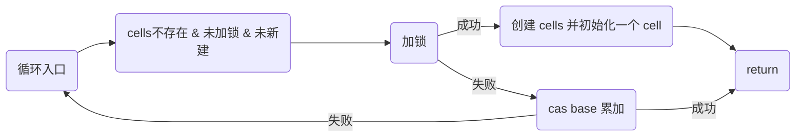
```mermaid
graph LR
x("循环入口")-->c("cells不存在 & 未加锁 & 未新建")
x-->j("加锁")
j--成功-->cj("创建 cells 并初始化一个 cell")
j--失败-->cb("cas base 累加")
cj-->r("return")
cb--成功--> r
cb--失败-->x
```

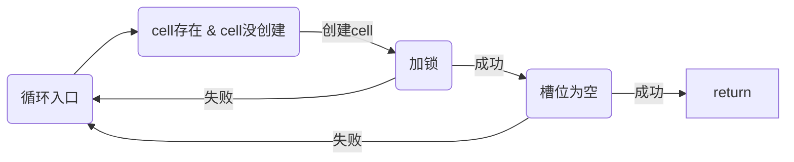
```mermaid
graph LR
x("循环入口")-->c("cell存在 & cell没创建")
c--创建cell-->j("加锁")
j--成功-->ao("槽位为空")
ao--成功--> return
j--失败-->x
ao--失败-->x
```

每个线程刚进入 longAccumulate 时，会尝试对应一个 cell 对象（找到一个坑位）


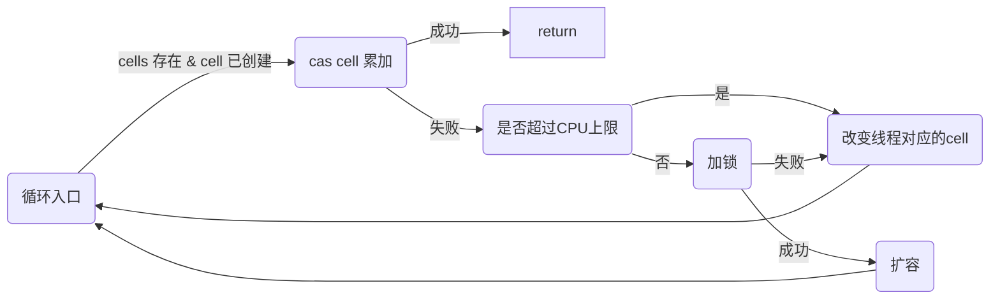
```mermaid
graph LR
x("循环入口")--cells 存在 & cell 已创建 --> cc("cas cell 累加")
cc--成功-->return
cc--失败-->s("是否超过CPU上限")
s--是-->g("改变线程对应的cell")
s--否-->j("加锁")
j--失败-->g
g-->x
j--成功--> k("扩容")
k-->x
```

```java
public long sum() {
    Cell[] as = cells; Cell a;
    long sum = base;
    if (as != null) {
        for (int i = 0; i < as.length; ++i) {
            if ((a = as[i]) != null)
            sum += a.value;
        }
    }
    return sum;
}
```


#### <font color="#9e880d">@Contended</font> 测试

```java
@Contended // User类没有附加此注解
public class UserContended {
    private volatile long  WJLVALUE = 100L;
}
```

```java
 /*
 	-XX:-RestrictContended
 */
public class TestContended {
    public static void main(String[] args) {
        System.out.println(ClassLayout.parseInstance(new User()).toPrintable());
        System.out.println("===================================================");
        System.out.println(ClassLayout.parseInstance(new UserContended()).toPrintable());
    }
}
```

```java
com.wjl.juc.j5.u2.User object internals:
OFF  SZ   TYPE DESCRIPTION               VALUE
  0   8        (object header: mark)     0x0000000000000001 (non-biasable; age: 0)
  8   4        (object header: class)    0xf800c143
 12   4        (alignment/padding gap)   
 16   8   long User.WJLVALUE             100
Instance size: 24 bytes
Space losses: 4 bytes internal + 0 bytes external = 4 bytes total
===================================================
com.wjl.juc.j5.u2.UserContended object internals:
OFF  SZ   TYPE DESCRIPTION               VALUE
  0   8        (object header: mark)     0x0000000000000001 (non-biasable; age: 0)
  8   4        (object header: class)    0xf800cda3
 12 132        (alignment/padding gap)   // @Contended?
144   8   long UserContended.WJLVALUE    100
152   0        (object alignment gap)    
Instance size: 280 bytes
Space losses: 132 bytes internal + 0 bytes external = 132 bytes total
```

添加在字段上

```java
// -XX:-RestrictContended
public class UserContended {
    @Contended("wjl-padding")
    private volatile long  WJLVALUE = 100L;
}
```

```java
com.wjl.juc.j5.u2.User object internals:
OFF  SZ   TYPE DESCRIPTION               VALUE
  0   8        (object header: mark)     0x0000000000000001 (non-biasable; age: 0)
  8   4        (object header: class)    0xf800c143
 12   4        (alignment/padding gap)   
 16   8   long User.WJLVALUE             100
Instance size: 24 bytes
Space losses: 4 bytes internal + 0 bytes external = 4 bytes total
===================================================
com.wjl.juc.j5.u2.UserContended object internals:
OFF  SZ   TYPE DESCRIPTION               VALUE
  0   8        (object header: mark)     0x0000000000000001 (non-biasable; age: 0)
  8   4        (object header: class)    0xf800cda3
 12 132        (alignment/padding gap)   
144   8   long UserContended.WJLVALUE    100
152   0        (object alignment gap)    
Instance size: 280 bytes
Space losses: 132 bytes internal + 0 bytes external = 132 bytes total
```


> @Contended
>
> 在 JDK 1.8 中，提供了 @sun.misc.Contended 注解，使用该注解就可以让变量独占缓存行，不再需要手动填充了。
>
> 注意，在使用JOL分析Contended注解的对象时候，需要加上 -XX:-RestrictContended参数。同时可以设置-XX:ContendedPaddingWidth 来控制padding的大小。
>
> 如果该注解被定义在了类上，表示该类的每个变量都会独占缓存行；如果被定义在了变量上，通过指定 groupName，相同的 groupName 会独占同一缓存行。


> 参考链接
>
> * https://blog.csdn.net/qq_27680317/article/details/78486220
> * https://www.cnblogs.com/eycuii/p/11525164.html
> * https://blog.csdn.net/qq_38730338/article/details/113259560


## 5.8 Unsafe

#### 1. 概述

`Unsafe `对象提供了非常底层的，操作内存、线程的方法，`Unsafe `对象不能直接调用，只能通过反射获得

Unsafe == 涉及底层（内存、线程...），不建议编程人员使用， 不是线程不安全的意思

```java
public class UnsafeAccessor{
    private final static Unsafe unsafe;
    static {
        try {
            Field field = Unsafe.class.getDeclaredField("theUnsafe");
            field.setAccessible(true);
            unsafe = (Unsafe)field.get(null);
        } catch (NoSuchFieldException | IllegalAccessException e) {
            throw new Error(e);
        }
    }
    
    public static Unsafe getInstance(){
        return unsafe;
    }
}
```


#### 2. Unsafe CAS 操作

```java
@Data
class Student {
    volatile int id;
    volatile String name;
}
```

```java
Unsafe unsafe = UnsafeAccessor.getInstance();
// unsafe.park(false,0L);
Student student = new Student();

// 1. 获取属性的偏移量/域的偏移地址
long idOffset = unsafe.objectFieldOffset(Student.class.getDeclaredField("id"));
long nameOffset = unsafe.objectFieldOffset(Student.class.getDeclaredField("name"));

//2. 执行CAS操作
boolean andSwapInt = unsafe.compareAndSwapInt(student, idOffset, 0, 1);
boolean swapObject = unsafe.compareAndSwapObject(student, nameOffset, null, "张三");
System.out.println("id:"+andSwapInt+" name:"+swapObject+" student:"+student);
```

输出

```java
id:true name:true student:Student(id=1, name=张三)
```


#### 3. 自定义原子整数

```java
public class AtomicData {
    private final static Unsafe UNSAFE;
    private final static long VALUE_OFFSET;
    private volatile int value;

    static {
        UNSAFE = UnsafeAccessor.getInstance();
        try {
            // 指针寻址的时候会用到偏移量，偏移量就是相对于这个对象之后多少，找这个value
            // value 属性在 DataContainer 对象中的偏移量，用于 Unsafe 直接访问该属性
            VALUE_OFFSET = 			
                UNSAFE.objectFieldOffset(AtomicData.class.getDeclaredField("value"));
        } catch (NoSuchFieldException e) {
            throw new Error(e);
        }
    }

    public AtomicData(int value) {
        this.value = value;
    }

    public int updateAndGet(IntUnaryOperator operator){
        int prev,next;
        do{
            // 获取共享变量旧值，可以在这一行加入断点，修改 value 调试来加深理解
            prev = get();
            next = operator.applyAsInt(prev);
            // cas 尝试修改 value 为 旧值 + amount，如果期间旧值被别的线程改了，返回 false
        }while(!UNSAFE.compareAndSwapInt(this,VALUE_OFFSET,prev,next));
        return this.value;
    }

    public int getAndUpdate(IntUnaryOperator operator){
        int prev,next;
        do{
            prev = get();
            next = operator.applyAsInt(prev);
        }while(!UNSAFE.compareAndSwapInt(this,VALUE_OFFSET,prev,next));
        return prev;
    }

    public final int get(){
        return value;
    }

    public final void set(int i){
        value = i;
    }

}
```

Account 实现

```java
Account.demo(new Account() {
    
    private final AtomicData balance = new AtomicData(10000);
    
    @Override
    public Integer getBalance() {
        return balance.get();
    }

    @Override
    public void withdraw(Integer amount) {
        balance.updateAndGet(value->value-amount);
    }
});
```

输出

```java
0 cost: 105 ms
```


## 5.9 本章小结

* CAS 与 volatile
* API
  * 原子整数
  * 原子引用
  * 原子数组
  * 字段更新器
  * 原子累加器
* Unsafe
* <font color="blue" style="font-weight:bold">* 原理方面</font>
  * LongAdder 源码
  * 伪共享


# <a href="Java_Concurrent_2.md" style="font-weight:bold">Ctrl+左键下半部分</a>


