# Java_Concurrent_2

[TOC]

# 6. 共享模型之不可变

* 不可变类的使用
* 不可变类设计
* 无状态类设计


## 6.1 日期转换的问题


### 1. 问题提出

下面的代码在运行时，由于 SimpleDateFormat 不是线程安全的

```java
SimpleDateFormat sdf = new SimpleDateFormat("yyyy-MM-dd");
for (int i = 0; i < 10; i++) {
    new Thread(() -> {
        try {
            log.debug("{}", sdf.parse("1951-04-21"));
        } catch (Exception e) {
            log.error("{}", e);
        }
    }).start();
}
```

有很大几率出现 java.lang.NumberFormatException 或者出现不正确的日期解析结果，例如：

```
java.lang.NumberFormatException: For input string: "19511951EE195144"
	at sun.misc.FloatingDecimal.readJavaFormatString(FloatingDecimal.java:2043)
	at sun.misc.FloatingDecimal.parseDouble(FloatingDecimal.java:110)
	at java.lang.Double.parseDouble(Double.java:538)
	at java.text.DigitList.getDouble(DigitList.java:169)
	at java.text.DecimalFormat.parse(DecimalFormat.java:2087)
	at java.text.SimpleDateFormat.subParse(SimpleDateFormat.java:1869)
	at java.text.SimpleDateFormat.parse(SimpleDateFormat.java:1514)
	at java.text.DateFormat.parse(DateFormat.java:364)
	at com.wjl.juc.j6.u1.TestSDF.lambda$main$0(TestSDF.java:19)
	at java.lang.Thread.run(Thread.java:750)
```

### 2. 思路-同步锁

这样虽能解决问题，但带来的是性能上的损失，并不算很好

```java
synchronized(sdf){
    try {
        log.debug("{}", sdf.parse("1951-04-21"));
    } catch (Exception e) {
        log.error("{}", e);
    }
}
```

### 3. 思路-不可变

如果一个对象在不能够修改其内部状态（属性），那么它就是线程安全的，因为不存在并发修改啊！这样的对象在Java 中有很多，例如在 Java 8 后，提供了一个新的日期格式化类：

```java
/*
Implementation Requirements:
This class is immutable and thread-safe. 此类是不可变的且线程安全的
Since:1.8
*/
public final class DateTimeFormatter
```

```java
DateTimeFormatter pattern = DateTimeFormatter.ofPattern("yyyy-MM-dd");
for (int i = 0; i < 10; i++) {
    new Thread(() -> {
        try {
            TemporalAccessor temporalAccessor = pattern.parse("1951-04-21");
            log.debug("{}", temporalAccessor);
        } catch (Exception e) {
            log.error("{}", e);
        }
    }).start();
}
```

不可变对象，实际是另一种避免竞争的方式。


## 6.2 不可变设计

另一个大家更为熟悉的 String 类也是不可变的，以它为例，说明一下不可变设计的要素

```java
public final class String
    implements java.io.Serializable, Comparable<String>, CharSequence {
    /** The value is used for character storage. */
    private final char value[];
    
    /** Cache the hash code for the string */
    private int hash; // Default to 0
    // ...
}
```

### 1. `final` 的使用

发现该类、类中所有属性都是 final 的

* 属性用 final 修饰保证了该属性是只读的，不能修改
* 类用 final 修饰保证了该类中的方法不能被覆盖，防止子类无意间破坏不可变性


### 2. 保护性拷贝

* 防止外部char[]内容发生改变导致`String`类出错

```java
public String(char value[]) {
        this.value = Arrays.copyOf(value, value.length);
}
```

但有同学会说，使用字符串时，也有一些跟修改相关的方法啊，比如 substring 等，那么下面就看一看这些方法是如何实现的，就以 substring 为例：

```java
public String substring(int beginIndex) {
    if (beginIndex < 0) {
    	throw new StringIndexOutOfBoundsException(beginIndex);
    }
    int subLen = value.length - beginIndex;
    if (subLen < 0) {
    	throw new StringIndexOutOfBoundsException(subLen);
    }
	return (beginIndex == 0) ? this : new String(value, beginIndex, subLen);
}
```

发现其内部是调用 String 的构造方法创建了一个新字符串，再进入这个构造看看，是否对 final char[] value 做出了修改：

```java
public String(char value[], int offset, int count) {
    if (offset < 0) {
    	throw new StringIndexOutOfBoundsException(offset);
    }
    if (count <= 0) {
        if (count < 0) {
            throw new StringIndexOutOfBoundsException(count);
        }
        if (offset <= value.length) {
            this.value = "".value;
            return;
        }
    }
    if (offset > value.length - count) {
    	throw new StringIndexOutOfBoundsException(offset + count);
    }
    this.value = Arrays.copyOfRange(value, offset, offset+count);
}
```

结果发现也没有，构造新字符串对象时，会生成新的 char[] value，对内容进行复制 。这种通过创建副本对象来避免共享的手段称之为【保护性拷贝（defensive copy）】


#### <font color="#ffa500">* 模式之享元</font>


### <font color="blue" style="font-weight:bold">3. *`final`原理</font>


#### 1. 设置final变量的原理

理解了 volatile 原理，再对比 final 的实现就比较简单了

```java
public class TestFinal {
	final int a = 20;
}
```

字节码

```java
 0: aload_0
 1: invokespecial #1                  // Method java/lang/Object."<init>":()V
 4: aload_0
 5: bipush        10
 7: putfield      #2                  // Field a:I
     <-- 写屏障
10: return

```

发现 final 变量的赋值也会通过 putfield 指令来完成，同样在这条指令之后也会加入写屏障（之前的操作同步到主存，写操作不会下去），保证在其它线程读到它的值时不会出现为 0 的情况

> 不加`final`的话是先分配空间在赋值，两步走，其他线程此时读有可能读到a的值为0


##### 获取 final 变量的原理

```java
public class TestFinal {
    static final int A = 20;
    static final  int B = Short.MAX_VALUE + 1;

    final int a = 10;
    final int b = Integer.MAX_VALUE;

    final void  test1(){}
}

class UserFinal1{
    public void test(){
        System.out.println(TestFinal.A);
        System.out.println(TestFinal.B);
        System.out.println(new TestFinal().a);
        System.out.println(new TestFinal().b);
        new TestFinal().test1();
    }
}
```


对应字节码

```java
// static final int A = 20;
BIPUSH 20 // 直接复制值到栈内存 优化
    
// static int A = 20;
GETSTATIC com/wjl/juc/j6/u1/TestFinal.A : I  //走共享内存(堆)
    
// static final  int B = Short.MAX_VALUE + 1;
LDC 32768  // 读取常量池内容  
 
// static int B = Short.MAX_VALUE + 1;    
GETSTATIC com/wjl/juc/j6/u1/TestFinal.B : I  
    
// final int a = 10;
BIPUSH 10    
    
// int a = 10;
GETFIELD com/wjl/juc/j6/u1/TestFinal.a : I   
    
// int b = Integer.MAX_VALUE;
GETFIELD com/wjl/juc/j6/u1/TestFinal.b : I    
    
// final int b = Integer.MAX_VALUE;
LDC 2147483647    
```


## 6.3 无状态

在 web 阶段学习时，设计 Servlet 时为了保证其线程安全，都会有这样的建议，不要为 Servlet 设置成员变量，这种没有任何成员变量的类是线程安全的

> 因为成员变量保存的数据也可以称为状态信息，因此没有成员变量就称之为【无状态】


## 6.4 本章小结

* 不可变类使用
* 不可变类设计
* <font color="blue" style="font-weight:bold">* 原理方面</font>
  * final
* 模式方面
  * 享元


# 7. 共享模型之工具


## 7.1 线程池


### 1. 自定义线程池

* 充分利用已有线程资源，避免线程频繁的创建，减少上下文切换

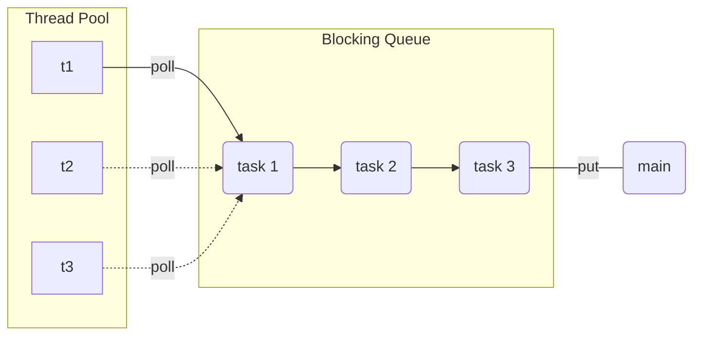
```mermaid
graph LR
subgraph Thread Pool
t1
t2
t3
end

subgraph Blocking Queue
k1("task 1")
k2("task 2")
k3("task 3")
end

t1--poll-->k1
t2-.poll.->k1
t3-.poll.->k1

k1-->k2
k2-->k3
k3--put---m("main")
```

#### 创建拒绝策略接口

```java
@FunctionalInterface
public interface RejectPolicy<T> {
    void reject(BlockingQueue<T> queue, T task);
}
```

#### 自定义任务队列

```java
@Slf4j
public class BlockingQueue<T> {

    // 任务队列 Deque双向链表
    private Deque<T> queue;

    // 锁 线程不能取走相同的task
    private final ReentrantLock lock;

    // 消费者成员变量 没有任务等待
    private final Condition fullWait;

    // 生产者条件变量 task队列满了等待
    private final Condition emptyWait;

    // 容量
    private int capacity;

    public BlockingQueue(int capacity) {
        this.capacity = capacity;
        this.queue = new ArrayDeque<>(capacity);
        this.lock = new ReentrantLock();
        this.fullWait = lock.newCondition();
        this.emptyWait = lock.newCondition();
    }

    /**
     *  阻塞获取
     * @return task
     */
    public T task() {
        lock.lock();
        try {
            // while 防止空唤醒
            while (queue.isEmpty()) {
                try {
                    // 如果队列空了就阻塞
                    emptyWait.await();
                } catch (InterruptedException e) {
                    e.printStackTrace();
                }
            }
            T task = queue.removeFirst(); // 并且从队列移除
            // 不为空就获取task并且唤醒 因为满队列而放不进去阻塞的线程
            log.debug("取出任务 {}", task);
            fullWait.signal();
            return task;
        } finally {
            lock.unlock();
        }
    }

    /**
     *  阻塞添加
     * @param element
     */
    public void put(T element) {
        lock.lock();
        try {
            // 队列满了就阻塞
            while (queue.size() == capacity) {
                try {
                    log.debug("等待加入任务队列 {} ...", element);
                    fullWait.await();
                } catch (InterruptedException e) {
                    e.printStackTrace();
                }
            }
            log.debug("加入任务队列 {}", element);
            queue.addLast(element);
            // 添加元素后队列不为空 应当唤醒因为空等待的线程
            emptyWait.signal();
        } finally {
            lock.unlock();
        }
    }

    /**
     *  带超时的获取task方法
     * @param timeout 时间
     * @param unit 单位 默认秒
     * @return
     */
    public T poll(long timeout, TimeUnit unit) {
        lock.lock();
        if (unit == null) {
            unit = TimeUnit.SECONDS;
        }
        try {
            long nanos = unit.toNanos(timeout);
            while (queue.isEmpty()) {
                try {
                    /** Code:
                     * nanosTimeout值的估计值减去等待此方法返回所花费的时间。
                     * 正值可以用作此方法的后续调用的参数，以完成等待所需时间。
                     * 小于或等于零的值表示没有剩余时间。
                     */
                    if (nanos <= 0) {
                        return null;
                    }
                    nanos = emptyWait.awaitNanos(nanos);
                } catch (InterruptedException e) {
                    e.printStackTrace();
                }
            }
            T task = queue.removeFirst();
            log.debug("取出任务 {}", task);
            fullWait.signal();
            return task;
        } finally {
            lock.unlock();
        }
    }

    /**
     *  超时添加的方法
     * @param element
     * @param timeout
     * @param unit
     * @return
     */
    public boolean offer(T element, long timeout, TimeUnit unit) {
        lock.lock();
        long nanos = unit.toNanos(timeout);
        try {
            while (queue.size() == capacity) {
                try {
                    if (nanos <= 0) {
                        log.debug("加入队列失败 {}", element);
                        return false;
                    }
                    log.debug("等待加入队列 {}", element);
                    nanos = fullWait.awaitNanos(nanos);
                } catch (InterruptedException e) {
                    throw new RuntimeException(e);
                }
            }
            log.debug("加入任务队列 {}", element);
            queue.addLast(element);
            emptyWait.signal();
            return true;
        } finally {
            lock.unlock();
        }
    }

    /**
     *  task 个数
     * @return
     */
    public int size() {
        lock.unlock();
        try {
            return queue.size();
        } finally {
            lock.unlock();
        }
    }

    public void tryPut(T task, RejectPolicy<T> rejectPolicy) {
        lock.lock();
        try {
            // 判断队列是否已满
            if (queue.size() == capacity) {
                rejectPolicy.reject(this, task);
            } else {
                log.debug("加入任务队列 {}", task);
                queue.addLast(task);
                emptyWait.signal();
            }
        } finally {
            lock.unlock();
        }
    }
}
```

#### 自定义线程池

```java
@Slf4j
public class MyThreadPool {
    // 任务队列
    private BlockingQueue<Runnable> taskQueue;
    // 线程集合
    private HashSet<Worker> works;
    // 核心线程数
    private int corePoolSize;
    // 超时时间
    private long timeout;
    // 时间单位
    private TimeUnit unit;

    // 拒绝策略
    private RejectPolicy<Runnable> rejectPolicy;
    private AtomicInteger nameCount = new AtomicInteger(0);

    /**
     *  执行任务的方法
     * @param task
     */
    public void execute(Runnable task) {
        // 当任务数没有超过核心线程数时 直接创建线程对象 反之加入队列
        synchronized (works) { //works 不是线程安全的
            if (works.size() < corePoolSize) {
                Worker worker = new Worker(task, getName());
                worker.start();
                works.add(worker);
            } else {
                taskQueue.tryPut(task, rejectPolicy);
                // 1) 死等
                // 2) 带超时等待
                // 3) 让调用者放弃任务执行
                // 4) 让调用者抛出异常
                // 5) 让调用者自己执行任务
            }
        }
    }

    private String getName() {
        return "execute-thread-" + nameCount.getAndIncrement();
    }

    public MyThreadPool(int corePoolSize, long timeout, TimeUnit unit, int queueCapcity, RejectPolicy<Runnable> rejectPolicy) {
        this.corePoolSize = corePoolSize;
        this.timeout = timeout;
        this.unit = unit;
        this.taskQueue = new BlockingQueue<>(queueCapcity);
        this.works = new HashSet<>();
        this.rejectPolicy = rejectPolicy;
    }


    private final class Worker extends Thread {
        private String name;
        private Runnable task;

        public Worker(Runnable task, String name) {
            super(name);
            this.task = task;
            this.name = name;
        }

        @Override
        public void run() {
            // 执行任务
            // 1. 当前线程的任务 2.taskQueue中的任务
            // while (task != null || (task = taskQueue.task()) != null) {
            while (task != null || (task = taskQueue.poll(timeout, unit)) != null) {
                try {
                    task.run();
                } catch (Exception e) {
                    throw new RuntimeException(this.name + " 任务执行失败", e);
                } finally {
                    // 处理任务之后置空引用
                    task = null;
                }
            }
            // 本应是等待
            synchronized (works) {
                log.debug("remove {}", this.getName());
                // Sleeper.sleep(2);
                works.remove(this);
            }
        }
    }
}
```

#### 测试

```java
@Slf4j
public class Test {
    public static void main(String[] args) {
        MyThreadPool pool = new MyThreadPool(2, 2, SECONDS, 2, (queue, task) -> {
            // 1) 死等
            // queue.put(task);
            // 2) 带超时等待
           //  queue.offer(task,1,SECONDS);
            // 3) 让调用者放弃任务执行
            // 什么都不做
            // 4) 让调用者抛出异常
            // throw  new RuntimeException();
            // 5) 让调用者自己执行任务
            task.run();
        });
        for (int i = 0; i < 10; i++) {
            pool.execute(new Runnable() {
                @Override
                public void run() {
                    sleep(2);
                    System.out.println(Thread.currentThread().getName() + ":  running...");
                }
            });
        }
    }
}
```


### 2. ThreadPoolExecutor

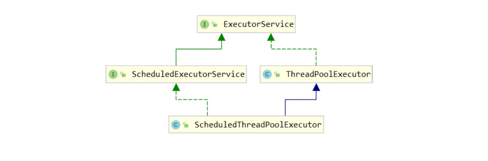

#### 线程池状态

ThreadPoolExecutor 使用 int 的高 3 位来表示线程池状态，低 29 位表示线程数量

| 状态名     | 高3位 | 接收新任务 | 处理阻塞队列任务 | 说明                                      |
| ---------- | ----- | ---------- | ---------------- | ----------------------------------------- |
| RUNNING    | 111   | Y          | Y                |                                           |
| SHUTDOWN   | 000   | N          | Y                | 不会接收新任务，但会处理阻塞队列剩余任务  |
| STOP       | 001   | N          | N                | 会中断正在执行的任务，并抛弃阻塞队列任务  |
| TIDYING    | 010   | -          | -                | 任务全执行完毕，活动线程为 0 即将进入终结 |
| TERMINATED | 011   | -          | -                | 终结状态                                  |

从数字上比较，`TERMINATED > TIDYING > STOP > SHUTDOWN > RUNNING` (高三位第一个符号标志位)

这些信息存储在一个原子变量 ctl 中，目的是将线程池状态与线程个数合二为一，这样就可以用**一次 cas 原子操作进行赋值**

```java
// c 为旧值， ctlOf 返回结果为新值
ctl.compareAndSet(c, ctlOf(targetState, workerCountOf(c))));

// rs 为高 3 位代表线程池状态， wc 为低 29 位代表线程个数，ctl 是合并它们
private static int ctlOf(int rs, int wc) { return rs | wc; }
```


#### 构造方法

```java
public ThreadPoolExecutor(int corePoolSize,
                          int maximumPoolSize,
                          long keepAliveTime,
                          TimeUnit unit,
                          BlockingQueue<Runnable> workQueue,
                          RejectedExecutionHandler handler)
```

* corePoolSize 核心线程数目 (最多保留的线程数)
* maximumPoolSize 最大线程数目 （核心+救急）
* keepAliveTime 生存时间 - 针对救急线程
* unit 时间单位 - 针对救急线程
* workQueue 阻塞队列
* threadFactory 线程工厂 - 可以为线程创建时起个好名字
* handler 拒绝策略

工作方式：

```mermaid
graph LR

subgraph 阻塞队列
size=2
任务3
任务4
end
subgraph 线程池c=2,m=3
救急线程1
t1("核心线程1")-->任务1
t2("核心线程2")-->任务2
end

```

#### 运行过程

* 线程池中刚开始没有线程，当一个任务提交给线程池后，线程池会创建一个新线程来执行任务。
* 当线程数达到 corePoolSize 并没有线程空闲，这时再加入任务，新加的任务会被加入workQueue 队列排队，直到有空闲的线程。
* 如果**队列选择了有界队列**，那么任务超过了队列大小时，会创建 `maximumPoolSize - corePoolSize` 数目的线程来救急。
* 如果线程到达 maximumPoolSize 仍然有新任务这时会执行拒绝策略。拒绝策略 jdk 提供了 4 种实现，其它著名框架也提供了实现
  * AbortPolicy 让调用者抛出 RejectedExecutionException 异常，这是默认策略
  * CallerRunsPolicy 让调用者运行任务
  * DiscardPolicy 放弃本次任务
  * DiscardOldestPolicy 放弃队列中最早的任务，本任务取而代之
  * Dubbo 的实现，在抛出 RejectedExecutionException 异常之前会记录日志，并 dump 线程栈信息，方便定位问题
  * Netty 的实现，是创建一个新线程来执行任务（不限制线程数）
    * netty 这么做也许是因为其需要处理的 io 比较多
    * 而io多会导致线程被阻塞不释放，但CPU在空闲
    * 所以也许对netty来说，这样的策略最高效
  * ActiveMQ 的实现，带超时等待（60s）尝试放入队列，类似我们之前自定义的拒绝策略
  * PinPoint 的实现，它使用了一个拒绝策略链，会逐一尝试策略链中每种拒绝策略
* 当高峰过去后，超过corePoolSize 的救急线程如果一段时间没有任务做，需要结束节省资源，这个时间由keepAliveTime 和 unit 来控制。

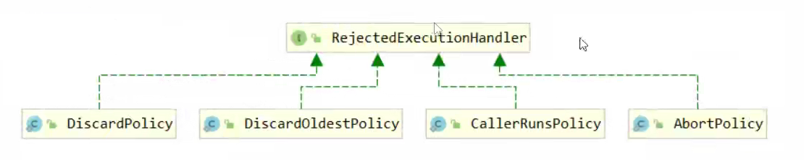

根据这个构造方法，JDK Executors 类中提供了众多工厂方法来创建各种用途的线程池


#### newFixedThreadPool

```java
public static ExecutorService newFixedThreadPool(int nThreads) {
    return new ThreadPoolExecutor(nThreads, nThreads,
                                  0L, TimeUnit.MILLISECONDS,
                                  new LinkedBlockingQueue<Runnable>());
}
```

特点

* 核心线程数 == 最大线程数（没有救急线程被创建），因此也无需超时时间
* 阻塞队列是无界的，可以放任意数量的任务

> **评价** 适用于任务量已知，相对耗时的任务


#### newCachedThreadPool

```java
public static ExecutorService newCachedThreadPool() {
    return new ThreadPoolExecutor(0, Integer.MAX_VALUE,
                                  60L, TimeUnit.SECONDS,
                                  new SynchronousQueue<Runnable>());
}
```

特点

* 核心线程数是 0， 最大线程数是 Integer.MAX_VALUE，救急线程的空闲生存时间是 60s，意味着
  * 全部都是救急线程（60s 后可以回收）
  * 救急线程可以无限创建
* 队列采用了 SynchronousQueue 实现特点是，它没有容量，没有线程来取是放不进去的（一手交钱、一手交货）

```java
SynchronousQueue<Integer> integers = new SynchronousQueue<>();
new Thread(() -> {
    try {
        log.debug("putting {} ", 1);
        integers.put(1);
        log.debug("{} putted...", 1);
        log.debug("putting...{} ", 2);
        integers.put(2);
        log.debug("{} putted...", 2);
    } catch (InterruptedException e) {
        e.printStackTrace();
    }
}, "t1").start();
sleep(1);
new Thread(() -> {
    try {
        log.debug("taking {}", 1);
        integers.take();
    } catch (InterruptedException e) {
        e.printStackTrace();
    }
}, "t2").start();
sleep(1);
new Thread(() -> {
    try {
        log.debug("taking {}", 2);
        integers.take();
    } catch (InterruptedException e) {
        e.printStackTrace();
    }
}, "t3").start();
```

输出

```
18:52:17 [t1] c.TestSynchronousQueue - putting 1 
18:52:18 [t2] c.TestSynchronousQueue - taking 1
18:52:18 [t1] c.TestSynchronousQueue - 1 putted...
18:52:18 [t1] c.TestSynchronousQueue - putting...2 
18:52:19 [t3] c.TestSynchronousQueue - taking 2
18:52:19 [t1] c.TestSynchronousQueue - 2 putted...
```

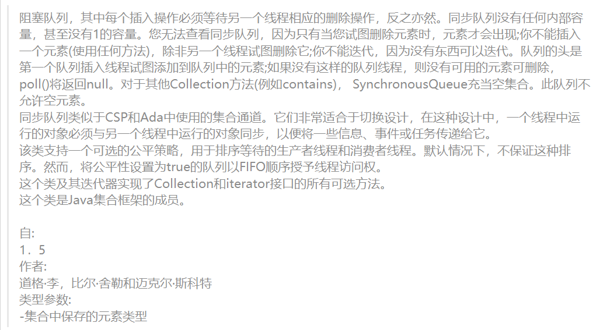

> **评价** 整个线程池表现为线程数会根据任务量不断增长，没有上限，当任务执行完毕，空闲 1分钟后释放线程。 适合任务数比较密集，但每个任务执行时间较短的情况


#### newSingleThreadExecutor

```java
public static ExecutorService newSingleThreadExecutor() {
    return new FinalizableDelegatedExecutorService
        (new ThreadPoolExecutor(1, 1,
                                0L, TimeUnit.MILLISECONDS,
                                new LinkedBlockingQueue<Runnable>()));
}
```

使用场景：

希望多个任务排队执行。线程数固定为 1，任务数多于 1 时，会放入无界队列排队。任务执行完毕，这唯一的线程也不会被释放。

区别：

* 自己创建一个单线程串行执行任务，**如果任务执行失败而终止那么没有任何补救措施，而线程池还会新建一个线程，保证池的正常工作**
* Executors.newSingleThreadExecutor() 线程个数始终为1，不能修改
* FinalizableDelegatedExecutorService 应用的是装饰器模式，只对外暴露了 ExecutorService 接口，因此不能调用 ThreadPoolExecutor 中特有的方法
* Executors.newFixedThreadPool(1) 初始时为1，以后还可以修改
* 对外暴露的是 ThreadPoolExecutor 对象，可以强转后调用 setCorePoolSize 等方法进行修改


#### 提交任务

```java
// 执行任务
void execute(Runnable command);

// 提交任务 task，用返回值 Future 获得任务执行结果
<T> Future<T> submit(Callable<T> task);

// 提交 tasks 中所有任务
<T> List<Future<T>> invokeAll(Collection<? extends Callable<T>> tasks)
										throws InterruptedException;

// 提交 tasks 中所有任务，带超时时间
<T> List<Future<T>> invokeAll(Collection<? extends Callable<T>> tasks,long timeout, TimeUnit unit) throws InterruptedException;

// 提交 tasks 中所有任务，哪个任务先成功执行完毕，返回此任务执行结果，其它任务取消
<T> T invokeAny(Collection<? extends Callable<T>> tasks)
    throws InterruptedException, ExecutionException;

// 提交 tasks 中所有任务，哪个任务先成功执行完毕，返回此任务执行结果，其它任务取消，带超时时间
<T> T invokeAny(Collection<? extends Callable<T>> tasks,long timeout, TimeUnit unit)
	throws InterruptedException, ExecutionException, TimeoutException;
```


#### 关闭线程池

##### shutdown

```java
/*
线程池状态变为 SHUTDOWN
- 不会接收新任务
- 但已提交任务会执行完
- 此方法不会阻塞调用线程的执行
*/
void shutdown();
```

```java
public void shutdown() {
	final ReentrantLock mainLock = this.mainLock;
    mainLock.lock();
    try {
        checkShutdownAccess();
        // 修改线程池状态
        advanceRunState(SHUTDOWN);
        // 仅会打断空闲线程
        interruptIdleWorkers();
        onShutdown(); // 扩展点 ScheduledThreadPoolExecutor
    } finally {
    	mainLock.unlock();
    }
    // 也就是说清理了空闲的线程
    // 尝试终结(没有运行的线程可以立刻终结，如果还有运行的线程也不会等[让线程自己结束])
    tryTerminate();
}
```

##### shutdownNow

```java
/*
线程池状态变为 STOP
- 不会接收新任务
- 会将队列中的任务返回
- 并用 interrupt 的方式中断正在执行的任务
*/
List<Runnable> shutdownNow();
```

```java
public List<Runnable> shutdownNow() {
    List<Runnable> tasks;
    final ReentrantLock mainLock = this.mainLock;
    mainLock.lock();
    try {
        checkShutdownAccess();
        // 修改线程池状态
        advanceRunState(STOP);
        // 打断所有线程
        interruptWorkers();
        // 获取队列中剩余任务
        tasks = drainQueue();
    } finally {
    	mainLock.unlock();
    }
    // 尝试终结
    tryTerminate();
    return tasks;
}
```


#### 其他方法

```java
// 不在 RUNNING 状态的线程池，此方法就返回 true
boolean isShutdown();

// 线程池状态是否是 TERMINATED
boolean isTerminated();

// 调用 shutdown 后，由于调用线程并不会等待所有任务运行结束，因此如果它想在线程池 TERMINATED 后做些事情，可以利用此方法等待
boolean awaitTermination(long timeout, TimeUnit unit) throws InterruptedException;
```


#### 任务调度线程池

在『任务调度线程池』功能加入之前，可以使用` java.util.Timer` 来实现定时功能，Timer 的优点在于简单易用，但由于所有任务都是由同一个线程来调度，因此所有任务都是串行执行的，同一时间只能有一个任务在执行，前一个任务的延迟或异常都将会影响到之后的任务。

```java
Timer timer = new Timer();
TimerTask task1 = new TimerTask() {
    @Override
    public void run() {
        log.debug("task 1");
        sleep(2);
    }
};
TimerTask task2 = new TimerTask() {
    @Override
    public void run() {
        log.debug("task 2");
    }
};
// 使用 timer 添加两个任务，希望它们都在 1s 后执行
// 但由于 timer 内只有一个线程来顺序执行队列中的任务，因此『任务1』的延时，影响了『任务2』的执行
timer.schedule(task1, 1000);
timer.schedule(task2, 1000);
```

输出

```java
21:27:56 [Timer-0] com.wjl.juc.j7.u2.TestTimer - task 1
21:27:58 [Timer-0] com.wjl.juc.j7.u2.TestTimer - task 2
```

##### ScheduledExecutorService

使用 `ScheduledExecutorService `改写：

```java
ScheduledExecutorService service = Executors.newScheduledThreadPool(2);

service.schedule(() -> {
    sleep(3);
    log.debug("task1...");
}, 1, TimeUnit.SECONDS);
service.schedule(() -> {
    System.out.println("task2...");
}, 1000, TimeUnit.MILLISECONDS);
```

输出

```java
21:33:26 [pool-1-thread-2] c.TestScheduledExecutorService - task2...
21:33:29 [pool-1-thread-1] c.TestScheduledExecutorService - task1...
```


`scheduleAtFixedRate `例子：

```java
log.debug("start...");
service.scheduleAtFixedRate(()->{
    log.debug("task...");
},1,2,TimeUnit.SECONDS);
```

输出

```java
21:35:42 [main] c.TestScheduledExecutorService - start...
21:35:43 [pool-1-thread-1] c.TestScheduledExecutorService - task...
21:35:45 [pool-1-thread-1] c.TestScheduledExecutorService - task...
21:35:47 [pool-1-thread-1] c.TestScheduledExecutorService - task...
//...
```


`scheduleAtFixedRate` 例子（任务执行时间超过了间隔时间）：

```java
log.debug("start...");
service.scheduleAtFixedRate(()->{
    sleep(2);
    log.debug("task...");
},1,1,TimeUnit.SECONDS);
```

输出分析：一开始，延时 1s，接下来，由于`任务执行时间 > 间隔时间`，间隔被『撑』到了 2s

意思就是这个真正的时间间隔会取任务执行时长与设置的时间间隔的最大值

```java
21:36:59 [main] c.TestScheduledExecutorService - start...
21:37:02 [pool-1-thread-1] c.TestScheduledExecutorService - task...
21:37:04 [pool-1-thread-1] c.TestScheduledExecutorService - task...
21:37:06 [pool-1-thread-1] c.TestScheduledExecutorService - task...
21:37:08 [pool-1-thread-1] c.TestScheduledExecutorService - task...
21:37:10 [pool-1-thread-1] c.TestScheduledExecutorService - task...
```


```java
/*
创建并执行一个周期性操作，该操作首先在给定的初始延迟之后启用，
然后在一个执行的终止和下一个执行的开始之间使用给定的延迟。
如果任务的任何执行遇到异常，后续执行将被抑制。
否则，任务只会通过取消或终止执行程序来终止。
参数: 命令-执行任务initialDelay -延迟第一次执行的时间
               	  delay -结束一次执行到开始下一个单元之间的延迟-
                  initialDelay和delay参数的时间单位
返回: 一个ScheduledFuture表示待完成任务，它的get()方法将在取消时抛出异常
 */
log.debug("start...");
service.scheduleWithFixedDelay(()->{
    sleep(2);
    log.debug("task...");
},1,1,TimeUnit.SECONDS);
```

输出分析：一开始，延时 1s，scheduleWithFixedDelay 的间隔是 `上一个任务结束 <-> 延时 <-> 下一个任务开始 `所以间隔都是 3s

时间间隔以 上一个任务的正式结束开始

```java
21:43:30 [main] c.TestScheduledExecutorService - start...
21:43:33 [pool-1-thread-1] c.TestScheduledExecutorService - task...
21:43:36 [pool-1-thread-1] c.TestScheduledExecutorService - task...
21:43:39 [pool-1-thread-1] c.TestScheduledExecutorService - task...
21:43:42 [pool-1-thread-1] c.TestScheduledExecutorService - task..
```


> **评价** 整个线程池表现为：线程数固定，任务数多于线程数时，会放入无界队列排队。任务执行完毕，这些线程也不会被释放。用来执行延迟或反复执行的任务


#### 正确处理执行任务异常

##### 1. 手动捕获

注意： ScheduledExecutorService的定时任务和submit(Runable r)不会输出错误栈，但是代码不会正常执行

```java
service.schedule(()->{
    log.debug("task...1");
    try {
        int i = 10/0;
    } catch (Exception e) {
        log.error("error:",e);
        e.printStackTrace(); // throw new RuntimeException(e) 也不会输出
    }
},1,TimeUnit.SECONDS);
```

输出

```java
21:59:03 [pool-1-thread-1] c.TestScheduledExecutorService - task...1
java.lang.ArithmeticException: / by zero
	at com.wjl.juc.j7.u2.TestScheduledExecutorService.lambda$main$0(TestScheduledExecutorService.java:53)
	at java.util.concurrent.Executors$RunnableAdapter.call(Executors.java:511)
	at java.util.concurrent.FutureTask.run(FutureTask.java:266)
	at java.util.concurrent.ScheduledThreadPoolExecutor$ScheduledFutureTask.access$201(ScheduledThreadPoolExecutor.java:180)
	at java.util.concurrent.ScheduledThreadPoolExecutor$ScheduledFutureTask.run(ScheduledThreadPoolExecutor.java:293)
```


##### 2. 使用 Future

```java
ExecutorService pool = Executors.newFixedThreadPool(1);
Future<?> future = pool.submit(() -> {
    int i = 10 / 0;
    log.debug("task....");
});
try {
    System.out.println(future.get());
} catch (InterruptedException | ExecutionException e) {
    throw new RuntimeException(e); // throw new RuntimeException(e) 在线程池的线程中也不会输出
}
```

输出

```java
Exception in thread "main" java.lang.RuntimeException: java.util.concurrent.ExecutionException: java.lang.ArithmeticException: / by zero
	at com.wjl.juc.j7.u2.TestExceptionCatch.main(TestExceptionCatch.java:23)
Caused by: java.util.concurrent.ExecutionException: java.lang.ArithmeticException: / by zero
	at java.util.concurrent.FutureTask.report(FutureTask.java:122)
	at java.util.concurrent.FutureTask.get(FutureTask.java:192)
	at com.wjl.juc.j7.u2.TestExceptionCatch.main(TestExceptionCatch.java:21)
Caused by: java.lang.ArithmeticException: / by zero
	at com.wjl.juc.j7.u2.TestExceptionCatch.lambda$main$0(TestExceptionCatch.java:17)
```


### 3. 应用之定时任务

```java
@Slf4j(topic = "c.TestSchedule")
public class TestSchedule {
    // 如何让每周3 23:00:00 定时执行任务？
    public static void main(String[] args) {
        // 当前时间
        LocalDateTime now = LocalDateTime.now();
        // 获取周3时间
        LocalDateTime time = now.withHour(23).withMinute(0).withSecond(0).withNano(0)
                .with(DayOfWeek.WEDNESDAY);
        // 如果当前时间大于本周3，找下一个周三
        if (now.compareTo(time) > 0) {
            time.plusWeeks(1);
        }
        long start = Duration.between(now, time).toMillis();// 计算差值转换毫秒
        long period = 1000 * 60 * 60 * 24 * 7;
        ScheduledExecutorService service = Executors.newScheduledThreadPool(1);
        
        service.scheduleAtFixedRate(() -> {
            log.debug("task...");
        }, start, period, TimeUnit.MILLISECONDS);
    }
}
```


### 4. Tomcat 线程池

Tomcat 在哪里用到了线程池呢?

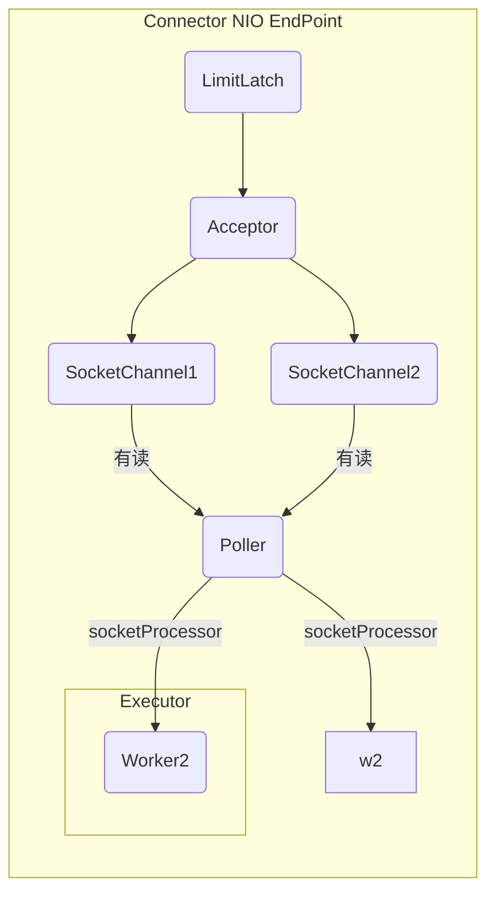
```mermaid
graph LR
subgraph Connector NIO EndPoint
l("LimitLatch")-->a("Acceptor")
a-->s1("SocketChannel1")
a-->s2("SocketChannel2")
s1--有读--> p("Poller")
s2--有读-->p
subgraph Executor
w1("Worker1")
w1("Worker2")
end

p--socketProcessor-->w1
p--socketProcessor-->w2
end

```

* LimitLatch 用来限流，可以控制最大连接个数，类似 J.U.C 中的 Semaphore 后面再讲
* Acceptor 只负责【接收新的 socket 连接】
* Poller 只负责监听 socket channel 是否有【可读的 I/O 事件】
* 一旦可读，封装一个任务对象（socketProcessor），提交给 Executor 线程池处理
* Executor 线程池中的工作线程最终负责【处理请求】


Tomcat 线程池扩展了 ThreadPoolExecutor，行为稍有不同

* 如果总线程数达到 maximumPoolSize

  * 这时不会立刻抛 RejectedExecutionException 异常
  * 而是再次尝试将任务放入队列，如果还失败，才抛出 RejectedExecutionException 异常

  

源码 tomcat-10-1-0

`org.apache.tomcat.util.threads.ThreadPoolExecutor`

```java
public void execute(Runnable command) {
    submittedCount.incrementAndGet();
    try {
        executeInternal(command);
    } catch (RejectedExecutionException rx) {
        if (getQueue() instanceof TaskQueue) {
            // If the Executor is close to maximum pool size, concurrent
            // calls to execute() may result (due to Tomcat's use of
            // TaskQueue) in some tasks being rejected rather than queued.
            // If this happens, add them to the queue.
            final TaskQueue queue = (TaskQueue) getQueue();
            if (!queue.force(command)) {
                submittedCount.decrementAndGet();
                throw new RejectedExecutionException(sm.getString("threadPoolExecutor.queueFull"));
            }
        } else {
            submittedCount.decrementAndGet();
            throw rx;
        }
    }
}
```

TaskQueue.java

```java
public boolean force(Runnable o) {
    if (parent == null || parent.isShutdown()) {
        throw new RejectedExecutionException(sm.getString("taskQueue.notRunning"));
    }
    return super.offer(o); //forces the item onto the queue, to be used if the task is rejected
}
```

Connector 配置

| 配置项              | 默认值 | 说明                                   |
| ------------------- | ------ | -------------------------------------- |
| acceptorThreadCount | 1      | acceptor 线程数量                      |
| pollerThreadCount   | 1      | poller 线程数量                        |
| minSpareThreads     | 10     | 核心线程数，即 corePoolSize            |
| maxThreads          | 200    | 最大线程数，即 maximumPoolSize         |
| executor            | -      | Executor 名称，用来引用下面的 Executor |


Executor 线程配置

| 配置项                  | 默认值            | 说明                                      |
| ----------------------- | ----------------- | ----------------------------------------- |
| threadPriority          | 5                 | 线程优先级                                |
| daemon                  | true              | 是否守护线程                              |
| minSpareThreads         | 25                | 核心线程数，即 corePoolSize               |
| maxThreads              | 200               | 最大线程数，即 maximumPoolSize            |
| maxIdleTime             | 60000             | 线程生存时间，单位是毫秒，默认值即 1 分钟 |
| maxQueueSize            | Integer.MAX_VALUE | 队列长度                                  |
| prestartminSpareThreads | false             | 核心线程是否在服务器启动时启动            |


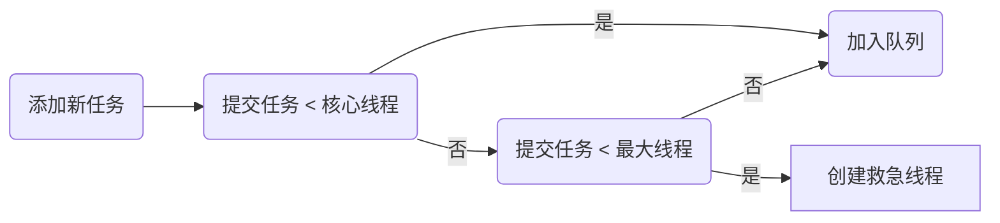
```mermaid
graph LR
t1("添加新任务")-->t2("提交任务 < 核心线程")
t2--是-->j("加入队列")
t2--否-->t3("提交任务 < 最大线程")
t3--否-->j
t3--是-->创建救急线程
```

### 5. Fork/Join

#### 1. 概念

Fork/Join 是 JDK 1.7 加入的新的线程池实现，它体现的是一种分治思想，适用于能够进行任务拆分的 cpu 密集型运算

所谓的任务拆分，是将一个大任务拆分为算法上相同的小任务，直至不能拆分可以直接求解。跟递归相关的一些计算，如归并排序、斐波那契数列、都可以用分治思想进行求解

Fork/Join 在分治的基础上加入了多线程，可以把每个任务的分解和合并交给不同的线程来完成，进一步提升了运算效率

Fork/Join 默认会创建与 cpu 核心数大小相同的线程池


#### 2. 使用

提交给 Fork/Join 线程池的任务需要继承 `RecursiveTask`（有返回值）或 `RecursiveAction`（没有返回值），例如下面定义了一个对`1~n` 之间的整数求和的任务

创建一个任务

```java
@Slf4j(topic = "c.MyTask")
class MyTask extends RecursiveTask<Long> {

    private long n;

    public MyTask(long n) {
        this.n = n;
    }

    @Override
    protected Long compute() {
        if (n == 1) {
            log.debug("return {}",n);
            return n;
        }
        MyTask task = new MyTask(n - 1L);
        task.fork();// 拆分 让一个线程执行该任务
        long result = task.join(); // 获取任务结果
        long sum = result + n;
        log.debug("{} + {} = sum{}",n,result,sum);
        return sum;
    }
	
    @Override
    public String toString() {
        return "{"+n+"}";
    }
}
```

给ForkJoin线程池执行计算

```java
@Slf4j(topic = "c.TestForkJoin")
public class TestForkJoin {
    public static void main(String[] args) {
        ForkJoinPool pool = new ForkJoinPool(4);
        Long sum = pool.invoke(new MyTask(5));// 内部会使用多个线程进行处理
// new MyTask(5) 5 + new MyTask(4) 4 + new MyTask(3) 3 + new MyTask(2) 2 + new MyTask(1)1 = 15
        System.out.println(sum);
    }
}
```

输出

```java
10:38:25 [ForkJoinPool-1-worker-3] c.MyTask - fork() 3 + {2}
10:38:25 [ForkJoinPool-1-worker-0] c.MyTask - fork() 2 + {1}
10:38:25 [ForkJoinPool-1-worker-2] c.MyTask - fork() 4 + {3}
10:38:25 [ForkJoinPool-1-worker-1] c.MyTask - fork() 5 + {4}
10:38:25 [ForkJoinPool-1-worker-0] c.MyTask - join() 1
10:38:25 [ForkJoinPool-1-worker-0] c.MyTask - join() 2 + {1} = 3
10:38:25 [ForkJoinPool-1-worker-3] c.MyTask - join() 3 + {2} = 6
10:38:25 [ForkJoinPool-1-worker-2] c.MyTask - join() 4 + {3} = 10
10:38:25 [ForkJoinPool-1-worker-1] c.MyTask - join() 5 + {4} = 15
15
```


用图来表示

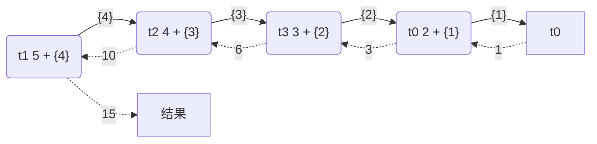
```mermaid
graph LR
t1("t1 5 + {4}")--"{4}"-->t2("t2 4 + {3}")
t2--"{3}"-->t3("t3 3 + {2}")
t3--"{2}"-->t4("t0 2 + {1}")
t4--"{1}"-->t0
t0-.1.->t4
t4-.3.->t3
t3-.6.->t2
t2-.10.->t1
t1-.15.->结果

```


#### 3. 改进

```java
@Slf4j(topic = "c.MyTask")
class MyTask extends RecursiveTask<Long> {

    private long begin;
    private long end;

    public MyTask(long begin, long end) {
        this.begin = begin;
        this.end = end;
    }

    @Override
    public String toString() {
        return "{" + begin + "," + end + "}";
    }

    @Override
    protected Long compute() {
        // 5, 5
        if (begin == end) {
            log.debug("join() {}", begin);
            return begin;
        }
        // 4, 5
        if (end - begin == 1) {
            log.debug("join() {} + {} = {}", begin, end, end + begin);
            return end + begin;
        }

        // 1 5
        long mid = (end + begin) / 2; // 3
        MyTask task1 = new MyTask(begin, mid); // 1  3
        task1.fork();
        MyTask task2 = new MyTask(mid + 1, end); // 4  5
        task2.fork();

        log.debug("fork() {} + {} = ?", task1, task2);
        long result = task1.join() + task2.join();
        log.debug("join() {} + {} = {}", task1, task2, result);
        return result;
    }

}
```

然后提交给 ForkJoinPool 来执行

```java
ForkJoinPool pool = new ForkJoinPool(4);
Long sum = pool.invoke(new MyTask(1, 5));// 内部会使用多个线程进行处理
// new MyTask(5) 5 + new MyTask(4) 4 + new MyTask(3) 3 + new MyTask(2) 2 + new MyTask(1)1 = 15
System.out.println(sum);
```

输出

```java
10:56:15 [ForkJoinPool-1-worker-0] c.MyTask - join() 1 + 2 = 3
10:56:15 [ForkJoinPool-1-worker-2] c.MyTask - fork() {1,2} + {3,3} = ?
10:56:15 [ForkJoinPool-1-worker-0] c.MyTask - join() 3
10:56:15 [ForkJoinPool-1-worker-3] c.MyTask - join() 4 + 5 = 9
10:56:15 [ForkJoinPool-1-worker-1] c.MyTask - fork() {1,3} + {4,5} = ?
10:56:15 [ForkJoinPool-1-worker-2] c.MyTask - join() {1,2} + {3,3} = 6
10:56:15 [ForkJoinPool-1-worker-1] c.MyTask - join() {1,3} + {4,5} = 15
15
```

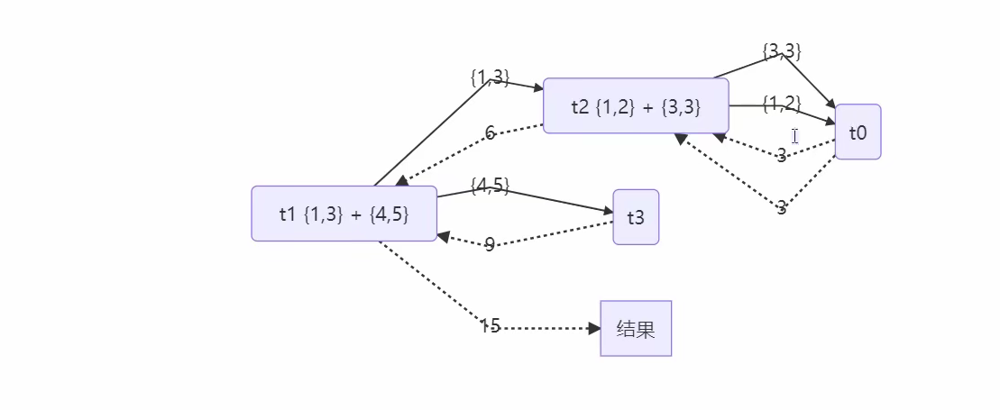


## 7.2 JUC


### <font color="blue" style="font-weight:bold">一、 * AQS 原理</font>


#### 1. 概述

全称是 AbstractQueuedSynchronizer，是阻塞式锁和相关的同步器工具的框架

特点：

* 用 state 属性来表示资源的状态（分独占模式和共享模式），子类需要定义如何维护这个状态，控制如何获取锁和释放锁
  * getState - 获取 state 状态
  * setState - 设置 state 状态
  * compareAndSetState - cas 机制设置 state 状态
  * 独占模式是只有一个线程能够访问资源，而共享模式可以允许多个线程访问资源
* 提供了基于 FIFO 的等待队列，类似于 Monitor 的 EntryList
* 条件变量来实现等待、唤醒机制，支持多个条件变量，类似于 Monitor 的 WaitSet


子类主要实现这样一些方法（默认抛出 UnsupportedOperationException）

* tryAcquire
* tryRelease
* tryAcquireShared
* tryReleaseShared
* isHeldExclusively


获取锁的姿势

```java
// 如果获取锁失败
if (!tryAcquire(arg)) {
	// 入队, 可以选择阻塞当前线程 park unpark
}
```

释放锁的姿势

```java
// 如果释放锁成功
if (tryRelease(arg)) {
	// 让阻塞线程恢复运行
}
```


> AbstractQueuedSynchronizer类的注释上很详细


#### 2. 实现不可重入锁

##### 自定义同步器

Sync

```java
// 独占锁
 class MySync extends AbstractQueuedSynchronizer {
    // private volatile int state;
    @Override
    protected boolean tryAcquire(int arg) {
        if (compareAndSetState(0, 1)) {
            // 加锁 设置owner
            setExclusiveOwnerThread(Thread.currentThread());
            return true;
        }
        return false;
    }

    @Override
    protected boolean tryRelease(int arg) {
        if (getExclusiveOwnerThread().equals(Thread.currentThread())) {
            setExclusiveOwnerThread(null);
            setState(0); // 写屏障 ^^^^^^^^
            return true;
        }
        return false;
    }

    @Override  // 是否持有独占锁
    protected boolean isHeldExclusively() {
        return getExclusiveOwnerThread() == (Thread.currentThread());
    }

    public Condition newCondition() {
        return new ConditionObject();
    }
}
```

##### 自定义锁

Lock

```java
// 不可重入锁
class MyLock implements Lock {

    private MySync sync = new MySync();

    @Override // 尝试，不成功，进入等待队列
    public void lock() {
        sync.acquire(1); // 会调用tryAcquire，不成功放入队列
    }

    @Override // 尝试，不成功，进入等待队列，可打断
    public void lockInterruptibly() throws InterruptedException {
        sync.acquireInterruptibly(1);
    }

    @Override // 尝试一次，不成功返回，不进入队列
    public boolean tryLock() {
        return sync.tryAcquire(1);
    }

    @Override // 尝试，不成功，进入等待队列，有时限
    public boolean tryLock(long time, TimeUnit unit) throws InterruptedException {
        return sync.tryAcquireNanos(1, unit.toNanos(time));
    }

    @Override
    public void unlock() {
        sync.release(1); // 除了调用解锁方法 还会unparkSuccessor(h);唤醒等待队列
    }

    @Override
    public Condition newCondition() {
        return sync.newCondition();
    }
}
```

##### 测试

```java
MyLock lock = new MyLock();
new Thread(() -> {
    lock.lock();
    try {
        log.debug("1...");
        sleep(3L);
    } finally {
        lock.unlock();
    }
}, "t1").start();
new Thread(() -> {
    lock.lock();
    try {
        log.debug("2...");
        sleep(3L);
    } finally {
        lock.unlock();
    }
}, "t2").start();
```

输出

```java
12:47:56 [t1] c.TestAqs - 1...
12:47:59 [t2] c.TestAqs - 2...
```


#### 3. 心得

##### 起源

早期程序员会自己通过一种同步器去实现另一种相近的同步器，例如用可重入锁去实现信号量，或反之。这显然不够优雅，于是在 JSR166（java 规范提案）中创建了 AQS，提供了这种通用的同步器机制。


##### 目标

AQS 要实现的功能目标

* 阻塞版本获取锁 acquire 和非阻塞的版本尝试获取锁 tryAcquire
* 获取锁超时机制
* 通过打断取消机制
* 独占机制及共享机制
* 条件不满足时的等待机制

要实现的性能目标

> Instead, the primary performance goal here is scalability: to predictably maintain efficiency even, or especially, when synchronizers are contended.


##### 设计

AQS 的基本思想其实很简单

获取锁的逻辑

```java
while(state 状态不允许获取) {
    if(队列中还没有此线程) {
    	入队并阻塞
    }
}
当前线程出队
```

释放锁的逻辑

```java
if(state 状态允许了) {
	恢复阻塞的线程(s)
}
```

要点

* 原子维护 state 状态
* 阻塞及恢复线程
* 维护队列

###### 1. state 设计

* state 使用 volatile 配合 cas 保证其修改时的原子性
* state 使用了 32bit int 来维护同步状态，因为当时使用 long 在很多平台下测试的结果并不理想

###### 2. 阻塞恢复设计

* 早期的控制线程暂停和恢复的 api 有 suspend 和 resume，但它们是不可用的，因为如果先调用的 resume那么 suspend 将感知不到

* 解决方法是使用 park & unpark 来实现线程的暂停和恢复，具体原理在之前讲过了，先 unpark 再 park 也没
  问题

* park & unpark 是针对线程的，而不是针对同步器的，因此控制粒度更为精细

* park 线程还可以通过 interrupt 打断

  

###### 3. 队列设计

* 使用了 FIFO 先入先出队列，并不支持优先级队列
* 设计时借鉴了 CLH 队列，它是一种单向无锁队列

```mermaid

```

队列中有 head 和 tail 两个指针节点，都用 volatile 修饰配合 cas 使用每个节点有 state 维护节点状态

入队伪代码，只需要考虑 tail 赋值的原子性

```java
do {
    // 原来的 tail
    Node prev = tail;
    // 用 cas 在原来 tail 的基础上改为 node
} while(tail.compareAndSet(prev, node))
```

出队伪代码

```java
// prev 是上一个节点
while((Node prev=node.prev).state != 唤醒状态) {
}
// 设置头节点
head = node;
```

CLH 好处：

* 无锁，使用自旋
* 快速，无阻塞

AQS 在一些方面改进了 CLH

```java
private Node enq(final Node node) {
    for (; ; ) {
        Node t = tail;
        // 队列中还没有元素 tail 为 null
        if (t == null) {
            // 将 head 从 null -> dummy
            if (compareAndSetHead(new Node()))
                tail = head;
        } else {
            // 将 node 的 prev 设置为原来的 tail
            node.prev = t;
            // 将 tail 从原来的 tail 设置为 node
            if (compareAndSetTail(t, node)) {
                // 原来 tail 的 next 设置为 node
                t.next = node;
                return t;
            }
        }
    }
}
```

###### 主要用到 AQS 的并发工具类

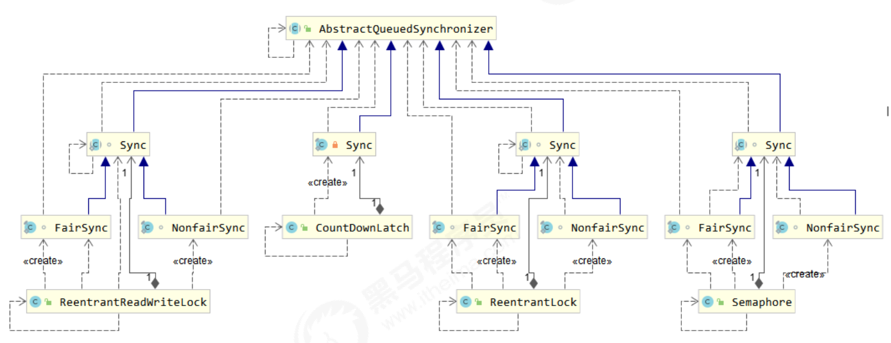


### <font color="blue" style="font-weight:bold">二、 * ReentrantLock原理</font>

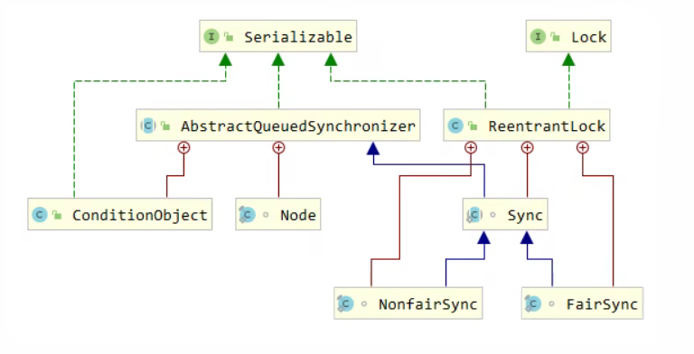

#### 1.  非公平锁实现原理

##### 加锁解锁流程

先从构造器开始看，默认为非公平锁实现

```java
public ReentrantLock() {
	sync = new NonfairSync();
}
```

NonfairSync 继承自 AQS

没有竞争时

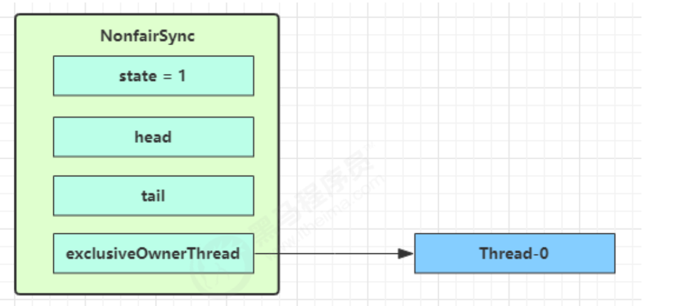

第一个竞争出现时

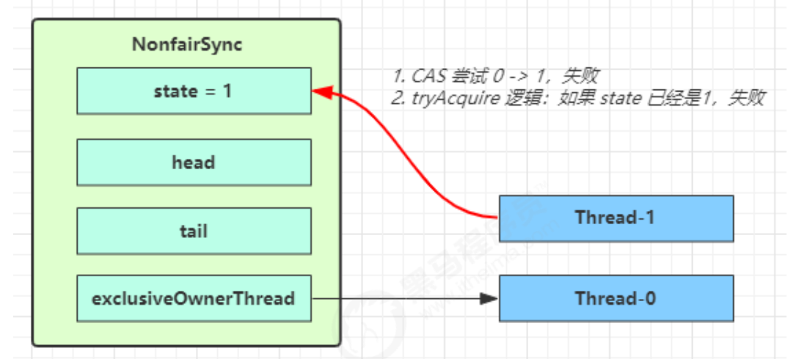

Thread-1 执行了

1. CAS 尝试将 state 由 0 改为 1，结果失败
2. 进入 tryAcquire 逻辑，这时 state 已经是1，结果仍然失败
3. 接下来进入 addWaiter 逻辑，构造 Node 队列
   * 图中黄色三角表示该 Node 的 waitStatus 状态，其中 0 为默认正常状态
   * Node 的创建是懒惰的
   * 其中第一个 Node 称为 Dummy（哑元）或哨兵，用来占位，并不关联线程

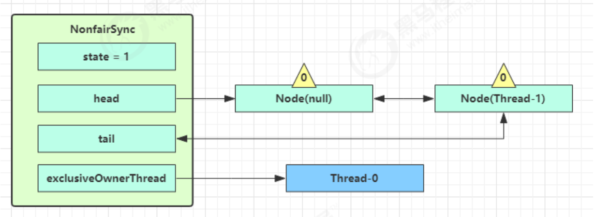

当前线程进入 acquireQueued 逻辑

1. acquireQueued 会在一个死循环中不断尝试获得锁，失败后进入 park 阻塞
2. 如果自己是紧邻着 head（排第二位），那么再次 tryAcquire 尝试获取锁，当然这时 state 仍为 1，失败
3. 进入 shouldParkAfterFailedAcquire 逻辑，将前驱 node，即 head 的 waitStatus 改为 -1，这次返回 false
   1.  -1 表示有职责唤醒后继节点

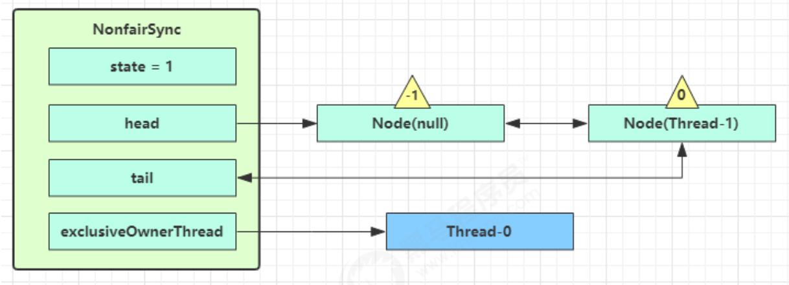

4. shouldParkAfterFailedAcquire 执行完毕回到 acquireQueued ，再次 tryAcquire 尝试获取锁，当然这时state 仍为 1，失败
5. 当再次进入 shouldParkAfterFailedAcquire 时，这时因为其前驱 node 的 waitStatus 已经是 -1，这次返回true
6. 进入 parkAndCheckInterrupt， Thread-1 park（灰色表示）

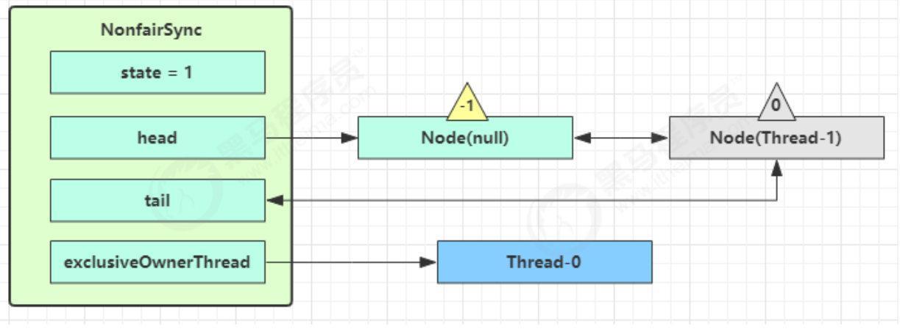

再次有多个线程经历上述过程竞争失败，变成这个样子

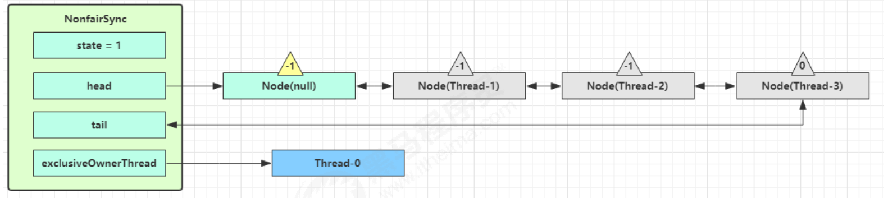

Thread-0 释放锁，进入 tryRelease 流程，如果成功

* 设置 exclusiveOwnerThread 为 null 
* state = 0

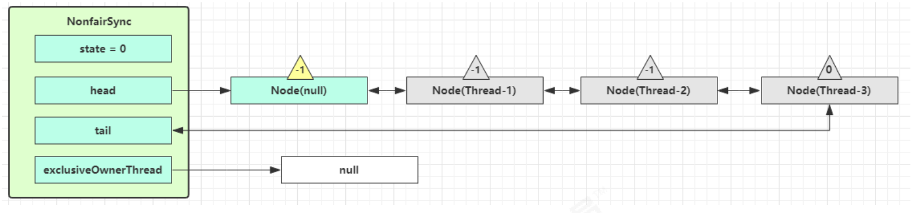

当前队列不为 null，并且 head 的 waitStatus = -1，进入 unparkSuccessor 流程

找到队列中离 head 最近的一个 Node（没取消的），unpark 恢复其运行，本例中即为 Thread-1

回到 Thread-1 的 acquireQueued 流程

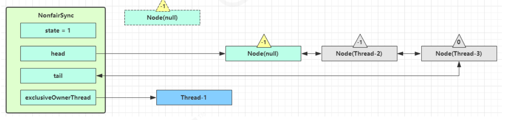

如果加锁成功（没有竞争），会设置

* exclusiveOwnerThread 为 Thread-1，state = 1
* head 指向刚刚 Thread-1 所在的 Node，该 Node 清空 Thread
* 原本的 head 因为从链表断开，而可被垃圾回收

如果这时候有其它线程来竞争（非公平的体现），例如这时有 Thread-4 来了

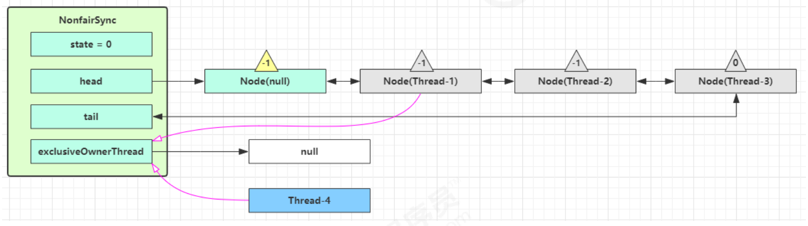

如果不巧又被 Thread-4 占了先

* Thread-4 被设置为 exclusiveOwnerThread，state = 1
* Thread-1 再次进入 acquireQueued 流程，获取锁失败，重新进入 park 阻塞


##### 加锁源码

```java
// Sync 继承自 AQS
static final class NonfairSync extends Sync {
    private static final long serialVersionUID = 7316153563782823691L;

    // 加锁实现	
    final void lock() {
        // 首先用 cas 尝试（仅尝试一次）将 state 从 0 改为 1, 如果成功表示获得了独占锁
        if (compareAndSetState(0, 1))
            setExclusiveOwnerThread(Thread.currentThread());
        else
            // 如果尝试失败，进入 (一)
            acquire(1);
    }
    
    // (一) AQS 继承过来的方法, 方便阅读, 放在此处
    public final void acquire(int arg) {
        // (二) tryAcquire
        if (
                !tryAcquire(arg) &&
                        // 当 tryAcquire 返回为 false 时, 先调用 addWaiter (四), 接着 acquireQueued (五)
                        acquireQueued(addWaiter(Node.EXCLUSIVE), arg)
        ) {
            selfInterrupt();
        }
    }
    
    // (二) 进入 (三)
    protected final boolean tryAcquire(int acquires) {
        return nonfairTryAcquire(acquires);
    }
    
    // (三) Sync 继承过来的方法, 方便阅读, 放在此处
    final boolean nonfairTryAcquire(int acquires) {
        final Thread current = Thread.currentThread();
        int c = getState();
        // 如果还没有获得锁
        if (c == 0) {
            // 尝试用 cas 获得, 这里体现了非公平性: 不去检查 AQS 队列
            if (compareAndSetState(0, acquires)) {
                setExclusiveOwnerThread(current);
                return true;
            }
        }
        // 如果已经获得了锁, 线程还是当前线程, 表示发生了锁重入
        else if (current == getExclusiveOwnerThread()) {
            // state++
            int nextc = c + acquires;
            if (nextc < 0) // overflow
                throw new Error("Maximum lock count exceeded");
            setState(nextc);
            return true;
        }
        // 获取失败, 回到调用处
        return false;
    }
    
    // (四) AQS 继承过来的方法, 方便阅读, 放在此处
    private Node addWaiter(Node mode) {
        // 将当前线程关联到一个 Node 对象上, 模式为独占模式
        Node node = new Node(Thread.currentThread(), mode);
        // 如果 tail 不为 null, cas 尝试将 Node 对象加入 AQS 队列尾部
        Node pred = tail;
        if (pred != null) {
            node.prev = pred;
            if (compareAndSetTail(pred, node)) {
                // 双向链表
                pred.next = node;
                return node;
            }
        }
        // 尝试将 Node 加入 AQS, 进入 (六)
        enq(node);
        return node;
    }
    
    // (六) AQS 继承过来的方法, 方便阅读, 放在此处
    private Node enq(final Node node) {
        for (;;) {
            Node t = tail;
            if (t == null) {
                // 还没有, 设置 head 为哨兵节点（不对应线程，状态为 0）
                if (compareAndSetHead(new Node())) {
                    tail = head;
                }
            } else {
                // cas 尝试将 Node 对象加入 AQS 队列尾部
                node.prev = t;
                if (compareAndSetTail(t, node)) {
                    t.next = node;
                    return t;
                }
            }
        }
    }
    
    // (五) AQS 继承过来的方法, 方便阅读, 放在此处
    final boolean acquireQueued(final Node node, int arg) {
        boolean failed = true;
        try {
            boolean interrupted = false;
            for (;;) {
                final Node p = node.predecessor();
                // 上一个节点是 head, 表示轮到自己（当前线程对应的 node）了, 尝试获取
                if (p == head && tryAcquire(arg)) {
                    // 获取成功, 设置自己（当前线程对应的 node）为 head
                    setHead(node);
                    // 上一个节点 help GC
                    p.next = null;
                    failed = false;
                    // 返回中断标记 false
                    return interrupted;
                }
                if (
                    // 判断是否应当 park, 进入 (七)
                        shouldParkAfterFailedAcquire(p, node) &&
                                // park 等待, 此时 Node 的状态被置为 Node.SIGNAL (八)
                                parkAndCheckInterrupt()
                ) {
                    interrupted = true;
                }
            }
        } finally {
            if (failed)
                cancelAcquire(node);
        }
    }
    
    // (七) AQS 继承过来的方法, 方便阅读, 放在此处
    private static boolean shouldParkAfterFailedAcquire(Node pred, Node node) {
        // 获取上一个节点的状态
        int ws = pred.waitStatus;
        if (ws == Node.SIGNAL) {
            // 上一个节点都在阻塞, 那么自己也阻塞好了
            return true;
        }
        // > 0 表示取消状态
        if (ws > 0) {
            // 上一个节点取消, 那么重构删除前面所有取消的节点, 返回到外层循环重试
            do {
                node.prev = pred = pred.prev;
            } while (pred.waitStatus > 0);
            pred.next = node;
        } else {
            // 这次还没有阻塞
            // 但下次如果重试不成功, 则需要阻塞，这时需要设置上一个节点状态为 Node.SIGNAL
            compareAndSetWaitStatus(pred, ws, Node.SIGNAL);
        }
        return false;
    }
    
    // (八) 阻塞当前线程
    private final boolean parkAndCheckInterrupt() {
        LockSupport.park(this);
        return Thread.interrupted();
    }
}
```

> **注意**：
>
> 是否需要 unpark 是由当前节点的前驱节点的 waitStatus == Node.SIGNAL 来决定
>
> 而不是本节点的waitStatus 决定


##### 解锁源码

```java
// Sync 继承自 AQS
static final class NonfairSync extends Sync {
    // 解锁实现
    public void unlock() {
        sync.release(1);
    }

    // AQS 继承过来的方法, 方便阅读, 放在此处
    public final boolean release(int arg) {
        // 尝试释放锁, 进入 (一)
        if (tryRelease(arg)) {
            // 队列头节点 unpark
            Node h = head;
            if (
                // 队列不为 null
                h != null &&
                // waitStatus == Node.SIGNAL 才需要 unpark
                h.waitStatus != 0
            ) {
                // unpark AQS 中等待的线程, 进入 (二)
                unparkSuccessor(h);
            }
            return true;
        }
        return false;
    }

    // (一) Sync 继承过来的方法, 方便阅读, 放在此处
    protected final boolean tryRelease(int releases) {
        // state--
        int c = getState() - releases;
        if (Thread.currentThread() != getExclusiveOwnerThread())
            throw new IllegalMonitorStateException();
        boolean free = false;
        // 支持锁重入, 只有 state 减为 0, 才释放成功
        if (c == 0) {
            free = true;
            setExclusiveOwnerThread(null);
        }
        setState(c);
        return free;
    }

    // (二) AQS 继承过来的方法, 方便阅读, 放在此处
    private void unparkSuccessor(Node node) {
        // 如果状态为 Node.SIGNAL 尝试重置状态为 0
        // 不成功也可以
        int ws = node.waitStatus;
        if (ws < 0) {
            compareAndSetWaitStatus(node, ws, 0);
        }
        // 找到需要 unpark 的节点, 但本节点从 AQS 队列中脱离, 是由唤醒节点完成的
        Node s = node.next;
        // 不考虑已取消的节点, 从 AQS 队列从后至前找到队列最前面需要 unpark 的节点
        if (s == null || s.waitStatus > 0) {
            s = null;
            for (Node t = tail; t != null && t != node; t = t.prev)
                if (t.waitStatus <= 0)
                    s = t;
        }
        if (s != null)
            LockSupport.unpark(s.thread);
    }
}
```


#### 2. 可重入原理

```java
static final class NonfairSync extends Sync {
    // ...
    // Sync 继承过来的方法, 方便阅读, 放在此处
    final boolean nonfairTryAcquire(int acquires) {
        final Thread current = Thread.currentThread();
        int c = getState();
        if (c == 0) {
            if (compareAndSetState(0, acquires)) {
                setExclusiveOwnerThread(current);
                return true;
            }
        }
        // 如果已经获得了锁, 线程还是当前线程, 表示发生了锁重入
        else if (current == getExclusiveOwnerThread()) {
            // state++
            int nextc = c + acquires;
            if (nextc < 0) // overflow
                throw new Error("Maximum lock count exceeded");
            setState(nextc);
            return true;
        }
        return false;
    }
    // Sync 继承过来的方法, 方便阅读, 放在此处
    protected final boolean tryRelease(int releases) {
        // state--
        int c = getState() - releases;
        if (Thread.currentThread() != getExclusiveOwnerThread())
            throw new IllegalMonitorStateException();
        boolean free = false;
        // 支持锁重入, 只有 state 减为 0, 才释放成功
        if (c == 0) {
            free = true;
            setExclusiveOwnerThread(null);
        }
        setState(c);
        return free;
    }
}
```


#### 3. 可打断原理

##### 不可打断模式

在此模式下，即使它被打断，仍会驻留在 AQS 队列中，一直要等到获得锁后方能得知自己被打断了

```java
// Sync 继承自 AQS
static final class NonfairSync extends Sync {
    // ...
    private final boolean parkAndCheckInterrupt() {
        // 如果打断标记已经是 true, 则 park 会失效
        LockSupport.park(this);
        // interrupted 会清除打断标记
        return Thread.interrupted();
    }

    final boolean acquireQueued(final Node node, int arg) {
        boolean failed = true;
        try {
            boolean interrupted = false;
            for (; ; ) {
                final Node p = node.predecessor();
                if (p == head && tryAcquire(arg)) {
                    setHead(node);
                    p.next = null;
                    failed = false;
                    // 还是需要获得锁后, 才能返回打断状态
                    return interrupted;
                }
                if (
                        shouldParkAfterFailedAcquire(p, node) &&
                                parkAndCheckInterrupt()
                ) {
                    // 如果是因为 interrupt 被唤醒, 返回打断状态为 true
                    interrupted = true;
                }
            }
        } finally {
            if (failed)
                cancelAcquire(node);
        }
    }

    public final void acquire(int arg) {
        if (
                !tryAcquire(arg) &&
                        acquireQueued(addWaiter(Node.EXCLUSIVE), arg)
        ) {
            // 如果打断状态为 true
            selfInterrupt();
        }
    }

    static void selfInterrupt() {
        // 重新产生一次中断
        Thread.currentThread().interrupt();
    }
}
```

##### 可打断模式

```java
static final class NonfairSync extends Sync {
    public final void acquireInterruptibly(int arg) throws InterruptedException {
        if (Thread.interrupted())
            throw new InterruptedException();
        // 如果没有获得到锁, 进入 (一)
        if (!tryAcquire(arg))
            doAcquireInterruptibly(arg);
    }

    // (一) 可打断的获取锁流程
    private void doAcquireInterruptibly(int arg) throws InterruptedException {
        final Node node = addWaiter(Node.EXCLUSIVE);
        boolean failed = true;
        try {
            for (; ; ) {
                final Node p = node.predecessor();
                if (p == head && tryAcquire(arg)) {
                    setHead(node);
                    p.next = null; // help GC
                    failed = false;
                    return;
                }
                if (shouldParkAfterFailedAcquire(p, node) &&
                        parkAndCheckInterrupt()) {
                    // 在 park 过程中如果被 interrupt 会进入此
                    // 这时候抛出异常, 而不会再次进入 for (;;)
                    throw new InterruptedException();
                }
            }
        } finally {
            if (failed)
                cancelAcquire(node);
        }
    }
}
```


#### 4. 公平锁实现原理

```java
static final class FairSync extends Sync {
    private static final long serialVersionUID = -3000897897090466540L;

    final void lock() {
        acquire(1);
    }

    // AQS 继承过来的方法, 方便阅读, 放在此处
    public final void acquire(int arg) {
        if (
                !tryAcquire(arg) &&
                        acquireQueued(addWaiter(Node.EXCLUSIVE), arg)
        ) {
            selfInterrupt();
        }
    }

    // 与非公平锁主要区别在于 tryAcquire 方法的实现
    protected final boolean tryAcquire(int acquires) {
        final Thread current = Thread.currentThread();
        int c = getState();
        if (c == 0) {
            // 先检查 AQS 队列中是否有前驱节点, 没有才去竞争
            if (!hasQueuedPredecessors() &&
                    compareAndSetState(0, acquires)) {
                setExclusiveOwnerThread(current);
                return true;
            }
        } else if (current == getExclusiveOwnerThread()) {
            int nextc = c + acquires;
            if (nextc < 0)
                throw new Error("Maximum lock count exceeded");
            setState(nextc);
            return true;
        }
        return false;
    }

    // (一) AQS 继承过来的方法, 方便阅读, 放在此处
    public final boolean hasQueuedPredecessors() {
        Node t = tail;
        Node h = head;
        Node s;
        // h != t 时表示队列中有 Node
        return h != t &&
                (
                        // (s = h.next) == null 表示队列中还有没有老二
                        (s = h.next) == null ||
                                // 或者队列中老二线程不是此线程
                                s.thread != Thread.currentThread()
                );
    }
}
```


#### 5. 条件变量原理

每个条件变量其实就对应着一个等待队列，其实现类是 ConditionObject

##### await流程

开始 Thread-0 持有锁，调用 await，进入 ConditionObject 的 addConditionWaiter 流程

创建新的 Node 状态为 -2（Node.CONDITION），关联 Thread-0，加入等待队列尾部

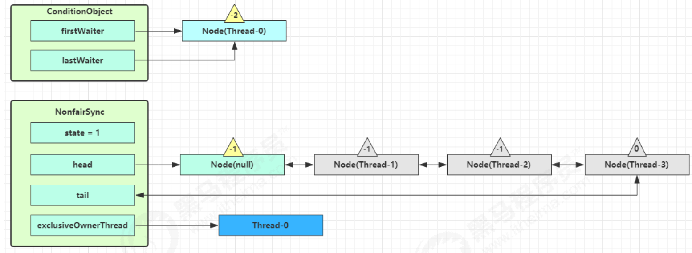

接下来进入 AQS 的 fullyRelease 流程，释放同步器上的锁

```java
final int fullyRelease(Node node) {
    boolean failed = true;
    try {
        // 保存awiat前的锁计数
        int savedState = getState();
        // 直接释放锁
        if (release(savedState)) {// --> unparkSuccessor(h);唤醒后继节点
            failed = false;
            return savedState;
        } else {
            throw new IllegalMonitorStateException();
        }
    } finally {
        if (failed)
            node.waitStatus = Node.CANCELLED;
    }
}
```

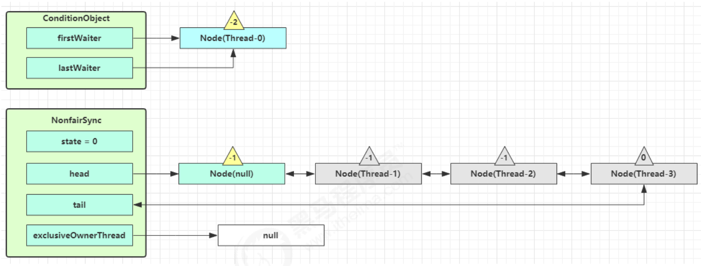

unpark AQS 队列中的下一个节点，竞争锁，假设没有其他竞争线程，那么 Thread-1 竞争成功

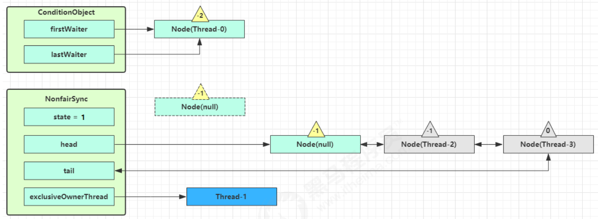

park 阻塞 Thread-0

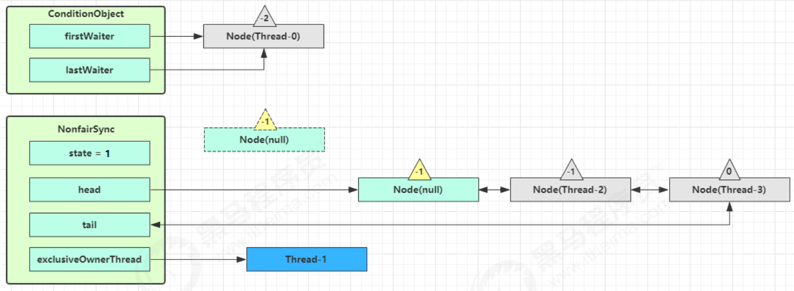


##### signal 流程

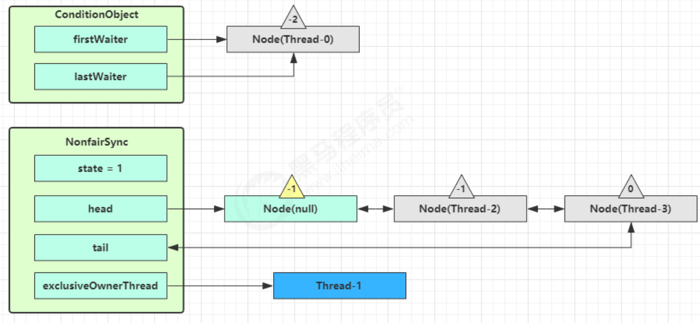

进入 ConditionObject 的 doSignal 流程，取得等待队列中第一个 Node，即 Thread-0 所在 Node

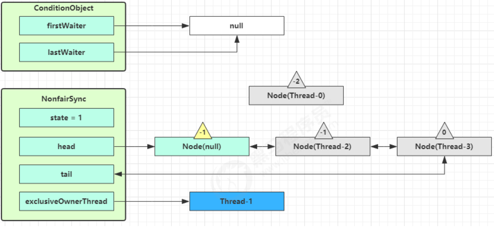

执行 transferForSignal 流程，将该 Node 加入 AQS 队列尾部，将 Thread-0 的 waitStatus 改为 0，Thread-3 的waitStatus 改为 -1

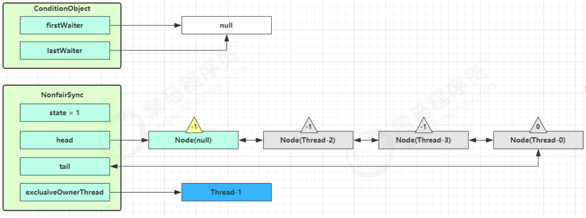

Thread-1 释放锁，进入 unlock 流程，略


##### 源码

```java
public class ConditionObject implements Condition, java.io.Serializable {
    private static final long serialVersionUID = 1173984872572414699L;
    // 第一个等待节点
    private transient Node firstWaiter;
    // 最后一个等待节点
    private transient Node lastWaiter;

    public ConditionObject() {
    }

    // (一) 添加一个 Node 至等待队列
    private Node addConditionWaiter() {
        Node t = lastWaiter;
        // 所有已取消的 Node 从队列链表删除, 见 (二)
        if (t != null && t.waitStatus != Node.CONDITION) {
            unlinkCancelledWaiters();
            t = lastWaiter;
        }
        // 创建一个关联当前线程的新 Node, 添加至队列尾部
        Node node = new Node(Thread.currentThread(), Node.CONDITION);
        if (t == null)
            firstWaiter = node;
        else
            t.nextWaiter = node;
        lastWaiter = node;
        return node;
    }

    // 唤醒 - 将没取消的第一个节点转移至 AQS 队列
    private void doSignal(Node first) {
        do {
            // 已经是尾节点了
            if ((firstWaiter = first.nextWaiter) == null) {
                lastWaiter = null;
            }
            first.nextWaiter = null;
        } while (
                // 将等待队列中的 Node 转移至 AQS 队列, 不成功且还有节点则继续循环 (三)
                !transferForSignal(first) &&
                    // 队列还有节点
                        (first = firstWaiter) != null
        );
    }

    // 外部类方法, 方便阅读, 放在此处
    // (三) 如果节点状态是取消, 返回 false 表示转移失败, 否则转移成功
    final boolean transferForSignal(Node node) {
        // 如果状态已经不是 Node.CONDITION, 说明被取消了
        if (!compareAndSetWaitStatus(node, Node.CONDITION, 0))
            return false;
        // 加入 AQS 队列尾部
        Node p = enq(node);
        int ws = p.waitStatus;
        if (
        // 上一个节点被取消
                ws > 0 ||
        // 上一个节点不能设置状态为 Node.SIGNAL
                        !compareAndSetWaitStatus(p, ws, Node.SIGNAL)
        ) {
            // unpark 取消阻塞, 让线程重新同步状态
            LockSupport.unpark(node.thread);
        }
        return true;
    }

    // 全部唤醒 - 等待队列的所有节点转移至 AQS 队列
    private void doSignalAll(Node first) {
        lastWaiter = firstWaiter = null;
        do {
            Node next = first.nextWaiter;
            first.nextWaiter = null;
            transferForSignal(first);
            first = next;
        } while (first != null);
    }

    // (二)
    private void unlinkCancelledWaiters() {
    // ...
    }

    // 唤醒 - 必须持有锁才能唤醒, 因此 doSignal 内无需考虑加锁
    public final void signal() {
        if (!isHeldExclusively())
            throw new IllegalMonitorStateException();
        Node first = firstWaiter;
        if (first != null)
            doSignal(first);
    }

    // 全部唤醒 - 必须持有锁才能唤醒, 因此 doSignalAll 内无需考虑加锁
    public final void signalAll() {
        if (!isHeldExclusively())
            throw new IllegalMonitorStateException();
        Node first = firstWaiter;
        if (first != null)
            doSignalAll(first);
    }

    // 不可打断等待 - 直到被唤醒
    public final void awaitUninterruptibly() {
        // 添加一个 Node 至等待队列, 见 (一)
        Node node = addConditionWaiter();
        // 释放节点持有的锁, 见 (四)
        int savedState = fullyRelease(node);
        boolean interrupted = false;
        // 如果该节点还没有转移至 AQS 队列, 阻塞
        while (!isOnSyncQueue(node)) {
            // park 阻塞
            LockSupport.park(this);
            // 如果被打断, 仅设置打断状态
            if (Thread.interrupted())
                interrupted = true;
        }
        // 唤醒后, 尝试竞争锁, 如果失败进入 AQS 队列
        if (acquireQueued(node, savedState) || interrupted)
            selfInterrupt();
    }

    // 外部类方法, 方便阅读, 放在此处
    // (四) 因为某线程可能重入，需要将 state 全部释放
    final int fullyRelease(Node node) {
        boolean failed = true;
        try {
            int savedState = getState();
            if (release(savedState)) {
                failed = false;
                return savedState;
            } else {
                throw new IllegalMonitorStateException();
            }
        } finally {
            if (failed)
                node.waitStatus = Node.CANCELLED;
        }
    }

    // 打断模式 - 在退出等待时重新设置打断状态
    private static final int REINTERRUPT = 1;
    // 打断模式 - 在退出等待时抛出异常
    private static final int THROW_IE = -1;

    // 判断打断模式
    private int checkInterruptWhileWaiting(Node node) {
        return Thread.interrupted() ?
                (transferAfterCancelledWait(node) ? THROW_IE : REINTERRUPT) :
                0;
    }

    // (五) 应用打断模式
    private void reportInterruptAfterWait(int interruptMode)
            throws InterruptedException {
        if (interruptMode == THROW_IE)
            throw new InterruptedException();
        else if (interruptMode == REINTERRUPT)
            selfInterrupt();
    }

    // 等待 - 直到被唤醒或打断
    public final void await() throws InterruptedException {
        if (Thread.interrupted()) {
            throw new InterruptedException();
        }
        // 添加一个 Node 至等待队列, 见 (一)
        Node node = addConditionWaiter();
        // 释放节点持有的锁
        int savedState = fullyRelease(node);
        int interruptMode = 0;
        // 如果该节点还没有转移至 AQS 队列, 阻塞
        while (!isOnSyncQueue(node)) {
            // park 阻塞
            LockSupport.park(this);
            // 如果被打断, 退出等待队列
            if ((interruptMode = checkInterruptWhileWaiting(node)) != 0)
                break;
        }
        // 退出等待队列后, 还需要获得 AQS 队列的锁
        if (acquireQueued(node, savedState) && interruptMode != THROW_IE)
            interruptMode = REINTERRUPT;
        // 所有已取消的 Node 从队列链表删除, 见 (二)
        if (node.nextWaiter != null)
            unlinkCancelledWaiters();
        // 应用打断模式, 见 (五)
        if (interruptMode != 0)
            reportInterruptAfterWait(interruptMode);
    }

    // 等待 - 直到被唤醒或打断或超时
    public final long awaitNanos(long nanosTimeout) throws InterruptedException {
        if (Thread.interrupted()) {
            throw new InterruptedException();
        }
        // 添加一个 Node 至等待队列, 见 (一)
        Node node = addConditionWaiter();
        // 释放节点持有的锁
        int savedState = fullyRelease(node);
        // 获得最后期限
        final long deadline = System.nanoTime() + nanosTimeout;
        int interruptMode = 0;
        // 如果该节点还没有转移至 AQS 队列, 阻塞
        while (!isOnSyncQueue(node)) {
            // 已超时, 退出等待队列
            if (nanosTimeout <= 0L) {
                transferAfterCancelledWait(node);
                break;
            }
            // park 阻塞一定时间, spinForTimeoutThreshold 为 1000 ns
            if (nanosTimeout >= spinForTimeoutThreshold)
                LockSupport.parkNanos(this, nanosTimeout);
            // 如果被打断, 退出等待队列
            if ((interruptMode = checkInterruptWhileWaiting(node)) != 0)
                break;
            nanosTimeout = deadline - System.nanoTime();
        }
        // 退出等待队列后, 还需要获得 AQS 队列的锁
        if (acquireQueued(node, savedState) && interruptMode != THROW_IE)
            interruptMode = REINTERRUPT;
        // 所有已取消的 Node 从队列链表删除, 见 (二)
        if (node.nextWaiter != null)
            unlinkCancelledWaiters();
        // 应用打断模式, 见 (五)
        if (interruptMode != 0)
            reportInterruptAfterWait(interruptMode);
        return deadline - System.nanoTime();
    }

    // 等待 - 直到被唤醒或打断或超时, 逻辑类似于 awaitNanos
    public final boolean awaitUntil(Date deadline) throws InterruptedException {
        // ...
    }

    // 等待 - 直到被唤醒或打断或超时, 逻辑类似于 awaitNanos
    public final boolean await(long time, TimeUnit unit) throws InterruptedException {
        // ...
    }
    // 工具方法 省略 ...
}
```


### 三、 读写锁


#### 1. ReentrantReadWriteLock

当读操作远远高于写操作时，这时候使用 读写锁 让` 读-读 `可以并发，提高性能。 类似于数据库中的` select ... from ... lock in share mode`

提供一个 `数据容器类 `内部分别使用读锁保护数据的` read() `方法，写锁保护数据的` write() `方法

```java
@Slf4j
class DataContainer {
    private Object data;
    private ReentrantReadWriteLock rw = new ReentrantReadWriteLock();
    private ReentrantReadWriteLock.ReadLock r = rw.readLock();
    private ReentrantReadWriteLock.WriteLock w = rw.writeLock();

    public Object read() {
        log.debug("获取读锁...");
        r.lock();
        try {
            log.debug("读取");
            sleep(1);
            return data;
        } finally {
            log.debug("释放读锁...");
            r.unlock();
        }
    }

    public void write() {
        log.debug("获取写锁...");
        w.lock();
        try {
            log.debug("写入");
            sleep(1);
        } finally {
            log.debug("释放写锁...");
            w.unlock();
        }
    }
}
```


测试 `读锁-读锁`可以并发

```java
DataContainer container = new DataContainer();
List<Thread> ts= new ArrayList<>();
for (int i = 0; i < 10; i++) {
    ts.add(new Thread(()->{
        container.read();
    },"t"+i));
}
ts.forEach(Thread::start);
```

```java
18:50:48 [t1] com.wjl.juc.j7.juc.DataContainer - 获取读锁...
18:50:48 [t2] com.wjl.juc.j7.juc.DataContainer - 获取读锁...
18:50:48 [t1] com.wjl.juc.j7.juc.DataContainer - 读取
18:50:48 [t0] com.wjl.juc.j7.juc.DataContainer - 获取读锁...
18:50:48 [t2] com.wjl.juc.j7.juc.DataContainer - 读取
18:50:48 [t0] com.wjl.juc.j7.juc.DataContainer - 读取
18:50:49 [t2] com.wjl.juc.j7.juc.DataContainer - 释放读锁...
18:50:49 [t1] com.wjl.juc.j7.juc.DataContainer - 释放读锁...
18:50:49 [t0] com.wjl.juc.j7.juc.DataContainer - 释放读锁...
```

测试 `读锁-写锁 `相互阻塞

```java
DataContainer container = new DataContainer();
List<Thread> ts= new ArrayList<>();
for (int i = 0; i < 4; i++) {
    final int j = i;
    ts.add(new Thread(()->{
        if(j % 2 == 0){
            container.read();
        }else {
            container.write();
        }
    },"t"+i));
}
ts.forEach(Thread::start);
```

```java
18:52:56 [t3] com.wjl.juc.j7.juc.DataContainer - 获取写锁...
18:52:56 [t2] com.wjl.juc.j7.juc.DataContainer - 获取读锁...
18:52:56 [t3] com.wjl.juc.j7.juc.DataContainer - 写入
18:52:56 [t1] com.wjl.juc.j7.juc.DataContainer - 获取写锁...
18:52:56 [t0] com.wjl.juc.j7.juc.DataContainer - 获取读锁...
18:52:57 [t3] com.wjl.juc.j7.juc.DataContainer - 释放写锁...
18:52:57 [t1] com.wjl.juc.j7.juc.DataContainer - 写入
18:52:58 [t1] com.wjl.juc.j7.juc.DataContainer - 释放写锁...
18:52:58 [t2] com.wjl.juc.j7.juc.DataContainer - 读取
18:52:58 [t0] com.wjl.juc.j7.juc.DataContainer - 读取
18:52:59 [t2] com.wjl.juc.j7.juc.DataContainer - 释放读锁...
18:52:59 [t0] com.wjl.juc.j7.juc.DataContainer - 释放读锁...
```

`写锁-写锁` 也是相互阻塞的

```java
DataContainer container = new DataContainer();
List<Thread> ts= new ArrayList<>();
for (int i = 0; i < 4; i++) {
    final int j = i;
    ts.add(new Thread(()->{
        container.write();
    },"t"+i));
}
ts.forEach(Thread::start);
```

```java
18:57:24 [t0] com.wjl.juc.j7.juc.DataContainer - 获取写锁...
18:57:24 [t3] com.wjl.juc.j7.juc.DataContainer - 获取写锁...
18:57:24 [t2] com.wjl.juc.j7.juc.DataContainer - 获取写锁...
18:57:24 [t1] com.wjl.juc.j7.juc.DataContainer - 获取写锁...
18:57:24 [t0] com.wjl.juc.j7.juc.DataContainer - 写入
18:57:25 [t0] com.wjl.juc.j7.juc.DataContainer - 释放写锁...
18:57:25 [t3] com.wjl.juc.j7.juc.DataContainer - 写入
18:57:26 [t3] com.wjl.juc.j7.juc.DataContainer - 释放写锁...
18:57:26 [t2] com.wjl.juc.j7.juc.DataContainer - 写入
18:57:27 [t2] com.wjl.juc.j7.juc.DataContainer - 释放写锁...
18:57:27 [t1] com.wjl.juc.j7.juc.DataContainer - 写入
18:57:28 [t1] com.wjl.juc.j7.juc.DataContainer - 释放写锁...
```


#### 2. 注意事项

* 读锁不支持条件变量
* 重入时升级不支持：即持有读锁的情况下去获取写锁，会导致获取写锁永久等待

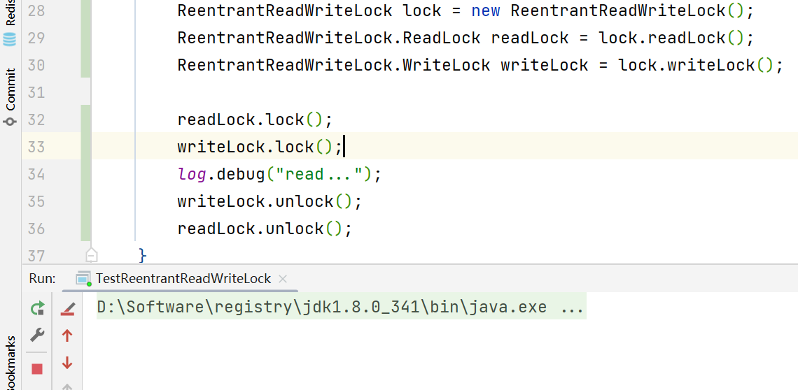


* 重入时降级支持：即持有写锁的情况下去获取读锁

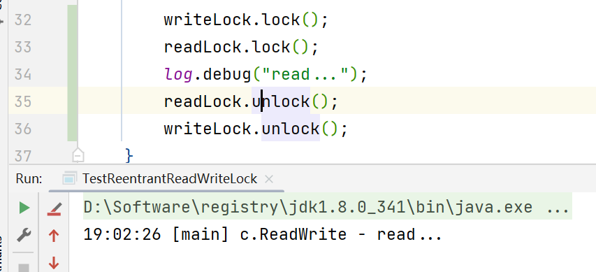

```java
class CachedData {
    Object data;
    // 是否有效，如果失效，需要重新计算 data
    volatile boolean cacheValid;
    final ReentrantReadWriteLock rwl = new ReentrantReadWriteLock();
    
    void processCachedData() {
        rwl.readLock().lock();
        if (!cacheValid) {
            // 获取写锁前必须释放读锁
            rwl.readLock().unlock();
            rwl.writeLock().lock();
            try {
                // 判断是否有其它线程已经获取了写锁、更新了缓存, 避免重复更新
                if (!cacheValid) {
                    data = ...
                    cacheValid = true;
                }
                // 降级为读锁, 释放写锁, 这样能够让其它线程读取缓存
                rwl.readLock().lock();
            } finally {
                rwl.writeLock().unlock();
            }
        }
        // 自己用完数据, 释放读锁
        try {
            use(data);
        } finally {
            rwl.readLock().unlock();
        }
    }
}
```


### <font color="blue" style="font-weight:bold">四、 * 读写锁原理</font>

读写锁用的是同一个 Sycn 同步器，因此等待队列、state 等也是同一个


#### 1. 图解流程

##### t1 w.lock，t2 r.lock

1. t1 成功上锁，流程与 ReentrantLock 加锁相比没有特殊之处，不同是写锁状态占了 state 的低 16 位，而读锁使用的是 state 的高 16 位
   1. 判断当前有无锁
   2. 有 
      1. 判断不是写锁
      2. 不是 加锁失败 是的话判断是否自己 不是就失败， 是就state+1 表示重入
   3. 没有
      1. 是否阻塞节点前面有正在等待的
         1. 公平锁 有就直接加锁失败
         2. 非公平锁 不管 将锁设置上 owner为当前线程

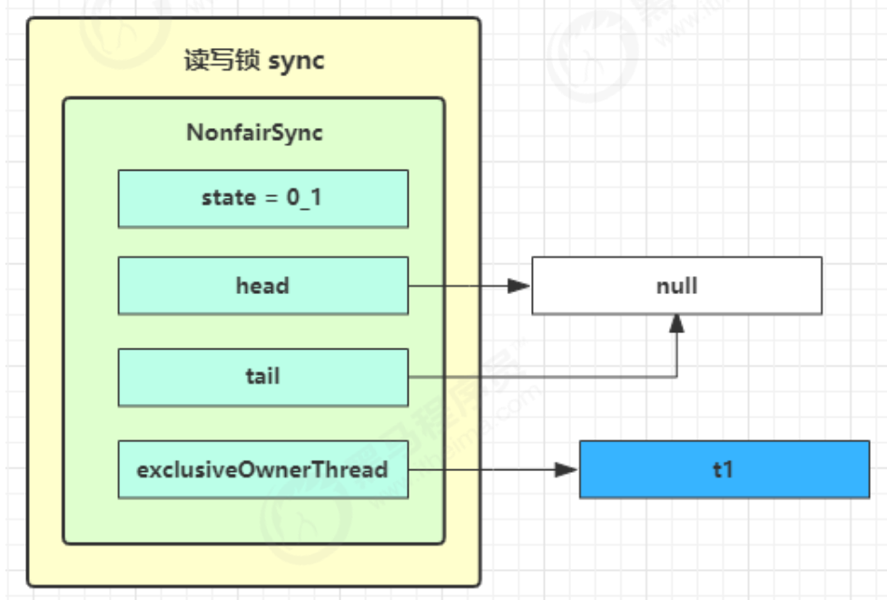

2. t2 执行 r.lock，这时进入读锁的 sync.acquireShared(1) 流程，首先会进入 tryAcquireShared 流程。如果有写锁占据，那么 tryAcquireShared 返回 -1 表示失败

> tryAcquireShared 返回值表示
>
> * -1 表示失败
> * 0 表示成功，但后继节点不会继续唤醒
> * 正数表示成功，而且数值是还有几个后继节点需要唤醒，读写锁返回 1

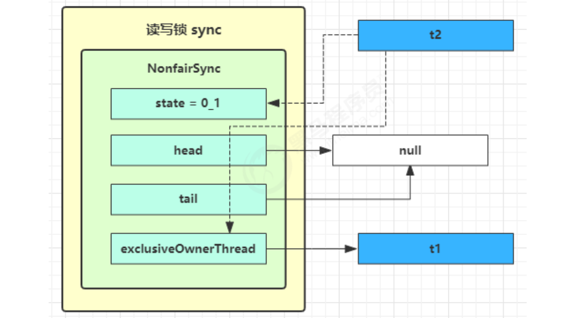

3. 这时会进入 sync.doAcquireShared(1) 流程，首先也是调用 addWaiter 添加节点，不同之处在于节点被设置为Node.SHARED 模式而非 Node.EXCLUSIVE 模式，注意此时 t2 仍处于活跃状态

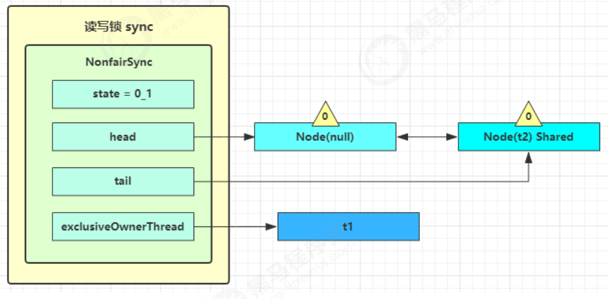

4. t2 会看看自己的节点是不是老二，如果是，还会再次调用 tryAcquireShared(1) 来尝试获取锁
5. 如果没有成功，在 doAcquireShared 内 for (;;) 循环一次，把前驱节点的 waitStatus 改为 -1，再 for (;;) 循环一次尝试 tryAcquireShared(1) 如果还不成功，那么在 parkAndCheckInterrupt() 处 park

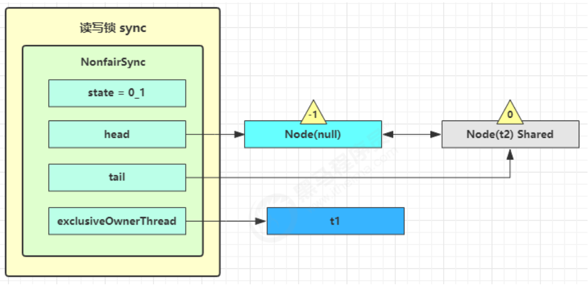

##### t3 r.lock，t4 w.lock

这种状态下，假设又有 t3 加读锁和 t4 加写锁，这期间 t1 仍然持有锁，就变成了下面的样子

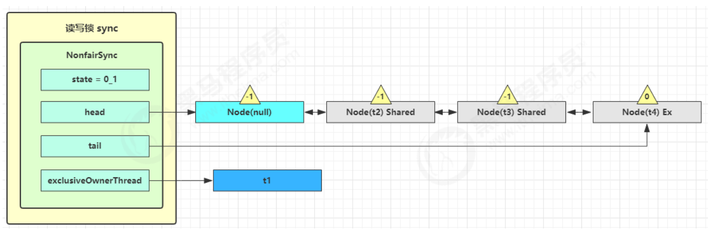

##### t1 w.unlock

这时会走到写锁的 sync.release(1) 流程，调用 sync.tryRelease(1) 成功，变成下面的样子

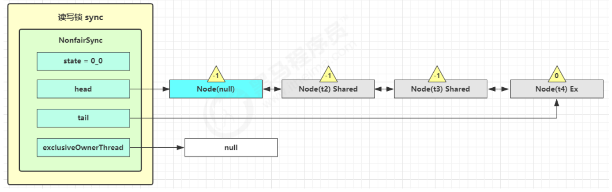

接下来执行唤醒流程 sync.unparkSuccessor，即让老二恢复运行，这时 t2 在 doAcquireShared 内parkAndCheckInterrupt() 处恢复运行

这回再来一次 for (;;) 执行 tryAcquireShared 成功则让读锁计数加一

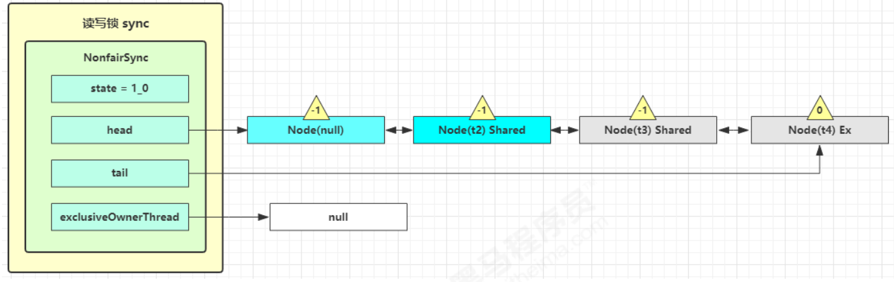

这时 t2 已经恢复运行，接下来 t2 调用 setHeadAndPropagate(node, 1)，它原本所在节点被置为头节点

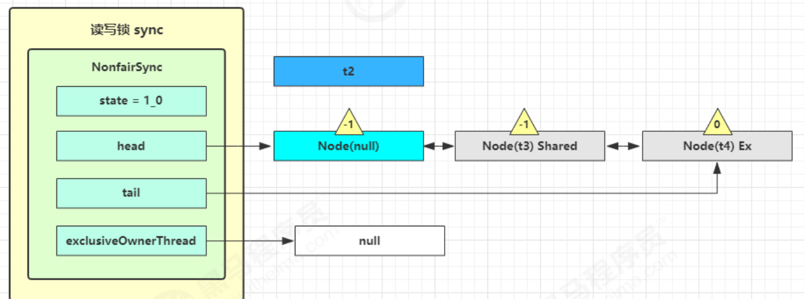

事情还没完，在 setHeadAndPropagate 方法内还会检查下一个节点是否是 shared，如果是则调用doReleaseShared() 将 head 的状态从 -1 改为 0 并唤醒老二，这时 t3 在 doAcquireShared 内parkAndCheckInterrupt() 处恢复运行

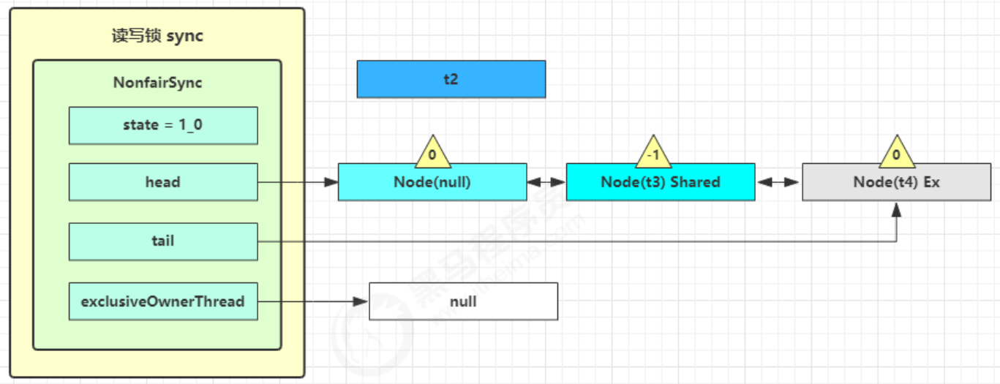

这回再来一次 for (;;) 执行 tryAcquireShared 成功则让读锁计数加一


这时 t3 已经恢复运行，接下来 t3 调用 setHeadAndPropagate(node, 1)，它原本所在节点被置为头节点

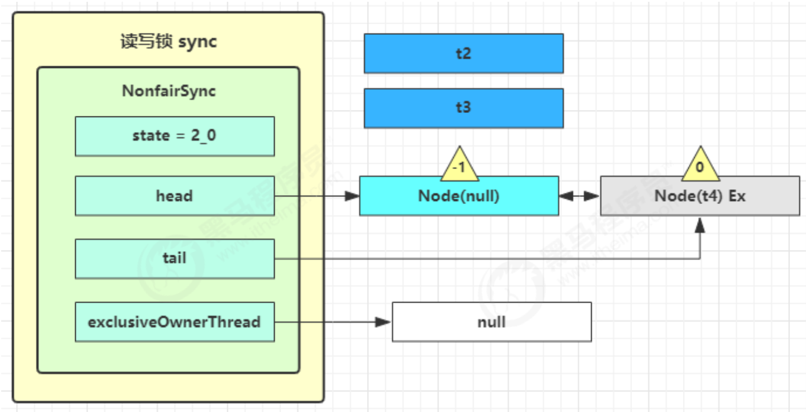

下一个节点不是 shared 了，因此不会继续唤醒 t4 所在节点

##### t2 r.unlock，t3 r.unlock

t2 进入 sync.releaseShared(1) 中，调用 tryReleaseShared(1) 让计数减一，但由于计数还不为零

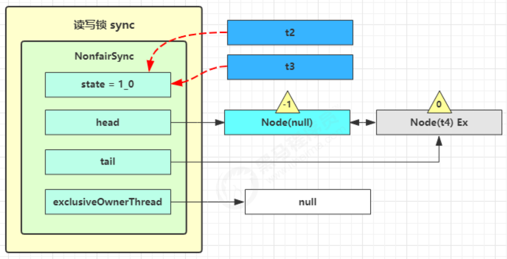

t3 进入 sync.releaseShared(1) 中，调用 tryReleaseShared(1) 让计数减一，这回计数为零了，进入doReleaseShared() 将头节点从 -1 改为 0 并唤醒老二，即

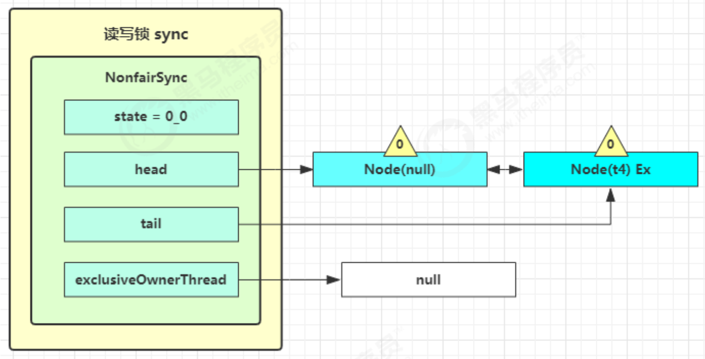

之后 t4 在 acquireQueued 中 parkAndCheckInterrupt 处恢复运行，再次 for (;;) 这次自己是老二，并且没有其他竞争，tryAcquire(1) 成功，修改头结点，流程结束

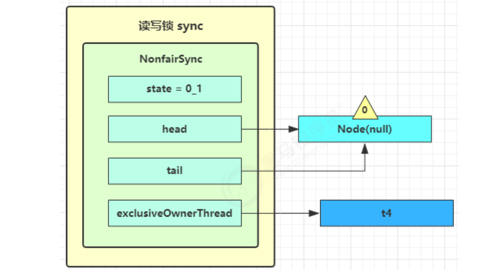


#### 2. 源码分析

##### 写锁上锁流程

```java
static final class NonfairSync extends Sync {
    // ... 省略无关代码
    // 外部类 WriteLock 方法, 方便阅读, 放在此处
    public void lock() {
        sync.acquire(1);
    }
    
    // AQS 继承过来的方法, 方便阅读, 放在此处
    public final void acquire(int arg) {
        if (
          // 尝试获得写锁失败
          !tryAcquire(arg) &&
          // 将当前线程关联到一个 Node 对象上, 模式为独占模式
          // 进入 AQS 队列阻塞
          acquireQueued(addWaiter(Node.EXCLUSIVE), arg)
        ) {
            selfInterrupt();
        }
    }
    
    // Sync 继承过来的方法, 方便阅读, 放在此处
    protected final boolean tryAcquire(int acquires) {
        // 获得低 16 位, 代表写锁的 state 计数
        Thread current = Thread.currentThread();
        int c = getState();int w = exclusiveCount(c);
        if (c != 0) {
            if (
               // c != 0 and w == 0 表示有读锁, 或者
               w == 0 ||
               // 如果 exclusiveOwnerThread 不是自己
               current != getExclusiveOwnerThread()
            ) {
                // 获得锁失败
                return false;
            }
            // 写锁计数超过低 16 位, 报异常
            if (w + exclusiveCount(acquires) > MAX_COUNT)
                throw new Error("Maximum lock count exceeded");
            // 写锁重入, 获得锁成功
            setState(c + acquires);
            return true;
        }
        if (
            // 判断写锁是否该阻塞, 或者
            writerShouldBlock() ||
            // 尝试更改计数失败
            !compareAndSetState(c, c + acquires)
        ) {
            // 获得锁失败
            return false;
        }
        // 获得锁成功
        setExclusiveOwnerThread(current);
        return true;
    }
    // 非公平锁 writerShouldBlock 总是返回 false, 无需阻塞
    final boolean writerShouldBlock() {
        return false;
    }
}
```

##### 写锁释放流程

```java
static final class NonfairSync extends Sync {
    // ... 省略无关代码
    // WriteLock 方法, 方便阅读, 放在此处
    public void unlock() {
        sync.release(1);
    }

    // AQS 继承过来的方法, 方便阅读, 放在此处
    public final boolean release(int arg) {
        // 尝试释放写锁成功
        if (tryRelease(arg)) {
            // unpark AQS 中等待的线程
            Node h = head;
            if (h != null && h.waitStatus != 0)
                unparkSuccessor(h);
            return true;
        }
        return false;
    }

    // Sync 继承过来的方法, 方便阅读, 放在此处
    protected final boolean tryRelease(int releases) {
        if (!isHeldExclusively())
            throw new IllegalMonitorStateException();
        int nextc = getState() - releases;
        // 因为可重入的原因, 写锁计数为 0, 才算释放成功
        boolean free = exclusiveCount(nextc) == 0;
        if (free) {
            setExclusiveOwnerThread(null);
        }
        setState(nextc);
        return free;
    }
}
```

##### 读锁上锁流程

```java
static final class NonfairSync extends Sync {
    // ReadLock 方法, 方便阅读, 放在此处
    public void lock() {
        sync.acquireShared(1);
    }

    // AQS 继承过来的方法, 方便阅读, 放在此处
    public final void acquireShared(int arg) {
        // tryAcquireShared 返回负数, 表示获取读锁失败
        if (tryAcquireShared(arg) < 0) {
            doAcquireShared(arg);
        }
    }

    // Sync 继承过来的方法, 方便阅读, 放在此处
    protected final int tryAcquireShared(int unused) {
        Thread current = Thread.currentThread();
        int c = getState();
        // 如果是其它线程持有写锁, 获取读锁失败
        if (
            exclusiveCount(c) != 0 &&
            getExclusiveOwnerThread() != current
        ) {
            return -1;
        }
        int r = sharedCount(c);
        if (
            // 读锁不该阻塞(如果老二是写锁，读锁该阻塞), 并且
            !readerShouldBlock() &&
            // 小于读锁计数, 并且
            r < MAX_COUNT &&
            // 尝试增加计数成功
            compareAndSetState(c, c + SHARED_UNIT)
        ) {
            // ... 省略不重要的代码
            return 1;
        }
        return fullTryAcquireShared(current);
    }

    // 非公平锁 readerShouldBlock 看 AQS 队列中第一个节点是否是写锁
    // true 则该阻塞, false 则不阻塞
    final boolean readerShouldBlock() {
        return apparentlyFirstQueuedIsExclusive();
    }

    // AQS 继承过来的方法, 方便阅读, 放在此处
    // 与 tryAcquireShared 功能类似, 但会不断尝试 for (;;) 获取读锁, 执行过程中无阻塞
    final int fullTryAcquireShared(Thread current) {
        HoldCounter rh = null;
        for (; ; ) {
            int c = getState();
            if (exclusiveCount(c) != 0) {
                if (getExclusiveOwnerThread() != current)
                    return -1;
            } else if (readerShouldBlock()) {
                // ... 省略不重要的代码
            }
            if (sharedCount(c) == MAX_COUNT)
                throw new Error("Maximum lock count exceeded");
            if (compareAndSetState(c, c + SHARED_UNIT)) {
                // ... 省略不重要的代码
                return 1;
            }
        }
    }

    // AQS 继承过来的方法, 方便阅读, 放在此处
    private void doAcquireShared(int arg) {
        // 将当前线程关联到一个 Node 对象上, 模式为共享模式
        final Node node = addWaiter(Node.SHARED);
        boolean failed = true;
        try {
            boolean interrupted = false;
            for (; ; ) {
                final Node p = node.predecessor();
                if (p == head) {// 再一次尝试获取读锁
                    int r = tryAcquireShared(arg);
                    // 成功
                    if (r >= 0) {
                        // (一)
                        // r 表示可用资源数, 在这里总是 1 允许传播
                        //（唤醒 AQS 中下一个 Share 节点）
                        setHeadAndPropagate(node, r);
                        p.next = null; // help GC
                        if (interrupted)
                            selfInterrupt();
                        failed = false;
                        return;
                    }
                }
                if (
                    // 是否在获取读锁失败时阻塞（前一个阶段 waitStatus == Node.SIGNAL）
                    shouldParkAfterFailedAcquire(p, node) &&
                    // park 当前线程
                    parkAndCheckInterrupt()
                ) {
                    interrupted = true;
                }
            }
        } finally {
            if (failed)
                cancelAcquire(node);
        }
    }

    // (一) AQS 继承过来的方法, 方便阅读, 放在此处
    private void setHeadAndPropagate(Node node, int propagate) {
        Node h = head; // Record old head for check below
        // 设置自己为 head
        setHead(node);
        // propagate 表示有共享资源（例如共享读锁或信号量）
        // 原 head waitStatus == Node.SIGNAL 或 Node.PROPAGATE
        // 现在 head waitStatus == Node.SIGNAL 或 Node.PROPAGATE
        if (propagate > 0 || h == null || h.waitStatus < 0 ||
                (h = head) == null || h.waitStatus < 0) {
            Node s = node.next;
            // 如果是最后一个节点或者是等待共享读锁的节点
            if (s == null || s.isShared()) {
                // 进入 (二)
                doReleaseShared();
            }
        }
    }

    // (二) AQS 继承过来的方法, 方便阅读, 放在此处
    private void doReleaseShared() {
        // 如果 head.waitStatus == Node.SIGNAL ==> 0 成功, 下一个节点 unpark
        // 如果 head.waitStatus == 0 ==> Node.PROPAGATE, 为了解决 bug, 见后面分析
        for (; ; ) {
            Node h = head;
            // 队列还有节点
            if (h != null && h != tail) {
                int ws = h.waitStatus;
                if (ws == Node.SIGNAL) {
                    if (!compareAndSetWaitStatus(h, Node.SIGNAL, 0))
                        continue; // loop to recheck cases
                    // 下一个节点 unpark 如果成功获取读锁
                    // 并且下下个节点还是 shared, 继续 doReleaseShared
                    unparkSuccessor(h);
                } else if (
                    ws == 0 &&
                    !compareAndSetWaitStatus(h, 0, Node.PROPAGATE)
                )
                    continue; // loop on failed CAS
            }
            if (h == head) // loop if head changed
                break;
        }
    }
}
```

##### 读锁释放流程

```java
static final class NonfairSync extends Sync {
    // ReadLock 方法, 方便阅读, 放在此处
    public void unlock() {
        sync.releaseShared(1);
    }

    // AQS 继承过来的方法, 方便阅读, 放在此处
    public final boolean releaseShared(int arg) {
        if (tryReleaseShared(arg)) {
            doReleaseShared();
            return true;
        }
        return false;
    }

    // Sync 继承过来的方法, 方便阅读, 放在此处
    protected final boolean tryReleaseShared(int unused) {
        // ... 省略不重要的代码
        for (; ; ) {
            int c = getState();
            int nextc = c - SHARED_UNIT;
            if (compareAndSetState(c, nextc)) {
                // 读锁的计数不会影响其它获取读锁线程, 但会影响其它获取写锁线程
                // 计数为 0 才是真正释放
                return nextc == 0;
            }
        }
    }

    // AQS 继承过来的方法, 方便阅读, 放在此处
    private void doReleaseShared() {
        // 如果 head.waitStatus == Node.SIGNAL ==> 0 成功, 下一个节点 unpark
        // 如果 head.waitStatus == 0 ==> Node.PROPAGATE
        for (;;) {
            Node h = head;
            if (h != null && h != tail) {
                int ws = h.waitStatus;
                // 如果有其它线程也在释放读锁，那么需要将 waitStatus 先改为 0
                // 防止 unparkSuccessor 被多次执行
                if (ws == Node.SIGNAL) {
                    if (!compareAndSetWaitStatus(h, Node.SIGNAL, 0))
                        continue; // loop to recheck cases
                    unparkSuccessor(h);
                }
                // 如果已经是 0 了，改为 -3，用来解决传播性，见后文信号量 bug 分析
                else if (ws == 0 &&
                        !compareAndSetWaitStatus(h, 0, Node.PROPAGATE))
                    continue; // loop on failed CAS
            }
            if (h == head) // loop if head changed
                break;
        }
    }
}
```


### 五、StampedLock

该类自 JDK 8 加入，是为了进一步优化读性能，它的特点是在使用读锁、写锁时都必须配合【戳】使用

加解读锁

```java
long stamp = lock.readLock();
lock.unlockRead(stamp);
```

加解写锁

```java
long stamp = lock.writeLock();
lock.unlockWrite(stamp);
```

乐观读，StampedLock 支持 tryOptimisticRead() 方法（乐观读），读取完毕后需要做一次`戳校验` 如果校验通过，表示这期间确实没有写操作，数据可以安全使用，如果校验没通过，需要重新获取读锁，保证数据安全。

```java
long stamp = lock.tryOptimisticRead();// 这个方法内没有加任何的锁
// 验戳
if(!lock.validate(stamp)){
	// 锁升级
}
```


提供一个 数据容器类 内部分别使用读锁保护数据的 `read()` 方法，写锁保护数据的 `write()` 方法

```java
@Slf4j
class DataContainerStamped {
    private int data;
    private final StampedLock lock = new StampedLock();

    public DataContainerStamped(int data) {
        this.data = data;
    }

    public int read(int readTime) {
        // 无锁的读
        long stamp = lock.tryOptimisticRead();
        log.debug("optimistic read locking...{}", stamp);
        sleep(readTime);
        // 验戳
        if (lock.validate(stamp)) {
            log.debug("read finish...{}, data:{}", stamp, data);
            return data;
        }
        // 锁升级 - 读锁 没有验戳成功
        log.debug("updating to read lock... {}", stamp);
        try {
            stamp = lock.readLock();
            log.debug("read lock {}", stamp);
            sleep(readTime);
            log.debug("read finish...{}, data:{}", stamp, data);
            return data;
        } finally {
            log.debug("read unlock {}", stamp);
            lock.unlockRead(stamp);
        }
    }

    public void write(int newData) {
        long stamp = lock.writeLock();
        log.debug("write lock {}", stamp);
        try {
            sleep(2);
            this.data = newData;
        } finally {
            log.debug("write unlock {}", stamp);
            lock.unlockWrite(stamp);
        }
    }
}
```

测试 `读-读` 可以优化

```java
public static void main(String[] args) {
    DataContainerStamped dataContainer = new DataContainerStamped(1);
    new Thread(() -> {
        dataContainer.read(1);
    }, "t1").start();
    
    sleep(0.5);
    
    new Thread(() -> {
        dataContainer.read(0);
    }, "t2").start();
}
```

输出结果，可以看到实际没有加读锁

```java
[t1] c.TestStampedLock - optimistic read locking...256
[t2] c.TestStampedLock - optimistic read locking...256
[t2] c.TestStampedLock - read finish...256, data:1
[t1] c.TestStampedLock - read finish...256, data:1
```

测试 `读-写 `时优化读补加读锁

```java
DataContainerStamped dataContainer = new DataContainerStamped(1);
new Thread(() -> {
	dataContainer.read(1);
}, "t1").start();

sleep(0.5);

new Thread(() -> {
	dataContainer.write(100);
}, "t2").start();
```

输出结果

```java
[t1] c.TestStampedLock - optimistic read locking...256
[t2] c.TestStampedLock - write lock 384
[t1] c.TestStampedLock - updating to read lock... 256
[t2] c.TestStampedLock - write unlock 384
[t1] c.TestStampedLock - read lock 513
[t1] c.TestStampedLock - read finish...513, data:100
[t1] c.TestStampedLock - read unlock 513
```

> **注意**
>
> * StampedLock 不支持条件变量
> * StampedLock 不支持可重入


### 六、 Semaphore


[ˈsɛməˌfɔr] 信号量，用来限制能同时访问共享资源(不代表共享资源只有1)的**线程上限**。

#### 基本使用

```java
public static void main(String[] args) {
    // 1. 创建 semaphore 对象
    Semaphore semaphore = new Semaphore(3);
    // 2. 10个线程同时运行
    for (int i = 0; i < 10; i++) {
        new Thread(() -> {
            // 3. 获取许可
            try {
                semaphore.acquire();
            } catch (InterruptedException e) {
                e.printStackTrace();
            }
            try {
                log.debug("running...");
                sleep(1);
                log.debug("end...");
            } finally {
                // 4. 释放许可
                semaphore.release();
            }
        }).start();
    }
}
```

输出

```java
21:08:40 [Thread-2] com.wjl.juc.j7.u5.SemaphoreTest - running...
21:08:40 [Thread-1] com.wjl.juc.j7.u5.SemaphoreTest - running...
21:08:40 [Thread-0] com.wjl.juc.j7.u5.SemaphoreTest - running...
21:08:41 [Thread-2] com.wjl.juc.j7.u5.SemaphoreTest - end...
21:08:41 [Thread-1] com.wjl.juc.j7.u5.SemaphoreTest - end...
21:08:41 [Thread-0] com.wjl.juc.j7.u5.SemaphoreTest - end...
21:08:41 [Thread-3] com.wjl.juc.j7.u5.SemaphoreTest - running...
21:08:41 [Thread-4] com.wjl.juc.j7.u5.SemaphoreTest - running...
21:08:41 [Thread-5] com.wjl.juc.j7.u5.SemaphoreTest - running...
21:08:43 [Thread-5] com.wjl.juc.j7.u5.SemaphoreTest - end...
21:08:43 [Thread-4] com.wjl.juc.j7.u5.SemaphoreTest - end...
21:08:43 [Thread-3] com.wjl.juc.j7.u5.SemaphoreTest - end...
21:08:43 [Thread-8] com.wjl.juc.j7.u5.SemaphoreTest - running...
21:08:43 [Thread-6] com.wjl.juc.j7.u5.SemaphoreTest - running...
21:08:43 [Thread-7] com.wjl.juc.j7.u5.SemaphoreTest - running...
21:08:44 [Thread-7] com.wjl.juc.j7.u5.SemaphoreTest - end...
21:08:44 [Thread-8] com.wjl.juc.j7.u5.SemaphoreTest - end...
21:08:44 [Thread-6] com.wjl.juc.j7.u5.SemaphoreTest - end...
21:08:44 [Thread-9] com.wjl.juc.j7.u5.SemaphoreTest - running...
21:08:45 [Thread-9] com.wjl.juc.j7.u5.SemaphoreTest - end...
```

> 获取许可时被阻塞的那些线程如果被打断的话会去释放许可的，但是这些线程并没有获取许可缺释放了许可，会导致许可数增加


#### <font color="green" style="font-weight:bold">* Semaphore 应用</font>

**限制对共享资源的使用**

semaphore 实现

* 使用 Semaphore 限流，在访问高峰期时，让请求线程阻塞，高峰期过去再释放许可，当然它只适合限制单机线程数量，并且**仅是限制线程数，而不是限制资源数**（例如连接数，请对比 Tomcat LimitLatch 的实现）

* 用 Semaphore 实现简单连接池，对比『享元模式』下的实现（用wait notify），性能和可读性显然更好，注意下面的实现中线程数和数据库连接数是相等的

```java
@Slf4j(topic = "c.Pool")
public class Pool {
    // 1. 连接池大小
    private final int poolSize;
    // 2. 连接对象数组
    private Connection[] connections;
    // 3. 连接状态数组 0 表示空闲， 1 表示繁忙
    private AtomicIntegerArray states;
    private Semaphore semaphore;// 4. 构造方法初始化

    public Pool(int poolSize,String url,String username,String password) 
        throws SQLException
    {
        this.poolSize = poolSize;
        // 让许可数与资源数一致
        this.semaphore = new Semaphore(poolSize);
        this.connections = new Connection[poolSize];
        this.states = new AtomicIntegerArray(new int[poolSize]);
        for (int i = 0; i < poolSize; i++) {
            connections[i] = DriverManager.getConnection(url, username, password);
        }
    }

    // 5. 借连接
    public Connection borrow() {// t1, t2, t3
        // 获取许可
        try {
            semaphore.acquire(); // 没有许可的线程，在此等待
        } catch (InterruptedException e) {
            e.printStackTrace();
        }
        for (int i = 0; i < poolSize; i++) {
            // 获取空闲连接
            if (states.get(i) == 0) {
                if (states.compareAndSet(i, 0, 1)) {
                    log.debug("borrow {}", connections[i]);
                    return connections[i];
                }
            }
        }
        // 不会执行到这里
        return null;
    }

    // 6. 归还连接
    public void free(Connection conn) {
        for (int i = 0; i < poolSize; i++) {
            if (connections[i] == conn) {
                states.set(i, 0);
                log.debug("free {}", conn);
                semaphore.release();
                break;
            }
        }
    }
}
```


#### <font color="blue" style="font-weight:bold">* Semaphore 原理</font>

##### 1. 加锁解锁流程

Semaphore 有点像一个停车场，permits 就好像停车位数量，当线程获得了 permits 就像是获得了停车位，然后停车场显示空余车位减一

刚开始，permits（state）为 3，这时 5 个线程来获取资源

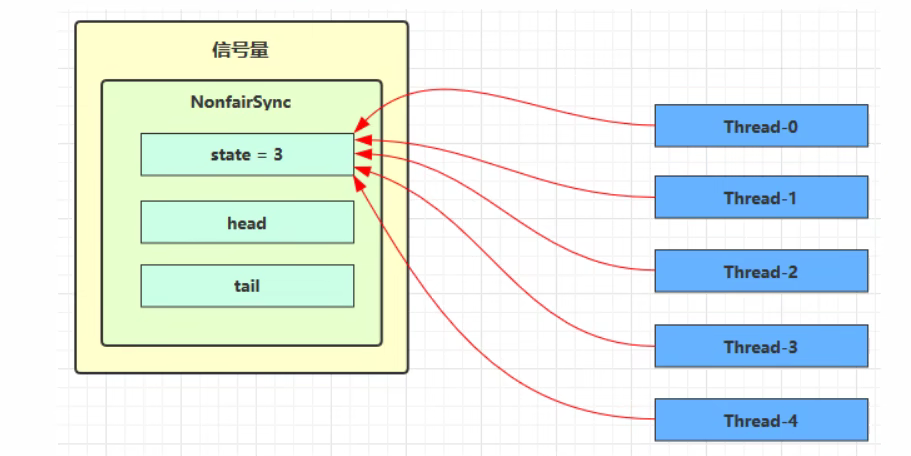

假设其中 Thread-1，Thread-2，Thread-4 cas 竞争成功，而 Thread-0 和 Thread-3 竞争失败，进入 AQS 队列park 阻塞

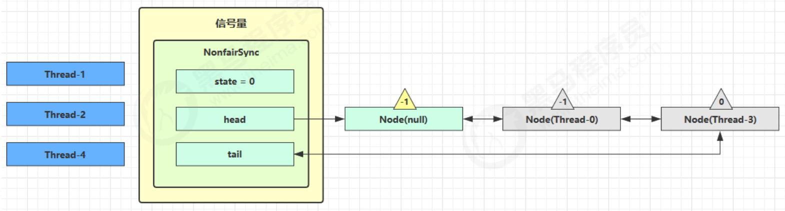

这时 Thread-4 释放了 permits，状态如下

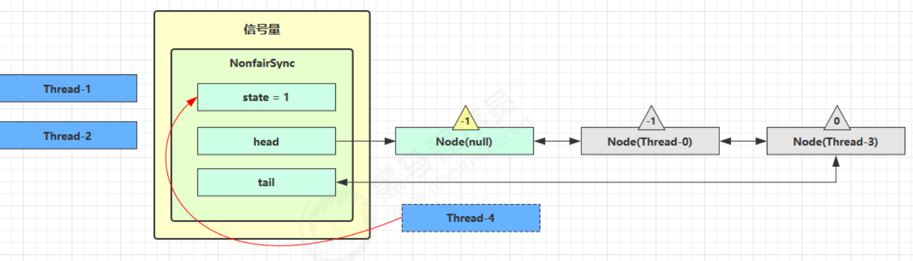

接下来 Thread-0 竞争成功，permits 再次设置为 0，设置自己为 head 节点，断开原来的 head 节点，unpark 接下来的 Thread-3 节点，但由于 permits 是 0，因此 Thread-3 在尝试不成功后再次进入 park 状态

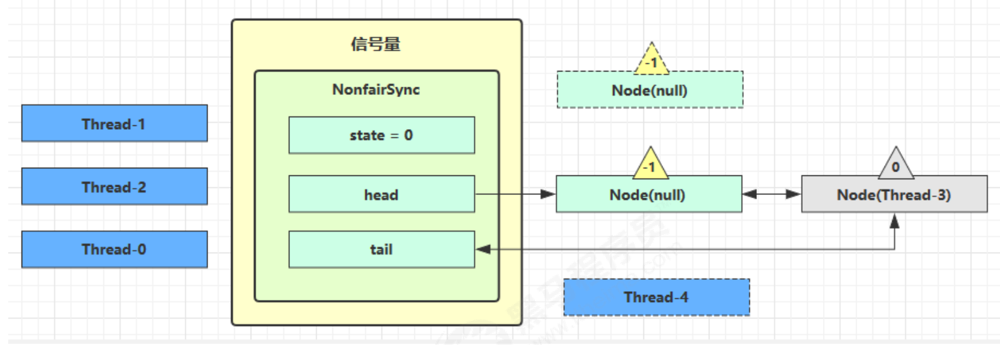

##### 2. 源码分析

```java
static final class NonfairSync extends Sync {
    private static final long serialVersionUID = -2694183684443567898L;

    NonfairSync(int permits) {
        // permits 即 state
        super(permits);
    }

    // Semaphore 方法, 方便阅读, 放在此处
    public void acquire() throws InterruptedException {
        sync.acquireSharedInterruptibly(1);
    }

    // AQS 继承过来的方法, 方便阅读, 放在此处
    public final void acquireSharedInterruptibly(int arg)
            throws InterruptedException {
        if (Thread.interrupted())
            throw new InterruptedException();
        // 之前返回负数代表加锁失败 
        if (tryAcquireShared(arg) < 0)
            doAcquireSharedInterruptibly(arg);
    }

    // 尝试获得共享锁
    protected int tryAcquireShared(int acquires) {
        return nonfairTryAcquireShared(acquires);
    }

    // Sync 继承过来的方法, 方便阅读, 放在此处
    final int nonfairTryAcquireShared(int acquires) {
        for (; ; ) {
            int available = getState();
            int remaining = available - acquires;
            if (
                  // 如果许可已经用完, 返回负数, 表示获取失败, 进入 doAcquireSharedInterruptibly
                  remaining < 0 ||
                  // 如果 cas 重试成功, 返回正数, 表示获取成功
                  compareAndSetState(available, remaining)) {
                return remaining;
            }
        }
    }

    // AQS 继承过来的方法, 方便阅读, 放在此处
    private void doAcquireSharedInterruptibly(int arg) throws InterruptedException {
        final Node node = addWaiter(Node.SHARED);
        boolean failed = true;
        try {
            for (; ; ) {
                final Node p = node.predecessor();
                if (p == head) {// 说明它是第二个节点
                    // 再次尝试获取许可
                    int r = tryAcquireShared(arg);
                    if (r >= 0) {
                        // 成功后本线程出队（AQS）, 所在 Node设置为 head
                        // 如果 head.waitStatus == Node.SIGNAL ==> 0 成功, 下一个节点 unpark
                        // 如果 head.waitStatus == 0 ==> Node.PROPAGATE
                        // r 表示可用资源数, 为 0 则不会继续传播
                        setHeadAndPropagate(node, r);
                        p.next = null; // help GC
                        failed = false;
                        return;
                    }
                }
                // 不成功, 设置上一个节点 waitStatus = Node.SIGNAL, 下轮进入 park 阻塞
                if (shouldParkAfterFailedAcquire(p, node) &&
                        parkAndCheckInterrupt())
                    throw new InterruptedException();
            }
        } finally {
            if (failed)
                cancelAcquire(node);
        }
    }

    // Semaphore 方法, 方便阅读, 放在此处
    public void release() {
        sync.releaseShared(1);
    }

    // AQS 继承过来的方法, 方便阅读, 放在此处
    public final boolean releaseShared(int arg) {
        if (tryReleaseShared(arg)) {
            doReleaseShared(); // 返回之后 这个线程
            return true;
        }
        return false;
    }

    // Sync 继承过来的方法, 方便阅读, 放在此处
    protected final boolean tryReleaseShared(int releases) {
        for (; ; ) {
            int current = getState();
            int next = current + releases;
            if (next < current) // overflow
                throw new Error("Maximum permit count exceeded");
            if (compareAndSetState(current, next))
                return true; 
        }
    }
}
```


### 七、CountdownLatch

用来进行线程同步协作，等待所有线程完成倒计时。

其中构造参数用来初始化等待计数值，`await()` 用来等待计数归零，`countDown()` 用来让计数减一

#### 1. 源码

```java
// CountDownLatch$Sync
// await 调用
protected int tryAcquireShared(int acquires) {
    return (getState() == 0) ? 1 : -1;
}

// countDown 调用
protected boolean tryReleaseShared(int releases) {
    // Decrement count; signal when transition to zero
    for (;;) {
        int c = getState();
        if (c == 0)
            return false;
        int nextc = c-1;
        if (compareAndSetState(c, nextc))
            return nextc == 0;
    }
}
```

#### 2.基本使用

```java
public static void main(String[] args) throws InterruptedException {
    CountDownLatch latch = new CountDownLatch(3);
    new Thread(() -> {
        log.debug(Thread.currentThread().getName() + "...");
        latch.countDown();
    }, "t1").start();

    new Thread(() -> {
        log.debug(Thread.currentThread().getName() + "...");
        latch.countDown();
    }, "t2").start();

    new Thread(() -> {
        log.debug(Thread.currentThread().getName() + "...");
        latch.countDown();
    }, "t3").start();
    latch.await();

    log.debug(Thread.currentThread().getName());
}
```

输出

```java
14:42:26 [t1] com.wjl.juc.j7.u5.CountDownLatchTest - t1...
14:42:26 [t3] com.wjl.juc.j7.u5.CountDownLatchTest - t3...
14:42:26 [t2] com.wjl.juc.j7.u5.CountDownLatchTest - t2...
14:42:26 [main] com.wjl.juc.j7.u5.CountDownLatchTest - main
```

#### 3.配合线程池使用

```java
CountDownLatch latch = new CountDownLatch(3);

ExecutorService service = Executors.newFixedThreadPool(4);

service.submit(() -> {
    log.debug("begin...");
    sleep(1);
    latch.countDown();
    log.debug("end...{}", latch.getCount());
});
service.submit(() -> {
    log.debug("begin...");
    sleep(1.5);
    latch.countDown();
    log.debug("end...{}", latch.getCount());
});
service.submit(() -> {
    log.debug("begin...");
    sleep(2);
    latch.countDown();
    log.debug("end...{}", latch.getCount());
});
service.submit(() -> {
    try {
        log.debug("waiting...");
        latch.await();
        log.debug("wait end...");
    } catch (InterruptedException e) {
        e.printStackTrace();
    }
});
```

输出

```java
[pool-1-thread-2] c.CountDownLatchTest - begin...
[pool-1-thread-3] c.CountDownLatchTest - begin...
[pool-1-thread-4] c.CountDownLatchTest - waiting...
[pool-1-thread-1] c.CountDownLatchTest - begin...
[pool-1-thread-1] c.CountDownLatchTest - end...2
[pool-1-thread-2] c.CountDownLatchTest - end...1
[pool-1-thread-3] c.CountDownLatchTest - end...0
[pool-1-thread-4] c.CountDownLatchTest - wait end...
```

#### <font color="green" style="font-weight:bold">4. * 应用之同步等待多线程准备完毕</font>

```java
@Slf4j(topic = "c.MockGameStart")
@NoArgsConstructor(access = AccessLevel.PRIVATE)
public class MockGameStart {
    public static void start() throws InterruptedException {
        AtomicInteger num = new AtomicInteger(0);
        ExecutorService service = Executors.newFixedThreadPool(10, (r) -> {
            return new Thread(r, "t" + num.getAndIncrement());
        });
        CountDownLatch latch = new CountDownLatch(10);
        String[] all = new String[10];
        Random r = new Random();
        for (int j = 0;j < 10; j++) {
            int x = j;
            service.submit(() -> {
                for (int i = 0; i <= 100; i++) {
                    try {
                        Thread.sleep(r.nextInt(100));
                    } catch (InterruptedException e) {
                    }
                    all[x] = Thread.currentThread().getName() + "(" + (i + "%") + ")";
                    // 换行 会让控制台上面的后一次打印覆盖前面的打印
                    System.out.print("\r" + Arrays.toString(all));
                }
                latch.countDown();
            });
        }
        latch.await();
        System.out.println("\n游戏开始...");
        service.shutdown();
    }
}
```

输出

```java
[t0(52%), t1(47%), t2(51%), t3(40%), t4(49%), t5(44%), t6(49%), t7(52%), t8(46%), t9(46%)]
// end
[t0(100%), t1(100%), t2(100%), t3(100%), t4(100%), t5(100%), t6(100%), t7(100%), t8(100%), t9(100%)]
游戏开始...
```


#### <font color="green" style="font-weight:bold">5. * 应用之同步等待多个远程调用结束</font>

```java
@RestController
public class TestCountDownlatchController {
    @GetMapping("/order/{id}")
    public Map<String, Object> order(@PathVariable int id) {
        HashMap<String, Object> map = new HashMap<>();
        map.put("id", id);
        map.put("total", "2300.00");
        sleep(2000);
        return map;
    }

    @GetMapping("/product/{id}")
    public Map<String, Object> product(@PathVariable int id) {
        HashMap<String, Object> map = new HashMap<>();
        if (id == 1) {
            map.put("name", "小爱音箱");
            map.put("price", 300);
        } else if (id == 2) {
            map.put("name", "小米手机");
            map.put("price", 2000);
        }
        map.put("id", id);
        sleep(1000);
        return map;
    }

    @GetMapping("/logistics/{id}")
    public Map<String, Object> logistics(@PathVariable int id) {
        HashMap<String, Object> map = new HashMap<>();
        map.put("id", id);
        map.put("name", "中通快递");
        sleep(2500);
        return map;
    }

    private void sleep(int millis) {
        try {
            Thread.sleep(millis);
        } catch (InterruptedException e) {
            e.printStackTrace();
        }
    }
}
```

Rest 远程调用

```java
RestTemplate restTemplate = new RestTemplate();
log.debug("begin");
ExecutorService service = Executors.newCachedThreadPool();
CountDownLatch latch = new CountDownLatch(4);
Future<Map<String, Object>> f1 = service.submit(() -> {
    Map<String, Object> r = restTemplate.getForObject("http://localhost:8080/order/{1}", Map.class, 1);
    return r;
});
Future<Map<String, Object>> f2 = service.submit(() -> {
    Map<String, Object> r = restTemplate.getForObject("http://localhost:8080/product/{1}", Map.class, 1);
    return r;
});
Future<Map<String, Object>> f3 = service.submit(() -> {
    Map<String, Object> r = restTemplate.getForObject("http://localhost:8080/product/{1}", Map.class, 2);
    return r;
});
Future<Map<String, Object>> f4 = service.submit(() -> {
    Map<String, Object> r = restTemplate.getForObject("http://localhost:8080/logistics/{1}", Map.class, 1);
    return r;
});
System.out.println(f1.get());
System.out.println(f2.get());
System.out.println(f3.get());
System.out.println(f4.get());
log.debug("执行完毕");
service.shutdown();
```

执行结果

```java
19:51:39.711 c.TestCountDownLatch [main] - begin
{total=2300.00, id=1}
{price=300, name=小爱音箱, id=1}
{price=2000, name=小米手机, id=2}
{name=中通快递, id=1}
19:51:42.407 c.TestCountDownLatch [main] - 执行完毕
```

### 八、 CyclicBarrier

[ˈsaɪklɪk ˈbæriɚ] 循环栅栏，用来进行线程协作，等待线程满足某个计数。构造时设置『计数个数』，每个线程执行到某个需要“同步”的时刻调用 await() 方法进行等待，当等待的线程数满足『计数个数』时，继续执行

```java
public static void main(String[] args) {
    CyclicBarrier cb = new CyclicBarrier(2); // 个数为2时才会继续执行
    new Thread(() -> {
        System.out.println("线程1开始.." + new Date());
        try {
            cb.await(); // 当个数不足时，等待
        } catch (InterruptedException | BrokenBarrierException e) {
            e.printStackTrace();
        }
        System.out.println("线程1继续向下运行..." + new Date());
    }).start();
    new Thread(() -> {
        System.out.println("线程2开始.." + new Date());
        try {
            Thread.sleep(2000);
        } catch (InterruptedException e) {
        }
        try {
            cb.await(); // 2 秒后，线程个数够2，继续运行
        } catch (InterruptedException | BrokenBarrierException e) {
            e.printStackTrace();
        }
        System.out.println("线程2继续向下运行..." + new Date());
    }).start();
}
```

输出

```java
线程1开始..Sat Dec 10 16:59:05 CST 2022
线程2开始..Sat Dec 10 16:59:05 CST 2022
线程2继续向下运行...Sat Dec 10 16:59:07 CST 2022
线程1继续向下运行...Sat Dec 10 16:59:07 CST 2022
```


> **注意** 
>
> * CyclicBarrier 与 CountDownLatch 的主要区别在于 CyclicBarrier 是可以重用的 CyclicBarrier 可以被比喻为『人满发车』
> * CyclicBarrier 的构造方法可以提交任务


### 九、线程安全集合类概述


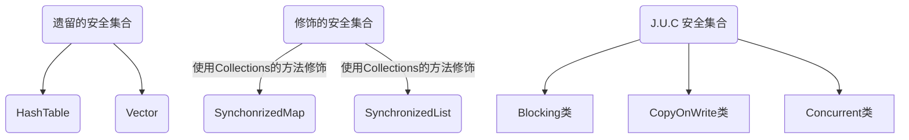
```mermaid
graph TB
y1("遗留的安全集合")-->h1("HashTable")
y1-->v1("Vector")

x1("修饰的安全集合")--使用Collections的方法修饰-->s1("SynchonrizedMap")
x1--使用Collections的方法修饰-->s2("SynchronizedList")

j("J.U.C 安全集合")-->Blocking类
j-->CopyOnWrite类
j-->Concurrent类
```

线程安全集合类可以分为三大类：

* 遗留的线程安全集合如 `Hashtable ， Vector`
* 使用 `Collections `装饰的线程安全集合，如：
  * `Collections.synchronizedCollection`
  * `Collections.synchronizedList`
  * `Collections.synchronizedMap`
  * `Collections.synchronizedSet`
  * `Collections.synchronizedNavigableMap`
  * `Collections.synchronizedNavigableSet`
  * `Collections.synchronizedSortedMap`
  * `Collections.synchronizedSortedSet`
* `java.util.concurrent.*`

重点介绍` java.util.concurrent.* `下的线程安全集合类，可以发现它们有规律，里面包含三类关键词：
`Blocking`、`CopyOnWrite`、`Concurrent`

* `Blocking `大部分实现基于锁，并提供用来阻塞的方法

* `CopyOnWrite` 之类容器修改开销相对较重

* `Concurrent` 类型的容器

  * 内部很多操作使用 cas 优化，一般可以提供较高吞吐量
  * **弱一致性**
    * 遍历时弱一致性，例如，当利用迭代器遍历时，如果容器发生修改，迭代器仍然可以继续进行遍历，这时内容是旧的
    * 求大小弱一致性，size 操作未必是 100% 准确
    * 读取弱一致性

  

> 遍历时如果发生了修改，对于非安全容器来讲，使用 **fail-fast** 机制也就是让遍历立刻失败，抛出`ConcurrentModificationException`，不再继续遍历
>
> * 这里的弱一致性，其实是安全失败机制（fail-safe）实现原理：获得原集合的一份拷贝，在拷贝而来的集合上进行遍历，原集合发生的改变时，不会抛出CME异常


### 十、ConcurrentHashMap

#### 1. 练习：单词计数

生成测试数据

```java
private static void alpha() {
    int length = ALPHA.length();
    int count = 200;
    List<String> list = new ArrayList<>(length * count);
    for (int i = 0; i < length; i++) {
        char ch = ALPHA.charAt(i);
        for (int j = 0; j < count; j++) {
            list.add(String.valueOf(ch));
        }
    }
    Collections.shuffle(list);
    for (int i = 0; i < 26; i++) {
        try (PrintWriter out = new PrintWriter(
                new OutputStreamWriter(
                        new FileOutputStream("tmp/" + (i+1) + ".txt")))) {
            String collect = list.subList(i * count, (i + 1) * count).stream()
                    .collect(Collectors.joining("\n"));
            out.print(collect);
        } catch (IOException e) {
        }
    }
}
```

模版代码，模版代码中封装了多线程读取文件的代码

```java
private static <V> void demo(Supplier<Map<String, V>> supplier, BiConsumer<Map<String, V>, List<String>> consumer) {
    Map<String, V> counterMap = supplier.get();
    List<Thread> ts = new ArrayList<>();
    for (int i = 1; i <= 26; i++) {
        int idx = i;
        Thread thread = new Thread(() -> {
            List<String> words = readFromFile(idx);
            consumer.accept(counterMap, words);
        });
        ts.add(thread);
    }
    ts.forEach(t -> t.start());
    ts.forEach(t -> {
        try {
            t.join();
        } catch (InterruptedException e) {
            e.printStackTrace();
        }
    });
    System.out.println(counterMap);
}
```

你要做的是实现两个参数

* 一是提供一个 map 集合，用来存放每个单词的计数结果，key 为单词，value 为计数
* 二是提供一组操作，保证计数的安全性，会传递 map 集合以及 单词 List

正确结果输出应该是每个单词出现 200 次

```
{a=200, b=200, c=200, d=200, e=200, f=200, g=200, h=200, i=200, j=200, k=200, l=200, m=200,
n=200, o=200, p=200, q=200, r=200, s=200, t=200, u=200, v=200, w=200, x=200, y=200, z=200}
```

下面的实现为：

```java
demo(
        // 创建 map 集合
        // 创建 ConcurrentHashMap 对不对？
        () -> new HashMap<String, Integer>(),
        // 进行计数
        (map, words) -> {
            for (String word : words) {
                Integer counter = map.get(word);
                int newValue = counter == null ? 1 : counter + 1;
                map.put(word, newValue);
            }
})
```

有没有问题？请改进

参考解答1

```java
demo(() -> new ConcurrentHashMap<String, LongAdder>(), 
     (map, words) -> {
        for (String word : words) {
            // 注意不能使用 putIfAbsent，此方法返回的是上一次的 value，首次调用返回 null
            map.computeIfAbsent(word, (key) -> new LongAdder()).increment();
        }
});

//--------------------------------------------------------------------------------------
demo(()->new ConcurrentHashMap<String, LongAdder>(),(map, words)->{
    for(String word : words) {
        // get -> 计算 -> put 这三个步骤在一起不是原子的
        /*Integer counter = map.get(word);
        int newValue = counter == null ? 1 : counter + 1;
        map.put(word, newValue);*/

        // 如果指定的键尚未与值关联（或映射到 null），则尝试使用给定的映射函数计算其值并将其输入到此映射中，除非 null
        // 如果键值不存在，指定一个key和函数(方法参数为key,返回值为value)，将函数的返回值作为value，
        // 此方法的返回值为与指定键关联的当前（现有或计算）值，如果计算值为 null，则为 null
        LongAdder value = map.computeIfAbsent(word, key -> new LongAdder());
        // 保证操作是原子的
        value.increment();
    }
});
```

参考解答2

```java
demo(
        () -> new ConcurrentHashMap<String, Integer>(),
        (map, words) -> {
            for (String word : words) {
                // 函数式编程，无需原子变量
                map.merge(word, 1, Integer::sum);
            }
        }
);
```

### <font color="blue" style="font-weight:bold">十一、*ConcurrentHashMap 原理</font>

#### 1. JDK7 HashMap死链

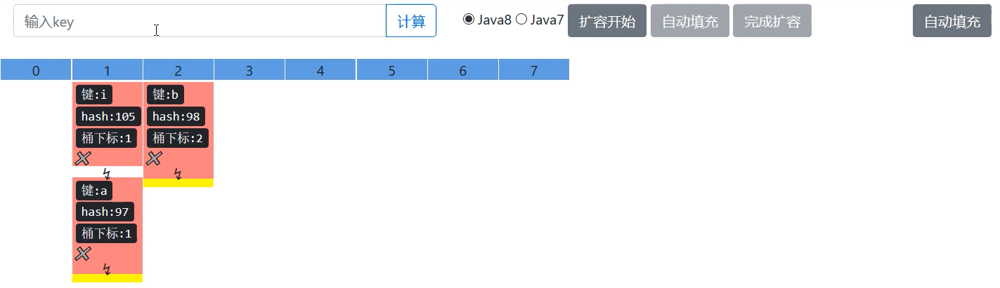

##### 测试代码

注意

* 要在 JDK 7 下运行，否则扩容机制和 hash 的计算方法都变了
* 以下测试代码是精心准备的，不要随便改动

```java
// 测试 java 7 中哪些数字的 hash 结果相等
/*
System.out.println("长度为16时，桶下标为1的key");
for (int i = 0; i < 64; i++) {
    if (hash(i) % 16 == 1) {
        System.out.println(i);
    }
}
System.out.println("长度为32时，桶下标为1的key");
for (int i = 0; i < 64; i++) {
    if (hash(i) % 32 == 1) {
        System.out.println(i);
    }
}
*/

// 1, 35, 16, 50 当大小为16时，它们在一个桶内
final HashMap<Integer, Integer> map = new HashMap<Integer, Integer>();
// 放 12 个元素
map.put(2, null);
map.put(3, null);
map.put(4, null);
map.put(5, null);
map.put(6, null);
map.put(7, null);
map.put(8, null);
map.put(9, null);
map.put(10, null);
map.put(16, null);
map.put(35, null);
map.put(1, null);
System.out.println("扩容前大小[main]:" + map.size());
new Thread(() -> {
    // 放第 13 个元素, 发生扩容
    map.put(50, null);
    System.out.println("扩容后大小[Thread-0]:" + map.size());
}).start();
new Thread(() -> {
    // 放第 13 个元素, 发生扩容
    map.put(50, null);
    System.out.println("扩容后大小[Thread-1]:" + map.size());
}).start();


final static int hash(Object k) {
    int h = 0;
    if (0 != h && k instanceof String) {
        return sun.misc.Hashing.stringHash32((String) k);
    }
    h ^= k.hashCode();
    h ^= (h >>> 20) ^ (h >>> 12);
    return h ^ (h >>> 7) ^ (h >>> 4);
}
```

##### 死链复现

调试工具使用 idea

在 HashMap 源码 590 行加断点

```java
int newCapacity = newTable.length;
```

断点的条件如下，目的是让 HashMap 在扩容为 32 时，并且线程为 Thread-0 或 Thread-1 时停下来

```java
newTable.length==32 &&
    (
        Thread.currentThread().getName().equals("Thread-0")||
        Thread.currentThread().getName().equals("Thread-1")
    )
```

断点暂停方式选择 Thread，否则在调试 Thread-0 时，Thread-1 无法恢复运行

运行代码，程序在预料的断点位置停了下来，输出

```
长度为16时，桶下标为1的key
1
16
35
50
长度为32时，桶下标为1的key
1
35
扩容前大小[main]:12
```

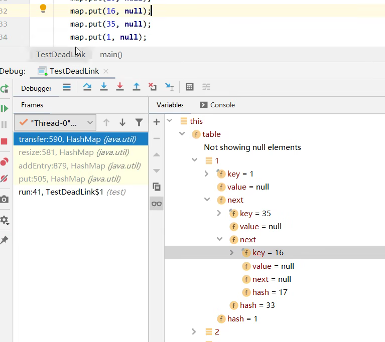

接下来进入扩容流程调试

在 HashMap 源码 594 行加断点

```java
Entry<K,V> next = e.next; // 593
if (rehash) // 594
// ...
```

这是为了观察 e 节点和 next 节点的状态，Thread-0 单步执行到 594 行，再 594 处再添加一个断点（条件Thread.currentThread().getName().equals("Thread-0")）

这时可以在 Variables 面板观察到 e 和 next 变量，使用 `view as -> Object `查看节点状态

```
e 		(1)->(35)->(16)->null
next 	(35)->(16)->null
```

在 Threads 面板选中 Thread-1 恢复运行，可以看到控制台输出新的内容如下，Thread-1 扩容已完成

```
newTable[1] 	(35)->(1)->null
```

```
扩容后大小:13
```

这时 Thread-0 还停在 594 处， Variables 面板变量的状态已经变化为

```
e 		(1)->null
next 	(35)->(1)->null
```

为什么呢，因为 Thread-1 扩容时链表也是后加入的元素放入链表头，因此链表就倒过来了，但 Thread-1 虽然结果正确，但它结束后 Thread-0 还要继续运行

接下来就可以单步调试（F8）观察死链的产生了

下一轮循环到 594，将 e 搬迁到 newTable 链表头

```
newTable[1] 	 (1)->null
e 				(35)->(1)->null
next 			(1)->null
```

再看看源码

```java
e.next = newTable[1];
// 这时 e (1,35)
// 而 newTable[1] (35,1)->(1,35) 因为是同一个对象
newTable[1] = e;
// 再尝试将 e 作为链表头, 死链已成
e = next;
// 虽然 next 是 null, 会进入下一个链表的复制, 但死链已经形成了
```

##### 源码分析

HashMap 的并发死链发生在扩容时

```java
// 将 table 迁移至 newTable
void transfer(Map.Entry[] newTable, boolean rehash) {
    int newCapacity = newTable.length;
    for (Entry<K,V> e : table) {
        while(null != e) {
            Entry<K,V> next = e.next;
            // 1 处
            if (rehash) {
                e.hash = null == e.key ? 0 : hash(e.key);
            }
            int i = indexFor(e.hash, newCapacity);
            // 2 处
            // 将新元素加入 newTable[i], 原 newTable[i] 作为新元素的 next
            e.next = newTable[i];
            newTable[i] = e;
            e = next;
        }
    }
}
```

假设 map 中初始元素是

```java
原始链表，格式：[下标] (key,next)
[1] (1,35)->(35,16)->(16,null)

线程 a 执行到 1 处 ，此时局部变量 e 为 (1,35)，而局部变量 next 为 (35,16) 线程 a 挂起

线程 b 开始执行
第一次循环
[1] (1,null)

第二次循环
[1] (35,1)->(1,null)

第三次循环
[1] (35,1)->(1,null)
[17] (16,null)

切换回线程 a，此时局部变量 e 和 next 被恢复，引用没变但内容变了：e 的内容被改为 (1,null)，而 next 的内
容被改为 (35,1) 并链向 (1,null)
第一次循环
[1] (1,null)

第二次循环，注意这时 e 是 (35,1) 并链向 (1,null) 所以 next 又是 (1,null)
[1] (35,1)->(1,null)

第三次循环，e 是 (1,null)，而 next 是 null，但 e 被放入链表头，这样 e.next 变成了 35 （2 处）
[1] (1,35)->(35,1)->(1,35)

已经是死链了
```

##### 小结

* 究其原因，是因为在多线程环境下使用了非线程安全的 map 集合
* JDK 8 虽然将扩容算法做了调整，不再将元素加入链表头（而是保持与扩容前一样的顺序），但仍不意味着能够在多线程环境下能够安全扩容，还会出现其它问题（如扩容丢数据）


#### 2. JDK 8 ConcurrentHashMap

##### 重要属性和内部类

以下数组简称（table），链表简称（bin）

```java
// 默认为 0
// 当初始化时, 为 -1
// 当扩容时, 为 -(1 + 扩容线程数)
// 当初始化或扩容完成后，为 下一次的扩容的阈值大小
private transient volatile int sizeCtl;

// 整个 ConcurrentHashMap 就是一个 Node[]
static class Node<K,V> implements Map.Entry<K,V> {}

// hash 表
transient volatile Node<K,V>[] table;

// 扩容时的 新 hash 表
private transient volatile Node<K,V>[] nextTable;

// 扩容时如果某个 bin 迁移完毕, 用 ForwardingNode 作为旧 table bin 的头结点
// 如果此时有线程正在get却发现是ForwardingNode，那么它会在newTable寻找key
static final class ForwardingNode<K,V> extends Node<K,V> {}

// 用在 compute 以及 computeIfAbsent 时, 用来占位, 计算完成后替换为普通 Node
static final class ReservationNode<K,V> extends Node<K,V> {}

// 作为 treebin 的头节点, 存储 root 和 first
static final class TreeBin<K,V> extends Node<K,V> {}

// 作为 treebin 的节点, 存储 parent, left, right
static final class TreeNode<K,V> extends Node<K,V> {}
```

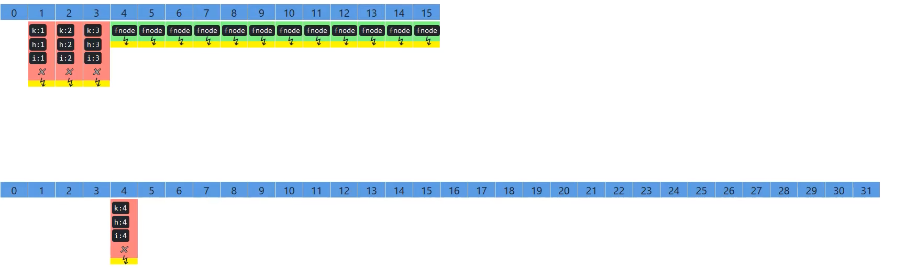

##### 重要方法

以下数组简称（table），链表简称（bin）

```java
// 获取 Node[] 中第 i 个 Node
static final <K,V> Node<K,V> tabAt(Node<K,V>[] tab, int i)
    
// cas 修改 Node[] 中第 i 个 Node 的值, c 为旧值, v 为新值
static final <K,V> boolean casTabAt(Node<K,V>[] tab, int i, Node<K,V> c, Node<K,V> v)
    
// 直接修改 Node[] 中第 i 个 Node 的值, v 为新值
static final <K,V> void setTabAt(Node<K,V>[] tab, int i, Node<K,V> v)
```


##### 构造器分析

以下数组简称（table），链表简称（bin）

```java
public ConcurrentHashMap(int initialCapacity, float loadFactor, int concurrencyLevel) {
    if (!(loadFactor > 0.0f) || initialCapacity < 0 || concurrencyLevel <= 0)
    	throw new IllegalArgumentException();
    if (initialCapacity < concurrencyLevel) // Use at least as many bins
    	initialCapacity = concurrencyLevel; // as estimated threads
    long size = (long)(1.0 + (long)initialCapacity / loadFactor);
    // tableSizeFor 仍然是保证计算的大小是 2^n, 即 16,32,64 ...
    int cap = (size >= (long)MAXIMUM_CAPACITY) ?
    	MAXIMUM_CAPACITY : tableSizeFor((int)size);
    this.sizeCtl = cap;
}
```

* initialCapacity初始化容量   初始化容量=initialCapacity/initialCapacity  最近的2^n

* loadFactor加载因子，第一次初始化容量会按照设置的，在之后的扩容都是按照0.75（扩容之后的容量=容量*1.5  且是贴近2^n）

* concurrencyLevel: 并发度  initialCapacity不能小于concurrencyLevel

  

  ```java
  // 1.8
  new ConcurrentHashMap(
          // ‘我想要放16个元素，数组多大你看着办‘ (必须满2的n次方)
          16,
          0.75F //扩容因子 如果要放12个元素的话创建出来也会是32
      // 设定扩容因子在构造的时候会调用一下 以后还是3/4
  );
  // 所以创建出来的Node数组容量是 32
  ```

  

  

##### get 流程

以下数组简称（table），链表简称（bin）

get流程无锁 volatile

```java
transient volatile Node<K,V>[] table;

public V get(Object key) {
    Node<K,V>[] tab; Node<K,V> e, p; int n, eh; K ek;
    // spread 方法能确保返回结果是正数
    int h = spread(key.hashCode());
    if ((tab = table) != null && (n = tab.length) > 0 &&
        (e = tabAt(tab, (n - 1) & h)) != null) {
        // 如果头结点已经是要查找的 key
        if ((eh = e.hash) == h) {
            if ((ek = e.key) == key || (ek != null && key.equals(ek)))
                return e.val;
        }
        // hash 为负数表示该 bin 在扩容中或是 treebin, 这时调用 find 方法来查找
        else if (eh < 0)
        	return (p = e.find(h, key)) != null ? p.val : null;
        // 正常遍历链表, 用 equals 比较
        while ((e = e.next) != null) {
            if (e.hash == h &&
                ((ek = e.key) == key || (ek != null && key.equals(ek))))
                return e.val;
        }
    }
    return null;
}
```


##### put 流程

以下数组简称（table），链表简称（bin）

```java
public V put(K key, V value) {
    return putVal(key, value, false);
}
// onlyIfAbsent是否不覆盖旧值？
final V putVal(K key, V value, boolean onlyIfAbsent) {
    if (key == null || value == null) throw new NullPointerException();
    // 其中 spread 方法会综合高位低位, 具有更好的 hash 性
    int hash = spread(key.hashCode());
    int binCount = 0;
    for (Node<K, V>[] tab = table; ; ) {
        // f 是链表头节点
        // fh 是链表头结点的 hash
        // i 是链表在 table 中的下标
        Node<K, V> f;
        int n, i, fh;
        // 要创建 table
        if (tab == null || (n = tab.length) == 0)
            // 初始化 table 使用了 cas, 无需 synchronized 创建成功, 进入下一轮循环
            tab = initTable();
        // 要创建链表头节点
        else if ((f = tabAt(tab, i = (n - 1) & hash)) == null) {
            // 添加链表头使用了 cas, 无需 synchronized
            if (casTabAt(tab, i, null,
                    new Node<K, V>(hash, key, value, null)))
                break;
        }
        // 帮忙扩容
        else if ((fh = f.hash) == MOVED)
            // 帮忙之后, 进入下一轮循环
            tab = helpTransfer(tab, f);
        else {// 这里说明不是初始化，也不是扩容，肯定是发生了桶(数组)下标冲突
            V oldVal = null;
            // 锁住链表头节点
            synchronized (f) {
                // 再次确认链表头节点没有被移动
                if (tabAt(tab, i) == f) {
                    // 链表
                    if (fh >= 0) {
                        binCount = 1;
                        // 遍历链表
                        for (Node<K, V> e = f; ; ++binCount) {
                            K ek;
                            // 找到相同的 key
                            if (e.hash == hash &&
                                    ((ek = e.key) == key ||
                                            (ek != null && key.equals(ek)))) {
                                oldVal = e.val;
                                // 更新
                                if (!onlyIfAbsent)
                                    e.val = value;
                                break;
                            }
                            Node<K, V> pred = e;
                            // 已经是最后的节点了, 新增 Node, 追加至链表尾
                            if ((e = e.next) == null) {
                                pred.next = new Node<K, V>(hash, key,
                                        value, null);
                                break;
                            }
                        }
                    }
                    // 红黑树
                    else if (f instanceof TreeBin) {
                        Node<K, V> p;
                        binCount = 2;
                        // putTreeVal 会看 key 是否已经在树中, 是, 则返回对应的 TreeNode
                        if ((p = ((TreeBin<K, V>) f).putTreeVal(hash, key,
                                value)) != null) {
                            oldVal = p.val;
                            if (!onlyIfAbsent)
                                p.val = value;
                        }
                    }
                }
            // 释放链表头节点的锁
            }
            if (binCount != 0) {
                if (binCount >= TREEIFY_THRESHOLD)
                    // 如果链表长度 >= 树化阈值(8), 进行链表转为红黑树
                    treeifyBin(tab, i);
                if (oldVal != null)
                    return oldVal;
                break;
            }
        }
    }
    // 增加 size 计数
    addCount(1L, binCount);
    return null;
}

// 初始化Table
private final Node<K, V>[] initTable() {
    Node<K, V>[] tab;
    int sc;
    while ((tab = table) == null || tab.length == 0) {
        if ((sc = sizeCtl) < 0)
            Thread.yield();
        // 尝试将 sizeCtl 设置为 -1（表示初始化 table）
        // 原子更改，返回true/false
        else if (U.compareAndSwapInt(this, SIZECTL, sc, -1)) {
            // 获得锁, 创建 table, 这时其它线程会在 while() 循环中 yield 直至 table 创建
            try {
                if ((tab = table) == null || tab.length == 0) {
                    int n = (sc > 0) ? sc : DEFAULT_CAPACITY;
                    Node<K, V>[] nt = (Node<K, V>[]) new Node<?, ?>[n];
                    table = tab = nt;
                    sc = n - (n >>> 2);
                }
            } finally {
                sizeCtl = sc;
            }
            break;
        }
    }
    return tab;
}

// check 是之前 binCount 的个数
private final void addCount(long x, int check) {
    CounterCell[] as;
    long b, s;
    if (
            // 已经有了 counterCells, 向 cell 累加
            (as = counterCells) != null ||
                    // 还没有, 向 baseCount 累加
                    !U.compareAndSwapLong(this, BASECOUNT, b = baseCount, s = b + x)
    ) {
        CounterCell a;
        long v;
        int m;
        boolean uncontended = true;
        if (
                // 还没有 counterCells
                as == null || (m = as.length - 1) < 0 ||
                        // 还没有 cell
                (a = as[ThreadLocalRandom.getProbe() & m]) == null ||
                // cell cas 增加计数失败
                !(uncontended = U.compareAndSwapLong(a, CELLVALUE, v = a.value, v + x))
        ) {
            // 创建累加单元数组和cell, 累加重试
            fullAddCount(x, uncontended);
            return;
        }
        if (check <= 1)
            return;
        // 获取元素个数
        s = sumCount();
    }
    if (check >= 0) {
        Node<K, V>[] tab, nt;
        int n, sc;
        while (s >= (long) (sc = sizeCtl) && (tab = table) != null &&
                (n = tab.length) < MAXIMUM_CAPACITY) {
            int rs = resizeStamp(n);
            if (sc < 0) {
                if ((sc >>> RESIZE_STAMP_SHIFT) != rs || sc == rs + 1 ||
                        sc == rs + MAX_RESIZERS || (nt = nextTable) == null ||
                        transferIndex <= 0)
                    break;
                // newtable 已经创建了，帮忙扩容
                if (U.compareAndSwapInt(this, SIZECTL, sc, sc + 1))
                    transfer(tab, nt);
            }
            // 需要扩容，这时 newtable 未创建
            else if (U.compareAndSwapInt(this, SIZECTL, sc,
                    (rs << RESIZE_STAMP_SHIFT) + 2)) // 负数扩容流程
                transfer(tab, null);
            s = sumCount();
        }
    }
}
```


##### size 计算流程

size 计算实际发生在 put，remove 改变集合元素的操作之中

* 没有竞争发生，向 baseCount 累加计数
* 有竞争发生，新建 counterCells，向其中的一个 cell 累加计数
  * counterCells 初始有两个 cell
  * 如果计数竞争比较激烈，会创建新的 cell 来累加计数

```java
public int size() {
    long n = sumCount();
    return ((n < 0L) ? 0 :
            (n > (long)Integer.MAX_VALUE) ? Integer.MAX_VALUE :(int)n);
}

final long sumCount() {
    CounterCell[] as = counterCells; CounterCell a;
    // 将 baseCount 计数与所有 cell 计数累加
    long sum = baseCount;
    if (as != null) {
        for (int i = 0; i < as.length; ++i) {
            if ((a = as[i]) != null)
                sum += a.value;
        }
    }
    return sum;
}
```


##### 总结

Java 8 数组（Node） +（ 链表 Node | 红黑树 TreeNode ） 以下数组简称（table），链表简称（bin）

* 初始化，使用 cas 来保证并发安全，懒惰初始化 table
* 树化，当 table.length < 64 时，先尝试扩容，超过 64 时，并且 bin.length > 8 时，会将链表树化，树化过程会用 synchronized 锁住链表头
* put，如果该 bin 尚未创建，只需要使用 cas 创建 bin；如果已经有了，锁住链表头进行后续 put 操作，元素
  添加至 bin 的尾部
* get，无锁操作仅需要保证可见性，扩容过程中 get 操作拿到的是 ForwardingNode 它会让 get 操作在新table 进行搜索
* 扩容，扩容时以 bin 为单位进行，需要对 bin 进行 synchronized，但这时妙的是其它竞争线程也不是无事可做，它们会帮助把其它 bin 进行扩容，扩容时平均只有 1/6 的节点会把复制到新 table 中
* size，元素个数保存在 baseCount 中，并发时的个数变动保存在 CounterCell[] 当中。最后统计数量时累加即可


**源码分析** http://www.importnew.com/28263.html
**其它实现** [Cliff Click's high scale lib](https://github.com/boundary/high-scale-lib)


#### 3. JDK 7 ConcurrentHashMap

它维护了一个 segment 数组，每个 segment 对应一把锁

* 优点：如果多个线程访问不同的 segment，实际是没有冲突的，这与 jdk8 中是类似的
* 缺点：Segments 数组默认大小为16，这个容量初始化指定后就不能改变了，并且不是懒惰初始化


##### 构造器分析

```java
public ConcurrentHashMap(int initialCapacity, float loadFactor, int concurrencyLevel) {
    if (!(loadFactor > 0) || initialCapacity < 0 || concurrencyLevel <= 0)
        throw new IllegalArgumentException();
    if (concurrencyLevel > MAX_SEGMENTS)
        concurrencyLevel = MAX_SEGMENTS;
    // ssize 必须是 2^n, 即 2, 4, 8, 16 ... 表示了 segments 数组的大小
    int sshift = 0;
    int ssize = 1;
    while (ssize < concurrencyLevel) {
        ++sshift;
        ssize <<= 1;
    }
    // segmentShift 默认是 32 - 4 = 28
    this.segmentShift = 32 - sshift;
    // segmentMask 默认是 15 即 0000 0000 0000 1111
    this.segmentMask = ssize - 1;
    if (initialCapacity > MAXIMUM_CAPACITY)
        initialCapacity = MAXIMUM_CAPACITY;
    int c = initialCapacity / ssize;
    if (c * ssize < initialCapacity)
        ++c;
    int cap = MIN_SEGMENT_TABLE_CAPACITY;
    while (cap < c)
        cap <<= 1;
    // 创建 segments and segments[0]
    Segment<K, V> s0 =
            new Segment<K, V>(loadFactor, (int) (cap * loadFactor),
                    (HashEntry<K, V>[]) new HashEntry[cap]);
    Segment<K, V>[] ss = (Segment<K, V>[]) new Segment[ssize];
    UNSAFE.putOrderedObject(ss, SBASE, s0); // ordered write of segments[0]
    this.segments = ss;
}
```

构造完成，如下图所示

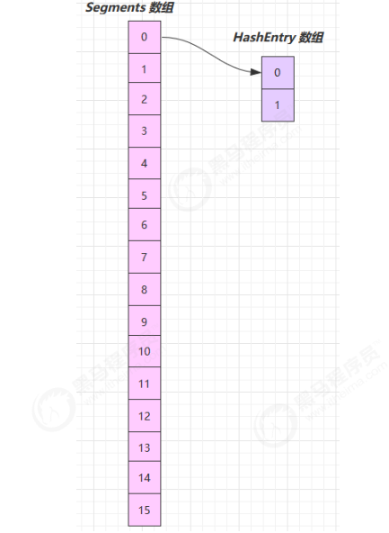

可以看到 ConcurrentHashMap 没有实现懒惰初始化，空间占用不友好

其中 this.segmentShift 和 this.segmentMask 的作用是决定将 key 的 hash 结果匹配到哪个 segment

例如，根据某一 hash 值求 segment 位置，先将高位向低位移动 this.segmentShift 位

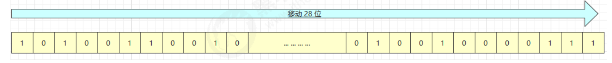

结果再与 this.segmentMask 做位于运算，最终得到 1010 即下标为 10 的 segment

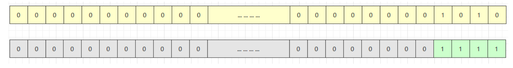


##### put 流程

```java
public V put(K key, V value) {
    Segment<K,V> s;
    if (value == null)
        throw new NullPointerException();
    int hash = hash(key);
    // 计算出 segment 下标
    int j = (hash >>> segmentShift) & segmentMask;
    // 获得 segment 对象, 判断是否为 null, 是则创建该 segment
    if ((s = (Segment<K,V>)UNSAFE.getObject
            (segments, (j << SSHIFT) + SBASE)) == null) {
        // 这时不能确定是否真的为 null, 因为其它线程也发现该 segment 为 null,
        // 因此在 ensureSegment 里用 cas 方式保证该 segment 安全性
        s = ensureSegment(j);
    }
    // 进入 segment 的put 流程
    return s.put(key, hash, value, false);
}
```

Segment 继承了可重入锁（ReentrantLock），它的 put 方法为

```java
final V put(K key, int hash, V value, boolean onlyIfAbsent) {
    // 尝试加锁
    HashEntry<K, V> node = tryLock() ? null :
            // 如果不成功, 进入 scanAndLockForPut 流程
            // 如果是多核 cpu 最多 tryLock 64 次, 进入 lock 流程
            // 在尝试期间, 还可以顺便看该节点在链表中有没有, 如果没有顺便创建出来
            scanAndLockForPut(key, hash, value);
    // 执行到这里 segment 已经被成功加锁, 可以安全执行
    V oldValue;
    try {
        HashEntry<K, V>[] tab = table;
        int index = (tab.length - 1) & hash;
        HashEntry<K, V> first = entryAt(tab, index);
        for (HashEntry<K, V> e = first; ; ) {
            if (e != null) {
                // 更新
                K k;
                if ((k = e.key) == key ||
                        (e.hash == hash && key.equals(k))) {
                    oldValue = e.value;
                    if (!onlyIfAbsent) {
                        e.value = value;
                        ++modCount;
                    }
                    break;
                }
                e = e.next;
            } else {
                // 新增
                // 1) 之前等待锁时, node 已经被创建, next 指向链表头
                if (node != null)
                    node.setNext(first);
                else
                    // 2) 创建新 node
                    node = new HashEntry<K, V>(hash, key, value, first);
                int c = count + 1;
                // 3) 扩容
                if (c > threshold && tab.length < MAXIMUM_CAPACITY)
                    rehash(node);
                else
                    // 将 node 作为链表头
                    setEntryAt(tab, index, node);
                ++modCount;
                count = c;
                oldValue = null;
                break;
            }
        }
    } finally {
        unlock();
    }
    return oldValue;
}
```


##### rehash 流程

发生在 put 中，因为此时已经获得了锁，因此 rehash 时不需要考虑线程安全

```java
private void rehash(HashEntry<K, V> node) {
    HashEntry<K, V>[] oldTable = table;
    int oldCapacity = oldTable.length;
    int newCapacity = oldCapacity << 1;
    threshold = (int) (newCapacity * loadFactor);
    HashEntry<K, V>[] newTable =
            (HashEntry<K, V>[]) new HashEntry[newCapacity];
    int sizeMask = newCapacity - 1;
    for (int i = 0; i < oldCapacity; i++) {
        HashEntry<K, V> e = oldTable[i];
        if (e != null) {
            HashEntry<K, V> next = e.next;
            int idx = e.hash & sizeMask;
            if (next == null) // Single node on list
                newTable[idx] = e;
            else { // Reuse consecutive sequence at same slot
                HashEntry<K, V> lastRun = e;
                int lastIdx = idx;
                // 过一遍链表, 尽可能把 rehash 后 idx 不变的节点重用【平移过去】
                for (HashEntry<K, V> last = next;
                     last != null;
                     last = last.next) {
                    int k = last.hash & sizeMask;
                    if (k != lastIdx) {
                        lastIdx = k;
                        lastRun = last;
                    }
                }
                newTable[lastIdx] = lastRun;
                // 剩余节点需要新建
                for (HashEntry<K, V> p = e; p != lastRun; p = p.next) {
                    V v = p.value;
                    int h = p.hash;
                    int k = h & sizeMask;
                    HashEntry<K, V> n = newTable[k];
                    newTable[k] = new HashEntry<K, V>(h, p.key, v, n);
                }
            }
        }
    }
    // 扩容完成, 才加入新的节点
    int nodeIndex = node.hash & sizeMask; // add the new node
    node.setNext(newTable[nodeIndex]);
    newTable[nodeIndex] = node;
    // 替换为新的 HashEntry table
    table = newTable;
}
```

附，调试代码

```java
public static void main(String[] args) {
    ConcurrentHashMap<Integer, String> map = new ConcurrentHashMap<>();
    for (int i = 0; i < 1000; i++) {
        int hash = hash(i);
        int segmentIndex = (hash >>> 28) & 15;
        if (segmentIndex == 4 && hash % 8 == 2) {
            System.out.println(i + "\t" + segmentIndex + "\t" + hash % 2 + "\t" + hash % 4 +
                    "\t" + hash % 8);
        }
    }
    map.put(1, "value");
    map.put(15, "value"); // 2 扩容为 4 15 的 hash%8 与其他不同
    map.put(169, "value");
    map.put(197, "value"); // 4 扩容为 8
    map.put(341, "value");
    map.put(484, "value");
    map.put(545, "value"); // 8 扩容为 16
    map.put(912, "value");
    map.put(941, "value");
    System.out.println("ok");
}

private static int hash(Object k) {
    int h = 0;
    if ((0 != h) && (k instanceof String)) {
        return sun.misc.Hashing.stringHash32((String) k);
    }
    h ^= k.hashCode();
    // Spread bits to regularize both segment and index locations,
    // using variant of single-word Wang/Jenkins hash.
    h += (h << 15) ^ 0xffffcd7d;
    h ^= (h >>> 10);
    h += (h << 3);
    h ^= (h >>> 6);
    h += (h << 2) + (h << 14);
    int v = h ^ (h >>> 16);
    return v;
}
```

##### get 流程

get 时并未加锁，用了 UNSAFE 方法保证了可见性，扩容过程中，get 先发生就从旧表取内容，get 后发生就从新表取内容

```java
public V get(Object key) {
    Segment<K,V> s; // manually integrate access methods to reduce overhead
    HashEntry<K,V>[] tab;
    int h = hash(key);
    // u 为 segment 对象在数组中的偏移量
    long u = (((h >>> segmentShift) & segmentMask) << SSHIFT) + SBASE;
    // s 即为 segment
    if ((s = (Segment<K,V>)UNSAFE.getObjectVolatile(segments, u)) != null &&
            (tab = s.table) != null) {
        for (HashEntry<K,V> e = (HashEntry<K,V>) UNSAFE.getObjectVolatile
                (tab, ((long)(((tab.length - 1) & h)) << TSHIFT) + TBASE);
             e != null; e = e.next) {
            K k;
            if ((k = e.key) == key || (e.hash == h && key.equals(k)))
                return e.value;
        }
    }
    return null;
}
```

##### size 计算流程

* 计算元素个数前，先不加锁计算两次，如果前后两次结果如一样，认为个数正确返回
* 如果不一样，进行重试，重试次数超过 3，将所有 segment 锁住，重新计算个数返回

```java
public int size() {
    // Try a few times to get accurate count. On failure due to
    // continuous async changes in table, resort to locking.
    final Segment<K,V>[] segments = this.segments;
    int size;
    boolean overflow; // true if size overflows 32 bits
    long sum; // sum of modCounts
    long last = 0L; // previous sum
    int retries = -1; // first iteration isn't retry
    try {
        for (;;) {
            if (retries++ == RETRIES_BEFORE_LOCK) {
                // 超过重试次数, 需要创建所有 segment 并加锁
                for (int j = 0; j < segments.length; ++j)
                    ensureSegment(j).lock(); // force creation
            }
            sum = 0L;
            size = 0;
            overflow = false;
            for (int j = 0; j < segments.length; ++j) {
                Segment<K,V> seg = segmentAt(segments, j);
                if (seg != null) {
                    sum += seg.modCount;
                    int c = seg.count;
                    if (c < 0 || (size += c) < 0)
                        overflow = true;
                }
            }
            if (sum == last) // 一致就证明没有其他线程更改
                break;
            last = sum; // 循环两次 👆
        }
    } finally {
        if (retries > RETRIES_BEFORE_LOCK) {
            for (int j = 0; j < segments.length; ++j)
                segmentAt(segments, j).unlock();
        }
    }
    return overflow ? Integer.MAX_VALUE : size;
}
```


### <font color="blue" style="font-weight:bold">十二、*LinkedBlockingQueue原理</font>


#### 1. 基本的入队出队

```java
public class LinkedBlockingQueue<E> extends AbstractQueue<E>
        implements BlockingQueue<E>, java.io.Serializable {
    static class Node<E> {
        E item;
        
        /**
         * 下列三种情况之一
         * - 真正的后继节点
         * - 自己, 发生在出队时
         * - null, 表示是没有后继节点, 是最后了
         */
        Node<E> next;
        
        Node(E x) { item = x; }
    }
}
```

初始化链表 `last = head = new Node<E>(null)`; Dummy (哑元/哨兵)节点用来占位，item 为 null


当一个节点入队 `last = last.next = node`;

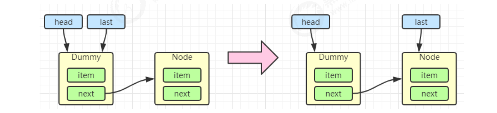

再来一个节点入队 `last = last.next = node;`

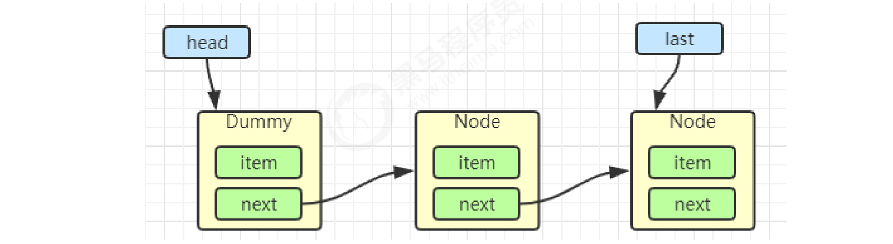

出队

```java
Node<E> h = head;
Node<E> first = h.next;
h.next = h; // help GC
head = first;
E x = first.item;
first.item = null;
return x;
```

`h = head`


`first = h.next`

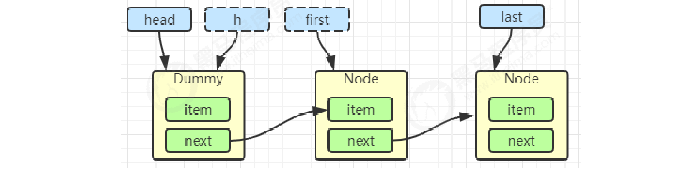

`h.next = h`

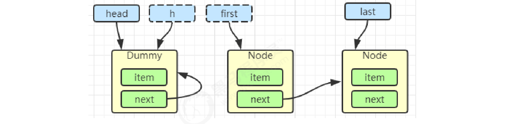

`head = first`

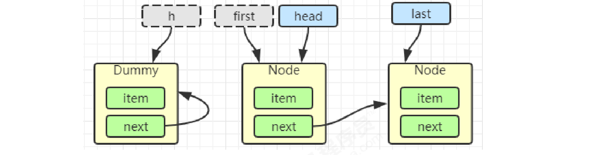

```java
E x = first.item;
first.item = null;
return x;
```


#### 2. 加锁分析

***高明之处*** 在于用了两把锁和 dummy 节点

* 用一把锁，同一时刻，最多只允许有一个线程（生产者或消费者，二选一）执行
* 用两把锁，同一时刻，可以允许两个线程同时（一个生产者与一个消费者）执行
  * 消费者与消费者线程仍然串行
  * 生产者与生产者线程仍然串行

线程安全分析

* 当节点总数大于 2 时（包括 dummy 节点），putLock 保证的是 last 节点的线程安全，takeLock 保证的是head 节点的线程安全。两把锁保证了入队和出队没有竞争

* 当节点总数等于 2 时（即一个 dummy 节点，一个正常节点）这时候，仍然是两把锁锁两个对象，不会竞争

* 当节点总数等于 1 时（就一个 dummy 节点）这时 take 线程会被 notEmpty 条件阻塞，有竞争，会阻塞

  * ```java
    while (count.get() == 0) {
        notEmpty.await();
    }
    ```

```java
// 用于 put(阻塞) offer(非阻塞)
private final ReentrantLock putLock = new ReentrantLock();

// 用户 take(阻塞) poll(非阻塞)
private final ReentrantLock takeLock = new ReentrantLock();
```

put 操作

```java
public void put(E e) throws InterruptedException {
    if (e == null) throw new NullPointerException();
    int c = -1; // 初始值，检查空位的
    Node<E> node = new Node<E>(e);
    final ReentrantLock putLock = this.putLock;
    // count 用来维护元素计数
    final AtomicInteger count = this.count;
    putLock.lockInterruptibly();
    try {
        // 满了等待
        while (count.get() == capacity) {
            // 倒过来读就好: 等待 notFull
            notFull.await();
        }
        // 有空位, 入队且计数加一
        enqueue(node);
        c = count.getAndIncrement();
        // 除了自己 put 以外, 队列还有空位, 由自己叫醒其他 put 线程
        if (c + 1 < capacity)
            // 不用signalAll是为了避免不必要的竞争
            notFull.signal();
    } finally {
        putLock.unlock();
    }
    // 如果队列中有一个元素, 叫醒 take 线程
    if (c == 0)
        // 这里调用的是 notEmpty.signal() 而不是 notEmpty.signalAll() 是为了减少竞争
        signalNotEmpty();
}
```

take 操作

```java
public E take() throws InterruptedException {
    E x;
    int c = -1;
    final AtomicInteger count = this.count;
    final ReentrantLock takeLock = this.takeLock;
    takeLock.lockInterruptibly();
    try {
        while (count.get() == 0) {
            notEmpty.await();
        }
        x = dequeue();
        c = count.getAndDecrement();
        if (c > 1)
            notEmpty.signal();
    } finally {
        takeLock.unlock();
    }
    // 如果队列中只有一个空位时, 叫醒 put 线程
    // 如果有多个线程进行出队, 第一个线程满足 c == capacity, 但后续线程 c < capacity
    if (c == capacity)
        // 这里调用的是 notFull.signal() 而不是 notFull.signalAll() 是为了减少竞争
        signalNotFull();
    return x;
}
```

> 由 put 唤醒 put 是为了避免信号不足


#### 3. 性能比较

主要列举 LinkedBlockingQueue 与 ArrayBlockingQueue 的性能比较

* Linked 支持有界，Array 强制有界
* Linked 实现是链表，Array 实现是数组
* Linked 是懒惰的，而 Array 需要提前初始化 Node 数组
* Linked 每次入队会生成新 Node，而 Array 的 Node 是提前创建好的
* Linked 两把锁，Array 一把锁


### <font color="blue" style="font-weight:bold">十三、* ConcurrentLinkedQueue </font>


ConcurrentLinkedQueue 的设计与 LinkedBlockingQueue 非常像，也是

* 两把【锁】，同一时刻，可以允许两个线程同时（一个生产者与一个消费者）执行
* dummy 节点的引入让两把【锁】将来锁住的是不同对象，避免竞争
* 只是这【锁】使用了 cas 来实现

事实上，ConcurrentLinkedQueue 应用还是非常广泛的

例如之前讲的 Tomcat 的 Connector 结构时，Acceptor 作为生产者向 Poller 消费者传递事件信息时，正是采用了ConcurrentLinkedQueue 将 SocketChannel 给 Poller 使用


#### 1. 原理

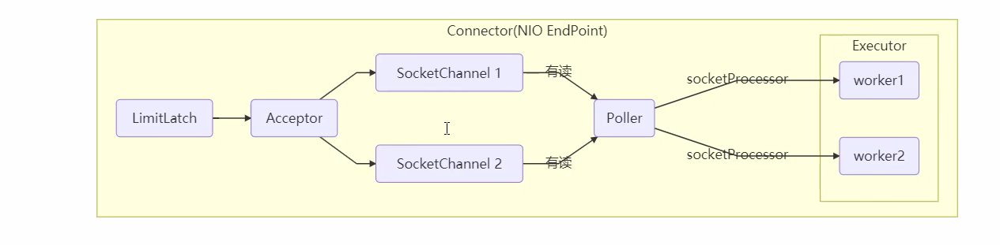

#### 2. 模拟

```java
class MyQueue<E> implements Queue<E> {
    @Override
    public String toString() {
        StringBuilder sb = new StringBuilder();
        for (Node<E> p = head; p != null; p = p.next.get()) {
            E item = p.item;
            if (item != null) {
                sb.append(item).append("->");
            }
        }
        sb.append("null");
        return sb.toString();
    }

    @Override
    public int size() {
        return 0;
    }

    @Override
    public boolean isEmpty() {
        return false;
    }

    @Override
    public boolean contains(Object o) {
        return false;
    }

    @Override
    public Iterator<E> iterator() {
        return null;
    }

    @Override
    public Object[] toArray() {
        return new Object[0];
    }

    @Override
    public <T> T[] toArray(T[] a) {
        return null;
    }

    @Override
    public boolean add(E e) {
        return false;
    }

    @Override
    public boolean remove(Object o) {
        return false;
    }

    @Override
    public boolean containsAll(Collection<?> c) {
        return false;
    }

    @Override
    public boolean addAll(Collection<? extends E> c) {
        return false;
    }

    @Override
    public boolean removeAll(Collection<?> c) {
        return false;
    }

    @Override
    public boolean retainAll(Collection<?> c) {
        return false;
    }

    @Override
    public void clear() {
    }

    @Override
    public E remove() {
        return null;
    }

    @Override
    public E element() {
        return null;
    }

    @Override
    public E peek() {
        return null;
    }

    public MyQueue() {
        head = last = new Node<>(null, null);
    }

    private volatile Node<E> last;
    private volatile Node<E> head;

    private E dequeue() {/*Node<E> h = head;
        Node<E> first = h.next;
        h.next = h;
        head = first;
        E x = first.item;
        first.item = null;
        return x;*/
        return null;
    }

    @Override
    public E poll() {
        return null;
    }

    @Override
    public boolean offer(E e) {
        return true;
    }

    static class Node<E> {
        volatile E item;

        public Node(E item, Node<E> next) {
            this.item = item;
            this.next = new AtomicReference<>(next);
        }

        AtomicReference<Node<E>> next;
    }
}
```

```java
public static void main(String[] args) {
    MyQueue<String> queue = new MyQueue<>();
    queue.offer("1");
    queue.offer("2");
    queue.offer("3");
    System.out.println(queue);
}
```

#### offer

```java
public boolean offer(E e) {
    Node<E> n = new Node<>(e, null);
    while(true) {
        // 获取尾节点
        AtomicReference<Node<E>> next = last.next;
        // S1: 真正尾节点的 next 是 null, cas 从 null 到新节点
        if(next.compareAndSet(null, n)) {
            // 这时的 last 已经是倒数第二, next 不为空了, 其它线程的 cas 肯定失败
            // S2: 更新 last 为倒数第一的节点
            last = n;
            return true;
        }
    }
}
```


### 十四、CopyOnWriteArrayList


`CopyOnWriteArraySet` 是它的马甲 底层实现采用了 **写入时拷贝** 的思想，增删改操作会将底层数组拷贝一份，更改操作在新数组上执行，这时不影响其它线程的**并发读，读写分离**。 以新增为例：

```java
public boolean add(E e) {
    synchronized (lock) {
        // 获取旧的数组
        Object[] es = getArray();
        int len = es.length;
        // 拷贝新的数组（这里是比较耗时的操作，但不影响其它读线程）
        es = Arrays.copyOf(es, len + 1);
        // 添加新元素
        es[len] = e;
        // 替换旧的数组
        setArray(es);
        return true;
    }
}
```

> 这里的源码版本是 Java 11，在 Java 1.8 中使用的是可重入锁而不是 synchronized


其它读操作并未加锁，例如：

```java
public void forEach(Consumer<? super E> action) {
    Objects.requireNonNull(action);
    for (Object x : getArray()) {
        @SuppressWarnings("unchecked") E e = (E) x;
        action.accept(e);
    }
}
```

适合『读多写少』的应用场景


#### get 弱一致性

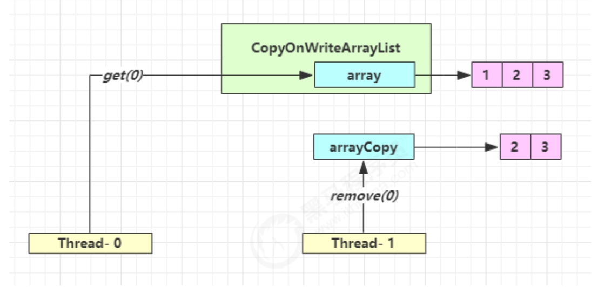

|时间点 |操作|
|--|:--|
|1 |Thread-0 getArray()|
|2| Thread-1 getArray()|
|3 |Thread-1 setArray(arrayCopy)|
|4| Thread-0 array[index]|

> 不容易测试，但问题确实存在


#### 迭代器弱一致性

```java
public static void main(String[] args) {
    CopyOnWriteArrayList<Integer> list = new CopyOnWriteArrayList<>();
    list.add(1);
    list.add(2);
    list.add(3);
    Iterator<Integer> iter = list.iterator();
    new Thread(() -> {
        list.remove(0);
        System.out.println(list);
    }).start();
    sleep(1);
    while (iter.hasNext()) {
        System.out.println(iter.next());
    }
}
```

> 不要觉得弱一致性就不好
>
> * 数据库的 MVCC 都是弱一致性的表现
> * 并发高和一致性是矛盾的，需要权衡
