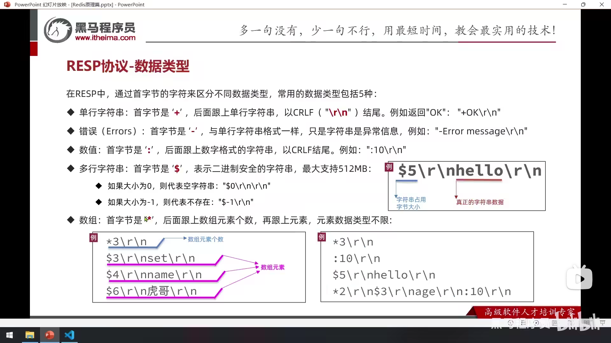
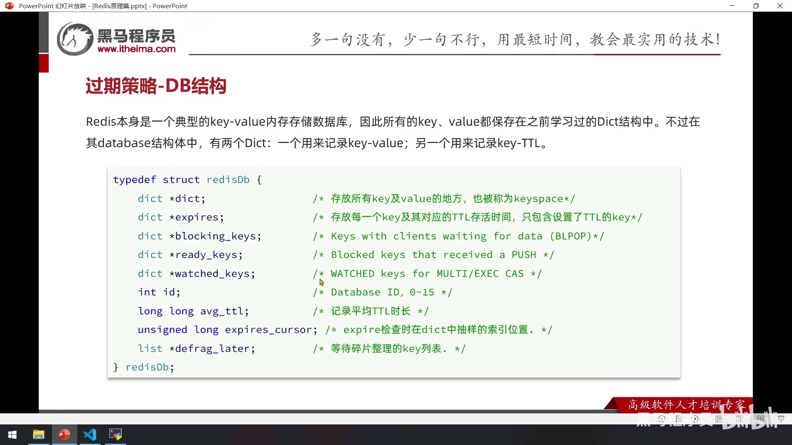
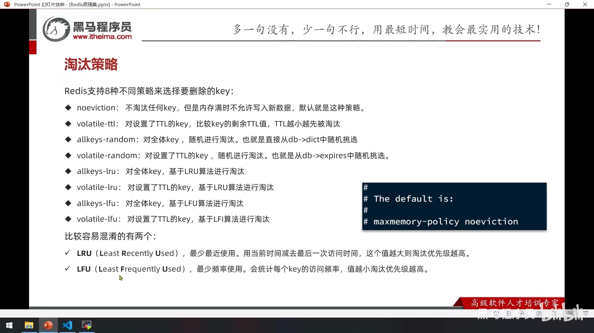

Redis

[toc]


# 1.命令


## 一、通用命令


## 二、基本数据类型


### 2.1 String


### 2.2 Key的结构


### 2.3 Hash


### 2.4 List


### 2.5 Set


```bash
127.0.0.1:6379> SADD zs ls ww zl
(integer) 3
127.0.0.1:6379> SADD ls ww mz eg
(integer) 3
127.0.0.1:6379> SINTER zs ls
1) "ww"
127.0.0.1:6379> SDIFF zs li
1) "ls"
2) "zl"
3) "ww"
127.0.0.1:6379> SDIFF zs ls
1) "ls"
2) "zl"
127.0.0.1:6379> SUNION zs ls
1) "ls"
2) "zl"
3) "ww"
4) "eg"
5) "mz"
127.0.0.1:6379> SISMEMBER zs ls
(integer) 1
127.0.0.1:6379> SISMEMBER li zs
(integer) 0
127.0.0.1:6379> SREM zs ls
(integer) 1
127.0.0.1:6379>
```


### 2.6 SortedSet/Zset


```bash
127.0.0.1:6379> ZADD stu 85 Jack 89 Lucy 82 Rose 95 Tom 78 Jerry 92 Amy 76 Miles
(integer) 7
127.0.0.1:6379> ZREM stu Tom
(integer) 1
127.0.0.1:6379> ZSCORE stu Amy
"92"
127.0.0.1:6379> ZRANK stu Rose
(integer) 2
127.0.0.1:6379> ZCOUNT stu 0 80
(integer) 2
127.0.0.1:6379> ZINCRBY stu 2 Amy
127.0.0.1:6379> ZRANGE stu 0 2  REV withscores
1) "Amy"
2) "94"
3) "Lucy"
4) "89"
5) "Jack"
6) "85"
127.0.0.1:6379> ZRANGEBYSCORE stu 0 80 withscores
1) "Miles"
2) "76"
3) "Jerry"
4) "78"
```

## 三、Java客户端


### 1. Jedis

#### 1.1 基本使用


#### 1.2 连接池


```java
public final class JedisConnectionPool {
    private static volatile JedisPool jedisPool;
    public static Jedis getJedis(){
        if (jedisPool == null) {
            synchronized (JedisConnectionPool.class) {
                if (jedisPool == null) {
                    JedisPoolConfig config = new JedisPoolConfig();
                    config.setMaxTotal(8);
                    config.setMaxIdle(8);
                    config.setMinIdle(0);
                    config.setMaxWait(Duration.of(200, ChronoUnit.MILLIS));
                    jedisPool = new JedisPool(config,"192.168.10.102",6379,1000);
                    return jedisPool.getResource();
                }
            }
        }
        return jedisPool.getResource();
    }
}

// close方法 如果是连接池制造的Jedis对象 close方法则是归还
public void close() {
        if (this.dataSource != null) {
            JedisPoolAbstract pool = this.dataSource;
            this.dataSource = null;
            if (this.isBroken()) {
                pool.returnBrokenResource(this);
            } else {
                // 归还
                pool.returnResource(this);
            }
        } else {
            super.close();
        }

    }
```

### 2. Lettuce/Spring Data Redis

#### 2.1 初识


#### 2.2 序列化


```java
@Bean
public RedisTemplate<String,Object> redisTemplate(LettuceConnectionFactory factory){
    RedisTemplate<String, Object> redisTemplate = new RedisTemplate<>();
    redisTemplate.setConnectionFactory(factory);

    redisTemplate.setKeySerializer(RedisSerializer.string());
    redisTemplate.setHashKeySerializer(RedisSerializer.string());

    GenericJackson2JsonRedisSerializer serializer = new GenericJackson2JsonRedisSerializer();
    redisTemplate.setValueSerializer(serializer);
    redisTemplate.setHashValueSerializer(serializer);
    return redisTemplate;
}
```


```java
@Configuration
public class RedisConfigurea {

    @Bean
    public RedisTemplate<String,Object> redisTemplate(LettuceConnectionFactory factory){
        RedisTemplate<String,Object> redisTemplate = new RedisTemplate<>();
        // 设置链接工厂
        redisTemplate.setConnectionFactory(factory);
        // key的序列化
        StringRedisSerializer redisSerializer = new StringRedisSerializer();
        redisTemplate.setKeySerializer(redisSerializer);

        // value序列化
        Jackson2JsonRedisSerializer<Object> jsonRedisSerializer = new Jackson2JsonRedisSerializer<>(Object.class);

        //序列化时将类的数据类型存入json，以便反序列化的时候转换成正确的类型
        ObjectMapper objectMapper = new ObjectMapper();
        objectMapper.activateDefaultTyping(LaissezFaireSubTypeValidator.instance,ObjectMapper.DefaultTyping.NON_FINAL);

        // 解决jackson2无法反序列化LocalDateTime的问题
        objectMapper.disable(SerializationFeature.WRITE_DATES_AS_TIMESTAMPS);
        objectMapper.registerModule(new JavaTimeModule());

        jsonRedisSerializer.setObjectMapper(objectMapper);

        redisTemplate.setValueSerializer(jsonRedisSerializer);
        redisTemplate.setHashKeySerializer(jsonRedisSerializer);
        return redisTemplate;
    }

}
```

#### 2.3 StringRedisTemplate


## 四 、相应案例


### 1. Session登录


### 2. Cache/缓存

#### 2.1 什么是缓存


#### 2.2 添加Redis缓存


#### 2.3 缓存更新策略


##### 2.3.1 先删除OR先更新？


**优先考虑先库后缓存*

[参考链接](https://blog.csdn.net/weixin_43361136/article/details/118940208)


#### 2.4 缓存穿透


#### 2.5 缓存雪崩


#### 2.6  缓存击穿


##### 代码

```java
@Override
public Result queryById(Long id) throws JsonProcessingException {

    String key = CacheConst.SHOP_FIELD + id;
    String shopCache = stringRedisTemplate.opsForValue().get(key);
    if (StrUtil.isNotBlank(shopCache)) {
        Shop shop = JSONUtil.toBean(shopCache, Shop.class);
        log.debug("走缓存 {}", shop);
        return Result.ok(shop);
    }

    String lockKey = CacheConst.CACHE_LOCK_SHOP+ id;
    System.out.println(lockKey);
    int count = 10;
    try {
        // 获取锁失败接着查询缓存看看其他进程有没有更新
        while ( !this.tryLock(lockKey)) {
            if (count == 0) {break;}
            shopCache =  stringRedisTemplate.opsForValue().get(key);
            log.info("获取锁失败  {}",shopCache);
            if (StrUtil.isNotBlank(shopCache)) {
                Shop shop = JSONUtil.toBean(shopCache, Shop.class);
                log.debug("走缓存 {}", shop);
                return Result.ok(shop);
            }
            TimeUnit.MILLISECONDS.sleep(500L);
            count--;
        }
        log.info("获取锁成功");
        Shop shop = getById(id);
        if (shop == null) {
            Shop obj = new Shop();
            obj.setId(id);
            stringRedisTemplate.opsForValue().set(key,JSONUtil.toJsonStr(obj),CacheConst.NULL_TTL,CacheConst.NULL_UNIT);
            return Result.fail("店铺不存在");
        }

        stringRedisTemplate.opsForValue().set(key, JSONUtil.toJsonStr(shop));
        stringRedisTemplate.expire(key, CacheConst.CACHE_TTL, CacheConst.CACHE_TTL_UNIT);
        return Result.ok(shop);
    } catch (InterruptedException e) {
        throw new RuntimeException(e);
    } finally {
        this.unlock(lockKey);
    }
}

private boolean tryLock(String lockKey){
    boolean lock = stringRedisTemplate.opsForValue().setIfAbsent(lockKey, "1", 10, TimeUnit.SECONDS);
    return lock;
}

private boolean unlock(String lockKey){
    boolean unlock = stringRedisTemplate.delete(lockKey);
    return unlock;
}
```


```java
String key = CacheConst.SHOP_FIELD + id;
String shopCache = stringRedisTemplate.opsForValue().get(key);
//todo 未命中直接返回
if (StrUtil.isBlank(shopCache)) {
    log.debug("未命中==> {}", shopCache);
    return Result.fail("店铺不存在");
}

RedisData shopData = JSONUtil.toBean(shopCache, RedisData.class);
JSONObject data = (JSONObject) shopData.getData();
Shop shop = JSONUtil.toBean(data, Shop.class);
// todo 命中判断是否过期
if (shopData.getExpire() .isAfter(LocalDateTime.now())) {
    // todo 未过期
    log.debug("未过期 {}", shopData);
    return Result.ok(shop);
}
// todo 过期
String lockKey = CacheConst.CACHE_LOCK_SHOP + id;

if (this.tryLock(lockKey)) {
    // todo 开启独立线程更新缓存刷新过期时间
    System.err.println("刷新");
    config.refreshRedis(lockKey,1000,getById(id),s->{
        this.unlock(lockKey);
        System.err.println("解锁");
    });

}
System.err.println("过期返回");
//todo 未获取锁 返回过期
return Result.ok(data);
```


#### 2.7 缓存封装工具

```java
@Slf4j
@Component
public class CacheClient {
    private final StringRedisTemplate redisTemplate;

    public CacheClient(StringRedisTemplate redisTemplate) {
        this.redisTemplate = redisTemplate;
    }

    public void set(String key, Object value, long expireTime, TimeUnit unit) {
        String json = JSONUtil.toJsonStr(value);
        redisTemplate.opsForValue().set(key, json, expireTime, unit);
    }

    // 逻辑过期时间
    public void setWithLogicalExpire(String key, Object value, long expireTime, TimeUnit unit) {
        RedisData redisData = new RedisData();
        redisData.setData(value);
        redisData.setExpireTime(LocalDateTime.now().plusSeconds(unit.toSeconds(expireTime)));
        redisTemplate.opsForValue().set(key, JSONUtil.toJsonStr(redisData));
    }

    /**
     * 防止穿透
     */
    public <R, ID> R getWithPassThrough(String keyPrefix, ID id, Class<R> type, Function<ID, R> callback,
                                        long cacheTime, TimeUnit unit
    ) {
        String key = keyPrefix + id;
        String json = redisTemplate.opsForValue().get(key);
        // todo redis获取缓存
        if (StrUtil.isNotBlank(json)) {
            R bean = JSONUtil.toBean(json, type);
            return bean;
        }
        // todo 判断是否为空值 "" null
        // 理解为序列化不了的 “”
        if (json != null) return null;

        // todo 查询数据库
        R r = callback.apply(id);
        // todo 防止击穿
        if (r == null) {
            redisTemplate.opsForValue().set(key, "", cacheTime, unit);
            return null;
        }
        // todo 存入redis
        this.set(key, r, cacheTime, unit);
        return r;
    }

    /**
     * 防止击穿逻辑锁
     */
    public <R, ID> R getWithLogicalExpire(String keyPrefix, ID id, Class<R> type, String lockKeyPrefix, Function<ID, R> dbcallback) {
        String key = keyPrefix + id;
        String typeCache = redisTemplate.opsForValue().get(key);
        //todo 未命中直接返回
        if (StrUtil.isBlank(typeCache)) {
            log.debug("未命中==> {}", typeCache);
            return null;
        }

        RedisData redisData = JSONUtil.toBean(typeCache, RedisData.class);
        JSONObject data = (JSONObject) redisData.getData();

        R r = JSONUtil.toBean(data, type);
        // todo 命中判断是否过期
        if (redisData.getExpireTime().isAfter(LocalDateTime.now())) {
            // todo 未过期
            log.debug("未过期 {}", redisData);
            return r;
        }
        // todo 过期
        String lockKey = lockKeyPrefix + id;
        // todo 尝试获取锁
        if (this.tryLock(lockKey)) {
            // todo 开启独立线程更新缓存刷新过期时间
            System.err.println("刷新");
            config.refreshRedis(lockKey, 10, dbcallback.apply(id), s -> {
                this.unlock(lockKey);
                System.err.println("解锁");
            });

        }
        System.err.println("过期返回");
        return r;
    }

    /**
     * 缓存击穿互斥锁
     */
    public <R, ID> R getMutuallyExclusive(String keyPrefix, ID id, Class<R> type, String lockKeyPrefix,
                                          Function<ID, R> function,
                                          long cacheTime, TimeUnit cacheUnit
    ) {
        String key = keyPrefix + id;
        String cacheJson = redisTemplate.opsForValue().get(key);
        if (StrUtil.isNotBlank(cacheJson)) {
            R r = JSONUtil.toBean(cacheJson, type);
            log.debug("走缓存 {}", r);
            return r;
        }

        if (cacheJson != null) return null;

        String lockKey = lockKeyPrefix + id;
        int count = 10;
        try {
            // 获取锁失败接着查询缓存看看其他进程有没有更新
            while (!this.tryLock(lockKey)) {
                if (count == 0) {
                    return null;
                }
                cacheJson = redisTemplate.opsForValue().get(key);
                log.info("获取锁失败  {}", cacheJson);
                if (StrUtil.isNotBlank(cacheJson)) {
                    R r = JSONUtil.toBean(cacheJson, type);
                    log.debug("走缓存 {}", r);
                    return r;
                }
                TimeUnit.MILLISECONDS.sleep(500);
                count--;
            }

            log.info("获取锁成功");
            R r = function.apply(id);
            if (r == null) {
                redisTemplate.opsForValue().set(key, "", cacheTime, cacheUnit);
                return null;
            }
            redisTemplate.opsForValue().set(key, JSONUtil.toJsonStr(r), cacheTime, cacheUnit);
            return r;
        } catch (InterruptedException e) {
            throw new RuntimeException(e);
        } finally {
            log.debug("释放锁");
            this.unlock(lockKey);
        }
    }


    private boolean tryLock(String lockKey) {
        boolean lock = redisTemplate.opsForValue().setIfAbsent(lockKey, "1", 10, TimeUnit.SECONDS);
        return lock;
    }

    private boolean unlock(String lockKey) {
        boolean unlock = redisTemplate.delete(lockKey);
        return unlock;
    }

    @Autowired
    private MybatisConfig config;
}
```


#### 

###  3 应对秒杀


#### 3.1 全局唯一ID


```java
public class RedisIdWorker {
    private static final long START_TIME = LocalDateTime.of(2022, 1, 1, 0, 0, 0).toEpochSecond(ZoneOffset.UTC);
    private static final int COUNT_BITS = 32;

    @Autowired
    private StringRedisTemplate stringRedisTemplate;


    public long nextId(String keyPrefix){
        // 时间戳
        long now = LocalDateTime.now().toEpochSecond(ZoneOffset.UTC);
        now = now - START_TIME;
        // 生成序列号
        String key = "icr:" + keyPrefix + ":" + LocalDate.now().format(DateTimeFormatter.ofPattern("yyyy:MM:dd"));
        long count = stringRedisTemplate.opsForValue().increment(key);
        // 拼接并返回
        return now << COUNT_BITS | count;
    }

    public static void main(String[] args) {
        int i = 0 << 32 | 100;
        System.out.println(i);
    }
}
```


#### 3.2 秒杀 超卖


```java
 seckillVoucher.setStock((seckillVoucher.getStock() - 1));
        boolean update = seckillVoucherService.update()
                .setSql("stock = stock -1")
                .eq("voucher_id",voucherId)
                .gt("stock",0)
                .update()
                ;
        if (!update) {
            return Result.fail("优惠卷已售空");
        }
```

```java
@Transactional
    public Result createUserOrderVoucher(Long voucherId, SeckillVoucher seckillVoucher, LocalDateTime now) {
        Long id = UserHolder.getUser().getId();
        // 对id一样的字符串常量池加锁 不影响 this 这把钥匙的使用权
        // 因为使用的是 防止同一个人下单两次
        synchronized (id.toString().intern()) {
            int count = query().eq("user_id", id).eq("voucher_id", voucherId).count();
            if (count > 0) {
                return Result.fail("您只能下一单");
            }

            seckillVoucher.setStock((seckillVoucher.getStock() - 1));
            boolean update = seckillVoucherService.update()
                    .setSql("stock = stock -1")
                    .eq("voucher_id", voucherId)
                    .gt("stock", 0)
                    .update();
            if (!update) {
                return Result.fail("优惠卷已售空");
            }

            VoucherOrder voucherOrder = new VoucherOrder();
            voucherOrder.setId(idWorker.nextId("order"));
            voucherOrder.setUserId(id);
            voucherOrder.setVoucherId(voucherId);
            voucherOrder.setStatus(1);
            voucherOrder.setUpdateTime(now);
            voucherOrder.setCreateTime(now);
            voucherOrder.setPayType(1);
            save(voucherOrder);
            return Result.ok("下单成功！ 请尽快支付！");
        }
    }
```

##### 微服务情况


#### 3.3 分布式锁

[redis实现分布式锁相关链接](https://blog.csdn.net/zxd1435513775/article/details/122194202 )


```java
SimpleRedisLock redisLock = new SimpleRedisLock("order:"+id, stringRedisTemplate); // 自定义的锁对象实现
boolean isLock = redisLock.tryLock(10, TimeUnit.SECONDS);
if (!isLock) {
    // TODO 注意 这里的锁对象是不同 进程 同一个 用户 的id 不同用户不会产生争抢锁现象 只会判断 where stock > 0
    return Result.fail("不允许重复下单");
}
try {
    int count = query().eq("user_id", id).eq("voucher_id", voucherId).count();
    if (count > 0) {
        return Result.fail("您只能下一单");
    }

	//    ......
    return Result.ok("下单成功！ 请尽快支付！");
    //}
} finally {
    redisLock.unlock();
}
```

##### 有时效性key的失效导致key误删问题


```markdown
## 图解：
- 线程1 获取到锁 但是由于业务执行时间过长导致锁Key失效 直接会使抢夺锁的线程2 获取到锁并且生成key
* 于此同时线程1执行业务完成 直接删除线程2 对应的key 导致线程3 在线程2 执行业务时同时获取到了key 
**导致了一系列数据不一致问题**
```


> 根据存入的value(Thread.id) 判断释放的线程id是否一致

```java
public class SimpleRedisLock implements ILock {
    private final static String LOCK_PREFIX = "lock:";
    // 每个服务的jvm初始化放在字符串常量池的 中的UUID 作为唯一标识前缀
    private static final String ID_PREFIX = UUID.randomUUID().toString(true);
    private final String name;
    private final StringRedisTemplate stringRedisTemplate;


    public SimpleRedisLock(String name, StringRedisTemplate stringRedisTemplate) {
        this.name = name;
        this.stringRedisTemplate = stringRedisTemplate;
    }


    @Override
    public boolean tryLock(long timeoutSec,TimeUnit unit) {
        String threadId = ID_PREFIX + Thread.currentThread();
        Boolean ownLock = stringRedisTemplate.opsForValue().setIfAbsent(LOCK_PREFIX + name, threadId,timeoutSec,unit);
        return Boolean.TRUE.equals(ownLock);
    }

    @Override
    public void unlock() {
        String threadId = ID_PREFIX + Thread.currentThread();
        String id = stringRedisTemplate.opsForValue().get(LOCK_PREFIX + name);
        // 判断将要执行删除锁的服务线程是否为加锁线程 解决锁误删问题
        if (! threadId.equals(id)) {
            throw new BusinessLock("释放锁异常");
        }
        stringRedisTemplate.delete(LOCK_PREFIX + name);
    }

    class BusinessLock extends RuntimeException {
        private String msg;

        public BusinessLock(String msg) {
            super(msg);
        }

        public BusinessLock(Throwable cause, String msg) {
            super(msg,cause);
        }
    }
}
```

##### 阻塞释放问题


```markdown
# 这里是因为线程1 `释放阻塞` 由于前面对比的版本/id是 value 线程1释放是已经判断过的 不会对比value直接删除 `key` 而
# 此时 `key` 中存放的是线程2 的锁value 导致线程3乘虚而入

# 这里 key 一致是要保证分布式多个服务之间互斥 value是防止误删
```

**所以要保证获取锁和释放锁是`原子性操作`**

```java
if (! threadId.equals(id)) {
    throw new BusinessLock("释放锁异常");
}
stringRedisTemplate.delete(LOCK_PREFIX + name);
// 这一段执行 `equals`  `delete` 是组合操作 很难保证原子性
```


##### lua 保证原子性


```sh
127.0.0.1:6379> EVAL "return redis.call('mset',KEYS[1],ARGV[1],KEYS[2],ARGV[2])" 2 k1 k2 v1 v2

127.0.0.1:6379> EVAL "return redis.call('hset',KEYS[1],AVGS[1],AVGS[2])" h1 name zs
```

```lua
local id = redis.call('GET',KEYS[1])

if(id == ARGV[1]) then
  return redis.call('DEL',KEYS[1])
end

return 0
```


```java
public class SimpleRedisLock implements ILock {

    private final static String LOCK_PREFIX = "lock:";
    // 每个服务的jvm初始化放在字符串常量池的 中的UUID 作为唯一标识前缀
    private static final String ID_PREFIX = UUID.randomUUID().toString(true);
    private final String name;
    private final StringRedisTemplate stringRedisTemplate;
    private static final DefaultRedisScript<Long> UNLOCK_SCRIPT;

    public SimpleRedisLock(String name, StringRedisTemplate stringRedisTemplate) {
        this.name = name;
        this.stringRedisTemplate = stringRedisTemplate;
    }

    static {
        // 加载脚本
        UNLOCK_SCRIPT = new DefaultRedisScript<>();
        UNLOCK_SCRIPT.setLocation(new ClassPathResource("unlock.lua"));
        UNLOCK_SCRIPT.setResultType(Long.class);
    }

    @Override
    public boolean tryLock(long timeoutSec, TimeUnit unit) {
        String threadId = ID_PREFIX + Thread.currentThread();
        Boolean ownLock = stringRedisTemplate.opsForValue().setIfAbsent(LOCK_PREFIX + name, threadId, timeoutSec, unit);
        return Boolean.TRUE.equals(ownLock);
    }

    @Override
    public void unlock() {
        Long result = stringRedisTemplate
                .execute(
                        UNLOCK_SCRIPT,
                        Collections.singletonList(LOCK_PREFIX + name),
                        ID_PREFIX + Thread.currentThread().getId());
        // todo 缩减为一行代码 优化误删问题 但是归根还是超时问题
        if (result == 0) {
            throw new BusinessLock("释放锁异常");
        }
    }

    /*@Override
    public void unlock() {
        String threadId = ID_PREFIX + Thread.currentThread();
        String id = stringRedisTemplate.opsForValue().get(LOCK_PREFIX + name);
        // 判断将要执行删除锁的服务线程是否为加锁线程 解决锁误删问题
        if (! threadId.equals(id)) {
            throw new BusinessLock("释放锁异常");
        }
        stringRedisTemplate.delete(LOCK_PREFIX + name);
    }*/

    class BusinessLock extends RuntimeException {
        private String msg;

        public BusinessLock(String msg) {
            super(msg);
        }

        public BusinessLock(Throwable cause, String msg) {
            super(msg, cause);
        }
    }
}
```

 相关业务层

```java
@Transactional
public Result createUserOrderVoucher(Long voucherId, SeckillVoucher seckillVoucher, LocalDateTime now) {
    Long id = UserHolder.getUser().getId();
    // 对id一样的字符串常量池加锁 不影响 this 这把钥匙的使用权
    // 因为使用的是 防止同一个人下单两次
    // synchronized (id.toString().intern()) {
    // 只锁该对象的下单重复
    // 多用户的秒杀有 where stock > 0 的原子锁保证
    SimpleRedisLock redisLock = new SimpleRedisLock("order:"+id, stringRedisTemplate);
    boolean isLock = redisLock.tryLock(10, TimeUnit.SECONDS);
    if (!isLock) {
        // TODO 注意 这里的锁对象是不同 进程 同一个 用户 的id 不同用户不会产生争抢锁现象 只会判断 where stock > 0
        return Result.fail("不允许重复下单");
    }
    try {
        int count = query().eq("user_id", id).eq("voucher_id", voucherId).count();
        if (count > 0) {
            return Result.fail("您只能下一单");
        }

        seckillVoucher.setStock((seckillVoucher.getStock() - 1));
        boolean update = seckillVoucherService.update()
            .setSql("stock = stock -1")
            .eq("voucher_id", voucherId)
            .gt("stock", 0)
            .update();
        if (!update) {
            return Result.fail("优惠卷已售空");
        }

        VoucherOrder voucherOrder = new VoucherOrder();
        voucherOrder.setId(idWorker.nextId("order"));
        voucherOrder.setUserId(id);
        voucherOrder.setVoucherId(voucherId);
        voucherOrder.setStatus(1);
        voucherOrder.setUpdateTime(now);
        voucherOrder.setCreateTime(now);
        voucherOrder.setPayType(1);
        save(voucherOrder);
        return Result.ok("下单成功！ 请尽快支付！");
        //}
    } finally {
        redisLock.unlock();
    }
}
```


##### Redisson 分布式锁优化


```http
https://redisson.org/
https://github.com/redisson/redisson
## github 中文
https://github.com/redisson/redisson/wiki/%E7%9B%AE%E5%BD%95
```

###### 依赖于配置


```xml
<dependency>
   <groupId>org.redisson</groupId>
   <artifactId>redisson</artifactId>
   <version>3.17.1</version>
</dependency>  
```


###### 测试


###### 可重入


###### 主从一致性


##### 异步秒杀优化


```markdown
- 思路
1. 将库存信息存放至redis中  [size : 100] 用户下单时将库存减一 [decr : 1] 保证库存安全
2. 将购买过思维用户id存入 redis set 集合中 j
```

```lua
-- 如果set集合中不存在就添加 返回一 
if(redis.call('sismember',KEYS[1],ARGV[1]) == 0) then redis.call('sadd',KEYS[1],ARGV[1]) return 1 end return 0
-- 注意 then 后面的冒号在redis EVAL 中不需要 但是时LUA读起来更加规范

-- 判断value的值是否大于0 就减一
local size = redis.call('get',KEYS[1]) if(tonumber(size) > 0) then redis.call('decr',KEYS[1]) return 1 end return 0 
```


###### 代码1

```lua
 -- 1.参数列表
 -- 1.1.优惠券id
 local voucherId = ARGV[1]
 -- 1.2.用户id
 local userId = ARGV[2]
 -- 2.数据key
 -- 2.1.库存key
 local stockKey = 'seckill:stock:' .. voucherId
 -- 2.2.订单key
 local orderKey = 'seckill:order:' .. voucherId

 -- 3.脚本业务
 -- 3.1.判断库存是否充足 get stockKey
 if(tonumber(redis.call('get', stockKey)) <= 0) then
     -- 3.2.库存不足，返回1
     return 1
 end
 -- 3.2.判断用户是否下单 SISMEMBER orderKey userId
 if(redis.call('sismember', orderKey, userId) == 1) then
     -- 3.3.存在，说明是重复下单，返回2
     return 2
 end
 -- 3.4.扣库存 incrby stockKey -1
 redis.call('incrby', stockKey, -1)
 -- 3.5.下单（保存用户）sadd orderKey userId
 redis.call('sadd', orderKey, userId)

return 0
```


对应的java业务层

```java
 private final IVoucherService voucherService;

    private final ISeckillVoucherService seckillVoucherService;

    private final RedisIdWorker idWorker;

    private final StringRedisTemplate stringRedisTemplate;

    private final RedissonClient redissonClient;

    private final static DefaultRedisScript<Long> SECKILL_SCRIPT;

    static {
        SECKILL_SCRIPT = new DefaultRedisScript();
        SECKILL_SCRIPT.setResultType(Long.class);
        SECKILL_SCRIPT.setLocation(new ClassPathResource("seckill.lua"));
    }

    private BlockingQueue<VoucherOrder> taskQueue = new LinkedBlockingQueue<>(1024 * 1024);
    private static final ExecutorService SCKILL_SERVICE = Executors.newSingleThreadExecutor();

    // 当前类初始化完毕执行
    @PostConstruct
    private void init() {
        // 提交线程任务
        SCKILL_SERVICE.submit(new VoucherOrderHandler());
    }


    @Override
    public Result seckillVoucher(Long voucherId) {
        Long userId = UserHolder.getUser().getId();

        Long result = stringRedisTemplate.execute(
                SECKILL_SCRIPT,
                Collections.emptyList(),
                voucherId.toString(),
                userId.toString()
        );
        int resultValue = result.intValue();

        if (resultValue == 1) {
            return Result.fail("已售空");
        }
        if (resultValue == 2) {
            return Result.fail("您已购买过此卷");
        }
        if (resultValue != 0) {
            return Result.fail("服务器错误");
        }

        // 将订单加入阻塞队列 异步执行
        long order = idWorker.nextId("order");

        VoucherOrder voucherOrder = new VoucherOrder();
        voucherOrder.setId(order);
        voucherOrder.setUserId(userId);
        voucherOrder.setVoucherId(voucherId);
        voucherOrder.setStatus(1);
        voucherOrder.setUpdateTime(LocalDateTime.now());
        voucherOrder.setCreateTime(LocalDateTime.now());
        voucherOrder.setPayType(1);
	    // 将任务加入任务队列
        taskQueue.add(voucherOrder);

        return Result.ok("订单号\t" + order);
    }

    private class VoucherOrderHandler implements Runnable {
        @Override
        public void run() {
            while (true) {
                try {
                    // take 会阻塞
                    VoucherOrder voucherOrder = taskQueue.take();
                    // 创建订单
                    createVoucherOrder(voucherOrder);
                } catch (InterruptedException e) {
                    e.printStackTrace();
                    log.error("error", e);
                }
            }
        }

        private void createVoucherOrder(VoucherOrder voucherOrder) {
            Long userId = voucherOrder.getUserId();
            Long voucherId = voucherOrder.getVoucherId();
            RLock redisLock = redissonClient.getLock("lock:order" + userId);
            // 注意 这里锁的对象还是用户id解决一人一单问题

            boolean isLock = redisLock.tryLock();
            if (!isLock) {
                // TODO 注意 这里的锁对象是不同 进程 同一个 用户 的id 不同用户不会产生争抢锁现象 只会判断 where stock > 0
                log.error("不允许重复下单");
                return;
            }
            try {
                int count = query().eq("user_id", userId).eq("voucher_id", voucherId).count();
                if (count > 0) {
                    log.error("不允许重复下单");
                    return;
                }

                boolean update = seckillVoucherService.update()
                        .setSql("stock = stock -1")
                        .eq("voucher_id", voucherId)
                        .gt("stock", 0)
                        .update();

                if (!update) {
                    log.error("库存不足");
                    return;
                }
                // 保存订单
                save(voucherOrder);
            } finally {
                redisLock.unlock();
            }
        }
    }
```


##### 消息队列优化


###### 1 基于List


###### 2 PubSub


###### 3 Stream


```sh
# 创建一个队列
XADD s1 * k1 v1 k2 v2
# 在这个队列读取消息 从0 开始 4 条
XREAD COUNT 4 BLOCK 2000 STREAMS s1 0
XREAD COUNT 4 BLOCK 0 STREAMS s1 $

# 根据队列创建一个消费者组
XGROUP CREATE s1 wjl 0 
# 读取未被消费过的消息
XREADGROUP GROUP wjl c1 COUNT 10 BLOCK 0 STREAMS s1 >
# 从0开始 读取消费过但是未确认的消息
XREADGROUP GROUP wjl c1 COUNT 10 BLOCK 0 STREAMS s1 0
# 确认消息
XACK  s1 wjl 消息id ..

# s1 队列名 wjl组名  IDEL 空闲时间毫秒 - + id所有范围 10 count c1 指定消费者 每个消费者都有XPENDING
127.0.0.1:6379> XPENDING s1 wjl IDLE 1000  - + 10  c1
```


##### 代码实现

```sh
-- 手动创建一个队列和消费组
127.0.0.1:6379> XGROUP CREATE stream.orders g1 0  MKSTREAM
OK
XREADGROUP GROUP g1 c1 COUNT 1 BLOCK 0 STREAMS stream.orders >
```


```lua
 -- 1.参数列表
 -- 1.1.优惠券id
 local voucherId = ARGV[1]
 -- 1.2.用户id
 local userId = ARGV[2]
 -- 1.3 订单id
 local orderId = ARGV[3]

 -- 2.数据key
 -- 2.1.库存key
 local stockKey = 'seckill:stock:' .. voucherId
 -- 2.2.订单key
 local orderKey = 'seckill:order:' .. voucherId

 -- 3.脚本业务
 -- 3.1.判断库存是否充足 get stockKey
 if(tonumber(redis.call('get', stockKey)) <= 0) then
     -- 3.2.库存不足，返回1
     return 1
 end
 -- 3.2.判断用户是否下单 SISMEMBER orderKey userId
 if(redis.call('sismember', orderKey, userId) == 1) then
     -- 3.3.存在，说明是重复下单，返回2
     return 2
 end
 -- 3.4.扣库存 incrby stockKey -1
 redis.call('incrby', stockKey, -1)
 -- 3.5.下单（保存用户）sadd orderKey userId
 redis.call('sadd', orderKey, userId)

-- 发送消息到队列中 [stream.orders]
redis.call('xadd','stream.orders','*','userId',userId,'id',voucherId,'orderId',orderId)
return 0

-- redis中声明一个队列和消费组
```


```java
private final IVoucherService voucherService;

    private final ISeckillVoucherService seckillVoucherService;

    private final RedisIdWorker idWorker;

    private final StringRedisTemplate stringRedisTemplate;

    private final RedissonClient redissonClient;

    private final static DefaultRedisScript<Long> SECKILL_SCRIPT;

    static {
        SECKILL_SCRIPT = new DefaultRedisScript();
        SECKILL_SCRIPT.setResultType(Long.class);
        SECKILL_SCRIPT.setLocation(new ClassPathResource("seckill.lua"));
    }

    private static final ExecutorService SCKILL_SERVICE = Executors.newSingleThreadExecutor();

    // 当前类初始化完毕执行
    @PostConstruct
    private void init() {
        // 提交线程任务
        SCKILL_SERVICE.submit(new VoucherOrderHandler());
    }
    private class VoucherOrderHandler implements Runnable {
        @Override
        public void run() {
            String streamQueue = "stream.orders";
            while (true) {
                try {
                    // take 会阻塞
                    // XREADGROUP GROUP g1 c1 COUNT 1 BLOCK 2000 STREAMS stream.orders >
                    List<MapRecord<String, Object, Object>> mapRecords = stringRedisTemplate.opsForStream().read(
                            Consumer.from("g1", "c1"),
                            StreamReadOptions.empty().count(1).block(Duration.ofSeconds(2)),
                            //  ReadOffset.lastConsumed() == '>'
                            StreamOffset.create(streamQueue, ReadOffset.lastConsumed())
                    );
                    if (mapRecords == null || mapRecords.isEmpty()) {
                        continue;
                    }
                    MapRecord<String, Object, Object> entries = mapRecords.get(0);
                    Map<Object, Object> entriesValue = entries.getValue();
                    VoucherOrder voucherOrder = BeanUtil.fillBeanWithMap(entriesValue, new VoucherOrder(), true);

                    // 消息确认
                    stringRedisTemplate.opsForStream().acknowledge(streamQueue,"g1",entries.getId());
                    // 创建订单
                    createVoucherOrder(voucherOrder);
                } catch (Exception e) {
                    log.error("error", e);
                    handlePendingList();
                }
            }
        }

        private void handlePendingList() {
            String streamQueue = "stream.orders";
            while (true) {
                try {
                    // take 会阻塞
                    // XREADGROUP GROUP g1 c1 COUNT 1 BLOCK 2000 STREAMS stream.orders 0
                    List<MapRecord<String, Object, Object>> mapRecords = stringRedisTemplate.opsForStream().read(
                            Consumer.from("g1", "c1"),
                            StreamReadOptions.empty().count(1),// 处理出异常集合不需要阻塞
                            //  ReadOffset.lastConsumed() == '>'
                            StreamOffset.create(streamQueue, ReadOffset.from("0"))
                    );
                    if (mapRecords == null || mapRecords.isEmpty()) {
                        // 如果为null 说明pending-list没有异常消息 结束循环
                        break;
                    }
                    MapRecord<String, Object, Object> entries = mapRecords.get(0);
                    Map<Object, Object> entriesValue = entries.getValue();
                    VoucherOrder voucherOrder = BeanUtil.fillBeanWithMap(entriesValue, new VoucherOrder(), true);

                    // 消息确认
                    stringRedisTemplate.opsForStream().acknowledge(streamQueue,"g1",entries.getId());
                    // 创建订单
                    createVoucherOrder(voucherOrder);
                } catch (Exception e) {
                    log.error("处理pending-list订单异常", e);
                }
            }
        }

        private void createVoucherOrder(VoucherOrder voucherOrder) {
            Long userId = voucherOrder.getUserId();
            Long voucherId = voucherOrder.getVoucherId();
            RLock redisLock = redissonClient.getLock("lock:order" + userId);
            // 注意 这里锁的对象还是用户id解决一人一单问题

            boolean isLock = redisLock.tryLock();
            if (!isLock) {
                // TODO 注意 这里的锁对象是不同 进程 同一个 用户 的id 不同用户不会产生争抢锁现象 只会判断 where stock > 0
                log.error("不允许重复下单");
                return;
            }
            try {
                int count = query().eq("user_id", userId).eq("voucher_id", voucherId).count();
                if (count > 0) {
                    log.error("不允许重复下单");
                    return;
                }

                boolean update = seckillVoucherService.update()
                        .setSql("stock = stock -1")
                        .eq("voucher_id", voucherId)
                        .gt("stock", 0)
                        .update();

                if (!update) {
                    log.error("库存不足");
                    return;
                }
                // 保存订单
                save(voucherOrder);
            } finally {
                redisLock.unlock();
            }
        }
    }

    @Override
    public Result seckillVoucher(Long voucherId) {
        Long userId = UserHolder.getUser().getId();
        // 订单id
        long orderId = idWorker.nextId("order");
        Long result = stringRedisTemplate.execute(
                SECKILL_SCRIPT,
                Collections.emptyList(),
                voucherId.toString(),
                userId.toString(),
                orderId
        );
        int resultValue = result.intValue();

        if (resultValue == 1) {
            return Result.fail("已售空");
        }
        if (resultValue == 2) {
            return Result.fail("您已购买过此卷");
        }
        if (resultValue != 0) {
            return Result.fail("服务器错误");
        }

        return Result.ok("订单号\t" + orderId);
    }
```


##### 4. Feed流


```sh
127.0.0.1:6379> ZREVRANGEBYSCORE z1 1000 0 WITHSCORES LIMIT 0 3
根据分数查询z1 最大当前时间 最小时间 显示分数 从0开始查3条
127.0.0.1:6379> ZREVRANGEBYSCORE z1 5 0 WITHSCORES LIMIT 1 3
上次查询最小的是 5 所以最大从5 开始最小值不管 然后 LIMIE 后面找下一个 不包括5 所以为1 查询3条
```

> 根据Zset查询 因为第一次查询没有上一次的最小值 所以为当前时间戳 然后`LIMIT`开始给0
>
> 滚动查询 每一次查询上一次查询的最小值(分数)开始 防止Feed新消息导致消息混乱

但是当查询到的元素有`score`一样的情况 任然会混乱 所以`LIMIT`跳过的应当为`上一次查询的最小值重复的个数`


###### Controller

```java
@GetMapping("of/follow")
public Result getFeedBlog(
    @RequestParam("lastId") Long max, // 上一次查询的最小值的时间戳
    @RequestParam(value = "offset", defaultValue = "0") Integer offset// 偏移量 第一次没有 默认0
) {
    return followService.queryFeedById(max, offset);
}
```

###### Service

```java
public Result queryFeedById(Long max, Integer offset) {
    // 获取当前用户id
    Long userId = UserHolder.getUser().getId();
    if (userId == null) {
        return Result.fail("请登录！");
    }
    String key = BlogConst.FAN_INBOX + userId;
    // 查询收件箱
    Set<ZSetOperations.TypedTuple<String>> blogIdByScores = stringRedisTemplate.opsForZSet()
        .reverseRangeByScoreWithScores(key, 0, max, offset, 3);
    if (blogIdByScores == null || blogIdByScores.isEmpty()) {
        return Result.ok();
    }
    // 解析数据
    List<Long> ids = new ArrayList<>(blogIdByScores.size());
    long minTime = 0; // 这个Set底层是TreeSet
    int os = 1; // 初始化为1
    for (ZSetOperations.TypedTuple<String> blogIdByScore : blogIdByScores) {
        String idStr = blogIdByScore.getValue();
        long time = blogIdByScore.getScore().longValue(); // 5 4 4 2 2 不置为1的话offset为 4 就错了
        if (time == minTime) {
            os++;
        } else {
            minTime = time;
            os = 1;
        }
        ids.add(Long.valueOf(idStr));
    }
    // 根据id查询blog
    List<Blog> blogs = query()
        .in("id",ids)
        .last("ORDER BY FIELD( id"+StrUtil.join(",",ids)+")")
        .list();
    blogs.forEach(blog -> {
        queryBlogUser(blog); // 查询有关用户
        isBlogLiked(blog); // 查询是否被点赞
    });
    // 封装返回
    ScoreResult<Blog> result = new ScoreResult<>(blogs,minTime,offset);
    return Result.ok(result);
}
```


### 4 附近商铺

#### 4.1 GEO数据类型


```sh
$ 1 
GEOADD g1 116.378248 39.865275 bjn 116.42803 39.903738 bj 116.322287 39.893729 bjx
$ 2
127.0.0.1:6379> GEODIST g1 bjx bj
"9091.5648"
127.0.0.1:6379> GEODIST g1 bjx bj KM
"9.0916"
$ 3 
127.0.0.1:6379> GEOSEARCH g1 FROMLONLAT 116.397904 39.909005 BYRADIUS 10 km WITHDIST
1) 1) "bj"
   2) "2.6361"
2) 1) "bjn"
   2) "5.1452"
3) 1) "bjx"
   2) "6.6723"
   
GEOSEARCH key [FROMMEMBER member] [FROMLONLAT longitude latitude] [BYRADIUS radius M|KM|FT|MI] [BYBOX width height M|KM|FT|MI] [ASC|DESC] [COUNT count [ANY]] [WITHCOORD] [WITHDIST] [WITHHASH]
  summary: Query a sorted set representing a geospatial index to fetch members inside an area of a box or a circle.
  since: 6.2.0
```

#### 4.2 java

```java
@Test
void shopImportGeo() {
    Map<Long, List<Shop>> listMap = shopService.list().stream().collect(Collectors.groupingBy(Shop::getTypeId));
    for (Map.Entry<Long, List<Shop>> entry : listMap.entrySet()) {
        Long typeId = entry.getKey();
        List<Shop> shopList = entry.getValue();
        List<RedisGeoCommands.GeoLocation<String>> loctions = shopList
                .stream()
                .map(shop ->
                        new RedisGeoCommands.GeoLocation<>(shop.getId().toString(), new Point(shop.getX(), shop.getY())))
                .collect(Collectors.toList());

        redisTemplate.opsForGeo().add(CacheConst.SHOP_GEO_PREFIX + typeId, loctions);
    }
}
```


```xml
<dependency>
    <groupId>org.springframework.boot</groupId>
    <artifactId>spring-boot-starter-data-redis</artifactId>
    <exclusions>
        <exclusion>
            <groupId>org.springframework.data</groupId>
            <artifactId>spring-data-redis</artifactId>
        </exclusion>
        <exclusion>
            <groupId>io.lettuce</groupId>
            <artifactId>lettuce-core</artifactId>
        </exclusion>
    </exclusions>
</dependency>
<dependency>
    <groupId>org.springframework.data</groupId>
    <artifactId>spring-data-redis</artifactId>
    <version>2.6.2</version>
</dependency>
<dependency>
    <groupId>io.lettuce</groupId>
    <artifactId>lettuce-core</artifactId>
    <version>6.1.8.RELEASE</version>
</dependency>
```

```java
@Override
public Result queryShopByType(Integer typeId, Integer current, Double x, Double y) {
    // 1.判断是否需要根据坐标查询
    if (x == null || y == null) {
        // 不需要坐标查询，按数据库查询
        Page<Shop> page = query()
                .eq("type_id", typeId)
                .page(new Page<>(current, SystemConstants.DEFAULT_PAGE_SIZE));
        // 返回数据
        return Result.ok(page.getRecords());
    }

    // 2.计算分页参数
    int from = (current - 1) * SystemConstants.DEFAULT_PAGE_SIZE;
    int end = current * SystemConstants.DEFAULT_PAGE_SIZE;

    // 3.查询redis、按照距离排序、分页。结果：shopId、distance
    String key = SHOP_GEO_KEY + typeId;
    GeoResults<RedisGeoCommands.GeoLocation<String>> results = stringRedisTemplate.opsForGeo() // GEOSEARCH key BYLONLAT x y BYRADIUS 10 WITHDISTANCE
            .search(
                    key,
                    GeoReference.fromCoordinate(x, y),
                    new Distance(5000),
                   
// RedisGeoCommands.GeoSearchCommandArgs.newGeoSearchArgs() e
        RedisGeoCommands.GeoSearchCommandArgs.newGeoSearchArgs().includeDistance().limit(end)
            );
    // 4.解析出id
    if (results == null) {
        return Result.ok(Collections.emptyList());
    }
    List<GeoResult<RedisGeoCommands.GeoLocation<String>>> list = results.getContent();
    if (list.size() <= from) {
        // 没有下一页了，结束
        return Result.ok(Collections.emptyList());
    }
    // 4.1.截取 from ~ end的部分
    List<Long> ids = new ArrayList<>(list.size());
    Map<String, Distance> distanceMap = new HashMap<>(list.size());
    list.stream().skip(from).forEach(result -> {
        // 4.2.获取店铺id
        String shopIdStr = result.getContent().getName();
        ids.add(Long.valueOf(shopIdStr));
        // 4.3.获取距离
        Distance distance = result.getDistance();
        distanceMap.put(shopIdStr, distance);
    });
    // 5.根据id查询Shop
    String idStr = StrUtil.join(",", ids);
    List<Shop> shops = query().in("id", ids).last("ORDER BY FIELD(id," + idStr + ")").list();
    for (Shop shop : shops) {
        shop.setDistance(distanceMap.get(shop.getId().toString()).getValue());
    }
    // 6.返回
    return Result.ok(shops);
}
```


### 5 BitMap


```sh
11110000
BITFIELD b1 GET u2 0
# BITFIELD key GET u(无符号)2(获取几位) 0(从0开始)
# 获取到 11 转换10进制就是3
```

#### 5.1 Java


#### 5.2 统计签到


> 从当前时间判断之前的时间里是否为0 为0表示断签

运算符 https://cloud.tencent.com/developer/article/1338265

```java
Long userId = user.getId();
LocalDate now = LocalDate.now();
String key = CacheConst.getCurrentUserSign(now, userId);
// 返回签到记录 为十进制数字
List<Long> result = redisTemplate.opsForValue().bitField(
        key,
        BitFieldSubCommands
                .create()
                .get(BitFieldSubCommands.BitFieldType.unsigned(now.getDayOfMonth()))
                .valueAt(0)
);
if (result == null || result.isEmpty()) {
    return Result.ok(0);
}
// 循环遍历
Long num = result.get(0);
int count = 0;
if (num == null || num == 0) {
    return Result.ok(0);
}
// 与1做与运算 得到数字最后一个Bit位
while (true) {
    if ((num & 1) == 0) {
        // 为0 直接结束
        break;
    }else {
        // 不为0 计数加一
        count++;
    }
    // 数字右移动
    num >>>= 1;
}
// 判断bit位是否为0 不为0 加1
return Result.ok(count);
```

& 按位与运算 将两个数字的二进制位做对比 都为1 才是一

110111   `55`

111000   `56`

=

110000   `48`		55&56=48

\n

1100011  `99`

  10100  `20`  [不足左边补0]

=

0000000   `0`        99&20=0


| 按位或 有一边为1就为1

1010     `10`

 001	 `1`

=

1011     `11`


5  101

9 1000

=

13 1101

### 6 HyperLogLog


## 五、集群搭建

> 硬件原因 展示略过


## 六、Redis最佳实践


```sh
OBJECT ENCODING key # 查看key编码
MEMORY USAGE key # 查看占用长度
SCAN start(起始下标) # 扫描key
127.0.0.1:6379> CONFIG GET hash-max-ziplist-entries
1) "hash-max-ziplist-entries"
2) "512"


```


### 1. Redis键值设计


### 2. 批处理优化

#### 1.1 Pipeline


#### 1.2 集群环境下的批处理


> spring集成的是`异步Slot`


### 3. 服务端优化

#### 1. 持久化


#### 2. 慢查询


> 这里是配置内存 永久化配置在配置文件


#### 3. 命令及安全配置


#### 4. 内存配置


#### 5. 缓冲区配置


#### 6. 集群可用性


## 七、原理解析


### 1. 数据结构


#### 1.1 动态字符串SDS


> 为什么预分配？
>
> ​	Linux分成了用户空间和内存空间的，应用程序无法直接操作硬件，需要和Linux内核进行交互，用户态切换到内核态，申请内存
>
> > 学习 Linux 时，经常可以看到两个词：User space（用户空间）和 Kernel space（内核空间）。
> >
> > 简单说，Kernel space 是 Linux 内核的运行空间，User space 是用户程序的运行空间。为了安全，它们是隔离的，即使用户的程序崩溃了，内核也不受影响。
> >
> > 注：虚拟内存被操作系统划分成两块：内核空间和用户空间，内核空间是内核代码运行的地方，用户空间是用户程序代码运行的地方。当进程运行在内核空间时就处于内核态，当进程运行在用户空间时就处于用户态。
> >
> > > 相关🔗 https://www.linuxprobe.com/linux-kernel-user-space.html


#### 1.2 InSet


> 问题： 上图的 5 10 20 都可以用一个字节表示 为什么要采用占两个字节的(INTSET_ENC_INT16)?\
>
> > 为了方便inset基于数组角标去寻找， C语言基于指针(8字节大小的整数，映射到内存空间【类似内存地址】)查找


`起始地址 + （元素大小 * 角标）`


#### 1.3 Dict


```c++
using namespace std;
#define Start 1
int main()
{
    for (int i = Start; i <=9 ; ++i) {
        for (int j = 1; j <= i; ++j) {
            cout << "|" << j << "*" << i << "=" << i*j << "|  ";
        }
        cout << endl;
    }
    return 0;
}
```


#### 1.4 ZipList


#### 1、SDS 动态字符串

##### 优点解析

- 二进制安全

C语言的字符串[0个字节的无符号指针指向的char数组]是根据 `\0`结尾  内容无法容纳`\0`而SDS 是根据 len 长度判断字符串的 而扩容时不包括 `\0` 且C的字符串每次更改都是新的常量池


#### 2、InSet 

**有序/内容倒序扩容**           				   为了扩容(或者说扩容编码长度)防止先放比较小的数据 **伸展**(右边补0)导致后面准备放其他数据的字节位被占满，也就是先将大得数据放置到准备的位置 而扩容前将要添加的数据在扩容(改变编码 )之后添加

注意 判断的数据大小是所占用的比特位 也就是所负数所占用的字节是可以比正数大的，正数插入元素角标位置不变，负数向后移动一位


类似于TreeSet<Number>


根据len 可以根据公式 `startIndex + (index * typesize)`很快找到前后元素

适用于数据量少 	        多了便会慢       数组形式[连续内存空间]

#### 3、Dict

  初始化数组最小是4   size为2^n            sizemask为2^n-


#### 4. ZipList


Dict不是连续性的 每个entity都是独立的 使用了大量指针 查询快但是内存占用大，可能造成大量的内存碎片


类似于链表，节点找中间的节点性能慢，但是舍弃了指针，占用内存空间更小，节点数会做限制，总节点长度 和节点数是小端字节序表示，低位在前


##### 连续锁更新问题

假如说现在有几个连续且节点长度都是250～253的节点，他们记录前一个节点都是用一个字节表示，因为没超过254，这时有一个超过254字节插入到队首，那么之前的头节点表示上一个节点长度的所使用的字节数就要从1变成5 导致本身超过超过254字节数，导致后面几个节点超过阈值随之更新，申请内存空间切换态消耗很大


#### 1.5 QuickList


#### 1.6 SkipList

查询效率非常高 可以允许32级指针 理论上说也就是 2^32 个元素


#### 1.7 RedisObject


#### 1.8 五种数据结构

##### 1、String


如果小于44字节


小于44字节所采用的编码是 SDS_TYPE_8  RedisObject和SDS 加在一起刚好64字节  redis底层内存分配的算法 `jemalloc`(https://blog.csdn.net/MOU_IT/article/details/118460045)

会以2^n 内存分配 而64正好是一个内存分片的大小不会产生碎片


> 相关文章 https://blog.csdn.net/weixin_41231928/article/details/120589257
>
> - https://baijiahao.baidu.com/s?id=1703450897541081806&wfr=spider&for=pc

“一个字节有8位,每一位两种状态1或者0计算机储存数据是以二进制的方式,有一位为符号位,所以最大数为01111111转化为十进制数为127。若无符号,最大数为11111111转化为十进制为255。”


##### 2、 List


##### 3、 Set


##### 4、 ZSet


##### 5、 Hash


、、


### 2. 网络模型


##### 1、用户空间和内核空间


##### 2、阻塞IO


##### 3、 非阻塞IO


##### 4、 IO多路复用

> 相关链接 
>
> - https://zhuanlan.zhihu.com/p/126278747
> - https://blog.csdn.net/shawntime/article/details/115089947
> - https://zhuanlan.zhihu.com/p/272891398


###### select


> https://blog.csdn.net/youyou1543724847/article/details/83445226


###### poll


###### epoll


##### 5、 多路复用通知机制


##### 6、IO多路复用web服务流程


##### 7、 信号驱动IO 与 异步IO


##### 7、Redis网络模型


#### 3. Redis通信协议


##### 1、 RESP协议




##### 2、 模拟客户端

```java
SocketChannel channel = SocketChannel.open();
ByteBuffer allocate = ByteBuffer.allocate(96);
channel.connect(new InetSocketAddress("localhost",6379));
allocate.put("*3\r\n$3\r\nset\r\n$4\r\nname\r\n$6\r\n张三\r\n".getBytes(StandardCharsets.UTF_8));
allocate.flip();
channel.write(allocate);

allocate.clear();

channel.read(allocate);
allocate.flip();
int limit = allocate.limit();
byte[] bytes = new byte[limit];
for (int i = 0; i < limit; i++) {
    bytes[i] = allocate.get();
}

System.out.println(new String(bytes)); // 输出 [+OK]
```


#### 4、Redis内存策略

##### 1、内存过期




##### 2、内存淘汰




# 配色与插件


