# 目录

[TOC]


## 容器与 bean

### 1) 容器接口

* BeanFactory 接口，典型功能有：
  * getBean

* ApplicationContext 接口，是 BeanFactory 的子接口。它扩展了 BeanFactory 接口的功能，如：
  * 国际化
  * 通配符方式获取一组 Resource 资源
  * 整合 Environment 环境（能通过它获取各种来源的配置信息）
  * 事件发布与监听，实现组件之间的解耦

可以看到，我们课上讲的，都是 BeanFactory 提供的基本功能，ApplicationContext 中的扩展功能都没有用到。


> ```markdown
> 1. 到底什么是 BeanFactory
>     - 它是 ApplicationContext 的父接口
>     - 它才是 Spring 的核心容器, 主要的 ApplicationContext 实现都【组合】了它的功能
> 2. BeanFactory 能干点啥
>     - 表面上只有 getBean
>     - 实际上控制反转、基本的依赖注入、直至 Bean 的生命周期的各种功能, 都由它的实现类提供
> ```

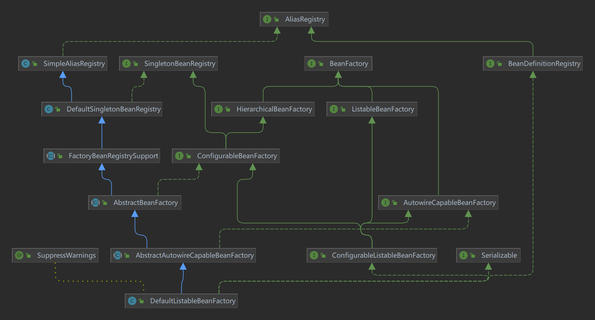


##### DefaultListableBeanFactory

Spring 的ConfigurableListableBeanFactory和BeanDefinitionRegistry接口的默认实现：一个基于 bean 定义元数据的成熟 bean 工厂，可通过后处理器进行扩展。
典型用法是在访问 bean 之前首先注册所有 bean 定义（可能从 bean 定义文件中读取）。因此，按名称查找 Bean 是本地 bean 定义表中的一种廉价操作，它对预先解析的 bean 定义元数据对象进行操作。
请注意，特定 bean 定义格式的读取器通常是单独实现的，而不是作为 bean 工厂子类：例如参见org.springframework.beans.factory.xml.XmlBeanDefinitionReader 。
对于org.springframework.beans.factory.ListableBeanFactory接口的替代实现，请查看StaticListableBeanFactory ，它管理现有的 bean 实例，而不是基于 bean 定义创建新实例。


#### 演示1 - BeanFactory 与 ApplicationContext 的区别

##### 代码参考 

**com.itheima.a01** 包v

```java
ConfigurableApplicationContext context = SpringApplication.run(Main.class, args);
System.out.println(context);
/**
* context的属性的实例 DefaultListable BeanFactory 的 父类
* DefaultSingletonBeanRegistry 中 有一个私有成员
*  Map<String, Object> singletonObjects
*  里面包含的就是 单例Bean
*/
Field singletonObjects = DefaultSingletonBeanRegistry.class.getDeclaredField("singletonObjects");
singletonObjects.setAccessible(true); // 设置可读取私有
// 获取BeanFactory 父类的中的私有Map
ConfigurableListableBeanFactory beanFactory = context.getBeanFactory();
Map <String,Object> singleBeanMap = (Map <String,Object>)singletonObjects.get(beanFactory);

singleBeanMap.forEach((k,v)->{
    System.out.println("key:"+k+"\tv:"+v);
});
```


#### 收获💡

通过这个示例结合 debug 查看 ApplicationContext 对象的内部结构，学到：

1. 到底什么是 BeanFactory

   - 它是 ApplicationContext 的父接口
   - 它才是 Spring 的核心容器, 主要的 ApplicationContext 实现都【组合】了它的功能，【组合】是指 ApplicationContext 的一个重要成员变量就是 BeanFactory
   
2. BeanFactory 能干点啥
   - 表面上只有 getBean
   - 实际上控制反转、基本的依赖注入、直至 Bean 的生命周期的各种功能，都由它的实现类提供
   - 例子中通过反射查看了它的成员变量 singletonObjects，内部包含了所有的单例 bean
   
3. ApplicationContext 比 BeanFactory 多点啥

   * ApplicationContext 组合并扩展了 BeanFactory 的功能
   
   * 国际化、通配符方式获取一组 Resource 资源、整合 Environment 环境、事件发布与监听
   
   * 新学一种代码之间解耦途径，事件解耦
   
   * ```java
     3. ApplicationContext 比 BeanFactory 多点啥
         - MessgeSource 国际化接口
             // 配置文件 messages.properties配置转换
             String hi = context.getMessage("hi", null, Locale.CHINESE);
         - ResourcePatternResolver 路径资源接口
         	Resource[] resources = context.getResources("classpath*:META-INF/spring.factories");
         - ApplicationEventPublisher 发布事件对象接口
              context.getEnvironment().getProperty("java_home")
         - EnvironmentCapable 环境信息接口
              ```java
             	// 实现接口
             	public class UserRegisteredEvent extends ApplicationEvent {
                     public UserRegisteredEvent(Object source) {
                         super(source);
                     }
                 }
     		   // 组件接收事件
                 @Slf4j
                 @Component
                 public class Component1 {
                     @EventListener
                     public void listener(UserRegisteredEvent event){
                         log.info("{}",event);
                     }
                 }
     
     			// 开始发送
     		// 发布事件与设置事件源
             context.publishEvent(new UserRegisteredEvent(context));
     		// 或者
             @Component
             public class Component2 {
                 @Autowired // 是ApplicationEvent的父接口
                 private ApplicationEventPublisher publisher;
     
                 public void register(String event){
                     log.debug("Register...");
                     publisher.publishEvent(new UserRegisteredEvent(this));
                 }
             }
     ```
     ```

建议练习：完成用户注册与发送短信之间的解耦，用事件方式、和 AOP 方式分别实现

> ***注意***
>
> * 如果 jdk > 8, 运行时请添加 --add-opens java.base/java.lang=ALL-UNNAMED，这是因为这些版本的 jdk 默认不允许跨 module 反射
> * 事件发布还可以异步，这个视频中没有展示，请自行查阅 @EnableAsync，@Async 的用法


#### 演示2 - 国际化

```java
public class TestMessageSource {
    public static void main(String[] args) {
        GenericApplicationContext context = new GenericApplicationContext();

        context.registerBean("messageSource", MessageSource.class, () -> {
            ResourceBundleMessageSource ms = new ResourceBundleMessageSource();
            ms.setDefaultEncoding("utf-8");
            ms.setBasename("messages");
            return ms;
        });

        context.refresh();

        System.out.println(context.getMessage("hi", null, Locale.ENGLISH));
        System.out.println(context.getMessage("hi", null, Locale.CHINESE));
        System.out.println(context.getMessage("hi", null, Locale.JAPANESE));
    }
}
```

国际化文件均在 src/resources 目录下

messages.properties（空）

messages_en.properties

```properties
hi=Hello
```

messages_ja.properties

```properties
hi=こんにちは
```

messages_zh.properties

```properties
hi=你好
```

> ***注意***
>
> * ApplicationContext 中 MessageSource bean 的名字固定为 messageSource
> * 使用 SpringBoot 时，国际化文件名固定为 messages
> * 空的 messages.properties 也必须存在


### 2) 容器实现

Spring 的发展历史较为悠久，因此很多资料还在讲解它较旧的实现，这里出于怀旧的原因，把它们都列出来，供大家参考

* DefaultListableBeanFactory，是 BeanFactory 最重要的实现，像**控制反转**和**依赖注入**功能，都是它来实现
* ClassPathXmlApplicationContext，从类路径查找 XML 配置文件，创建容器（旧）
* FileSystemXmlApplicationContext，从磁盘路径查找 XML 配置文件，创建容器（旧）
* XmlWebApplicationContext，传统 SSM 整合时，基于 XML 配置文件的容器（旧）
* AnnotationConfigWebApplicationContext，传统 SSM 整合时，基于 java 配置类的容器（旧）
* AnnotationConfigApplicationContext，Spring boot 中非 web 环境容器（新）
* AnnotationConfigServletWebServerApplicationContext，Spring boot 中 servlet web 环境容器（新）
* AnnotationConfigReactiveWebServerApplicationContext，Spring boot 中 reactive web 环境容器（新）

另外要注意的是，后面这些带有 ApplicationContext 的类都是 ApplicationContext 接口的实现，但它们是**组合**了 DefaultListableBeanFactory 的功能，并非继承而来


#### 演示1 - DefaultListableBeanFactory

##### 代码参考 

**com.itheima.a02.TestBeanFactory**

```java
public static void main(String[] args) {
    DefaultListableBeanFactory beanFactory = new DefaultListableBeanFactory();
    // Bean的定义 class scope init destroy

    // BeanDefinitionBuilder Bean定义生成器
    AbstractBeanDefinition singleton = BeanDefinitionBuilder
            .genericBeanDefinition(Config.class)
            .setScope("singleton") // 注册单例
            .getBeanDefinition();
    // 注册
    beanFactory.registerBeanDefinition("config", singleton);
    // 给BeanFactory添加常用的后置处理器[补充了一些对Bean的定义]
    AnnotationConfigUtils.registerAnnotationConfigProcessors(beanFactory);
    // org.springframework.context.annotation.internalConfigurationAnnotationProcessor
    // 将被添加的上面(其中之一)拿出来运行 解析@Bean注解等
    Map<String, BeanFactoryPostProcessor> beansOfType =
            beanFactory.getBeansOfType(BeanFactoryPostProcessor.class);

    beansOfType.forEach((k, v) -> {
        // 运行
        v.postProcessBeanFactory(beanFactory);
    });

    // 运行Bean的后处理器 针对Bean的生命周期各个阶段提供扩展功能
    beanFactory.getBeansOfType(BeanPostProcessor.class).forEach((k, v) -> {
        // 添加 解析@Autowired等
        beanFactory.addBeanPostProcessor(v);
    });
    beanFactory.preInstantiateSingletons();
    // 添加以上方法之后 [预先实例化所有的单例对象]
    // 默认是用到才创建 也就是懒惰加载
    Bean1 bean = beanFactory.getBean(Bean2.class).getBean1();
    System.out.println(bean);

    /**
     *   学到了什么:
     *      a. beanFactory 不会做的事
     *          1. 不会主动调用 BeanFactory 后处理器
     *          2. 不会主动添加 Bean 后处理器
     *          3. 不会主动初始化单例
     *          4. 不会解析beanFactory 还不会解析 ${} 与 #{}
     *      b. bean 后处理器会有排序的逻辑
     */
}

@Configuration
static class Config {
    @Bean
    public Bean1 bean1() {
        return new Bean1();
    }

    @Bean
    public Bean2 bean2() {
        return new Bean2();
    }
}

@Getter
@Slf4j
static class Bean2 {
    @Autowired
    private Bean1 bean1;
}


@Slf4j
static class Bean1 {
    public Bean1() {
        log.debug("构造Bean1");
    }
}
```

#### 收获💡

* beanFactory 可以通过 registerBeanDefinition 注册一个 bean definition 对象
  * 我们平时使用的配置类、xml、组件扫描等方式都是生成 bean definition 对象注册到 beanFactory 当中
  * bean definition 描述了这个 bean 的创建蓝图：scope 是什么、用构造还是工厂创建、初始化销毁方法是什么，等等
  
* beanFactory 需要手动调用 beanFactory 后处理器对它做增强
  * 例如通过解析 @Bean、@ComponentScan 等注解，来补充一些 bean definition
  
* beanFactory 需要手动添加 bean 后处理器，以便对后续 bean 的创建过程提供增强
  * 例如 @Autowired，@Resource 等注解的解析都是 bean 后处理器完成的
  * bean 后处理的添加顺序会对解析结果有影响，见视频中同时加 @Autowired，@Resource 的例子
  
* beanFactory 需要手动调用方法来初始化单例

* beanFactory 需要额外设置才能解析 ${} 与 #{}

* 如果注入的是接口，而接口有很多实现类的Bean，那么会按照名字注入 

* 如果 @Autowired，@Resource 同时在相应的成员变量上，那么 @Autowired的的添加处理器在前面优先完成解析

  * ```java
    // 除非设置比较器
    beanFactory.getBeansOfType(BeanPostProcessor.class)
            .values()
            .stream()
            .sorted(beanFactory.getDependencyComparator()) // 比较器排序
    ```


#### 演示2 - 常见 ApplicationContext 实现

##### 代码参考 

**com.itheima.a02.A02**

```java
	/*DefaultListableBeanFactory beanFactory = new DefaultListableBeanFactory();
        System.out.println("读取之前...");
        for (String name : beanFactory.getBeanDefinitionNames()) {
            System.out.println(name);
        }
        System.out.println("读取之后...");
        XmlBeanDefinitionReader reader = new XmlBeanDefinitionReader(beanFactory);
        reader.loadBeanDefinitions(new FileSystemResource("src\\main\\resources\\a02.xml"));
        for (String name : beanFactory.getBeanDefinitionNames()) {
            System.out.println(name);
        }*/

        /*
            学到了什么
                a. 常见的 ApplicationContext 容器实现
                b. 内嵌容器、DispatcherServlet 的创建方法、作用
         */
    }
	
    // ⬇️较为经典的容器, 基于 classpath 下 xml 格式的配置文件来创建
	//    .....
    // ⬇️基于磁盘路径下 xml 格式的配置文件来创建
    // ...
    // ⬇️较为经典的容器, 基于 java 配置类来创建
    //...
    // ⬇️较为经典的容器, 基于 java 配置类来创建, 用于 web 环境
	static void annotationConfigureWebServerApplication(){
        AnnotationConfigServletWebServerApplicationContext context
                = new AnnotationConfigServletWebServerApplicationContext(WebConfig.class);

    }

    @Configuration
    static class WebConfig {
        // 运行容器
        @Bean
        public ServletWebServerFactory webServerFactory(){
            return new TomcatServletWebServerFactory();
        }
        // 前端控制器
        @Bean
        public DispatcherServlet dispatcherServlet(){
            DispatcherServlet servlet = new DispatcherServlet();
            return servlet;
        }
        // 注册容器
        @Bean
        public DispatcherServletRegistrationBean registrationBean(DispatcherServlet servlet){
            return new DispatcherServletRegistrationBean(servlet,"/");
        }

        @Bean("/") // Controller是接口而不是注解
        public Controller controller1(){
            return (request, response) ->{
                response.getWriter().println("Hello");
                return null;
            };
        }
    }
```

> ```xml
> <context:annotation-config/>
> // 这个标签就是加入了一些后置处理器
> ```

#### 收获💡

1. 常见的 ApplicationContext 容器实现
2. 内嵌容器、DispatcherServlet 的创建方法、作用


### 3) Bean 的生命周期

一个受 Spring 管理的 bean，生命周期主要阶段有

1. 创建：根据 bean 的构造方法或者工厂方法来创建 bean 实例对象
2. 依赖注入：根据 @Autowired，@Value 或其它一些手段，为 bean 的成员变量填充值、建立关系
3. 初始化：回调各种 Aware 接口，调用对象的各种初始化方法
4. 销毁：在容器关闭时，会销毁所有**单例 **对象（即调用它们的销毁方法）
   * prototype 对象也能够销毁，不过需要容器这边主动调用

一些资料会提到，生命周期中还有一类 bean 后处理器：BeanPostProcessor，会在 bean 的初始化的前后，提供一些扩展逻辑。但这种说法是不完整的，见下面的演示1


#### 演示1 - bean 生命周期

##### 代码参考 

```java
@Component
public class MyBeanPostProcessor implements InstantiationAwareBeanPostProcessor, DestructionAwareBeanPostProcessor {

    private static final Logger log = LoggerFactory.getLogger(MyBeanPostProcessor.class);

    @Override
    public void postProcessBeforeDestruction(Object bean, String beanName) throws BeansException {
        if (beanName.equals("lifeCycleBean"))
            log.debug("<<<<<< 销毁之前执行, 如 @PreDestroy");
    }

    @Override
    public Object postProcessBeforeInstantiation(Class<?> beanClass, String beanName) throws BeansException {
        if (beanName.equals("lifeCycleBean"))
            log.debug("<<<<<< 实例化之前执行, 这里返回的对象会替换掉原本的 bean");
        return null;
    }

    @Override
    public boolean postProcessAfterInstantiation(Object bean, String beanName) throws BeansException {
        if (beanName.equals("lifeCycleBean")) {
            log.debug("<<<<<< 实例化之后执行, 这里如果返回 false 会跳过依赖注入阶段");
//            return false;
        }
        return true;
    }

    @Override
    public PropertyValues postProcessProperties(PropertyValues pvs, Object bean, String beanName) throws BeansException {
        if (beanName.equals("lifeCycleBean"))
            log.debug("<<<<<< 依赖注入阶段执行, 如 @Autowired、@Value、@Resource");
        return pvs;
    }

    @Override
    public Object postProcessBeforeInitialization(Object bean, String beanName) throws BeansException {
        if (beanName.equals("lifeCycleBean"))
            log.debug("<<<<<< 初始化之前执行, 这里返回的对象会替换掉原本的 bean, 如 @PostConstruct、@ConfigurationProperties");
        return bean;
    }

    @Override
    public Object postProcessAfterInitialization(Object bean, String beanName) throws BeansException {
        if (beanName.equals("lifeCycleBean"))
            log.debug("<<<<<< 初始化之后执行, 这里返回的对象会替换掉原本的 bean, 如代理增强");
        return bean;
    }
}
```


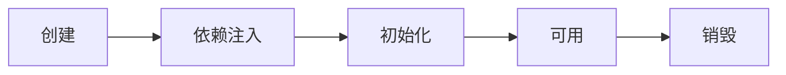

创建前后的增强

* postProcessBeforeInstantiation
  * 这里返回的对象若不为 null 会替换掉原本的 bean，并且仅会走 postProcessAfterInitialization 流程
* postProcessAfterInstantiation
  * 这里如果返回 false 会跳过依赖注入阶段

依赖注入前的增强

* postProcessProperties
  * 如 @Autowired、@Value、@Resource 

初始化前后的增强

* postProcessBeforeInitialization
  * 这里返回的对象会替换掉原本的 bean
  * 如 @PostConstruct、@ConfigurationProperties
* postProcessAfterInitialization 
  * 这里返回的对象会替换掉原本的 bean
  * 如代理增强

销毁之前的增强

* postProcessBeforeDestruction
  * 如 @PreDestroy 

#### 收获💡

1. Spring bean 生命周期各个阶段
2. 模板设计模式, 指大流程已经固定好了, 通过接口回调（bean 后处理器）在一些关键点前后提供扩展


#### 演示2 - 模板方法设计模式

##### 关键代码

```java
public class TestMethodTemplate {

    public static void main(String[] args) {
        MyBeanFactory beanFactory = new MyBeanFactory();
        beanFactory.addBeanPostProcessor(bean -> System.out.println("解析 @Autowired"));
        beanFactory.addBeanPostProcessor(bean -> System.out.println("解析 @Resource"));
        beanFactory.getBean();
    }

    // 模板方法  Template Method Pattern
    static class MyBeanFactory {
        public Object getBean() {
            Object bean = new Object();
            System.out.println("构造 " + bean);
            System.out.println("依赖注入 " + bean); // @Autowired, @Resource
            for (BeanPostProcessor processor : processors) {
                processor.inject(bean);
            }
            System.out.println("初始化 " + bean);
            return bean;
        }

        private List<BeanPostProcessor> processors = new ArrayList<>();

        public void addBeanPostProcessor(BeanPostProcessor processor) {
            processors.add(processor);
        }
    }
    
    static interface BeanPostProcessor {
        public void inject(Object bean); // 对依赖注入阶段的扩展
    }
}
```


#### 演示3 - bean 后处理器排序

##### 代码参考 

**com.itheima.a03.TestProcessOrder**

#### 收获💡

1. 实现了 PriorityOrdered 接口的优先级最高
2. 实现了 Ordered 接口与加了 @Order 注解的平级, 按数字升序
3. 其它的排在最后


### 4) Bean 后处理器

#### 演示1 - 后处理器作用

##### 代码参考 

```java
GenericApplicationContext context = new GenericApplicationContext();
context.registerBean("bean1", Bean1.class);
context.registerBean("bean2", Bean2.class);
context.registerBean("bean3", Bean3.class);

context
        .getDefaultListableBeanFactory()
        .setAutowireCandidateResolver(new ContextAnnotationAutowireCandidateResolver());
// 解析@Value [ContextAnnotationAutowireCandidateResolver]  Autowired
context.registerBean(AutowiredAnnotationBeanPostProcessor.class);
// 解析@Resource @PostConstruct @PreDestroy
context.registerBean(CommonAnnotationBeanPostProcessor.class);

// 配置解析配置文件注解
ConfigurationPropertiesBindingPostProcessor.register(context.getDefaultListableBeanFactory());

// 执行初始化容器 刷新
context.refresh();
context.close();
```

#### 收获💡

1. @Autowired 等注解的解析属于 bean 生命周期阶段（依赖注入, 初始化）的扩展功能，这些扩展功能由 bean 后处理器来完成
2. 每个后处理器各自增强什么功能
   * AutowiredAnnotationBeanPostProcessor 解析 @Autowired 与 @Value
   * CommonAnnotationBeanPostProcessor 解析 @Resource、@PostConstruct、@PreDestroy
   * ConfigurationPropertiesBindingPostProcessor 解析 @ConfigurationProperties
3. 另外 ContextAnnotationAutowireCandidateResolver 负责获取 @Value 的值，解析 @Qualifier、泛型、@Lazy 等


#### 演示2 - @Autowired bean 后处理器运行分析

##### 代码参考 

**com.itheima.a04.DigInAutowired**

```java
DefaultListableBeanFactory beanFactory = new DefaultListableBeanFactory();
/**
*  解释容器中有 已经放好的 b2 b3
*  b1 私有变量与方法为 b2 b3
*  分析 AutowiredAnnotationBeanPostProcessor的作用
*/
beanFactory.registerSingleton("bean2",new Bean2());
beanFactory.registerSingleton("bean3",new Bean3());

//  @Value 后置解析
beanFactory.setAutowireCandidateResolver(new ContextAnnotationAutowireCandidateResolver());
// 设置 ${} 表达式解析  [EmbeddedValueResolver 嵌入值解析器]
beanFactory.addEmbeddedValueResolver(new StandardEnvironment()::resolvePlaceholders);

AutowiredAnnotationBeanPostProcessor processor = new AutowiredAnnotationBeanPostProcessor();
// 需要知道对应的工厂
processor.setBeanFactory(beanFactory);

//========================
Bean1 bean1 = new Bean1();
System.out.println(bean1); // 为空
processor.postProcessProperties(null,bean1,"bean1");
System.out.println(bean1); // 注入成功
// 分析方法

/**
*  postProcessProperties 内部调用了
*  findAutowiringMetadata(beanName, bean.getClass(), pvs);
*  此方法返回一个InjectionMetadata对象
*/
Method findAutowiringMetadata = AutowiredAnnotationBeanPostProcessor.class
    .getDeclaredMethod("findAutowiringMetadata", String.class, Class.class, PropertyValues.class);
findAutowiringMetadata.setAccessible(true); // 强制反射
InjectionMetadata metadata = (InjectionMetadata)findAutowiringMetadata.invoke(processor, "bean1", Bean1.class, null);
System.out.println(metadata);
// 这个是执行注入的方法 调用 InjectionMetadata 来进行依赖注入, 注入时按类型查找值
metadata.inject(bean1,"bean1",null);
System.out.println(bean1);


// 分析查找成员变量 按照类型查找值
Field bean3 = Bean1.class.getDeclaredField("bean3");
// 翻译是 依赖描述符 ？
// 参数2 是否必须 是： 没找到会报错
DependencyDescriptor bean3Dd = new DependencyDescriptor(bean3,true);
// doResolveDependency 到工厂查找元素
Object o = beanFactory.doResolveDependency(bean3Dd, null, null, null);
System.out.println(o instanceof Bean3); // true

// 分析查找方法参数
Method setBean2 = Bean1.class.getDeclaredMethod("setBean2", Bean2.class);
// 0 代表形参的第一个元素
DependencyDescriptor me = new DependencyDescriptor(new MethodParameter(setBean2, 0), true);
Object o1 = beanFactory.doResolveDependency(me, null, null, null);
System.out.println(o1); // bean2
```

#### 收获💡

1. AutowiredAnnotationBeanPostProcessor.findAutowiringMetadata 用来获取某个 bean 上加了 @Value @Autowired 的成员变量，方法参数的信息，表示为 InjectionMetadata
2. InjectionMetadata 可以完成依赖注入
3. InjectionMetadata 内部根据成员变量，方法参数封装为 DependencyDescriptor 类型
4. 有了 DependencyDescriptor，就可以利用 beanFactory.doResolveDependency 方法进行基于类型的查找


### 5) BeanFactory 后处理器

#### 演示1 - BeanFactory 后处理器的作用

##### 代码参考

**com.itheima.a05** 包

```java
GenericApplicationContext context = new GenericApplicationContext();
context.registerBean("config", Config.class);
// 添加ConfigurationClassPostProcessor会扫 描Configura @ComponentScan @Bean @Import @ImportResource注解等
context.registerBean(ConfigurationClassPostProcessor.class);
// 扫描Mapper == @MapperScan
context.registerBean(MapperScannerConfigurer.class,bd -> {
    bd.getPropertyValues().addPropertyValue("basePackage","com.wjl");
});
context.refresh();
for (String beanName : context.getBeanDefinitionNames()) {
    System.out.println(beanName);
}
context.close();
```


* ConfigurationClassPostProcessor 可以解析
  * @ComponentScan
  * @Bean
  * @Import
  * @ImportResource
* MapperScannerConfigurer 可以解析
  * Mapper 接口

#### 收获💡

1. @ComponentScan, @Bean, @Mapper 等注解的解析属于核心容器（即 BeanFactory）的扩展功能
2. 这些扩展功能由不同的 BeanFactory 后处理器来完成，其实主要就是补充了一些 bean 定义


#### 演示2 - 模拟解析 @ComponentScan

##### 代码参考 

**com.itheima.a05.ComponentScanPostProcessor**

```java
public class ComponentScanPostProcessor implements BeanFactoryPostProcessor {
    // 在 context.refresh 方法 完成之后调用
    // beanFactory 是Application对象内部维护的BeanFactory
    @Override
    public void postProcessBeanFactory(ConfigurableListableBeanFactory configurableListableBeanFactory) throws BeansException {
        try {
            if (configurableListableBeanFactory instanceof DefaultListableBeanFactory) {

                DefaultListableBeanFactory beanFactory = (DefaultListableBeanFactory) configurableListableBeanFactory;
                // 这里吧 Config 换算为被 @SpringBootApplication标注的类 试想一下
                ComponentScan componentScan = AnnotationUtils.findAnnotation(Config.class, ComponentScan.class);
                // 获取组件
                for (String packageName : componentScan.basePackages()) {
                    String path = "classpath*:" + packageName.replaceAll("\\.", "/") + "/**/*.class";

                    CachingMetadataReaderFactory readerFactory = new CachingMetadataReaderFactory();

                    AnnotationBeanNameGenerator generator = new AnnotationBeanNameGenerator();
                    Resource[] resources = new PathMatchingResourcePatternResolver().getResources(path);
                    for (Resource resource : resources) {
                        // 读取class文件信息
                        MetadataReader reader = readerFactory.getMetadataReader(resource);
                        // 判断是否添加了直接 或者 间接的组件注解
                        AnnotationMetadata annotationMetadata = reader.getAnnotationMetadata();
                        if (
                                annotationMetadata.hasAnnotation(Component.class.getName())
                                        ||
                                        // 代表派生注解
                                        annotationMetadata.hasMetaAnnotation(Component.class.getName())
                        ) {
                            String className = reader.getClassMetadata().getClassName();
                            AbstractBeanDefinition definition = BeanDefinitionBuilder.genericBeanDefinition(className)
                                    .getBeanDefinition();
                            String beanName = generator.generateBeanName(definition, beanFactory);
                            beanFactory.registerBeanDefinition(beanName, definition);
                        }
                    }
                }
            }
        } catch (IOException e) {
            e.printStackTrace();
        }
    }
}

/*
@Configuration
@ComponentScan("com.wjl.spring._4factorypostprocessor.a05.component")
public class Config {
*/
// main
GenericApplicationContext context = new GenericApplicationContext();
context.registerBean("config", Config.class);
// 添加至Bean
context.registerBean(ComponentScanPostProcessor.class);
context.refresh();
for (String beanName : context.getBeanDefinitionNames()) {
    System.out.println(beanName);
}
context.close();
```


#### 收获💡

1. Spring 操作元数据的工具类 CachingMetadataReaderFactory
2. 通过注解元数据（AnnotationMetadata）获取直接或间接标注的注解信息
3. 通过类元数据（ClassMetadata）获取类名，AnnotationBeanNameGenerator 生成 bean 名
4. 解析元数据是基于 ASM 技术


#### 演示3 - 模拟解析 @Bean

##### 代码参考 

**com.itheima.a05.AtBeanPostProcessor**

```java
public class AtBeanPostProcessor implements BeanDefinitionRegistryPostProcessor {
    @Override
    public void postProcessBeanFactory(ConfigurableListableBeanFactory configurableListableBeanFactory) throws BeansException {

    }

    @Override
    public void postProcessBeanDefinitionRegistry(BeanDefinitionRegistry beanFactory) throws BeansException {
        try {
            CachingMetadataReaderFactory factory = new CachingMetadataReaderFactory();
            MetadataReader reader = factory.getMetadataReader(new ClassPathResource("com/itheima/a05/Config.class"));
            Set<MethodMetadata> methods = reader.getAnnotationMetadata().getAnnotatedMethods(Bean.class.getName());
            for (MethodMetadata method : methods) {
                System.out.println(method);
                String initMethod = method.getAnnotationAttributes(Bean.class.getName()).get("initMethod").toString();
                BeanDefinitionBuilder builder = BeanDefinitionBuilder.genericBeanDefinition();
                builder.setFactoryMethodOnBean(method.getMethodName(), "config");
                builder.setAutowireMode(AbstractBeanDefinition.AUTOWIRE_CONSTRUCTOR);
                if (initMethod.length() > 0) {
                    builder.setInitMethodName(initMethod);
                }
                AbstractBeanDefinition bd = builder.getBeanDefinition();
                beanFactory.registerBeanDefinition(method.getMethodName(), bd);
            }
        } catch (IOException e) {
            e.printStackTrace();
        }
    }
}
```

Main

```java
// ⬇️GenericApplicationContext 是一个【干净】的容器
GenericApplicationContext context = new GenericApplicationContext();
context.registerBean("config", Config.class);
// context.registerBean(ConfigurationClassPostProcessor.class); // @ComponentScan @Bean @Import @ImportResource
// context.registerBean(MapperScannerConfigurer.class, bd -> { // @MapperScanner
//     bd.getPropertyValues().add("basePackage", "com.itheima.a05.mapper");
// });
// context.registerBean(ComponentScanPostProcessor.class); // 解析 @ComponentScan

context.registerBean(AtBeanPostProcessor.class); // 解析 @Bean
context.registerBean(MapperPostProcessor.class); // 解析 Mapper 接口

// ⬇️初始化容器
context.refresh();
```


#### 收获💡

1. 进一步熟悉注解元数据（AnnotationMetadata）获取方法上注解信息


#### 演示4 - 模拟解析 Mapper 接口

##### 代码参考 

**com.itheima.a05.MapperPostProcessor**

```java
// 单个添加mapper
@Bean
public MapperFactoryBean<Mapper2> mapper2(SqlSessionFactory sqlSessionFactory) {
    MapperFactoryBean<Mapper2> factory = new MapperFactoryBean<>(Mapper2.class);
    factory.setSqlSessionFactory(sqlSessionFactory);
    return factory;
}
// 工厂接口注册批量
// BeanDefinitionRegistryPostProcessor接口 是 BeanFactoryPostProcessor的子接口
public class MapperPostProcessor implements BeanDefinitionRegistryPostProcessor {

    @Override
    public void postProcessBeanDefinitionRegistry(BeanDefinitionRegistry beanFactory) throws BeansException {
        try {
            PathMatchingResourcePatternResolver resolver = new PathMatchingResourcePatternResolver();
            Resource[] resources = resolver.getResources("classpath:com/itheima/a05/mapper/**/*.class");
            AnnotationBeanNameGenerator generator = new AnnotationBeanNameGenerator();
            CachingMetadataReaderFactory factory = new CachingMetadataReaderFactory();
            for (Resource resource : resources) {
                MetadataReader reader = factory.getMetadataReader(resource);
                ClassMetadata classMetadata = reader.getClassMetadata();
                if (classMetadata.isInterface()) {
                    AbstractBeanDefinition bd = BeanDefinitionBuilder.genericBeanDefinition(MapperFactoryBean.class)
                            .addConstructorArgValue(classMetadata.getClassName())
                            .setAutowireMode(AbstractBeanDefinition.AUTOWIRE_BY_TYPE)
                            .getBeanDefinition();
                    AbstractBeanDefinition bd2 = BeanDefinitionBuilder.genericBeanDefinition(classMetadata.getClassName()).getBeanDefinition();
                    String name = generator.generateBeanName(bd2, beanFactory);
                    beanFactory.registerBeanDefinition(name, bd);
                }
            }
        } catch (IOException e) {
            e.printStackTrace();
        }

    }

    @Override
    public void postProcessBeanFactory(ConfigurableListableBeanFactory beanFactory) throws BeansException {

    }
}
```


#### 收获💡

1. Mapper 接口被 Spring 管理的本质：实际是被作为 MapperFactoryBean 注册到容器中
2. Spring 的诡异做法，根据接口生成的 BeanDefinition 仅为根据接口名生成 bean 名


### 6) Aware 接口

#### 演示 - Aware 接口及 InitializingBean 接口

##### 代码参考 

**com.itheima.a06** 包

```java
public class MyBean implements BeanNameAware, BeanFactoryAware, ApplicationContextAware,InitializingBean {
    /**
     *  BeanNameAware
     *  初始化执行可以拿到BeanName
     * @param name
     */
    @Override
    public void setBeanName(String name) {
    }

    /**
     *  BeanFactoryAware
     *  初始化执行 可以拿到Context内部维护的BeanFactory
     * @param beanFactory
     * @throws BeansException
     */
    @Override
    public void setBeanFactory(BeanFactory beanFactory) throws BeansException {

    }
    @Override
    public void setApplicationContext(ApplicationContext applicationContext) throws BeansException {
        System.err.println(applicationContext);
    }
    @Override
    public void afterPropertiesSet() throws Exception {

    }
}
```

#### 收获💡

1. Aware 接口提供了一种【内置】 的注入手段，例如
   * BeanNameAware 注入 bean 的名字
   * BeanFactoryAware 注入 BeanFactory 容器
   * ApplicationContextAware 注入 ApplicationContext 容器
   * EmbeddedValueResolverAware 注入 ${} 解析器
2. InitializingBean 接口提供了一种【内置】的初始化手段
3. 对比
   * 内置的注入和初始化不受扩展功能的影响，总会被执行
   * 而扩展功能受某些情况影响可能会失效
   * 因此 Spring 框架内部的类常用内置注入和初始化


#### 配置类 @Autowired 失效分析

Java 配置类不包含 BeanFactoryPostProcessor 的情况

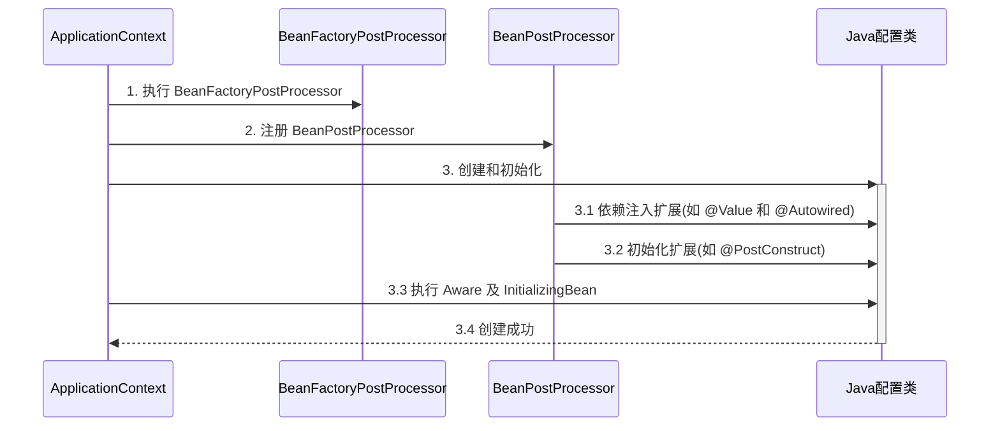

Java 配置类包含 BeanFactoryPostProcessor 的情况，因此要创建其中的 BeanFactoryPostProcessor 必须提前创建 Java 配置类，而此时的 BeanPostProcessor 还未准备好，导致 @Autowired 等注解失效

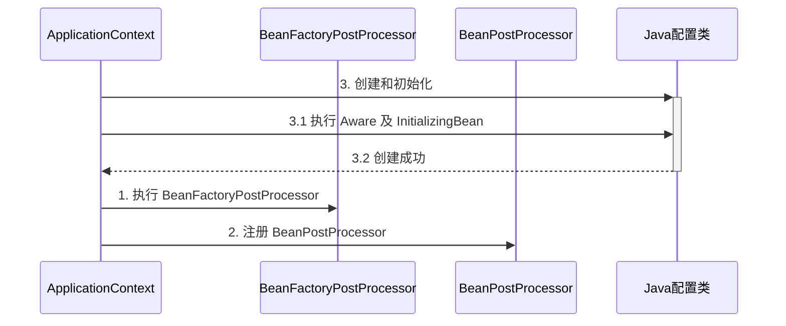

对应代码

```java
@Configuration
public class MyConfig1 {

    private static final Logger log = LoggerFactory.getLogger(MyConfig1.class);

    @Autowired
    public void setApplicationContext(ApplicationContext applicationContext) {
        log.debug("注入 ApplicationContext");
    }

    @PostConstruct
    public void init() {
        log.debug("初始化");
    }

    @Bean //  ⬅️ 注释或添加 beanFactory 后处理器对应上方两种情况
    public BeanFactoryPostProcessor processor1() {
        return beanFactory -> {
            log.debug("执行 processor1");
        };
    }

}
```

> ***注意***
>
> 解决方法：
>
> * 用内置依赖注入和初始化取代扩展依赖注入和初始化
> * 用静态工厂方法代替实例工厂方法，避免工厂对象提前被创建


### 7) 初始化与销毁

#### 演示 - 初始化销毁顺序

##### 代码参考 

**com.itheima.a07** 包

#### 收获💡

Spring 提供了多种初始化手段，除了课堂上讲的 @PostConstruct，@Bean(initMethod) 之外，还可以实现 InitializingBean 接口来进行初始化，如果同一个 bean 用了以上手段声明了 3 个初始化方法，那么它们的执行顺序是

1. @PostConstruct 标注的初始化方法
2. InitializingBean 接口的初始化方法
3. @Bean(initMethod) 指定的初始化方法


与初始化类似，Spring 也提供了多种销毁手段，执行顺序为

1. @PreDestroy 标注的销毁方法
2. DisposableBean 接口的销毁方法
3. @Bean(destroyMethod) 指定的销毁方法


### 8) Scope 

在当前版本的 Spring 和 Spring Boot 程序中，支持五种 Scope

* singleton，容器启动时创建（未设置延迟），容器关闭时销毁
* prototype，每次使用时创建，不会自动销毁，需要调用 DefaultListableBeanFactory.destroyBean(bean) 销毁
* request，每次请求用到此 bean 时创建，请求结束时销毁
* session，每个会话用到此 bean 时创建，会话结束时销毁
* application，web 容器用到此 bean 时创建，容器停止时销毁

有些文章提到有 globalSession 这一 Scope，也是陈旧的说法，目前 Spring 中已废弃


但要注意，如果在 singleton 注入其它 scope 都会有问题，解决方法有

* @Lazy // 懒加载
* @Scope(proxyMode = ScopedProxyMode.TARGET_CLASS)
* ObjectFactory
* ApplicationContext.getBean


#### 演示1 - request, session, application 作用域

##### 代码参考 

**com.itheima.a08** 包

* 打开不同的浏览器, 刷新 http://localhost:8080/test 即可查看效果
* 如果 jdk > 8, 运行时请添加 --add-opens java.base/java.lang=ALL-UNNAMED

#### 收获💡

1. 有几种 scope
2. 在 singleton 中使用其它几种 scope 的方法
3. 其它 scope 的销毁时机
   * 可以将通过 server.servlet.session.timeout=30s 观察 session bean 的销毁
   * ServletContextScope 销毁机制疑似实现有误


#### 分析 - singleton 注入其它 scope 失效

以单例注入多例为例

有一个单例对象 E

```java
@Component
public class E {
    private static final Logger log = LoggerFactory.getLogger(E.class);

    private F f;

    public E() {
        log.info("E()");
    }

    @Autowired
    public void setF(F f) {
        this.f = f;
        log.info("setF(F f) {}", f.getClass());
    }

    public F getF() {
        return f;
    }
}
```

要注入的对象 F 期望是多例

```java
@Component
@Scope("prototype")
public class F {
    private static final Logger log = LoggerFactory.getLogger(F.class);

    public F() {
        log.info("F()");
    }
}
```

测试

```java
E e = context.getBean(E.class);
F f1 = e.getF();
F f2 = e.getF();
System.out.println(f1);
System.out.println(f2);
```

输出

```
com.itheima.demo.cycle.F@6622fc65
com.itheima.demo.cycle.F@6622fc65
```

发现它们是同一个对象，而不是期望的多例对象


对于单例对象来讲，依赖注入仅发生了一次，后续再没有用到多例的 F，因此 E 用的始终是第一次依赖注入的 F

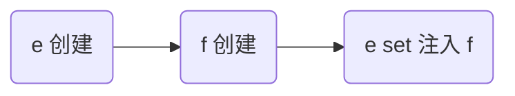

解决

* 仍然使用 @Lazy 生成代理
* 代理对象虽然还是同一个，但当每次**使用代理对象的任意方法**时，由代理创建新的 f 对象

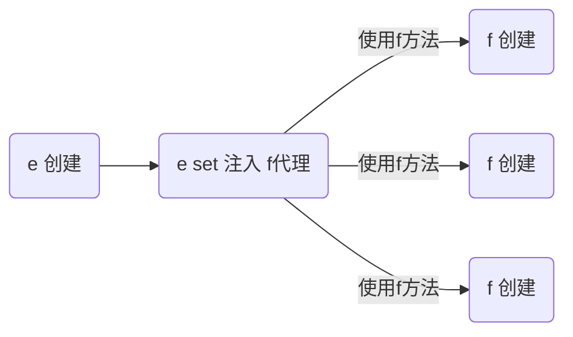

```java
@Component
public class E {

    @Autowired
    @Lazy
    public void setF(F f) {
        this.f = f;
        log.info("setF(F f) {}", f.getClass());
    }

    // ...
}
```

> ***注意***
>
> * @Lazy 加在也可以加在成员变量上，但加在 set 方法上的目的是可以观察输出，加在成员变量上就不行了
> * @Autowired 加在 set 方法的目的类似

输出

```
E: setF(F f) class com.itheima.demo.cycle.F$$EnhancerBySpringCGLIB$$8b54f2bc
F: F()
com.itheima.demo.cycle.F@3a6f2de3
F: F()
com.itheima.demo.cycle.F@56303b57
```

从输出日志可以看到调用 setF 方法时，f 对象的类型是代理类型


#### 演示2 - 4种解决方法

##### 代码参考 

**com.itheima.a08.sub** 包

* 如果 jdk > 8, 运行时请添加 --add-opens java.base/java.lang=ALL-UNNAMED

#### 收获💡

1. 单例注入其它 scope 的四种解决方法
   * @Lazy
   * @Scope(value = "prototype", proxyMode = ScopedProxyMode.TARGET_CLASS)
   * ObjectFactory
   * ApplicationContext
2. 解决方法虽然不同，但理念上殊途同归: 都是推迟其它 scope bean 的获取


## AOP


AOP 底层实现方式之一是代理，由代理结合通知和目标，提供增强功能

相关链接 https://blog.csdn.net/u012098021/article/details/116802329

除此以外，aspectj 提供了两种另外的 AOP 底层实现：

* 第一种是通过 ajc 编译器在**编译** class 类文件时，就把通知的增强功能，织入到目标类的字节码中

* 第二种是通过 agent 在**加载**目标类时，修改目标类的字节码，织入增强功能
* 作为对比，之前学习的代理是**运行**时生成新的字节码

简单比较的话：

* aspectj 在编译和加载时，修改目标字节码，性能较高
* aspectj 因为不用代理，能突破一些技术上的限制，例如对构造、对静态方法、对 final 也能增强
* 但 aspectj 侵入性较强，且需要学习新的 aspectj 特有语法，因此没有广泛流行


### 9) AOP 实现之 ajc 编译器

代码参考项目 **demo6_advanced_aspectj_01**

#### 收获💡

1. 编译器也能修改 class 实现增强
2. 编译器增强能突破代理仅能通过方法重写增强的限制：可以对构造方法、静态方法等实现增强

> ***注意***
>
> * 版本选择了 java 8, 因为目前的 aspectj-maven-plugin 1.14.0 最高只支持到 java 16
> * 一定要用 maven 的 compile 来编译, idea 不会调用 ajc 编译器

```xml
 <build>
        <plugins>
            <plugin>
                <groupId>org.springframework.boot</groupId>
                <artifactId>spring-boot-maven-plugin</artifactId>
            </plugin>
            <plugin>
                <groupId>org.codehaus.mojo</groupId>
                <artifactId>aspectj-maven-plugin</artifactId>
                <version>1.14.0</version>
                <configuration>
                    <complianceLevel>1.8</complianceLevel>
                    <source>8</source>
                    <target>8</target>
                    <showWeaveInfo>true</showWeaveInfo>
                    <verbose>true</verbose>
                    <Xlint>ignore</Xlint>
                    <encoding>UTF-8</encoding>
                </configuration>
                <executions>
                    <execution>
                        <goals>
                            <!-- use this goal to weave all your main classes -->
                            <goal>compile</goal>
                            <!-- use this goal to weave all your test classes -->
                            <goal>test-compile</goal>
                        </goals>
                    </execution>
                </executions>
            </plugin>
        </plugins>
    </build>
```


### 10) AOP 实现之 agent 类加载

代码参考项目 **demo6_advanced_aspectj_02**

```
/*
    注意几点
    1. 版本选择了 java 8, 因为目前的 aspectj-maven-plugin 1.14.0 最高只支持到 java 16
    2. 运行时需要在 VM options 里加入 -javaagent:C:/Users/manyh/.m2/repository/org/aspectj/aspectjweaver/1.9.7/aspectjweaver-1.9.7.jar
        把其中 C:/Users/manyh/.m2/repository 改为你自己 maven 仓库起始地址
 */
```

#### 收获💡

1. 类加载时可以通过 agent 修改 class 实现增强

**同一个类中调用this方法会增强**

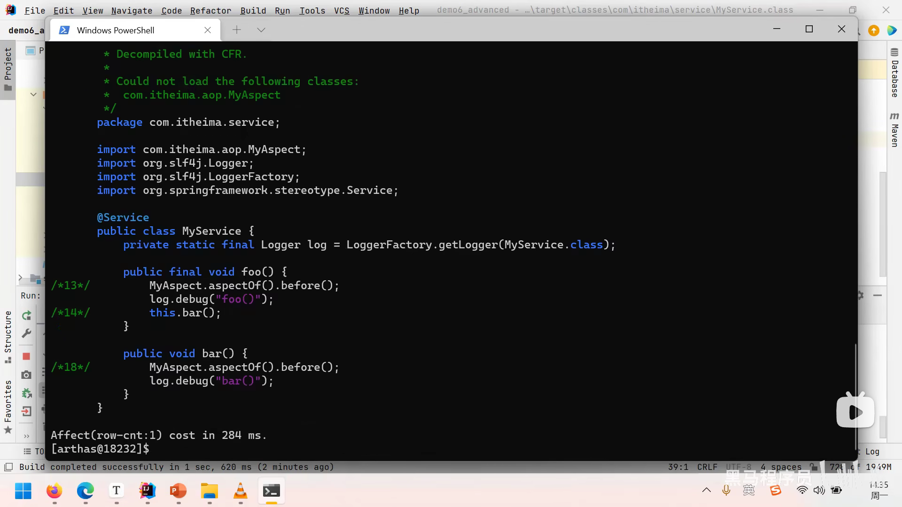

### 11) AOP 实现之 proxy

#### 演示1 - jdk 动态代理

```java
public class JdkProxyDemo {

    interface Foo {
        void foo();
    }

    static class Target implements Foo {
        public void foo() {
            System.out.println("target foo");
        }
    }

    public static void main(String[] param) {
        // 目标对象
        Target target = new Target();
        // 代理对象
        Foo proxy = (Foo) Proxy.newProxyInstance(
                Target.class.getClassLoader(), new Class[]{Foo.class},
                (p, method, args) -> {
                    System.out.println("proxy before...");
                    Object result = method.invoke(target, args);
                    System.out.println("proxy after...");
                    return result;
                });
        // 调用代理
        proxy.foo();
    }
}
```

运行结果

```
proxy before...
target foo
proxy after...
```

#### 收获💡

* jdk 动态代理要求目标**必须**实现接口，生成的代理类实现相同接口，因此代理与目标之间是平级兄弟关系


#### 演示2 - cglib 代理

```java
public class CglibProxyDemo {

    static class Target {
        public void foo() {
            System.out.println("target foo");
        }
    }

    public static void main(String[] param) {
        // 目标对象
        Target target = new Target();
        // 代理对象
        Target proxy = (Target) Enhancer.create(Target.class, 
                (MethodInterceptor) (p, method, args, methodProxy) -> {
            System.out.println("proxy before...");
            Object result = methodProxy.invoke(target, args);
            // 另一种调用方法，不需要目标对象实例
//            Object result = methodProxy.invokeSuper(p, args);
            System.out.println("proxy after...");
            return result;
        });
        // 调用代理
        proxy.foo();
    }
}
```

运行结果与 jdk 动态代理相同

#### 收获💡

* cglib 不要求目标实现接口，它生成的代理类是目标的子类，因此代理与目标之间是子父关系
* 限制⛔：根据上述分析 final 类无法被 cglib 增强


### 12) jdk 动态代理进阶

#### 演示1 - 模拟 jdk 动态代理

```java
public class A12 {

    interface Foo {
        void foo();
        int bar();
    }

    static class Target implements Foo {
        public void foo() {
            System.out.println("target foo");
        }

        public int bar() {
            System.out.println("target bar");
            return 100;
        }
    }

    public static void main(String[] param) {
        // ⬇️1. 创建代理，这时传入 InvocationHandler
        Foo proxy = new $Proxy0(new InvocationHandler() {    
            // ⬇️5. 进入 InvocationHandler
            public Object invoke(Object proxy, Method method, Object[] args) throws Throwable{
                // ⬇️6. 功能增强
                System.out.println("before...");
                // ⬇️7. 反射调用目标方法
                return method.invoke(new Target(), args);
            }
        });
        // ⬇️2. 调用代理方法
        proxy.foo();
        proxy.bar();
    }
}
```

模拟代理实现

```java
import java.lang.reflect.InvocationHandler;
import java.lang.reflect.Method;
import java.lang.reflect.Proxy;
import java.lang.reflect.UndeclaredThrowableException;

// ⬇️这就是 jdk 代理类的源码, 秘密都在里面
public class $Proxy0 extends Proxy implements A12.Foo {

    public $Proxy0(InvocationHandler h) {
        super(h);
    }
    // ⬇️3. 进入代理方法
    public void foo() {
        try {
            // ⬇️4. 回调 InvocationHandler
            h.invoke(this, foo, new Object[0]);
        } catch (RuntimeException | Error e) {
            throw e;
        } catch (Throwable e) {
            throw new UndeclaredThrowableException(e);
        }
    }

    @Override
    public int bar() {
        try {
            Object result = h.invoke(this, bar, new Object[0]);
            return (int) result;
        } catch (RuntimeException | Error e) {
            throw e;
        } catch (Throwable e) {
            throw new UndeclaredThrowableException(e);
        }
    }

    static Method foo;
    static Method bar;
    static {
        try {
            foo = A12.Foo.class.getMethod("foo");
            bar = A12.Foo.class.getMethod("bar");
        } catch (NoSuchMethodException e) {
            throw new NoSuchMethodError(e.getMessage());
        }
    }
}
```

#### 收获💡

代理一点都不难，无非就是利用了多态、反射的知识

1. 方法重写可以增强逻辑，只不过这【增强逻辑】千变万化，不能写死在代理内部
2. 通过接口回调将【增强逻辑】置于代理类之外
3. 配合接口方法反射（是多态调用），就可以再联动调用目标方法
4. 会用 arthas 的 jad 工具反编译代理类
5. 限制⛔：代理增强是借助多态来实现，因此成员变量、静态方法、final 方法均不能通过代理实现


#### 演示2 - 方法反射优化

##### 代码参考 

**com.itheima.a12.TestMethodInvoke**

#### 收获💡

1. 前 16 次反射性能较低
2. 第 17 次调用会生成代理类，优化为非反射调用
3. 会用 arthas 的 jad 工具反编译第 17 次调用生成的代理类

> ***注意***
>
> 运行时请添加 --add-opens java.base/java.lang.reflect=ALL-UNNAMED --add-opens java.base/jdk.internal.reflect=ALL-UNNAMED


### 13) cglib 代理进阶

#### 演示 - 模拟 cglib 代理

##### 代码参考 

**com.itheima.a13** 包

#### 收获💡

和 jdk 动态代理原理查不多

1. 回调的接口换了一下，InvocationHandler 改成了 MethodInterceptor
2. 调用目标时有所改进，见下面代码片段
   1. method.invoke 是反射调用，必须调用到足够次数才会进行优化
   2. methodProxy.invoke 是不反射调用，它会正常（间接）调用目标对象的方法（Spring 采用）
   3. methodProxy.invokeSuper 也是不反射调用，它会正常（间接）调用代理对象的方法，可以省略目标对象


```java
public class A14Application {
    public static void main(String[] args) throws InvocationTargetException {

        Target target = new Target();
        Proxy proxy = new Proxy();
        
        proxy.setCallbacks(new Callback[]{(MethodInterceptor) (p, m, a, mp) -> {
            System.out.println("proxy before..." + mp.getSignature());
            // ⬇️调用目标方法(三种)
			//Object result = m.invoke(target, a);  // ⬅️反射调用
			//Object result = mp.invoke(target, a); // ⬅️非反射调用, 结合目标用
            Object result = mp.invokeSuper(p, a);   // ⬅️非反射调用, 结合代理用
            System.out.println("proxy after..." + mp.getSignature());
            return result;
        }});
        
        // ⬇️调用代理方法
        proxy.save();
    }
}
```

> ***注意***
>
> * 调用 Object 的方法, 后两种在 jdk >= 9 时都有问题, 需要 --add-opens java.base/java.lang=ALL-UNNAMED

```java
public class Proxy extends Target {

    private MethodInterceptor methodInterceptor;

    public void setMethodInterceptor(MethodInterceptor methodInterceptor) {
        this.methodInterceptor = methodInterceptor;
    }

    static Method save0;
    static Method save1;
    static Method save2;
    static MethodProxy save0Proxy;
    static MethodProxy save1Proxy;
    static MethodProxy save2Proxy;
    static {
        try {
            save0 = Target.class.getMethod("save");
            save1 = Target.class.getMethod("save", int.class);
            save2 = Target.class.getMethod("save", long.class);
            save0Proxy = MethodProxy.create(Target.class, Proxy.class, "()V", "save", "saveSuper");
            save1Proxy = MethodProxy.create(Target.class, Proxy.class, "(I)V", "save", "saveSuper");
            save2Proxy = MethodProxy.create(Target.class, Proxy.class, "(J)V", "save", "saveSuper");
        } catch (NoSuchMethodException e) {
            throw new NoSuchMethodError(e.getMessage());
        }
    }

    // >>>>>>>>>>>>>>>>>>>>>>>>>>>>>>> 带原始功能的方法
    public void saveSuper() {
        super.save();
    }
    public void saveSuper(int i) {
        super.save(i);
    }
    public void saveSuper(long j) {
        super.save(j);
    }
    // >>>>>>>>>>>>>>>>>>>>>>>>>>>>>>> 带增强功能的方法
    @Override
    public void save() {
        try {
            methodInterceptor.intercept(this, save0, new Object[0], save0Proxy);
        } catch (Throwable e) {
            throw new UndeclaredThrowableException(e);
        }
    }

    @Override
    public void save(int i) {
        try {
            methodInterceptor.intercept(this, save1, new Object[]{i}, save1Proxy);
        } catch (Throwable e) {
            throw new UndeclaredThrowableException(e);
        }
    }

    @Override
    public void save(long j) {
        try {
            methodInterceptor.intercept(this, save2, new Object[]{j}, save2Proxy);
        } catch (Throwable e) {
            throw new UndeclaredThrowableException(e);
        }
    }
}
```


### 14) cglib 避免反射调用

#### 演示 - cglib 如何避免反射

##### 代码参考 

**com.itheima.a13.ProxyFastClass**，**com.itheima.a13.TargetFastClass**

#### 收获💡

1. 当调用 MethodProxy 的 invoke 或 invokeSuper 方法时, 会动态生成两个类
   * ProxyFastClass 配合代理对象一起使用, 避免反射
   * TargetFastClass 配合目标对象一起使用, 避免反射 (Spring 用的这种)
2. TargetFastClass 记录了 Target 中方法与编号的对应关系
   - save(long) 编号 2
   - save(int) 编号 1
   - save() 编号 0
   - 首先根据方法名和参数个数、类型, 用 switch 和 if 找到这些方法编号
   - 然后再根据编号去调用目标方法, 又用了一大堆 switch 和 if, 但避免了反射
3. ProxyFastClass 记录了 Proxy 中方法与编号的对应关系，不过 Proxy 额外提供了下面几个方法
   * saveSuper(long) 编号 2，不增强，仅是调用 super.save(long)
   * saveSuper(int) 编号 1，不增强, 仅是调用 super.save(int)
   * saveSuper() 编号 0，不增强, 仅是调用 super.save()
   * 查找方式与 TargetFastClass 类似
4. 为什么有这么麻烦的一套东西呢？
   * 避免反射, 提高性能, 代价是一个代理类配两个 FastClass 类, 代理类中还得增加仅调用 super 的一堆方法
   * 用编号处理方法对应关系比较省内存, 另外, 最初获得方法顺序是不确定的, 这个过程没法固定死


### 15) jdk 和 cglib 在 Spring 中的统一

Spring 中对切点、通知、切面的抽象如下

* 切点：接口 Pointcut，典型实现 AspectJExpressionPointcut
* 通知：典型接口为 MethodInterceptor 代表环绕通知
* 切面：Advisor，包含一个 Advice 通知，PointcutAdvisor 包含一个 Advice 通知和一个 Pointcut

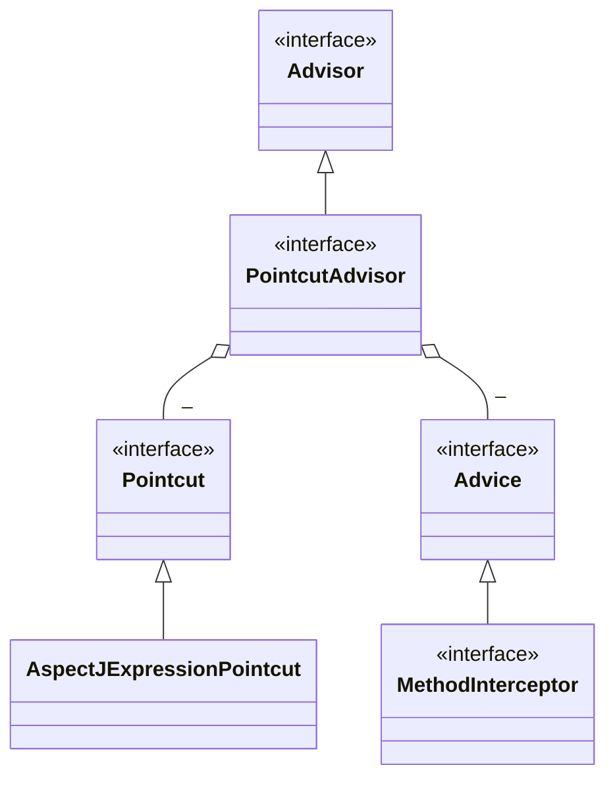

代理相关类图

* AopProxyFactory 根据 proxyTargetClass 等设置选择 AopProxy 实现
* AopProxy 通过 getProxy 创建代理对象
* 图中 Proxy 都实现了 Advised 接口，能够获得关联的切面集合与目标（其实是从 ProxyFactory 取得）
* 调用代理方法时，会借助 ProxyFactory 将通知统一转为环绕通知：MethodInterceptor

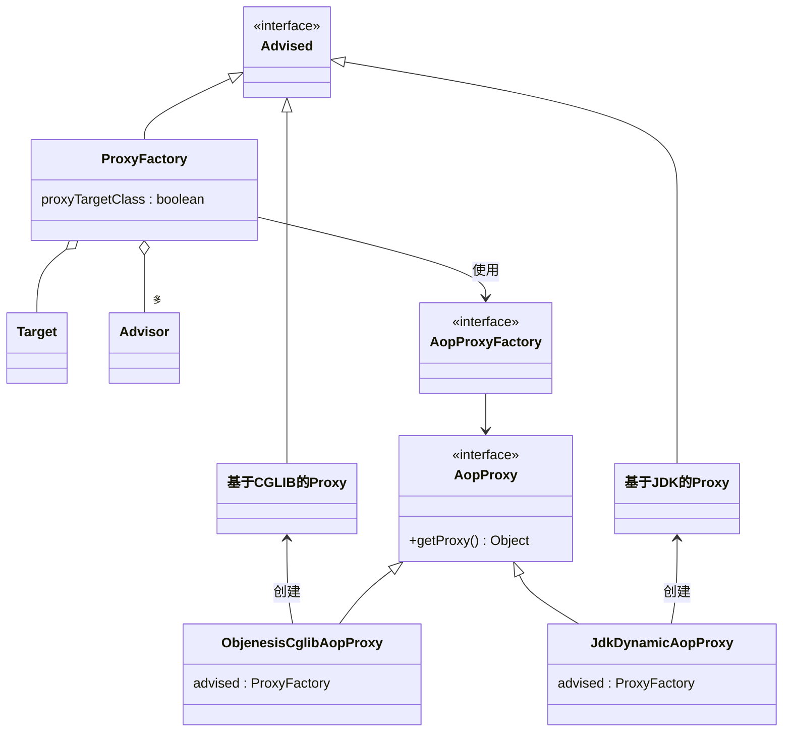


#### 演示 - 底层切点、通知、切面

##### 代码参考

**com.itheima.a15.A15**

```java
AspectJExpressionPointcut pointcut = new AspectJExpressionPointcut();
        pointcut.setExpression("execution(* com.wjl.spring._8testAop.TestAop1.Target.foo())");

        // 通知
        MethodInterceptor methodInterceptor = invocation -> {
            System.out.println("before....");
            Object result = invocation.proceed();// 调用方法
            System.out.println("after...");
            return result;
        };
        // 切面
        DefaultPointcutAdvisor advisor = new DefaultPointcutAdvisor(pointcut,methodInterceptor);
        // 创建代理
        ProxyFactory factory = new ProxyFactory();
        // 被代理对象
        Target target = new Target();
        factory.setTarget(target);
        // 添加切面
        factory.addAdvisor(advisor);

        // 设置target的接口 让其使用JDK代理
        factory.setInterfaces(target.getClass().getInterfaces());
        // 设置为true 无论有咩有接口 用CGLIB实现
        factory.setProxyTargetClass(false);
        // 获取切面对象
        Foo proxy = (Foo) factory.getProxy();
        // 默认使用CGLIB
        System.out.println(proxy.getClass().getName());
        proxy.foo();
```


#### 收获💡

1. 底层的切点实现
2. 底层的通知实现
2. 底层的切面实现
3. ProxyFactory 用来创建代理
   * 如果指定了接口，且 proxyTargetClass = false，使用 JdkDynamicAopProxy
   * 如果没有指定接口，或者 proxyTargetClass = true，使用 ObjenesisCglibAopProxy
     * 例外：如果目标是接口类型或已经是 Jdk 代理，使用 JdkDynamicAopProxy

> ***注意***
>
> * 要区分本章节提到的 MethodInterceptor，它与之前 cglib 中用的的 MethodInterceptor 是不同的接口


### 16) 切点匹配

#### 演示 - 切点匹配

##### 代码参考

**com.itheima.a16.A16**

```java
AspectJExpressionPointcut pointcut = new AspectJExpressionPointcut();
pointcut.setExpression("execution(* com.wjl.spring._8testAop.TestAop1.Target.foo())");
// pointcut.setExpression("@annotation(com.wjl.spring._8testAop.T)");
// 通知
MethodInterceptor methodInterceptor = invocation -> {
    System.out.println("before....");
    Object result = invocation.proceed();// 调用方法
    System.out.println("after...");
    return result;
};
// 切面
DefaultPointcutAdvisor advisor = new DefaultPointcutAdvisor(pointcut,methodInterceptor);
// 创建代理
ProxyFactory factory = new ProxyFactory();
// 被代理对象
Target target = new Target();
factory.setTarget(target);
// 添加切面
factory.addAdvisor(advisor);

// 设置target的接口 让其使用JDK代理
factory.setInterfaces(target.getClass().getInterfaces());
// 设置为true 无论有咩有接口 用CGLIB实现
factory.setProxyTargetClass(false);
// 获取切面对象
Foo proxy = (Foo) factory.getProxy();
// 默认使用CGLIB
System.out.println(proxy.getClass().getName());
proxy.foo();
```


#### 收获💡

1. 常见 aspectj 切点用法

2. aspectj 切点的局限性，实际的 @Transactional 切点实现

3. ```java
   StaticMethodMatcherPointcut pointcut = new StaticMethodMatcherPointcut() {
       @Override
       public boolean matches(Method method, Class<?> targetClass) {
           MergedAnnotations methodAn = MergedAnnotations.from(method);
           Class<Transactional> type = Transactional.class;
           if (methodAn.isPresent(type)) {
               return true;
           }
           MergedAnnotations classHead = MergedAnnotations.from(targetClass);
           if (classHead.isPresent(type)) {
               return true;
           }
           Class<?>[] interfaces = targetClass.getInterfaces();
           for (Class clazz : interfaces) {
   
               if (clazz.getAnnotation(type) != null) {
                   return true;
               }
               for (Method anInterface : clazz.getDeclaredMethods()) {
                   return anInterface.getName().equals(method.getName()) && anInterface.getAnnotation(type) != null;
               }
           }
           return false;
       }
   };
   System.out.println(pointcut.matches(Target.class.getDeclaredMethod("bar"), Target.class));
   ```


### 17) 从 @Aspect 到 Advisor

#### 演示1 - 代理创建器

##### 代码参考

**org.springframework.aop.framework.autoproxy** 包


#### 收获💡

1. AnnotationAwareAspectJAutoProxyCreator 的作用
   * 将高级 @Aspect 切面统一为低级 Advisor 切面
   * 在合适的时机创建代理
2. findEligibleAdvisors 找到有【资格】的 Advisors
   * 有【资格】的 Advisor 一部分是低级的, 可以由自己编写, 如本例 A17 中的 advisor3
   * 有【资格】的 Advisor 另一部分是高级的, 由解析 @Aspect 后获得
3. wrapIfNecessary
   * 它内部调用 findEligibleAdvisors, 只要返回集合不空, 则表示需要创建代理
   * 它的调用时机通常在原始对象初始化后执行, 但碰到循环依赖会提前至依赖注入之前执行


#### 演示2 - 代理创建时机

##### 代码参考

**org.springframework.aop.framework.autoproxy.A17_1**

```java
Bean1() // 构造
Bean2()
[TRACE] 11:04:52.236 [main] o.s.a.a.a.AnnotationAwareAspectJAutoProxyCreator - Creating implicit proxy for bean 'bean1' with 0 common interceptors and 2 specific interceptors  // spring内部
Bean2 setBean1(bean1) class is: class
    org.springframework.aop.framework.autoproxy.A17_1$Bean1$$EnhancerBySpringCGLIB$$5455d566
Bean2 init()
Bean1 setBean2(bean2) class is: class org.springframework.aop.framework.autoproxy.A17_1$Bean2
Bean1 init()
```

#### 收获💡

1. 代理的创建时机
   * 初始化之后 (无循环依赖时)
   * 实例创建后, 依赖注入前 (有循环依赖时), 并暂存于二级缓存
2. 依赖注入与初始化不应该被增强, 仍应被施加于原始对象


#### 演示3 - @Before 对应的低级通知

##### 代码参考

**org.springframework.aop.framework.autoproxy.A17_2**


#### 收获💡

1. @Before 前置通知会被转换为原始的 AspectJMethodBeforeAdvice 形式, 该对象包含了如下信息
   1. 通知代码从哪儿来
   2. 切点是什么(这里为啥要切点, 后面解释)
   3. 通知对象如何创建, 本例共用同一个 Aspect 对象
2. 类似的还有
   1. AspectJAroundAdvice (环绕通知)
   2. AspectJAfterReturningAdvice
   3. AspectJAfterThrowingAdvice (环绕通知)
   4. AspectJAfterAdvice (环绕通知)

```plain text
其实无论 ProxyFactory 基于哪种方式创建代理, 最后干活(调用 advice)的是一个 MethodInvocation 对象
                a. 因为 advisor 有多个, 且一个套一个调用, 因此需要一个调用链对象, 即 MethodInvocation
                b. MethodInvocation 要知道 advice 有哪些, 还要知道目标, 调用次序如下

                将 MethodInvocation 放入当前线程
                    |-> before1 ----------------------------------- 从当前线程获取 MethodInvocation
                    |                                             |
                    |   |-> before2 --------------------          | 从当前线程获取 MethodInvocation
                    |   |                              |          |
                    |   |   |-> target ------ 目标   advice2    advice1
                    |   |                              |          |
                    |   |-> after2 ---------------------          |
                    |                                             |
                    |-> after1 ------------------------------------
                c. 从上图看出, 环绕通知才适合作为 advice, 因此其他 before、afterReturning 都会被转换成环绕通知
                d. 统一转换为环绕通知, 体现的是设计模式中的适配器模式
                    - 对外是为了方便使用要区分 before、afterReturning
                    - 对内统一都是环绕通知, 统一用 MethodInterceptor 表示

            此步获取所有执行时需要的 advice (静态)
                a. 即统一转换为 MethodInterceptor 环绕通知, 这体现在方法名中的 Interceptors 上
                b. 适配如下
                  - MethodBeforeAdviceAdapter 将 @Before AspectJMethodBeforeAdvice 适配为 MethodBeforeAdviceInterceptor
                  - AfterReturningAdviceAdapter 将 @AfterReturning AspectJAfterReturningAdvice 适配为 AfterReturningAdviceInterceptor
```


### 18) 静态通知调用

代理对象调用流程如下（以 JDK 动态代理实现为例）

* 从 ProxyFactory 获得 Target 和环绕通知链，根据他俩创建 MethodInvocation，简称 mi
* 首次执行 mi.proceed() 发现有下一个环绕通知，调用它的 invoke(mi)
* 进入环绕通知1，执行前增强，再次调用 mi.proceed() 发现有下一个环绕通知，调用它的 invoke(mi)
* 进入环绕通知2，执行前增强，调用 mi.proceed() 发现没有环绕通知，调用 mi.invokeJoinPoint() 执行目标方法
* 目标方法执行结束，将结果返回给环绕通知2，执行环绕通知2 的后增强
* 环绕通知2继续将结果返回给环绕通知1，执行环绕通知1 的后增强
* 环绕通知1返回最终的结果

图中不同颜色对应一次环绕通知或目标的调用起始至终结

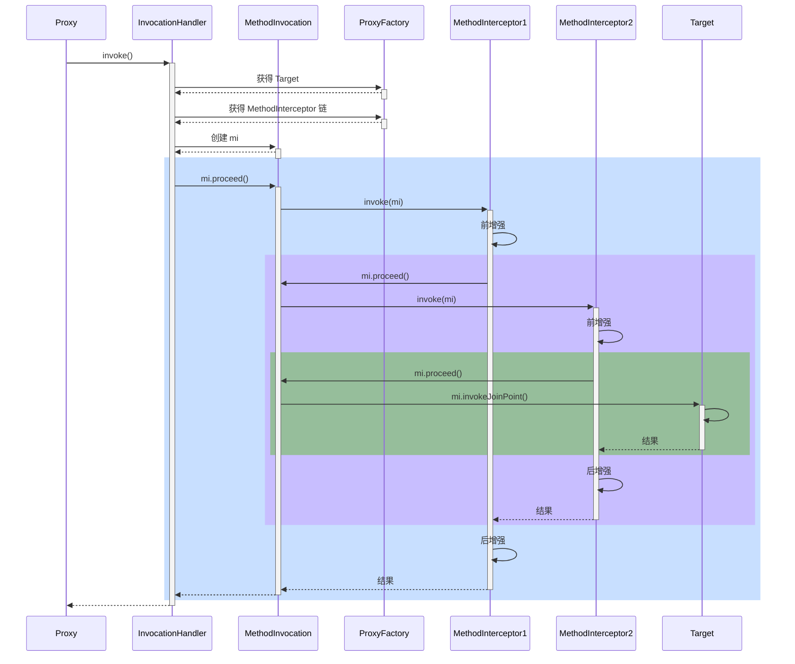


#### 演示1 - 通知调用过程

##### 代码参考

**org.springframework.aop.framework.A18**

#### 收获💡

代理方法执行时会做如下工作

1. 通过 proxyFactory 的 getInterceptorsAndDynamicInterceptionAdvice() 将其他通知统一转换为 MethodInterceptor 环绕通知
      - MethodBeforeAdviceAdapter 将 @Before AspectJMethodBeforeAdvice 适配为 MethodBeforeAdviceInterceptor
      - AfterReturningAdviceAdapter 将 @AfterReturning AspectJAfterReturningAdvice 适配为 AfterReturningAdviceInterceptor
      - 这体现的是适配器设计模式
2. 所谓静态通知，体现在上面方法的 Interceptors 部分，这些通知调用时无需再次检查切点，直接调用即可
3. 结合目标与环绕通知链，创建 MethodInvocation 对象，通过它完成整个调用


#### 演示2 - 模拟 MethodInvocation

##### 代码参考

**org.springframework.aop.framework.A18_1**

```java
public class A18_1 {

    static class Target {
        public void foo() {
            System.out.println("Target.foo()");
        }
    }

    static class Advice1 implements MethodInterceptor {
        public Object invoke(MethodInvocation invocation) throws Throwable {
            System.out.println("Advice1.before()");
            Object result = invocation.proceed();// 调用下一个通知或目标
            System.out.println("Advice1.after()");
            return result;
        }
    }

    static class Advice2 implements MethodInterceptor {
        public Object invoke(MethodInvocation invocation) throws Throwable {
            System.out.println("Advice2.before()");
            Object result = invocation.proceed();// 调用下一个通知或目标
            System.out.println("Advice2.after()");
            return result;
        }
    }


    static class MyInvocation implements MethodInvocation {
        private Object target;  // 1
        private Method method;
        private Object[] args;
        List<MethodInterceptor> methodInterceptorList; // 2
        private int count = 1; // 调用次数

        public MyInvocation(Object target, Method method, Object[] args, List<MethodInterceptor> methodInterceptorList) {
            this.target = target;
            this.method = method;
            this.args = args;
            this.methodInterceptorList = methodInterceptorList;
        }

        @Override
        public Method getMethod() {
            return method;
        }

        @Override
        public Object[] getArguments() {
            return args;
        }

        @Override
        public Object proceed() throws Throwable { // 调用每一个环绕通知, 调用目标
            if (count > methodInterceptorList.size()) {
                // 调用目标， 返回并结束递归
                return method.invoke(target, args);
            }
            // 逐一调用通知, count + 1
            MethodInterceptor methodInterceptor = methodInterceptorList.get(count++ - 1);
            return methodInterceptor.invoke(this);
        }

        @Override
        public Object getThis() {
            return target;
        }

        @Override
        public AccessibleObject getStaticPart() {
            return method;
        }
    }

    public static void main(String[] args) throws Throwable {
        Target target = new Target();
        List<MethodInterceptor> list = List.of(
                new Advice1(),
                new Advice2()
        );
        MyInvocation invocation = new MyInvocation(target, Target.class.getMethod("foo"), new Object[0], list);
        invocation.proceed();
    }
}
```

#### 收获💡

1. proceed() 方法调用链中下一个环绕通知
2. 每个环绕通知内部继续调用 proceed()
3. 调用到没有更多通知了, 就调用目标方法

MethodInvocation 的编程技巧在实现拦截器、过滤器时能用上


### 19) 动态通知调用

#### 演示 - 带参数绑定的通知方法调用

##### 代码参考

**org.springframework.aop.framework.autoproxy.A19**

```java
public class DynamicAspect {
    public  static  void main(String[] args) throws Throwable {
        GenericApplicationContext context = new GenericApplicationContext();
        context.registerBean(ConfigurationClassPostProcessor.class);
        context.registerBean(MyConfig.class);
        context.refresh();

        AnnotationAwareAspectJAutoProxyCreator autoProxyCreator = context.getBean(AnnotationAwareAspectJAutoProxyCreator.class);
        // 低级代理集合
        List<Advisor> advisors = autoProxyCreator.findEligibleAdvisors(Target.class, "target");

        Target target = new Target();
        ProxyFactory proxyFactory = new ProxyFactory();
        proxyFactory.setTarget(target);
        proxyFactory.addAdvisors(advisors);

        // 获取代理类
        Object proxy = proxyFactory.getProxy();
        // 获取动态拦截 通过 proxyFactory 的 getInterceptorsAndDynamicInterceptionAdvice()
        // 将其他通知统一转换为 MethodInterceptor 环绕通知
        List<Object> interceptionAdvice = proxyFactory.getInterceptorsAndDynamicInterceptionAdvice(
                target.getClass().getMethod("foo", int.class),
                target.getClass()
        );
        // InterceptorAndDynamicMethodMatcher 包含了此类 中包含了MethodMatcher类
        // MethodInterceptor 就是环绕通知
        // MethodMatcher 就是切点对象实现的类

        interceptionAdvice.forEach(DynamicAspect::showDetail);

        ReflectiveMethodInvocation invocation = new ReflectiveMethodInvocation(
                //           增强的方法                                       实参                               低级通知集合
                proxy,target,Target.class.getMethod("foo", int.class),new Object[]{1},target.getClass(),interceptionAdvice
        ){};
        // 执行方法
        invocation.proceed();
        context.close();
    }
    public static void showDetail(Object o) {
        try {
            Class<?> clazz = Class.forName("org.springframework.aop.framework.InterceptorAndDynamicMethodMatcher");
            if (clazz.isInstance(o)) {
                Field methodMatcher = clazz.getDeclaredField("methodMatcher");
                methodMatcher.setAccessible(true);
                Field methodInterceptor = clazz.getDeclaredField("interceptor");
                methodInterceptor.setAccessible(true);
                System.out.println("环绕通知和切点：" + o);
                System.out.println("\t切点为：" + methodMatcher.get(o));
                System.out.println("\t通知为：" + methodInterceptor.get(o));
            } else {
                System.out.println("普通环绕通知：" + o);
            }
        } catch (Exception e) {
            e.printStackTrace();
        }
    }
    @Aspect
    static class MyAspect {
        @Before("execution(* foo(..))") // 静态通知调用，不带参数绑定，执行时不需要切点
        public void before1() {
            System.out.println("before1");
        }

        @Before("execution(* foo(..)) && args(x)") // 动态通知调用，需要参数绑定，执行时还需要切点对象
        public void before2(int x) {
            System.out.printf("before2(%d)%n", x);
        }
    }

    static class Target {
        public void foo(int x) {
            System.out.printf("target foo(%d)%n", x);
        }
    }

    @Configuration
    static class MyConfig {
        @Bean
        AnnotationAwareAspectJAutoProxyCreator proxyCreator() {
            return new AnnotationAwareAspectJAutoProxyCreator();
        }

        @Bean
        public MyAspect myAspect() {
            return new MyAspect();
        }
    }
}
```


#### 收获💡

1. 通过 proxyFactory 的 getInterceptorsAndDynamicInterceptionAdvice() 将其他通知统一转换为 MethodInterceptor 环绕通知
2. 所谓动态通知，体现在上面方法的 DynamicInterceptionAdvice 部分，这些通知调用时因为要为通知方法绑定参数，还需再次利用切点表达式
3. 动态通知调用复杂程度高，性能较低


## WEB

```java
private final static ExecutorService SERVICE = Executors.newFixedThreadPool(3);

public static void main(String[] args) throws IOException {
    ServerSocketChannel channel = ServerSocketChannel.open();
    channel.bind(new InetSocketAddress(8081));
    ByteBuffer buffer = ByteBuffer.allocate(1024);
    while (true) {
        SocketChannel accept = channel.accept();
        accept.read(buffer);
        buffer.flip();
        byte[] bytes = new byte[buffer.limit()];
        buffer.get(bytes);

        sendServlet(bytes, accept);
    }
}

private static void sendServlet(byte[] bytes, SocketChannel socketChannel) {
    SERVICE.execute(() -> {
        Request request = new Request(new String(bytes, StandardCharsets.UTF_8));
        System.out.println(request);
        /*if (request.getUrl() == "/index") {*/

        String responseFirst = request.getVersion() + " 200 OK\r\n";
        byte[] bytes1 = "<user><name>张三</name></user>".getBytes(StandardCharsets.UTF_8);
        //InputStream inputStream = Server.class.getResourceAsStream("/templates/index.html");
        byte[] bytes2 = ResourceUtil.readBytes("templates/index.html");
        String responseHeaders = "Content-type:text/html\r\n" + "Content-length:" + bytes2.length+"\r\n\r\n";

        ByteBuffer first = ByteBuffer.allocate(1024);
        ByteBuffer header = ByteBuffer.allocate(1024);
        ByteBuffer body = ByteBuffer.allocate(1024);

        first.put(responseFirst.getBytes(StandardCharsets.UTF_8));
        header.put(responseHeaders.getBytes(StandardCharsets.UTF_8));
        body.put(bytes2);

        first.flip();
        header.flip();
        body.flip();
        try {
            System.out.println("发送");
            socketChannel.write(first);
            socketChannel.write(header);
            socketChannel.write(body);
        } catch (IOException e) {
            throw new RuntimeException(e);
        }

    });
}
```

### 20) RequestMappingHandlerMapping 与 RequestMappingHandlerAdapter

RequestMappingHandlerMapping 与 RequestMappingHandlerAdapter 俩是一对，分别用来

* 处理 @RequestMapping 映射
* 调用控制器方法、并处理方法参数与方法返回值

#### 演示1 - DispatcherServlet 初始化

##### 代码参考

**com.itheima.a20** 包

```java
@ComponentScan
@Configuration
// 默认不会读取 必须两个一起
@PropertySource("classpath:application.properties")
@EnableConfigurationProperties({WebMvcProperties.class, ServerProperties.class})
public class Config {
    
    @Bean
    public DispatcherServlet servlet() {
        return new DispatcherServlet();
    }

    @Bean
    public TomcatServletWebServerFactory tomcatServletWebServerFactory(
            ServerProperties serverProperties
    ) {
        return new TomcatServletWebServerFactory(serverProperties.getPort());
    }

    @Bean
    public DispatcherServletRegistrationBean registrationBean(
            DispatcherServlet servlet,
            WebMvcProperties webMvcProperties
    ) {
        DispatcherServletRegistrationBean registrationBean = new DispatcherServletRegistrationBean(servlet, "/");
        // 设置提前初始化DispatcherServlet
        registrationBean.setLoadOnStartup(webMvcProperties.getServlet().getLoadOnStartup());
        return registrationBean;
    }

    @Bean("/hello")
    public Controller hello() {
        System.err.println("初始化");
        return (request, response) -> {
            response.getWriter().println("Hello");
            return null;
        };
    }
}
```


#### 收获💡

1. DispatcherServlet 是在第一次被访问时执行初始化, 也可以通过配置修改为 Tomcat 启动后就初始化

2. 在初始化时会从 Spring 容器中找一些 Web 需要的组件, 如 HandlerMapping、HandlerAdapter 等，并逐一调用它们的初始化

3. RequestMappingHandlerMapping 初始化时，会收集所有 @RequestMapping 映射信息，封装为 Map，其中
   * key 是 RequestMappingInfo 类型，包括请求路径、请求方法等信息
   
   * value 是 HandlerMethod 类型，包括控制器方法对象、控制器对象
   
   * 有了这个 Map，就可以在请求到达时，快速完成映射，找到 HandlerMethod 并与匹配的拦截器一起返回给 DispatcherServlet
   
   * ```java
     AnnotationConfigServletWebServerApplicationContext context
                     = new AnnotationConfigServletWebServerApplicationContext(Config.class);
             // 解析@RequestMapping 及 派生注解 (提前Bean容器)
             RequestMappingHandlerMapping requestMapping = context.getBean(RequestMappingHandlerMapping.class);
     
             Map<RequestMappingInfo, HandlerMethod> methodMap = requestMapping.getHandlerMethods();
             methodMap.forEach((k,v)->{
                 // k:{PUT [/test3]}	v:com.wjl.spring._9web.TestController#test3()
                 System.out.println("k:"+k+"\tv:"+v);
             });
     
             // 处理器执行链对象 HandlerExecutionChain with [com.wjl.spring._9web.TestController#test1()] and 0 interceptors
             HandlerExecutionChain get = requestMapping.getHandler(new MockHttpServletRequest("GET", "/test1"));
     ```
   
4. RequestMappingHandlerAdapter 初始化时，会准备 HandlerMethod 调用时需要的各个组件，如：
   * HandlerMethodArgumentResolver 解析控制器方法参数
   * HandlerMethodReturnValueHandler 处理控制器方法返回值


#### 演示2 - 自定义参数与返回值处理器

##### 代码参考

**com.itheima.a20.TokenArgumentResolver** ，**com.itheima.a20.YmlReturnValueHandler**

###### Config

```java
@ComponentScan
@Configuration
// 默认不会读取 必须两个一起
@PropertySource("classpath:application.properties")
@EnableConfigurationProperties({WebMvcProperties.class, ServerProperties.class})
public class Config {

    @Bean
    public MyRequestMappingHandlerAdapter requestMappingHandlerAdapter(){
        // 添加自定义参数解析器和返回值解析器
        TokenArgumentResolver tokenArgumentResolver = new TokenArgumentResolver();
        YamlReturnValueHandler yamlReturnValueHandler = new YamlReturnValueHandler();
        MyRequestMappingHandlerAdapter mappingHandlerAdapter = new MyRequestMappingHandlerAdapter();
        mappingHandlerAdapter.setCustomArgumentResolvers(Arrays.asList(tokenArgumentResolver));
        mappingHandlerAdapter.setCustomReturnValueHandlers(Arrays.asList(yamlReturnValueHandler));
        return mappingHandlerAdapter;
    }

    @Bean
    public RequestMappingHandlerMapping requestMappingHandlerMapping(){
        return new RequestMappingHandlerMapping();
    }

    @Bean
    public DispatcherServlet servlet() {
        return new DispatcherServlet();
    }

    @Bean
    public TomcatServletWebServerFactory tomcatServletWebServerFactory(
            ServerProperties serverProperties
    ) {
        return new TomcatServletWebServerFactory(serverProperties.getPort());
    }

    @Bean
    public DispatcherServletRegistrationBean registrationBean(
            DispatcherServlet servlet,
            WebMvcProperties webMvcProperties
    ) {
        DispatcherServletRegistrationBean registrationBean = new DispatcherServletRegistrationBean(servlet, "/");
        // 设置提前初始化DispatcherServlet
        registrationBean.setLoadOnStartup(webMvcProperties.getServlet().getLoadOnStartup());
        return registrationBean;
    }

    @Bean("/hello")
    public Controller hello() {
        System.err.println("初始化");
        return (request, response) -> {
            response.getWriter().println("Hello");
            return null;
        };
    }
}
```

###### Controller

```java
@Controller
public class TestController {
    @RequestMapping("test1")
    public ModelAndView test1(){
        log.info("test1");
        return null;
    }
    @PostMapping("test2")
    public ModelAndView test2(String name){
        log.info("test2({})",name);
        return null;
    }


    @PutMapping("test3")
    public ModelAndView test3(@Token("123") String token){
        log.info("test3({})",token);
        return null;
    }
    @Yml
    @RequestMapping("test.yml")
    public User test4() {
        log.info("test4");
        return new User(1,"张三");
    }

    public static void main(String[] args) {
        String zhangsan = new Yaml().dump(new User(1, "zhangsan"));
        System.out.println(zhangsan);
    }
}
```

###### main

```java
AnnotationConfigServletWebServerApplicationContext context
        = new AnnotationConfigServletWebServerApplicationContext(Config.class);

// 解析@RequestMapping 及 派生注解 (提前Bean容器)
RequestMappingHandlerMapping requestMapping = context.getBean(RequestMappingHandlerMapping.class);
// k:{PUT [/test3]}    v:com.wjl.spring._9web.TestController#test3()
Map<RequestMappingInfo, HandlerMethod> methodMap = requestMapping.getHandlerMethods();

MockHttpServletRequest mockRequest = new MockHttpServletRequest("PUT", "/test.yml");
// mockGet.setParameter("name","张三");
mockRequest.addHeader("123","ewqew434gvxgvxfg");
MockHttpServletResponse mockResponse = new MockHttpServletResponse();
// 处理器执行链对象 HandlerExecutionChain with [com.wjl.spring._9web.TestController#test1()] and 0 interceptors
HandlerExecutionChain chain = requestMapping.getHandler(mockRequest);

// 获取适配器 继承RequestMappingHandlerAdapter 开放 invokeHandlerMethod方法
MyRequestMappingHandlerAdapter adapter = context.getBean(MyRequestMappingHandlerAdapter.class);
// 执行控制器方法   // 根据执行链找到控制器
ModelAndView mv = adapter.invokeHandlerMethod(mockRequest, mockResponse, (HandlerMethod) chain.getHandler());

System.out.println("=============");
System.out.println(new String(mockResponse.getContentAsByteArray()));
// 参数解析器
// adapter.getArgumentResolvers().forEach(System.out::println);
// 返回值解析器
// adapter.getReturnValueHandlers().forEach(System.out::println);

//context.close();
```

###### Handler

```java
// Yaml
public class YamlReturnValueHandler implements HandlerMethodReturnValueHandler {
    @Override
    public boolean supportsReturnType(MethodParameter returnType) {
        // 根据方法参数 获取方法上面的注解
        Yml yml = returnType.getMethodAnnotation(Yml.class);
        return yml != null;
    }

    @Override
    public void handleReturnValue(Object returnValue, MethodParameter returnType,
                        ModelAndViewContainer mavContainer, NativeWebRequest webRequest) throws Exception {
        String dump = new Yaml().dump(returnValue);
        // 获取原始相应对象
        HttpServletResponse nativeResponse = webRequest.getNativeResponse(HttpServletResponse.class);
        nativeResponse.setContentType(MediaType.TEXT_PLAIN_VALUE+";charset=utf-8");
        nativeResponse.getWriter().println(dump);

        // 设置请求处理完毕
        mavContainer.setRequestHandled(true);
    }
}

// token
public class TokenArgumentResolver implements HandlerMethodArgumentResolver {

    private String tokenKey;

    // 是否支持某个参数 // MethodParameter方法参数
    @Override
    public boolean supportsParameter(MethodParameter parameter) {
        Token token = parameter.getParameterAnnotation(Token.class);
        return token != null && (tokenKey = token.value()).length() > 0;
    }

    @Override
    public Object resolveArgument(MethodParameter parameter, ModelAndViewContainer mavContainer, 					NativeWebRequest webRequest, WebDataBinderFactory binderFactory) throws Exception {
        return webRequest.getHeader(tokenKey);
    }
}
```


#### 收获💡

1. 体会参数解析器的作用
2. 体会返回值处理器的作用


### 21) 参数解析器

#### 演示 - 常见参数解析器

##### 代码参考

**com.itheima.a21** 包

```java
// main
AnnotationConfigServletWebApplicationContext context =
        new AnnotationConfigServletWebApplicationContext(WebConfig.class);

Controller controller = new Controller();
// 封装有关由方法和bean组成的处理程序方法的信息。提供对方法参数、方法返回值、方法注解等的便捷访问。
HandlerMethod handlerMethod = new HandlerMethod(controller, controller.getClass()
        .getMethod("test", String.class, String.class, int.class, String.class, MultipartFile.class, int.class, String.class, String.class, String.class, HttpServletRequest.class, User.class, User.class, User.class));

ModelAndViewContainer mvcContainer = new ModelAndViewContainer();

parametersPrint(handlerMethod, mvcContainer, mockRequest(), context.getDefaultListableBeanFactory());


//==================================================================================================
private static void parametersPrint(
        HandlerMethod handlerMethod, ModelAndViewContainer mvcContainer,
        HttpServletRequest request, DefaultListableBeanFactory contextBeanFactory
) throws Exception {
    // 类型转换
    ServletRequestDataBinderFactory binderFactory = new ServletRequestDataBinderFactory(null, null);
    // 参数名解析器
    DefaultParameterNameDiscoverer parameterNameDiscoverer = new DefaultParameterNameDiscoverer();

    // 工厂  是否可以省略相应注解
    HandlerMethodArgumentResolverComposite resolverComposite =
            new HandlerMethodArgumentResolverComposite();

    resolverComposite.addResolvers(
            new RequestParamMethodArgumentResolver(contextBeanFactory, false),
            new PathVariableMethodArgumentResolver(),
            new RequestHeaderMethodArgumentResolver(contextBeanFactory),
            new ServletCookieValueMethodArgumentResolver(contextBeanFactory),
            // @Value
            new ExpressionValueMethodArgumentResolver(contextBeanFactory),
            new ServletRequestMethodArgumentResolver(),
            // 消息转换器
            new RequestResponseBodyMethodProcessor(Collections.singletonList(new MappingJackson2HttpMessageConverter())),
            new ServletModelAttributeMethodProcessor(false),
            // springMVC的方式 保底
            new ServletModelAttributeMethodProcessor(true),
            // 最后的保底解析
            new RequestParamMethodArgumentResolver(contextBeanFactory, true)
    );

    for (MethodParameter parameter : handlerMethod.getMethodParameters()) {
        parameter.initParameterNameDiscovery(parameterNameDiscoverer);
		
        // 就是打印注解与类型
        String s = toString(parameter);

        if (resolverComposite.supportsParameter(parameter)) {
            Object resolveArgument = resolverComposite.resolveArgument(parameter, mvcContainer, new ServletWebRequest(request), binderFactory);
            log.error("index:{}\ttype:{}\tname:{}\tannotations:{}\t" + resolveArgument + "\t 结果类型" + resolveArgument.getClass(),
                    parameter.getParameterIndex(), parameter.getParameterType(), parameter.getParameterName(), s);
            log.info("解析后的mv {}",mvcContainer.getModel());
        } else {
            log.info("index:{}\ttype:{}\tname:{}\tannotations:{}",
                    parameter.getParameterIndex(), parameter.getParameterType(), parameter.getParameterName(), s);
        }
    }
}

private static String toString(MethodParameter parameter) {
    String s = Arrays.stream(parameter.getParameterAnnotations())
            .map(Annotation::annotationType)
            .map(Class::getSimpleName)
            .collect(Collectors.joining(","));
    return s;
}

private static HttpServletRequest mockRequest() {
    MockHttpServletRequest request = new MockHttpServletRequest();
    request.setParameter("name1", "zhangsan");
    request.setParameter("name2", "lisi");
    request.addPart(new MockPart("file", "abc", "hello".getBytes(StandardCharsets.UTF_8)));
    // RequestMapping处理的路径请求参数
    Map<String, String> map = new AntPathMatcher().extractUriTemplateVariables("/test/{id}", "/test/123");
    System.out.println(map);
    request.setAttribute(HandlerMapping.URI_TEMPLATE_VARIABLES_ATTRIBUTE, map);
    request.setContentType("application/json");
    request.setCookies(new Cookie("token", "123456"));
    request.setParameter("name", "张三");
    request.setParameter("age", "18");
    request.setContent("{\"name\":\"lisi\",\"age\":20}".getBytes(StandardCharsets.UTF_8));
    // {"name":"lisi","age":20}
    return new StandardServletMultipartResolver().resolveMultipart(request);
}

static class Controller {
    public void test(
            @RequestParam("name1") String name1, // name1=张三
            String name2,                        // name2=李四
            @RequestParam("age") int age,        // age=18
            @RequestParam(name = "home", defaultValue = "${JAVA_HOME}") String home1, // spring 获取数据
            @RequestParam("file") MultipartFile file, // 上传文件
            @PathVariable("id") int id,               //  /test/124   /test/{id}
            @RequestHeader("Content-Type") String header,
            @CookieValue("token") String token,
            @Value("${JAVA_HOME}") String home2, // spring 获取数据  ${} #{}
            HttpServletRequest request,          // request, response, session ...
            @ModelAttribute("abc") User user1,          // name=zhang&age=18
            User user2,                          // name=zhang&age=18
            @RequestBody User user3              // json
    ) {
    }
}
```

#### 收获💡

1. 初步了解 RequestMappingHandlerAdapter 的调用过程
   1. 控制器方法被封装为 HandlerMethod
   2. 准备对象绑定与类型转换
   3. 准备 ModelAndViewContainer 用来存储中间 Model 结果
   4. 解析每个参数值
2. 解析参数依赖的就是各种参数解析器，它们都有两个重要方法
   * supportsParameter 判断是否支持方法参数
   * resolveArgument 解析方法参数
3. 常见参数的解析
   * @RequestParam
   * 省略 @RequestParam
   * @RequestParam(defaultValue)
   * MultipartFile
   * @PathVariable
   * @RequestHeader
   * @CookieValue
   * @Value
   * HttpServletRequest 等
   * @ModelAttribute
   * 省略 @ModelAttribute
   * @RequestBody
4. 组合模式在 Spring 中的体现
5. @RequestParam, @CookieValue 等注解中的参数名、默认值, 都可以写成活的, 即从 ${ } #{ }中获取


### 22) 参数名解析

#### 演示 - 两种方法获取参数名

##### 代码参考

**com.itheima.a22.A22**

```java
// 1. 反射获取参数名
Method foo = Bean2.class.getMethod("foo", String.class, int.class);
/*for (Parameter parameter : foo.getParameters()) {
            System.out.println(parameter.getName());
        }*/

// 2. 基于 LocalVariableTable 本地变量表
LocalVariableTableParameterNameDiscoverer discoverer = new LocalVariableTableParameterNameDiscoverer();
String[] parameterNames = discoverer.getParameterNames(foo);
System.out.println(Arrays.toString(parameterNames));
```


#### 收获💡

1. 如果编译时添加了 -parameters 可以生成参数表, 反射时就可以拿到参数名
2. 如果编译时添加了 -g 可以生成调试信息, 但分为两种情况
   * 普通类, 会包含局部变量表, 用 asm 可以拿到参数名
   * 接口, 不会包含局部变量表, 无法获得参数名
     * 这也是 MyBatis 在实现 Mapper 接口时为何要提供 @Param 注解来辅助获得参数名


### 23) 对象绑定与类型转换

#### 底层第一套转换接口与实现

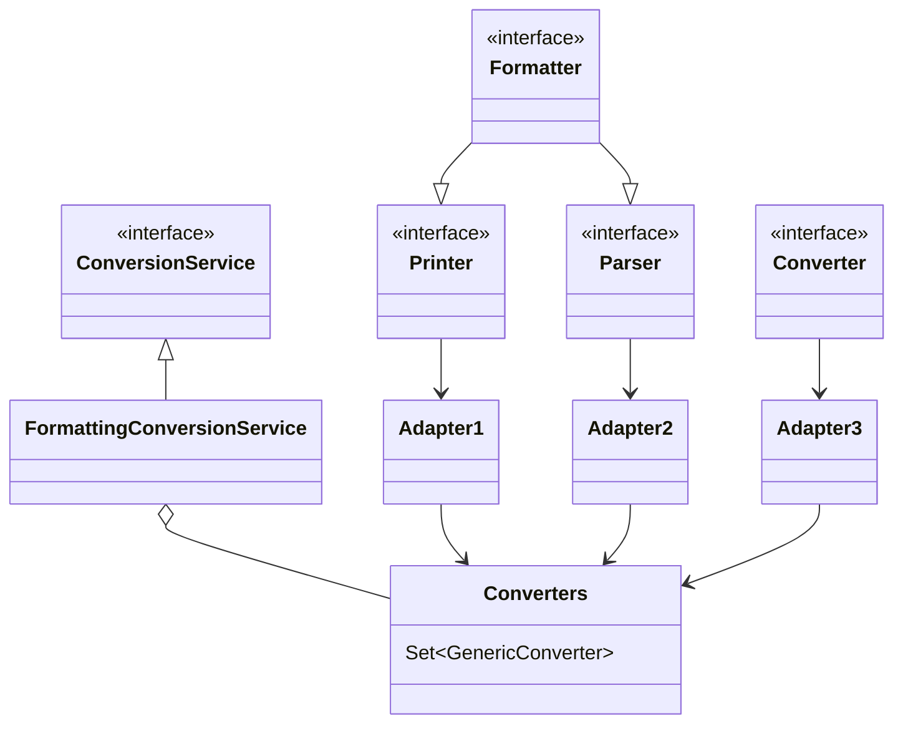

* Printer 把其它类型转为 String
* Parser 把 String 转为其它类型
* Formatter 综合 Printer 与 Parser 功能
* Converter 把类型 S 转为类型 T
* Printer、Parser、Converter 经过适配转换成 GenericConverter 放入 Converters 集合
* FormattingConversionService 利用其它们实现转换


#### 底层第二套转换接口

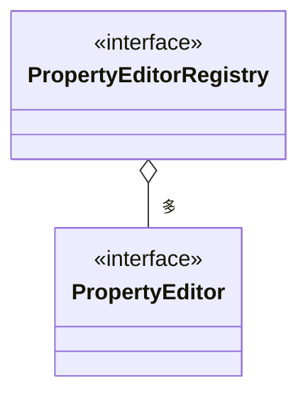

* PropertyEditor 把 String 与其它类型相互转换
* PropertyEditorRegistry 可以注册多个 PropertyEditor 对象
* 与第一套接口直接可以通过 FormatterPropertyEditorAdapter 来进行适配


#### 高层接口与实现

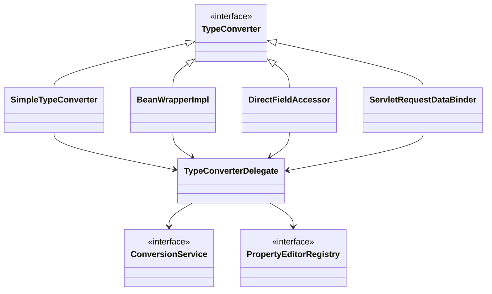

* 它们都实现了 TypeConverter 这个高层转换接口，在转换时，会用到 TypeConverter Delegate 委派ConversionService 与 PropertyEditorRegistry 真正执行转换（Facade 门面模式）
  * 首先看是否有自定义转换器, @InitBinder 添加的即属于这种 (用了适配器模式把 Formatter 转为需要的 PropertyEditor)
  * 再看有没有 ConversionService 转换
  * 再利用默认的 PropertyEditor 转换
  * 最后有一些特殊处理
* SimpleTypeConverter 仅做类型转换
* BeanWrapperImpl 为 bean 的属性赋值，当需要时做类型转换，走 Property
* DirectFieldAccessor 为 bean 的属性赋值，当需要时做类型转换，走 Field
* ServletRequestDataBinder 为 bean 的属性执行绑定，当需要时做类型转换，根据 directFieldAccess 选择走 Property 还是 Field，具备校验与获取校验结果功能


#### 演示1 - 类型转换与数据绑定

##### 代码参考

**com.itheima.a23** 包

```java
//SimpleTypeConverter 
SimpleTypeConverter converter = new SimpleTypeConverter();
Integer necessary = converter.convertIfNecessary("1", int.class);
System.out.println(necessary);
Date date = converter.convertIfNecessary("2019/10/10", Date.class);
System.out.println(date);

// 依赖get and Set
MyBean bean = new MyBean();
BeanWrapperImpl wrapper = new BeanWrapperImpl(bean);
wrapper.setPropertyValue("a","1");
wrapper.setPropertyValue("b","张三");
System.out.println(bean);

// 依赖反射
DirectFieldAccessor accessor = new DirectFieldAccessor(bean);
accessor.setPropertyValue("a","1");
accessor.setPropertyValue("b","张三");

// 
 DataBinder binder = new DataBinder(bean);
// 不设置就是Get Set 设置就是反射
binder.initDirectFieldAccess();
MutablePropertyValues pvs = new MutablePropertyValues();
pvs.addPropertyValue("a","2");
pvs.addPropertyValue("b","张三");
binder.bind(pvs);

// 
ServletRequestDataBinder binder = new ServletRequestDataBinder(bean);
// 不设置就是Get Set 设置就是反射
binder.initDirectFieldAccess();

MockHttpServletRequest request = new MockHttpServletRequest();
request.setParameter("a","2");
request.setParameter("b","张三");

binder.bind(new ServletRequestParameterPropertyValues(request));
System.out.println(bean);
```


#### 收获💡

基本的类型转换与数据绑定用法

* SimpleTypeConverter
* BeanWrapperImpl
* DirectFieldAccessor
* ServletRequestDataBinder


#### 演示2 - 数据绑定工厂

##### 代码参考

**com.itheima.a23.TestServletDataBinderFactory**

```java
MockHttpServletRequest request = new MockHttpServletRequest();
request.setParameter("date","1990|08|08");
request.setParameter("address.name","华尔街");

Target target = new Target();
// 不使用工厂 没有解析自定义能力
// ServletRequestDataBinder binder = new ServletRequestDataBinder(target);

// 回调 InitBinder 控制器 (优先级更高)
/*
         @InitBinder
         public void aaa(WebDataBinder webDataBinder){
             webDataBinder.addCustomFormatter(new MyDateFormatter("yyyy|MM|dd"));
         }
 */
// MyController mc = new MyController();
// Method aaa = mc.getClass().getMethod("aaa", WebDataBinder.class);
// 添加至 ServletRequestDataBinderFactory参数1
// InvocableHandlerMethod handlerMethod = new InvocableHandlerMethod(new HandlerMethod(mc,aaa));

// 添加初始化器
// FormattingConversionService service = new FormattingConversionService();
// service.addFormatter(new MyDateFormatter("asd"));
// ConfigurableWebBindingInitializer initializer = new ConfigurableWebBindingInitializer();
// initializer.setConversionService(service);

// ServletRequestDataBinderFactory binderFactory =
//         new ServletRequestDataBinderFactory(Arrays.asList(handlerMethod), initializer);


// 使用内置 DefaultFormattingConversionService要配合注解 @DateTimeFormat(pattern = "yyyy|MM|dd")
// DefaultFormattingConversionService service = new DefaultFormattingConversionService();
// 使用SpringBoot 的转换器
ApplicationConversionService service = new ApplicationConversionService();

ConfigurableWebBindingInitializer initializer = new ConfigurableWebBindingInitializer();
initializer.setConversionService(service);
ServletRequestDataBinderFactory binderFactory = new ServletRequestDataBinderFactory(null,initializer);


WebDataBinder binder = binderFactory.createBinder(new ServletWebRequest(request), target, "target");
binder.bind(new ServletRequestParameterPropertyValues(request));
System.out.println(target);
```


#### 收获💡

ServletRequestDataBinderFactory 的用法和扩展点

1. 可以解析控制器的 @InitBinder 标注方法作为扩展点，添加自定义转换器
   * 控制器私有范围
2. 可以通过 ConfigurableWebBindingInitializer 配置 ConversionService 作为扩展点，添加自定义转换器
   * 公共范围
3. 同时加了 @InitBinder 和 ConversionService 的转换优先级
   1. 优先采用 @InitBinder 的转换器
   2. 其次使用 ConversionService 的转换器
   3. 使用默认转换器
   4. 特殊处理（例如有参构造）


#### 演示3 - 获取泛型参数

##### 代码参考

**com.itheima.a23.sub** 包

```java
// 获取一个类继承父类附带的泛型
Class<StudentDao> clazz = StudentDao.class;

// JDK Api
Type superclass = clazz.getGenericSuperclass();
// ParameterizedType 表示一个参数化类型，例如Collection   .
// 参数化类型在反射方法第一次需要时创建，如此包中所指定。
// 创建参数化类型 p 时，解析 p 实例化的泛型类或接口声明，并递归创建 p 的所有类型参数
if (superclass instanceof ParameterizedType) {
    ParameterizedType parameterizedType = (ParameterizedType) superclass;
    System.out.println(parameterizedType.getActualTypeArguments()[0]);
}
System.out.println(">>>>>>>>>>>>>>>>>>>>>>>");

// Spring
// 参数是 类型 与 夫类型  只适用一个泛型参数
Class<?> argument = GenericTypeResolver.resolveTypeArgument(clazz, clazz.getSuperclass());
System.out.println(argument);
```


#### 收获💡

1. java api 获取泛型参数
2. spring api 获取泛型参数


### 24) @ControllerAdvice 之 @InitBinder

#### 演示 - 准备 @InitBinder

**准备 @InitBinder** 在整个 HandlerAdapter 调用过程中所处的位置

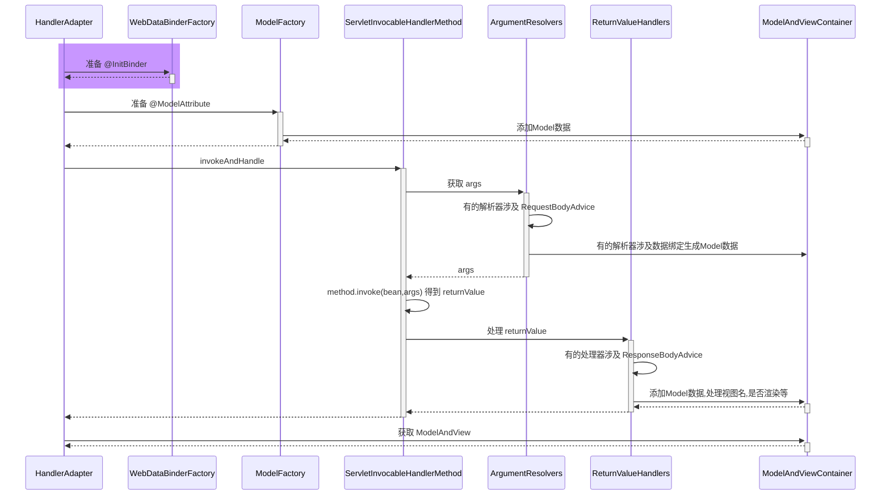

* RequestMappingHandlerAdapter 在图中缩写为 HandlerAdapter
* HandlerMethodArgumentResolverComposite 在图中缩写为 ArgumentResolvers
* HandlerMethodReturnValueHandlerComposite 在图中缩写为 ReturnValueHandlers


#### 收获💡

1. RequestMappingHandlerAdapter 初始化时会解析 @ControllerAdvice 中的 @InitBinder 方法
2. RequestMappingHandlerAdapter 会以类为单位，在该类首次使用时，解析此类的 @InitBinder 方法
3. 以上两种 @InitBinder 的解析结果都会缓存来避免重复解析
4. 控制器方法调用时，会综合利用本类的 @InitBinder 方法和 @ControllerAdvice 中的 @InitBinder 方法创建绑定工厂


### 25) 控制器方法执行流程

#### 图1

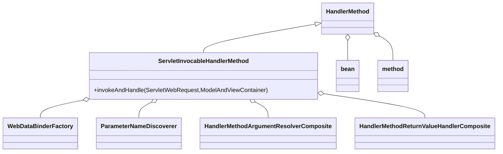

HandlerMethod 需要

* bean 即是哪个 Controller
* method 即是 Controller 中的哪个方法

ServletInvocableHandlerMethod 需要

* WebDataBinderFactory 负责对象绑定、类型转换
* ParameterNameDiscoverer 负责参数名解析
* HandlerMethodArgumentResolverComposite 负责解析参数
* HandlerMethodReturnValueHandlerComposite 负责处理返回值


#### 图2

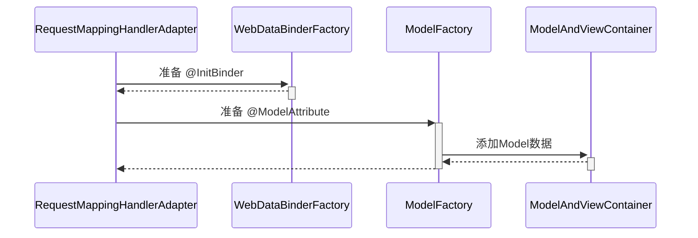


#### 图3

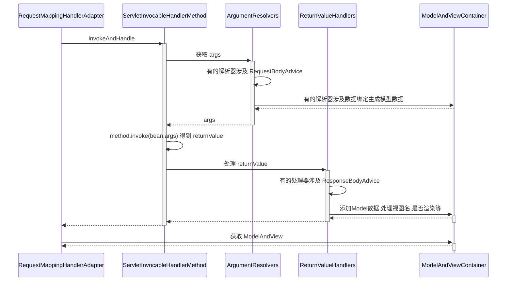


### 26) @ControllerAdvice 之 @ModelAttribute

#### 演示 - 准备 @ModelAttribute

##### 代码参考

**com.itheima.a26** 包

```java
@Configuration
public class WebConfig {

    @ControllerAdvice
    static class MyControllerAdvice {
        @ModelAttribute("a")
        public String aa() {
            return "aa";
        }
    }

    @Controller
    public static class Controller1 {
        @ModelAttribute("b")
        public String aa() {
            return "bb";
        }

        @ResponseStatus(HttpStatus.OK)
        public ModelAndView foo(@ModelAttribute("u") User  user) {
            System.out.println("foo");
            //System.out.println("user="+user);
            return null;
        }
    }

    public static class User {
        private String name;

        public void setName(String name) {
            this.name = name;
        }

        public String getName() {

            return name;
        }

        @Override
        public String toString() {
            return "User{" +
                    "name='" + name + '\'' +
                    '}';
        }
    }
}
```


###### 代码1

```java
AnnotationConfigApplicationContext context =
    new AnnotationConfigApplicationContext(WebConfig.class);

MockHttpServletRequest request = new MockHttpServletRequest();
request.setParameter("name", "张三");

WebConfig.Controller1 c1 = new WebConfig.Controller1();
Method foo = c1.getClass().getDeclaredMethod("foo", WebConfig.User.class);

ServletInvocableHandlerMethod invocableHandlerMethod =
    	new ServletInvocableHandlerMethod(c1, foo);
// bean Method DataBinder
ServletRequestDataBinderFactory dataBinderFactory = new ServletRequestDataBinderFactory(null,null);
invocableHandlerMethod.setDataBinderFactory(dataBinderFactory);

// 参数名解析
invocableHandlerMethod.setParameterNameDiscoverer(new DefaultParameterNameDiscoverer());

// HandlerMethodArgumentResolverComposite
invocableHandlerMethod.setHandlerMethodArgumentResolvers(getArgumentResolvers(context));
// 返回值解析器 暂时掠过

ModelAndViewContainer mv = new ModelAndViewContainer();
// 执行foo方法
invocableHandlerMethod.invokeAndHandle(new ServletWebRequest(request), mv);

// 不是所有被绑定的对象才会成为模型对象
// 方法参数上标注了 ModelAttribute 注解 或者没有标注的对象 也就是
// 被 ServletModelAttributeMethodProcessor(true\false) 解析的对象
// 如果ModelAttribute标注于方法上 方法的返回结果作为模型 没有指定名称以返回值类型首字母小写为准
System.out.println(mv.getModel());
// 输出{u=User{name='张三'}, org.springframework.validation.BindingResult.u=org.springframework.validation.BeanPropertyBindingResult: 0 errors}
context.close();


public static HandlerMethodArgumentResolverComposite getArgumentResolvers(AnnotationConfigApplicationContext context) {
    HandlerMethodArgumentResolverComposite composite = new HandlerMethodArgumentResolverComposite();
    composite.addResolvers(
            new RequestParamMethodArgumentResolver(context.getDefaultListableBeanFactory(), false),
            new PathVariableMethodArgumentResolver(),
            new RequestHeaderMethodArgumentResolver(context.getDefaultListableBeanFactory()),
            new ServletCookieValueMethodArgumentResolver(context.getDefaultListableBeanFactory()),
            new ExpressionValueMethodArgumentResolver(context.getDefaultListableBeanFactory()),
            new ServletRequestMethodArgumentResolver(),
            new ServletModelAttributeMethodProcessor(false),
            new RequestResponseBodyMethodProcessor(Arrays.asList(new MappingJackson2HttpMessageConverter())),
            new ServletModelAttributeMethodProcessor(true),
            new RequestParamMethodArgumentResolver(context.getDefaultListableBeanFactory(), true)
    );
    return composite;
}
```

###### 代码2

```java
AnnotationConfigApplicationContext context =
    new AnnotationConfigApplicationContext(WebConfig.class);

// 创建 RequestMappingHandlerAdapter
RequestMappingHandlerAdapter adapter = new RequestMappingHandlerAdapter();
adapter.setApplicationContext(context);
adapter.afterPropertiesSet(); // 初始化

MockHttpServletRequest request = new MockHttpServletRequest();
request.setParameter("name", "张三");

WebConfig.Controller1 c1 = new WebConfig.Controller1();
Method foo = c1.getClass().getDeclaredMethod("foo", WebConfig.User.class);

ServletInvocableHandlerMethod invocableHandlerMethod =
    new ServletInvocableHandlerMethod(c1, foo);
// bean Method DataBinder
ServletRequestDataBinderFactory dataBinderFactory = new ServletRequestDataBinderFactory(null, null);
invocableHandlerMethod.setDataBinderFactory(dataBinderFactory);

// 参数名解析
invocableHandlerMethod.setParameterNameDiscoverer(new DefaultParameterNameDiscoverer());

// HandlerMethodArgumentResolverComposite
invocableHandlerMethod.setHandlerMethodArgumentResolvers(getArgumentResolvers(context));
// 返回值解析器 暂时掠过

ModelAndViewContainer mv = new ModelAndViewContainer();

/**
*  初始化model（模型数据）之后便可以识别、反射调用 标注于方法上面的ModelAttribute
 */
// 获取一个ModelFactory
Method getModelFactory = RequestMappingHandlerAdapter.class.getDeclaredMethod("getModelFactory", HandlerMethod.class, WebDataBinderFactory.class);
getModelFactory.setAccessible(true);
ModelFactory modelFactory = (ModelFactory)getModelFactory.invoke(adapter, invocableHandlerMethod, dataBinderFactory);
// 初始化模型数据
modelFactory.initModel(new ServletWebRequest(request),mv,invocableHandlerMethod);
// 初始化时 会找本Controller标注于方法上面的ModelAttribute
// 接着会寻找 ControllerAdvice标注类中标注ModelAttribute 的方法放入模型数据中
// 执行foo方法
invocableHandlerMethod.invokeAndHandle(new ServletWebRequest(request), mv);

// 不是所有被绑定的对象才会成为模型对象
// 方法参数上标注了 ModelAttribute 注解 或者没有标注的对象 也就是
// 被 ServletModelAttributeMethodProcessor(true\false) 解析的对象
// 如果ModelAttribute标注于方法上 方法的返回结果作为模型 没有指定名称以返回值类型首字母小写为准
System.out.println(mv.getModel());
context.close();
```


**准备 @ModelAttribute** 在整个 HandlerAdapter 调用过程中所处的位置

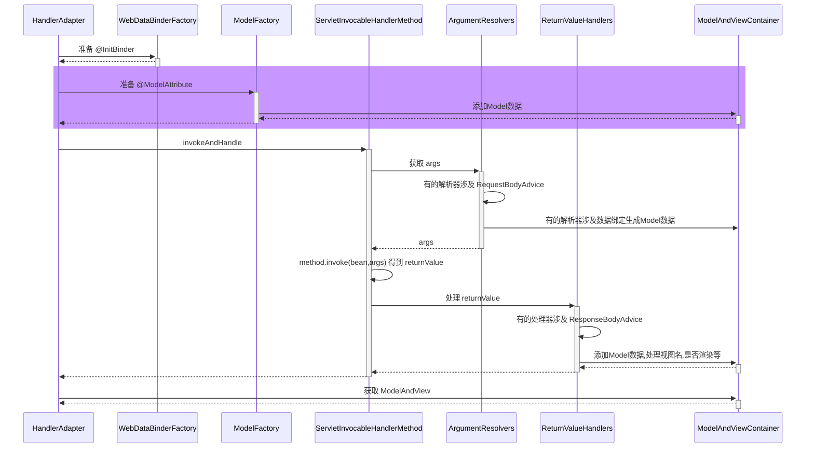

#### 收获💡

1. RequestMappingHandlerAdapter 初始化时会解析 @ControllerAdvice 中的 @ModelAttribute 方法
2. RequestMappingHandlerAdapter 会以类为单位，在该类首次使用时，解析此类的 @ModelAttribute 方法
3. 以上两种 @ModelAttribute 的解析结果都会缓存来避免重复解析
4. 控制器方法调用时，会综合利用本类的 @ModelAttribute 方法和 @ControllerAdvice 中的 @ModelAttribute 方法创建模型工厂


### 27) 返回值处理器

#### 演示 - 常见返回值处理器

##### 代码参考

**com.itheima.a27** 包

```java
HandlerMethodReturnValueHandlerComposite composite = new HandlerMethodReturnValueHandlerComposite();
composite.addHandler(new ModelAndViewMethodReturnValueHandler());
composite.addHandler(new ViewNameMethodReturnValueHandler());
composite.addHandler(new ServletModelAttributeMethodProcessor(false));
composite.addHandler(new HttpEntityMethodProcessor(List.of(new MappingJackson2HttpMessageConverter())));
composite.addHandler(new HttpHeadersReturnValueHandler());
composite.addHandler(new RequestResponseBodyMethodProcessor(List.of(new MappingJackson2HttpMessageConverter())));
composite.addHandler(new ServletModelAttributeMethodProcessor(true));
```


#### 收获💡

1. 常见的返回值处理器
   * ModelAndView，分别获取其模型和视图名，放入 ModelAndViewContainer
   * 返回值类型为 String 时，把它当做视图名，放入 ModelAndViewContainer
   * 返回值添加了 @ModelAttribute 注解时，将返回值作为模型，放入 ModelAndViewContainer
     * 此时需找到默认视图名
   * 返回值省略 @ModelAttribute 注解且返回非简单类型时，将返回值作为模型，放入 ModelAndViewContainer
     * 此时需找到默认视图名
   * 返回值类型为 ResponseEntity 时
     * 此时走 MessageConverter，并设置 ModelAndViewContainer.requestHandled 为 true (也就是不走视图渲染流程)
   * 返回值类型为 HttpHeaders 时
     * 会设置 ModelAndViewContainer.requestHandled 为 true
   * 返回值添加了 @ResponseBody 注解时
     * 此时走 MessageConverter，并设置 ModelAndViewContainer.requestHandled 为 true
2. 组合模式在 Spring 中的体现 + 1


### 28) MessageConverter

#### 演示 - MessageConverter 的作用

##### 代码参考

**com.itheima.a28.A28**

```java
// 模拟输出转换器
MockHttpOutputMessage message = new MockHttpOutputMessage();
User user = new User(1, "zhangsan");

MappingJackson2HttpMessageConverter jsonConverter
        = new MappingJackson2HttpMessageConverter();
if (jsonConverter.canWrite(User.class, MediaType.APPLICATION_JSON)) {
    jsonConverter.write(user, MediaType.APPLICATION_JSON, message);
    System.out.println(message.getBodyAsString());
    // {"id":1,"name":"zhangsan"}
}

MappingJackson2XmlHttpMessageConverter xmlHttpMessageConverter =
        new MappingJackson2XmlHttpMessageConverter();
if (xmlHttpMessageConverter.canWrite(User.class, MediaType.APPLICATION_XML)) {
    xmlHttpMessageConverter.write(user, MediaType.APPLICATION_XML, message);
    System.out.println(message.getBodyAsString());
    // <User><id>1</id><name>zhangsan</name></User>
}

// 模拟接收转换器
MockHttpInputMessage inputMessage =
        new MockHttpInputMessage("<User><id>1</id><name>zhangsan</name></User>".getBytes());
if (xmlHttpMessageConverter.canRead(User.class, MediaType.APPLICATION_XML)) {
    Object read = xmlHttpMessageConverter.read(User.class, inputMessage);
    System.out.println(read); // User(id=1, name=zhangsan)
}
```


#### 收获💡

1. MessageConverter 的作用
   * @ResponseBody 是返回值处理器解析的
   * 但具体转换工作是 MessageConverter 做的
2. 如何选择 MediaType
   * 首先看 @RequestMapping 上有没有指定
   * 其次看 request 的 Accept 头有没有指定
   * 最后按 MessageConverter 的顺序, 谁能谁先转换


### 29) @ControllerAdvice 之 ResponseBodyAdvice

#### 演示 - ResponseBodyAdvice 增强

##### 代码参考

**com.itheima.a29** 包

```java
@Configuration
public class WebConfig {

    @RestController
    public static class MyController{
        @ResponseBody
        public User getUser(){
            return new User(1,"张三");
        }
    }

    @ControllerAdvice
    public static class MyControllerAdvice implements ResponseBodyAdvice<Object> {

        // 满足条件才进行传唤
        @Override
        public boolean supports(MethodParameter returnType,
                                Class<? extends HttpMessageConverter<?>> converterType) {
            if (returnType.getMethodAnnotation(ResponseBody.class) != null
            || returnType.getContainingClass().isAnnotationPresent(ResponseBody.class)
            || returnType.getContainingClass().isAnnotationPresent(RestController.class)
            ) {
                return true;
            }
            return false;
        }
        // 将响应的对象转换为想要的统一类型
        @Override
        public Object beforeBodyWrite(Object body, MethodParameter returnType,
                                      MediaType selectedContentType,
                                      Class<? extends HttpMessageConverter<?>> selectedConverterType,
                                      ServerHttpRequest request, ServerHttpResponse response) {
            if (body instanceof Result) return body;
            if (body instanceof User) {
                User user = (User) body;
                return Result.ok(body);
            }
            return Result.error("无法响应请求");
        }
    }

}

// main
AnnotationConfigApplicationContext context = new AnnotationConfigApplicationContext(WebConfig.class);

WebConfig.MyController controller = new WebConfig.MyController();
ServletInvocableHandlerMethod invocableHandlerMethod =
        new ServletInvocableHandlerMethod(controller,controller.getClass().getMethod("getUser"));

invocableHandlerMethod.setHandlerMethodArgumentResolvers(getArgumentResolvers(context));
invocableHandlerMethod.setHandlerMethodReturnValueHandlers(getReturnValueHandlers(context));

invocableHandlerMethod.setDataBinderFactory(new ServletRequestDataBinderFactory(null,null));
invocableHandlerMethod.setParameterNameDiscoverer(new DefaultParameterNameDiscoverer());

MockHttpServletRequest request = new MockHttpServletRequest();
MockHttpServletResponse response = new MockHttpServletResponse();
ModelAndViewContainer mv = new ModelAndViewContainer();

invocableHandlerMethod.invokeAndHandle(new ServletWebRequest(request,response),mv);

// {"code":200,"data":{"id":1,"name":"张三"}}
System.out.println(new String(response.getContentAsByteArray(),"utf-8"));
context.close();
```


**ResponseBodyAdvice 增强** 在整个 HandlerAdapter 调用过程中所处的位置

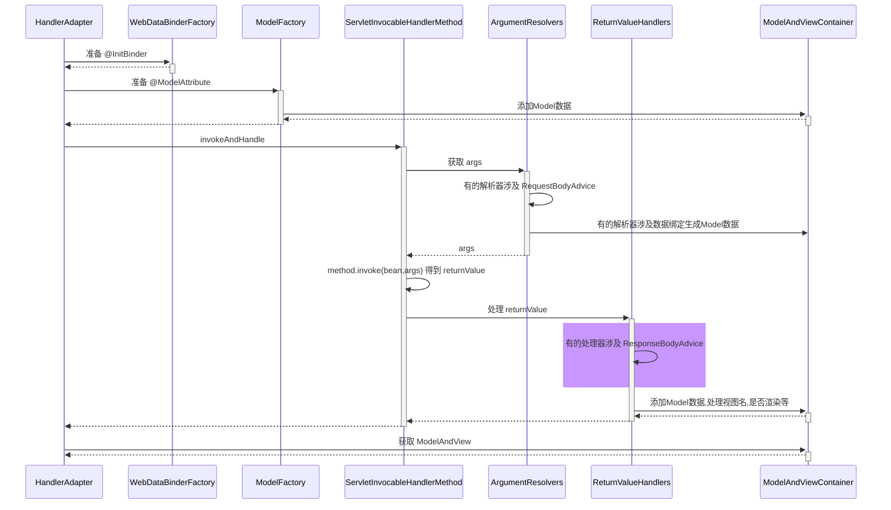

#### 收获💡

1. ResponseBodyAdvice 返回响应体前包装


### 30) 异常解析器

#### 演示 - ExceptionHandlerExceptionResolver

##### 代码参考

**com.itheima.a30.A30**

```java
// 它能够重用参数解析器、返回值处理器
ExceptionHandlerExceptionResolver resolver = new ExceptionHandlerExceptionResolver();
// 设置消息转换器
resolver.setMessageConverters(Arrays.asList(new MappingJackson2HttpMessageConverter()));
// 添加默认转换解析器 `getDefaultArgumentResolvers();`
resolver.afterPropertiesSet();

Controller2 c2 = new Controller2();

HandlerMethod handlerMethod = new HandlerMethod(c2, c2.getClass().getMethod("foo"));
MockHttpServletRequest request = new MockHttpServletRequest();
MockHttpServletResponse response = new MockHttpServletResponse();
ModelAndView mv = resolver.resolveException(request, response, handlerMethod, new ArithmeticException("1\0"));

System.out.println(mv);
System.out.println(response.getContentAsString());
```


#### 收获💡

1. 它能够重用参数解析器、返回值处理器，实现组件重用

2. 它能够支持嵌套异常 

   1. 底层捕获异常之后 会一直查找异常来源 排成一个数组

   ```java
   Throwable exToExpose = exception;
   // 一直循环找y
   while (exToExpose != null) {
       exceptions.add(exToExpose);
       Throwable cause = exToExpose.getCause();
       exToExpose = (cause != exToExpose ? cause : null);
   }
   Object[] arguments = new Object[exceptions.size() + 1];
   exceptions.toArray(arguments);  // efficient arraycopy call in ArrayList
   arguments[arguments.length - 1] = handlerMethod;
   exceptionHandlerMethod.invokeAndHandle(webRequest, mavContainer, arguments);
   ```

   


### 31) @ControllerAdvice 之 @ExceptionHandler

#### 演示 - 准备 @ExceptionHandler

##### 代码参考

**com.itheima.a31** 包

```java
AnnotationConfigApplicationContext context = new AnnotationConfigApplicationContext(WebConfig.class);
ExceptionHandlerExceptionResolver resolver = context.getBean(ExceptionHandlerExceptionResolver.class);

Test2.Controller2 c2 = new Test2.Controller2();

HandlerMethod handlerMethod = new HandlerMethod(c2, c2.getClass().getMethod("foo"));
MockHttpServletRequest request = new MockHttpServletRequest();
MockHttpServletResponse response = new MockHttpServletResponse();
ModelAndView mv = resolver.resolveException(request, response, handlerMethod, new ArithmeticException("1\0"));
// 容器会默认调用afterPropertiesSet 初始化
```


#### 收获💡

1. ExceptionHandlerExceptionResolver 初始化时会解析 @ControllerAdvice 中的 @ExceptionHandler 方法

   1. ```java
      List<ControllerAdviceBean> adviceBeans = ControllerAdviceBean.findAnnotatedBeans(getApplicationContext());
      for (ControllerAdviceBean adviceBean : adviceBeans) {
          Class<?> beanType = adviceBean.getBeanType();
          if (beanType == null) {
              throw new IllegalStateException("Unresolvable type for ControllerAdviceBean: " + adviceBean);
          }
          ExceptionHandlerMethodResolver resolver = new ExceptionHandlerMethodResolver(beanType);
          if (resolver.hasExceptionMappings()) {
              this.exceptionHandlerAdviceCache.put(adviceBean, resolver);
          }
          if (ResponseBodyAdvice.class.isAssignableFrom(beanType)) {
              this.responseBodyAdvice.add(adviceBean);
          }
      }
      ```

2. ExceptionHandlerExceptionResolver 会以类为单位，在该类首次处理异常时，解析此类的 @ExceptionHandler 方法

3. 以上两种 @ExceptionHandler 的解析结果都会缓存来避免重复解析

4. ```java
   RequestMappingHandlerAdapter的`afterPropertiesSet`
       
   for (ControllerAdviceBean adviceBean : adviceBeans) {
           Class<?> beanType = adviceBean.getBeanType();
           if (beanType == null) {
               throw new IllegalStateException("Unresolvable type for ControllerAdviceBean: " );
           }
           Set<Method> attrMethods = MethodIntrospector.selectMethods(beanType, MODEL_ATTRIBUTE_METHODS);
           if (!attrMethods.isEmpty()) {
               this.modelAttributeAdviceCache.put(adviceBean, attrMethods);
           }
           Set<Method> binderMethods = MethodIntrospector.selectMethods(beanType, INIT_BINDER_METHODS);
       	// 对initBinder
           if (!binderMethods.isEmpty()) {
               this.initBinderAdviceCache.put(adviceBean, binderMethods);
           }
       	// 实现了ResponseBodyAdvice的ControllerAdvice 的注解增强类
           if (RequestBodyAdvice.class.isAssignableFrom(beanType) || 					ResponseBodyAdvice.class.isAssignableFrom(beanType)) {
               requestResponseBodyAdviceBeans.add(adviceBean);
           }
       }
   ```

5. 


### 32) Tomcat 异常处理

* 我们知道 @ExceptionHandler 只能处理发生在 mvc 流程中的异常，例如控制器内、拦截器内，那么如果是 Filter 出现了异常，如何进行处理呢？
* 
* 在 Spring Boot 中，是这么实现的：
  1. 因为内嵌了 Tomcat 容器，因此可以配置 Tomcat 的错误页面，Filter 与 错误页面之间是通过请求转发跳转的，可以在这里做手脚
  2. 先通过 ErrorPageRegistrarBeanPostProcessor 这个后处理器配置错误页面地址，默认为 `/error` 也可以通过 `${server.error.path}` 进行配置
  3. 当 Filter 发生异常时，不会走 Spring 流程，但会走 Tomcat 的错误处理，于是就希望转发至 `/error` 这个地址
     * 当然，如果没有 @ExceptionHandler，那么最终也会走到 Tomcat 的错误处理
  4. Spring Boot 又提供了一个 BasicErrorController，它就是一个标准 @Controller，@RequestMapping 配置为 `/error`，所以处理异常的职责就又回到了 Spring
  5. 异常信息由于会被 Tomcat 放入 request 作用域，因此 BasicErrorController 里也能获取到
  6. 具体异常信息会由 DefaultErrorAttributes 封装好
  7. BasicErrorController 通过 Accept 头判断需要生成哪种 MediaType 的响应
     * 如果要的不是 text/html，走 MessageConverter 流程
     * 如果需要 text/html，走 mvc 流程，此时又分两种情况
       * 配置了 ErrorViewResolver，根据状态码去找 View
       * 没配置或没找到，用 BeanNameViewResolver 根据一个固定为 error 的名字找到 View，即所谓的 WhitelabelErrorView

> ***评价***
>
> * 一个错误处理搞得这么复杂，就问恶心不？


#### 演示1 - 错误页处理

##### 关键代码

```java
@Bean // ⬅️修改了 Tomcat 服务器默认错误地址, 出错时使用请求转发方式跳转
public ErrorPageRegistrar errorPageRegistrar() {
    return webServerFactory -> webServerFactory.addErrorPages(new ErrorPage("/error"));
}

@Bean // ⬅️TomcatServletWebServerFactory 初始化前用它增强, 注册所有 ErrorPageRegistrar
public ErrorPageRegistrarBeanPostProcessor errorPageRegistrarBeanPostProcessor() {
    return new ErrorPageRegistrarBeanPostProcessor();
}
```

```java
@Configuration
public class WebConfig {

    @Bean
    public RequestMappingHandlerMapping requestMappingHandlerMapping(){
        return new RequestMappingHandlerMapping();
    }

    @Bean
    public RequestMappingHandlerAdapter requestMappingHandlerAdapter(){
        RequestMappingHandlerAdapter adapter = new RequestMappingHandlerAdapter();
        adapter.setMessageConverters(Arrays.asList(new MappingJackson2HttpMessageConverter()));
        return adapter;
    }

    @Bean
    public DispatcherServlet dispatcherServlet(){
        return new DispatcherServlet();
    }

    @Bean
    public TomcatServletWebServerFactory tomcatServletWebServerFactory(){
        return new TomcatServletWebServerFactory();
    }

    @Bean
    public DispatcherServletRegistrationBean registrationBean(DispatcherServlet servlet){
        return new DispatcherServletRegistrationBean(servlet,"/");
    }

    // SpringBoot提供
    @Bean
    public ErrorPageRegistrar errorPageRegistrar(){
        // ErrorPageRegistry 接口继承关系就是ServletWebServerFactory
        // 传递过来是 TomcatServletWebServerFactory
        return webServerFactory -> webServerFactory.addErrorPages(new ErrorPage("/error"));
    }

    @Bean
    public ErrorPageRegistrarBeanPostProcessor processor(){
        return new ErrorPageRegistrarBeanPostProcessor();
    }
    @Bean
    public BasicErrorController basicErrorController(){
        ErrorProperties errorProperties = new ErrorProperties();
        errorProperties.setIncludeException(true);// 显示错误类型
        return new BasicErrorController(new DefaultErrorAttributes(), errorProperties);
    }

    @Bean // 名字必须叫 `error`
    public View error(){
        return (model, request, response) -> {
            response.setContentType("text/html;charset=utf-8");
            response.setStatus(200);
            response.getWriter().println("<h3>服务器内部错误</h3>");
        };
    }
    // 视图解析器
    @Bean
    public ViewResolver viewResolver(){
        // 根据控制器名对应视图名
        return new BeanNameViewResolver();
    }

    @Controller
    public static class MyController{
        @RequestMapping("/test")
        public ModelAndView modelAndView(){
            int i = 10/0;
            return null;
        }

        @ResponseBody
        //@RequestMapping("error")
        public Map<String, Object> error(HttpServletRequest request){
            Throwable throwable = (Throwable) request.getAttribute(RequestDispatcher.ERROR_EXCEPTION);
            return Collections.singletonMap("error",throwable.getMessage());
        }

    }

}
```


#### 收获💡

1. Tomcat 的错误页处理手段


#### 演示2 - BasicErrorController

```java
@Controller
// 没配置就是 /error 路径
@RequestMapping("${server.error.path:${error.path:/error}}")
public class BasicErrorController extends AbstractErrorController {
```

##### 关键代码

```java
@Bean // ⬅️ErrorProperties 封装环境键值, ErrorAttributes 控制有哪些错误信息
public BasicErrorController basicErrorController() {
    ErrorProperties errorProperties = new ErrorProperties();
    errorProperties.setIncludeException(true);
    return new BasicErrorController(new DefaultErrorAttributes(), errorProperties);
}

@Bean // ⬅️名称为 error 的视图, 作为 BasicErrorController 的 text/html 响应结果
public View error() {
    return new View() {
        @Override
        public void render(
            Map<String, ?> model, 
            HttpServletRequest request, 
            HttpServletResponse response
        ) throws Exception {
            System.out.println(model);
            response.setContentType("text/html;charset=utf-8");
            response.getWriter().print("""
                    <h3>服务器内部错误</h3>
                    """);
        }
    };
}

@Bean // ⬅️收集容器中所有 View 对象, bean 的名字作为视图名
public ViewResolver viewResolver() {
    return new BeanNameViewResolver();
}
```

#### 收获💡

1. Spring Boot 中 BasicErrorController 如何工作


### 33) BeanNameUrlHandlerMapping 与 SimpleControllerHandlerAdapter

```
RequestMappingHandlerMapping // 路径映射 解析@RequestMapping以及派生注解
RequestMappingHandlerAdapter // 调用控制器方法 解析参数 处理返回值
```

**注意：WebConfig类中 包含 `DispathServlet`   `Tomcat`  `Register`**

#### 演示 - 本组映射器和适配器

##### 关键代码

```java
@Bean
public BeanNameUrlHandlerMapping beanNameUrlHandlerMapping() {
    return new BeanNameUrlHandlerMapping();
}

@Bean
public SimpleControllerHandlerAdapter simpleControllerHandlerAdapter() {
    return new SimpleControllerHandlerAdapter();
}

@Bean("/c3")
public Controller controller3() {
    return (request, response) -> {
        response.getWriter().print("this is c3");
        return null;
    };
}
```

#### 收获💡

1. BeanNameUrlHandlerMapping，以 / 开头的 bean 的名字会被当作映射路径
2. 这些 bean 本身当作 handler，要求实现 Controller 接口
3. SimpleControllerHandlerAdapter，调用 handler
4. 模拟实现这组映射器和适配器

##### 模拟实现

```java
/**
 * 只是实现简单的调用 没有参数与返回值处理
 */

@Component("/c1")
public static class MyController implements Controller {
    @Override
    public ModelAndView handleRequest(HttpServletRequest request, HttpServletResponse response) throws Exception {
        response.getWriter().println("Hello");
        return null;
    }
}

@Component
public static class MyHandlerMapping implements HandlerMapping {
    private Map<String, Controller> urlMap;

    @Autowired
    private ApplicationContext context;

    @Override
    public HandlerExecutionChain getHandler(HttpServletRequest request) throws Exception {
        String key = request.getRequestURI();
        Controller controller = urlMap.get(key);
        if (controller == null) {
            return null;
        }// 包装为执行链
        return new HandlerExecutionChain(controller);
    }

    @PostConstruct
    public void init() {
        // 收集容器中所有实现了Controller的Bean 根据名称添加加路径
        urlMap = context.getBeansOfType(Controller.class).entrySet()
                .stream().filter(e -> e.getKey().startsWith("/"))
                .collect(Collectors.toMap(Map.Entry::getKey, Map.Entry::getValue));
        System.out.println(urlMap);
    }
}

@Component
public static class MyControllerHandlerAdapter implements HandlerAdapter {

    @Override
    public boolean supports(Object handler) {
        // 判断是否实现Controller接口
        return handler instanceof Controller;
    }

    @Override // HandlerAdapter 使用给定的处理程序来处理这个请求。所需的工作流程可能会有很大差异
    public ModelAndView handle(HttpServletRequest request, HttpServletResponse response, Object handler) throws Exception {
        if (handler instanceof Controller) {
            Controller controller = (Controller) handler;
            return controller.handleRequest(request, response);
        }
        return null;
    }

    @Override // 过时方法
    public long getLastModified(HttpServletRequest request, Object handler) {
        return -1;
    }
}
```


### 34) RouterFunctionMapping 与 HandlerFunctionAdapter

#### 演示 - 本组映射器和适配器

##### 关键代码

```java
@Bean
public RouterFunctionMapping routerFunctionMapping() {
    return new RouterFunctionMapping();
}

@Bean
public HandlerFunctionAdapter handlerFunctionAdapter() {
    return new HandlerFunctionAdapter();
}

@Bean
public RouterFunction<ServerResponse> r1() {
    //           ⬇️映射条件   ⬇️handler
    return route(GET("/r1"), request -> ok().body("this is r1"));
}
```

#### 收获💡

1. RouterFunctionMapping, 通过 RequestPredicate 条件映射
2. handler 要实现 HandlerFunction 接口
3. HandlerFunctionAdapter, 调用 handler


### 35) SimpleUrlHandlerMapping 与 HttpRequestHandlerAdapter

#### 演示1 - 本组映射器和适配器

##### 代码参考

**org.springframework.boot.autoconfigure.web.servlet.A35**

##### 关键代码

```java
@Bean
public SimpleUrlHandlerMapping simpleUrlHandlerMapping(ApplicationContext context) {
    SimpleUrlHandlerMapping handlerMapping = new SimpleUrlHandlerMapping();
    Map<String, ResourceHttpRequestHandler> map 
        = context.getBeansOfType(ResourceHttpRequestHandler.class);
    handlerMapping.setUrlMap(map);
    return handlerMapping;
}

@Bean
public HttpRequestHandlerAdapter httpRequestHandlerAdapter() {
    return new HttpRequestHandlerAdapter();
}

@Bean("/**")
public ResourceHttpRequestHandler handler1() {
    ResourceHttpRequestHandler handler = new ResourceHttpRequestHandler();
    handler.setLocations(List.of(new ClassPathResource("static/")));
    return handler;
}

@Bean("/img/**")
public ResourceHttpRequestHandler handler2() {
    ResourceHttpRequestHandler handler = new ResourceHttpRequestHandler();
    handler.setLocations(List.of(new ClassPathResource("images/")));
    return handler;
}
```

#### 收获💡

1. SimpleUrlHandlerMapping 不会在初始化时收集映射信息，需要手动收集
2. SimpleUrlHandlerMapping 映射路径
3. ResourceHttpRequestHandler 作为静态资源 handler
4. HttpRequestHandlerAdapter, 调用此 handler


#### 演示2 - 静态资源解析优化

##### 关键代码

```java
@Bean("/**")
public ResourceHttpRequestHandler handler1() {
    ResourceHttpRequestHandler handler = new ResourceHttpRequestHandler();
    handler.setLocations(List.of(new ClassPathResource("static/")));
    handler.setResourceResolvers(List.of(
        	// ⬇️缓存优化
            new CachingResourceResolver(new ConcurrentMapCache("cache1")),
        	// ⬇️压缩优化
            new EncodedResourceResolver(),
        	// ⬇️原始资源解析
            new PathResourceResolver()
    ));
    return handler;
}
```

#### 收获💡

1. 责任链模式体现
2. 压缩文件需要手动生成


#### 演示3 - 欢迎页

##### 关键代码

```java
@Bean
public WelcomePageHandlerMapping welcomePageHandlerMapping(ApplicationContext context) {
    Resource resource = context.getResource("classpath:static/index.html");
    return new WelcomePageHandlerMapping(null, context, resource, "/**");
}

@Bean
public SimpleControllerHandlerAdapter simpleControllerHandlerAdapter() {
    return new SimpleControllerHandlerAdapter();
}
```

#### 收获💡

1. 欢迎页支持静态欢迎页与动态欢迎页
2. WelcomePageHandlerMapping 映射欢迎页（即只映射 '/'）
   * 它内置的 handler ParameterizableViewController 作用是不执行逻辑，仅根据视图名找视图
   * 视图名固定为 forward:index.html
3. SimpleControllerHandlerAdapter, 调用 handler
   * 转发至 /index.html
   * 处理 /index.html 又会走上面的静态资源处理流程


#### 映射器与适配器小结

1. HandlerMapping 负责建立请求与控制器之间的映射关系
   * RequestMappingHandlerMapping (与 @RequestMapping 匹配)
   * WelcomePageHandlerMapping    (/)
   * BeanNameUrlHandlerMapping    (与 bean 的名字匹配 以 / 开头)
   * RouterFunctionMapping        (函数式 RequestPredicate, HandlerFunction)
   * SimpleUrlHandlerMapping      (静态资源 通配符 /** /img/**)
   * 之间也会有顺序问题, boot 中默认顺序如上
2. HandlerAdapter 负责实现对各种各样的 handler 的适配调用
   * RequestMappingHandlerAdapter 处理：@RequestMapping 方法
     * 参数解析器、返回值处理器体现了组合模式
   * SimpleControllerHandlerAdapter 处理：Controller 接口
   * HandlerFunctionAdapter 处理：HandlerFunction 函数式接口
   * HttpRequestHandlerAdapter 处理：HttpRequestHandler 接口 (静态资源处理)
   * 这也是典型适配器模式体现


### 36) mvc 处理流程

当浏览器发送一个请求 `http://localhost:8080/hello` 后，请求到达服务器，其处理流程是：

1. 服务器提供了 DispatcherServlet，它使用的是标准 Servlet 技术

   * 路径：默认映射路径为 `/`，即会匹配到所有请求 URL，可作为请求的统一入口，也被称之为**前控制器**
     * jsp 不会匹配到 DispatcherServlet
     * 其它有路径的 Servlet 匹配优先级也高于 DispatcherServlet
   * 创建：在 Boot 中，由 DispatcherServletAutoConfiguration 这个自动配置类提供 DispatcherServlet 的 bean
   * 初始化：DispatcherServlet 初始化时会优先到容器里寻找各种组件，作为它的成员变量
     * HandlerMapping，初始化时记录映射关系
     * HandlerAdapter，初始化时准备参数解析器、返回值处理器、消息转换器
     * HandlerExceptionResolver，初始化时准备参数解析器、返回值处理器、消息转换器
     * ViewResolver
2. DispatcherServlet 会利用 RequestMappingHandlerMapping 查找控制器方法

   * 例如根据 /hello 路径找到 @RequestMapping("/hello") 对应的控制器方法

   * 控制器方法会被封装为 HandlerMethod 对象，并结合匹配到的拦截器一起返回给 DispatcherServlet 

   * HandlerMethod 和拦截器合在一起称为 HandlerExecutionChain（调用链）对象
3. DispatcherServlet 接下来会：

   1. 调用拦截器的 preHandle 方法
   2. RequestMappingHandlerAdapter 调用 handle 方法，准备数据绑定工厂、模型工厂、ModelAndViewContainer、将 HandlerMethod 完善为 ServletInvocableHandlerMethod
      * @ControllerAdvice 全局增强点1️⃣：补充模型数据
      * @ControllerAdvice 全局增强点2️⃣：补充自定义类型转换器
      * 使用 HandlerMethodArgumentResolver 准备参数
        * @ControllerAdvice 全局增强点3️⃣：RequestBody 增强
      * 调用 ServletInvocableHandlerMethod 
      * 使用 HandlerMethodReturnValueHandler 处理返回值
        * @ControllerAdvice 全局增强点4️⃣：ResponseBody 增强
      * 根据 ModelAndViewContainer 获取 ModelAndView
        * 如果返回的 ModelAndView 为 null，不走第 4 步视图解析及渲染流程
          * 例如，有的返回值处理器调用了 HttpMessageConverter 来将结果转换为 JSON，这时 ModelAndView 就为 null
        * 如果返回的 ModelAndView 不为 null，会在第 4 步走视图解析及渲染流程
   3. 调用拦截器的 postHandle 方法
   4. 处理异常或视图渲染
      * 如果 1~3 出现异常，走 ExceptionHandlerExceptionResolver 处理异常流程
        * @ControllerAdvice 全局增强点5️⃣：@ExceptionHandler 异常处理
      * 正常，走视图解析及渲染流程
   5. 调用拦截器的 afterCompletion 方法


## Boot

### 37) Boot 骨架项目

如果是 linux 环境，用以下命令即可获取 spring boot 的骨架 pom.xml

```shell
curl -G https://start.spring.io/pom.xml -d dependencies=web,mysql,mybatis -o pom.xml
```

也可以使用 Postman 等工具实现

若想获取更多用法，请参考

```shell
curl https://start.spring.io
```


### 38) Boot War项目

步骤1：创建模块，区别在于打包方式选择 war


接下来勾选 Spring Web 支持


步骤2：编写控制器

```java
@Controller
public class MyController {

    @RequestMapping("/hello")
    public String abc() {
        System.out.println("进入了控制器");
        return "hello";
    }
}
```

步骤3：编写 jsp 视图，新建 webapp 目录和一个 hello.jsp 文件，注意文件名与控制器方法返回的视图逻辑名一致

```
src
	|- main
		|- java
		|- resources
		|- webapp
			|- hello.jsp
```

步骤4：配置视图路径，打开 application.properties 文件

```properties
spring.mvc.view.prefix=/
spring.mvc.view.suffix=.jsp
```

> 将来 prefix + 控制器方法返回值 + suffix 即为视图完整路径


#### 测试

如果用 mvn 插件 `mvn spring-boot:run` 或 main 方法测试

* 必须添加如下依赖，因为此时用的还是内嵌 tomcat，而内嵌 tomcat 默认不带 jasper（用来解析 jsp）

```xml
<dependency>
    <groupId>org.apache.tomcat.embed</groupId>
    <artifactId>tomcat-embed-jasper</artifactId>
    <scope>provided</scope>
</dependency>
```

也可以使用 Idea 配置 tomcat 来测试，此时用的是外置 tomcat

* 骨架生成的代码中，多了一个 ServletInitializer，它的作用就是配置外置 Tomcat 使用的，在外置 Tomcat 启动后，去调用它创建和运行 SpringApplication


#### 启示

对于 jar 项目，若要支持 jsp，也可以在加入 jasper 依赖的前提下，把 jsp 文件置入 `META-INF/resources` 


### 39) Boot 启动过程

阶段一：SpringApplication 构造

1. 记录 BeanDefinition 源
2. 推断应用类型
3. 记录 ApplicationContext 初始化器
4. 记录监听器
5. 推断主启动类

阶段二：执行 run 方法

1. 得到 SpringApplicationRunListeners，名字取得不好，实际是事件发布器

   * 发布 application starting 事件1️⃣

2. 封装启动 args // 选项参数(--命令行)与非选项参数

3. 准备 Environment 添加命令行(args)参数（*） // 根据环境

4. ConfigurationPropertySources 处理（*）

   1. ```java
      // 名字 - _ 驼峰  适配
      // ConfigurationPropertySources.attach(env);
      ```

   2. 发布 application environment 已准备事件2️⃣ 回调第五

5. 通过 EnvironmentPostProcessorApplicationListener 进行 env 后处理（*）
   * application.properties，由 StandardConfigDataLocationResolver 解析
   * spring.application.json

6. 绑定 spring.main 到 SpringApplication 对象（*）

7. 打印 banner（*）

8. 创建容器 // 根据当前类型

9. 准备容器

   * 发布 application context 已初始化事件3️⃣

10. 加载 bean 定义

    * 发布 application prepared 事件4️⃣

11. refresh 容器

    * 发布 application started 事件5️⃣

12. 执行 runner

    * 发布 application ready 事件6️⃣

    * 这其中有异常，发布 application failed 事件7️⃣

> 带 * 的有独立的示例

#### 演示 - 启动过程

**com.itheima.a39.A39_1** 对应 SpringApplication 构造

**com.itheima.a39.A39_2** 对应第1步，并演示 7 个事件

**com.itheima.a39.A39_3** 对应第2、8到12步

**org.springframework.boot.Step3**

**org.springframework.boot.Step4**

**org.springframework.boot.Step5**

**org.springframework.boot.Step6**

**org.springframework.boot.Step7**

#### 收获💡

1. SpringApplication 构造方法中所做的操作
   * 可以有多种源用来加载 bean 定义
   * 应用类型推断
   * 添加容器初始化器
   * 添加监听器
   * 演示主类推断
2. 如何读取 spring.factories 中的配置
3. 从配置中获取重要的事件发布器：SpringApplicationRunListeners
4. 容器的创建、初始化器增强、加载 bean 定义等
5. CommandLineRunner、ApplicationRunner 的作用
6. 环境对象
   1. 命令行 PropertySource
   2. ConfigurationPropertySources 规范环境键名称
   3. EnvironmentPostProcessor 后处理增强
      * 由 EventPublishingRunListener 通过监听事件2️⃣来调用
   4. 绑定 spring.main 前缀的 key value 至 SpringApplication
7. Banner 


#### 源代码

##### 1. 类型推断

```java
// SpringAppllication构造
this.webApplicationType = WebApplicationType.deduceFromClasspath();
// WebApplicationType.deduceFromClasspath();

static WebApplicationType deduceFromClasspath() {
    if (ClassUtils.isPresent(WEBFLUX_INDICATOR_CLASS, null) && !ClassUtils.isPresent(WEBMVC_INDICATOR_CLASS, null)
        && !ClassUtils.isPresent(JERSEY_INDICATOR_CLASS, null)) {
        return WebApplicationType.REACTIVE;
    }
    for (String className : SERVLET_INDICATOR_CLASSES) {
        if (!ClassUtils.isPresent(className, null)) {
            return WebApplicationType.NONE;
        }
    }
    return WebApplicationType.SERVLET;
}
```

##### 2. SpringApplication构造

```java
/**
*  这里演示构造方法内部的一些步骤
*/
SpringApplication springApplication = new SpringApplication(Main1.class);
// 1. 获取Bean Definition 源
// 2. 根据反射获取类型推断结果
Method deduceFromClasspath = WebApplicationType.class.getDeclaredMethod("deduceFromClasspath");
deduceFromClasspath.setAccessible(true);
Object invoke = deduceFromClasspath.invoke(null);
System.out.println(invoke);// SERVLET

// 3. 初始化器 此时容器尚未refresh
springApplication.addInitializers(applicationContext -> {
    if (applicationContext instanceof GenericApplicationContext gac) {
        gac.registerBean("bean3", Bean3.class);
    }
});
// 4. 添加监听器 springApplication.run(args) 中产生的事件就会回调这里的事件
springApplication.addListeners(new ApplicationListener<ApplicationEvent>() {
    @Override
    public void onApplicationEvent(ApplicationEvent event) {
        System.out.println("监听的事件为："+event.getClass());
    }
});
// 5. 主类推断
Method deduceMainApplicationClass = SpringApplication.class.getDeclaredMethod("deduceMainApplicationClass");
deduceMainApplicationClass.setAccessible(true);
Object deduceMain = deduceMainApplicationClass.invoke(springApplication);
System.out.println("主类推断为："+deduceMain);

ConfigurableApplicationContext context = springApplication.run(args);

for (String name : context.getBeanDefinitionNames()) {
    // 查看Bean来源
    String description = context.getBeanFactory().getBeanDefinition(name).getResourceDescription();
    System.out.println(name+" : "+description);
}
context.close();


@Bean
public Bean1 bean1(){
    return new Bean1();
}

/**
 *  SpringBoot的类型推断
 *  根据pom jar 包 会选择 ServletWebServerApplicationContext的实现
 *  依赖于 ServletWebServerFactory
 * @return
 */
@Bean
public TomcatServletWebServerFactory tomcatServletWebServerFactory(){
    return new TomcatServletWebServerFactory();
}
```

##### 3.  SpringApplicationRunListener

```java
public static void main(String[] args) {
    SpringApplication springApplication = new SpringApplication();

    springApplication.addListeners(event -> {
        System.out.println(event.getClass());
    });

    // 加载FactoriesLoader文件
    // 使用给定的类加载器从"META-INF/spring.factories"加载给定类型的工厂实现的完全限定类名。
    List<String> factoryNames = SpringFactoriesLoader
            .loadFactoryNames(SpringApplicationRunListener.class, Main2.class.getClassLoader());

    factoryNames.forEach(factoryName->{
        try {
            Class<?> clazz = Class.forName(factoryName);
            Constructor<?> constructor = clazz.getConstructor(SpringApplication.class, String[].class);
            // 实际上是一个发布器
            SpringApplicationRunListener publisher =
                            (SpringApplicationRunListener)constructor.newInstance(springApplication, args);
            DefaultBootstrapContext bootstrapContext = new DefaultBootstrapContext();
            // 开始启动
            publisher.starting(bootstrapContext);
            // 环境信息准备完毕
            publisher.environmentPrepared(bootstrapContext,new StandardEnvironment());

            GenericApplicationContext context = new GenericApplicationContext();
            // spring容器创建 并调用初始化器之后发送此事件
            publisher.contextPrepared(context);
            // 所有Bean Definition 加载完毕
            publisher.contextLoaded(context);
            context.refresh();
            // spring容器初始化 (refresh) 完成
            publisher.started(context);
            // 启动完毕
            publisher.running(context);
            publisher.failed(context,new RuntimeException("出错")); // 容器启动出错
        } catch (ClassNotFoundException | NoSuchMethodException | InvocationTargetException |
                 InstantiationException | IllegalAccessException e) {
                throw new RuntimeException(e);
        }
    });
}
```

##### 4. 部分流程

```java
SpringApplication springApplication = new SpringApplication();

// 添加ApplicationContextInitializer以应用于 SpringApplicationContext
springApplication.addInitializers(applicationContext -> {
    // applicationContext在第八步才能创建好 第九部回调
    System.out.println("\t执行初始化...");
});

// 2. 封装args
// 8. 创建容器
GenericApplicationContext context =
    createApplicationContext(WebApplicationType.SERVLET);

// 9. 准备容器
for (ApplicationContextInitializer initializer : springApplication.getInitializers()) {
    initializer.initialize(context);
}
// 10. 加载Bean定义
// 设置读到的BeanDfinds存在哪里
DefaultListableBeanFactory beanFactory = context.getDefaultListableBeanFactory();
AnnotatedBeanDefinitionReader reader =
    new AnnotatedBeanDefinitionReader(beanFactory);
reader.register(Config.class);
ClassPathBeanDefinitionScanner scanner = new ClassPathBeanDefinitionScanner(beanFactory);
scanner.scan("test.sub");

// 11. refresh
context.refresh();
Arrays.asList(context.getBeanDefinitionNames()).forEach(name->{
    System.out.println(name+"\t"+context.getBeanFactory().getBeanDefinition(name).getResourceDescription());
});
// 12. 执行runner 自定义预加载，测试
// ApplicationRunner接收封装的ApplicationArguments对象
// CommandLineRunner接收args参数
DefaultApplicationArguments arguments = new DefaultApplicationArguments(args);
// 提前注册到Bean
Map<String, ApplicationRunner> runnerMap = context.getBeansOfType(ApplicationRunner.class);
Map<String, CommandLineRunner> commandRunnerMap = context.getBeansOfType(CommandLineRunner.class);
for (ApplicationRunner runner : runnerMap.values()) {
    runner.run(arguments);
}
for (CommandLineRunner lineRunner : commandRunnerMap.values()) {
    lineRunner.run(args);
}


private static GenericApplicationContext createApplicationContext(WebApplicationType type) {
    GenericApplicationContext context = null;
    switch (type) {
        case SERVLET -> context = new AnnotationConfigServletWebServerApplicationContext();
        case REACTIVE -> context = new AnnotationConfigReactiveWebServerApplicationContext();
        case NONE -> context = new AnnotationConfigApplicationContext();
    }
    return context;
}

```

##### 5. 环境变量

```java
// 
SpringApplication springApplication = new SpringApplication();
// 注意 建包 org.springframework.boot
ApplicationEnvironment env = new ApplicationEnvironment();
// 配置文件
// env.getPropertySources().addFirst(new ResourcePropertySource("properties",new ClassPathResource("application.properties")));
// 命令行
env.getPropertySources().addFirst(new SimpleCommandLinePropertySource(args));
// 名字 - _ 驼峰  适配
// ConfigurationPropertySources.attach(env);
env.getPropertySources().forEach(System.out::println);

System.out.println("<=============增强后==============>");
// 添加了class path resource [application.properties]
// class path resource [application.yaml]
ConfigDataEnvironmentPostProcessor environmentPostProcessor =
        new ConfigDataEnvironmentPostProcessor(new DeferredLogs(), new DefaultBootstrapContext());
environmentPostProcessor.postProcessEnvironment(env,springApplication);
env.getPropertySources().forEach(System.out::println);

System.out.println(env.getProperty("server.port"));
```


```java
// 模拟第五步
// List<String> factoryNames = SpringFactoriesLoader.loadFactoryNames(EnvironmentPostProcessor.class,
//         Main1.class.getClassLoader());
// factoryNames.forEach(System.out::println);
SpringApplication app = new SpringApplication();
// 添加监听器     // 这个监听器也是可以在配置文件 后处理增强监听器
app.addListeners(new EnvironmentPostProcessorApplicationListener());

// 设置一个发布器 同样也可以从配置文件获取SpringApplicationRunListener接口的子类
EventPublishingRunListener publishingRunListener = new EventPublishingRunListener(app, args);


// 这个发布的事件会被 EnvironmentPostProcessorApplicationListener 监听到
/**
 *  事件发布之后 由添加的监听器根据配置文件找到所有的后置处理器添加
 *  完成增强
 */
ApplicationEnvironment environment = new ApplicationEnvironment();

environment.getPropertySources().forEach(System.out::println);
System.out.println("<++++++增强后++++++>");
publishingRunListener.environmentPrepared(new DefaultBootstrapContext(),environment);
environment.getPropertySources().forEach(System.out::println);
```


##### 6. Spring.main Binder

```java
SpringApplication app = new SpringApplication();
ApplicationEnvironment environment = new ApplicationEnvironment();
/**
 * spring.main.banner-mode=off
 * spring.main.lazy-initialization=true
 */
environment.getPropertySources()
        .addFirst(new ResourcePropertySource(new ClassPathResource("step6.properties")));
Binder.get(environment).bind("spring.main",Bindable.ofInstance(app));

Field initialization = SpringApplication.class.getDeclaredField("lazyInitialization");
Field bannerMode = SpringApplication.class.getDeclaredField("bannerMode");
initialization.setAccessible(true);
bannerMode.setAccessible(true);
System.out.println(initialization.get(app));// true
System.out.println(bannerMode.get(app)); // OFF
```

#### 图片


run


> 发布


### 40) Tomcat 内嵌容器

Tomcat 基本结构

```
Server
└───Service
    ├───Connector (协议, 端口)
    └───Engine
        └───Host(虚拟主机 localhost)
            ├───Context1 (应用1, 可以设置虚拟路径, / 即 url 起始路径; 项目磁盘路径, 即 docBase )
            │   │   index.html
            │   └───WEB-INF
            │       │   web.xml (servlet, filter, listener) 3.0
            │       ├───classes (servlet, controller, service ...)
            │       ├───jsp
            │       └───lib (第三方 jar 包)
            └───Context2 (应用2)
                │   index.html
                └───WEB-INF
                        web.xml
```

#### 演示1 - Tomcat 内嵌容器

##### 关键代码

```java
public static void main(String[] args) throws LifecycleException, IOException {
    // 1.创建 Tomcat 对象
    Tomcat tomcat = new Tomcat();
    tomcat.setBaseDir("tomcat");

    // 2.创建项目文件夹, 即 docBase 文件夹
    File docBase = Files.createTempDirectory("boot.").toFile();
    docBase.deleteOnExit();

    // 3.创建 Tomcat 项目, 在 Tomcat 中称为 Context
    Context context = tomcat.addContext("", docBase.getAbsolutePath());

    // 4.编程添加 Servlet
    context.addServletContainerInitializer(new ServletContainerInitializer() {
        @Override
        public void onStartup(Set<Class<?>> c, ServletContext ctx) throws ServletException {
            HelloServlet helloServlet = new HelloServlet();
            ctx.addServlet("aaa", helloServlet).addMapping("/hello");
        }
    }, Collections.emptySet());

    // 5.启动 Tomcat
    tomcat.start();

    // 6.创建连接器, 设置监听端口
    Connector connector = new Connector(new Http11Nio2Protocol());
    connector.setPort(8080);
    tomcat.setConnector(connector);
}
```


#### 演示2 - 集成 Spring 容器

##### 关键代码

```java
WebApplicationContext springContext = getApplicationContext();

// 4.编程添加 Servlet
context.addServletContainerInitializer(new ServletContainerInitializer() {
    @Override
    public void onStartup(Set<Class<?>> c, ServletContext ctx) throws ServletException {
        // ⬇️通过 ServletRegistrationBean 添加 DispatcherServlet 等
        for (ServletRegistrationBean registrationBean : 
             springContext.getBeansOfType(ServletRegistrationBean.class).values()) {
            registrationBean.onStartup(ctx);
        }
    }
}, Collections.emptySet());
```

##### 全代码

```java
// 1. 创建对象
Tomcat tomcat = new Tomcat();
// 设置基本目录
tomcat.setBaseDir("tomcat");
// 2. 创建项目目录 docBase
File docBase = Files.createTempDirectory("boot.").toFile();
docBase.deleteOnExit(); // 退出程序自动删除
// 3. 创建Tomcat项目 【Context】
// "" == / 就是访问路径
Context context = tomcat.addContext("", docBase.getAbsolutePath());

WebApplicationContext springContext = getApplicationContext();


// 启动初始化之后回调
context.addServletContainerInitializer((ServletContainerInitializer) (c, ctx) -> {
    HelloServlet servlet = new HelloServlet();
    ctx.addServlet("aaa",servlet).addMapping("/hello");
    // DispatcherServlet dispatcherServlet = springContext.getBean(DispatcherServlet.class);
    // ctx.addServlet("dispatcherServlet",dispatcherServlet).addMapping("/");
    Map<String, ServletRegistrationBean> map = springContext.getBeansOfType(ServletRegistrationBean.class);
    for (ServletRegistrationBean registrationBean : map.values()) {
        registrationBean.onStartup(ctx);
    }
}, Collections.emptySet());
// 4. 添加Servlet
// 5. 启动Tomcat
tomcat.start();
// 6. 创建连接器 设置监听端口     // Http NIO
// 指定协议与底层实现
Connector connector = new Connector(new Http11Nio2Protocol());
connector.setPort(8080);
tomcat.setConnector(connector);


public static WebApplicationContext getApplicationContext(){
    // AnnotationConfigServletWebServerApplicationContext 支持内嵌tomcat
    // 不内嵌tomcat的
    AnnotationConfigWebApplicationContext context = new AnnotationConfigWebApplicationContext();
    context.register(Config.class);
    context.refresh();
    return context;
}

@Configuration
static class Config {
    @Bean
    public DispatcherServletRegistrationBean registrationBean(DispatcherServlet dispatcherServlet) {
        return new DispatcherServletRegistrationBean(dispatcherServlet, "/");
    }

    @Bean
    // 这个例子中必须为 DispatcherServlet 提供 AnnotationConfigWebApplicationContext, 否则会选择 XmlWebApplicationContext 实现
    public DispatcherServlet dispatcherServlet(WebApplicationContext applicationContext) {
        return new DispatcherServlet(applicationContext);
    }

    @Bean // 替换掉默认没有消息转换器的
    public RequestMappingHandlerAdapter requestMappingHandlerAdapter() {
        RequestMappingHandlerAdapter handlerAdapter = new RequestMappingHandlerAdapter();
        handlerAdapter.setMessageConverters(Arrays.asList(new MappingJackson2HttpMessageConverter()));
        return handlerAdapter;
    }

    @RestController
    static class MyController {
        @GetMapping("hello2")
        public Map<String,Object> hello() {
            return Collections.singletonMap("hello2", "hello2, spring!");
        }
    }
}
```


##### refresh方法

> ```java
> AbstractApplicationContext 中refresh方法
> 
> // 对应1234
> // Initialize other special beans in specific context subclasses.
> onRefresh();
> // 对应56
> // Last step: publish corresponding event.
> finishRefresh();
> ```

### 41) Boot 自动配置

#### AopAutoConfiguration

Spring Boot 是利用了自动配置类来简化了 aop 相关配置

* AOP 自动配置类为 `org.springframework.boot.autoconfigure.aop.AopAutoConfiguration`
* 可以通过 `spring.aop.auto=false` 禁用 aop 自动配置
* AOP 自动配置的本质是通过 `@EnableAspectJAutoProxy` 来开启了自动代理，如果在引导类上自己添加了 `@EnableAspectJAutoProxy` 那么以自己添加的为准
* `@EnableAspectJAutoProxy` 的本质是向容器中添加了 `AnnotationAwareAspectJAutoProxyCreator` 这个 bean 后处理器，它能够找到容器中所有切面，并为匹配切点的目标类创建代理，创建代理的工作一般是在 bean 的初始化阶段完成的


#### DataSourceAutoConfiguration

* 对应的自动配置类为：org.springframework.boot.autoconfigure.jdbc.DataSourceAutoConfiguration
* 它内部采用了条件装配，通过检查容器的 bean，以及类路径下的 class，来决定该 @Bean 是否生效

简单说明一下，Spring Boot 支持两大类数据源：

* EmbeddedDatabase - 内嵌数据库连接池
* PooledDataSource - 非内嵌数据库连接池

PooledDataSource 又支持如下数据源

* hikari 提供的 HikariDataSource
* tomcat-jdbc 提供的 DataSource
* dbcp2 提供的 BasicDataSource
* oracle 提供的 PoolDataSourceImpl

如果知道数据源的实现类类型，即指定了 `spring.datasource.type`，理论上可以支持所有数据源，但这样做的一个最大问题是无法订制每种数据源的详细配置（如最大、最小连接数等）


#### MybatisAutoConfiguration

* MyBatis 自动配置类为 `org.mybatis.spring.boot.autoconfigure.MybatisAutoConfiguration`
* 它主要配置了两个 bean
  * SqlSessionFactory - MyBatis 核心对象，用来创建 SqlSession
  * SqlSessionTemplate - SqlSession 的实现，此实现会与当前线程绑定
  * 用 ImportBeanDefinitionRegistrar 的方式扫描所有标注了 @Mapper 注解的接口
  * 用 AutoConfigurationPackages 来确定扫描的包
* 还有一个相关的 bean：MybatisProperties，它会读取配置文件中带 `mybatis.` 前缀的配置项进行定制配置

@MapperScan 注解的作用与 MybatisAutoConfiguration 类似，会注册 MapperScannerConfigurer 有如下区别

* @MapperScan 扫描具体包（当然也可以配置关注哪个注解）
* @MapperScan 如果不指定扫描具体包，则会把引导类范围内，所有接口当做 Mapper 接口
* MybatisAutoConfiguration 关注的是所有标注 @Mapper 注解的接口，会忽略掉非 @Mapper 标注的接口

这里有同学有疑问，之前介绍的都是将具体类交给 Spring 管理，怎么到了 MyBatis 这儿，接口就可以被管理呢？

* 其实并非将接口交给 Spring 管理，而是每个接口会对应一个 MapperFactoryBean，是后者被 Spring 所管理，接口只是作为 MapperFactoryBean 的一个属性来配置


#### TransactionAutoConfiguration

* 事务自动配置类有两个：
  * `org.springframework.boot.autoconfigure.jdbc.DataSourceTransactionManagerAutoConfiguration`
  * `org.springframework.boot.autoconfigure.transaction.TransactionAutoConfiguration`

* 前者配置了 DataSourceTransactionManager 用来执行事务的提交、回滚操作
* 后者功能上对标 @EnableTransactionManagement，包含以下三个 bean
  * BeanFactoryTransactionAttributeSourceAdvisor 事务切面类，包含通知和切点
  * TransactionInterceptor 事务通知类，由它在目标方法调用前后加入事务操作
  * AnnotationTransactionAttributeSource 会解析 @Transactional 及事务属性，也包含了切点功能
* 如果自己配置了 DataSourceTransactionManager 或是在引导类加了 @EnableTransactionManagement，则以自己配置的为准


#### ServletWebServerFactoryAutoConfiguration

* 提供 ServletWebServerFactory


#### DispatcherServletAutoConfiguration

* 提供 DispatcherServlet
* 提供 DispatcherServletRegistrationBean


#### WebMvcAutoConfiguration

* 配置 DispatcherServlet 的各项组件，提供的 bean 见过的有
  * 多项 HandlerMapping
  * 多项 HandlerAdapter
  * HandlerExceptionResolver


#### ErrorMvcAutoConfiguration

* 提供的 bean 有 BasicErrorController


#### MultipartAutoConfiguration

* 它提供了 org.springframework.web.multipart.support.StandardServletMultipartResolver
* 该 bean 用来解析 multipart/form-data 格式的数据


#### HttpEncodingAutoConfiguration

* POST 请求参数如果有中文，无需特殊设置，这是因为 Spring Boot 已经配置了 org.springframework.boot.web.servlet.filter.OrderedCharacterEncodingFilter
* 对应配置 server.servlet.encoding.charset=UTF-8，默认就是 UTF-8
* 当然，它只影响非 json 格式的数据

#### 以上部分演示代码

```java
public static void main(String[] args) {
        AnnotationConfigServletWebServerApplicationContext context = new AnnotationConfigServletWebServerApplicationContext(Config.class);
        // context.registerBean();
        // context.refresh();
        for (String name : context.getBeanDefinitionNames()) {
            String description = context.getBeanDefinition(name).getResourceDescription();
            if (description != null) {
                System.out.println(name+"来源：\t"+description);
            }
        }
        context.close();
    }


@Configuration
@Import({MyImportSelector.class})
static class Config{

}

static class MyImportSelector implements DeferredImportSelector {

    @Override
    public String[] selectImports(AnnotationMetadata importingClassMetadata) {
        return new String[]{
            ServletWebServerFactoryAutoConfiguration.class.getName(),
            DispatcherServletAutoConfiguration.class.getName(),
            WebMvcAutoConfiguration.class.getName(),
            ErrorMvcAutoConfiguration.class.getName()
                };
    }
}


// main
StandardEnvironment environment = new StandardEnvironment();
        environment.getPropertySources().addLast(new ResourcePropertySource(new ClassPathResource("application.properties")));
        // @ConditionalOnProperty(prefix = "spring.aop", name = "auto", havingValue = "true", matchIfMissing = true)
        // 意味着不配置也会默认为配置了 必须手动指定false
        GenericApplicationContext context = new GenericApplicationContext();
        // 设置环境
        context.setEnvironment(environment);
        // boot默认为false 意味着覆盖就会报错
        context.getDefaultListableBeanFactory().setAllowBeanDefinitionOverriding(false);
        AnnotationConfigUtils.registerAnnotationConfigProcessors(context);
        context.registerBean("config", Config.class);
        String packageName = Main1.class.getPackageName();
        System.out.println(packageName);
        AutoConfigurationPackages.register(context.getDefaultListableBeanFactory(),
                packageName);
        context.refresh();
         for (String name : context.getBeanDefinitionNames()) {
             String s = context.getBeanDefinition(name).getResourceDescription();
             if (s!=null) {
                 System.out.println(name + "来源：" + s);
             }
         }

    }

    // 自己的配置类
    @Configuration
    @Import({MyImportSelector.class})
    static class Config {

        /**
         * 因为会先解析Import的配置类
         * 而BeanFactory默认后买你覆盖前面
         *
         * @return
         */

    }

    static class MyImportSelector implements
    //        ImportSelector // 优先解析导入 再解析本类
    DeferredImportSelector // 推迟导入 先解析本类 再加入第三方类
    {
        @Override
        public String[] selectImports(AnnotationMetadata importingClassMetadata) {
            List<String> list = SpringFactoriesLoader.loadFactoryNames(MyImportSelector.class, this.getClass().getClassLoader());
            //return list.toArray(new String[list.size()]);
            return new String[]{
                   DataSourceAutoConfiguration.class.getName(),
                   MybatisAutoConfiguration.class.getName(),
                   DataSourceTransactionManagerAutoConfiguration.class.getName(),
                   TransactionAutoConfiguration.class.getName()
            };
        }
    }

    @Configuration // 第三方的配置类
    static class AutoConfiguration1 {
        @Bean
        @ConditionalOnMissingBean
        public Bean1 bean1() {
            return new Bean1("第三方");
        }
    }
```


#### 演示 - 自动配置类原理

##### 关键代码

```java
// main
 GenericApplicationContext context = new GenericApplicationContext();
// boot默认为false 意味着覆盖就会报错
context.getDefaultListableBeanFactory().setAllowBeanDefinitionOverriding(false);
```


假设已有第三方的两个自动配置类

```java
@Configuration // ⬅️第三方的配置类
static class AutoConfiguration1 {
    @Bean
    public Bean1 bean1() {
        return new Bean1();
    }
}

@Configuration // ⬅️第三方的配置类
static class AutoConfiguration2 {
    @Bean
    public Bean2 bean2() {
        return new Bean2();
    }
}
```

提供一个配置文件 META-INF/spring.factories，key 为导入器类名，值为多个自动配置类名，用逗号分隔

```properties
# 内部类的key用 $ 表示
test.auto.Main1$MyImportSelector=\
test.auto.Main1.AutoConfiguration1,\
test.auto.Main1.AutoConfiguration2
```

> ***注意***
>
> * 上述配置文件中 MyImportSelector 与 AutoConfiguration1，AutoConfiguration2 为简洁均省略了包名，自己测试时请将包名根据情况补全

引入自动配置

```java
@Configuration // ⬅️本项目的配置类
@Import(MyImportSelector.class)
static class Config { }

static class MyImportSelector implements DeferredImportSelector {
    // ⬇️该方法从 META-INF/spring.factories 读取自动配置类名，返回的 String[] 即为要导入的配置类
    public String[] selectImports(AnnotationMetadata importingClassMetadata) {
        return SpringFactoriesLoader
            .loadFactoryNames(MyImportSelector.class, null).toArray(new String[0]);
    }
}

static class MyImportSelector implements
//        ImportSelector // 优先解析导入 再解析本类
DeferredImportSelector // 推迟导入 先解析本类 再加入第三方类
```

```java
public static void main(String[] args) {
    StandardEnvironment environment = new StandardEnvironment();
    environment.getPropertySources().addLast(new SimpleCommandLinePropertySource("--spring.aop.proxy-target-class=false"));
    // @ConditionalOnProperty(prefix = "spring.aop", name = "auto", havingValue = "true", matchIfMissing = true)
    // 意味着不配置也会默认为配置了 必须手动指定false
    GenericApplicationContext context = new GenericApplicationContext();
    // 设置环境
    // context.setEnvironment(environment);
    // boot默认为false 意味着覆盖就会报错
    context.getDefaultListableBeanFactory().setAllowBeanDefinitionOverriding(false);
    AnnotationConfigUtils.registerAnnotationConfigProcessors(context);
    context.registerBean("config", Config.class);
    context.refresh();
    for (String name : context.getBeanDefinitionNames()) {
        System.out.println(name);
    }


}
```


#### 收获💡

1. 自动配置类本质上就是一个配置类而已，只是用 META-INF/spring.factories 管理，与应用配置类解耦
2. @Enable 打头的注解本质是利用了 @Import
3. @Import 配合 DeferredImportSelector 即可实现导入，selectImports 方法的返回值即为要导入的配置类名
4. DeferredImportSelector 的导入会在最后执行，为的是让其它配置优先解析


### 42) 条件装配底层

条件装配的底层是本质上是 @Conditional 与 Condition，这两个注解。引入自动配置类时，期望满足一定条件才能被 Spring 管理，不满足则不管理，怎么做呢？

比如条件是【类路径下必须有 dataSource】这个 bean ，怎么做呢？

首先编写条件判断类，它实现 Condition 接口，编写条件判断逻辑

```java
static class MyCondition1 implements Condition { 
    // ⬇️如果存在 Druid 依赖，条件成立
    public boolean matches(ConditionContext context, AnnotatedTypeMetadata metadata) {
        return ClassUtils.isPresent("com.alibaba.druid.pool.DruidDataSource", null);
    }
}
```

其次，在要导入的自动配置类上添加 `@Conditional(MyCondition1.class)`，将来此类被导入时就会做条件检查

```java
@Configuration // 第三方的配置类
@Conditional(MyCondition1.class) // ⬅️加入条件
static class AutoConfiguration1 {
    @Bean
    public Bean1 bean1() {
        return new Bean1();
    }
}
```

分别测试加入和去除 druid 依赖，观察 bean1 是否存在于容器

```xml
<dependency>
    <groupId>com.alibaba</groupId>
    <artifactId>druid</artifactId>
    <version>1.1.17</version>
</dependency>
```

#### 收获💡

1. 学习一种特殊的 if - else


#### SpringBoot自动装配原理


```
getAutoConfigurationEntry 向下
getCandidateConfigurations
```


> ```
> @Import(AutoConfigurationImportSelector.class)
> 就是Import的导入规则 就是为了在spring.factores中寻找
> 自动配置的key就是这个注解的全类名，value就是自动装配的类
> 
> 想要自动装配的类同时标注
> ```

```java
GenericApplicationContext context = new GenericApplicationContext();
AnnotationConfigUtils.registerAnnotationConfigProcessors(context);
context.registerBean(ConfigMain.class);
context.refresh();
//AnnotationConfigApplicationContext context = new AnnotationConfigApplicationContext(ConfigMain.class);
for (String name : context.getBeanDefinitionNames()) {
    System.out.println(name);
}

/**
* META_INF/spring.factories
* org.springframework.boot.autoconfigure.EnableAutoConfiguration=\
* test.auto.Main3.Config1,\
* test.auto.Main3.Config2
*/
@Configuration
@EnableAutoConfiguration
static class ConfigMain {

}

@Configuration
static class Config1 {
    @Bean
    public Bean2 bean2() {
        return new Bean2();
    }
}

@Configuration
static class Config2 {
    @Bean
    public Main1.Bean1 bean1() {
        return new Main1.Bean1();
    }
}
```

#### @Conditional

```java
public static void main(String[] args) {
    GenericApplicationContext context = new GenericApplicationContext();
    context.registerBean(ConfigurationClassPostProcessor.class);
    context.registerBean(MyAuto.class);
    context.refresh();

    for (String name : context.getBeanDefinitionNames()) {
        System.out.println(name);
    }
}

// 主配置类
@Configuration
@Import({MyImportSelector.class})
static class MyAuto{

}

// 导入配置类
static class MyImportSelector implements DeferredImportSelector {
    @Override
    public String[] selectImports(AnnotationMetadata importingClassMetadata) {
        return new String[]{
                Auto1.class.getName(),
                Auto2.class.getName()
        };
    }
}
// 自定义条件注入类
static class MyConditional implements Condition{
    @Override
    public boolean matches(ConditionContext context, AnnotatedTypeMetadata metadata) {
        // JSONUtil
        // 获取注解的所有属性
        Map<String, Object> map = metadata.getAnnotationAttributes(WJlConditional.class.getName());
        Class clazz = (Class)map.get("clazz");
        boolean isExists = (boolean) map.get("isExists");
        if (clazz == null) {
            return false;
        }
        return isExists == ClassUtils.isPresent(clazz.getName(), this.getClass().getClassLoader());
    }
}

/**
 *  自定义注解 保证运行时有效
 */
@Retention(RetentionPolicy.RUNTIME)
@Target({ElementType.METHOD,ElementType.TYPE})
@Conditional(MyConditional.class)
@interface WJlConditional{
    boolean isExists() default true; // 为真表示所填入的值 存在/不存在
    Class<?> clazz();
}

@Configuration
@WJlConditional(clazz = JSONUtil.class,isExists = true)
static class Auto1{
    //@ConditionalOnMissingBean(MyAuto.class)
    @Bean
    public Bean1 bean1(){
        return new Bean1();
    }
}

@WJlConditional(clazz = JSONUtil.class,isExists = false)
@Configuration
static class Auto2{
    @Bean
    public Bean2 bean2(){
        return new Bean2();
    }
}
```


## 其它

### 43) FactoryBean

#### 演示 - FactoryBean

##### 代码参考

**com.itheima.a43** 包

```java
/**
 * 放入容器(@Component("myBean"))一个FactoryBean<MyBean>
 * 同过“myBean” 获取会获取到MyBean对象 如果想获取MyBeanFactoryBean对象的话
 *          1. 通过.class 获取
 *          2. 在bean名字前面附加一个 & `context.getBean("&myBean");`
 * 但是不会执行MyBean的依赖注入(Au) 初始化方法(post)等
 *      说明这些阶段Spring 都没有进行参与
 * 放入容器一个 MyBeanPostProcessor implements BeanPostProcessor
 * 但是容器只会运行[postProcessAfterInitialization]方法
 *
 *  学到了什么: 一个在 Spring 发展阶段中重要, 但目前已经很鸡肋的接口 FactoryBean 的使用要点
 *             说它鸡肋有两点:
 *                 1. 它的作用是用制造创建过程较为复杂的产品, 如 SqlSessionFactory, 但 @Bean 已具备等价功能
 *                 2. 使用上较为古怪, 一不留神就会用错
 *                     a. 被 FactoryBean 创建的产品
 *                         - 会认为创建、依赖注入、Aware 接口回调、前初始化这些都是 FactoryBean 的职责, 这些流程都不会走
 *                         - 唯有后初始化的流程会走, 也就是产品可以被代理增强
 *                         - 单例的产品不会存储于 BeanFactory 的 singletonObjects 成员中, 而是另一个 factoryBeanObjectCache 成员中
 *                     b. 按名字去获取时, 拿到的是产品对象, 名字前面加 & 获取的是工厂对象
 *             就说恶心不?
 *
 *             但目前此接口的实现仍被大量使用, 想被全面废弃很难
 */
@ComponentScan
public class Main1 {
    public static void main(String[] args) {
        AnnotationConfigApplicationContext context = new AnnotationConfigApplicationContext(Main1.class);
        Object bean = context.getBean("&myBean");
        System.out.println(bean);
    }
}
```


#### 收获💡

1. 它的作用是用制造创建过程较为复杂的产品, 如 SqlSessionFactory, 但 @Bean 已具备等价功能
2. 使用上较为古怪, 一不留神就会用错
   1. 被 FactoryBean 创建的产品
      * 会认为创建、依赖注入、Aware 接口回调、前初始化这些都是 FactoryBean 的职责, 这些流程都不会走
      * 唯有后初始化的流程会走, 也就是产品可以被代理增强
      * 单例的产品不会存储于 BeanFactory 的 singletonObjects 成员中, 而是另一个 factoryBeanObjectCache 成员中
   2. 按名字去获取时, 拿到的是产品对象, 名字前面加 & 获取的是工厂对象


### 44) @Indexed 原理

真实项目中，只需要加入以下依赖即可

```xml
<dependency>
    <groupId>org.springframework</groupId>
    <artifactId>spring-context-indexer</artifactId>
    <optional>true</optional>
</dependency>
```


#### 演示 - @Indexed

##### 代码参考

**com.itheima.a44** 包

```java
DefaultListableBeanFactory factory = new DefaultListableBeanFactory();

/**
 * 一个 bean 定义扫描器，用于检测类路径上的 bean 候选，将相应的 bean 定义注册到给定的注册表（ BeanFactory或ApplicationContext ）。
 * 通过可配置的类型过滤器检测候选类。默认过滤器包括使用 Spring 的@Component 、 @Repository 、 @Service或@Controller原型注释的类
 */
ClassPathBeanDefinitionScanner scanner = new ClassPathBeanDefinitionScanner(factory);
scanner.scan(Main.class.getPackageName());

for (String name : factory.getBeanDefinitionNames()) {
    System.out.println(name);
}
```


#### 收获💡

1. 在编译时就根据 @Indexed 生成 META-INF/spring.components 文件
2. 扫描时
   * 如果发现 META-INF/spring.components 存在, 以它为准加载 bean definition
   * 否则, 会遍历包下所有 class 资源 (包括 jar 内的)
3. 解决的问题，在编译期就找到 @Component 组件，节省运行期间扫描 @Component 的时间


### 45) 代理进一步理解

#### 演示 - 代理

##### 代码参考

**com.itheima.a45** 包


#### 收获💡

1. spring 代理的设计特点

   * 依赖注入和初始化影响的是原始对象
     * 因此 cglib 不能用 MethodProxy.invokeSuper()

   * 代理与目标是两个对象，二者成员变量并不共用数据

2. static 方法、final 方法、private 方法均无法增强

   * 进一步理解代理增强基于方法重写


### 46) @Value 装配底层

#### 按类型装配的步骤

1. 查看需要的类型是否为 Optional，是，则进行封装（非延迟），否则向下走
2. 查看需要的类型是否为 ObjectFactory 或 ObjectProvider，是，则进行封装（延迟），否则向下走
3. 查看需要的类型（成员或参数）上是否用 @Lazy 修饰，是，则返回代理，否则向下走
4. 解析 @Value 的值
   1. 如果需要的值是字符串，先解析 ${ }，再解析 #{ }
   2. 不是字符串，需要用 TypeConverter 转换
5. 看需要的类型是否为 Stream、Array、Collection、Map，是，则按集合处理，否则向下走
6. 在 BeanFactory 的 resolvableDependencies 中找有没有类型合适的对象注入，没有向下走
7. 在 BeanFactory 及父工厂中找类型匹配的 bean 进行筛选，筛选时会考虑 @Qualifier 及泛型
8. 结果个数为 0 抛出 NoSuchBeanDefinitionException 异常 
9. 如果结果 > 1，再根据 @Primary 进行筛选
10. 如果结果仍 > 1，再根据成员名或变量名进行筛选
11. 结果仍 > 1，抛出 NoUniqueBeanDefinitionException 异常


#### 演示 - @Value 装配过程

##### 代码参考

**com.itheima.a46** 包

// 主类为配置类 @Configuration

```java
AnnotationConfigApplicationContext context = new AnnotationConfigApplicationContext(Main.class);

/**
     *  org.springframework.beans.factory.support.AutowireCandidateResolver
     *  策略接口的完整实现，提供对限定符注解的
     *  支持以及由context.annotation包中的Lazy注解驱动的惰性解析
     */
ContextAnnotationAutowireCandidateResolver candidateResolver = new ContextAnnotationAutowireCandidateResolver();
candidateResolver.setBeanFactory(context.getDefaultListableBeanFactory());
// ${JAVA_HOME}
parseValue$1(context, candidateResolver, Bean1.class.getDeclaredField("home"));
// "18"
parseValue2(context,candidateResolver,Bean1.class.getDeclaredField("age"));
// #{@BeanName}
parseValue3AiTe(context,candidateResolver,Bean2.class.getDeclaredField("bean3"));
// @Value("#{'hello, ' + '${JAVA_HOME}'}") 表达式
parseValue3AiTe(context,candidateResolver,Bean4.class.getDeclaredField("value"));
context.close();
        
        
        
private static void parseValue3AiTe(AnnotationConfigApplicationContext context,
                                    ContextAnnotationAutowireCandidateResolver candidateResolver,
                                    Field field) {
    field.setAccessible(true);
    // 描述
    DependencyDescriptor fieldDescriptor = new DependencyDescriptor(field,true);
    String suggestedValue = candidateResolver.getSuggestedValue(fieldDescriptor).toString();
    System.out.println(suggestedValue);
    // resolvePlaceholders解析 “#{@BeanName}”
    Object s = context.getBeanFactory()
        .getBeanExpressionResolver()
        .evaluate(suggestedValue, new BeanExpressionContext(context.getBeanFactory(), null));
    Object necessary = context.getBeanFactory()
        .getTypeConverter().convertIfNecessary(s,fieldDescriptor.getDependencyType());
    System.out.println(necessary);
    System.out.println(necessary.getClass());
}

private static void parseValue2(AnnotationConfigApplicationContext context,
                                ContextAnnotationAutowireCandidateResolver candidateResolver,
                                Field field) {
    field.setAccessible(true);
    // 描述
    DependencyDescriptor fieldDescriptor = new DependencyDescriptor(field,true);
    //     ${JAVA_field}                                         确定给定的依赖项是否声明了值注释
    String suggestedValue = candidateResolver.getSuggestedValue(fieldDescriptor).toString();
    System.out.println(suggestedValue);
    // resolvePlaceholders解析 “${}”
    String placeholders = context.getEnvironment().resolvePlaceholders(suggestedValue);
    Object necessary = context.getBeanFactory().getTypeConverter().convertIfNecessary(placeholders, fieldDescriptor.getDependencyType());
    System.out.println(necessary);
    System.out.println(necessary.getClass());
}

private static void parseValue$1(AnnotationConfigApplicationContext context,
                                 ContextAnnotationAutowireCandidateResolver candidateResolver,
                                 Field field) {
    field.setAccessible(true);
    // 描述
    DependencyDescriptor fieldDescriptor = new DependencyDescriptor(field,true);
    //     ${JAVA_field}                                         确定给定的依赖项是否声明了值注释
    String suggestedValue = candidateResolver.getSuggestedValue(fieldDescriptor).toString();
    System.out.println(suggestedValue);
    // resolvePlaceholders解析 “${}”
    String placeholders = context.getEnvironment().resolvePlaceholders(suggestedValue);
    System.out.println(placeholders);
}

```


#### 收获💡

1. ContextAnnotationAutowireCandidateResolver 作用之一，获取 @Value 的值
2. 了解 ${ } 对应的解析器
3. 了解 #{ } 对应的解析器
4. TypeConvert 的一项体现


### 47) @Autowired 装配底层

#### 演示 - @Autowired 装配过程

##### 代码参考

**com.itheima.a47** 包

###### 成员变量、方法、Optional、ObjectFactory

```java
AnnotationConfigApplicationContext context =
        new AnnotationConfigApplicationContext(Main.class);
DefaultListableBeanFactory beanFactory = context.getDefaultListableBeanFactory();
// 1. “解决依赖关系” 方法 根据成员变量
Bean1 bean1 = new Bean1();
DependencyDescriptor descriptor =
        new DependencyDescriptor(bean1.getClass().getDeclaredField("bean2"), false);
Object bean2 = beanFactory.doResolveDependency(descriptor, "bean1", null, beanFactory.getTypeConverter());
System.out.println(bean2);

// 2. 根据方法参数
Method setBean2 = bean1.getClass().getDeclaredMethod("setBean2", Bean2.class);
DependencyDescriptor methodDD = new DependencyDescriptor(new MethodParameter(setBean2,0), false);
Object bean21 = beanFactory.doResolveDependency(methodDD, "bean1", null, beanFactory.getTypeConverter());
System.out.println(bean21);

// 3. 根据Optional泛型获取
DependencyDescriptor descriptorOptional =
        new DependencyDescriptor(bean1.getClass().getDeclaredField("bean3"), false);
// 增加一层内嵌
if (descriptorOptional.getDependencyType() == Optional.class) {
    descriptorOptional.increaseNestingLevel();
    Object bean3 = beanFactory.doResolveDependency(descriptorOptional, "bean1", null, beanFactory.getTypeConverter());
    Optional<Object> optional = Optional.ofNullable(bean3);
    System.out.println(optional.orElse("空对象"));
}else {
    Object bean3 = beanFactory.doResolveDependency(descriptorOptional, "bean1", null, beanFactory.getTypeConverter());
    System.out.println(bean3);
}

// 4. ObjectFactory<Bean2>类型
// 可以推迟对象的获取
DependencyDescriptor dd4 =
        new DependencyDescriptor(bean1.getClass().getDeclaredField("bean4"), false);
// 增加一层内嵌
if (dd4.getDependencyType() == ObjectFactory.class) {
    dd4.increaseNestingLevel();
    ObjectFactory<Object> objectFactory = () ->
            beanFactory.doResolveDependency(dd4, "bean1", null, beanFactory.getTypeConverter());
    System.out.println( "object "+objectFactory.getObject());
}else {
    Object bean3 = beanFactory.doResolveDependency(dd4, "bean1", null, beanFactory.getTypeConverter());
    System.out.println(bean3);
}
```

###### @Lazy

```java
AnnotationConfigApplicationContext context =
        new AnnotationConfigApplicationContext(Main.class);
//  返回此上下文的底层 bean 工厂，可用于注册 bean 定义。
//  注意：您需要调用refresh()以使用应用程序上下文语义（自动检测 BeanFactoryPostProcessors 等）初始化 bean 工厂及其包含的 bean。
DefaultListableBeanFactory beanFactory = context.getDefaultListableBeanFactory();
// 返回此上下文持有的单个内部 BeanFactory（作为 ConfigurableListableBeanFactory）
// ConfigurableListableBeanFactory factory = context.getBeanFactory();
// AutowireCandidateResolver策略接口的完整实现，提供对限定符注解的支持以及由context.annotation包中的Lazy注解驱动的惰性解析
ContextAnnotationAutowireCandidateResolver resolver = new ContextAnnotationAutowireCandidateResolver();
resolver.setBeanFactory(beanFactory);

// 1. @Lazy 标注的成员变量
Field field =  Bean1.class.getDeclaredField("bean2");
field.setAccessible(true);
// 除了解析@Value的值
DependencyDescriptor filed = new DependencyDescriptor(field,true);
// 必要时获取惰性解析代理
Object proxy = resolver.getLazyResolutionProxyIfNecessary(filed, "bean1");
System.out.println(proxy);
System.out.println(proxy.getClass()); // Main$Bean2$$EnhancerBySp
```

###### 数组

```java
// 获取数组
private static void testArray(DefaultListableBeanFactory factory) throws NoSuchFieldException {
    Field field = targetClass.getDeclaredField("serviceArray");
    DependencyDescriptor descriptor = getDescriptor(field);
    boolean isArray = descriptor.getDependencyType().isArray();
    if (isArray) {
        // 获取数组元素类型 注意 这个数组的类型实现了同一接口
        Class<?> type = descriptor.getDependencyType().getComponentType();
        // 根据类型寻找BeanName 会寻找父子容器 没有向上一层
        String[] beanNames = BeanFactoryUtils.beanNamesForTypeIncludingAncestors(factory, type);
        Object[] objects = new Object[beanNames.length];
        for (int i = 0; i < beanNames.length; i++) {
            // 就是getBean
            objects[i] = descriptor.resolveCandidate(beanNames[i], type, factory);
        }
        Object o = factory.getTypeConverter().convertIfNecessary(objects, descriptor.getDependencyType());
        System.out.println(o);
    }
}
```

###### 集合

```java
private static void testList(DefaultListableBeanFactory factory) throws NoSuchFieldException {
    Field field = targetClass.getDeclaredField("serviceList");
    DependencyDescriptor descriptor = getDescriptor(field);
    List<Object> list = new ArrayList<>();
    if (descriptor.getTypeDescriptor().isCollection()) {
        Class<?> type = descriptor.getResolvableType().getGeneric().resolve();
        String[] beanNames = BeanFactoryUtils.beanNamesForTypeIncludingAncestors(factory, type);
        for (String name : beanNames) {
            list.add(descriptor.resolveCandidate(name, type, factory));
        }
    }
    System.out.println(list);
}
```

###### ApplicationContext

这个集合中会存放SpringBoot容器中特殊的Bean 键为接口类型，值为真实类型


在容器`refresh`时会添加至Map集合


```java
private static void testApplication(DefaultListableBeanFactory factory) throws NoSuchFieldException, IllegalAccessException {
    DependencyDescriptor descriptor = getDescriptor(Target.class.getDeclaredField("applicationContext"));
    // 反射获取特殊集合中的值
    Field resolvableDependencies = DefaultListableBeanFactory.class.getDeclaredField("resolvableDependencies");
    resolvableDependencies.setAccessible(true);
    Map<Class<?>, Object> map = (Map<Class<?>, Object>) resolvableDependencies.get(factory);
    Class<?>[] interfaces = descriptor.getDependencyType().getInterfaces();
    
    for (Map.Entry<Class<?>, Object> entry : map.entrySet()) {
        // 确定此Class对象表示的类或接口是否与指定的Class参数表示的类或接口相同，或者是其超类或超接口
        if (entry.getKey().isAssignableFrom(descriptor.getDependencyType())) {
            System.out.println(entry.getValue());
            break;
        }
    }
}
```

###### 泛型接口

```java
// 字段
private Dao<Teacher> dao;
// Bean 如何自动注入
@Component("dao1")
static class Dao1 implements Dao<Student> {
}

@Component("dao2")
static class Dao2 implements Dao<Teacher> {
}
```

```java
private static void testGenerics(DefaultListableBeanFactory factory) throws NoSuchFieldException {
    DependencyDescriptor descriptor = getDescriptor(targetClass.getDeclaredField("dao"));
    String[] names = BeanFactoryUtils.beanNamesForTypeIncludingAncestors(factory, descriptor.getDependencyType());
    // 能够解决泛型信息
    ContextAnnotationAutowireCandidateResolver resolver = new ContextAnnotationAutowireCandidateResolver();
    for (String name : names) {
        // System.out.println(name);
        // BeanDefinition会记录Bean的泛型信息
        // 返回给定 bean 名称的“合并”BeanDefinition，如有必要，将子 bean 定义与其父 bean 合并。
        //这个getMergedBeanDefinition考虑了祖先中的 bean 定义
        BeanDefinition definition = factory.getMergedBeanDefinition(name);
        // 对比泛型信息是否匹配 BeanDefinitionHolder多一个Bean名字
        if (resolver.isAutowireCandidate(new BeanDefinitionHolder(definition,name),descriptor)) {
            Object object = descriptor.resolveCandidate(name, descriptor.getDependencyType(), factory);
            System.out.println(object);
        }
    }
}
```

###### Qualifier

```java
private static void testQualifier(DefaultListableBeanFactory factory) throws NoSuchFieldException{
    DependencyDescriptor descriptor = getDescriptor(targetClass.getDeclaredField("service"));
    Class<?> type = descriptor.getDependencyType();
    ContextAnnotationAutowireCandidateResolver resolver = new ContextAnnotationAutowireCandidateResolver();
    String[] names = BeanFactoryUtils.beanNamesForTypeIncludingAncestors(factory, type);
    for (String name : names) {
        BeanDefinition definition = factory.getMergedBeanDefinition(name);
        // 这里不止泛型等
        if (resolver.isAutowireCandidate(new BeanDefinitionHolder(definition,name),descriptor)) {
            Object o = descriptor.resolveCandidate(name, type, factory);
            System.out.println(o);
        }
    }
}
```

###### @Primary

```java
@Configuration
public class Main3 {
    public static void main(String[] args) throws NoSuchFieldException {
        AnnotationConfigApplicationContext context = new AnnotationConfigApplicationContext(Main3.class);
        DefaultListableBeanFactory factory = context.getDefaultListableBeanFactory();

        Field field = Target1.class.getDeclaredField("service");
        field.setAccessible(true);
        DependencyDescriptor descriptor = new DependencyDescriptor(field, false);
        String[] names = BeanFactoryUtils.beanNamesForTypeIncludingAncestors(factory, descriptor.getDependencyType());

        for (String name : names) {
            // System.out.println(name);
            // 添加 Primary注解之后 添加至BeanFactory是 转换为 BeanDefinition时
            // AbstractBeanDefinition 中 private boolean primary = false;
            // 就会置换为true
            if (factory.getMergedBeanDefinition(name).isPrimary()) {
                System.out.println(name);
            }
            // 最后防线
            // descriptor.getDependencyName().equals(name)
        }


    }
    static class Target1 {
        @Autowired
        private Service service;
    }

    static class Target2 {
        @Autowired private Service service3;
    }

    interface Service {

    }
    @Primary
    @Component("service1") static class Service1 implements Service {

    }
    @Component("service2") static class Service2 implements Service {

    }
    @Component("service3") static class Service3 implements Service {

    }
}
```


#### 收获💡

以上代码被的Target类没有被容器管理 上面都是演示找出满足自动注入的条件

1. @Autowired 本质上是根据成员变量或方法参数的类型进行装配
2. 如果待装配类型是 Optional，需要根据 Optional 泛型找到 bean，再封装为 Optional 对象装配
3. 如果待装配的类型是 ObjectFactory，需要根据 ObjectFactory 泛型创建 ObjectFactory 对象装配
   * 此方法可以延迟 bean 的获取
4. 如果待装配的成员变量或方法参数上用 @Lazy 标注，会创建代理对象装配
   * 此方法可以延迟真实 bean 的获取
   * 被装配的代理不作为 bean
5. 如果待装配类型是数组，需要获取数组元素类型，根据此类型找到多个 bean 进行装配
6. 如果待装配类型是 Collection 或其子接口，需要获取 Collection 泛型，根据此类型找到多个 bean
7. 如果待装配类型是 ApplicationContext 等特殊类型
   * 会在 BeanFactory 的 resolvableDependencies 成员按类型查找装配
   * resolvableDependencies 是 map 集合，key 是特殊类型，value 是其对应对象
   * 不能直接根据 key 进行查找，而是用 isAssignableFrom 逐一尝试右边类型是否可以被赋值给左边的 key 类型
8. 如果待装配类型有泛型参数
   * 需要利用 ContextAnnotationAutowireCandidateResolver 按泛型参数类型筛选
9. 如果待装配类型有 @Qualifier
   * 需要利用 ContextAnnotationAutowireCandidateResolver 按注解提供的 bean 名称筛选
10. 有 @Primary 标注的 @Component 或 @Bean 的处理
11. 与成员变量名或方法参数名同名 bean 的处理


### 48) 事件监听器

#### 演示 - 事件监听器

##### 代码参考

**com.itheima.a48** 包

#### 收获💡

事件监听器的两种方式

1. 实现 ApplicationListener 接口
   * 根据接口泛型确定事件类型
2. @EventListener 标注监听方法
   * 根据监听器方法参数确定事件类型
   * 解析时机：在 SmartInitializingSingleton（所有单例初始化完成后），解析每个单例 bean

```java
/**
 *  官方： ApplicationEventMulticaster接口的简单实现。
 *          将所有事件多播到所有注册的监听器，让监听器忽略他们不感兴趣的事件。
 *          监听器通常会对传入的事件对象执行相应的instanceof检查。
 *          默认情况下，所有侦听器都在调用线程中调用。这允许恶意侦听器阻塞整个应用程序的危险，
 *          但增加了最小的开销。指定一个替代任务执行器，让侦听器在不同的线程中执行，例如从线程池中执行
 *
 *  ApplicationEventPublisher 底层默认调用 [SimpleApplicationEventMulticaster]
 *      默认使用单线程 指定 private Executor taskExecutor;
 *      所以自己定义一个Bean 指定名称[方法名\BeanName]为 “applicationEventMulticaster”
 */
@Configuration
public class Main1 {
    public static void main(String[] args) {
        AnnotationConfigApplicationContext context = new AnnotationConfigApplicationContext(Main1.class);
        MyService service = context.getBean(MyService.class);
        service.doBusiness();
        context.close();
    }

    static class MyEvent extends ApplicationEvent {
        public MyEvent(Object source) {
            super(source);
        }
    }

    @Component
    static class MyService{
        private Logger log = LoggerFactory.getLogger(MyService.class);

        @Autowired
        // ApplicationEventPublisher接口的实现类
        // 实际上就是Application
        private ApplicationEventPublisher publisher;
        public void doBusiness(){
            log.info("主线业务");
            publisher.publishEvent(new MyEvent("MyService.doBusiness()"));
        }
    }
    
    @Bean
    public ThreadPoolTaskExecutor threadPoolTaskExecutor(){
        ThreadPoolTaskExecutor taskExecutor = new ThreadPoolTaskExecutor();
        taskExecutor.setCorePoolSize(3);
        taskExecutor.setMaxPoolSize(8);
        taskExecutor.setQueueCapacity(100);
        return taskExecutor;
    }

    @Bean
    public SimpleApplicationEventMulticaster applicationEventMulticaster (ThreadPoolTaskExecutor threadPoolTaskExecutor){
        SimpleApplicationEventMulticaster multicaster = new SimpleApplicationEventMulticaster();
        multicaster.setTaskExecutor(threadPoolTaskExecutor);
        return multicaster;
    }

    @Slf4j
    @Component
    public static class MyEmailListener implements ApplicationListener<MyEvent>{
        @Override
        public void onApplicationEvent(MyEvent event) {
            log.info("发送邮件");
        }
    }

    @Slf4j
    @Component
    public static class MySmsListener {
        @EventListener
        public void listen(MyEvent event) {
            log.info("发送短信  ");
        }
    }
}

```

#### SmartInitializingSingleton

```java
public static void main(String[] args) {
    AnnotationConfigApplicationContext context = new AnnotationConfigApplicationContext(Main2.class);
    MyService service = context.getBean(MyService.class);
    service.doBusiness();
    context.close();
}

// SmartInitializingSingleton单例Bean初始化之后回调该接口的方法
@Bean // ConfigurableApplicationContext使用子类特有方法
public SmartInitializingSingleton smartInitializingSingleton(ConfigurableApplicationContext context){
    return () -> {
        for (String name : context.getBeanDefinitionNames()) {
            Object bean = context.getBean(name);
            for (Method method :bean.getClass().getDeclaredMethods()) {
                if (method.isAnnotationPresent(MyEventListener.class)) {
                    ApplicationListener applicationListener = event -> {
                        try {
                            Class<?> parameterType = method.getParameterTypes()[0];
                            // 是否可以赋值
                            if (parameterType.isAssignableFrom(event.getClass())) {
                                method.invoke(bean,event);
                            }
                        } catch (IllegalAccessException | InvocationTargetException e) {
                            throw new RuntimeException(e);
                        }
                    };
                    // 添加至容器
                    context.addApplicationListener(applicationListener);
                }
            }
        }
    };
}
```


### 49) 事件发布器

#### 演示 - 事件发布器

##### 代码参考

**com.itheima.a49** 包

```java
@Configuration
public class Main1 {
    public static void main(String[] args) {
        AnnotationConfigApplicationContext context = new AnnotationConfigApplicationContext(Main1.class);
        context.getBean(MyService.class).doBusiness();
        context.close();
    }

    static class MyEvent extends ApplicationEvent {
        public MyEvent(Object source) {
            super(source);
        }
    }

    @Component
    static class MyService {
        private Logger log = LoggerFactory.getLogger(MyService.class);

        @Autowired
        // ApplicationEventPublisher接口的实现类
        // 实际上就是Application
        private ApplicationEventPublisher publisher;

        public void doBusiness() {
            log.info("主线业务");
            publisher.publishEvent(new MyEvent("MyService.doBusiness()"));
        }
    }


    @Slf4j
    @Component
    public static class MyEmailListener implements ApplicationListener<MyEvent> {
        public void onApplicationEvent(MyEvent event) {
            log.info("发送邮件");
        }
    }
    @Slf4j
    @Component
    public static class MySmsListener implements ApplicationListener<MyEvent> {
        //@EventListener
        public void onApplicationEvent(MyEvent event) {
            log.info("发送短信  ");
        }
    }

    @Bean
    public ThreadPoolTaskExecutor threadPoolTaskExecutor() {
        ThreadPoolTaskExecutor taskExecutor = new ThreadPoolTaskExecutor();
        taskExecutor.setCorePoolSize(3);
        taskExecutor.setMaxPoolSize(8);
        taskExecutor.setQueueCapacity(100);
        return taskExecutor;
    }

    @Bean
    public ApplicationEventMulticaster applicationEventMulticaster(ConfigurableApplicationContext context, ThreadPoolTaskExecutor threadPoolTaskExecutor) {

        return new AbstractApplicationEventMulticaster() {
            private List<GenericApplicationListener> list = new ArrayList<>();

            @Override // 收集监听器 容器初始化时回调 实现了所有ApplicationListener的BeanName
            public void addApplicationListenerBean(String listenerBeanName) {
                ApplicationListener listener = context.getBean(listenerBeanName, ApplicationListener.class);
                // 获取该监听器支持的事件类型
                ResolvableType type = ResolvableType.forClass(listener.getClass()).getInterfaces()[0].getGeneric();
                System.out.println(type);
                // 将原始的对象封装为支持事件类型检查的 [GenericApplicationListener()]
                GenericApplicationListener genericApplicationListener = new GenericApplicationListener() {
                    @Override // 调用原始类型的onApplicationEvent
                    public void onApplicationEvent(ApplicationEvent event) {
                        threadPoolTaskExecutor.submit(() -> {
                            listener.onApplicationEvent(event);
                        });
                    }

                    @Override // 是否支持某事件类型
                    public boolean supportsEventType(ResolvableType eventType) {
                        return type.isAssignableFrom(eventType);
                    }
                };
                list.add(genericApplicationListener);
            }

            @Override
            public void multicastEvent(ApplicationEvent event, ResolvableType eventType) {
                list.forEach(listener -> { //eventType空指针异常
                    if (listener.supportsEventType(ResolvableType.forClass(event.getClass()))) {
                        listener.onApplicationEvent(event);
                    }
                });
            }
        };
    }

    // 自定义事件发布器 抽象父类 实现一些空方法
    abstract static class AbstractApplicationEventMulticaster implements ApplicationEventMulticaster {
```


#### 收获💡

事件发布器模拟实现

1. addApplicationListenerBean 负责收集容器中的监听器
   * 监听器会统一转换为 GenericApplicationListener 对象，以支持判断事件类型
2. multicastEvent 遍历监听器集合，发布事件
   * 发布前先通过 GenericApplicationListener.supportsEventType 判断支持该事件类型才发事件
   * 可以利用线程池进行异步发事件优化
3. 如果发送的事件对象不是 ApplicationEvent 类型，Spring 会把它包装为 PayloadApplicationEvent 并用泛型技术解析事件对象的原始类型
   * 视频中未讲解

